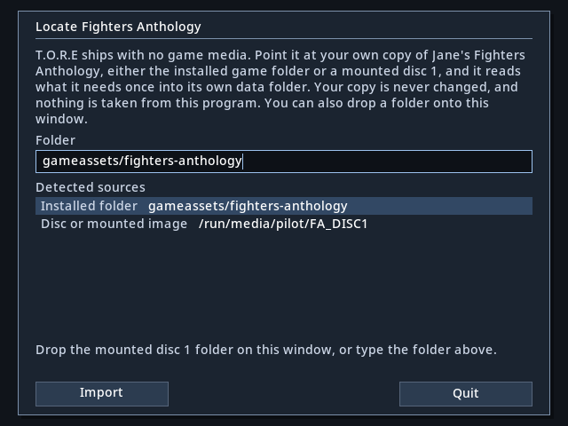
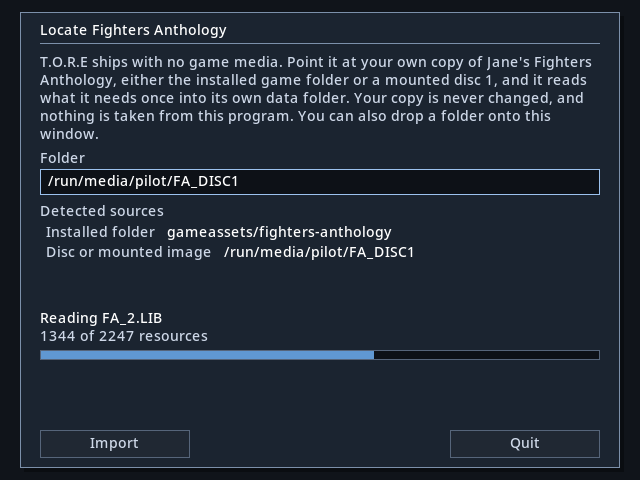
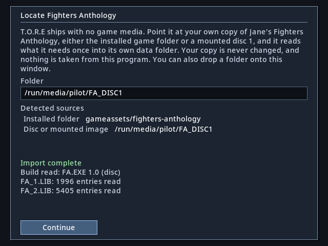
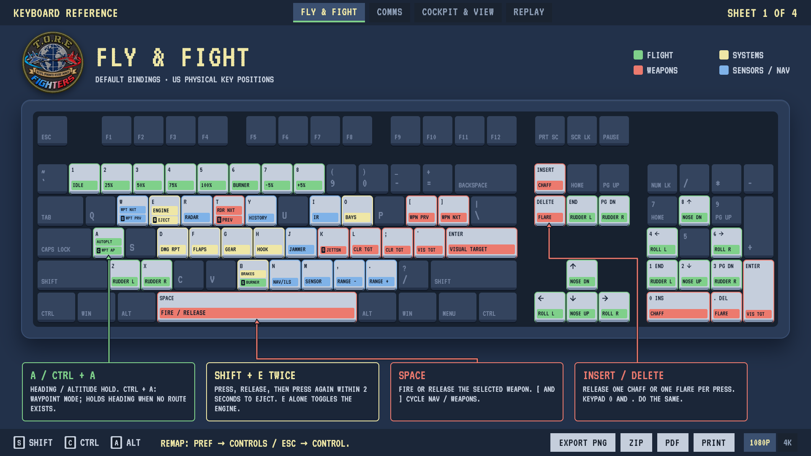

<p align="center">
  
</p>

<h1 align="center">T.O.R.E-Fighters</h1>

<p align="center"><em>Tasteful Opinionated Reverse Engineered: a native Rust rebuild of Fighters Anthology</em></p>

<p align="center">
  <a href="https://github.com/john-overton/T.O.R.E-Fighters/actions/workflows/ci.yml"></a>
  <a href="https://github.com/john-overton/T.O.R.E-Fighters/releases"></a>
  <a href="rust-toolchain.toml"></a>
  <a href="docs/DEVELOPMENT.md"></a>
  <a href="LICENSE"></a>
  <a href="docs/ROADMAP.md"></a>
</p>

<p align="center">
  <a href="docs/formats/theater.md"></a>
  <a href="docs/FLIGHT-MODEL.md"></a>
  <a href="docs/baselines/weapons-systems.md"></a>
  <a href="AGENTS.md"></a>
  <a href="MODS.md"></a>
</p>

T.O.R.E-Fighters is a ground-up rebuild of Jane's Fighters Anthology in Rust. The
target is 1:1 gameplay parity **by expression of feature**: you should experience
what you experience in the original game. It is not a recreation of the original
program's code. Bring your own retail copy, no retail game data ships in this
repository, and the original executable is never run.

Where the project is going is in [the roadmap](docs/ROADMAP.md). What is built
and what comes next is on one page in [the parity plan](docs/parity-plan.md). The
behaviour being rebuilt is described in [docs/spec/](docs/spec/).

## Getting started

You need your own copy of Jane's Fighters Anthology: either the game installed
on a computer, or disc 1. Disc 2 is not needed.

### 1. Install

Download the package for your computer from the
[latest release](https://github.com/john-overton/T.O.R.E-Fighters/releases).

| Platform | Package | First launch |
| --- | --- | --- |
| Windows (x86_64) | `.msi` installer | The build is unsigned, so SmartScreen warns you. Choose **More info**, then **Run anyway**. |
| macOS, Apple Silicon or Intel | `.dmg` for your processor | The build is unsigned. Right-click the app, choose **Open**, then confirm. If macOS still refuses, use **System Settings > Privacy & Security > Open Anyway**. |
| Linux (x86_64) | `.AppImage`, or `.tar.gz` | Make the AppImage executable (`chmod +x`), then run it. |

### 2. Point it at your game

On first launch T.O.R.E opens the **Locate Fighters Anthology** screen. There
are three ways to tell it where your game is:

- **Drag** the installed game folder, or the folder of your mounted disc 1, onto the window.
- **Pick** one of the **Detected sources**. T.O.R.E looks at mounted discs and the usual install folders for you.
- **Type** the folder path into the **Folder** box.

Then press **Import**.

<p align="center">
  
</p>

A disc image (`.iso`) is not read directly. Mount it first, then choose the
mounted folder.

### 3. Wait for the import

T.O.R.E reads what it needs from your copy once and keeps it in its own data
folder. Your copy is never changed. The import takes a few moments and shows
which archive it is reading.

<p align="center">
  
</p>

When the import finishes, press **Continue** to reach the main menu.

<p align="center">
  
</p>

Later launches go straight to the main menu. To import from a different copy,
use **Pref > Re-import media**, which opens the same screen again.

### 4. Fly

From **Choose Activity**, pick **Create Quick Mission**. Click the aircraft name
in Wing 1 to choose your aircraft, and the theater name in "You are flying
over…" to choose where. Press **OK** to fly.

<p align="center">
  <a href="https://john-overton.github.io/T.O.R.E-Fighters/tore-keyboard-map.html"></a>
</p>

Press **F11** in flight for keyboard help, or **Escape** for the flight menu.
The [interactive keyboard map](https://john-overton.github.io/T.O.R.E-Fighters/tore-keyboard-map.html)
has Fly &amp; Fight, Comms and Cockpit &amp; View sheets and exports to PNG, ZIP
or PDF. The [control reference](docs/FLIGHT-CONTROLS.md) lists every key, and
**Escape > Control** remaps keys, gamepads, joysticks and head tracking
([controller setup](docs/INPUT.md)).

If the game does not start, it writes logs and a crash report that help us find
out why. [Startup troubleshooting](docs/DEVELOPMENT.md#startup-logs-and-fatal-errors)
says where to find them. Bugs and questions are welcome in
[Issues](https://github.com/john-overton/T.O.R.E-Fighters/issues) and
[Discussions](https://github.com/john-overton/T.O.R.E-Fighters/discussions).

## What makes it T.O.R.E

The [feature matrix](docs/features.md) groups menus, flight models, weapons,
systems, and maps/weather. Checkboxes distinguish manual-described features from
opinionated additions; each row says what is completed, partially implemented
or planned, with remaining work and links to details.

Examples of opinionated additions: the shared radar and radar cross-section
tuning, authored landing behaviour, the modern input layer with head tracking,
graphics options such as MSAA and a spotting aid for distant aircraft, and
built-in startup diagnostics. Where the original's exact behaviour has not been
recovered yet, T.O.R.E uses a documented approximation labelled *fitted*. See
[behaviour provenance](docs/behavior-provenance.md).

## What works today

Version 0.1.0 completes most of [Milestone 1](docs/ROADMAP.md#milestone-1-faithful-quick-fight):
a quick fight from the original main menu, through Quick Mission setup and
flight, to the debrief.

**Menus.** The app launches into the original **Choose Activity** menu using
artwork, button pieces, proportional fonts, sounds and recorded music imported
from your own copy. The Quick Mission creator, the Load Ordnance screen and the
mission debrief use the original art too. All briefing fields are editable, and
mission systems that are not built yet are refused before launch.
[Testing steps and remaining gaps](docs/baselines/creator-ordnance.md).

**Aircraft and theaters.** Thirteen aircraft: F/A-18D, F-14D, A-4E, X-31 EFM,
Rafale C, MiG-29, Su-27, MiG-21, Su-25, MiG-23, Su-35, F-22A and F-22N
([roster and limits](docs/spec/roster-aircraft.md)). All 16 theaters and their
59 retail map variants, with original terrain, artwork, scenery, weather and
day/night palettes. Every base theater has airports with runways, targetable
buildings, tower radio and ILS guidance.

**Flight.** Cockpit and HUD that adapt to the window shape, instrument windows,
the retail view suite, and animated gear, flaps, airbrakes, hook and control
surfaces. Stalls, spins, runway wind, autopilot, ground starts for your whole
wing, and ejection. Simulation runs at a fixed 120 Hz, independent of rendering.

**Combat.** Guns with tracers and 25 working weapons, including four missile
guidance types with seeker search, pitbull activation, HUD cues and seeker
tone ([missile plan](docs/missile-update-plan.md)). One shared radar and
infrared sensor serves all thirteen aircraft from their own imported equipment:
the scope, click-to-designate contacts, jammer noise, RWR and the radar cross
section page ([what it models](docs/radar.md)). Damage, smoke, debris,
blackout and redout.

**AI.** Up to six wings and 29 AI aircraft per Quick Mission, each with its
own sensors, weapons, fuel and flight model, at four skill levels. They search,
engage, defend against missiles, fly formation, follow wing orders, take off
and land in turn, and head home when fuel runs low ([AI spec](docs/spec/ai.md)).

**Sound.** Radio chatter and wingman replies, a two-seat crew voice, and
in-flight music picked by the original's situation rules, all from your own
copy's recordings.

**Cheats.** The in-flight Cheat menu and the loadout Cheat button
([cheats](docs/spec/cheats.md)).

**Not yet:** surface AI (SAM sites, AAA, vehicles and ships as active
opponents), the remaining weapons, carriers, missions, campaigns, replay and
multiplayer. Multiplayer is [Milestone 2](docs/ROADMAP.md#milestone-2-multiplayer).

## Build from source

Rust 1.91.1 is pinned through rustup. From the repository root:

```sh
source "$HOME/.cargo/env"
cargo run --locked -p tore-app
```

A source build imports local `gameassets/fighters-anthology/` media, or the source it remembers, on first run without asking. If it cannot find media it opens the same **Locate Fighters Anthology** screen as the packaged game. To import another location from a terminal instead:

```sh
cargo run --locked -p tore-app -- --import /path/to/fighters-anthology
```

Use **? → Exit to Desktop** or close the window to quit. Escape dismisses a dropdown, Tab/arrows and Enter navigate, and M toggles music. `Pref` also toggles music and effects.

To check startup, render one frame, and exit without audio:

```sh
cargo run --locked -p tore-app -- --smoke-test
```

To redraw the first-run screenshots above without any game media:

```sh
cargo run --locked -p tore-app -- --snapshot locate.ppm --snapshot-state locate
```

The `locate-importing` and `locate-done` states draw the other two.

See [development setup](docs/DEVELOPMENT.md) for fresh-machine setup, Linux/Windows prerequisites, checks, and troubleshooting.

## Fly from the command line

```sh
cargo run --locked -p tore-app -- --free-flight --aircraft f18
cargo run --locked -p tore-app -- --free-flight --aircraft rafale --theater FRA
cargo run --locked -p tore-app -- --free-flight --aircraft f14
```

The default flight model is the researched hybrid adapter (`--researched-flight`).
Two research options are selected explicitly: `--legacy-flight` preserves the
older compatibility model, and `--native-flight-tables DIR` runs a restricted
build from statically extracted tables. See [the flight model](docs/FLIGHT-MODEL.md).

The development weapons range is `--live-fire --aircraft f18`, and accepts any of
the thirteen imported aircraft. Space fires, semicolon selects a weapon, backslash
resets the range, and T or a click on the radar page designates a contact.

## Explore the theaters

The free-camera terrain diagnostic remains available from the command line:

```sh
cargo run --locked -p tore-app -- --viewer
```

Arrow keys move, **Shift** moves 8× faster, **Q/E** or **PageDown/PageUp** lower/raise altitude, **A/D** turn and **W/S** look up/down. **Escape** returns to the creator, then the main menu. All 16 theaters are selectable. Launch a particular theater directly with `--viewer --theater TVIET` (Vietnam), for example. Weather uses a fixed midday preview; sun, moon, stars and cloud shapes are extracted for further recovery but are not yet rendered. See [recovery findings](docs/formats/theater.md) and [viewer validation](docs/baselines/ukraine-viewer.md).

## Extract assets for research

```sh
python3 tools/extract_assets.py --dry-run
python3 tools/extract_assets.py
# All 16 defined theaters and shared environment resources:
python3 tools/extract_assets.py --theater all --exclude-archive 'disc1/LHX/*' --out .local/all-theaters
```

This discovers and unpacks all supported archives into ignored `.local/extracted/`, preserving archive boundaries and writing a report with hashes. Use `--source` for other media and `--include "*.PIC"` for filtering. The app does not require this full extraction. See [the extraction guide](docs/EXTRACTION.md) for Windows commands, limits, and repeat-run behavior.

## Export aircraft to original FA

The [asset export guide](docs/fa-xx-developer-kit.md) covers the local conversion,
packing and validation tools, plus Windows installation. The F/A-XX exporter
creates a separate aircraft definition and shape family from the F-22N, with no
F-22 resource overrides. John confirmed flight and the fin-decal fix of the
earlier F-22A-based package in original FA.
The guide documents discrete animation limits and remaining compatibility checks.
Generated retail-derived files stay local; only tools and specifications ship here.

## Project guide

- [Contributions](CONTRIBUTIONS.md): how to help through GitHub Issues and Discussions, and the current pull request policy.
- [Roadmap](docs/ROADMAP.md): milestones and what 1:1 means.
- [Parity plan](docs/parity-plan.md): what is built, what is specified, what is next.
- [Feature matrix](docs/features.md): grouped features, manual/addition checkboxes and implementation status.
- [Behaviour specs](docs/spec/): what a player experiences, with numbers. This is the parity target.
- [Development](docs/DEVELOPMENT.md): environment and everyday commands.
- [Extraction](docs/EXTRACTION.md): shared script, filtering, output layout, and supported containers.
- [Architecture](docs/ARCHITECTURE.md): baseline choices and boundaries.
- [Behaviour provenance](docs/behavior-provenance.md): how origin is labelled, and why a label is not a gate.
- [Format research](docs/formats/coverage.md): recovered file formats and decode coverage.
- [Baseline evidence](docs/baselines/environment.md): what has actually been measured and verified.
- [Frozen archives](docs/research/progress.md): superseded plans and the dated progress log, kept for their research and evidence.
- [Local references](docs/REFERENCES.md): media and TypeScript reference locations, menu starting points.
- [Agent instructions](AGENTS.md): the authoritative rules for automated contributors.
- [Prompting cheat sheet](docs/PROMPT-CHEAT-SHEET.md): phrases that keep a request pointed at player behaviour rather than the original code.
- [Mods](MODS.md): what the license means for mission, theater, art and sound content.
- [Third-party notices](THIRD_PARTY_NOTICES.md): upstream attributions for engine code.

`crates/tore-app/` contains the native shell, `crates/tore-formats/` the shared readers, `crates/tore-extract/` the headless extractor, `crates/tore-sim/` the simulation kernel, and `crates/tore-input/` with `crates/tore-input-native/` the input layer. `tools/` contains portable extraction/research scripts and the asset guard. GitHub Actions builds and checks Linux, Windows, and macOS on both Apple Silicon and Intel.

Your game files belong in ignored `gameassets/fighters-anthology/`. The ignored `USNF-ATF/` checkout supplies reference specifications; it is not needed by the Rust importer or runtime. Music uses original recorded menu/briefing playlists and the NORMAL free-flight score. Optional `FA_4B.LIB` and `FA_4D.LIB` supply the recordings; MIDI and synthesis are not required. See [audio recovery](docs/formats/music.md). Run with `--no-audio` for a silent session.

## License

The engine, tools and documentation are licensed under the
[GNU General Public License v3.0](LICENSE). Mods are data the engine loads, not
derivative works of it, so your content stays under whatever license you choose;
[MODS.md](MODS.md) draws that line and explains the retail-asset rule. Playing
requires a legally owned copy of Jane's Fighters Anthology; no retail game data
ships in this repository.
