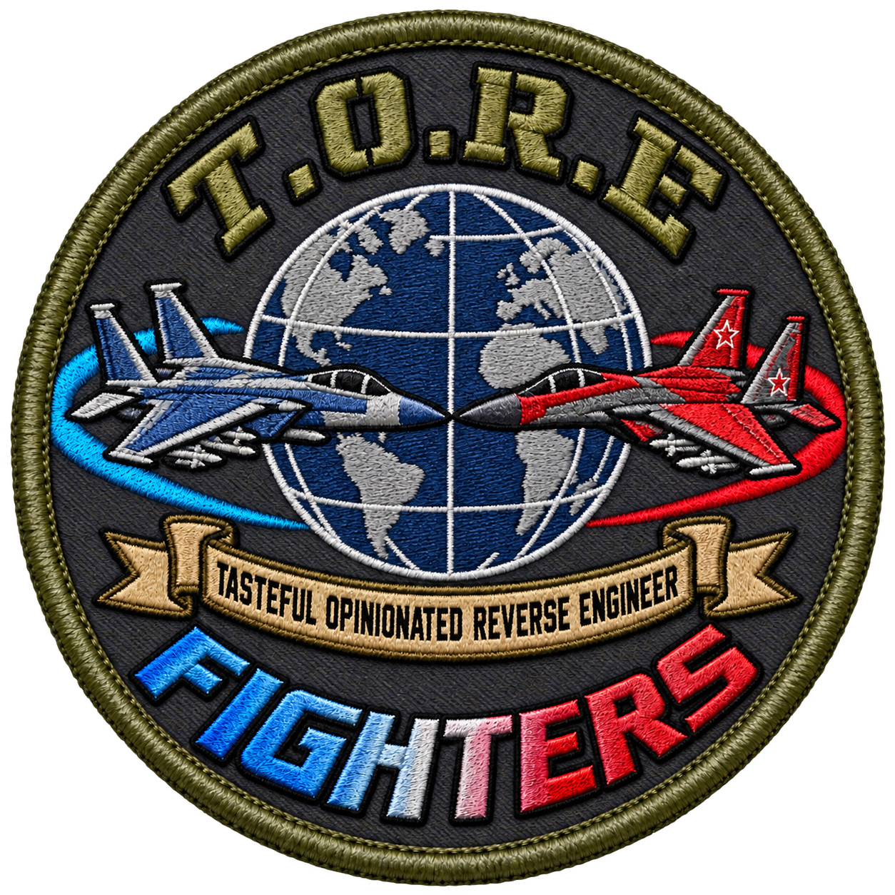

<p align="center">
  
</p>

<h1 align="center">T.O.R.E-Fighters</h1>

<p align="center"><em>Tasteful Opinionated Reverse Engineered &mdash; a native Rust rebuild of Fighters Anthology</em></p>

<p align="center">
  <a href="https://github.com/john-overton/T.O.R.E-Fighters/actions/workflows/ci.yml"></a>
  <a href="rust-toolchain.toml"></a>
  <a href="docs/DEVELOPMENT.md"></a>
  <a href="LICENSE"></a>
  <a href="docs/ROADMAP.md"></a>
</p>

<p align="center">
  <a href="docs/formats/theater.md"></a>
  <a href="docs/FLIGHT-MODEL.md"></a>
  <a href="docs/baselines/weapons-systems.md"></a>
  <a href="AGENTS.md"></a>
  <a href="MODS.md"></a>
</p>

T.O.R.E-Fighters is a ground-up rebuild of Jane's Fighters Anthology in Rust. The
target is 1:1 gameplay parity **by expression of feature**: you should experience
what you experience in the original game. It is not a recreation of the original
program's code. Bring your own retail copy, no retail game data ships in this
repository, and the original executable is never run.

Where the project is going is in [the roadmap](docs/ROADMAP.md). What is built
and what comes next is on one page in [the parity plan](docs/parity-plan.md). The
behaviour being rebuilt is described in [docs/spec/](docs/spec/).

## What works today

The app launches into the original **Choose Activity** menu using artwork, button
pieces, proportional fonts and sounds imported from your own Fighters Anthology
files. Each launch picks one of the five original backgrounds. Buttons animate;
`?`, `Pref` and `Multi` open dropdowns. Hovering is silent; sounds play on clicks
and toggles.

**Create Quick Mission** opens the original-style briefing: click the aircraft
name in Wing 1 or the theater name in "You are flying over…" to select, then
**OK** to fly. F/A-18D and Rafale C are available, on any of the 16 imported
theaters. All briefing fields are editable and unsupported mission systems are
validated before launch. Custom weapons opens the original-art Load Ordnance
screen with compatible weapon and fuel edits. Set enemy Wing 1 to zero for the
supported single-aircraft preview.
[Testing steps and remaining gaps](docs/baselines/creator-ordnance.md).

In the air: cockpit and HUD that adapt to the window aspect, screen-anchored
raster instrument windows, live cockpit mirrors, external and chase views, and
animated gear, flaps, airbrakes, hook and control surfaces. Momentum is carried
independently of nose direction, so loops rotate through vertical properly.
Weather uses the original day/night palettes, horizon, sun, moon, stars, cloud
sheets and fog maps. Simulation runs at a fixed 120 Hz independent of rendering.

Controller support is a hand-rolled binding layer: standard gamepads have default
bindings, and sticks, throttles, pedals and button boxes can use explicit
profiles. **Escape → Control** edits bindings and enables rumble in flight.
Instrument layouts, scope settings, cockpit/HUD/zoom and sound preferences
persist between sessions. Inspect hardware without loading retail media with
`cargo run --locked -p tore-app -- --list-inputs`.

A development weapons range supports manual weapon testing: all 135 imported FA
weapon definitions, arm/safe, sensor and range inhibits, damage-class fixtures,
station failure, jettison, ECM contact resolution and optional recording and
replay. Ordinary free flight stays externally clean.
[Capabilities and validation](docs/baselines/manual-weapons.md). Combat AI is not
started.

## Run locally

Rust 1.91.1 is pinned through rustup. From the repository root:

```sh
source "$HOME/.cargo/env"
cargo run --locked -p tore-app
```

On first run, local `gameassets/fighters-anthology/` media is imported into platform application data. Later launches use that cache. To import another location or refresh the menu, theater and aircraft assets:

```sh
cargo run --locked -p tore-app -- --import /path/to/fighters-anthology
```

Use **? → Exit to Desktop** or close the window to quit. Escape dismisses a dropdown, Tab/arrows and Enter navigate, and M toggles music. `Pref` also toggles music and effects. Replay/continue are disabled until those systems exist.

To check startup, render one frame, and exit without audio:

```sh
cargo run --locked -p tore-app -- --smoke-test
```

See [development setup](docs/DEVELOPMENT.md) for fresh-machine setup, Linux/Windows prerequisites, checks, and troubleshooting.

## Fly

```sh
cargo run --locked -p tore-app -- --free-flight --aircraft f18
cargo run --locked -p tore-app -- --free-flight --aircraft rafale --theater FRA
```

Arrows fly; PageUp/PageDown adjusts throttle; Shift-B enables afterburner.
F1/F2/F3 look forward/back/up, F10 selects the external view, Backspace toggles
cockpit art and Shift-0..9 toggles instruments. Look around with **Shift +
arrows**; **Shift + /** recenters. **Escape → Pref → Large windows?** switches
between four inset corner windows and six smaller bottom windows. Escape opens
the paused flight menu, Ctrl-P pauses and resumes, and F11 opens keyboard help.
See the [complete control reference](docs/FLIGHT-CONTROLS.md) and
[controller setup](docs/INPUT.md).

Two other flight paths exist alongside the default and are selected explicitly:
`--researched-flight` runs a hybrid adapter, and `--native-flight-tables DIR`
runs a restricted research build from statically extracted tables. Both are
research options, not the default. See [the flight model](docs/FLIGHT-MODEL.md).

The development weapons range is `--live-fire --aircraft f18` (or `rafale`).
Space fires, semicolon selects a weapon, backslash resets the range and T
designates.

## Explore the theaters

The free-camera terrain diagnostic remains available from the command line:

```sh
cargo run --locked -p tore-app -- --viewer
```

Arrow keys move, **Shift** moves 8× faster, **Q/E** or **PageDown/PageUp** lower/raise altitude, **A/D** turn and **W/S** look up/down. **Escape** returns to the creator, then the main menu. All 16 theaters are selectable. Launch a particular theater directly with `--viewer --theater TVIET` (Vietnam), for example. Weather uses a fixed midday preview; sun, moon, stars and cloud shapes are extracted for further recovery but are not yet rendered. See [recovery findings](docs/formats/theater.md) and [viewer validation](docs/baselines/ukraine-viewer.md).

## Extract assets for research

```sh
python3 tools/extract_assets.py --dry-run
python3 tools/extract_assets.py
# All 16 defined theaters and shared environment resources:
python3 tools/extract_assets.py --theater all --exclude-archive 'disc1/LHX/*' --out .local/all-theaters
```

This discovers and unpacks all supported archives into ignored `.local/extracted/`, preserving archive boundaries and writing a report with hashes. Use `--source` for other media and `--include "*.PIC"` for filtering. The app does not require this full extraction. See [the extraction guide](docs/EXTRACTION.md) for Windows commands, limits, and repeat-run behavior.

## Project guide

- [Roadmap](docs/ROADMAP.md): milestones and what 1:1 means.
- [Parity plan](docs/parity-plan.md): what is built, what is specified, what is next.
- [Behaviour specs](docs/spec/): what a player experiences, with numbers. This is the parity target.
- [Development](docs/DEVELOPMENT.md): environment and everyday commands.
- [Extraction](docs/EXTRACTION.md): shared script, filtering, output layout, and supported containers.
- [Architecture](docs/ARCHITECTURE.md): baseline choices and boundaries.
- [Behaviour provenance](docs/behavior-provenance.md): how origin is labelled, and why a label is not a gate.
- [Format research](docs/formats/coverage.md): recovered file formats and decode coverage.
- [Baseline evidence](docs/baselines/environment.md): what has actually been measured and verified.
- [Frozen archives](docs/research/progress.md): superseded plans and the dated progress log, kept for their research and evidence.
- [Local references](docs/REFERENCES.md): media and TypeScript reference locations, menu starting points.
- [Agent instructions](AGENTS.md): the authoritative rules for automated contributors.
- [Prompting cheat sheet](docs/PROMPT-CHEAT-SHEET.md): phrases that keep a request pointed at player behaviour rather than the original code.
- [Mods](MODS.md): what the license means for mission, theater, art and sound content.
- [Third-party notices](THIRD_PARTY_NOTICES.md): upstream attributions for engine code.

`crates/tore-app/` contains the native shell, `crates/tore-formats/` the shared readers, `crates/tore-extract/` the headless extractor, `crates/tore-sim/` the simulation kernel, and `crates/tore-input/` with `crates/tore-input-native/` the input layer. `tools/` contains portable extraction/research scripts and the asset guard. GitHub Actions builds and checks macOS, Linux, and Windows.

Your game files belong in ignored `gameassets/fighters-anthology/`. The ignored `USNF-ATF/` checkout supplies reference specifications; it is not needed by the Rust importer or runtime. Music uses original recorded menu/briefing playlists and the NORMAL free-flight score. Optional `FA_4B.LIB` and `FA_4D.LIB` supply the recordings; MIDI and synthesis are not required. See [audio recovery](docs/formats/music.md). Run with `--no-audio` for a silent session.

## License

The engine, tools and documentation are licensed under the
[GNU General Public License v3.0](LICENSE). Mods are data the engine loads, not
derivative works of it, so your content stays under whatever license you choose;
[MODS.md](MODS.md) draws that line and explains the retail-asset rule. Playing
requires a legally owned copy of Jane's Fighters Anthology; no retail game data
ships in this repository.
