# Initial architecture

> **T.O.R.E: Tasteful Opinionated Reverse Engineered.**
> The thing being reverse engineered is the *experience*, not the executable. We
> trace what a player does and what the game does back, down to the numbers they
> would notice. How the original code achieved it is history: useful evidence,
> never a blueprint. If a sentence below reads like an instruction to reproduce
> the original's internals, it is out of date.
> <!-- tore-header v2 -->

The M0 environment supports the M1a menu slice, the M1b renderer across all 16 theaters, and M1c free flight in twelve aircraft (see the [roster guide](aircraft-import.md)) plus a development weapons range. M0's full title census, salvage inventory, parity specification, and AI VM decision remain open.

| Component | Choice | Purpose |
| --- | --- | --- |
| Language | Rust 2024, compiler 1.91.1 | Reproducible native builds |
| Workspace | `crates/tore-app`, `tore-formats`, `tore-import`, `tore-extract`, `tore-sim`, `tore-input`, `tore-input-native`, `tore-diagnostics-native`, `tore-realtime-native`, `tore-replay`, `tore-world`, `tore-codec`, `tore-net` | Desktop shell and entry point, plus the format, import, extraction, simulation, input, host loop timing, mission recording, mission core, network encoding and network transport (both standard library only) crates |
| Window/input | `winit` 0.30 | Native window lifecycle and input |
| Graphics | `wgpu` 27 | Metal on macOS; native backends for Windows/Linux |
| Diagnostic facade | Existing `log` 0.4 and `tracing` 0.1 | Bounded app/backend logs without a logging framework |
| Startup bridge | `pollster` 0.4 | Wait for GPU initialization without a general async runtime |
| Audio device | `cpal` 0.16 | Native output for the small PCM mixer; [upstream API](https://docs.rs/cpal/0.16.0/cpal/) |
| Formats | Dependency-free `crates/tore-formats` | Bounded EALIB, raw-literal DCL, PIC/glyphs, a narrow CHOOSEAC DLG reader, BIT2, mission environment fields PL weather palettes, BRF aircraft/equipment, bounded SH projection and compiled FNT glyphs |
| Simulation | `crates/tore-sim` | Shared 120 Hz state/attitude, selectable hybrid dynamics, the shared aircraft sensor component and headless aircraft acceptance |
| Extraction | `crates/tore-extract` + `tools/extract_assets.py` | Title-independent archive discovery/extraction, safe output paths, provenance |
| Checks | Cargo, Python standard library, GitHub Actions | Local and CI checks |

These are baseline-compatible versions, not automatically the latest versions. Exact versions live in `Cargo.lock`. See upstream [wgpu 27 documentation](https://docs.rs/wgpu/27.0.1/wgpu/) and [winit 0.30 documentation](https://docs.rs/winit/0.30.13/winit/) for API contracts.

The shell creates its window on the main event loop and uploads a 640 × 480 RGBA menu canvas to a Metal/native GPU texture. The shader draws a scaled, letterboxed image using linear filtering. The same viewport calculation maps physical mouse coordinates back into retail coordinates, including Retina scaling. It handles zero-sized windows and recoverable surface loss. Fatal graphics/startup errors return a failing process status.

`tore-import` (`crates/tore-import`, standard library and `tore-formats` only, so a server can use it without the windowing, graphics and audio libraries) holds the whole import. Its `media_source.rs` decides what a chosen folder is by its contents: an installed game folder with loose archives, or a disc folder holding the Electronic Arts installer container (`SETUP.ESA`), whose stored archives are read in place by offset rather than copied. `tore-formats::executable` maps the executable's hash to one of the two reviewed builds and supplies that build's table addresses, so the disc's 1.0 build and the 1.02F patch decode the same content; an unknown build is refused before any archive is opened. Its `import.rs` selectively decompresses resources into a versioned local pack and verifies the pack from disk before the import completes, reporting progress by archive and resource count; `pack.rs` reads and writes the pack and loads the newest good one. The game's `assets.rs` calls it and adds what only the game needs: it validates and decodes the menu art, buttons, fonts and debrief art from the loaded resources (the library takes that check as a function, so a set the game cannot draw never reaches the cache). `menu.rs` composites original background, button pieces, and font strips and owns UI state. `renderer.rs` owns the surface, texture, and scaling. Every game object is built from imported assets before the window opens and the renderer needs a terrain world, so a first run cannot happen inside the game application: `main.rs` runs a pre-game shell, a second winit application handler holding `locate.rs` and the blit-only presenter in `canvas_present.rs`, on the same event loop through `run_app_on_demand`. Re-import from Pref ends the game application and runs the shell again; the event loop is created once. `audio.rs` mixes bounded local PCM, recorded music, and up to sixteen spatial voices with linear resampling into the device rate. `tore-sim::acoustics` advances sound wavefronts and passing-object detection at 120 Hz. Combat publishes bounded sound emissions with physical positions; the app uses the main camera as listener and the device mixer supplies stereo direction, distance gain and treble fade. An emission released by the player's own aircraft plays centered and without distance while the listener is in that cockpit; every other outside sound is muffled in a cockpit view. Up to ten looping sources (crash fires, other aircraft's engines) and, in external views, the player's own engine are placed with distance, stereo and Doppler pitch. See [audio behavior](audio.md). Explosions, craters and crash-site fires are drawn by `effect_renderer.rs` from the original sheets as textured sprites ([explosions](spec/explosions.md)). Audio initializes independently and can fail without blocking menus. No input device or microphone is opened.

The app and general extractor share the same EALIB/DCL readers. `Archive::open` reads a directory and seeks to selected resources; it does not load whole disc archives. The menu retains a 16 MiB resource cap; the general CLI has an explicit configurable cap for larger media. The Python entry point handles portable invocation and SHA-256 report enrichment; it contains no second decompressor.

Menu-only startup randomness chooses one of the five native backgrounds independently of future simulation state. The selected background's embedded palette colors shared sprites/fonts, and native bar offsets keep controls aligned. Hover/focus notifications do not enqueue audio.

Menu drawing uses CPU composition for this small static canvas; it is not a commitment to software-rendering flight scenes. The window sleeps while idle. Hover transitions and transient placeholder messages schedule temporary redraws. The fragment shader is authored source; it contains no retail bytes.


`tore-import` retains prior cache generations until a new import is synced and
validated from disk. Successful import and startup load remove older numbered
packs from that cache directory. Cleanup is best effort and does not touch
source media or extracted assets. [Retention contract](spec/import-cache.md).

## Startup diagnostics

`diagnostics.rs` installs a bounded `log` sink and panic hook at the start of
`main`, before preferences, assets and the event loop. Existing wgpu logging
and winit tracing feed the same sink. Startup stages and first presentations
are explicit checkpoints; simulation behavior and adapter choice are unchanged.
`startup.rs` owns unattended-dialog policy and media-free success, failure,
panic and synthetic graphics checks. Main-thread unwinding produces a fatal
report and a nonzero exit rather than resuming gameplay.

`tore-diagnostics-native` is a second narrow audited OS boundary. Its safe API
shows Windows MessageBox/AppKit errors without creating the game renderer and
writes Windows Application events. Linux notifications use an optional bounded
`notify-send` process. The app and simulation retain their unsafe-code ban.
The MSI registers the source against the executable's embedded message table.
The existing platform bindings and `log`/`tracing` dependencies are reused;
there is no additional GUI or logging framework.

`tore-realtime-native` is a third (slice EF-M). On macOS it gives the calling
thread a Mach time-constraint policy and holds an `NSProcessInfo` activity, so
the game's host thread and the dedicated server's loop wake for each 120 Hz
tick on time ([sleep and wait accuracy on each
system](#sleep-and-wait-accuracy-on-each-system-ef-x)); on Linux and Windows
both calls do nothing. It reuses the `objc2` and `objc2-foundation` versions
and features `tore-diagnostics-native` already uses (no new outside crate), and
not AppKit, so the headless server does not link it.

File paths, retention, fallbacks and failure limits have one home in the
[startup diagnostics contract](spec/startup-diagnostics.md). Release packages
exercise the actual staged and extracted executable; desktop installation
acceptance remains separate.

## Boundaries for menu work

Keep `tore-formats` independent of windowing and GPU APIs. The future simulation likewise needs to run headlessly with deterministic inputs. Avoid empty placeholder crates or premature engine abstractions.

Menu rendering should consume decoded palettes, indexed images, font data, and recovered layout geometry. Recover specifications from the TypeScript reference; implement runtime behavior in Rust. Do not introduce a web shell, copy the Three.js engine, or select a modern widget toolkit before checking retail geometry requirements.

Import user-owned media at runtime into platform application data. The v1 pack is a development cache of selected decompressed resources, not a stable mod/save format. `gameassets/` is a local source-media convenience, not a runtime bundle or save-data location. See [menu formats](formats/menu.md) for the current limits and provenance.

## First simulation renderer

World image pages share a bounded 1024-square array, with sixteen logical pages
per layer. `static_art.rs` retains large scenery pictures at source resolution
and clips face geometry at page boundaries. Material-local storage metadata
keeps rectangular aircraft/smoke images and paged world/weather art distinct.
All sample, palette-remap and shadow paths use the corresponding addressing.
[Source coverage and static variant composition](spec/terrain-detail.md).

`terrain.rs` (in `tore-world`) builds `Terrain` from the selected retail MM and its resolved T2: the grid, the airport scene and the weather clock, with the height, surface and wind queries the simulation uses. It holds no art and reads no environment variable. `scenery.rs` builds `Scenery` from the same resources and the finished `Terrain`: the named or numbered texture references, DAY2 variant palette, terrain mesh, sky art, static airport geometry and per-camera weather. Neither has a GPU or window dependency. `sim_renderer.rs` uploads geometry and a texture array, owns depth targets and draws terrain plus a fullscreen sky pass; `terrain.wgsl` supplies the initial perspective, sampling and fog. `renderer.rs` composes this scene with the transparent CPU HUD, resizing depth and surface together. This separation allows aircraft/object/weather passes and a deterministic simulation to be added without coupling format readers to wgpu.

The initial implementation uses full-resolution fixed triangles and an authored sky/fog projection. It is not the native adaptive renderer. All geometry/colors come from local source data at runtime; no retail derivatives are embedded. See [theater findings](formats/theater.md) for recovered versus authored behavior. The Hornet adapter now advances at 120 fixed ticks/second; the developer free camera still uses elapsed wall time for inspection.

The creator selects among all 16 base theaters. Scene replacement rebuilds the GPU vertex/texture buffers for that world; a variable texture-array layer count also supplies the sky shader's layer index. Only the active world mesh is built, while the bounded source bundle remains cached. Maps and fonts stay in the menu compositor. Source text shading is preserved when tinting; ARMFont/SMLFONT replace the unsuitable BODYFONT in the investigation UI and notices.

The Hornet slice adds dependency resolution and bounded BRF/SH/FNT readers to `tore-formats`. `tore-sim::flight` contains fixed-tick state/integration without wgpu/winit dependencies; the app re-exports its interface; `aircraft.rs` adapts imported geometry and camera poses, and holds `Airframe`, which wraps the simulation's `AircraftType` (`aircraft_type.rs` in `tore-world`: the imported profile, flight model, sensors and engine outlet points, with no art) beside the drawn half. `instruments.rs` renders independent small rasters from flight/equipment state, each framed by the aircraft's own original instrument window picture (named by its HUD) and coloured every frame through the live cockpit palette, as the cockpit art is; page content draws in coordinates relative to the 138×114 screen ([bezel spec](spec/instrument-bezel.md)). The GPU terrain pass now accepts an aircraft vertex stream and original rectangular atlas with shared depth; front/other instrument cameras render offscreen. CLI extraction and cache import share the same dependency resolver. These adapters do not execute imported x86 modules. See [aircraft evidence and open questions](formats/aircraft.md).

`surface_lighting.rs` owns three geometric shadow maps and the shared light
uniform. `surface_lighting.wgsl` supplies continuous diffuse response, solar
warmth, orientation-dependent fill, painted-panel highlights, cloud transmission
and shadow sampling to terrain, aircraft and weapon
surfaces; sky/cloud shaders share its solar tint helper. Opaque batches enter
the shadow pass before the world pass. Partial sunrise/sunset uses the solid
disc's visible area and segment centroid for direct light and shadow direction.
Manually filtered depth neighbors each use receiver-plane correction and
continuous blocker weights. The bounded penumbra filter combines caster
distance with smooth camera-distance antialiasing. Terrain has a separate
stream of area-weighted shared normals for lighting; shadow depth still uses
actual triangles. Smooth sky, glare and shadow directions share fractional
weather-clock time. Sun-disc strength and geometric visibility are independent
of the sunglare toggle. Terrain alone reduces low-sun ambient fill on unexposed
slopes; exposed ridges, aircraft and water retain their existing response. Smooth aircraft geometry is complete,
including faces hidden from the camera, and hiding the player in cockpit view
does not remove its shadow caster. Material layer -6 identifies emissive combat
effects and -7 identifies textured flame sheets. Glass and flame sheets do not
cast solid shadows; ordinary cutout surfaces cast only their opaque texels. Stepped
mode retains palette lighting and camera face rejection. See the
[surface specification](spec/surface-lighting.md) for fitted limits.


`flight_views.rs` resolves manual-described camera relations from read-only flight,
combat and wing snapshots. The camera rig owns only presentation state: the
reference, last player missile, fixed fly-by position and saved Other View.
Weather, spatial audio, main rendering and the Other View panel use the same
camera rules. Remote aircraft/missile interior cameras hide the reference body without removing
it from simulation. A replay builds the same scene from recorded poses, and any
aircraft can be the reference. [Behavior and fitted constants](spec/flight-views.md).

`flight_ui.rs` owns desktop command dispatch, the imported menu's flight actions, session presentation settings and pause state; the menu's navigation, hit geometry and drawing are `pause_menu.rs`, shared with the replay viewer. `hud.rs` draws the forward-flight HUD from state and source font glyphs, projecting the ladder/path through the renderer's 60-degree camera convention. Simulation remains independent of both. The full-canvas cockpit is transparent art over the world; instrument windows are independent rasters. Menu/focus pauses stop fixed ticks and engine loops, and input transitions clear held controls. Shader zoom is shared by terrain and sky projection; camera previews restore the main camera before drawing.


`flight_canvas.rs` now composes the flight-only overlay at an aspect-responsive size (physical drawable, proportionally capped at 1920×1080). The separate GPU cockpit pass preserves uniform cover-fit in the centered forward view, and instrument layout rectangles anchor to actual edges. Native instrument rasters go directly to their destination sizes instead of passing through a reduced 640×480 composite. The original cockpit texture is uploaded once; unchanged scaled panel rasters are cached. Alpha-aware filtering prevents dark transparent borders. `renderer.rs` recreates its UI texture when dimensions change and uses the full viewport for flight; menus/viewer overlays retain their existing canvas. Pointer conversion uses the same responsive panel rectangles, while the centered pause menu retains menu coordinates. HUD metadata uses a 0.7225 layout scale, including the requested additional 15% reduction. Projection compensation preserves angular cues through resizing and portrait aspect.

`tore_sim::autopilot` owns captured heading/altitude, mode and an optional
world-space navigation target. `State::step_surface` consumes mode switches,
applies pilot override and generates control deflections before the selected
flight adapter runs. The HUD reads this state. See the
[autopilot specification](spec/autopilot.md).

### Flight presentation and measurement

`flight::State` remains authoritative at 120 Hz. `main` retains the preceding tick for render-only pose interpolation (shortest-path wrapped angles); pause/crash show authoritative state and restart resets history. Camera, exterior geometry and HUD consume the same presented pose. Everything else combat draws is captured once per tick, after the AI step, as a plain-data `RenderSnapshot` (`snapshot.rs`, which holds the pose types, the devices, `interpolate` and `blend`, and no drawing code): other aircraft with their devices, damage and wreck state, fixtures, weapons, effects, debris and ejected pilots, plus the player's own pose. Combat keeps the last two snapshots (`previous_snapshot`, `render_snapshot`), and the app's `CombatView` (`combat_view.rs`) holds the frame's tick fraction and blends them; the main view, mirrors and camera panels draw that blend through the shared `aircraft_batches` and `combat_geometry` helpers of `render_snapshot.rs` (the vertex building, with `CombatArt` and the afterburner light helpers), with the art and the other aircraft's models from the view, which a mission replay uses to draw a recording, so both show the same picture. Each pose also carries whether its afterburner flame lights the scene; the shared `afterburner_glow`, `target_glows` and `engine_outlets` helpers turn those into lights at the presented poses. Chaff and flares are not part of the snapshot: live flight hands the countermeasure renderer the combat state's devices, and a replay the same devices flown again from their recorded releases (`replay/devices.rs`). `replay/convert.rs` turns each snapshot, plus flight data it does not carry, into a `tore-replay` frame and a decoded frame back into a snapshot; a synthetic round-trip test draws both through the shared helpers and requires every vertex within the format's 1/64 ft position precision. Reset clears that history. AI gear, flap, hook, brake, bay, exhaust and control-surface samples use that
same render fraction; an aircraft whose AI stopped flying holds its last
devices, and fixtures retain their fixed devices. Audio consumes
authoritative state. No renderer smoothing feeds back into physics.

World camera depth uses `Depth32Float`, storing the near plane at depth 1 and
the far plane at depth 0. Using the near and far distances, the vertex shader computes clip Z as
`near * (far - view_z) / (far - near)`, then perspective division yields depth.
Depth clears to zero and nearer fragments compare greater. The existing near
plane and 2,200,000-foot far limit remain. Aircraft, terrain, static objects,
clouds, smoke, vapor, chaff, flares, flare glare and the spotting aid use
this same mapping. The separate
orthographic shadow maps keep their existing depth convention. This is an
agent-selected host correction for distant surface flicker; see
[NVIDIA's depth-precision analysis](https://developer.nvidia.com/blog/visualizing-depth-precision/).

Theaters are about a million feet across, where a 32-bit float steps 1/8 foot,
so aircraft built in world coordinates snapped a little differently every
frame and shimmered in exterior views. Camera positions are kept in f64, and
each frame `Scenery::set_origin` picks a render origin: the camera position
snapped to a 1,024-foot grid, shared by every camera that frame. Aircraft,
ejected pilots, weapons, debris, tracers and effects are built relative to it
(`Scenery::local`), and the scene uniform carries the origin and the camera's
exact offset from it. `object_vertex` and `shadow_object_vertex` place those
vertices through the offset; terrain and airports stay in world coordinates
and reach the camera through the origin, so only their own storage rounding
remains. Smoke, vapor and countermeasures stay in world coordinates. An origin
of zero reproduces world-coordinate vertices exactly. Target-window framing
converts those relative mesh vertices back to world positions before fitting
them against its world-space camera.

Active simulation views request the next redraw without a post-render timer; AutoVsync and a requested maximum frame latency of one provide presentation backpressure. Idle menu behavior is unchanged. Failed/zero-size presentation does not continually schedule simulation redraws. `performance.rs` provides opt-in bounded CPU wall-time sampling via environment variables, with warmup exclusion and view cycling.

The GPU cockpit texture survives view and size changes; projection uniforms track the current aspect. Aircraft GPU resources are prepared when the renderer/theater loads. Live camera panels submit bounded asynchronous readbacks (at most one pending per camera page), consume completed rasters on later frames, and retain their last image while pending. The simulation renderer caches world-pass attachments (depth, multisampled colour and the render-scale image) for up to five output sizes, so the display, mirrors and 138×114 panels do not reallocate at every refresh. World pipelines live together in `sim_renderer::Pipelines` and are rebuilt when the anti-aliasing sample count changes. After the world pass, an optional resample pass scales the render-scale image to the output, and the spotting-aid pass draws single-sampled outlines using the world depth; `graphics.rs` holds the options and the [graphics options](spec/graphics-options.md) page specifies them. Offline captures retain an explicit blocking readback so smoke evidence contains the requested image. Direct GPU panel composition, full GPU UI rendering and native terrain LOD remain future optimization work.

`look.rs` owns authored held-key classification, look limits and exterior spherical orbit. Shift arrows are isolated from flight input and retain their look classification until physical release, including after modifier changes; Ctrl arrows, FA's thrust vectoring, do nothing yet. Camera motion uses elapsed presentation time while unpaused. Internal elevation is limited to the forward eye line through overhead; exterior orbit keeps a fixed radius and aims at the same interpolated aircraft pose. It does not alter simulation state or synchronously capture the GPU.

### The frame loop under load

Every rendered flight frame turns the wall time since the last frame into
simulation ticks: `flight::Clock::steps_scaled` clamps the elapsed time to
0.25 s, multiplies it by the time compression (0.5x to 8x; the `C` key steps
1x, 2x, 4x, 8x), and cuts it into 120 Hz ticks, carrying the remainder. The
frame then runs **every one of those ticks, stepping the mission and
presenting each, before it draws anything**. There is no cap on the ticks a
frame may run. John decided on 2026-10-02 to keep it that way: a cap would
keep the picture moving at a minimum rate, but the rate reached would fall
short of the one chosen, which a player would see as time running slow.

What that means under load, by the loop's arithmetic:

- A tick that costs `c` seconds of wall time keeps up at time compression `K`
  while `120 * K * c`, plus the drawing, stays under one second per second.
  At 8x that is under about 1 ms a tick.
- Past that the frames grow, until the 0.25 s clamp holds them. A frame then
  runs at most 240 ticks at 8x (120 at 4x, 60 at 2x, 30 at 1x), takes
  `240 * c` plus the drawing, and the rate reached is the 2 s of mission time
  it buys divided by its wall time: `2 / (240 * c + draw)` at 8x. An average
  tick of 4 ms holds 8x down to about 2x.
- A single slow tick is a hitch in one frame, and at 8x the same slow tick
  comes eight times as often in wall time. That is how the firing estimate
  below showed worst at 8x.

Measured on 2026-10-02 (agent PF1b; Ryzen 9 7900X, 64 GB, RTX 4070, release
build, one window, no audio; the Hornet with the AIM-120 selected and the
nearest target designated; three runs of each, before and after taken
alternately; `TORE_PERF_FRAMES` with [its "simulated:"
line](DEVELOPMENT.md#flight-performance)). The default Quick Mission is two
AI aircraft; the heavy one is `--launch-quick-mission --probe-fight 15:15`
(29 AI aircraft). "Sim+cam" is the report's simulation-and-cameras time per
frame, the ticks plus the camera panels, in milliseconds.

| Mission, asked for | Build | Rate reached | Frames a second | Sim+cam mean | Sim+cam worst frame |
| --- | --- | --- | --- | --- | --- |
| Default, 1x | before | 1.00x | 66.7 (66.5 to 66.9) | 1.87 | 41 (40 to 41) |
| Default, 1x | after | 1.00x | 67.3 (65.5 to 68.3) | 1.68 | 26 (21 to 35) |
| Default, 8x | before | 8.00x | 61.7 (61.7 to 61.9) | 2.67 | 115 (112 to 116) |
| Default, 8x | after | 8.00x | 62.7 (62.2 to 63.2) | 2.51 | 34 (33 to 34) |
| Heavy, 1x | before | 1.00x | 54.5 (53.9 to 54.8) | 7.52 | 52 (52 to 52) |
| Heavy, 1x | after | 1.00x | 55.8 (55.5 to 56.1) | 7.37 | 34 (33 to 35) |
| Heavy, 8x | before | 7.72x | 55.3 (55.1 to 55.4) | 11.45 | 623 (623 to 623) |
| Heavy, 8x | after | 7.79x | 55.2 (54.2 to 55.8) | 11.40 | 553 (551 to 554) |

The heavy 8x runs are the long ones (about 38 s of wall time, about five
minutes of mission); a shorter set over the first minute or so reached 6.92x
before and 7.14x after. The 550 to 640 ms frame in every heavy 8x run, before
and after, fits a clamp frame (240 ticks at about 2.3 ms); the range estimate
does not cause it.

Neither mission reached the 0.25 s clamp for long, and the rate at 8x was
never lower than at 2x or 4x. PF1's earlier report was a heavy mission at 8x
reaching only about 3.5x at about 4 frames a second after its first minute,
and 8x slower than 2x was not reproduced in its 72 runs. These runs did not
reproduce the 3.5x either, on the same mission and the same code before the
change; they differ by running without audio, so the cause of a rate below
2x, if one exists, is still unexplained. It would take a tick costing more
than 4 ms on average.

#### The firing estimate and its exact shortcuts

While a missile is selected and a target is designated, each ownship works out
the weapon's maximum range and favourable firing band every 60 ticks
(`maximum_range` and `firing_band` in `tore-sim/src/combat/missiles.rs`,
called from the combat step). Both fly trial missiles through `intercept`, the
same 120 Hz fly-out the guidance uses, about twenty trials in all, each up to
the weapon's whole flight (an AIM-120 about 3,600 ticks, an AIM-54 about
10,200). PF1 measured that at 37 ms for one tick (AIM-120, default mission) to
100 ms (AIM-54): a hitch every half second of mission time, every 62 ms of wall
time at 8x.

Three shortcuts skip only trials whose answer is already fixed, so every
number the player sees is the same, bit for bit:

| Shortcut | Why the answer cannot change |
| --- | --- |
| `maximum_range` does not fly a distance that the missile and the target cannot close within the weapon's whole flight (`travel_ceiling`: the speed the motor could reach with all its thrust spent in a line, the coast slowdown, the largest sag or ejection speed, and the target's own speed) | `intercept` succeeds only once the closest approach is within 25 ft, and a tick closes the gap by no more than the two objects move; the old code flew the whole trial to answer no |
| `firing_band` stops a trial once a hit could no longer score 70 (a binary search for the latest hit time that still scores 70) | the band uses only `score >= 70`, and a later hit never scores higher than an earlier one |
| `intercept` checks every 16 ticks while the missile coasts whether the gap is more than missile and target can still close, and stops with the answer it would have reached, no hit | out of fuel the missile only slows (a turn costs speed, the coast slowdown takes it), its sag is capped, and the target keeps its speed (`coasting_reach`) |

Each bound carries a small rounding margin (`unreachable`). The tests in
`missile_tests.rs` hold every shortcut to the old code: whole copies of the
old `maximum_range`, `firing_band` and `intercept` run beside the new ones on
random missiles, speeds, distances, motions, ages, sag, ejection and cruise
profiles, and must agree to the last bit. The cases include late hits the
bounds must not cut off, and a built case where only the fall of a coasting
missile reaches the target. A bound made 10% too small, or one that forgets
the sag, fails them. The work is bounded without timing:
`a_range_estimate_flies_a_bounded_number_of_ticks` counts the ticks
`intercept` flew (a counter compiled only into test builds) for a fixed set of
three missiles and six targets, and fails above 1,500,000 ticks. It flies
1,231,686; the old code flew 2,187,517, so a change that brings the cost back
goes over the bound. The shortcuts cut the ticks flown by about 44 percent.

The worst frame in the table is the estimate's cost: 41 to 26 ms and 115 to
34 ms in the default mission at 1x and 8x, and 52 to 34 ms in the heavy one at
1x. The mean frame improved by 0.1 to 0.2 ms and the rate reached did not
change within the spread, because the estimate is one tick in sixty.

### Continuous attitude and momentum

`attitude.rs` supplies body bases, Rodrigues rotation, orthonormalization, and render interpolation. `flight::State` retains separate world velocity and pitch/roll response rates. The old pitch clamp and nose-derived position update are removed. Force integration and attitude response remain deterministic at 120 Hz; render interpolation does not feed back. `look` uses the same body basis for head rotation, while exterior orbit retains aircraft-centered inspection behavior. The HUD flight-path marker projects actual velocity bearing/elevation.

`cockpit_renderer.rs` and `cockpit.wgsl` project the complete original forward artwork and the 640×480 HUD raster through one aircraft-fixed plane. Relative eye/body axes move both layers together during head-look, independently of aircraft attitude. The pass draws after the world and before screen-anchored instruments/menus, including offline captures; camera instrument readbacks exclude it. A cached source-size glass mask follows the cockpit transform and clips the HUD when cockpit art is visible. The shader composites masked HUD behind cockpit art and mirror contents; cockpit-off/wide view bypasses the glass mask. Linear premultiplied sampling preserves transparent borders. HUD uploads and uniforms are nonblocking; resize does not rebuild the source texture. The sky shader projects SKY0 onto a finite hemisphere disk with `ray.xz / (1 + max(ray.y, 0))`, avoiding the latitude/longitude singularity and seam at zenith. Native sky mapping and full 3D cockpit geometry remain unimplemented; the projected source plane has finite coverage and cannot provide a rear/overhead interior.

The shared hybrid adapter and its recovered-versus-fitted boundaries are specified in [FLIGHT-MODEL.md](FLIGHT-MODEL.md). Scalars resolve once when constructing the aircraft-owned typed configuration; immutable model data are shared by presentation snapshots and envelope queries allocate no temporary hit vectors. Renderer-specific Hornet animation tests remain in the app.

Aircraft-specific fitted laws live in `tore-sim::models::{f18,rafale_c}`, selected
through `AircraftModel` and the `FlightModel` interface. Each owns independent
validated configuration covering mass, propulsion, envelopes, recovered departure/contact limits, equipment response and tuning. `State` holds the selected model; `Research` holds only evolving departure/contact/clock state. Updates take no raw aircraft argument. Integration and recovered algorithms are shared components.
`tore-sim::telemetry` exposes gauge-independent air/ground/altitude channels with
explicit units and unavailable sensor readings; analog gauge presentation must
remain downstream of this interface. See [model extension guide](FLIGHT-MODEL.md).
`State::trace` keeps a write-only `FlightTrace` of the last step's values and
applied effects with their causes, for the telemetry panel and replay logs;
nothing in the simulation reads it and it takes no part in state equality
([telemetry record](FLIGHT-MODEL.md#telemetry-record)).

## Shared physical input

Replay drone controls use an app-owned `tore-input::Resolver` with the drone
catalog entries and the saved profile. Replay keyboard/mouse assignments have
separate device names, so editing them cannot remove flight bindings. The host
routes normalized device events to the viewer and clears holds on focus or
device loss. These controls move only the presentation camera, not the sim.
See [replay controls](INPUT.md#replay-viewer-shortcuts).

`tore-input` is a dependency-free safe Rust crate for physical control bindings,
calibration, per-source contribution/ownership, context release rules, typed pilot
frames and bounded input tapes. `tore-sim` consumes those frames at 120 Hz and no
longer interprets keyboard names. Aircraft configuration and control response stay
in the respective model modules. The app translates keyboard/menu actions and
routes instrument focus to the existing stock controls.

`tore-input-native` owns a dedicated bounded device worker: Linux evdev/rumble,
Windows raw-controller readings/Gamepad vibration, and macOS GameController/
CoreHaptics plus generic HID queues. Apple gamepad input and haptics share the same
retained controller; public HID support queries suppress duplicate raw endpoints. It and the diagnostics boundary
permit audited unsafe platform FFI; `libc` and `windows` are thin platform bindings,
not a third-party input policy engine. Main-loop discovery never blocks a flight
frame. Presentation-only look resolution cannot change pilot-axis ownership.
It also runs the head-tracker receiver: a safe `std::net` loopback UDP socket on
its own thread that reads opentrack poses. Head and mouse look add to the
presented look angle only; they never touch pilot axes or the simulation.
See [contracts, platform limits and profile syntax](INPUT.md).

The app's input configuration screen (`controls_editor`) is one component opened
from the main menu and the paused flight menu. It owns a draft
`tore-input::Profile`; native capture is isolated from menu/gameplay dispatch.
`input_catalog` is the single table of listed actions and stock keyboard/mouse
assignments; it drives the screen's rows, stock-key remapping (`disable`
directives) and the generated [controls master list](CONTROLS.md). Canonical serialization validates
before file replacement and live rebaselining. General display/instrument/sound
preferences use a separate bounded versioned file and persist independently of
flight/aircraft state. Smoke/capture/performance diagnostics bypass those preferences.
Afterburner feedback combines a renewable finite low rumble with the engagement
impulse; context loss cancels both, without changing authoritative flight state.

## Manual combat and systems

`tore-sim::combat::live` owns the deterministic manual range at 120 Hz. Typed
configuration resolves each supported PT’s loadout, SEE/ECM equipment and damage
table once; mutable ammo, projectiles, hit points, subsystem counts and
adapter RNG remain in state (per ownship for the aircraft's own fields, see
[Combat: one ownship per human-flown aircraft](#combat-one-ownship-per-human-flown-aircraft)). Contacts are no longer its own: it holds a
`tore-sim::sensors` live state, feeds it ownship pose, equipment state and the
observable targets each tick, and asks it whether a specific target is supported
before a radar weapon launches. Physical airborne presence is separate from
destroyed combat state, so hit points reaching zero does not erase a return.
`combat::systems` contains bounded translations of
reviewed ECM probability and damage-selection helpers. Unknown native subsystem
side effects remain explicit gaps; the service reproduces combat behaviour rather
than reconstructing the original executable's combat tick.

`combat::ledger` records every projectile from its first step to its outcome
(hit with damage, missed, spoofed by a decoy, jammed), keyed by shooter,
intended target and retail weapon class, plus credited kills and each target's
last attacker. Nothing in flight reads it. The evaluator in `tore_world::debrief`
turns it into a report, and the app's `debrief.rs` keeps the screen that draws
the post-mission pages; `ai_wings.rs` (in `tore-world`) supplies the intended target of AI gun rounds and
reports decoyed missiles. See the [debrief spec](spec/debrief.md).

`combat::gunsight` supplies a renderer-independent fixed-step gun solution using
live projectile speed/drop helpers and current radar observations. `weapon_hud`
draws its pipper/range arc and projects a selected target into a square or edge
chevron. Combat retains a separate display-only target identity through sensor
loss; this never substitutes for `sensors` launch support or radar observations.
[Behavior and evidence](spec/gunsight-targeting.md).

`ai::gunnery` uses the same trajectory solver with explicitly permitted visual
or sensor observations. The controller chooses gun tracking through ordinary
flight inputs and authorizes individual rounds. `ai_wings` rechecks barrel
alignment after flight movement, debits one round only when emitting it, and
launches along the mounted forward axis. Shared live combat applies dispersion
and collision, excluding the shooter. See [gun employment](spec/ai-gun-employment.md).


The app merges independent keyboard/controller trigger holds, dispatches explicit
commands and consumes confirmed events for instruments, graphics, audio and the
bounded feedback mixer. Two-control modifier bindings consume their base controls
and require neutral release across layer/context changes. Native feedback errors
disable that device’s feedback until reconnect; finite leases and context stops
bound rumble. Combat notices reuse the existing HUD line and expire in simulation
ticks, so pause does not age them or expand overlay composition work.

Version-3 combat tapes record service inputs including jammer state, the player
sensor controls (channel, display range and history) and explicit fixture
commands; a designation is recorded by stable target identity, never by screen
coordinate. Replays validate identity/assets and reproduce combat state,
including adapter RNG and subsystem failures. Version-2 tapes still replay with
the default sensor controls; version 1 rejects explicitly. This
is combat-service determinism: it reproduces combat state, not a full application
replay. See [contracts, validation and limitations](baselines/weapons-systems.md).

## Additional aircraft

The aircraft registry includes F-14D, A-4E, X-31 EFM and the seven
[roster additions](spec/roster-aircraft.md). Each owns a typed
model configuration; presentation rigs remain in tore-app. Shared combat resolves
the selected identity's sensors by parsed record channel, never by aircraft name,
and reads its PT stations. Audio switching clears old
aircraft voices. See [aircraft behavior](spec/additional-aircraft.md).

The optional user-supplied [engine material](spec/engine-material.md) replaces reviewed burner
face materials at runtime. Its throttle glow is separate from the retail atlas
and does not change A-4E presentation or flame geometry.

Researched flight is now the default; `--legacy-flight` preserves the previous
model. HUD and audio share the [stall warning signal](spec/stall-warnings.md),
including the original imported warning samples.

Aircraft-owned exterior fits for the seven roster additions live in
`roster_animation.rs`, with reviewed source branch membership in
`additional_animation.rs`. The [animation contract](spec/aircraft-animation.md)
defines their presentation. F-22 bay fraction advances at the shared 120 Hz;
the renderer interpolates it, and manual combat can request it without changing
launch eligibility. Exterior canopy grading is a mesh material, independent
of cockpit artwork and world-view rendering. Its nearest surface is resolved
in a depth-only pass, then blended at 75% opacity over the opaque scene.

## Shared sensor boundary

`tore-sim::sensors` is one component serving all twelve imported aircraft. There
is no aircraft-specific radar code: `profile` normalizes each PT's own SEE and
ECM records into typed capability profiles resolved by parsed signature channel,
`signature` holds the single observer-relative aspect function, `detection` holds
the authored range model, `track` holds the live state (current observations, one
selected target, at most one acquired fire-control track across radar and
infrared, bounded history and received interference), and `passive` collects
received emitters for the exposure instrument. An unreviewed radar or ECM record
is an import error rather than a silent substitution.

The component decides what is observable and whether a specific target is
supported for a radar weapon. `tore-app::scope` only reprojects those shared
observations for drawing and picking, so the page cannot make a hidden target
selectable, and one projection serves both drawing and the mouse pick.
`instruments.rs` draws pages 9 and 0 from that input. Player controls (channel,
display range, history) travel as a per-tick input, which is why the combat tape
reproduces them. The flight adapters and renderer independence are unchanged.
[What is modelled, what is authored tuning and what is deferred](radar.md);
[what was validated](baselines/radar.md).

Missile profiles and the fitted finite-boost motion predictor live in
`combat::missiles`, independent of rendering. Its 120 Hz prediction shares live
lead steering, turn limits, maneuver losses and propulsion. The live adapter
refreshes the bounded maximum-range search at 2 Hz per selected observed target. The live adapter uses full release
velocity for accepted missile profiles; compatibility retains scalar source
motion. Explicit target role is separate from damage category. Launch-origin
minimum-range qualification persists through terminal closure, as specified in
[engagement rules](spec/missiles.md#minimum-engagement-and-target-role). Combat tape version 4 includes world velocity and bay permission, while versions 2 and 3
select compatibility rules. [Missile specification](spec/missiles.md).

Combat tape version 5 records radar power separately from transmission, preserving
passive-channel behavior and radar-off unguided releases. Versions before 5 imply
power on for the new guidance gate. Version 4 remains the missile rule-version boundary. Seeker mode and
controlled target heat/emission changes are recorded commands; seeker observations
and acquisition are reproduced from those inputs, the matching asset fingerprint
and terrain. `--combat-command compatibility-weapons` explicitly selects the old
weapon adapter. Flight adapter selection is independent. Fitted seeker synthesis
consumes the mounted-seeker amplitude and never controls acquisition. A tape does
not record the mission wind or the host turning a crashed flight into a dead
player: a replay is given the theater's wind, so smoke and countermeasures drift
as they did live, but a session in which the flight crashed replays with the
player alive.

`ai::damage` reads live component failures and proposes recovery and control
restrictions. `AiActor` latches the recovery commitment, uses the existing
landing path, and applies protective throttle commands to every real flight
path. The diagnostic damage trace is write-only. Dummies bypass these decisions
and flight stepping. Fire enters the existing per-pilot ejection monitor.
[Contract](spec/systems-damage.md#ai-pilot-response-to-faults).

Quick Mission launches AI wings by default; `--fixture-wings` retains the
straight-flight compatibility path. `Combat::mission_aircraft` retains the six
wing groups and their fitted spawn poses for restart. `AiWings` builds actors
after reset. AI emits aircraft inputs and the flight model alone advances
its pose; no steering pose overwrite follows physics. The bridge mirrors results into `combat::live::Target` for sensors,
rendering and damage. Each wing follows its own current leader from the shared
world snapshot ([lead succession](#lead-succession)); a human-flown aircraft
remains outside the AI actor list and is one world object in that snapshot.
`ai::awareness` owns timestamped current observations and frozen aircraft memory
for each actor. Only current observations enter target selection, weapon geometry
and firing; lost hostile records enter a separate controller search input. The
AI lookout is skill-filtered independently of imported player sensor
profiles, with six timed body directions and attention to a last measured point, and the mission terrain query masks visual and radar/infrared sensing.
Production sensor loading fails explicitly rather than enabling the sensorless
synthetic-fixture path. SEARCHING/ACQUIRING/REJOINING are simulation activities
read by Target view. [Behavior and limitations](spec/ai-awareness.md).
`combat::threats` owns bounded missile observations for every receiver, including
the player RWR. Controllers consume copied threat records through `ai::defense`;
they cannot inspect live missiles or private launcher targets. `ActorSupport`
snapshots bind each guided projectile to its own launcher, and the shared
seeker lifecycle supplies actual pitbull and support-loss state. Countermeasure
bursts are scheduled/debited by the mission before the bridge applies decoy
rolls. RWR drawing reads the same records and never drives the decision clock.
`ai::incoming_fire` observes gun rounds through the pilot's lookout and terrain
query. It retains only consecutive visual samples, anonymous close passes and
weapon-hit cues, never a hidden shooter identity. The app forwards victim-only
combat hit events, and copied round positions before the mission step. The
mission compares fire and missile urgency and supplies one `DefenseMotion` to
the controller. Gunfire does not request devices; valid missile bursts continue
through the existing scheduler. [Contract](spec/visual-awareness-under-fire.md).
`ai::engagement` gates current target selection by role and stance before B41
ranking. Quick Mission initializes a separate neutral engagement gate for every
actor. Accepted combat orders release it; formation and disengage commands
recall it without rewriting mission objectives. Recall suppresses repeated
offensive reactions to known projectile IDs while retaining missile evasion.
AI leaders release neutral wing members after a perceived attack or a current
hostile contact allowed by their mission. Recall prevents contact-only release;
existing individual orders survive an automatic wing release. Commands are
delivered after all same-tick decisions. `AiMission` delivers perception-only attack reports to assigned escorts and wing leaders
on the next tick, with a fixed expiry; bearings never become synthetic targets.
Escorts also assess detected aircraft against each assigned friendly's protection
zone using observed relative motion. Confirmed attackers outrank prospective
threats. Frozen contacts can guide investigation but still cannot authorize fire.
Quick Mission group objectives resolve through stable side/wing/member metadata
into per-actor assignments. Whole-group survival requirements are stored separately from combat orders.
The Target window combines player assignments, these requirements and allegiance
to select a typed Survive/Destroy label, with no label for other contacts. Source missions and
campaign outcomes remain outside the M1 assignment adapter.
`ai::formation` owns routine repositioning, trailing, breakout, intercept, stabilization and
capture guidance. Traffic and arrival states are snapshotted before any actor
advances, so iteration order cannot grant approach priority. Its trace hook is
read-only; optional host CSV logging is described in
[development diagnostics](DEVELOPMENT.md#formation-flight-traces). The formation
choice and placement are specified in [mission wings](spec/quick-mission-menu.md#mission-wings).
`ai::thought` holds the write-only [AI thinking record](REPLAYS.md#ai-thinking-record): controller and actor traces of each tick, a log of random draws, and a message journal the host drains once per tick through `AiWings::take_ai_journal`; no decision reads them, and golden fingerprints prove the AI behaves exactly as without them.
Rendering groups targets by imported airframe, with a cached
texture binding per identity and vertex buffers that grow to fit the formation.
The player's atlas is never substituted for another type. Fixed-step timing and
the three player flight adapters are unchanged. Normal flight loads supported default stores;
restricted native research flight keeps its clean configuration.

`combat::smoke` owns bounded, fixed-step puff histories independently of rendering
and guidance. The app supplies engine outlet positions once per combat tick;
contrails retain two minutes of history in a separate 72,000-puff budget.
[Smoke and contrail rules](spec/damage-smoke.md) define rates, size and fade.
The app's smoke pass retains original indexed smoke artwork and resolves it
through each camera's current weather palette and haze remaps. Clouds and smoke
share directional sunset lighting and air/cloud occlusion. It sorts keyed
billboards for each camera, blends them without depth writes, and depth-tests
against the world. It culls offscreen puffs without deleting their history,
then uploads one 24-byte instance per visible puff; the vertex shader builds
its six billboard vertices. Age and expiry remain fixed-step CPU state.
Coverage is premultiplied only after lighting to preserve transparent edges.
Gun release dispersion is sampled once in the shared fixed-step projectile
path using a stable projectile-identity hash. Cannons release individual physical
bullets at a fixed-step cadence; every third bullet draws one tracer ribbon,
without a duplicate projectile mesh. Ribbons follow the actual swept segments. A separate additive material pass supplies self-lit cores and halos
without depth writes or shadow casting; solid depth and atmospheric attenuation
still obscure them. [Gun behavior](spec/damage-smoke.md#gun-dispersion-and-luminous-tracers).
Aircraft damage keeps six aircraft-local accumulators beside the existing hit
points. Gun segments intersect fitted nose, cockpit, core, wing and tail volumes;
surface objects remain on their ordinary object damage path. `damage_art` packs
intact and damaged PICs losslessly into one runtime atlas per identity. It adds
persistent imported-texture marks at light regional damage, then selects a
reviewed A/C body only when its missing region matches the hit. Other regions
use fitted, mirrored face clipping. Damaged shapes bypass intact-model animation
address maps.

`combat::debris` computes both fitted A/B and C/D attachments from inert shape bounds and advances
pieces at 120 Hz with inherited velocity, gravity and tumble. First swept terrain
contact retires a piece and creates a short visual ground impact. The runtime
atlas also contains the matching fragment textures. Fragment state belongs to
combat simulation, so replay and rendering consume the same breakup lifecycle.

Quick Mission's `ai_wings` bridge mirrors live actor poses and damage, while
combat retains movement ownership of wrecks. Each AI projectile carries its
own weapon record; rendering resolves its shape by resource name, independent
of the player's station numbering. The simulation owns delayed warnings,
individual dispenser releases and scoped wing requests. The app realizes
those events in the existing projectile and effect services. See the
[AI integration contract](spec/ai.md#live-integration-and-authored-boundaries).

Wing commands use `AiMission::order_wing_report` for scoped per-recipient
outcomes. The player bridge resolves orders and applies B43 control effects;
AI requests use the same B46 receiver after all actors decide. `ai_wings/orders`
and `reports` keep delivery and advisory text separate from physical steering.
`audio::Mixer` owns a bounded serial radio queue, independent of simulation
execution. `tore-formats::radio` reads reviewed inert phrase records during
import; the existing archive and PCM readers load original recordings.
Radio chatter is observation only: `ai_wings/chatter` turns mission output
into events, combat's strike list attributes projectile damage, and
`radio_calls` words them and applies the listener rule before `comms` delivers
them. Each decision, said or held back, is also written to a bounded,
write-only journal (`comms::journal`) that the host drains once a tick
([communication journal](REPLAYS.md#communication-journal)).
[Radio chatter](spec/radio-chatter.md#implementation-in-tore),
[command behavior](spec/ai.md#live-wing-command-and-radio-integration),
[radio data](formats/radio.md), [controls](INPUT.md#player-wing-orders).

Routine formation transitions share previous-tick velocity intentions through
the immutable traffic snapshot. Each actor owns its staged route and yielding
position; no coordinator moves aircraft directly. Live random slot offsets are
smoothed in `Controller`, with vertical amplitude reduced to five feet. The
[transition specification](spec/ai.md#normal-formation-variation-and-transitions)
owns the fitted parameters and limits.

Smooth lens flare is a continuous optical-light composite over the completed
world, so the sky gradient is not quantized inside flare circles. Stepped mode
keeps indexed remapping. Water's solar glint tests geometric light visibility
before adding reflected sunlight; ordinary water shadow tint is a separate
operation. See [glare](spec/sun-glow.md#continuous-lens-flare-composition) and
[water reflection](spec/ocean.md#separate-sun-and-environment-reflection-trial).

## Airport scenes

Airport scenes are immutable imported data owned by `terrain::Terrain`. Their
static GPU geometry belongs to `scenery::Scenery`, which builds it from the same
placements (`terrain::Placements`) under a 32 MiB budget. It is batched by
placement and filtered each frame from combat-owned
target HP, so destroyed objects disappear consistently in main and mirror
views; a replay filters by its recorded destroyed objects instead. The airport
service derives availability from those combat targets and
owns player selection, clearance, landing progress, and typed replies.
Weather-only reconstruction preserves service and combat state. Theater changes
and flight restart rebuild both from the imported scene.

`tore-sim::ai::airfield` owns AI takeoff and landing sequences. The app resolves
STRIP anchors and home runways, then passes terrain and landable surfaces to
`AiMission::step_with_surface`. Aircraft motion remains driven by pilot inputs;
the renderer has no role in traffic gates or landing decisions.
[Behavior and fitted safety rules](spec/ai-airfield.md).
`airfield_radio` observes those states and player runway context without changing
flight. It coalesces status by actor and uses the shared `comms` channel, with
separate airport audio ownership for cancellation. Quick Mission resolves a
validated queue along the final taxiway legs before any actor is created.

The creator stores its accepted ground-start runway identity separately from the
editable draft. It constructs the existing airborne wing launch reference first,
then initializes the player's whole wing on the shared runway surface. Restart
reuses the accepted launch layout, airport, fuel and stores. Building height
inside a composite runway shape never supplies the support-plane elevation.
Terrain render triangles are split at airport footprint edges and recessed
below the fixed support plane, with perimeter walls. Source terrain and physics
queries are unchanged. Static solid and texture passes use ordered equal-depth
tests with no slope bias, and only the texture pass has any constant bias (one
depth ULP, to settle paint ties), so they cannot pull pavement in front of
aircraft. A per-shape vertical normalization
aligns the dominant horizontal paving layer with the placement's runway plane;
building height does not move that plane.

`runway_wind` classifies imported MTOW and decomposes wind relative to a supplied
heading. Hybrid aerodynamics consume full wind; wheel physics consumes the bounded
crosswind/tailwind difficulty fraction as a tire-grip adjustment;
HUD departure/ILS cues consume its unscaled assessment using the active runway
end. It leaves airborne wind, flight-adapter selection and clearance logic
independent. [Rules](spec/runway-wind.md).

Hybrid takeoff combines an airflow-dependent device-drag factor, imported flap
lift, and continuous low-speed lift allowance. Contact receives remaining wheel
load from world-vertical support forces, classifies touchdown before changing
velocity, then resolves post-tire movement or wheel release. This keeps parked
stability separate from aerodynamic airflow and avoids discarding small climbs.
[Takeoff/contact behavior](spec/takeoff-ground-contact.md).

The shared [HUD layout and startup rules](spec/hud-layout.md) keep projected
flight and targeting geometry separate from fixed readouts. NAV presentation
hides weapon-specific symbols while retaining the selected target cue. Player
startup applies gun/SAFE selection after loadout reset, with ground NAV chosen
by the application; explicit diagnostic overrides are resolved afterward.

Airport guidance receives the aircraft body-forward vector from live flight or
recorded launcher pose. It filters threshold candidates through the shared
90-degree forward cone and range/airport-altitude band before returning either
armed or active ILS data. Head-look is not an input, and replay needs no new
wire field. [Arming contract](spec/airports.md#ils-arming-envelope).

`flight_map.rs` draws the Shift-M map as an opaque flight overlay. Simulation
map observations combine the active sensor and visual returns, including surface
objects, without adding surface targets to air-to-air selection. The renderer
receives observed positions and identification flags. Right-side map buttons
filter only presentation. An explicit structural-resource allowlist hides
buildings by default, including unidentified returns, while preserving defenses
and other surface objects. Original MCICONS artwork
is optional for older caches. [Display rules](spec/flight-map.md).

The [target window](spec/target-window.md) builds read-only presentation data in
`tore-world::target_window`; its refresh clock, camera and picture contrast are
in `tore-app::target_preview`. It uses the same retained selection as the HUD,
existing aircraft activity, and an independent weather slot. Its asynchronous
camera results carry the requested target identity so a changed selection cannot
reuse another target's picture. No display state feeds combat decisions.

Quick Mission [Dummy aircraft](spec/dummy-aircraft.md) carry a separate launch
mode. The mission actor moves them at a fixed 400 knots instead of invoking its
combat controller or aerodynamic flight. They retain the existing world snapshot,
damage mirror and target identities alongside normal AI aircraft.

Target-camera readbacks preserve a scenery coverage mask in alpha for the 10%
background darkening, then restore opaque panel pixels. Camera-specific near
clipping improves magnified subject depth precision. Target preview requests use
an independent 24 Hz phase clock; the other camera panels retain their existing
refresh interval.

## Ownship systems state

`tore-sim::aircraft_systems` coordinates separate engine, fluids, fuel, controls,
structure and pilot components. Each owns its fault state and fixed-tick
progression. The coordinator couples oil pressure to engine temperature and
combines fatal outcomes; it does not own the components' timer arithmetic.
Regional structural effects supply one shared set of flight penalties for both
flight adapters, using the same regional fractions as the damage renderer.
The renderer currently hides all airframe marks and tears below 100% damage;
this gate never changes component state or aerodynamic penalties. The app transfers newly selected combat faults exactly once, resolves
hardpoint identities and forwards notifications to the existing sim log. Flight
applies power, controls and actuator limits, and consumes source tank fuel. The
Systems raster only reads this state. D is a report action and never applies a
hit. See [the behavior contract](spec/systems-damage.md).

## Wreck lifecycle

`tore-sim::wreck` owns fixed-tick aerodynamic wreck motion, captured per-engine
thrust and an independent explosion RNG. Ownship flight and combat targets both
use it after destruction; living AI decisions are untouched. The AI bridge only
copies live propulsion metadata for later use by the wreck. Airburst events
trigger existing audio/effects and hide the whole airframe and detached pieces.
[Behavior contract](spec/destroyed-aircraft.md).

## Pilot escape ownership

`tore-sim::ejection` owns seat/chute motion, survival and the fitted recovery
assessment. Player commands are recorded in the existing pilot tape; AI decides
before weapon releases. Combat continues to own AI wreck motion, while the
mission retains the detached pilot. The app imports original indexed art into
a separate texture batch and schedules voice/effect transitions. See the
[ejection specification](spec/ejection.md) and [source notes](formats/ejection.md).

## Mission recordings

`crates/tore-replay` is dependency free and knows nothing of the simulation
or the renderer: the recording model, the chunked writer, the bounded reader
and the exports (debug log, summary, anomaly flags, Tacview, comparison).
`tore-app/src/replay/` is the only place the app's types meet it.

The capture boundary is the per-tick `RenderSnapshot` (`snapshot.rs` in `tore-world`). Each tick, right after
the AI step, `replay/recorder.rs` reads the snapshot live flight draws plus
flight data the snapshot lacks, and diffs both against the previous tick to
find launches, hits, crashes, departures and AI activity changes.
`replay/convert.rs` turns a snapshot into frame pieces and a decoded frame
back into a snapshot; the draw rules that hold for a whole flight (loaded
models, which ids draw with them) travel in the header. Everything the
recorder reads was already computed by the tick. The few outputs it needed
are write-only and bounded, drained by the host and never read by flight: the
combat ledger's list of shot outcomes, combat's notes of released chaff and
flares and of the player's decoy rolls, the cockpit message lines in
`FlightUi`, the player commands in `Combat`, the AI message journal
(`AiWings::take_ai_journal`, handed to the recorder in `Tick::journal`) and
the communication journal (`Recorder::drain_comms`). Frames go to a writer
thread through a queue two seconds deep; a full queue drops the frame and the
next reports a gap, so the flight never waits for the disk. Probes with
recording on and off print byte-identical output.

A recording is made for one seat (`Recorder::for_seat`, built in B5): the plane
that seat flies is the recording's player, single player's default being seat 0
flying plane 0. The recorder reads that plane's flight, controls and ownship
where it read "the player, id 0", and records every other aircraft, human-flown
planes included, the way it records an AI aircraft (`Tick::others` gives it
their cockpits). A comms entry whose `heard_by` names only other seats is left
out of the recording, and `heard_by` itself is not written. The header carries
`draw.player` when the plane is not plane 0, and `convert::snapshot` reads it.
The viewer's own id 0 assumptions are still to change. See
[REPLAYS.md](REPLAYS.md#whose-flight-it-is).

The reasons live beside the capture: `replay/recorder/why.rs` reads the AI's
controller and actor records, the flight model's `FlightTrace` and the
bridge's decoy rolls, emits reason events on each change, and samples the
display trees at their rates; `replay/recorder/journal.rs` maps the two
journals to `comms.*`, `ai.defense` and `audio.music` events;
`replay/trees.rs` builds the trees as pure functions of those records, so
a live debug panel can build the same tree from the current tick.

`replay/library.rs` owns the `replays/` folder: names, `replays-v1.conf`
auto-delete settings, listing from each file's header, seek index and footer
(`Recording::peek`), and a cleanup that deletes only proven, unkept, inactive
recordings. `replay::identity::of` captures the resolved terrain for the
header and `replay::identity::terrain` rebuilds it, without environment
variables, through `Terrain::for_recorded`.
`replay/screen.rs` is the Replays screen, a main-menu overlay built from the
Controls screen's drawing helpers that reads a recording's details and
writes its exports on background threads the menu's redraw polls, so the
menu never waits on a file.
`replay/cli.rs` holds the `--recording-*` commands and the tick-by-tick
render check. See [mission replays](REPLAYS.md).

The mission replay viewer is its own screen, `Screen::Replay`, run by
`replay/viewer.rs` and wired into the app by `replay/host.rs`, which takes the
screen's window events before `main`'s own handling and hands back what the
app still owns: resizing, focus, Alt-Enter and quitting. The viewer owns a
`Terrain` and `Scenery` built from the recording's identity and its own
airframes, so the Quick Mission screen's world is untouched. Entering the
screen points the renderer at them (`set_scenery`, then `prepare_aircraft` for the recorded
player, since a world rebuild discards the aircraft); leaving restores the
game's world and ownship the same way. Each frame rebuilds the moment under
the playhead from the recording (`replay/playback.rs`) and makes the same
renderer calls as live flight, with the cockpit and mirrors switched off every
frame and a blank flight canvas carrying only the viewer's interface. Nothing
it draws feeds back into the simulation; see [replays](REPLAYS.md#viewer).
Its Esc menu (`replay/pause.rs`) is flight's paused menu widget
(`pause_menu.rs`, which `flight_ui.rs` embeds) over a tree built from the
imported one; the Graphics and Sound screens it opens stay the app's, drawn
into a layer the viewer puts over its frame, with their input left to
`main`'s handlers while they are open.
`replay/sound.rs` turns the stretch of recording each frame played at 1x
forwards into plain-data cues for the same audio calls live flight makes,
with the viewer's camera as the listener, and cancels them on a seek; see
[replay sound](REPLAYS.md#sound). The names it acts on (tone names, routes,
the two tower triggers, and `vocab::heard` for which entry of a line was
heard) live in `tore_replay::vocab`, which the recorder writes with.

The [debug panels](REPLAYS.md#debug-panels) are one code path for both hosts.
`replay/panels.rs` draws any display tree and the Comms panel in a 640x480
layer from a `Data` source: the replay's reads the recording at the playhead
through a per-chunk cache of decoded trees, live flight's (`replay/live.rs`)
keeps the latest of each tree and the comms and audio entries the recorder
writes (`Recorder::take_trees`, `Recorder::take_comms`), so a live panel
shows exactly what the recording holds. `replay/context_menu.rs` holds the
right-click menu, picking through the drawn camera's projection, and the
click-or-drag rule. The layer is composited centred on the view, only where a
panel or the menu drew (`FlightCanvas::centered_rects`). In flight the panels
only read: the menu's camera changes go through the ordinary view commands.

## Promo reel capture

`reel.rs` and the replay viewer's `director` module render promo footage. They read complete recordings into the same presentation helpers and `SimRenderer`, using a surface-free wgpu device and GPU readback. They never advance aircraft or AI state. On the multiplayer branch they take the viewer's `Terrain` (from `tore-world`) and `Scenery` as the replay viewer does: the renderer is built from the scenery, and each frame draws with both. Python expands the checked shot timeline and sends exact recorded ticks and camera parameters; a second cockpit pass can read back the HUD symbols alone, and the offline mixer can keep speech on its own stem. See the [production recipe](../tools/reel/README.md).

## Mission core and seats

Design for stages A and B of the [multiplayer plan](multiplayer-plan.md#stages),
written 2026-09-28. **Stages A and B are built, and stage C rebuilt them on main
with the bug bash** ([how stage C landed](#how-stage-c-landed)). The section is rewritten as
the stages land. John approved the design on 2026-09-28 with the decisions
credited to him below; every other choice is an agent decision. His decisions
are also in the [multiplayer guide](MULTIPLAYER.md#decisions).

In short:

- One type, `World`, owns the whole mission and advances it one 120 Hz tick at a
  time, with no window, GPU or audio. Single player, a player-hosted game and a
  dedicated server all drive the same `World`.
- Inside `World::step` the simulation runs in today's order. What the tick did
  for the screen, the speakers, the controllers and the replay recorder happens
  after the step, in the same order, from what the step reports.
- Every aircraft gets a pilot: the AI or a human seat. A human sends one
  tick-stamped input per tick. An aircraft can pass between the AI and a human in
  flight and keep its pose, fuel, stores and damage.
- Single player keeps its results tick for tick, apart from the changes John
  approved, listed under [single-player guarantee](#single-player-guarantee).

### Where the code stands

Stages A1 and A2 are built. The mission core is the `tore-world` crate
(`crates/tore-world`), which depends on `tore-sim`, `tore-formats` and
`tore-input` and on nothing that draws, opens a window or plays sound. `World`
(`crates/tore-world/src/world.rs`) holds the mission state that `App` used to
keep in separate fields and steps it in `World::step`. The redraw loop builds
each tick's input, calls the step and hands the output to a `TickPresenter` in
`main.rs`, which plays the cues in the loop's old order. `World::restart`
rebuilds a flight from its `Setup`. The AI probe runs the same tick, so
headless runs cover the live loop, and a fingerprint test
(`crates/tore-world/src/world/tick_tests.rs`) pins its order. The terrain is
split: `Terrain` (`terrain.rs`, in `tore-world`) holds what the simulation
queries and `Scenery` (`scenery.rs`, in the app) what the renderer draws, and
`App` holds a `Scenery` beside `World`. Combat and the aircraft are split as
well: `AircraftType` apart from `Airframe`, `Combat` apart from its art,
models, readouts and tape file (`CombatView` in the app's `combat_view.rs`
holds the app's half), and the render snapshot's data (`snapshot.rs`) apart
from its vertex building.

`tore-world` holds these modules, and the app re-exports each at its crate root
(`pub(crate) use tore_world::{...}` in `main.rs`) so app code keeps its
`crate::combat` style paths:

| Module | What it is |
| --- | --- |
| `world` | `World`, `Setup`, `TickInput`, `TickOutput` and `step`; `world/tick_tests.rs` is the fingerprint |
| `terrain` | `Terrain`, its `Overrides` and the shared `Placements` loader |
| `combat`, `combat_tape` | `Combat`; the tape's command names and the `Entry` record |
| `aircraft_type` | `AircraftType`, the simulation's view of one aircraft |
| `snapshot` | The tick's picture as data (`RenderSnapshot`, poses, `interpolate`) |
| `ai_wings` | `AiWings`, its orders, reports, chatter and engagement |
| `comms`, `radio_calls`, `crew_voice`, `airfield_radio` | The radio channel and every call generator |
| `situation` | The situation music's selector; the mission result check it reads is `ai_wings::outcome` |
| `mission_layout`, `target_window` | The Quick Mission layout and the target window's data |
| `test_support` | Synthetic fixtures for tests here and, through the `test-support` feature, in the app |

The app keeps what draws, listens or writes: `camera.rs` (the free camera, whose
start point is `Terrain::free_flight_start`), `combat_smoke.rs` (the
`--combat-smoke` check, which reads `TORE_COMBAT_EVIDENCE`), `tape_file.rs` (the
combat tape's writer and reader), `ai_roster_probe.rs` (the
`--ai-roster-probe-ticks` check, which prints) and the presentation half of
each split module. `tore-world` has its own `WorldResult` alias for boxed-error
results, uses `tore_sim::flight` and `tore_sim::attitude` directly, and has no
`log`, `tore-replay`, `unsafe` or environment variable read outside test code.

Stage B's first slice, B0, is built. `seats.rs` holds the planes, pilots and
seats below: `World::roster` lists every plane with its pilot and every seat,
and single player is seat 0 flying plane 0. What a human-flown plane keeps
outside combat (its flight, the flight at the start of the tick, turbulence,
the airport service, NAV mode and the clocks of its world-edge and OVERSPEED
messages) is a `Cockpit`, one per human-flown plane in
`World::cockpits`; the app presents `cockpits[0]`. `World::step` takes one
`SeatInput` from every seat that flies a plane, for the tick `World::tick`
names, and applies each seat's commands to its own plane. The flight step,
building contact, turbulence, the world edge and OVERSPEED rules and the
airport service run for every cockpit in
plane order, the first four through the
[shared plane step](#one-step-for-a-humans-plane). Combat keeps one ownship per human-flown plane (B1), and the AI
is handed every human-flown plane that has one (B3, see [the AI with several
humans](#the-ai-with-several-humans)). The radio is per seat (slice B4, below): each seat has its own
delivery queue, busy hold and radio silence, and each call is generated once.
B2 is built as well: everything a player does between ticks is a `SeatCommand`
in that seat's input, applied by `world/commands.rs` at the start of the tick
(see [seat input](#seat-input)). B3, the AI with several humans, is built. Every
AI aircraft is an `AiActor` in `tore-sim::ai` plus a `live::Target` row,
mirrored into each other once per tick. The plan's [code findings](multiplayer-plan.md#where-the-code-stands)
describe the code before stage A.

### Stage A: one mission core

#### What `World` owns

| `World` owns | The app keeps |
| --- | --- |
| The player's flight state, and its state at the start of the tick | The frame clock, pause and time compression (`flight::Clock`, `FlightUi`) |
| Combat: weapons, projectiles, targets, damage, effects, smoke, debris and the ledger | Cameras, views, look, zoom and head tracking |
| The AI wings (`AiWings` and its `AiMission`) | The HUD, instruments, flight menu and on-screen messages |
| The terrain and the weather clock (`Environment`) | Per-camera weather presentation, palettes and the render origin |
| The airport service and navigation mode | Audio: radio playback, music, RWR tones and spatial sound |
| Turbulence and its random numbers | Blackout and redout, and wing vapor, which only the renderer reads |
| Radio call generation: the tower, the crew voice, weapon, hit and wing calls, and the radio channel | Input devices, rumble and the input tape |
| The settings in force: cheats, AI mission preset, enemy skill and flight model | The replay recorder and library, and the debug panels |

Today's terrain type `terrain::World` was renamed `Terrain` first, in a commit of
its own. `Theater` would read better but already names the parsed T2 grid in
`tore-formats`. `Terrain` has been split in two, ahead of the crate move:

- `Terrain` (`terrain.rs`, `World` owns it) is what the simulation queries: the
  T2 grid, the map layout and weather choice, the airport scene and its runway
  anchors, the weather clock, and `height`, `surface`, `over_water`,
  `turbulence_reduced_surface`, `solid_contact`, `wind`, `air_data` and
  `runway_view`. It holds no art, palette or render origin, reads no
  environment variable and uses no `log`, `tore_replay` or presentation module.
  The weather time, wind and cloud altitude that `TORE_WEATHER_TIME`,
  `TORE_WIND` and `TORE_CLOUD_ALTITUDE` set arrive as an explicit `Overrides`
  that the app reads (`scenery::launch_overrides`); a recording's identity
  replaces them (`Terrain::for_recorded`). The camera type `Camera` is
  presentation geometry the simulation never reads, so it lives in the app
  (`camera.rs`); the point a free flight and the free camera start from is
  `Terrain::free_flight_start`, which both use.
- `Scenery` (`scenery.rs`, `App` owns it) is what the renderer draws: the land,
  sky and deck textures, the terrain mesh, the static airport geometry, ocean
  motion, the weather presentations for the main view and the four auxiliary
  camera slots, the resolved palette, fog and haze, and the render origin. It
  builds from the resources and the finished `Terrain`, and code that needs the
  weather or the airport scene takes `&Terrain` beside `&Scenery`. It is
  rebuilt wherever the terrain is (theater or weather change), its camera
  weather restarts where a flight starts (`Scenery::reset_presentations`, next
  to `World::restart`), and the replay viewer owns its own pair. The scenery
  and the terrain's airport scene share one loader (`terrain::Placements`), so
  the object volumes and the drawn shapes always agree.

#### One tick

`World::step` runs these in order. It is today's order with the presentation
taken out:

1. **Settings and commands.** The mission's commands (the cheats) are applied,
   then each seat's scope controls and commands, in seat order and in the order
   given: weapon selection, designation, arming, chaff and flares, the trigger,
   navigation-page and airport commands, radio silence and wing orders.
2. The player's flight state at the start of the tick is kept as `previous_flight`.
3. **Player flight.** The flight model steps with the tick's pilot input over
   the runway and terrain surface, with wind.
4. **Building contact**: a crash, or a rebound under the No Crashes cheat.
5. A fault in the restricted native research adapter stops the tick here and is
   reported. Nothing else in the tick runs, as today.
6. **Weather clock**: one environment step.
7. **Turbulence** acts on the player. Then the world edge (a turn-back
   warning from 100 nm beyond the map, the loss at 105 nm) and the OVERSPEED
   message are checked.
8. **Combat.** The trigger level is set, then combat steps: sensors, the player's
   weapons, projectiles, hits, damage, wrecks and contrails.
9. **Airport service.** It learns which runway objects were destroyed, then
   steps. The AI wings learn whether the player is landing.
10. **Events.** Every human-flown plane's system messages and combat's events
    are applied: jolts, destruction and weapon release sounds.
11. **AI.** Hit reports, then every AI actor, then crash sites and ejections.
12. **The tick's picture**: the render snapshot, with this tick's shot outcomes
    and AI journal.
13. **Radio.** The tower, the crew voice and the weapon, hit and wing calls are
    generated, and the calls due now are delivered.
14. Sound emissions are collected.

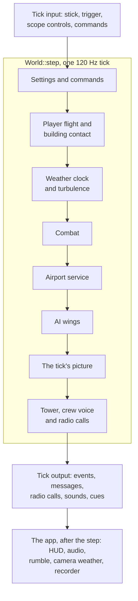

After the step the app presents the tick in the order the loop used to: HUD
messages, rumble, tower audio, the view change when the pilot dies, per-camera
weather, the view rig, wing vapor, blackout and redout, control-surface and
ejection sounds, the replay recorder's calls, radio playback, situation music,
RWR tones and spatial sound. The recorder's mid-tick call reads the finished
tick: the steps after the picture only generate radio calls and drain queues it
never reads, so what it records is unchanged.

*Agent decision:* because presentation now runs after the whole tick, a few
presentation steps read the end of the tick instead of its middle: per-camera
weather, the view rig's tracking of the player's last missile, wing vapor,
blackout and redout, and control-surface sounds. Before, they saw other
aircraft before those had moved in this tick, and the player before combat's
jolts. No simulation value, recording or fingerprint changes. In some views a
cloud tint, a vapor trail or the end of a blackout can differ by one tick
(1/120 s).

#### Tick input and output

Each tick's input is one `SeatInput` per seat (built in B0 and completed in B2)
and, for the mission, a list of `MissionCommand`s. A seat's input holds the
pilot input (`PilotInput`: stick, throttle and pilot commands such as gear,
flaps, radar power and eject), the trigger level, the scope controls and the
commands given since the last tick. Every command a player gives, from weapon
selection to wing orders, travels this way; see [seat input](#seat-input).

`TickOutput` holds, in tick order: combat's events; an ordered list of cues (HUD
lines, rumble, tower audio cues, weapon page turns, order calls, ejection
notices, delivered radio calls, and the points where the flight, combat and the
picture were done); how many of those cues the command phase made
(`commanded`); what became of each wing order (`orders`); every seat's weapon
release sounds (`releases`); shot outcomes; the AI journal; sound emissions; and
the native fault, if the tick stopped early. Every output queue inside `World`
is drained into it each tick, whether or not anyone reads it, so the state
between ticks never depends on its consumers. The radio's journal and the
player's command notes still go to the replay recorder directly, as they did
before.

**Every seat-specific output names its seat** (slice B7a, built). A host that
serves several seats reads each seat's own output from the one list, and a
presenter shows only the cues addressed to its seat, in the order they came:

| Output | Seat it is for |
| --- | --- |
| `Cue::Message { seat, text }` | A command's reply, the tower, "Landing complete" and the other cockpit lines belong to the seat whose plane they are about. Every human-flown plane's systems messages (`flight.systems.messages`) are drained every tick into its own seat, in cockpit order. |
| `Cue::Feedback { seat, event }` | Turbulence to the seat whose plane it shakes. Gun, missile, damage and crash feedback to the seat that flies the plane the combat event names. |
| `Cue::Tower { seat, stem }` | The seat whose tower request or clearance it is. |
| `Cue::WeaponCycled { seat }`, `Cue::OrderVoice { seat, stems }` | The seat that pressed the weapon page button or gave the order. |
| `Cue::Radio { seat, call }` | The seat that hears the call (built in B4). |
| `TickOutput::releases`, each a `Release { seat, sound, station }` | The seat whose plane fired; `station` indexes that plane's stores. |
| `OrderReply { seat, .. }` in `TickOutput::orders` | The seat that gave the order. |
| An aircraft's airburst | Every seat reads it: "Your aircraft exploded" for the seat that flew the aircraft, "Destroyed aircraft exploded" for every other. "Your aircraft exploded on impact" is for the seat that flew the aircraft only. |
| The AI wings' HUD line (`AiWings::take_message`) | Each seat whose plane flies in Friendly Wing 1, single player's wing. |
| `Cue::Flown`, `CombatStepped`, `Picture`, `WingEjection` | The mission: every presenter reads them. |

*Agent decision (B7a):* the AI wings' line carries two things in one queue: the
formation reports of Friendly Wing 1's members, and the activity line ("Enemy
2-1: Attacking") for any AI aircraft. Its one natural audience is the wing the
reports describe, so it goes to the seats flying in Friendly Wing 1, in cockpit
order. Single player flies the lead of that wing, so its output is unchanged. A
seat in another wing, or on the enemy side, sees none of it. Splitting the queue
by wing, so that other wings' seats hear their own activity, is left to the AI
wings' owner. A seat that has no ownship in combat gets no feedback or release
sound, since it fired nothing.

The app's `TickPresenter` and the AI probe present only `SEAT`'s cues, releases
and order replies (the recorder's release list is `seat_releases` in `main.rs`);
the markers and `WingEjection` are read whatever the seat.

#### Drivers

- **Single player:** the render loop keeps its frame clock, pause and time
  compression, builds each tick's input from the input devices and the
  instruments, calls `step` once per tick and presents the output.
- **AI probe** (`--ai-probe-ticks`, `--probe-matrix`): runs `World::step`. It
  gained weather, turbulence, building contact, the airport service, crew voice,
  event handling without the attack script and the runway surface with wind; its
  output and recordings changed once for this, in their own commit, the one
  planned change of probe output. The scripted pilot, the attack script, orders
  and threat fixtures act before each step, and the probe presents what it needs
  from the tick's output in the live order.
- **Full-tick fingerprint:** `crates/tore-world/src/world/tick_tests.rs` builds a
  `World` from synthetic fixtures (a low-flying player, two friendly and two
  enemy AI aircraft, two drones, a small airport), steps it 1,200 ticks with
  scripted input and folds the player's flight, combat's projectiles and
  targets, every AI actor, the weather clock and the whole `TickOutput` into
  one fingerprint each tick. It pins the tick order: a step that is swapped,
  dropped or repeated changes the value. It follows the conventions of the
  existing goldens (`tore-sim`'s `golden_tests.rs`): two runs in one process
  must match on every platform, and the recorded value is compared only on
  macOS on Apple silicon. The value is not recorded yet, because it can only be
  generated there: until it is set, that platform's run fails with the value in
  its message, and the constant `RECORDED` is then filled in. A deliberate
  behaviour change updates it in the same commit.
  `TORE_GOLDEN_VERBOSE=1` prints the fingerprint every 120 ticks to find where
  a change starts.
- **Unchanged:** `--headless-flight` and `--replay-input` stay the isolated
  flight-model probe, and the component probes (`--flight-probe-ticks`,
  `--countermeasure-preview`, `--combat-probe-ticks`, `--replay-combat`,
  `--combat-smoke`, `--ai-roster-probe-ticks`) keep testing one component each.
- **Later:** the dedicated server (stage D) and the player-hosted game's thread
  (stage E) drive the same `step` from a fixed 120 Hz clock that never pauses.

#### Rules for mission state

These make exact checkpoints (stage H) possible. They apply to everything in
`tore-world` and to all new mission state from stage B on:

- No file handles, sockets, threads, locks, `Rc`/`RefCell` or stored closures.
  The combat tape, the formation trace and the replay recorder are writers
  outside `World`, fed from its input and output.
- Imported data that never changes (terrain, aircraft, weapon and radio records)
  is shared by reference and named by content. Mutable state holds ids, not
  copies.
- One authoritative tick counter, `World::tick`. The component counters that
  exist today stay and are checked against it.
- No wall clock, no hash-map iteration and no unseeded random numbers. Every
  random stream has a fixed seed from the mission and, for an aircraft, its slot.
- No environment variables read inside `World`. The weather time, wind, cloud
  altitude and turbulence overrides are resolved into the mission setup before
  `World::new`, so every peer runs one configuration. One known exception: the
  flight model's weight-scaled stall speed can be switched off for the whole
  process with `--retail-stall-speeds` or `TORE_RETAIL_STALL_SPEEDS=1`
  (`tore_sim::flight::retail_stall_speeds`). It is a developer option, never a
  mission setting, and a networked game must not rely on it.
- No `log` or `tore-replay` in `tore-world`: warnings go into the tick output,
  and conversions to replay types live in the app.
- Combat's one second of hit volumes and the rewinds of the rounds in flight
  ([lag compensation](#hits-and-lag-compensation)) are mission state like the
  rounds themselves: a checkpoint carries them.

#### How stage A lands

A1, inside `tore-app`, done. Each commit was compared with the single-player
baselines byte for byte:

1. Rename `terrain::World` to `terrain::Terrain`.
2. Add `World` (`crates/tore-world/src/world.rs`) and move the mission fields of
   `App` into it. The tick body still runs in the redraw handler.
3. Move the tick body into `World::step`, with presentation after it.
4. Move the simulation half of a flight's start (`FreeFlight`, which is also
   restart) into `World::restart`, from a `Setup` that the creator fills when
   the player presses Fly, so a restart no longer reads the creator's UI state.
   A `World::new` that builds a mission with no app at all followed the A2
   splits, since combat was still built from the aircraft's render model; it is
   stage D's slice D3b (see [a mission with no window](#a-mission-with-no-window)).
5. Switch the AI probe to `World::step` (re-recorded output).
6. Add the full-tick fingerprint.

A2 first split, inside `tore-app`, what mixes simulation with presentation, then
moved the simulation set into `tore-world`. Both are done. The splits:

- `Airframe`: the aircraft type the simulation needs apart from the render
  model. Done: `AircraftType` (`aircraft_type.rs`) holds the profile, flight
  model, sensors and the engine outlet points that contrails and afterburner
  lights use, and `start` for the player's flight. `AircraftType::load` reads
  the simulation half from the resources (D3b); `Airframe::load` calls it and
  adds what only the drawn model gives, the engine outlets. `Airframe` (`aircraft.rs`)
  holds an `Arc<AircraftType>` beside the art, cockpit, HUD, animation rig and
  damage art, and dereferences to it. `World::restart`, `Combat::new`,
  `Combat::with_loadout` and the combat smoke harness take `&AircraftType`.
  The wing vapor attachments (`streamer_points`) stay on `Airframe`, since only
  the renderer reads them.
- `Combat`: its art, readouts and target cameras move out, and its render
  history splits from the interpolation. Done: `Combat` holds no art
  and no drawn model. It keeps an `Arc<AircraftType>` for every other aircraft
  type the mission loads (`dummy_types`), and the app keeps the matching
  `Airframe`s and the effect, smoke, weapon and ejection art (`CombatArt`) in
  a `CombatView` (`combat_view.rs`) beside the world, rebuilt wherever combat
  is. `combat_view.rs` also holds what reads `&Combat` for the screen: vertex
  building (`dummy_geometry`, `vertices`), the afterburner lights, the target
  window's cameras, `readout`, `status` and `equipment_damage_report`.
  `mission_aircraft` and `mission_dummies` take a loader that hands combat each
  type once; `CombatView::mission_aircraft` and `mission_dummies` load the
  drawn model with it. `render_snapshot.rs` is split: the tick's picture as
  data (`RenderSnapshot`, the pose types, the devices, `interpolate`, `blend`,
  `pose_state`) is `snapshot.rs`, and the vertex building stays in
  `render_snapshot.rs`. `Combat` keeps the last two snapshots, since an
  aircraft whose AI stopped flying holds the devices last drawn for it, and
  the frame's tick fraction and the blend at it are `CombatView`'s
  (`present`, `presented`, `pose`, `target_camera`); `flight_views::Scene::new`
  takes the view when it should place targets at the frame's fraction. A
  restart of the render history (`Combat::render_restarts`) puts the fraction
  back to 1 until the next frame sets one, as before. `Contact`,
  `CombatGeometry` and `Afterburner` stay in their renderer files: only the
  drawing reads them once combat's vertex building has left, so nothing on the
  simulation side needs them moved.
- `Terrain`: the simulation half apart from the scenery, as above. Done.
- Quick Mission setup apart from the creator's UI: `mission_layout.rs` holds
  the mission layout, ground layout, runway poses and map bounds, and
  `quick_mission.rs` keeps the creator's screen (done in this stage); the debrief evaluator (`capture`, `report`) apart from its
  pages (done in D7a: the evaluator lives in `tore_world::debrief` so a dedicated server can build each seat's report, and the app's `debrief.rs` keeps the screen and re-exports it); the target window's data apart from its refresh clock (`target_window.rs`
  keeps the data, `target_preview.rs` the clock and camera; done in this stage). The temporary re-exports these two splits left in `quick_mission.rs` and `target_window.rs` are gone: combat, its view and `world.rs` name `mission_layout` and `target_preview` directly.
- File writers and environment-variable reads leave simulation code, and `log`
  calls become output. The formation trace is done: `AiWings` collects its rows
  in a bounded list, and `formation_trace.rs` in the app reads
  `TORE_FORMATION_TRACE` and writes the file.
  The combat tape is done too: `Combat` holds no file. While a tape is being
  recorded it collects each record (the action name and the `Launcher`, as
  `combat_tape::Entry`) in a write-only list (`start_tape`, `record_tape`,
  `take_tape`). The app owns the `tape_file::Recorder`, writes the list after
  every tick (`World::step` puts its airport records in the same list) and
  again when the tape ends. The tape's bytes are the same as before. The
  `TORE_COMBAT_EVIDENCE` variable stays in the `--combat-smoke` harness, which
  is a command-line check and not mission state.

Then `git mv` moved the simulation set into `crates/tore-world`, with a
`[profile.dev.package.tore-world] opt-level = 2` entry like `tore-sim`'s, and
`tore-app` depends on it. It went in four commits. First, `Camera` left
`terrain.rs` for the app's `camera.rs`, and the free-flight start point became
`Terrain::free_flight_start`, which both the camera and `AircraftType::start`
call. Second, the `--combat-smoke` check left `combat.rs` for the app's
`combat_smoke.rs`. Third, the combat tape's writer and reader left
`combat_tape.rs` for the app's `tape_file.rs`, leaving the names and `Entry`
with combat. Fourth, the crate: the modules listed under
[where the code stands](#where-the-code-stands), plus `test_support` and
`combat::fixtures`, which hold the synthetic terrain, aircraft profile, combat
scene and AI wing rows that tests in both crates use (the app enables
`test-support` through its `dev-dependencies`; the tests that only the app uses
stayed in it). `cargo tree -p tore-world` shows no wgpu, winit, cpal or
pollster. The full-tick fingerprint, every behaviour item of the baseline
harness, every capture that does not depend on frame timing and the live
recordings' shared checksums, states and events matched the commit before the
move.

**Verification.** A local harness (`.local/mp-baseline/`, never committed)
records golden fingerprints, headless flights, AI probes with their mission
recordings, input and combat tapes and a long probe's run time, and compares
them byte for byte after every commit. Because no headless path runs the live
loop today, commit 3 is checked by review against the old loop, line by line,
and by a live run on a display. From commit 5 on, the AI probe runs the same
tick, so every later change is covered.

### Stage B: seats

#### Aircraft, pilots and seats

```rust
pub struct PlaneId(pub u32);    // one aircraft of the mission, for the whole mission
pub struct SeatId(pub u8);      // one per human; single player is seat 0

pub struct Plane {              // World's roster, in id order
    pub id: PlaneId,
    pub slot: Slot,             // side, wing and member, fixed at setup
    pub pilot: Pilot,
}
pub enum Pilot {
    Ai,                         // the AI actor with this id flies it
    Human(SeatId),
}
pub struct Seat {
    pub id: SeatId,
    pub plane: Option<PlaneId>, // None: waiting or observing
    pub crew: Option<Crew>,     // the radio's name for a second seat
    // later: its radio queue, crew voice, tower conversation and wing recipient
}
pub struct SeatInput {
    pub seat: SeatId,
    pub tick: u64,              // the tick it applies to: World::tick
    pub pilot: PilotInput,
    pub trigger: bool,
    pub commands: Vec<SeatCommand>, // applied in order at the start of the tick
}
```

These live in `crates/tore-world/src/seats.rs` (built in B0), with `Roster`, which
holds the planes and seats. *Agent decision:* the design first called a plane's
id `AircraftId`, but that name already means an aircraft type
(`tore_formats::aircraft::AircraftId`, used about 600 times), so a mission's
aircraft are planes. The scope controls and every between-tick command joined
`SeatInput` in B2, below.

`World::step(&[SeatInput])` takes one input per seat that flies a plane, and
refuses a missing, duplicate or wrong-tick input. Settings changes
(cheats in single player, the King's settings in multiplayer) are a separate
mission command, applied at the start of the tick before any seat.

**Where an aircraft's state lives.** An AI-flown aircraft keeps its state where
it lives today: the AI actor (flight state, stores, dispensers, sensors,
awareness) and its combat target row (hit points, hit sections, fault counts,
wreck). A human-flown aircraft has a `Cockpit` in `World` (flight state, its state
at the start of the tick, turbulence, the airport service and NAV mode) and an
ownship in combat (below). The flight state is the same type for both, `flight::State`.
Stores, damage and countermeasures convert exactly at a handoff, because the AI
and the cockpit both build them from the same `live::Configuration`.

*Agent proposal, approved by John on 2026-09-28:* this is a registry plus exact
conversion, not one struct
holding every aircraft. One struct would mean rewriting the AI mission, about
6,000 lines, to fly aircraft it does not own, and replacing single player's
damage rules. The registry gives the same guarantees (one id per aircraft, one
pilot at a time, nothing lost at a handoff) at much lower risk.

**Ids.** Aircraft keep today's numbers: the lead of Friendly Wing 1 is 0, the
other aircraft are numbered from 1 in the Quick Mission's roster order, and
ground objects stay at `0x4000_0000` upward. No code may assume that id 0 is a
human, since in multiplayer an AI may fly it: `PLAYER_OWNER` is gone (B1) and `PLAYER_ID` goes,
and code asks the aircraft's pilot instead. In single player, seat 0 flies
aircraft 0, exactly as today.

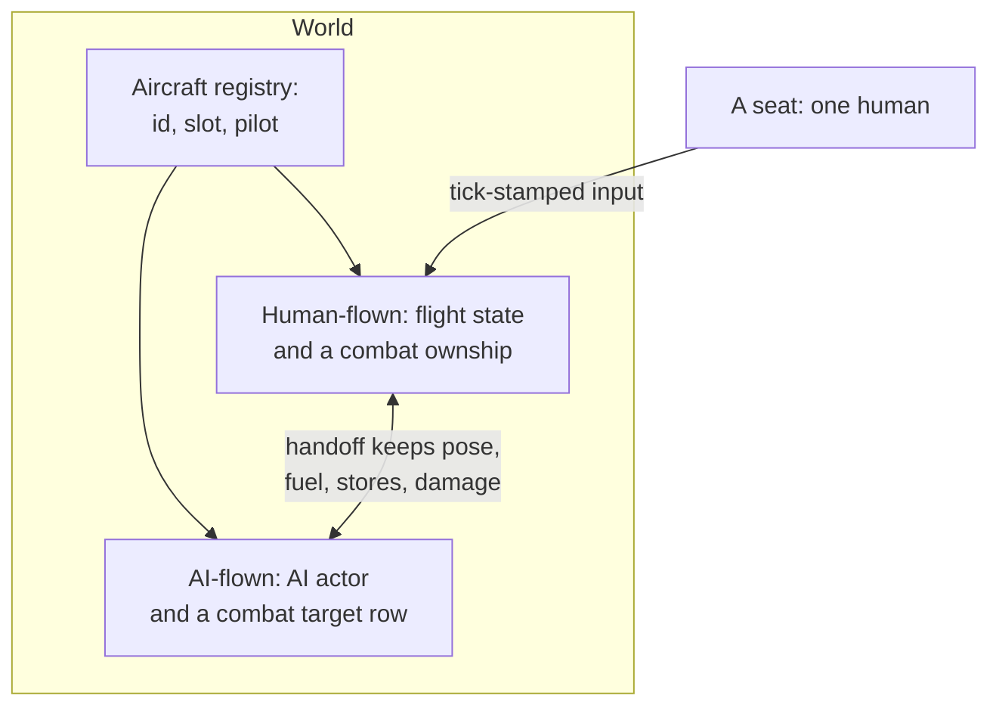

#### Seat input

*B2 is built (combat commands, scope and settings, wing orders, and the
pause and recording rules below).* The render loop builds seat 0's input from today's sources: the
pilot input, the trigger (Space and the bound fire control), the scope controls
and the commands given since the last tick. The app keeps them in one
queue in the order given (`App::seat_commands`); the first tick of the next
frame takes the whole queue, and `World::step` applies each command at the
start of the tick to the plane the seat flies. That is when they take effect
today, because window events always arrive between frames.

`SeatCommand` (`seats.rs`) lists them. Each is applied in
`world/commands.rs`, in the order given, by the cockpit of the seat's plane:

| Command | What the step does |
| --- | --- |
| `CycleWeapon` | The weapon selection steps and NAV mode follows the arming; the weapon page turns to it (`Cue::WeaponCycled { seat }`). |
| `Airport` | A NAV mode switch or a tower request, as in B0. |
| `Combat(command)` | Combat takes the command as it is: designation (next, previous, visual, by identity from a scope click) and the seeker mode or the designation release from the weapon display. |
| `Manual(command)` | A key, button or menu command: arming, seeker mode, clearing the designation, jettison and the range and development commands. It lets go of the trigger, gives combat the command, and puts the payload weight right. Outside `--live-fire` only arming, seeker and designation work, and the pilot gets "Manual range command requires --live-fire". |
| `RangeReset` | A new target on the range; "Target reset is available only with --live-fire" otherwise. |
| `ReleaseChaff`, `ReleaseFlare` | One cartridge or flare, with the retail messages ("Chaff launched, 11 left", "Out of flares"). Refused when the aircraft is destroyed, the pilot has ejected or it has no hit points. |
| `RadioSilence` | Toggles radio silence and tells the pilot ("Radio silence", "Radio traffic OK"). |
| `WingRecipient` | Chooses the wingman the seat's orders address, or the whole wing. It is state of the seat (`Seat::wing_recipient`). |
| `WingOrder`, `WingFormationCycle` | An Alt-key order goes to the AI wings with the seat's recipient and its designated target. The formation cycle reads the wing's next formation first. The pilot's own order call comes back as `Cue::OrderVoice`, the wing's report and any refusal as `Cue::Message`, each naming the seat, and `TickOutput::orders` lists what became of each order, with its seat. |
| `ReleaseTrigger` | `Combat::cancel`, which a menu opening, a pause, a modifier key or losing focus does. |
| `TriggerKey` | The Space key going down or up, with the app's "blocked" flag (paused, out of focus or a modifier held). |

`SeatInput::sensors` carries the seat's scope controls (channel, display range
and contact history). The step sets them on the seat's flight before that
seat's commands, every tick; the app used to copy them into the flight once a
frame. The scope's labels follow the controls as they stand now, not the
flight's copy, so they never lag a switch that was just pressed.

Settings are not a seat's: `World::step_with` takes `MissionCommand`s, applied
at the start of the tick before any seat's commands. `Settings` holds the
cheats (which include the enemy skill and guns only switches the AI reads), and
the step puts them on every human-flown plane, combat and the AI wings. The
app sends them on a flight's first tick and whenever the flight menu changes
them; it used to copy them every frame. The friendly list that the designation
keys skip is set when a flight starts (`World::restart`), since it never
changes in flight.

The messages the commands give the pilot come back as `Cue::Message` in the
tick's output. `TickOutput::commanded` says how many of the first cues the
command phase made, so the app can act between the commands and the rest of
the tick. The mission recording does: it opens the tick there
(`Recorder::start_tick`), which first notes the commands and their messages on
the frame before the tick, exactly where they were noted when the handlers ran
between frames.
`World::step_observed` also calls a closure after the command phase, for a
driver that reports what a command did (the AI probe does).

Two things change timing. A command given from the menu while paused now
takes effect on the first tick after resuming, instead of at once. And the
mission recording must keep listing a command on the frame before the tick that
applies it, as it does today (done, above).

The step hands an order to `AiWings::command_at` with the sender's plane, and
the AI routes it to the sender's own wing (slice B3, built): AI members act on
it, a human member only records that it was ordered, and a plane that does not
lead its wing is refused.

*Agent decisions (B2):*

- A pause refuses chaff and flares in the app, since only the app knows about
  the pause. The other refusals (destroyed, ejected, no hit points) are the
  tick's.
- The commands apply in the order given. Before, weapon-page buttons ran at the
  tick and every other command ran at once, so two commands given in one frame
  could swap.
- The scope controls reach the flight before the seat's commands. The frame
  loop used to copy them after the handlers had run, so a command given in the
  same frame as a channel change saw the old channel; it now sees the new one.
- The queue holds at most 256 commands.
- The order call and the wing's reply are played after the tick that applied
  the order, not at once. What the order does to the radio channel happens in
  the command phase: the call cuts off the wing lines still playing on the
  seat's channel (the journal notes the cut) and holds that channel for its
  length, for every seat and whether or not a sound device plays it (John,
  2026-09-29). Before, only a live game with a sound device cut off and held,
  a live game without one only held, and the AI probe did neither; one probe
  output and its recording changed with this rule.

#### Combat: one ownship per human-flown aircraft

Built in B1 (`tore-sim/src/combat/live.rs`). `live::State` keeps what every
aircraft shares: projectiles, the target rows of AI aircraft and ground objects,
effects, smoke, debris, countermeasure devices, the ledger, the mission settings
(cheats, weapon rules, friendly fire) and combat's one random stream. The
player-only fields (stations and rounds, selection and arming, the mounted
seeker, sensors, trigger and gun cadence, bay requests, hit points, hit
sections, fault counts and failure flags, chaff and flares, missile warnings,
score) live in an `Ownship`, one per human-flown aircraft, held in aircraft id
order (`State::ownships`, `ownship(id)`, `own()` for hosts with one). The host
adds and removes them with `add_ownship(Ownship::new(id, side, config,
external))` and `remove_ownship(id)`, which gives back the stores, damage and
countermeasures as the ownship left them.

`State::step_surface` takes one `OwnshipInput { aircraft, held, launcher }` per
ownship. Every player-only stage loops over the ownships in id order: guns-only
and pending damage, sensors, the mounted seeker and readiness, firing, the hit
test and damage pipeline, smoke, fragments, threat observation and the midair
pool. An ownship without an input is not stepped that tick. Cockpit questions
(readiness, seeker tone, the display target, the weapon estimate) go through
`State::view(id)` / `OwnshipView`, and commands through `State::command(id, ..)`.
Player-only events carry the aircraft id (`Fired`, `OwnshipDamaged`,
`SubsystemDamaged`, `OwnshipDestroyed`, `PilotKilled`, `OwnshipGroundImpact`,
`Jolt`, `Strike::victim`), and an ownship's projectiles are owned by its aircraft
id. With one ownship this is the earlier code in the earlier order of random
draws: the baseline compare was SAME on every behaviour item after B1's first
three steps.

Every ownship is an aircraft to the others. Each step builds a target row for it
from its own launcher, and that row is what the other ownships' sensors observe
(radar, passive emitters), what their mounted seeker and guided missiles
consider, what rounds hit and what the midair pool collides. A second ownship is
therefore detected, designated, shot at and collided with like any AI aircraft.

**Damage rules follow the pilot.** A human-flown aircraft uses today's player
rules: twice the aircraft's hit points (native), the damage spread, instant kills
and system faults gated by the Damage cheat, and Invulnerable. An AI-flown
aircraft uses today's AI rules. *Agent proposal, approved by John on
2026-09-28:* this keeps single player exact and gives every human the toughness
the player has today.

`tore-world`'s `Combat` serves every human-flown plane (B1's last step).
`Combat::step_all` takes each human-flown plane's flight, in aircraft id order,
puts every launcher into one combat step, then hands each flight what combat did
to its aircraft: system faults, payload, bay, radar and jammer, damage and the
crash. Each ownship has its own trigger (`Combat::trigger(aircraft)`, the
keyboard's and the controller's), and commands, trigger releases and cockpit
questions name the aircraft (`command_for`, `cancel_for`); the first ownship, the
one the app presents, keeps the one-flight calls (`step`, `command`, `cancel`,
`own()`), the combat tape and the command notes. *Since D3c* the tape, the notes
and the host's engine outlets follow `Combat::host_plane()`, single player's
plane 0 while it has an ownship and none in an open mission, and the build, the
tick and the handoff never call the one-flight calls, which panic with no
ownship. `World::step` calls it with
every cockpit, and the radio reads each plane's own ownship: hit points for
`cockpit_alive`, designation, weapon selection and incoming missiles for the
crew voice, the shooter and weapon of each `Fired` event for the weapon call.
Every other human-flown plane is in the tick's render snapshot as an ordinary
aircraft (its model, pose, devices, damage and pilot) beside the AI's; with one
cockpit the snapshot is unchanged. `Combat::add_ownship(ownship, contrail
offsets)` and `remove_ownship(aircraft)` are the calls a handoff (B6) uses: the
ownship carries the stores, damage and countermeasures in and out, and
`Ownship::localized_damage` is public for it. The AI still flies against the
first ownship only (B3).

*Agent decisions in B1 (not settled by the brief):*

- One counter (`State::next_shot`) numbers every ownship's rounds, so two
  ownships never share a projectile number; with one ownship it counts as the
  ownship's own `shots` did.
- `Projectile::incoming` is now `Option<u32>`, the ownship a round was aimed at
  when released. It is aim metadata (ledger aim, the diagnostic round) and no
  longer decides who a round can hit.
- The diagnostic `Incoming` command fires a round owned by no aircraft
  (`INCOMING_OWNER`) that carries the selected station's weapon record.
- Jammer deception against hits on AI rows (a dev range flag) uses the first
  ownship's ECM record, as the only ownship's did.
- Radar contacts of another ownship and its warnings use the same code as AI
  targets; the AI's own world snapshot still sees the human through the AI
  bridge (B3).

#### Hit tests and friendly fire

Before B1 a gun round could hit any aircraft except its owner, on either side,
the player included. Missiles were split: one aimed at the player could hit only
the player, and any other could hit any aircraft row, its own launcher included,
but never the player.

Built in B1's fourth step (rule from John, 2026-09-28, single player included): **a
gun round can hit any aircraft except the one that fired it, and a missile or
bomb can hit any aircraft once its fuze has armed**, whether it is an aircraft
that gets in the way, a new target it shifts to or its own launcher. One search
covers every aircraft row and every ownship, and the nearest contact along the
round's path wins. This ended the missile split: an enemy missile aimed at the
player can hit a wingman in its path, a missile aimed at someone else can hit the
player, and a decoyed missile no longer keeps aiming its hit at the player alone.
Damage follows the pilot: a hit on an ownship goes through the player pipeline, a
hit on an AI row through the AI pipeline.

*Agent decisions:* a round that starts inside its own launcher's hit volume
(every rocket and bomb with no arming delay does) is not a hit, so it cannot
explode on its pylon; only a round that comes back into the volume from outside
counts. This matches John's words at the design review: "missiles should be
able to hit anything once it leaves the shooting aircraft". Easy aiming widens the volume of other aircraft, never the shooter's own.
Missile and bomb records in the synthetic test fixtures keep an arming delay of
zero, so their tests rely on that rule.

Friendly fire is a mission setting, `State::friendly_fire`. `On` is single
player's behaviour and the default. `Off`, a lobby choice, means no round damages
an aircraft of its shooter's side, the shooter included; the round passes through
and flies on. Each aircraft has a side: the host sets it on ownships
(`Ownship::new(.., side, ..)`) and on AI rows (`add_dummy(.., side)`, from the
wing's side), and `NO_SIDE` (ground objects, fixtures, rounds nobody owns) is
never spared. Collisions stay on whatever the setting (John, 2026-09-28).

*Found by B7b's fight test, fixed in its own commit:* a hit on an ownship went
through the player's damage pipeline but never reached the ledger, so a human who
shot down another human (or its own leader) was credited with nothing and a
friendly-fire kill of a human never showed in the debrief. Now a hit on an
ownship by another ownship's round records the shooter as the last hit on it, and
a destroyed ownship is a recorded kill, as a hit on an AI row already was. The
AI is credited too (John, 2026-09-29): an AI shooter's hit on an ownship is the
last hit on it and its kill is the AI's, so the debrief and the replay recorder,
which names the player's killer from the ledger, show it. Ten of single player's
probe recordings changed with this rule in the stage C chain, in that event only. The diagnostic
incoming round belongs to no aircraft and is credited to nobody. The ownship's
own score (`hits`, `kills`) still counts hits on AI rows only, as before.

A loss with no shooter credits nobody (lead's decision, 2026-09-29): a
human-flown aircraft lost to the map edge or to overspeed is
recorded as lost without credit (`Ledger::lose_without_credit`, in
`Combat::step_all`) even when a shooter hit it earlier, as an AI aircraft lost
that way is (`AiWings::lose_uncredited`). An ordinary crash still goes to the
last shooter.

#### Handoff between the AI and a human

A handoff is a command, applied at the start of a tick before any other
command: a human takes an aircraft (joining, or rejoining their reserved one),
or gives one back (leaving, dropping or being kicked). Releasing a reserved
aircraft changes only who may take it; the AI keeps flying it. Only a living
aircraft whose pilot is still aboard can change hands.

**AI to human:**

1. The AI actor leaves the AI mission. The other actors keep their order.
2. The flight state moves over unchanged: position, velocity, attitude, fuel,
   systems, damage, gear and flaps, flight-model internals and their random
   state.
3. The combat target row becomes an ownship: the same fraction of hit points
   under the player rule, the same hit-section fractions and fault counts, each
   station's rounds from the AI's stores (failed stations stay failed), chaff and
   flares from its dispensers. Its sensors and missile warnings move over; the
   AI's equipment failures become the ownship's failure flags.
4. The weapon follows a flight start's rule (the gun if it carries something,
   else the first loaded station Guns only allows, else NAV, the bug bash's
   rule), and the AI's current
   target is designated if the aircraft's sensors hold it (*agent proposal*).
   The autopilot is off, and the human's controls apply from this tick.
5. If the aircraft leads its wing, the human becomes the wing's leader and the
   AI wingmen follow. The AI's orders and assignments are dropped.
6. The seat's radio queue, crew voice and tower conversation follow the
   aircraft.

**Human to AI:**

1. The ownship becomes a combat target row with the same fractions, the reverse
   of the above. Its stores, dispensers, sensors and warnings go to a new AI
   actor, built as at mission start: same slot, the same seed rule, fresh
   awareness, neutral. It joins the actor list in id order.
2. A wingman rejoins its leader, and a leader follows the flight plan (the
   guide's rule for a dropped player).
3. The flight model stays as it is.

Handoff tests check that position and speed change by no more than one normal
tick of flight, that fuel and rounds are identical, and that hit points keep
their fraction to within one point.

*Built (B6).* The handoff is two calls on `World`, `take_plane(seat, plane)` and
`give_back_plane(seat)`, and the mission commands `MissionCommand::Take { seat,
plane }` and `GiveBack { seat }` that `step_with` applies first in the tick, in
the order given, before any seat's commands. `can_take` and `can_give_back` say
whether a handoff would go through; a refused one changes nothing, and inside a
tick it is an error the host sees, so a host checks first. Each seat's input is
checked against the planes as the commands leave them: a seat that takes a plane
sends input for that tick, and a seat that gives its plane back sends none.

The two conversions are in `tore-sim` combat (`live::Ownship::from_ai` and
`Ownship::into_ai`, in `combat/live/handoff.rs`); the world's half is
`world/handoff.rs`. What each field becomes:

| Kept | AI to human | Human to AI |
| --- | --- | --- |
| Hit points | The row's fraction of `initial_hp` becomes the same fraction of the configuration's `damage_capacity` (twice the hit points), never below 1 for a living aircraft | The reverse, into the configuration's `hit_points` |
| Damage taken, hit-section amounts, fault counts | Same fractions; the breakup variant and section copy over | Same, back |
| Station rounds | Each station's rounds from the AI's store (an unlimited store counts as the station's full count); a station out of action gets the ownship's failed mark | Rounds and the failed mark back into a store per station, built as at mission start |
| Chaff and flares | From the AI's radar and infrared dispensers | Back into the two dispensers |
| Sensors and missile warnings | Moved over as they are | Moved back |
| Avionics failures | The AI's radar, infrared, visual and RWR failures are the ownship's flags; a jammer the row lost is `ecm_failed` | The reverse |
| Flight state | Moves to the cockpit unchanged (autopilot off, mission cheats applied) | Moves to the actor unchanged (cheats cleared: an AI aircraft carries none) |

A living aircraft never rounds to zero hit points, so a handoff cannot kill it.
The round trip keeps rounds, chaff and flares exactly and hit points to within
one point.

*Agent decisions in B6 (not settled by the brief):*

- A station's failed mark is the AI's own record of a fault (`damaged_stations`),
  not the `inhibited` flag the Air combat guns only setting also raises, so
  switching that setting on does not fail a human's missiles for good. A store
  that arrives at the AI already inhibited is recorded as damaged.
- The cockpit of a taken plane starts fresh where the AI kept nothing: turbulence
  at its default and seeded as a restart seeds it, no selected airport, NAV mode
  off (the gun is armed), the result tracker on the mission's home base. The crew
  voice, airfield radio and crew label are built for the plane's aircraft type,
  which is found among the mission's other aircraft types; the combat
  configuration is the AI's own, else the mission's for that type, else a flown
  aircraft's.
- The AI's current target (the one it engages or searches for) is designated
  through combat's own designation, so it holds only if the aircraft's sensors
  hold the contact, and no tape or command note records it.
- The new actor takes the skill the aircraft had before a human took it, else
  a wingmate's, else the side's first AI aircraft's. It gets no assignment, as
  an aircraft at mission start has none before the mission preset and group
  objectives are applied, so a preset such as CAP or Hold does not reach an
  aircraft that comes back from a human, and it acts as under Free.
- Taking a plane with a lower id than the first ownship makes that one the
  first cockpit, whose plane the render history follows, so a host that
  presents one seat should reserve the lowest ids for it. (B6 also kept the
  lowest-numbered human plane from being given back; D3c lifted that: any
  plane can go, the last one too, and the tick runs with no human.)
- Only a plane whose row is alive and whose pilot is aboard changes hands, in
  both directions. A destroyed or ejected plane stays as it is.
- Rendering: a plane given back that has no drawn model among the mission's
  other aircraft (single player's plane 0 when its type is not one the wings
  fly) is hidden in the tick's picture until the app supplies a model for it.
  Combat's snapshot looks a row's model up by its place among the mission's
  other aircraft. In an open mission plane 0 is one of them, so it is drawn.

#### The AI with several humans

*Built (B3).* The host hands the AI one `HumanAircraft` for each human-flown
plane that has an ownship, in id order (`AiWings::step`): its `HumanSlot` (plane
id, side, wing and member, from the roster's `Plane.slot`), its flight state,
its ownship's hit points and the signature and jammer of its configuration.
The AI builds a world object with `human_controlled` set from each, where it
built one for "the player". A human is never an `AiActor`.

- **Snapshots and evidence.** Missile snapshots take one launcher per ownship,
  attack evidence from an aircraft's RWR, emitters and sensors is delivered to
  that aircraft alone, `locks_on(id)` lists the locks on one aircraft, and a
  launch aimed at any human is `incoming` for it. Decoy rolls and compatibility
  threat reports read the weapon of the round's own owner, never plane 0's.
- **External leaders.** A wing whose current leader is human-flown has that human
  as its external leader, so AI wingmen fly formation on any human lead, not
  only on Friendly Wing 1. Each step refreshes the AI's list of humans
  (`AiMission::set_humans`), so a human that leaves stops leading.
- **Landing priority.** Every human keeps landing priority over AI traffic:
  `World::step` evaluates every cockpit in id order
  (`AiWings::update_landing_priority(id, ..)`), a claim keeps its runway busy
  and a joining wingman's wing-abort reads its own leader's claim.
- **Assignments.** Mission assignments and must-survive lists are kept for each
  human (`human_assignment(id)`, `must_survive(id)`). The presets and group
  stamps write every human they name: Escort and Intercept name every friendly
  human, a group stamp reaches only the humans in that group, and a survival list
  is written for every human. *Agent decision.*
- **Friendly lists.** `AiWings::friendly_ids(side)` lists a side's AI and human
  aircraft; `World::refresh_friendlies` gives each ownship its own side's list
  (restart calls it; a handoff calls it again).
- **Orders.** Wing orders, `next_formation` and the landing orders take the
  sender's plane and go to the sender's own wing, to AI and human members
  alike; a human member answers "flown by a human". Only the plane that leads its
  wing can order it (*agent decision*, following "orders from a seat whose
  aircraft leads its wing" below).
- **Numbering.** A wing with humans in it leaves their member numbers free of AI
  aircraft: the k-th AI member takes the k-th number no human holds
  (`AiWings::build_for`). One human at member 0 of Friendly Wing 1 is the old
  shift by one.
- **Contact reports.** A contact carries its group size and advice once and its
  clock position, elevation, range and type name measured from each human
  (`Contact::views`), for a radio that voices each seat's report; the plain
  fields are the first human's. *Agent decision:* B4 has not adopted `views`
  yet.
- **Return to base** (the bug bash's rule of 2026-09-29). A wing led by a human
  stays with its human (the AI skips any wing with an external leader).
  *Agent decision:* an AI-led wing with a human wingman goes home like any
  AI-led wing, and the human is never ordered. An ejected human counts as lost
  in return to base, traffic avoidance and succession, as an ejected AI pilot
  does: ejecting ends the aircraft's flight (`crashed`), which both the human's
  world object and an AI actor read.

*Removing and inserting actors, for handoff.* `AiWings::remove_actor(id)` takes
an AI aircraft out and returns its flight state, stores, dispensers, sensors,
missile warnings, equipment faults, skill and combat configuration; the others
keep their order. `AiWings::insert_actor` adds an aircraft in id order as at
mission start: same slot, the seed rule (its rank among the wing's member
numbers no human holds), fresh awareness, neutral, home the nearest runway its
side may use. It leads if it is its wing's leader, and takes its member number
as its formation slot, or its rank behind the leader once the flight has
re-formed. `ActorInsert::from_removed` puts an actor back as it left. The
preset assignment is not re-applied (*agent decision*). Both calls are for the
lead's handoff and have no caller yet.

#### Lead succession

John's rule (2026-09-28): if a flight lead is shot down, a human in the flight
takes the lead if there is one; otherwise the next AI member does, and the
flight re-forms on the new leader.

*Built (B3).*

- Each wing has a current leader, `AiMission::wing_leader`. At the start of the
  mission it is the wing's member 0 (a wing with no member 0 has none, as before).
  When the leader's aircraft is destroyed or its pilot ejects, lead passes on that
  tick to the lowest-numbered flying human member, or, if there is none, to the
  lowest-numbered flying AI member. The check runs at the start of every mission
  step, before anyone decides whom to follow, and again at its end, so a leader
  lost during the tick hands over on that tick. A wing with nobody left keeps its
  last leader.
- `ActorIdentity::leads` is the flag `is_leader()` reads; `member` stays the
  fixed roster number. The flight re-forms: the followers, human and AI, take
  formation slots 1, 2 and so on in member order. A member that was following
  the lost leader in to land stops, as the bug bash's succession did; this rule
  replaced the bug bash's renumbering at John's decision of 2026-09-29.
- Everything in the AI that keys on "the leader" reads the current leader instead
  of member 0: `leader_view` and the external leader, airfield clearance,
  escorts, automatic release, the contact report hold rule (the leader and the
  first wingman behind it report) and orders.
- A `LeadershipChange` in the mission output (wing, new leader, previous leader,
  whether the previous leader's pilot is alive: ejected and unhurt) becomes a
  `Chatter::Leadership` event, and the radio journals it (`Cause::Leadership`).
  For an AI new leader that is all there is.

*Mission of opportunity (aircraft pass, John's decision of 2026-09-30).* When
a human's lead passes to an AI aircraft, `refresh_leaders` starts an
`ai::opportunity::Opportunity` for the wing (`AiMission::begin_opportunity`):
the wing's AI members get free engagement and lose any recall, or, under
weapons hold or self-defense, the wing goes home at once. Each step,
`AiMission::fly_opportunities` runs right after the first leadership check: it
pools the hostile aircraft every living member sees or remembers
(`awareness::Memory`), and `Opportunity::step` keeps one last known point per
enemy aircraft and picks the one to search. The lead's controller gets it
through `Controller::set_wing_search` and flies it with the lost-contact search
(`MotionBranch::Search` with `opportunity: true`), after its own lost contact
and never as a target. When the search is over the lead flies the wing's
remaining waypoints (`Plan::Route`, `Controller::set_wing_route`,
`MotionBranch::WingRoute`), which the host hands over with
`AiMission::set_wing_route` (`AiWings::set_wing_route` by aircraft) and the
opportunity copies when the lead passes. *No host has a route yet:* Quick
Mission imports no mission route and the AI flies none, so only the probe's
`--probe-wing-route` calls it (agent decision: the plumbing waits for route
import rather than inventing routes). With no waypoint left,
`AiMission::send_home` (the same call the mission's return to base uses) lands
every airborne member at its home runway, or flies a lead with none home, and `airfield_clearance` keeps a
member still in `Phase::Waiting` parked. The numbers are agent decisions,
in the [AI spec](spec/ai.md#mission-of-opportunity-after-a-lost-human-leader).
A wing led by AI from the start is untouched. The AI probe prints a
`mission of opportunity:` line whenever what the wing does changes.
*Agent decision:* the rule is the same for every seat, since it keys on a
human's lead passing to AI, and no seat hears anything new.

A human new leader hears "You're the Wingleader now" (`^WNGLDR`, already
imported) five seconds later, spoken by the previous leader if that pilot is
still alive, for example after ejecting (retail: "voiced only when the previous
leader is still alive to send it"). Otherwise a HUD line only (*agent
proposal*; retail's triggers are unknown, see the
[radio chatter spec](spec/radio-chatter.md#youre-the-wingleader-now)).
*Built (B4 step 4).* `Radio::chatter` turns B3's `Chatter::Leadership` into
the call when `scene.human(new leader)` is a listener: a call to that seat
alone (`Audience::Plane`), five seconds later even if the previous leader is
human, important, voiced by the previous leader or, when that pilot is dead,
text only under the label `Flight`. When the AI takes the lead the existing
"now leads the wing" note is all there is (no call, no unheard entry), so
single player, where a human never becomes the new leader, is unchanged.
`radio_calls::leaders` reads the AI mission's current leader (`wing_leader`)
for the flight-leader audience.

Single player gained the same succession (John, 2026-09-28): when the player is
shot down, the first living wingman leads the rest, and when an AI leader dies
its next living member leads. It landed as its own commit with re-recorded
baselines. In the stage C chain, where it replaced the bug bash's succession,
it changed 33 of the 49 default probe recordings and 7 printed outputs. In 27
recordings only the journal's "now leads the wing" note differs (and, in one,
the "leader" or "wingman" word in the AI thinking record). In six, aircraft move
from the tick a wing changes leader, where the two rules differ: a wing whose
human leader is lost passes the lead to its first living wingman (the bug bash
left a human-led wing alone), which releases the wingmen to engage and refuses
the dead player's later wing order; and an AI wing keeps its members' numbers
where the bug bash renumbered them.

#### Radio, orders and debrief for each seat

- **Radio.** Each call is still generated once, with one variant roll and the
  same cooldowns, so every listener hears the same variant, as in retail. The
  listener rule then runs for each seat, against that seat's aircraft and
  flight, and each seat has its own delivery queue and busy hold. The crew voice
  and the tower run for each human-flown aircraft. With one seat this is today's
  radio.

  *Built (B4 step 1).* `radio_calls::step` gets the listeners (one `Listener`
  per human-flown plane: its seat, plane, radio flight, side, whether it is
  alive, its position and crew label) and the radio names of every plane
  (`radio_calls::members`, built from the roster so a human-flown plane has one
  too). `Radio::say` rolls and words a call once, asks the listener rule for
  each listener's label, and hands `Comms::send` the call with its hearers.
  `Comms` holds one channel per seat (queue of at most 64, busy hold, radio
  silence, the lines still audible for a cut-off) beside what is shared: the
  variant stream, the cooldowns, the call numbers and the journal. `Comms::due`
  returns `Delivery { seat, call }`, and `Cue::Radio` carries the seat, so a
  presenter shows only its own seat's lines. The journal has one entry per
  call, numbered once, and its `heard_by` names the seats it is about (queued,
  dropped by radio silence, delivered). Agent decisions: a seat hears a
  whole-flight call from any other plane of its wing while it is alive, hears a
  flight-leader call only if it flies the wing's leader (its first member until
  lead succession lands), and hears a friendly-fire complaint only if it is
  the shooter's seat; a human-flown plane's own calls are voiced at once; radio
  silence is each seat's own setting; the crew's missile-warning limit is
  kept for each seat, since two crews warn separately; a call no seat hears is
  one `Unheard` journal entry; a wingman's contact report is one call whose
  clock position, height, range and type naming are each seat's own, from B3's
  `Contact::views` (`Hearer::saying` gives a seat its own words).

  *Built (B4 step 2).* Each `Cockpit` holds a `CrewVoice` and an
  `AirfieldRadio`, both made for its seat and plane. `World::step_radio` runs
  each cockpit's tower conversation, then `WingStatus` (what the AI wingmen
  report from the airfield, decided once and handed to every cockpit in that
  wing), then each cockpit's delivery and crew voice, then the weapon, hit and
  wing calls, then the calls due. With one cockpit that is today's order and
  today's rolls. The crew voice's wingman is the first other member of the
  plane's own wing, by the roster's slot; for member 1 of a wing that is
  today's rule, which keeps a dead wingman from being replaced by the next
  (agent decision: the brief said "first other living member", which would
  change single player when a two-ship leader's wingman dies in a larger
  wing). Combat's player-only state (designation, weapon selection, incoming
  missiles) is still the first cockpit's, so `crew_voice::Host::ownship` is false
  for the other cockpits until B1 lands.
- **Orders.** Alt-key orders from a seat whose aircraft leads its wing go to that
  wing, to human and AI members alike. A human wingman gets the order as text and
  the recording. Reply and request keys for human wingmen are stage F.
- **Debrief.** Built for each seat, with that seat's aircraft as the pilot column
  and the first other member of its wing as the wingman column. The full
  multiplayer results screen is stage F.

  *Built (B5 step 1).* `tore_world::debrief::capture(&World, SeatId)` builds the report of
  the plane the seat flies (`None` for a seat that flies none). The pilot column
  is that plane: its hit points come from its ownship and its pilot state from
  its cockpit's flight. The wingman column is `debrief::wingman_of`, the first
  other member of the plane's wing by the roster's slot, human-flown or not. The
  objectives are `outcome::Requirements::of` for the plane, and friendly fire
  counts the kills the plane made. Every other human-flown plane is an ordinary
  aircraft of the ending, friendly when it flies the seat's side. The app asks
  for `SEAT`, seat 0, in the game, at the end of a recording and in the AI
  probe, which is today's debrief exactly. The success rule exists once, in
  `outcome::Standing` (`tore-world`): the debrief's `report` and the in-flight
  result check both read it, so the music, the radio calls and the debrief
  cannot disagree. *Agent decisions:* the mission still holds one assignment
  for the human (B3 makes it per plane), so every seat reads it; a seat that
  flies for the enemy side is supported by the debrief (its targets are the
  other side's aircraft) but the in-flight result check still assumes the
  friendly side until B3 gives planes a side there.
- **Mission result call.** The "mission accomplished" and "almost home" calls
  become `World` output for every seat (John, 2026-09-28). They used to be sent
  only when an audio device existed, so with `--no-audio` their HUD lines and
  recording entries now appear. The retail "mission failure" call is not part of
  this: TORE has never sent it, the in-flight trigger for a lost mission is
  unknown (see the [radio chatter spec](spec/radio-chatter.md#not-implemented-and-why)),
  and nothing here invents one.

  *Built (B4 step 3).* Each `Cockpit` holds an `outcome::Tracker`
  (`ai_wings/outcome.rs`): the 4 second result check, the rule that a result
  already decided at the first check disables the calls and the music's SUCC and
  HOME, and the home check. `World::step_results` runs it for every human-flown
  plane at the end of the tick's radio phase, with `outcome::succeeded`, which
  is the debrief's success rule (`outcome::Standing`) for that plane (no friendly aircraft shot
  down by it, every aircraft to destroy gone, every aircraft to protect flying;
  the mission's assignment is still the one for plane 0 until B3). It sends the
  call to the plane's seat after the tick's due calls, so it is delivered on the
  next tick, as the music's host did. The situation music keeps choosing music
  and reads the tracker's status (`Tracker::status`) instead of running its
  own. Agent decisions: every seat shares the mission's home base (the
  ground-start airport); the AI probe declares a mission start
  (`Setup::mission`) so its recordings carry the calls the live game sends.

#### Flight model in multiplayer

A mission setting chooses the flight model of AI aircraft. `Standard` is single
player as today: AI aircraft fly the legacy model, except wingmen that start on
the ground and aircraft that begin a landing. `AllHybrid`, for every multiplayer
mission (John, 2026-09-28), puts every AI aircraft on the hybrid model at mission
start, seeded as the AI probe's `--probe-flight-model researched` does, so a
human taking over an AI aircraft never feels its handling change. AI air combat
on the hybrid model was checked with 336 AI probe runs against the legacy model,
measured again at `663ac82` after the bug battery changed the AI: two more enemy
aircraft lost (255 against 253), one more friendly AI aircraft lost (27 against
26) and the same rounds fired (913) over 168 encounters on each, and no encounter
differs by more than one aircraft or one round. The earlier B7 measurement at
`42b3d76` had the same enemy losses, 23 friendly against 22 and 911 rounds
against 912. See [the comparison](baselines/ai-hybrid-2026-09-29.md).

*Built (B3).* `ai_wings::AiFlightModel` is the setting: `AiSetup::flight_model`
in `world.rs` (single player passes `Standard`) and the probe's
`--probe-ai-flight-model standard|all-hybrid`. `AllHybrid` gives every AI
aircraft that is not on the hybrid model yet the researched adapter, seeded
`1 + aircraft id` as the probe seeds its researched actors, and the same
seeding applies to an aircraft inserted later. Training targets, which only
drift on a straight line, stay as they are, and `Standard` cannot undo
`AllHybrid` (*agent decisions*). On the 41 default probes `AllHybrid` leaves 10
recordings identical (those already on the researched model, and the wing-only
ground start) and changes 31: the seven ground starts differ by fractions of a
knot in wings other than the player's, and the 24 air fights diverge from the
first tick with small shifts in launches and hits. The full comparison is the
one linked above.

#### Single-player guarantee

Single player keeps its results tick for tick through stages A and B, checked
by the baseline harness after every commit. These changes are the exceptions,
approved by John on 2026-09-28. Each lands as its own commit with re-recorded
baselines:

1. The AI probe's output, when it switches to the full tick.
2. The missile hit rule.
3. Lead succession.
4. The mission result calls ("mission accomplished" and "almost home", the two
   that exist) without an audio device.
5. The wing order call holds the radio channel whatever the audio (approved by
   John on 2026-09-29).
6. Kill credit for every shooter of a human-flown aircraft, the AI included
   (approved by John on 2026-09-29).

Presentation only, with no change to simulation or recordings: per-camera
weather, wing vapor, blackout and redout, the view rig and control-surface
sounds read the end of the tick (stage A), and a menu command given while paused
applies when play resumes (stage B).

#### How stage B lands

1. **B0** (lead): the types above and the registry, with seat 0 flying aircraft
   0. No behaviour change. Done: `seats.rs`, `World::roster`, `World::cockpits`
   and `World::step(&[SeatInput])`.
2. In parallel, each owning its own files:
   - **B1 combat**: ownships, events with aircraft ids, the hit rule and friendly
     fire setting (`tore-sim` combat, `tore-world`'s `combat.rs`).
   - **B2 seat input**: every between-tick command becomes a seat command (the
     world's input path and `main.rs`'s handlers). Done: see
     [seat input](#seat-input).
   - **B3 AI**: several humans, current leaders and succession, the actor
     removal and insertion handoff needs, and the flight-model setting
     (`tore-sim` AI, `ai_wings`). Done: see [the AI with several
     humans](#the-ai-with-several-humans).
   - **B4 radio**: the listener rule, queues, crew voice and tower for each seat.
   - **B5 debrief and recorder**: both for a chosen seat.
3. **B6** (lead): handoff, with its tests. Done: see [handoff between the AI
   and a human](#handoff-between-the-ai-and-a-human).
4. **B7**: the tests that close stage B. Done. B7a: every seat-specific tick
   output names its seat (see [tick input and output](#tick-input-and-output)).
   B7b, in `crates/tore-world/src/world/`, on the crowded mission of `crowd.rs`
   (two humans and two AI wingmen in each of two wings, the humans handed their
   planes through the handoff):
   - `fight_tests.rs` flies the four seats through a 3,000 tick fight with
     scripted stick, radar and gun bursts. It shows the run repeats exactly (a
     digest of every plane, ownship, AI row and the radio journal), every
     human's sensors see the other humans, ownships hit ownships of either side
     (friendly fire on, and a setting that spares a shooter's own side) and AI
     aircraft, the AI wingmen fly on their human leader, also once the friendly
     lead is shot down and passes to the other human, each seat hears only its
     own radio and gets its own HUD lines, and each seat's debrief inputs
     (`ai_wings::outcome`) name its own plane.
   - `succession_tests.rs` covers an AI leader shot down (the next AI member
     leads that tick, the flight re-forms, nothing is said), a human leader shot
     down or ejected with a human wingman (that seat alone hears "You're the
     Wingleader now" five seconds later, voiced by the previous leader when the
     pilot ejected alive and a text line when not) and a human leader shot down
     with only AI wingmen (the first living AI member leads).
   - The hybrid probe comparison is
     [ai-hybrid-2026-09-29](baselines/ai-hybrid-2026-09-29.md).
   - The fight test found one bug, fixed in its own commit: a hit by one ownship on
     another never reached the ledger (see [hit tests and friendly
     fire](#hit-tests-and-friendly-fire)).

### How stage C landed

Stage C (built 2026-09-29) brought the overnight bug bash into the multiplayer
work. The bug bash had gone to `main` (81dee6b) while stages A and B were
written against the old `main`, and both had reshaped the same code: the tick,
combat, the AI bridge, the debrief and the recorder.

- **Rebuilt, not merged.** The 66 multiplayer commits were replayed one by one on
  the new `main`, so history stays linear and every commit builds. The bug bash's
  code moved along with each refactor: where stage A moved the tick, combat or the
  recorder, the bug bash's edits to that code went to the new place in the same
  commit.
- **Segment by segment.** The replay ran in segments, each ending at a checkpoint:
  the build, the tests and the behaviour baseline, compared with a canonical
  recording of the new chain. Refactor segments had to be SAME. The planned
  changes (listed under [single-player guarantee](#single-player-guarantee)) were
  re-measured in their own commits, each difference explained.
- **The bug bash's player rules apply to every human-flown plane.** They went
  in the commit that makes that state per seat, not onto seat 0 alone:
  - The tick's rules (world-edge warning and loss, OVERSPEED message)
    run for each cockpit in `World::step`, and their messages, and the gear ground
    sensor's, are cues addressed to that seat.
  - Combat state the bug bash added (empty stations and the selection ring,
    start-up weapon selection, `Invulnerable`) lives on each
    `Ownship`, with the loss causes on each.
  - The kill ledger credits nobody for a loss with no shooter (world edge,
    overspeed), for any aircraft, humans included, even if a shooter
    hit it earlier. The AI kill credit of stage B does not bring credit back for
    these.
  - The debrief's Cause row and friendly-objective side are per seat, and the
    recorder writes the loss cause and external fuel for each recorded seat.
  - The AI's return to base, traffic avoidance and wing abort see every human
    plane, and a human-led wing stays with its human. The AI's world-edge and
    overspeed losses credit nobody.
  - The HUD's BAY and time-rate readouts and the flight-start rules read the
    presented seat's state.
- **Lead succession.** Both branches had built it. Multiplayer's rule kept
  (John, 2026-09-29): every aircraft keeps its number and callsign, a human in the
  flight leads before an AI member, and a human is told. The bug bash's
  renumbering was retired, and its one extra behaviour was ported: a wingman that
  was following the lost leader in to land stops, since the new leader must not
  keep the landing. In single player, AI wings pick the same new leader but keep
  their numbers.
- **Later moves onto `main` rebase this branch itself.** rerere holds only the
  conflict hunks of the replay, not a whole resolved history, so a later bug-bash
  fix is rebased onto the rebuilt branch, not replayed from stage A again.

## Flight data link

Design for stage G of the [multiplayer plan](multiplayer-plan.md#stages),
written on 2026-10-05. Slices G0 (the radar table and the picture) and G1 (the
engagement table) are built; nothing reads the picture yet, and the rest is not
built ([the slice table](#how-stage-g-lands) marks each slice that is). What the player sees and
hears, who shares what and the numbers are in the guide,
[DATALINK.md](DATALINK.md); the bytes
are in the [wire protocol](formats/net-protocol.md#data-link-stage-g). Every
choice here is an agent decision unless it is credited to John. John's rules
(2026-09-28, [guide](MULTIPLAYER.md#flight-data-link)): one shared picture per
flight that AI and humans read and write alike, also in single player; the
tracks at 4 Hz, locks and assignments at once; assignments voiced with
bearing and range from the receiver. John dropped the era gating on
2026-10-05: all friendlies get the data link whatever their aircraft type, and
the one thing the type decides is whether it has a radar (below). Stage G is a **planned single-player change**: the slices that
change single player are listed in [the table](#how-stage-g-lands), each with
its own baseline comparison.

In short:

- A new `DataLink` in `World` (`crates/tore-world/src/datalink.rs`) owns the
  picture: the members and their radar flags, the engagements, locks and
  assignments (changed at once), and the tracks and member state (published
  every 30 ticks). It observes the human ownships after combat and the AI
  actors after the AI step, and never changes either.
- **No tiers (John, 2026-10-05).** Every aircraft of a side is a linked member,
  in its flight and over the side's battle net. The aircraft table is one flag,
  `has_radar`, pure data in `tore-sim` (`crates/tore-sim/src/datalink.rs`),
  keyed by `AircraftId::source()`, read by the world and the displays. An
  aircraft with no radar is still linked and its AI uses the picture as any
  other; its player sees no link cues on displays it does not have (slice G6).
  There are no pair rules and no "least capable member".
- The AI's one read of other controllers in target choice, the wing attacker
  count, moves onto an engagement table kept in decision order, with
  identical results; later slices then let the picture change what the AI
  does, one rule at a time.
- Orders become assignments: delivered by link (the target), and always
  voiced, from the receiver's geometry. The design's voice-only delivery to
  older aircraft, with a heard point to search, was for the tiers and is
  **dropped** by John's decision of 2026-10-05.
- The seat's share of the picture rides in its cockpit readout; changes go as
  events at once.

### Where the code stands

Surveyed at `884f9916` on `multiplayer`. Line numbers are indicative.

- **The AI reads one thing from other controllers to choose a target.**
  `AiMission::step_actor` (`crates/tore-sim/src/ai/mission.rs`, about line
  2492) lists the `controller.target()` of every living AI actor of the same
  side and wing, live, in actor order, and sets each candidate's
  `TargetView::wing_attackers` from it (about line 2706). The ranking adds the
  [B41](spec/ai.md#b41-target-retention-eligibility-and-ranking) penalties
  (`ai::targeting::candidate_score`; the allowance is fixed at two in
  `Controller::select_target`). Earlier actors' targets are this tick's, later
  ones last tick's, which is the AI's same-tick decision visibility that John
  kept on 2026-10-02 ([performance](#ai-observation-and-ordered-decisions)).
  Humans are not counted.
- **Other cross-actor reads**, none of them a picture: `leader_view` copies the
  leader's target into `LeaderView::target`, which nothing reads; the mission of
  opportunity pools the members' awareness memory (`fly_opportunities`, about
  line 1881); escorts receive attack evidence a tick later; the traffic and
  formation reads are kinematics. The bridge reads AI controllers for
  presentation: `AiWings::locks_on` and `aiming_at`
  (`crates/tore-world/src/ai_wings.rs`, about lines 1472 and 1500) for the RWR
  tone and the music, `observe_chatter` (`ai_wings/chatter.rs`, about line 353)
  for contact reports and `set_actor_supports` for seekers.
- **Leader sharing is specified but not connected.** `wing::leader_shares_target`
  and `wing::share_targets` (`ai/wing.rs`, about lines 334 to 380) implement
  B43's loose-control share and have no caller.
- **Orders.** `World::wing_order` (`world/commands.rs`, about line 255) calls
  `AiWings::command_at` (`ai_wings/orders.rs`, about line 342), which turns
  Engage my target and Engage from formation into
  `TargetOrder::ConcreteTarget` and refuses a wingman whose own sensors lack
  the target (`Answered::CannotSeeTarget`, about line 512). The sender's call
  is one stem, `^ATTACK` (`sender_stem`, about line 967), played at once as
  `Cue::OrderVoice`, which cuts off wing lines and holds the channel.
- **Radio.** `Call` (`comms.rs`) has a label, text, stems, kind (chatter or
  important) and route, and no net. `Comms::send` takes per-seat `Hearer`s,
  each with its own label and words, which is how a contact report gives each
  seat its own clock position. `comms::number` and `comms::miles` already
  speak numbers and ranges by retail's rules; `^BEARING`, `^ANGELS` and the
  colours `^RED` to `^WHITE` are imported and unused.
- **Displays.** Everything the radar, target window and HUD draw comes from
  the seat's `CockpitReadout` (`crates/tore-world/src/readout.rs`, about line
  55), which the host sends in 26 delta-coded parts
  (`crates/tore-session/src/wire/readout.rs`, `PARTS`, about line 266). The
  radar's contacts carry no side and no "locked by"
  (`crates/tore-app/src/scope.rs`, `instruments.rs` page 9); the HUD box has
  one extra shape, the friendly X (`weapon_hud::draw_target_box`).
- **No capability data.** No era, avionics or link field exists.
  `sensors::profile::Preset` and `Generation` are gameplay groupings of the
  radar and jammer and must not be read as an era.

### Modules

| Where | New or changed | Holds |
| --- | --- | --- |
| `tore-sim/src/datalink.rs` | new | `has_radar(AircraftId)` (an exhaustive match on `id.source()`); later `datalink/sort.rs`, the sort as pure geometry |
| `tore-sim/src/ai/link.rs` | new | What the AI reads and writes: `Engagements` (the decision-order table), `LinkInput` (what the world hands the AI each tick), `lock_of(actor)` (the one lock rule), the AI's link outputs |
| `tore-world/src/datalink.rs` and `datalink/` | new | `DataLink`: members, picture, locks, engagements, assignments, sort warnings; `before_ai` and `after_ai`; per-seat views; the AI's input; the assignment calls; a write-only journal |
| `tore-world/src/world.rs` | changed | The `datalink` field and its two calls in `step_with` |
| `tore-world/src/readout.rs` | changed | `CockpitReadout::link`, the seat's share |
| `tore-world/src/comms.rs`, `radio_calls.rs` | changed | `Net` on every call; battle-net hearers |
| `tore-session/src/wire/` | changed | The readout's data link parts, the `Link` event, the new commands, the net bit on radio events |
| `tore-app` | changed | The radar, target window and HUD cues; Alt+A and Alt+N; the replay events |

`tore-sim` holds what the AI must decide with; `tore-world` holds the picture
because it sees humans and AI alike (humans are not `AiActor`s, and their
sensors live in `combat.state`'s ownships). Neither depends on anything new.

### The picture

```rust
// tore-world/src/datalink.rs (sketch)
pub struct DataLink {
    members: Vec<Member>,             // every plane: id, flight, member, aircraft, radar, human, alive, position
    pictures: Vec<FlightPicture>,     // one per flight, as last published
    locks: BTreeMap<u32, Lock>,       // plane -> { target, since }
    engaged: BTreeMap<u32, u32>,      // plane -> target it attacks
    assignments: BTreeMap<u32, Assignment>, // receiver -> { target, by, tick, order, acknowledged }
    warned: BTreeSet<(u32, u32, u32)>,       // lock pairs already warned: (plane, plane, target)
    seat_warned: BTreeMap<SeatId, u64>,      // last sort warning tick per seat
    journal: Journal,                 // write-only, drained by the recorder
}
pub struct FlightPicture { flight: WingId, tick: u64, tracks: Vec<Track>, status: Vec<MemberStatus> }
pub struct Track { reporter: u32, target: u32, position: [f64; 3], velocity: [f64; 3], channel: Channel, observed: u64 }
```

Collections are `BTreeMap`, `BTreeSet` and `Vec` in id order, as every mission
type is; nothing rolls a random number. A **member** is every plane of the
roster (`seats::Roster`), AI or human; its radar flag comes from its aircraft
type and never changes, and `alive` follows combat. **Engagements** are an AI's
`controller.target()` and a human's locked target (`Ownship::sensors.acquired()`).
A **lock** is a human's acquired target, or an AI's target while its weapon
service is tracking or firing (`ai::link::lock_of`, the rule `locks_on` uses
today). **Tracks** are, for a human, the hostile aircraft among its radar,
infrared and visual contacts, and for an AI the hostile aircraft in its
awareness's current observations (`awareness::Memory::current_observations`),
with the observed position and velocity. A flight's picture keeps its 32
tracks nearest its lead, one per target, the freshest report winning, ties to
the lower reporter id.

**What a member receives** is computed from the picture, never stored per
member: `DataLink::view(plane)` for the readout, `DataLink::ai_input()` for the
AI. Every living member of the side is linked: the locks and tracks of the whole
side reach a plane, and its flight's engagements, assignments and member state.
The radar flag is reported in the view for the displays and changes nothing it
receives ([who shares it](DATALINK.md#who-shares-it)).

### One tick

`World::step_with` (`world.rs`, about line 604) gains two calls. Nothing else
moves.

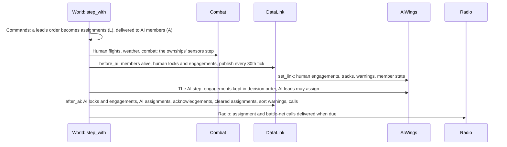

- **Commands** (step 1). `World::wing_order` asks `DataLink::assign` for the
  addressed members and the order's targets (the designation, or a sort), then
  hands each AI member its target through `command_at` as `ConcreteTarget`. The call is made here,
  as the order voice is today.
- **`before_ai`** runs after combat's events (step 10) and before the AI
  (step 11). It refreshes each member's `alive`, reads every ownship's lock and
  contacts, and on ticks divisible by 30 publishes each flight's tracks and
  member state: the humans' as they are now, the AI's as their last step left
  them. Then it hands the AI its input (`AiWings::set_link`), as `set_humans`
  hands it the humans.
- **The AI step** is unchanged in order. Inside it, the engagement table is
  updated as each actor decides (below).
- **`after_ai`** reads every AI actor's lock and target, takes the AI's link
  outputs (an AI lead's assignments, a yield), marks assignments acknowledged
  (the receiver locked the target) and clears finished ones, finds new sort
  warnings, and sends the calls and cues. It runs before the radio (step 13),
  so calls made in the tick are queued in the tick, as the wing's chatter is.

A tick's picture is published from state that every platform computes the same
way, at fixed ticks, so a host and a restored checkpoint agree, and the
published tracks are always the same age within a tick whoever reads them.

### How the AI reads the picture

**The engagement table (slice G1, single player unchanged).**
`ai::link::Engagements` is built at the start of `AiMission`'s decision loop
from every living actor's target, and each actor's entry is rewritten right
after that actor decides. At any actor's turn the table therefore holds what
the live scan returns today: earlier actors' new targets, later actors' old
ones. `step_actor` reads `wing_attackers` from the table instead of scanning
`self.actors`, and `leader_view` takes the leader's target from it. A test keeps
a copy of the old scan and compares it with the table for every actor of every
tick over seeded fights; the baseline must be SAME. `locks_on` and the picture
call `lock_of`, so the RWR and the picture share one lock rule. `aiming_at`
calls `engagement_of`, the rule under it (a living actor's target): the music
asks for a ready guided store, not a lock, and keeps doing so (agent decision,
slice G1).

The mission of opportunity's pool (`fly_opportunities`) stays as it is: it is a
wing's memory, pooled by what pilots say after losing their lead, not the
link, and it was built that way on John's decision of 2026-09-30.

**What the picture then adds**, each its own slice:

| Read | Today | After stage G | Slice |
| --- | --- | --- | --- |
| Who else attacks a candidate | Same-wing AI controllers, live | The engagement table, with the flight's humans' locked targets added at the start of the step | G1 (same result), G2 (humans) |
| An assigned target the wingman cannot see | Refused, "cannot see the target" | Accepted, flown toward the freshest track in the picture until its own sensors hold it | G3b |
| A lead's share | Not connected | B43's loose-control share, through the picture, voiced | G4 |
| Several bandits at the merge | Each wingman ranks on its own | An AI lead sorts; AI members yield on a sort warning | G4 |
| Wingmen's state | Not read | An AI lead skips Winchester, bingo and heavily damaged wingmen | G4 |

*Dropped (John, 2026-10-05).* The design had a **heard point** for Voice-tier
wingmen: the spoken bearing, range and height turned back into a point to
search, with a match radius, a 60-second deadline and a "Tally Ho" reply. With
no tiers every wingman takes the target, so nothing needs it.

**A track pursuit**: the controller's target is the assigned id, and
while its own awareness lacks that id the frame's target view is built from
the freshest track in `LinkInput` (position, velocity, `observed`
tick, flagged as a link track so weapons never fire on it: a launch still
needs the actor's own lock).

### Assignments

`DataLink::assign(sender, order, addressed, designation)` returns one
`Assignment` per addressed wingman:

- Engage my target and Engage from formation: the sender's designation (a
  human) or target (an AI), for each addressed member; refused as today when
  there is no living hostile target.
- Sort (`PlayerOrder::Sort`, Alt+A): `tore_sim::datalink::sort` hands the
  sender's known hostile aircraft within 40 nm (its own contacts, plus the
  picture's tracks) to the addressed members in member
  order, nearest first, distinct while they last, then at most two on one
  bandit; known Winchester, bingo-or-worse and heavily damaged members are
  skipped. Pure geometry over plain rows, so the human's order and the AI
  lead's sort run the same code.
- Disengage, Protect me, Attack on contact, Bug out and Land clear the
  addressed members' assignments; so do the target's or receiver's loss, a new
  target order and a change of lead.

Delivery is always by link: the AI gets the target, a human gets the cues. Every
assignment is also voiced. A blanket attack order that names no target is
called "Attack bandits" and makes no assignment (John, 2026-10-05, slice G3a).

**AI leads** (G4) write assignments through the mission output:
`MissionOutput::link` gains `Assign { lead, receiver, target, order }` events
and `Yield { actor, target }`. Under loose control a lead whose target changes
shares it with formation wingmen up to the two-attacker allowance
(`wing::share_targets`, connected at last), delivered after all actors decide
as today's automatic requests are (`order_wing`). A lead that commits with two
or more known bandits sorts instead, at most
once every 30 seconds per flight (`AiMission::sort_clock`). `after_ai` records
each assignment and voices it.

### Calls and nets

`datalink/calls.rs` words the assignment call as a `comms::Phrase`: the
addressee (`comms::number` of its position, or the flight colour stem for the
whole flight), `^ATTACK`, `^BANDIT`, `^BEARING` with the bearing by
`comms::number(.., falling)`, `comms::miles`, `^ANGELS` with the height. It is
sent with `Comms::send` and one `Hearer` per listener; for a whole-flight call
each hearer's words are its own geometry, as `Hearer::saying` gives a contact
report's. The kind is important (radio silence never drops an order). A
human sender's call replaces the `^ATTACK` order voice and keeps its channel
hold and cut-off; an AI lead's call goes through the channel like wing chatter.
A sort's calls are queued 3.5 seconds apart with `Call::after`.

**Nets** (G8). `Call` gains `net: Net` (`Wing`, `Battle`); every call is
`Wing` today. Each seat's `Channel` gains `battle: bool`, toggled by
`SeatCommand::BattleNet` (Alt+N), off at start. When a flight's lead makes a
contact report or an assignment call, the call also gets a hearer for every
seat of the same side, outside that flight, that monitors the battle net,
with the speaker's flight colour put in front of its words and its label
(`Net Blue one`). The journal's `heard_by` lists them; a call no monitoring
seat hears is journaled exactly as today (`OtherFlight`), so recordings
without a monitoring seat are unchanged. The Network link itself needs no
call: every living aircraft of the side sees the published pictures of the side's other flights.

### Cues and the readout

`CockpitReadout` gains `link: LinkReadout`, filled by `World::cockpit_readout`
from `DataLink::view(plane)` after `readout::build` (so `Combat` is not
touched):

| Field | Holds |
| --- | --- |
| `radar` | The plane's aircraft has a radar: its displays show the cues only if it does |
| `assigned` | The plane's assignment by link: target, assigner, acknowledged |
| `sort` | The newest sort warning's target and other plane, for the cue's lifetime |
| `tracks` | Up to 24 rows, nearest first: target id, position, velocity, source (own, flight, network), lockers (a mask of flight member numbers), locked over the battle net (a plane id), assigned to (a mask) |
| `mates` | Flightmates: plane, member, fuel, weapons, damage |

A plane whose aircraft has no radar still receives the whole `link`; the app
draws the cues only on the displays that aircraft has (slice G6, agent
decision). The app reads it
(`combat_view::readout` to `scope::Contact` and `target_window::Readout`;
`weapon_hud::draw` for the brackets); single player builds it with the rest of
the readout every frame, a client receives it. The sort warning is also a
`Cue::Message` and a direct `^BEEP2` `Cue::Radio` for the seat, edge-triggered
in `after_ai`, so it reaches a client as today's message and radio events do.
What each cue looks like is in the [guide](DATALINK.md#what-the-player-sees).

### On the wire

Summary; the bytes are in the [protocol](formats/net-protocol.md#data-link-stage-g):
two readout parts (the seat's link scalars right after the header, so an
assignment never waits for room; the tracks and mates lists after the
contacts), one event (`Link`: an assignment given, cleared or acknowledged, a
lock taken or dropped, a sort warning, for members of the seat's flight), the
`Sort` order and `BattleNet` command in the inputs, and the net on radio
events. Locks and assignments therefore reach a client in the next snapshot
and are repeated until acknowledged, which is John's "sent immediately as
reliable events". The tracks change only on publishing ticks, so between them
the readout's delta coding sends nothing for them. Estimate: a busy seat's
link parts are under 40 bytes a snapshot on average, about 1 KB/s at worst
while 24 tracks move; G7 measures them on the 15 against 15 mission. All of
it is one protocol version, the next one the lead hands out.

### Replays

`DataLink`'s journal holds `member` (each plane's radar flag, at the start),
`assign` (receiver, target, assigner, order, and the call's words),
`clear` (and why), `acknowledge`, `lock`, `unlock` and `sort_warning`. Like
the communication journal it is write-only, bounded at 1,024 entries between
drains, and draws no random number. The recorder drains it every tick into
`datalink.*` events (`tore_replay::vocab`), new kinds within the format's
version ([versions](REPLAYS.md#versions-and-damage)). The assignment calls are
ordinary `comms.radio` entries with the trigger `data link assignment`. A
client's capture conversion (stage E) makes the same events from the `Link`
events it received (slice G7).

### State for exact checkpoints

Stage H must carry the state stage G adds. Named here so the checkpoint design
can list it:

| Owner | State |
| --- | --- |
| `tore_world::datalink::DataLink` | `members` (with `alive`), `pictures` (each flight's publish tick, tracks and member status), `locks`, `engaged`, `assignments` `warned`, `seat_warned`. The journal is write-only and local, like the communication journal: whatever H decides for that one applies |
| `tore_world::comms` | Each seat's `Channel::battle`; `Call::net` on every queued call |
| `tore_sim::ai::AiMission` | `sort_clock` (each flight's last sort tick); the link input set at the start of the step (rebuilt by `before_ai` each tick, so H may rebuild it rather than code it) |
| `tore_sim::ai` actor and controller | The track pursuit flag; each actor's yield list (target, until tick) |
| Not state | The radar table (from the aircraft type); the engagement table (rebuilt from the controllers at the start of each decision loop); the per-seat views and the readout |

No new random stream exists, so H has none to add.

### Single-player changes

Each change is its own slice with a single-player baseline comparison
(`.local/mp-baseline`) against the merge before it, every difference
explained in the slice's report. John approves the listed differences before
the merge.

| Slice | Change | Differences expected |
| --- | --- | --- |
| G0, G1, G3c, G7, G8 | None | SAME (G3c's key and G8's monitor change nothing until used) |
| G2 | The AI counts a human's locked target | AI wingmen of the player's flight rank the player's locked bandit 10,000 ft lower (and 20,000 ft at the allowance): different targets and everything after, only in probes where the player locks |
| G3a | The order voice says the assignment call | The order's journal entry and recording stems for Engage my target and Engage from formation; no motion changes |
| G3b | Wingmen take assignments by link | Probes with those orders: wingmen no longer refuse a target only a flightmate's track holds |
| G4 | AI leads share and sort; AI yield | Every probe with an AI-led wing under loose control or AI wingmen: targets, launches and kills move; the radio journal gains AI assignment calls (heard only by the flight) |
| G6 | Cues drawn | No recording changes; GPU captures change only where a flightmate locks or an assignment exists |
| G9 | `datalink.*` events recorded | Recordings gain the new events and nothing else |

### Testing

Targeted per slice (the table below), each test added to the suite; the AI
lane's `--probe-wing-order` grows a `sort` order and a recipient
(`TICK:ORDER@MEMBER`), the probe a `--probe-player-lock TICK:ID` step, and the
probe prints a `data link:` line for every assignment, warning and yield so
scenarios can assert on them. New files get `tools/battery_selection.py`
rules in the slice that creates them. The full run at the end of the
milestone covers: the AI lane (its data link scenarios and every scenario the
single-player changes move), the `net` lane's data link scenario, the
render lane's link-cue captures, and the long ignored tests G7 adds.

### How stage G lands

Slices on `mp/g-<topic>` branches, each with the quick check per change, the
check list at the end and the single-player baseline when the table says so.
"Opus" slices are a determinism refactor or the wire, as John asked; the rest
are Sonnet.

| Slice | Model | After | Files it owns | Work | Acceptance |
| --- | --- | --- | --- | --- | --- |
| G0 Radar table and picture | Sonnet | | `tore-sim/src/datalink.rs` (and its `lib.rs` line), `tore-world/src/datalink.rs`, `datalink/{picture,view,ai_input,journal}.rs` and tests, `world.rs` (field, `before_ai`, `after_ai`), read-only accessors in `ai_wings.rs`, the AI probe's options in `tore-app` (`--probe-player-lock`, the `@MEMBER` recipient, the `data link:` line), `tools/battery_selection.py` | The radar table; members, locks, engagements, publishing; `view` and `ai_input` skeletons; the journal; the probe options; nothing consumes the picture. **Built (G0, 2026-10-05):** `tore_sim::datalink` (`has_radar`) and `tore_world::datalink` (`DataLink`, `Member`, `Scene`, `Journal`, `LinkView`, `AiInput`), with `World::datalink` read after combat's events (`before_ai`) and after the AI step (`after_ai`) and reset by a restart. Nothing consumes the picture, so the AI decides exactly as before. The build settled these, each an agent decision. The members are rebuilt from the roster every tick, the aircraft type being the ownship's or the actor's, and a plane that is dead holds no lock and no engagement. Every living member reports tracks and member state, the radar-less included. Built first with Voice, Flight and Network tiers and reworked on John's decision of 2026-10-05 to the radar flag. A human's fuel reports Normal, Fumes or Out, because joker and bingo are judged against the home point the crew voice keeps; the AI's reports all five levels from its controller. Locks use the weapon phase test of `locks_on` until G1 adds `lock_of`. The assignment, warned and seat-warned tables exist and are empty, so G3a, G3b and G6 fill them without editing `datalink.rs`. The probe gains `--probe-player-lock TICK:ID` (a designation, so the lock follows when the sensors hold it), `TICK:ORDER@MEMBER` (member 1 is the first wingman) and `--probe-data-link`, and prints `t=T data link: member`, `lock` and `unlock` lines only when asked, so every other probe's output is unchanged. AI scenario `ai-datalink-picture` (family `ai-datalink`). Single player: SAME, see the baseline in the slice report. | Every `AircraftId::SELECTABLE` has an entry, F-22N and F/A-XX resolve to the F-22A; a radar-less member is linked all the same; tracks change only on ticks divisible by 30; locks and engagements match the ownships and controllers on the crowd fixture; two runs equal; baseline SAME |
| G1 Engagement table | Opus | G0 | `tore-sim/src/ai/link.rs` (new, and its `mod` line), `ai/mission.rs`, `ai/controller.rs`, `ai_wings.rs` | The decision-order engagement table; `wing_attackers` and `leader_view` read it; `lock_of` shared by `locks_on`, `aiming_at` and the picture. **Built (G1, 2026-10-05):** `tore_sim::ai::link` holds `Engagements` (one row per actor in actor order: id, side, wing, target), `engagement_of` (a living actor's controller target) and `lock_of` (that, while the weapon service tracks or fires). `AiMission::step_using` builds the table before its decision loop and rewrites an actor's row right after `step_actor` returns, early returns included; `step_actor` and `leader_view` take it as an argument, so no AI type gains a field and the checkpoint coders are untouched. `locks_on` and the picture's `ai_target` call `lock_of`; `aiming_at` calls `engagement_of`, because the music asks for a ready store, not a lock (agent decision). The decision loop runs on the calling thread and workers still only prepare observations, so the same-tick visibility holds with workers on. The build settled these, each an agent decision. The "test-only copy of the old scan" is `link::audit`: a thread-local switch, off unless a test starts it, that compares the table with the old scans (the wing attacker list and the leader's target) at every actor's turn; off, it costs one thread-local read per actor step. It runs on the 30-actor (15 against 15) mission fixture of the observation tests with its scripted damage, crashes, landing orders and human handoff, a shuffled pool against the serial reference with complete state compared each tick (`ai/link_tests.rs`; every executor and both seeds for ten simulated seconds is ignored, about four minutes, for the full suite), and in `tore-world` on the crowd fight with both leaders ordering their AI in, the AI fight with a plane handed back and an enemy taken mid-fight while two enemies crash, and the open mission with handoffs (`world/engagement_tests.rs`). A mutation that skips the row rewrite fails at the first tick. Single player: SAME, see the baseline in the slice report. | A test-only copy of the old scan equals the table for every actor of every tick over seeded fights (crowd, 15 against 15, with handoffs and deaths); baseline SAME |
| G3a Assignments and calls | Sonnet | G0 | `datalink/{assign,calls}.rs`, `world/commands.rs`, `ai_wings/orders.rs` | `DataLink::assign`, its clearing rules, the call's words and hearers, the human order voice replaced; a blanket attack order that names no target says "Attack bandits" (John, 2026-10-05); delivery to AI still `ConcreteTarget` | Words and stems for bearings 5, 90, 270, ranges 0.5, 1, 15, 20, 30 and heights 0 and 20,000 ft; per-hearer geometry; the call is important and keeps the channel hold; clearing on each rule; baseline differs only in order calls (explained) |
| G6 Cues | Sonnet | G0 | `readout.rs`, `frame.rs`, `target_window.rs`, `datalink/{view,warning}.rs`, `tore-app` `scope.rs`, `instruments.rs`, `weapon_hud.rs`, `combat_view.rs`, `main.rs` (the HUD's assigned target), `flight_ui.rs` if needed, the `replay_target` call sites | `LinkReadout`; the sort warning; radar markers, target window tags and mate line, HUD brackets | Unit tests for each marker, the tag's priority, the brackets' blink and their end on lock, the warning's edge and cooldown; a headless capture of a linked scene, and of one with a radar-less aircraft that shows no cue on the missing display; single-player recordings SAME |
| G2 Humans in the table | Sonnet | G1 | `ai/mission.rs`, `ai/link.rs`, `datalink/ai_input.rs`, `ai_wings.rs` (`set_link`) | Human locked targets enter the engagement table; `AiWings::set_link` | A wingman ranks the player's locked bandit with the penalty; AI scenario `ai-datalink-player-lock`; baseline differences explained |
| G3b Assignments reach the AI | Sonnet | G2, G3a | `ai/controller.rs`, `ai/wing.rs`, `ai/link.rs`, `ai/mission.rs`, `ai_wings/orders.rs`, `datalink/assign.rs` | Track pursuit; the refusal replaced. `TargetOrder::Heard` and "Tally Ho" are **dropped** (John, 2026-10-05: no Voice tier) | A wingman pursues a target only a flightmate tracks and fires only on its own lock; AI scenario `ai-datalink-order-link` (F/A-18D); `ai-datalink-order-voice` is dropped; baseline differences explained |
| G3c Sort order | Sonnet | G3b | `tore-sim/src/datalink/sort.rs`, `ai/wing.rs` (`PlayerOrder::Sort`), `datalink/assign.rs`, `input_catalog.rs`, `docs/CONTROLS.md`, `docs/tore-keyboard-map.html`, the probe's order names, `tools/battery_scenarios/ai.py` | Alt+A; the sort; calls 3.5 s apart | Sort tests (distinct, nearest, two at most, skipped members); the controls test; AI scenario `order-sort-wing4`; baseline SAME |
| G4 AI leads | Sonnet | G3c | `ai/mission.rs`, `ai/link.rs`, `ai/controller.rs`, `ai_wings.rs`, `datalink/assign.rs` | Share, sort, yield, member state for AI leads; `MissionOutput::link` | Share caps at two under loose control and not under medium; a lead sorts once in 30 s; yield by member number, never a human; AI scenario `ai-datalink-lead-sort`; baseline differences explained |
| G8 Nets | Sonnet | G3c | `comms.rs`, `comms/journal.rs`, `radio_calls.rs`, `world/commands.rs`, `input_catalog.rs`, `docs/CONTROLS.md`, `docs/tore-keyboard-map.html` | `Net`, `Channel::battle`, Alt+N, battle-net hearers with the colour | Only monitoring seats of the side outside the flight hear it, with the colour; the journal unchanged without them; the controls test; baseline SAME |
| G9 Replay events | Sonnet | G3a | `tore-replay/src/vocab.rs`, `tore-app/src/replay/recorder*`, the replay exports and panels, `docs/REPLAYS.md` | `datalink.*` events, summary lines, the Comms panel | Recorded events round-trip; the summary counts them; a golden refreshed; baseline differs only by the new events |
| G7 Wire | Opus | G6, G8, G3c, G9 | `tore-session/src/wire/*`, `wire-golden.txt`, `tore-session/src/client/*` as needed, the capture conversion's event mapping, `tore-app/src/net/play.rs`, `docs/formats/net-protocol.md` | The two readout parts, the `Link` event, `Sort` and `BattleNet`, the net bit, the converted replay's `datalink` events; the next protocol version | Round trips, lossy rebuild, fuzz; the golden; a seated bot's link readout equals the host's at every snapshot; link bytes measured on the 15 against 15 mission; a `net` lane scenario with a bot receiving an assignment; baseline SAME |
| G10 Acceptance | lead, then John | all | docs | The plan's acceptance: a single-player flight with F/A-18D wingmen shows the cues and voices the assignments; a flight with a radar-less aircraft in it is linked all the same and its player sees no cue on the missing display; John approves the differences | Evidence in the slice reports and a `docs/baselines/datalink-<date>.md` |

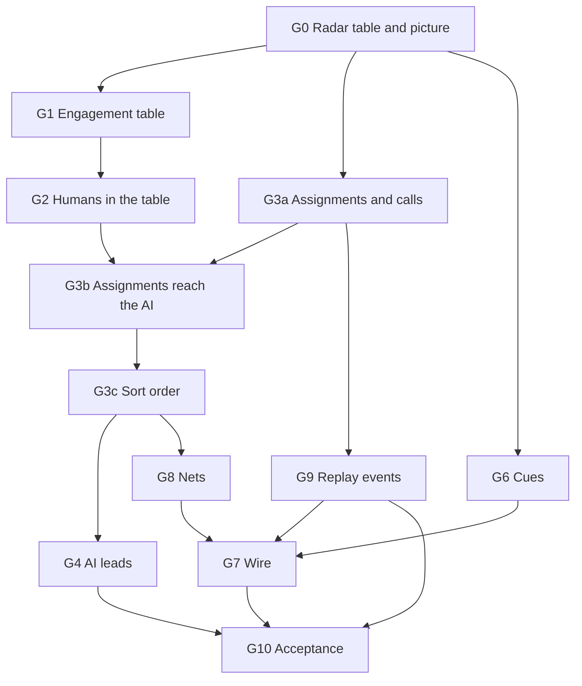

G1, G3a and G6 run together after G0, and G9 joins once G3a merges: their
files do not meet (G1 owns `ai_wings.rs` and the AI mission, G3a the orders
and `world/commands.rs`, G6 the readout and the app's displays, G9 the replay
crate and recorder). G4 and G8 run together. G3c and G8 both edit the
controls list and `input_catalog.rs`, and G3a and G8 both edit
`world/commands.rs`, so those run in order. Stage F's phase 2 also adds keys
(reply and request keys): whichever lands second takes the other's keys into
the controls list, and Alt+A and Alt+N are only proposals until John confirms
them. G6 and G3c both edit `main.rs` (the HUD's assigned target; the probe's order
names); G6 normally merges long before G3c starts, and if they overlap the
second rebases on the first. G7 converts captured `Link` events into the
replay's `datalink` events, so it follows G9.

## Network sessions

Design for stage D of the [multiplayer plan](multiplayer-plan.md#stages),
written by the lead on 2026-09-30, revised the same day after an independent
review, and reviewed by John the same day: his answers are in the guide's
[decisions](MULTIPLAYER.md#decisions). It is being built slice by slice; the
[slice table](#how-stage-d-lands) marks each slice that is built.
Every choice here is an agent decision unless it is credited to John. The three
follow-up specs the plan assigns to stage D are:

- the wire protocol: [net-protocol.md](formats/net-protocol.md);
- the netcode numbers: [multiplayer guide](MULTIPLAYER.md#netcode-numbers);
- the dedicated server: [DEDICATED-SERVER.md](DEDICATED-SERVER.md).

In short:

- A **host** runs the mission's `World` on a fixed 120 Hz clock that, once the
  mission flies, never pauses. In stage D the host is the dedicated server,
  `tore-server`, a program with no window, GPU or audio. Stage E puts the same
  host inside a player's game.
- A **client** is a player's game joined to a host. It loads the mission from
  its own import, flies its own aircraft ahead of the host with its own inputs
  (prediction), draws everything else a little in the past between the host's
  snapshots (interpolation), and shows the cockpit readouts the host computes
  for it.
- The flight screen stops reading the simulation directly. It draws a
  **flight frame**: the player's plane and flight state, the picture of the
  mission, the cockpit readout and the tick's cues. Single player fills the
  frame from its own `World`; a client fills it from its session. That is how
  one set of screens serves both.
- Single player does not change. Every slice must compare SAME with the
  single-player baseline; stage D plans no single-player behaviour change.

### Surveys behind the design

Three read-only surveys at `2ada9f8` (kept in the lead's local notes, not
committed) found:

- **No mission can be built without the game app.** `World` has no
  constructor: the creator's Fly button, the AI probe and the tests each
  assemble one by hand in `tore-app` (`Action::MissionFly`, `ai_probe_run`),
  with the creator's list indices, the drawn aircraft (`Airframe::load`) and
  `CombatView` in the path. The import lived
  in the app binary (`assets.rs`, `media_source.rs`), which links the audio
  library, so a Linux server without ALSA could not even start it; slice D3a
  moved it into `tore-import`.
- **The tick assumes a human.** `World::step_with` refuses a tick with no
  human-flown plane; combat's `own()` and `own_id()` panic without an ownship
  and serve "the first ownship" as the presented one; the tick's picture and
  one radio path read `cockpits[0]`. Plane 0 is never an AI actor or a combat
  target row: the creator removes the player's slot from Friendly Wing 1, and
  plane 0 starts from the player's start and layout.
- **The screens read live simulation state.** The HUD, weapon HUD, scope, RWR,
  target window, weapon page, map, seeker tone, RWR tone and situation music
  read the ownship's private combat state and run simulation logic on it
  (`OwnshipView::readiness`, `estimated_hit_percent`, `seeker_tone` and
  others), about 180 call sites. Several are evaluated every frame from the
  frame's interpolated flight, not once a tick. Many places assume that the
  player is aircraft 0.
- **A human plane's part of the tick is small but not only the flight
  model.** One hybrid flight step takes well under a microsecond and needs the
  flight state, the pilot input and the terrain under the aircraft. Around it
  the tick adds building contact (which ground objects still stand),
  turbulence (the cockpit's own state and random stream, and the weather
  clock's reading), the world-edge and OVERSPEED rules, and, every tick, what
  combat writes back: the payload (stores less the external fuel burned), the
  bay held open for a release, radar and jammer forced off by failures, and
  the damage figures. The flight state is 3,256 bytes, 1,512 of them a
  write-only trace.
- **A full mission is cheap to host.** The AI probe's 15 against 15 fight (30
  aircraft) steps in 1.1 to 1.2 ms per tick on the development machine
  (release build, Ryzen 9 7900X): about 14 percent of one core at 120 Hz.
- **The replay coder is a model, not a library.** Its quantization steps and
  bounded reader fit, but it is byte oriented, private to `tore-replay` and
  predicts each tick from the one before, so one lost packet would break it.

### Crates

Stage D adds five crates, all on the standard library only. No new external
dependency. Slice EF-M adds a sixth, `tore-realtime-native`, the hosts'
macOS timing.

| Crate | Kind | Holds | Depends on |
| --- | --- | --- | --- |
| `tore-codec` | library | Bit writer and bounded bit reader, variable-length integers, quantizers, FNV-1a and CRC-32. Shared by the wire, the exact own-plane coder and, in stage H, the checkpoints | std only |
| `tore-net` | library | UDP transport, packet header and checksum, connection handshake, acknowledgements and round-trip time, reliable ordered messages, statistics, and the network simulator. **Built (D2).** The host and client are state machines that never read a clock or touch a socket: the caller passes the time in, feeds them datagrams and sends what they give, over a UDP socket or the simulator (agent decision). *Slice EF3 adds* the in-process link (`link`) a hosting game flies through, and takes from `tore-server` the dual-stack `ServerSocket` (EF-X: it refuses a port another socket holds for IPv4 on every system, [the game port on each system](#the-game-port-on-each-system-ef-x)) and the sleep-then-spin `wait_until`, which the dedicated server and the game's host thread now share ([the host inside the game](#the-host-inside-the-game-stage-e)). *EF4 adds* `Server::set_silence_exempt`, which a hosting game uses for its own player's connection ([the lobby](#the-lobby)). *EF-K adds* the Keepalive packet and the `Keepalive` thread a joined game runs while its loop is stalled ([a stalled game stays connected](#a-stalled-game-stays-connected-ef-k)). *J1 adds* routers to the simulator ([the NAT simulator](#the-nat-simulator)) | tore-codec |
| `tore-import` | library | The data folder, the import pack's reader and writer, media detection and the import itself, moved out of `tore-app` so a server can import and load without the game. *Built (D3a).* | tore-formats |
| `tore-session` | library | The game's side of networking: the wire messages, the host session (clock, inputs, snapshots, joins), the client session (prediction, interpolation, clock steering, readouts) and the headless bot client. *Wire built (D6)*: the module `wire` has every section and message, the cockpit readout's included, with each end's bookkeeping (acknowledged baselines, priorities, the event queue, the name table) and no clock or socket ([what it settled](formats/net-protocol.md#what-the-games-sections-settled)). *Host built (D7a)*: the module `host` ([the host session](#the-host-session)). *Client built (D8a)*: the modules `client` ([the client session](#the-client-session)) and `bot`, and the `tore-bot` program, which loads an import through `tore-import` | tore-world, tore-net, tore-codec, tore-import |
| `tore-server` | binary | The dedicated server: configuration, import, logging and the console. **Built (D7b):** options, configuration file, `--import`, `--check`, start-up refusals, the real-time run loop, the console, status lines and the log, around `tore_session::Host`. The run loop drives the host through a small `Host` trait (`host.rs`) that `wiring.rs` implements with `tore_session::Host`, so the loop, console and log are tested against a scripted host on a fake clock (agent decision). Which build is a release is `app::is_release`, the stamped `TORE_BUILD_VERSION` tag, which the game's `--connect` (D8) must use too. *EF-M:* on macOS its loop runs as a real-time thread and it holds App Nap off for its life (`clock.rs`) | tore-session, tore-import, tore-realtime-native |
| `tore-realtime-native` | library | Keeping a fixed-rate loop on time on macOS: a Mach time-constraint policy for the calling thread and an `NSProcessInfo` activity, latency-critical and user-initiated; no-ops elsewhere. **Built (EF-M)**: the game's host thread and `tore-server`'s loop use it ([sleep and wait accuracy on each system](#sleep-and-wait-accuracy-on-each-system-ef-x)). Its unsafe calls stay inside it, as in `tore-diagnostics-native` | objc2, objc2-foundation (macOS only) |

`tore-sim` and `tore-world` gain `tore-codec` for the exact own-plane state and
the readout coding. `tore-app` gains `tore-session` and `tore-import`. The plan's
`tore-master` is stage I. *Agent decision:* the plan listed `tore-net` and
`tore-server` for stage D; `tore-codec` keeps the simulation crates from
depending on a network crate, `tore-import` keeps the audio library out of the
server, and `tore-session` keeps sockets and threads out of `tore-world`, whose
[rules for mission state](#rules-for-mission-state) forbid them.

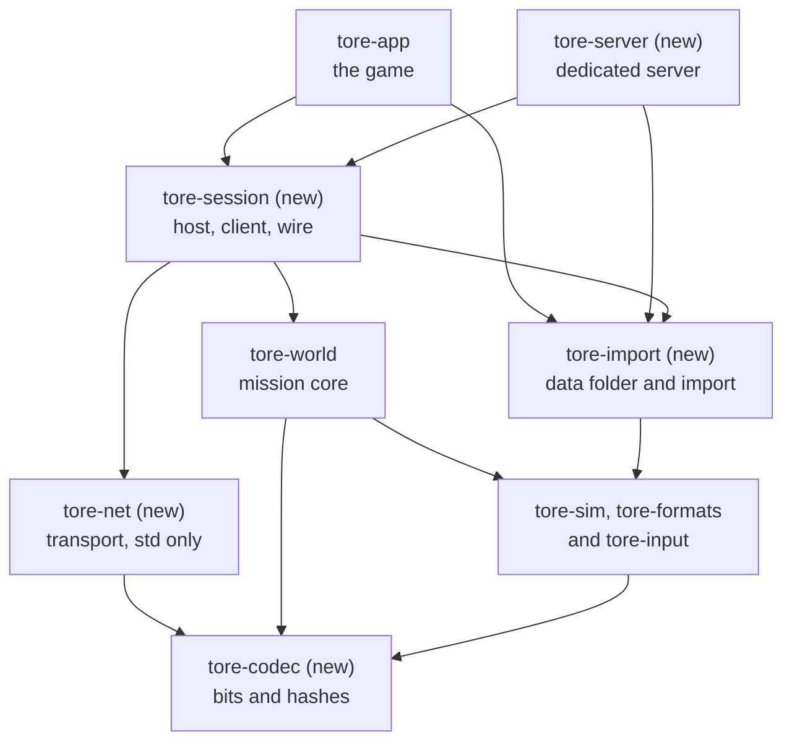

(`tore-import` depends on `tore-formats` only; the diagram draws the existing
simulation and data crates as one box.)

### A mission with no window

**The mission as data.** *Built (D3b).* A `MissionSpec`
(`tore_world::mission`) is a Quick Mission written with stable names instead of
the creator's list positions, which differ between installs: the theater code,
the condition (clear, cloudy, foggy, dawn, sunset, night) and any resolved
weather overrides (time of day, wind, cloud deck), the start (airborne
altitude, or the runway object for a ground start), the separation, six wings
(aircraft by its selection key such as `F18.PT`, or `faxx` for the F/A-XX,
which shares `F22N.PT` with the F-22N, count and skill), the preset and group
objectives and survival, guns only, the cheats in force, the flight models (the
hybrid model for the humans, `AllHybrid` for the AI in every networked mission,
John 2026-09-28) and the loadout of plane 0 when a player flies it from the
start. It has a text form of `key value` lines like the preference files
(`MissionSpec::from_text` and `to_text`), which the server's
[mission file](DEDICATED-SERVER.md#the-mission-file) uses and a host sends to
every joining client. Parsing refuses anything out of range and names the
line, and a test parses the guide's own example, so the two cannot drift.
Things the game sets by flag or by environment variable and a server has no use
for (`--enemy-skill`, `--fixture-wings`, `--legacy-flight`, the weather
overrides, the loadout) are fields too, with the creator's defaults when a file
leaves them out. *Agent decision:* a ground start keeps the creator's altitude
setting, because the creator's check that airborne aircraft clear the ground
reads it even then.

**Building it.** *Built (D3b).* `World::new(&MissionSpec, &dyn ResourceSource,
Seating)` builds the mission with no app: the terrain for the theater and
condition under the spec's weather overrides, the aircraft types, the player's
loadout, the layout and the clearance checks, combat and the AI wings, and then
the start, which is `World::restart` run once,
exactly as the creator's Fly button and `restart` did by hand before. The
creator's refusals keep their text (guns only with a missile loaded, ground
start without the hybrid model, altitude under the terrain).
`Seating::SinglePlayer` is today's mission: seat 0 flies plane 0 with the
loadout the spec gives it; `Seating::Open` puts every plane on the AI (below).
`World::build` is the same with the caller's
`Hooks` and returns what the start reported beside the world; the game passes
its own drawn-model loader so that one load of each aircraft type serves both
halves, the player's already loaded type, and the loadout screen's weapon
display names (the simulation's weapon rows carry them, and the screens print
them). A caller that goes on to call `restart` starts the mission a second
time, so the game's Fly builds the world, swaps it in and runs only its own
presentation resets. The creator turns its draft into a spec
(`QuickMission::mission_spec`), single player and the server share the one
path, and the single-player baseline guards it. The simulation half of
loading an aircraft is `AircraftType::load` (`load_type` for an `Arc`): parse,
identity check, sensors, flight model. The engine outlets come from the drawn
shape, so the game's `Airframe::load` sets them on what `load` returns and a
headless host leaves them empty; a client works them out from its own art.

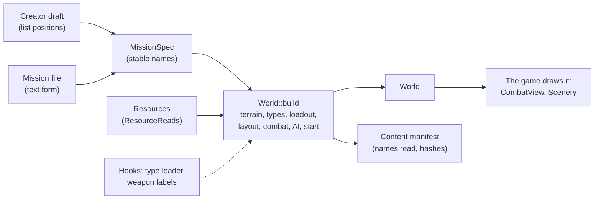

`World::restart` still rebuilds the flight from the `Setup` and the combat the
build made, as it did from the creator's (the population and the accepted
layout persist in combat, which is what a restart of a Quick Mission has
always reused); to rebuild a mission from its spec, which is what a server
does when a mission ends and the next begins, call `World::new` again.
*Correction to the design*, which said restart rebuilds from the spec. The
build applies the spec's cheats through the same `Settings` command the flight
menu sends, and only when they are not the defaults, so a build that set the
AI's guns only is not undone by a command that says nothing. The AI probe
stays on its own path, on purpose: it builds its combat from the aircraft's
default load rather than a creator loadout, edits the creator's draft in place
for its geometry flags, sets up probe-only formation tracing, scripted starts
and pilots between the steps of the build, and never restarts (its `Setup`
carries no AI). Moving it would need probe hooks in the middle of
`World::build` for no gain, since `World::new` is now the headless path.

**Open seating and no human.** *Built (D3c).* `Seating::Open` is a networked
mission: the AI flies every plane, plane 0 included, and humans take planes by
[handoff](#handoff-between-the-ai-and-a-human) and give them back at any time.

- **Plane 0 on the AI.** Friendly Wing 1 keeps its full count
  (`MissionSpec::open_wing_launches`), so plane 0 is the wing's member 0: an AI
  actor that leads the wing, and a combat target row like its wingmen.
  `Combat::open()` starts with no ownship and numbers its aircraft rows from 0
  (`live::State::open_mission`), and the snapshot looks a row's model up from
  the first row's id rather than by `id - 1`. Plane 0 starts from the spawn
  plan like its wingmen (`ai_wings::mission_spawns_for(.., player: false)`),
  on the spot single player's player would take: `restart` works out that
  start (altitude, the layout's turn, the runway) the same way for both and
  places the wings around it. A ground start parks Friendly Wing 1, the wing
  the departure is laid out for, whether or not a human flies in it, plane 0
  on the first slot with the lead's seed. Every AI aircraft flies the hybrid
  model (`AllHybrid`, John 2026-09-28).
- **A tick with no human.** `World::step_with` takes no seat input; combat
  steps with no ownship; the AI gets no human aircraft; the radio, the crew
  voice, the tower and the result checks have no cockpit to serve. Nothing on
  the build, the tick or the handoff calls `Combat::own()` or `own_id()`.
- **Handoff both ways at any time**, plane 0 included, and the last human
  giving back the last plane. A plane given back while its rounds are in the
  air: each round takes its own copy of its station's weapon record
  (`live::State::remove_ownship`), as the AI's rounds carry theirs, so it
  flies on with no ownship to look it up in.
- **The picture.** With no cockpit there is no picture plane
  (`World::picture_plane_if_any()` is `None`) and the render history keeps
  nothing: it is emptied when the last human leaves, and starts over from the
  first cockpit's plane when a human takes one or the first cockpit changes
  hands (*agent decision*: a server draws nothing, so it keeps no history).
  `World::picture_plane()` stays for presenters, which always have a cockpit.
- **Restart.** `World::restart` of an open mission starts it again with every
  plane on the AI: every cockpit and seat goes, and humans take planes again.
  A server starts each new mission with `World::new` anyway.
- **What an open spec refuses** (*agent decision*, refused rather than
  overridden so a mission file says what it flies): straight-flight fixture
  wings (nobody would fly), a player loadout (nobody flies from the start;
  plane 0 carries the AI's standard stores, with Guns only applied as for any
  AI aircraft), and the legacy human or standard AI flight model.
- **Per-plane loadouts.** *Built (EF4).* An open spec's `plane_loadouts`
  are the loadouts the lobby's players chose for the planes they hold
  (`plane-loadout` lines in the text form): the build checks each
  ([the lobby's rule](#the-lobby)) and puts it on that plane's AI aircraft
  (its stores, quantities and fuel), which a human taking the plane keeps
  through the handoff; a plane with none carries its standard load. Single
  player refuses them and keeps plane 0's `loadout` as before.
- **Single player** takes the same path as before: the same start, the same
  build of the AI with its one human, and the baseline compares SAME.

**Resources and the content check.** `tore-import` loads the pack into the
same name-to-bytes map the app uses today. *Built (D3b).* `World::new` reads it
through `ResourceSource`, a read-only lookup that the plain map and
`ResourceReads` both provide (*agent decision:* the view is `ResourceReads`, so
as not to clash with `tore_import::Resources`, the map's name). `ResourceReads`
notes every name the build asks for, present or not, and
`ResourceReads::manifest` gives the sorted names with an FNV-1a 64 hash of each
resource's bytes: the mission's **content manifest**. A name the build asked for
that the import lacks has no hash, so a file one side has and the other lacks
is a difference too, and `Manifest::differences` names them. The theater
catalog the terrain reads to label the theater opens every theater grid, so
all sixteen `.T2` files are in the manifest.
A client builds the same mission from its own import and compares manifests at
join. Only what the simulation reads is compared, so a 1.0 disc import and a
1.02F import play together: slice D3a compared the two imports resource by
resource and found 24 of 4,093 that differ, all menu, dialog, HUD and
mission-module files that differ by four bytes (the link timestamp in their
headers); every aircraft, weapon, sensor, theater, object, shape and radio
resource and every entry the import derives from `FA.EXE` is byte-identical
([result](formats/esa-installer.md#the-import-pack-under-both-builds)). A
difference is refused with the names of the files that differ.

**What a joining client also needs.** The host tick, from which the weather
clock's reading follows (its seconds of day and ticks are a function of the
tick and the mission's start time), and the combat's contrail sortie number,
which sets each aircraft's contrail height. Both travel in the Mission message.

### One step for a human's plane

*Built (D4, the shared step).* The per-plane part of the tick is one set of
functions in `tore-world`, `world::plane`, that `World::step` calls for every
cockpit in the tick's order and a client calls for its own plane with no
`World`, `Combat` or `AiWings`:

1. `fly`: the flight at the start of the tick is kept, the flight steps with
   the pilot's input over the terrain's surface, and building contact is
   tested against the ground objects still standing (a crash, or a rebound
   with no crashes).
2. The weather clock steps; this is the mission's, not the plane's.
3. `after_weather`: turbulence from the cockpit's own state and random stream
   and the weather clock's **reading** at that tick (its native ticks and
   seconds of day, `WeatherReading`), then the world edge and OVERSPEED with
   their message clocks. It returns the warning lines and the turbulence
   shake for the seat.
4. Combat steps, and its step hands each flight to two write-backs with the
   plane's **ownship terms** (`OwnshipTerms`, plain data):
   `take_system_hits` (a systems hit for every subsystem hit the ownship counts
   beyond the flight's own, with the notice for a damaged hardpoint, and the
   crash when the systems are fatal), then, after combat has reacted to that
   crash, `take_combat` (the payload less the external fuel burned, the bay
   held open for a release, radar and jammer forced off, the damage fraction,
   section and regions, the impact report on a damage event, and the crash
   and the pilot's death at no hit points or on a cockpit hit).
5. `take_event` for each of the tick's combat events: a missile blast's jolt
   and the ownship's destruction.

`OwnPlane::step` runs all of these in that order for one plane, after giving
the flight the seat's sensor controls as the command phase does. Single
player keeps its results exactly: the functions are the old code in the old
order, moved, and the tick fingerprint (`world/tick_tests.rs`) did not move.

What the step reads besides the plane's own state (the flight, the flight at
the start of the tick, the turbulence state and random stream, and the two
message clocks) is an argument:

- the terrain, which a client builds from its own import; the step reads no
  weather clock from it, only the reading it is given;
- the ground objects standing as the tick starts, which a client learns from
  the host's destruction events;
- the weather clock's reading after its step, a function of the host tick
  and the mission's start time;
- the **ownship terms**, what changes during the mission: the 45 subsystem
  hit counts; the radar, visual, infrared and jammer failures; the stores'
  weight; whether a release holds the bay open; hit points; the broken
  section; and the damage taken in each of the six sections, in whole points.
  *Correction to the design*, which listed fewer: the visual and infrared
  failures and the subsystem counts are read too, for the hardpoint notices
  and the systems hits;
- the plane's ownship **configuration**, what the loadout fixes: the damage
  capacity, the external tanks, the stations' names and each sensor's
  hardpoint. *Agent decision:* it is mission data the client already has, like
  the aircraft type, so it stays out of the terms and is never sent;
- the tick's combat events; those about other planes change nothing.

`TickOutput::terms` carries each plane's terms of the tick. The command
phase's rarer flight writes, a mission's new cheats and the payload after a
range command, are not part of the step. The systems messages stay queued on
the flight for the caller, which `World::step` drains into the seat's HUD cues.
A test flies a copy of a plane beside the `World` from tick 600 to 1,200 with
only what the step reads, for the single-player tick mission (turbulence,
gear, throttle, flaps, gun) and for a human wingman of the crowd fixture that
fires, is hit and is shot down, and the copy matches the cockpit to the last
bit, trace included (`world/plane_tests.rs`).

On the host the ownship terms come from combat each tick. A client uses the
terms of its latest snapshot and keeps them until the next one: they change
only when the plane fires, is hit or fails, and the host then sends the exact
state (below). The standing ground objects come from the host's destruction
events.

#### The exact state of a human's plane

*Built (D4).* `world::plane::ExactState` is everything the step reads and
writes that is not the mission's fixed data: the flight state, the cockpit's
turbulence state and random stream, the two message clocks and the ownship
terms the plane last took. It codes against an optional baseline, an earlier
exact state of the same plane the reader also has, and its hash is FNV-1a 64
of its coding with no baseline, the own state hash of the
[snapshot header](formats/net-protocol.md#the-own-aircraft).

- **Coded:** every field of the flight state, the private ones included (the
  hybrid model's state and random stream, the weight-scaled stall factor,
  `lift_g`, the systems with their queued messages, the autopilot, the escape
  and the wreck, the armed ejection), in `tore-sim` beside each type
  (`flight::exact`). Each 64-bit value is the exclusive-or with the baseline's
  (`tore-codec`), so an unchanged field costs one bit; smaller integers and
  enums are coded the same way as 64-bit patterns, flags as one bit.
- **Not coded:** the write-only trace, which equality ignores and the next
  step rewrites; the flight at the start of the tick, which the next step
  overwrites before it reads it (a decoded plane starts with it equal to the
  flight); and the imported tables. The decoder takes the aircraft type's
  flight model as the import builds it and rebuilds the weight-scaled envelope
  polygons from it and the coded scale with the step's own code. The native
  research adapter is refused.
- **Every field named.** Each coder destructures its struct and builds it
  back with every field listed and no `..`, so a field added to any part of
  the state without coding it fails to compile. The two random-stream and
  clock types in `tore-formats` gained accessors for their raw parts, for
  this restore only (lead-approved, 2026-09-30).
- *Agent decisions:* the coding choices above, that is, small values as
  64-bit patterns against the baseline's, the message clocks and queued
  messages coded, the flight at the start of the tick and the ownship's
  configuration left out.
- **Measured:** an airborne hybrid-model plane codes to 331 bytes with no
  baseline and 204 to 226 against its state 4 ticks earlier (tore-sim test);
  with the turbulence stream and terms, the crowd fixture's human wingman
  through its fight costs 163 to 257 bytes, mean 209, against the exact state
  one snapshot back, and 478 bytes with no baseline. That sits at the low
  end of the protocol's 200 to 350 byte estimate.

The acceptance test (`world/plane_tests.rs`) codes a plane at tick 600 with no
baseline, decodes it into a fresh copy with an aircraft type of its own, and
steps the copy to tick 1,200 beside the `World`: for the single-player tick
mission and for a crowd wingman that fires, is hit and is shot down, both on
the hybrid model, the copy equals the cockpit, has the same own state hash and
the same flight at the start of the tick on every tick. Round trips of states
on the ground, airborne, damaged, as a wreck and after ejection, each flying on
identically for two seconds, and decoding of truncated, damaged and random
bytes without a panic, are in `tore-sim`.

### The host session

*Built (D7a), the cockpit readout excepted*, which waits for its wire coding
(slice D5b and D6's second part): `tore_session::Host` (`crates/tore-session/src/host`).
`tore_session::Host` owns the `World` (built with `World::new(spec, resources,
Seating::Open)`), the network endpoint and one record per
connection: its seat, its input buffer, what it has acknowledged and its queue
of events. It is driven by a fixed clock: once the mission flies, 120 ticks a
second of real time, never paused, never compressed. Before that, a server
set to wait for its first player holds the mission at tick 0 and sends no
snapshots, so no client's clock depends on it. If the process falls behind it
runs up to 30 ticks in one go to catch up and logs that the server is
overloaded; it never skips simulated time.

Each tick the host:

1. Applies joins and departures as `MissionCommand::Take` and `GiveBack`.
2. Takes each seated player's input for this tick from that player's input
   buffer: stick, throttle, trigger, scope controls, commands and the tick the
   player's screen showed (for [lag compensation](#hits-and-lag-compensation)).
   A late or missing input repeats the player's last stick, throttle, trigger
   and scope controls with no commands; commands that arrive late are applied
   on the next tick, in order, never dropped. *Since the EF-K follow-up* a
   seat whose game is stalled flies neutral instead
   ([the stall rule](#a-stalled-game-stays-connected-ef-k)).
3. Steps the `World` with every seat's input.
4. Sorts the tick's output: each seat's cues, releases and order replies go to
   that seat's event queue, mission-wide events (effects, marks, destroyed
   objects, ejections, launches, gun bursts, countermeasure releases, sounds)
   to every queue.
5. Notes, for each seat, whether this tick did anything to its plane that the
   player's game cannot foresee: a repeated input, a command applied at
   another tick, a hit, a blast, a release, a change of ownship terms.

Every fourth tick (30 a second, John 2026-09-28) it builds one snapshot packet
per connection, each seat on its own tick of the four so that a full server
never builds every snapshot at once (*agent decision, D10 follow-up:* the
seat's phase is its seat number modulo the ticks per snapshot, kept for the
connection, and the client keeps its own-state hashes at those ticks; with 30
players the busiest tick builds 8 snapshots, not 30): a hash of that player's own plane state; that player's
[cockpit readout](#the-flight-screen-draws-a-frame); the player's
unacknowledged events; and every other aircraft, missile, debris piece and
ejected pilot, coded against what the player has acknowledged, with room kept
for them. When the player's game cannot have predicted its plane exactly (step
5), when it reports a mismatch, and at least once a second, the host also sends
the plane's exact state in a second packet. The
[wire protocol](formats/net-protocol.md#snapshots) has the rules.

The dedicated server runs the host on its main thread: it polls its
non-blocking sockets at least every 4 ms, steps due ticks and sends due
packets, sleeping and then spinning to each tick's deadline
(`tore_net::wait_until`). Stage E runs the same host, with the same loop, on a
thread inside the game ([the host inside the game](#the-host-inside-the-game-stage-e)).

**The calls** (agreed with the server slice, D7b). `Host::new(spec,
resources, HostConfig)` refuses a setting out of range
(`HostConfig::validate`), the retail stall-speed switch and a mission the
import cannot build. The caller passes the time in and moves datagrams:
`receive` or `receive_from` (a socket or the simulator), `update(now)` for
the due ticks, snapshots, timeouts and the lifecycle, `poll_transmit` or
`transmit`, and `next_wake(now)`, the time until the next tick (at most
10 ms), for the socket's wait. The console's commands are `start_now`,
`kick(seat)`, `end`, `restart` and `stop`; `phase()` says where the mission
is. `poll_log` gives every join, refusal, seat change, departure with its
reason, the mission's start, end and restart, overloads and faults, each with
its tick; `status(now)` gives the server's status line (tick, mission time,
players, capacity, aircraft, mean and longest tick cost since the last call,
load as a fraction of one core, overloads, bytes each way) and `players()`
each player's figures (round trip, loss, input arrival spread, input margin,
inputs repeated, bytes each way). The host reads no clock for the mission;
only the tick-cost figure reads the process's clock.

**As built**, each an agent decision unless credited:

- **Inputs.** The buffer keeps each tick's controls once (a repeated or
  forged copy of a tick already held is ignored), drops ticks already stepped
  and ticks more than a second ahead, and gives each tick the view of the
  section's newest tick shifted back by the ticks between. A repeated tick's
  view moves on with it. Commands are numbered from 1 by the player's game,
  so a snapshot's "commands applied" of 0 means none; a number already taken
  is a duplicate, and a command waits for its tick unless it names one more
  than a second ahead. A command that names an already stepped tick is
  applied at the next one and marks the plane's state unforeseeable. At most
  256 commands wait; more ends the connection.
- **The input margin** in a snapshot header is the worst margin of the
  inputs first received since the last snapshot (each tick counted once, when
  it first arrives); with none received it repeats the last figure.
- **No mission command but handoffs.** The host never sends `Settings`: the
  mission file's cheats are applied when `World::new` builds the mission, and
  a default `Settings` would clear the AI's guns-only flag.
- **Gun bursts.** A burst starts with the first new gun round of a shooter's
  gun station and is sent at once with no length; it ends when that station
  fires no round for its weapon's round interval (its burst time times 30
  over its physical rounds, in ticks, as combat's gun cadence spaces them)
  plus 2 ticks, and is then sent again from its first tick with its length.
  A launch event goes out for every new missile, rocket or bomb.
- **"Your aircraft exploded"** comes from the tick's own lines for the seat
  ("Your aircraft exploded", "... on impact"), sent as that event instead of
  a HUD line.
- **Unforeseeable** for a seat: a repeated input, a command at another tick,
  a change of its ownship terms, and any combat event about its plane (it
  fired, was damaged, had a subsystem hit, was destroyed, lost its pilot, hit
  the ground, was jolted by a blast or burst).
- **Relevance.** Distance and a missile aimed at the plane come from the
  positions; the player's own flight is its wing; "tracked by a friendly
  sensor" is a contact or visual contact of any human-flown plane on the
  player's side (the AI's sensors are not consulted yet); the view's subject
  is the input's view subject.
- **Room for messages** in a snapshot packet is what the transport says the
  due reliable messages take (`Server::messages_due_bytes`), at most 256
  bytes, so no entity waits for room a message does not use. New names go in
  a Names message just before the packet that first uses them.
- **Seating.** Seat ids are the lowest free from 0. The Seated message's
  loadout is the plane's stations as they are (weapon, capacity, rounds left)
  and its fuel. A newly seated player's first snapshot queues the mission as
  it stands: every mark and every effect still showing. *Built (D10):* the
  host holds the seat's exact states back until its Seated message is
  acknowledged (the transport reports no more than the count of reliable
  messages still unacknowledged, so every message must be, in practice a
  round trip), at most 3 seconds (`SEATED_HOLD_TICKS`); the state due
  meanwhile goes out at the next snapshot after. The first 3 seconds' hashes
  still flow, so a mismatch is reported and answered as before.
- **A plane that cannot go back.** When a player leaves a plane that is
  destroyed or whose pilot is dead or gone, the AI cannot take it; it stays
  with the departed player's seat, flown with neutral input, and the roster
  keeps that callsign on it. Its seat id is not given out again during the
  mission.
- **Capacity.** A join is refused as full when the connected players reach
  the lesser of `max-players` and the open planes; connections already
  leaving do not count.

### The client session

`tore_session::Client` joins a host, loads the mission and then, every frame:

- **Predicts its own aircraft.** It runs [its plane's step](#one-step-for-a-humans-plane)
  with the player's inputs, one tick per 1/120 s of its own clock, and keeps
  the inputs, commands and states of the last second. Each snapshot carries a
  hash of the host's state of the plane at an earlier tick N; the client
  compares it with the hash of its own state for tick N. Equal, which is the
  normal case on the same platform when the host applied the same inputs,
  means nothing to do. When they differ, the client reports it and the host
  sends the exact state. When an exact state arrives, the client restarts from
  it at its tick, steps its stored inputs and commands again up to now, and
  slides the drawn aircraft from where it was to the corrected place within
  about 150 ms, so a small correction does not jump. Stick and throttle values
  are quantized before the client steps them, so the host steps exactly what
  the client stepped.
- **Keeps its clock ahead of the host.** Inputs for tick T must reach the host
  before it steps T. The host reports, in each snapshot, the smallest margin by
  which the player's inputs arrived; the client runs its clock up to 2 percent
  fast or slow to keep that margin, over the last two seconds, at one tick plus
  one input packet's interval, and one interval more while loss is high, so a
  single lost packet costs nothing.
- **Draws everything else in the past.** Other aircraft, missiles, debris and
  pilots are drawn at a render time a little behind the newest snapshot, about
  100 ms, between the two snapshots around it (a cubic curve through their
  positions and velocities, attitude turned the short way). The delay adapts
  to how steadily snapshots arrive. When one is late the client continues along
  the last motion for up to 250 ms, then holds. Far entities, which the host
  sends only twice a second (John, 2026-09-30), are drawn further in the past,
  their own update interval plus the normal delay, so they follow the same
  smooth curve and never need guessing ahead; whatever the player's view
  follows is always sent at the full rate. The HUD's target box, the
  target views and the gunsight's lead use a target's drawn pose, the one lag
  compensation judges hits against.
- **Rebuilds what the host does not send.** Smoke, contrails and the fire
  columns of crash sites are regenerated from the drawn aircraft, missiles and
  marks with the simulation's own rules; chaff and flares are flown again from
  their release events, as the replay viewer already does; explosions and hit
  flashes age locally from their spawn; other aircraft's gun rounds are drawn
  from burst events, and its own at once from its trigger. None of these change
  the simulation, which the host alone runs.
- **Presents the cues addressed to it**: HUD lines, radio calls with their
  recordings, the tower, weapon release sounds, rumble, the mission result
  calls, and the debrief the host sends when the player leaves.

A client cannot pause or compress time. The Esc menu, the map and the settings
screens draw over the running flight, and while the pause or Esc menu is up, or
the window has lost focus, the controls go neutral: stick centred, throttle
held, trigger released (John, 2026-09-30). The Restart key is refused in a
session with a message. End Mission leaves the session with the player's
debrief.

*Built (D8b, the game joins a server).* `tore-app --connect` starts a
`NetSession` (`net/session.rs`): the client session,
its UDP socket, the files and the game's own build of the mission. The game's
turn comes at the start of every redraw (`App::net_tick` in `net/play.rs`): the
controls go in (one `Controls` a frame from the keyboard, mouse and
controllers, neutral while the Esc menu is up or the window has lost focus),
the network is pumped, session events become messages, and once the host has
seated the player the flight starts and each frame's `ClientFrame` is what the
screen draws. The mission is built twice before the player asks for a plane:
by the client session for the manifest check, and by the game with its own
loaders (the drawn model of every aircraft type loads as the Quick Mission
creator loads them). The second world is the game's copy of the mission,
never stepped; it holds the terrain, the roster and the aircraft types, the
player's plane is taken in it as a handoff so every screen that reads a
cockpit finds one, and each frame the cockpit is overwritten with the
client's prediction, its readout and its airport service (agent decision). The
single-player world, view, airframe and scenery are set aside and put back
when the session ends. What the single-player tick presenter does once a tick
(HUD lines, speech, tower, rumble, camera weather, blackout, vapor, the
situation music, the warning tones and spatial sound) is done by
`TickPresenter::present_net` once a frame, for the ticks since the last frame
(at most eight; the weather clock catches up in bulk), from the frame and the
events it brought; the events a client has no use for, because their effect
is in the picture or the regenerated devices, are dropped. Messages a session
ends with are plain words on the main menu (kept 12 seconds), and a refused
plane is asked for again as any free plane.

*Built (D8c, gun rounds).* A client draws gun rounds (`net/guns.rs`, with the
round's rules in `tore_sim::combat::gun_round`). The host sends a burst as an
event, not its rounds, so the client makes them again with the simulation's own
rules: the muzzle (the station's mount on the aircraft), the spread
(`live::projectile_launch_direction`), the launch speed, the way a round flies
each tick (the speed command, the 120 Hz service cadence of 2 and 3 units, the
fall, the life) and the cadence the gun releases rounds on. The rounds are
cosmetic: they hit nothing on the client, and hits stay the host's. They join
the picture each frame as ordinary `ProjectilePose`s with `gun: true` and the
tracer flag (every third round), so the existing drawing shows them. Single
player never runs any of it.

- **The seat's own rounds** are drawn at once from its trigger, held while its
  gun is selected and the newest readout says the weapon is ready (the trigger
  is the host's own: the Space key arrives as `TriggerKey` seat commands and
  the controller's button as the controls' trigger, each held by the world's
  `FireInput` rule, and a press made with a menu up or the window unfocused
  fires nothing), with the
  readout's rounds less those the client has let go since the readout's tick.
  `gun_round::Cadence` is combat's trigger and round schedule (the press, the
  rounds waiting, the scaled deadline of the next), so the same rounds leave on
  the same ticks as the host's. The rounds leave the aircraft as drawn (the
  predicted, blended pose) and are flown by client ticks. When the host's burst
  event for the seat's own plane arrives it is not drawn again.
- **Other aircraft's rounds** come from the Gun burst events. A burst's first
  round leaves on the event's tick, and the `n`th at the first tick at or after
  `n` times the weapon's burst time (30 ticks a unit) over its physical rounds
  (`gun_round::release_tick`: the host's cadence with no pause in the burst).
  Each round is placed from the shooter's pose in the picture, taken back along
  its velocity to the round's release tick, with the gun's station mount from
  the mission's usual loadout of the shooter's aircraft type, and flown on to
  the host tick the picture shows. A burst the host has not closed is drawn as
  running on; the closing event (which names the burst by its first tick and
  gives its length) takes back any round that overran it. Because the picture
  is about 100 ms behind the host and a burst is closed within one round
  interval and 3 ticks of its last round, a round that overran is rarely
  drawn at all.
- **Agent decisions (D8c).** The spread of a round is seeded with a number the
  client counts for itself, because the host seeds it with the round's
  projectile number, which no message carries: a client's rounds are on a
  different line within the gun's 0.25 degree half-angle (at most about 26 feet
  from the host's after a second of flight), and with the host's number the
  same code gives the host's positions exactly (the test does both). An
  aircraft's tracers keep the gun's running count of rounds across the bursts
  the client has seen, starting at the first it saw. The shooter's loadout is
  the aircraft type's usual one, since the wire does not carry another
  player's. A burst of a shooter the picture does not hold is not drawn.
  Rounds come in the picture with numbers far above the host's, so a camera or
  the regenerated smoke never takes one for a host's projectile.

*Built (D8b, the game's side that needs no session).* The game's flight
screen has a session mode (`FlightUi::session`): no Pause, time compression or
Restart (each answers with a HUD line), only the three screen-only cheats in
the Cheat menu (`flight_ui::session_menu` hides the rest, with the Pos menu),
and no pause when the window loses focus or a controller drops. While the
Esc menu is up, or the window is not focused, the input context already
returns a neutral pilot (stick centred, throttle held, trigger released), so
a session passes it on as it is; `FlightUi::stopped()` says whether time is
stopped (never in a session) apart from `frozen()`, which says a menu has the
keyboard. Chaff, flares, smoke and contrails are regenerated by
`regen::Effects`, stepped once per client tick from the picture: motor smoke
while a missile's motor burns (dated from the tick the picture first shows the
missile, so a missile can be a tick or two off the host's), damage smoke from
an aircraft at half its hit points or less, crash-site columns, contrails above
each aircraft's onset altitude, and releases flown with the replay's own
`regen::release_device` and `regen::fly_devices` (the replay viewer now
uses the same two functions). A received debrief converts back into the debrief
screen's report (`net/debrief.rs`) and closes to the main menu. The combat
view can show a picture it is given and be built for a loadout the host sent.

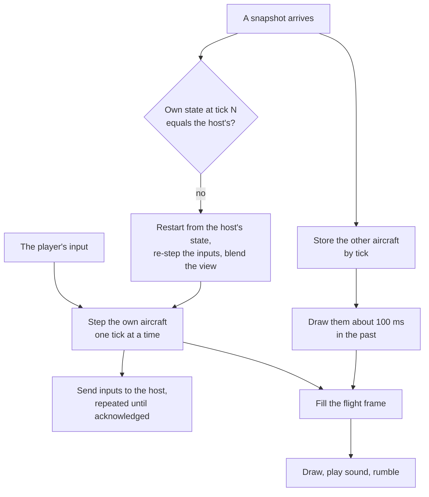

*Built (D8a), headless:* `tore_session::Client` (`crates/tore-session/src/client`),
with no window or audio; slice D8b wires it into the game. The game's
regeneration of smoke, contrails, chaff, flares and tracers from the frame is
D8b's.

**The calls.** `Client::connect(ClientConfig, resources, now)` starts the
join (server, callsign, password, build, the plane wanted or any, the entropy,
and the platform, this build's own by default; it refuses the retail
stall-speed switch). The caller drives it like the host:
`receive` or `receive_from`, `update(now, &Controls)` with the pilot's held
controls and the commands given since the last update (`Controls::neutral`
while a menu is up), `poll_transmit` or `transmit`, and `next_wake(now)`.
`frame(now)` gives a `ClientFrame` once seated: the predicted flight and the
presented one, the picture at the render time, the newest cockpit readout, the
plane's configuration and the events released since the last frame;
`ClientFrame::flight_frame` makes the screens' `FlightFrame` from it with the
game's smoke and devices. `poll_event` gives the session's events (connected,
mission loaded, content refused, seat refused, seated, roster, notice,
debrief, mission ended, closed with its reason; EF4 adds the lobby, refused
and goodbye). `leave(now)` sends Leave, which ends the player's flight (EF4:
the player stays in the lobby); `leave_game(now)` ends the flight and quits
once the debrief is in; `disconnect(now)` quits at once. `mission()` is the
client's copy of the mission, `roster()`, `name(index)` and `stats()` the
rest. `set_mission_builder` lets the game build the mission with its own
hooks. The lobby's calls are [the lobby's](#the-lobby).

**As built**, each an agent decision unless credited:

- **Joining.** On the Mission message the client builds the mission from its
  own import with `World::new(spec, resources, Seating::Open)`, never stepped,
  and compares the manifest its build read with the host's: a difference sends
  Content refused with the names (EF4: and the reason; the player stays in the
  lobby, marked unable). Then Ready with the
  plane wanted (EF4: Take plane, by the automatic ready). On Seated it finds the plane's aircraft type and ownship
  configuration in its copy of the mission as the host's handoff does (the AI
  wings' record, else the mission's for the type), decodes the exact state with
  that type's flight model, and starts its prediction; the standing ground
  objects are the mission's less the Seated message's destroyed list. Own
  states that arrive before the Seated message (they overtook its fragments
  until D10, when the host began holding them back; a client still keeps
  them) are kept, by the baselines they name, and read once it has arrived:
  the transport has acknowledged them, so the host codes the next against them.
- **Prediction.** Each predicted tick quantizes the controls as the wire does,
  numbers the commands given since the last tick from 1 (wrapping), and runs
  `OwnPlane::step` with the seat's sensors, the standing objects, the weather
  clock's reading at that tick, the ownship terms of the latest exact state and
  no combat events. The reading is a function of the tick, the clock having
  stepped once per tick from tick 0 (`prediction::weather_at`, checked against
  the host's world each tick). The plane's queued systems messages are dropped
  after each step: the host sends them as the seat's HUD lines. The predictor
  keeps 240 ticks of controls and commands and the own state hash at each
  snapshot tick.
- **Inputs.** One Inputs packet when a tick was stepped since the last and at
  least 1/60 s has passed, with every tick from the host's newest received one
  (snapshot header) to now, at most 24; every command the host has not applied
  whose tick the client has reached; the view offset to the drawn time and the
  interpolation delay in whole ticks; and the newest snapshot tick whose own
  state hash differed.
- **Reconciliation.** An exact state equal to the prediction at its tick
  changes nothing. One that differs restarts the plane at its tick and steps
  the stored ticks again, and the drawn plane keeps where it was and slides to
  the new path with a 50 ms time constant; over 100 ft or 20 degrees, within a
  second of seating, or under 0.01 ft and 0.01 degrees it does not slide. One
  for a tick the client has not reached is taken as it is. *EF4:* exact
  states are read on arrival and applied after the update's steps, only the
  newest, and held (at most 125 ms from when the hold began) while the host
  still reports repeating
  the seat's late inputs; ticks the host has stepped without the seat's input
  are predicted with the controls the host repeated
  ([the stall](#the-lobby)).
- **The clock.** Seating sets the predicted clock ahead of the Seated tick by
  a round trip and the margin. The initial forecast through that tick uses neutral
  input, matching the host before it receives the first controls. Held controls
  and queued commands begin on the following predicted tick. This fitted client
  initialization rule avoids applying new input retroactively to the elapsed
  seating interval; commands are retained, not discarded. A synthetic test holds
  nonzero roll and rudder and sends an immediate airbrake command across 60 and
  120 ms round trips, requiring zero mismatches from startup and command delivery.
  The first margin the host reports after it has
  had an input from the seat sets the clock outright, whatever the size: the
  Seated message can be late by retransmitted fragments, and seating snaps
  anyway (*correction to the design*, which jumped only past 250 ms). After
  that the rate is 1 plus 1 percent for each tick of margin error, within 2
  percent, and the clock jumps only past 30 ticks. Each margin is judged
  against the clock that sent the inputs it measured, a round trip earlier, so
  the two-second minimum does not make the steering overshoot. The target is 3
  ticks, 5 while the client's own packets lost more than 1 percent over 10
  seconds. *EF4 follow-up (agent decisions):* only a snapshot whose
  newest input tick is newer than the last one measured gives the clock a
  margin, since one that has had no new input repeats the last figure; and a
  clock that is not ahead of the host's newest snapshot tick (a starved or
  stalled game, whose inputs would all come late and none be sent) jumps
  ahead of it as seating sets it, by a round trip and the margin, and counts
  in `ClientStats::behind`. Before, such a client sent no inputs, so its
  stale margin held the clock behind and the host's state of its plane was
  taken at every own state, some 30 to 130 ft a time, for as long as it
  lasted.
- **The drawn time.** The newest snapshot tick is estimated as a line through
  their arrivals (each moves it a twentieth of the way). The interpolation
  delay is raised at once to keep the drawn time 2 ticks (6 while snapshots
  lost more than 1 percent over 10 seconds) behind the newest snapshot over
  the last 2 seconds, lowered only after 2 settled seconds, kept within 6 and
  30 ticks, and slides at a tenth of real time; the drawn time never steps back
  by less than 250 ms.
- **Entities.** Each keeps its states by tick and is drawn at the drawn time
  less its own extra delay: the gap between its last two states once that is 4
  snapshots or more (at most a second), none once it is 2 or fewer, sliding
  at a tenth of real time once drawn. An entity heard of once and not again
  within 4 snapshots is a far one from the start, drawn its interval back.
  Positions follow the cubic curve, attitudes `Basis::blended`, projectile
  directions and pilot headings the short way, devices blend, the rest is the
  earlier state's. Past its newest state an entity goes on for at most 30
  ticks, then holds; from its removal's tick it is not drawn.
- **The frame.** The presented flight is the prediction blended by the
  clock's fraction of a tick, plus what is left of the correction's offset.
  The picture is the render time's: the own plane as the player pose (as
  combat draws it, with the latest terms' damage), every other aircraft, the
  mission's ground objects (destroyed from their event's tick), projectiles,
  debris (the own plane's drawn with its airframe), pilots (the own one from
  the prediction's escape), effects aged from their events and marks from
  theirs. A mark's fire is drawn at full strength: its remaining life is not on
  the wire (a known difference until the host sends it). The readout is the
  newest received, its contacts placed around the presented flight
  (`ClientConnection::cockpit_readout`).
- **Events.** The seat's cues are released on arrival, since they belong to
  the player's own predicted plane: HUD lines, radio, tower, order voice and
  replies, weapon cycled, release sounds, rumble and "your aircraft exploded".
  The mission-wide ones are released when the picture reaches their tick, so
  an explosion shows and sounds where the missile is drawn (lead decision,
  2026-09-30): effects, marks, sounds, countermeasure releases, gun bursts,
  launches, ground objects destroyed and wing ejections. A ground object's
  destruction reaches the prediction's standing objects on arrival.
- **Diagnostics and capture.** `set_diagnostics` and `set_capture` take
  writers ([below](#recordings-and-diagnostics)). For a capture's replay the
  client draws its join's random seed itself, from the system for
  `Entropy::System`, and seeds the transport with it.
- **The bot.** `tore_session::bot::Bot` flies a client with a scripted pilot:
  straight and level and turns, a 40-second cycle holding its altitude, a
  chase of the nearest aircraft of the other side within 3 nm, and 0.4-second
  gun bursts at any aircraft within 4,000 ft and 2 degrees of its flight path.
  `tore-bot` (`--connect`, `--data-dir`, `--count`, `--callsign`, `--slot`,
  `--seconds`, `--password`, and since EF6 `--say` and `--quick`, which send
  chat lines) runs bots against a server over UDP and exits 0
  when every bot was seated, got its debrief and left.

**Measured** (`client/tests.rs`, synthetic resources on the network
simulator unless said; debug build):

- One client flying straight, level and turning for 5 minutes at a 60 ms
  round trip with no loss: its own state hash was compared at 9,090
  snapshots and never differed; no exact state changed the prediction, even
  at seating; the input margin settled at 4 ticks.
- Two bots fighting the enemy for 5 minutes at a 150 ms round trip, 2 percent
  loss each way, 1 percent duplicated and arrivals spread by 10 percent of
  the one-way delay: 18 and 6 exact states changed the prediction, all in the
  first seconds after seating while the clock settled (a 20-second run counts
  the same), none blended, so no snapshot needed a visible correction; the other aircraft were drawn within
  1 ft of the host's position at the same moment in 99.8 percent of frames and
  within 3 ft in 99.9 (the worst, 186 ft, a far aircraft held after a lost
  update); 0.49 and 0.56 percent of entity frames were drawn past their
  newest state; the host repeated 0.06 and 0.18 percent of the bots' input
  ticks; both left with their debriefs. The first bot's capture, 9.4 MB,
  replayed offline into the same 18,774 frames and the same inputs, byte for
  byte.
- Over real UDP on 127.0.0.1 a bot flew a minute against an in-process host,
  and two `tore-bot` bots flew a minute against a release `tore-server`
  with a real import (the guide's 12-aircraft example mission): both were
  seated, got their debriefs and left cleanly, at a 4 ms round trip, a 57 ms
  interpolation delay and an input margin of 4 ticks.
- *D10:* the whole matrix of nine round trip and loss cells, five minutes each,
  passes every limit; the numbers, and the host cost and bandwidth on a 15
  against 15 mission with 2 to 30 bots, are in the
  [baseline](baselines/net-2026-09-30.md).

### The flight screen draws a frame

Today the flight screen reads `World` directly. Stage D puts one plain-data
**flight frame** between them:

| Part | Single player fills it from | A client fills it from |
| --- | --- | --- |
| The presented seat and its plane id | seat 0 and plane 0 | the seat and plane the host gave it |
| The plane's flight state now and at the start of the tick | the cockpit | its prediction |
| The mission picture: every other aircraft, ground object, missile, round, effect, mark, debris piece and pilot | `RenderSnapshot` as today, built for the presented seat | interpolated entities and local effects |
| Smoke, contrails, chaff and flares | combat | regenerated locally |
| The cockpit readout | built from `World` for the seat, every frame as today | the newest readout in a snapshot |
| The tick's cues and launches for the seat | `TickOutput` | events from the host |
| Mission data that never changes: terrain, aircraft types, ground objects, the roster's slots, sides and names, the weapon rules and range mode | `World` | the client's copy of the mission |

The **cockpit readout** is what the seat's displays show, computed where the
simulation state lives: stores and the selected station, arming, readiness,
the seeker's state and tone, the estimated ranges, hit percentage and firing
band, the designated, displayed and view targets, radar, infrared and visual
contacts with their trails, the map contacts, RWR emitters and missile records,
the RWR tone's inbound missiles and locks, damage and faults, chaff and flares,
shots, hits and kills, the airport service's state, NAV mode, the target
window's readout, the situation music's inputs and the mission result. Contacts
are sent with their positions in the world, so the client draws them around its
predicted aircraft. The friendly list the designation keys skip follows from
the roster's sides.

`tore-world` builds it (`World::cockpit_readout(seat, launcher)`) from the
seat's ownship and a launcher, the plane's position, attitude and speed. Single
player builds it every frame from the frame's interpolated flight, exactly
where the weapon HUD and the seeker tone compute today, so its captures stay
byte-identical; a host builds it at each snapshot from the tick's flight.

Every "aircraft 0 is the player" assumption in the screens (the view rig's
player body and missile owner, the RWR tone's owner, the target window's
viewer, spatial sound's own aircraft, `ai_wings::PLAYER_ID` in presentation)
reads the frame's plane instead, and `Combat::snapshot` builds the picture for
any seat. The view rig learns of every missile launch from launch events, so a
missile that lives less than one snapshot is still the F12 view's last missile.

*Built (D5a, the frame).* `tore_world::frame::FlightFrame` is the plain-data
frame, with nothing in it that draws:

| Field | What it holds |
| --- | --- |
| `seat`, `plane` | The presented seat and the plane it flies |
| `flight`, `previous` | The plane's flight as the last tick left it, and at the start of that tick |
| `presented` | The flight to draw: `flight` and `previous` blended to the frame's instant, or `flight` for a tick's frame and a frozen flight |
| `picture` | The presented `RenderSnapshot` for the seat: its plane is the `player` pose and every other aircraft is a target |
| `smoke`, `devices` | The puffs of hits, wrecks and motors and the contrails; chaff and flares |
| `tick_cues` | The cues of the tick being presented; `cues()` yields the seat's own and the mission-wide ones with their place in the tick |

The fields borrow, because the smoke holds tens of thousands of puffs;
`presented` is a `Cow`. `World::flight_frame(seat, presented, picture, cues)`
fills a frame from the `World`, and `World::presented_flight(seat, alpha)`
makes the blended flight. The app owns the tick fraction and the interpolated
picture (`CombatView::presented`), so it passes both in; a client session will
pass what its own clock and interpolation give. The redraw builds one frame
after the tick loop and every camera, panel, HUD and sound below reads it. The
per-tick presenter builds a short-lived frame for each thing it reads, because
it also calls methods that need the app mutably.

`Combat::snapshot(plane, flight, wings)` is the picture for any plane that has
an ownship: that plane is the player pose, in the flight given, and every
other human-flown plane, the first one too, is an ordinary target drawn from
the pose its last step left (combat now keeps a pose for every ownship, not
only the ones after the first). `restart_render`, `advance_render` and
`refresh_render` take the plane as well. The mission's render history is built
for one plane, `World::picture_plane()`, the first cockpit's (agent decision):
a host that serves other seats builds theirs with `snapshot`. With no cockpit
it keeps none (D3c).

The "aircraft 0 is the player" reads are gone from the screens: the view rig
(`Scene::new(plane, ..)`, `Rig::for_plane(plane)`: the scene's player body,
the wing group of the player, what counts as the player's own missile and the
inbound-threat view), the RWR tone, the flight music (which now also counts
only its own plane's damage, where it counted every ownship's), the target
window's viewer, the map, the scope, the weapon HUD, the status line and the
damage report. The app's own reads of the first ownship (`state.own()`,
`own_view()`) became reads of the frame's plane, which slice D5b then replaced
with the cockpit readout (below). `ai_wings::PLAYER_ID` is no longer read by the
screens; it stays in the AI wings module and two headless probes. Left as they
were, on purpose:
the headless probes, the ordnance and combat smoke checks and the replay
recorder, which build a combat with one ownship and have no presented seat.

Single player's camera views are still built from combat's target rows
(`Scene::new`). A client has no combat to read, so the scene of the F5 to F12
views can also be built from the frame's picture alone (`Scene::from_frame`,
*built in D8b*): another human's plane is then a subject of the target and wing
views like any AI aircraft. The replay viewer builds its scene the same way
(`Scene::of_picture`, with its fly-by direction), and a test checks that the
two scenes agree on the fixture crowd.

*Built (D5b, the readout).* `tore_world::readout::CockpitReadout` is the
plain-data readout, with no reference into combat. `World::cockpit_readout(seat,
launcher)` builds it (`Combat::cockpit_readout(plane, launcher, wings, cockpit)`
does the work; `readout::build` is its body), and `FlightFrame::readout` holds
it, built by `World::flight_frame` from the launcher of the flight the frame
presents. Every list has a limit (`MAX_CONTACTS` and the others in
`readout.rs`); a longer one keeps the entries nearest the plane. The groups are
the wire's:

| Group | Holds |
| --- | --- |
| Header | The plane and the combat tick (the warning tone's clock) |
| `stores` | The selected station, arming, launch mode, the rounds at every station (failed ones marked) and which stations were loaded at the start |
| `seeker` | The mounted seeker's status, target and observation, and the tone it plays |
| `estimates` | Readiness, guidance available, can lock, the HUD's observation, maximum range, favourable firing band, in range, hit percentage and the flight seconds to the target |
| `targets` | The designated identity, and the displayed and view targets (the view target is the sight hold) as rows: identity, aircraft, position, velocity, hit points and damage by section |
| `sensors` | The sensors' step count, selected and acquired target and its track status, which channels are installed and operating, the radar's track range, radar and infrared contacts (with world positions), stale plots, noise strobes and the contacts' trails |
| `visual` | Visual contacts |
| `map` | Map contacts with whether a visual return identified them, whether they fly, and what an identified aircraft is |
| `rwr` | Passive emitters, the threat service's missile records, the missiles in flight aimed at the plane (for the warning tone and the music) and the seeker classes of the locks the AI holds on it |
| `damage` | Hit points, damage, the subsystem hit counts, the five failure flags and the plane's shots, hits and kills |
| `countermeasures` | Chaff and flares left |
| `airport` | NAV mode and the tower's service (selected airport, clearance, which runways are down) |
| `target_window` | What the AI says of the displayed target: the objective, and whether it is a fixture or an AI pilot with its activity and skill and whether it aims at the viewer |
| `music` | The designated target when it is a live enemy aircraft, the AI aircraft aiming a missile at the plane, and the mission result and home latch |

What stays out of it, because the client has it or it is the picture's: the
loadout (`FlightFrame::config`, the weapon records of the plane's stations,
changed only when the stores are loaded), the airport scene, the roster's sides
and names, the weapon rules, and the target rows the camera views are built from.
Single player builds it every rendered frame from the frame's interpolated
flight, where the weapon HUD and the target cue draw; the instruments, the
scope's reprojection and the target window's bearing use the flight as the last
tick left it, as before; and the seeker tone is the readout of the tick frame,
as before. Per-tick readers (the RWR tone, the situation music, the view rig's
target) read the readout of the tick's frame. The frame's readout is built when
a display first reads it (`ReadoutSlot`), and the frames of one tick share one
build (`World::flight_frame_sharing`), so a windowed tick builds it once and a
rendered frame once more; `OwnshipView::at(launcher)` works the observation and
the firing solution out once for all the estimates. The navigation page still
reads the plane's tower service from its cockpit, at the start of each tick. The app
reads it in `weapon_hud`, `scope`, `combat_view`, `flight_map`, `flight_views`,
`flight_music`, `rwr_tone` and the redraw; `combat_view::PlaneState` is gone.
The airport group holds a clone of the plane's `airport::Service`, for the ILS
guidance and the navigation page, which ask it questions every frame (agent
decision: a clone keeps the guidance exact between ticks). What the wire needs
of it is the selected airport, the clearance and which runways are down.
Measured plain (every field at its natural width, no coding): a busy seat of the
crowd fight is about 2.5 KB, of which the radar contacts and their trails are
most; a contact is 77 bytes and a trail point 24 bytes at that width, and the
wire's quantization and its changed-group bits are D6's to count against the
200-byte budget.

The sound's own aircraft is fixed: `tore_sim::acoustics::Listener::own` names
the aircraft the listener flies, and `Passes::step` takes that aircraft's source
as its own. `audio::spatial_sources` labels every source with its plane's id, and
the replay's sources and listener use the recorded player's id, so the reserved
`u32::MAX` relabel is gone.

### Hits and lag compensation

*Built (D9).* The host decides every hit. Missiles, rockets and bombs are
simulated only on the host and are not rewound (John, 2026-09-28).

Gun rounds fired by a human are tested against targets **as the shooter saw
them** (John, 2026-09-28). Each seat's input names the host tick its screen
showed (V) for the tick the input is for (T), and its interpolation delay:
`SeatInput::view`, a `SeatView { tick, interpolation_delay }` (`seats.rs`),
which the wire slice fills from the input's view offset and delay. `None`, as
single player, the AI probe and every local seat give, means no rewind.
Because the player's game runs ahead of the host and draws other aircraft
behind it, `T - V` is the whole round trip plus the interpolation delay plus
the input margin. *Correction to the plan*, whose estimate of half the round
trip plus the delay measured from the input's arrival was too small. A round
fired on tick T carries a rewind of `T - V` ticks, of which the part beyond the
interpolation delay is capped at 30 ticks (250 ms), as the plan capped latency:
a player on a very slow link is judged against where targets were 250 ms plus
the delay ago, never earlier. The rewind is at most 60 ticks (500 ms).
`combat::gun_rewind` (`tore-world`) computes it; a view of tick T or later is
no rewind.

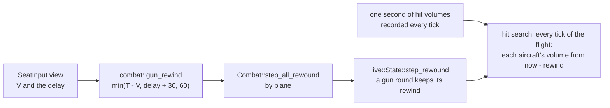

**The history.** Combat (`tore-sim`, `combat/live/rewind.rs`) records, once a
tick, every aircraft's hit volume exactly as the hit search reads it: position,
the position a tick before (a gun round is tested in the aircraft's moving
frame), attitude and radius, for the AI's aircraft rows and every human-flown
aircraft. It records where the search reads the current volume, after the AI
rows have moved for the tick, and keeps 120 ticks (1 second). Ground objects do
not move and have none. The history and the rewinds of the rounds in flight
live in `live::State`, inside `World`, since the hit search runs in
`World::step`; they are mission state, so stage H's checkpoints will carry them
([rules for mission state](#rules-for-mission-state)).

**The rewound search.** On every tick of its flight a round with a rewind tests
each aircraft against its volume from `now - rewind` instead of the current one.
An aircraft with no entry that far back (it did not exist yet) is tested at its
oldest entry. Everything else is today's code: which aircraft can be hit, the
nearest contact, damage, the ledger, friendly fire and the launcher's own
volume rule use the aircraft as it is now. A round with no rewind (every AI
round, every missile, rocket and bomb, and every round in single player) takes
exactly today's path. `World::step` hands `Combat::step_all_rewound` each
human-flown plane's rewind, and combat gives it to the gun rounds that plane
fires on the tick.

*Agent decisions (D9):*

- The rewind of a round is kept beside the rounds (`State::rewind_of`, by
  projectile number), not in `Projectile`, whose many literals in the app and
  the AI would all have changed; a round that ends takes its rewind with it.
- The damage section of a rewound hit comes from the volume the round was
  tested against, and the hit's effect is moved from that past volume onto
  the aircraft as it is now, so the sparks show on the aircraft every screen
  draws instead of up to 500 ms behind it.
- Whether an aircraft can still be hit (alive, not the shooter, friendly fire)
  is decided on its state now, not its state then: a target destroyed since
  the shooter's view is not hit again.

A client draws its own tracers at once from its trigger and its predicted
aircraft, and other aircraft's bursts from the host's burst events (shooter,
gun, first and last tick); *built (D8c)*, see [the client
session](#the-client-session). A missile appears on the client when the host
launches it, one round trip after the trigger (about 0.15 s at 150 ms), since
only the host knows whether the launch was ready.

### Joining, leaving and the end of a mission

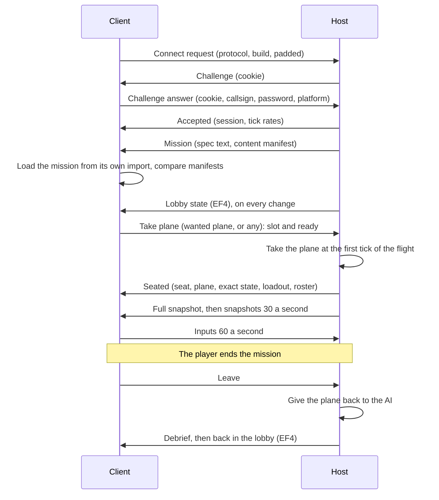

- **Which plane.** A joining player asks for a plane
  by id (`--slot`) or takes the first free friendly plane, Friendly Wing 1's
  lead first (in the lobby, EF4, by taking that plane's slot). The server's configuration lists the planes open to humans
  (default: every friendly plane). A plane that is destroyed, has lost its
  pilot or is flown by a human cannot be taken. *Built (D7a):* a refused
  plane gets Seat refused with the reason and the player may ask again; with
  `open-planes all` a player asking for any plane gets the first free
  friendly one before any enemy one.
- **Callsigns.** A callsign already in use gets a suffix (`Viper_2`, John
  2026-09-28), shortened first if the whole would pass 15 characters.
- **Loadout.** A player keeps the loadout of the aircraft they take, the late
  joiner's rule of the [guide](MULTIPLAYER.md#slots-ai-fill-and-handoff).
  A player in the lobby chooses one for its slot before the mission
  (*built, EF4*, [the lobby](#the-lobby)).
- **Leaving.** End Mission sends Leave; the host builds the player's debrief
  (`tore_world::debrief::capture` for the seat, moved out of the game in D7a
  so the server can build it; the game keeps the screen), sends it, and gives
  the plane back to the AI at the next tick. *Built (D7a):* the host then
  disconnects the player once the debrief is acknowledged, or after 5 seconds.
  A player whose packets stop for 5 seconds, or who is kicked, gives the plane
  back the same way with no debrief; *since EF-K* a joined game whose loop is
  merely stalled keeps its plane for up to a minute
  ([below](#a-stalled-game-stays-connected-ef-k)). A
  destroyed plane stays destroyed; the seat can end the mission as in single
  player. Respawns are stage F. *EF4:* Leave ends the player's flight only:
  after the debrief the player is back in the lobby, still connected, and
  leaves the game by disconnecting (`Client::leave_game` does both).
- **The end.** When the host ends the mission, every seated player gets
  "Mission ended" and their debrief. *EF4:* with a next mission every
  player stays connected, back in the lobby with its slot and loadout and its
  ready mark cleared ([the lobby](#the-lobby)); only a host that stops
  disconnects them, as follows. *Built (D7a), and since EF4 only when the
  host stops after the mission:* Mission ended goes first, then
  the debrief; every connection, seated or not, is disconnected with "server
  stopping" once they are acknowledged or after 5 seconds; a join while the
  mission is ended is refused as shutting down with the seconds to the next
  one. The console's `end` and `restart` send the end reason "ended by the
  server" ([protocol](formats/net-protocol.md#messages-as-built)); `quit`
  disconnects everyone with "server stopping" and sends no debriefs. The empty
  timeout counts from the moment the last seated player leaves (sends Leave
  or is dropped). The dedicated server's rules for starting,
  ending and restarting are in the [server guide](DEDICATED-SERVER.md#the-mission-lifecycle).
- **Settings.** The mission's cheats come from the server's mission file and
  apply to everyone. On a client the Cheats menu keeps only the settings that
  change nothing but its own screen (no sun whiteout, no G effects, no screen
  shake). The retail stall-speed switch (`--retail-stall-speeds`) is a
  developer option for the whole process: a server refuses to start with it
  and a client refuses to join with it, so every machine flies one
  configuration.
- **Builds.** John's rule is that the build must match
  ([guide](MULTIPLAYER.md#compatibility-handshake)). *Agent decision on what
  that means:* two tagged release builds match when their versions are equal;
  any other build must have the same commit, since compile-time tuning (for
  example the stall reference fractions) changes the simulation and would make
  every prediction wrong.

### A stalled game stays connected (EF-K)

*Built (EF-K); agent decisions unless credited.* A host drops a connection
it has heard nothing from for 5 seconds. A joined game's loop can stop for
longer than that and still come back: EF6 and EF7 both saw a screenshot on a
loaded machine stall a joined game past 5 seconds, and the host dropped it.
A player whose window stalls should come back to their flight, not to a
"disconnected" message.

**What stalls the loop, by platform.** Read from the source of winit 0.30.13,
the version in `Cargo.lock`, on 2026-10-01; none of it has been checked by a
run on Windows or macOS yet. The game pumps its session only at the start of
a redraw (`net_tick` on `RedrawRequested`, `net/play.rs`), and `about_to_wait`
asks for the redraws, with `ControlFlow::WaitUntil` no later than the
session's next wake, about 10 ms (`main.rs`).

- **Windows.** Dragging the title bar or a border runs the system's modal
  move and size loop inside `DefWindowProcW`. Winit emits `about_to_wait` and
  honours `WaitUntil` only from its own wait (`wait_for_messages`,
  `platform_impl/windows/event_loop.rs`), which does not run until the drag
  ends. Window messages still arrive: each size change gives `Resized` and,
  since the game asks for a redraw on every resize, a `RedrawRequested` that
  pumps the session once. A move, a mouse button held still on the title bar,
  and the title bar's right-click menu pump nothing for as long as they last.
  Winit cancels the half-second pause of a plain click on the title bar (a
  dummy mouse move posted on `WM_NCLBUTTONDOWN`; changelog 0.30, "fixed ~500
  ms pause when clicking the title bar during continuous redraw") and its own
  comment says the right-click menu's freeze is not cancelled. This is the
  case that matters most: a player who holds the window for 5 seconds was
  dropped.
- **macOS.** Winit's run-loop observers and its wake-up timer are added in
  the common run-loop modes (`platform_impl/macos/observer.rs`), which take in
  the event-tracking mode AppKit runs during a live resize, and `drawRect:`
  sends `RedrawRequested` at once (changelog 0.25, "emit RedrawRequested events
  immediately while the window is being resized"), so a live resize should
  keep the session turning. Whether moving the window by its title bar holds
  the loop is AppKit's behaviour, which the source cannot show: unconfirmed.
- **Linux**, X11 and Wayland: the window manager or the compositor moves and
  resizes the window, and nothing in winit holds the loop.
- **Everywhere:** a long frame, a mission load (`begin_session_flight` loads
  the aircraft and builds the scenery on the loop) and an input script's
  `shot` step (a blocking GPU read-back, then a PNG written on the loop).

So the fix matters most on Windows, and is built for every platform.

**The keepalive.** A game joined over UDP starts a small thread
(`tore_net::Keepalive`, driven by `net::session::KeptAlive`) once the host
accepts the join. It holds a clone of the game's own socket, so it speaks from
the connection's address, and the connection's Keepalive packet (kind 10,
nine bytes: the checksum, the kind and the connection id;
[protocol](formats/net-protocol.md#keepalive), protocol 5). Every turn of the
game's session tells it the loop has run.

- **Rate.** It sends nothing while the loop turns. Once the loop has not
  turned for 1 second it sends one keepalive, then one a second (it looks
  every 250 ms). The game's own transport sends at least 10 packets a second,
  so the thread only ever speaks in a stall.
- **The bound.** It sends none once the loop has not turned for 60 seconds,
  so a game that is truly hung is dropped as before, 5 seconds after its last
  keepalive, about 65 seconds into the stall.
- **Identity.** The packet carries the connection's id and is accepted only
  from the connection's address, exactly what a Payload needs, so nobody else
  can keep a connection alive and nothing new is open to a stranger. The host
  counts it as hearing from the connection (no acknowledgement, round trip
  or rate statistic) and never answers it; the first since the game's last
  Payload tells the session the game has stalled (`tore_net::Event::Stalled`),
  and the next Payload that it is back (`Event::Resumed`, with how long it
  was gone).
- **Lifetime.** The thread starts once the session is past joining, stops
  (and is joined) when the connection closes, a new one is started for a new
  connection, and dropping the session stops it. It only sends: it never
  reads the socket and never touches the client's state.
- **The King** joins over the in-process link and has no keepalive: the host
  exempts its connection from the timeout (EF4).
- **The log.** When the loop comes back the game's log says how many
  keepalives covered the stall ("Network: the game was held up; its
  keepalive kept the connection (14 keepalives, 14 in all)"). The host logs
  the stall at its first keepalive and its end at the first Payload after it
  (`HostLog::Stalled` and `Resumed`: "seat 2 Viper: game stalled, flying
  neutral", "seat 2 Viper: game back after 7.4 s"; a player in the lobby has
  no seat and flies nothing), in the dedicated server's log and in a hosting
  game's; a game stalled past the bound leaves with the usual "silent" line
  ([server guide](DEDICATED-SERVER.md#the-mission-lifecycle)).

**The stall rule: a stalled game counts as paused.** *The lead's application
(2026-10-01) of John's rule of 2026-09-30* that the controls go neutral while
a game is paused or in its Esc menu ([decisions](MULTIPLAYER.md#decisions)).
The host knows a seat's game is stalled once more than 60 ticks (half a
second) in a row have had no input from it (`host::inputs::STALL_TICKS`,
agent decision), or once it hears the connection's keepalives, whichever
comes first. From then on every tick with no input takes exactly the
controls a paused game sends (`Controls::neutral`): stick, rudder and
throttle rate centred, no throttle position so the throttle stays where it
was, the trigger released, no commands (the momentary ones are commands, and
a missing tick never repeats them), and the scope controls as they were. The
neutral controls fly that seat's plane only, and end at the first fresh
input. A late or lost input packet costs a few ticks and every packet
repeats the last 24, so below the threshold nothing changes: a late player's
last controls repeat as before. The network matrix, short and full, checks
that no seat is ever flown neutral on any of its paths
(`PlayerStatus::inputs_neutral` stays 0); in the simulator a seat that
stalls while pulling and firing fires on and pulls on for half a second and
then stops firing, its elevator back to 0 with the throttle unchanged
(`client/stall_tests.rs`). The King's own plane follows the same rule when
its window is held, though its connection never times out.

**What a 15-second stall looks like.**

- *For the stalled player:* the picture freezes. When it comes back, their
  plane is where the host flew it meanwhile: half a second on the last
  controls the host had, then neutral ([the stall rule](#a-stalled-game-stays-connected-ef-k):
  a held trigger stops firing, a held pull stops pulling); the client takes
  the host's newest state instead of stepping the backlog (a catch-up), and
  everything else jumps to where it is now. Then, as the snapshots that waited
  in the socket and the first fresh ones are read, the own plane may be
  corrected a few times within about a fifth of a second (about eleven in each of
  three runs of the test since the stall rule, the largest seen about 7 ft
  and 6 degrees, most of them blended; up to 22 ft and 20 degrees before it,
  when the host still flew the held pull), and none after. Those come from the ticks between the state the client caught up to
  and the present, which it predicted with controls the host had already
  replaced with neutral ones.
- *For the others:* the player's plane flies on smoothly, half a second on
  its last controls and then hands off the stick with its throttle where it
  was; the player stays in the roster and the lobby, and nobody is told
  anything (the host's log is). Before EF-K the plane went back to the AI after 5 seconds and the
  player was gone.

**Measured** (`net/keepalive_tests.rs`, real time, a hosted game with its King
over the link and a guest over loopback UDP, both pumped once a 16 ms frame):
a guest stalled for 15 seconds sent 14 keepalives, was never dropped, caught
up once and had settled (two seconds with no correction) within 4 seconds of
coming back (in four runs), while the King had no correction during the stall, still held
the crown and both flew on; with the bound set to 3 seconds a stalled guest
sent 2 keepalives and was dropped as silent 7.2 seconds into its stall, and
learned it on coming back. A windowed run (release builds, the game joined
to `tore-server` on loopback, the machine building the workspace in release
for the first 50 seconds) took nine input-script `shot` steps 2 seconds
apart: seven of them held the game's loop long enough for keepalives (3 to 5
each, 26 in all, one stall past 5 seconds, which used to drop the player),
and the player was never dropped and left by its own Leave. The transport's own tests (`tore-net`'s
`tests/keepalive.rs`, on the simulator) keep a stall of 15 seconds, refuse a
keepalive from another address, with another id or of another version, and
check that the host answers none.

### Recordings and diagnostics

John decided on 2026-09-30 that in stage D a client does not record a mission
replay live (the recorder reads the host's AI and combat state, which a client
does not have). Instead each networked flight keeps:

- a **capture**: every packet the client received, with its arrival time, and
  every input it sent, in a file beside the replays, kept and pruned by the
  replays' own auto-delete rules. It is what the client knew, complete, so the
  client session can be run again from it offline, exactly;
- a **diagnostics log** (`logs/net-<date>.tsv` in the data folder): once a
  second the round trip, loss, snapshot arrival spread, input margin,
  interpolation delay, corrections made and bytes each way, plus every join,
  drop and refusal.

*Built (D8a)* in the client session: `Client::set_capture` writes the capture
([format](formats/net-protocol.md#captures)) and `capture::replay` runs it
again offline into the same frames; `Client::set_diagnostics` writes the log,
a header line and then tab-separated lines that start with the seconds and
the kind (`stats` once a second with the fields of
`client::diagnostics::STATS_FIELDS`, and `connect`, `joined`, `mission`,
`seated`, `seat-refused`, `content-refused`, `debrief`, `mission-ended`,
`refused` and `closed`). The game names the files and keeps them (D8b).

*Built (D8b, the files).* `net/files.rs` in the game holds both files'
bookkeeping; the client session writes into them. The log is a writer that
appends whole lines to `logs/net-<date>.tsv` (UTC date, a new file at
midnight, created when the first line arrives) and survives a failing disk by
dropping lines. The capture is created beside the replays as
`<date>_<time>_NET_<host>.tore-capture` (the server as typed, letters and
digits only; a clash adds `-2`). The replays' auto-delete rule prunes both
(agent decision): captures as a list of their own, so a run of networked
flights never pushes a replay out, and the logs as a list counted in days;
"keep the last N" means N captures and N days of logs, "older than D days"
reads the date from the name, and a file written in the last ten minutes, the
capture being written, or a file that does not have the right name and first
bytes is never removed.

In stage E a capture **converts into a replay** (John, 2026-09-30): every
aircraft follows a smooth curve through every update the client received,
using hindsight, instead of what the player saw live with its guesses ahead;
the own aircraft follows the host's states and the prediction between them;
events, radio and effects come from the host's events. The replay carries the
diagnostics. The dedicated server logs the same figures for every player.

### How stage D lands

Slices, each on its own `mp/d-<topic>` branch and worktree, merged by the lead
with the quick check per change and the check list plus the single-player
baseline at merge. "Opus" slices are networking, concurrency, determinism or
risky refactors, as John asked; the rest are Sonnet.

| Slice | Branch | Model | After | Work | Acceptance |
| --- | --- | --- | --- | --- | --- |
| D1 Codec | `mp/d-codec` | Sonnet | | `tore-codec`: bits, variable-length integers, quantizers, FNV-1a, CRC-32 | Round trips at every width; a bounded reader never panics on 100,000 seeded random inputs; known CRC-32 and FNV-1a test vectors. **Built (D1):** also the bucketed signed coding, exact floats against a baseline and short strings; the readers reject every non-canonical form |
| D2 Transport | `mp/d-net` | Opus | D1 | `tore-net`: packets, handshake, acks and round trip, reliable ordered messages, statistics, UDP and the simulator | On the simulator at 300 ms and 5 percent loss with duplicates and reordering: the handshake completes, 10,000 reliable messages arrive once and in order, a 64 KB message arrives whole, the round trip estimate is within 5 percent and the loss estimate within 1 point; a challenge is never larger than its request; a seeded packet fuzz never panics; two real sockets on 127.0.0.1 connect. **Built (D2):** 10,000 messages each way and 64 KB arrive in 25 simulated seconds; the round trip reads 286 to 306 ms across 20 seeds, mostly a little low under reordering; the loss estimate equals the loss over the packets it judged, 4.6 and 5.7 percent over the run; the fuzz reaches bad-packet and protocol-error endings; IPv6 loopback works too. [Wire details the build settled](formats/net-protocol.md#what-the-transport-settled) |
| D3a Import library | `mp/d-import` | Sonnet | | **Built (D3a).** `tore-import` out of the app: data folder, pack, media detection, import | Single-player baseline SAME; the app imports and loads as before; `cargo tree -p tore-import` has no winit, wgpu or cpal; where both a 1.0 and a 1.02F import are available, the simulation resources of a sample mission hash the same |
| D3b Mission as data | `mp/d-mission` | Sonnet | D3a | **Built (D3b).** `MissionSpec` and its text form; `World::new` with single-player seating; the creator builds through it | Single-player baseline SAME; the spec round-trips through text; a headless test builds a single-player mission from synthetic resources and steps it |
| D4 Own-plane step and exact state | `mp/d-own-state` | Opus | D1 | The shared per-plane step; an exact coder and hash for a human plane's flight, turbulence and ownship terms, every field destructured | Single-player baseline SAME; a plane stepped by `World` and a copy stepped by the shared function from a decoded state, with the same inputs and terms, stay bit-identical for 1,200 ticks; adding a field to the state without coding it fails to compile. **Built (D4):** see [one step for a human's plane](#one-step-for-a-humans-plane) and [its exact state](#the-exact-state-of-a-humans-plane); an airborne plane's exact state costs about 200 bytes against a baseline one snapshot back |
| D5a Flight frame | `mp/d-frame` | Sonnet | D3b | The flight frame with its plane id; the screens, views and sounds read it; no "aircraft 0 is the player" in presentation; the picture for any seat | Single-player baseline SAME and every GPU capture byte-identical; a test builds the picture for a second seat of the crowd fixture with that seat's plane as the player. **Built (D5a):** see [the flight screen draws a frame](#the-flight-screen-draws-a-frame) |
| D5b Cockpit readout | `mp/d-readout` | Sonnet | D5a | The cockpit readout and its builder; the HUD, weapon HUD, scope, RWR, target window, map and music read it | Single-player baseline SAME and every capture byte-identical; readouts for two seats of the crowd fixture each name their own plane's stores, contacts and damage. **Built (D5b):** see [the flight screen draws a frame](#the-flight-screen-draws-a-frame) |
| D3c Open seating | `mp/d-open` | Opus | D5a | `Seating::Open`: plane 0 on the AI, a tick with no human, combat with no ownship | Single-player baseline SAME; a headless test builds an open mission with every plane on the AI, steps it 1,200 ticks, then a seat takes plane 0, flies, and gives it back. **Built (D3c):** see [open seating and no human](#a-mission-with-no-window); the run repeats to the bit, and two seats hand planes in both wings through a fight, the last leaving the mission with no human |
| D6 Wire | `mp/d-wire` | Opus | D1, D3b, D4, D5b | `tore-session`'s messages: inputs, snapshots with acknowledged baselines, priorities and relevance, own-state hash and exact state, readouts, events (bursts and launches included), join messages, debrief | Every message round-trips; a snapshot decodes with any earlier packet lost; entities always get their share of the packet; a wire golden test fails when the bytes change without a protocol version bump; bytes per snapshot measured on the 15 against 15 mission against the [budget](multiplayer-plan.md#bandwidth-budget). **Built (D6):** seeded round trips of every section and message; a 3,000-snapshot run dropping, duplicating and reordering packets and acknowledgements rebuilds every entity exactly; 100,000 fuzzed bodies; the golden copy `crates/tore-session/wire-golden.txt`. On the 15 against 15 mission (29 other aircraft, up to 31 missiles in flight) the Snapshot section is 177 to 879 bytes, mean 350, before the readout; the readout's record is 4 to 506 bytes, mean 52, against a plain size of mean 1,895; the whole download is 13.2 KB/s before the messages ([details](formats/net-protocol.md#what-the-games-sections-settled)) |
| D7 Host and server | `mp/d-host` | Opus | D2, D3c, D6 | The host session, its clock and input buffers; `tore-server` with its configuration, import and console | A server flies a 15 against 15 mission for 10 minutes with nobody connected under 20 percent of one core; scripted test clients join and leave 100 times without an error; late, early, missing and duplicated inputs are applied as specified. **Host built (D7a):** [the host session](#the-host-session); each seat's cockpit readout goes in its snapshots (D6), and a seated client holds the host's readout of each snapshot tick exactly once the first second has brought it across; on the simulator scripted clients join, fly and leave 100 times with no error, each plane going back to the AI; a seated client's entities, own-state hashes and exact states match the host's world at every snapshot tick, with and without 5 percent loss and duplication; the 15 against 15 UKR mission with nobody connected flies 10 minutes at 1.46 ms a tick, 17.5 percent of one core (release, Ryzen 9 7900X), the world's own step alone costing the same within 2 percent; its first minute, while all 30 aircraft fight, costs 3.4 ms a tick (41 percent) with or without the host, the remaining minutes 1.2 to 1.3 ms. **Server half built (D7b, `mp/d-server`):** `tore-server`'s options, configuration file (every setting, default and range tested), import, `--check` (run on a real 1.02F import for the guide's example mission: 12 planes, 14 runways, a content digest; built through `Seating::Open`), start-up refusals (missing or stale import, a mission the import cannot build, a bad setting or mission line with its number, the retail stall-speed switch, a taken port), the run loop on a fake clock against a scripted host, the console, the status line and the log; and on 127.0.0.1 a scripted client (the transport's client and the wire's messages) joins over a real UDP socket, takes plane 0, flies, leaves, and the console's `quit` ends the server, with the log recording each step. The server ran the guide's mission with real data at 6 to 7 ms a tick in a debug build (not measured in release) |
| D8 Client, bot and `--connect` | `mp/d-client` | Opus | D5b, D6, D7 | The client session: join, prediction, reconciliation, smoothing, interpolation (the slow entities' longer delay included), clock steering, local effects, neutral controls in menus; the headless bot (the client session with a scripted pilot); the game's `--connect`; the capture and the diagnostics log | On the simulator with no loss, one platform and no hit, the prediction never differs from the host; two bots fly a 5-minute fight against a server; a windowed client flies against a server on this machine through `tools/agent-run.sh`. **Client half built (D8a):** [the client session](#the-client-session) with the bot, the capture and the diagnostics log, headless; the game's `--connect` is D8b **Game half built (D8b):** `--connect` joins a server and flies it on the flight screen (the options and their checks, the session's turn, the frame the screen draws, the events presented, the regenerated smoke, contrails, chaff and flares, the session rules, the diagnostics and capture files with their pruning, End Mission and the debrief). **Gun rounds built (D8c):** see [the client session](#the-client-session). A windowed game flew three minutes against a `tore-server` beside a `tore-bot`, ended the mission and read its debrief |
| D9 Lag compensation | `mp/d-lagcomp` | Opus | D4 | The hit-volume history in combat, the view tick in `SeatInput`, rewound gun hit tests | Single-player baseline SAME; a burst aimed at the drawn position of a target crossing at 500 knots, with a 150 ms round trip and a 100 ms interpolation delay, hits with compensation and misses without; the cap holds. **Built (D9):** see [hits and lag compensation](#hits-and-lag-compensation); missiles fired by the same seat carry no rewind |
| D10 Matrix and measurements | `mp/d-matrix` | Sonnet | D8, D9 | The simulator matrix as a test, a CI job with a host and two bots, load and bandwidth at 2, 8, 15 and 30 humans | The [matrix limits](MULTIPLAYER.md#netcode-numbers) hold; CI passes on all three platforms; `docs/baselines/net-<date>.md` records the matrix, bandwidth against the budget and host CPU per human. **Built (D10):** the matrix is `client/matrix_tests.rs` in `tore-session`: nine cells (50, 150 and 300 ms against 0, 2 and 5 percent loss each way, 1 percent duplicates, arrivals spread by 10 percent) of a host and two bots on the synthetic fixtures, each judged on every limit of the acceptance table for each bot, the short form (60 simulated seconds a cell) in the normal suite and the five minutes an ignored test; every limit holds in every cell. The CI job (`.github/workflows/network.yml`, on Linux, Windows and macOS runners; only the Linux run has been seen) runs `tests/loopback.rs`: the host in the test process and two real `tore-bot` processes over loopback UDP with a synthetic import. Host cost and bandwidth with real data come from `tests/host_players.rs` (host processor time with 0, 2, 8, 15 and 30 bots on a 15 against 15 mission) and are in the [baseline](baselines/net-2026-09-30.md); the host change is that exact states wait for the Seated message's acknowledgement ([host session](#the-host-session)) |
| D11 LAN acceptance | lead, then John | Opus | all | Agents smoke-test a dedicated server with a windowed client and a bot on the development machine; then John flies it on three machines on his LAN, macOS, Linux and Windows (John, 2026-09-30); docs brought to built | The plan's stage D acceptance, with evidence from both **Smoke test done (lead, 2026-09-30):** a release `tore-server`, two `tore-bot`s and a windowed game on the development machine flew the guide's mission for five minutes with no fault or drop; the game fired guns and a missile, kept flying through the Esc menu, followed the outside and wing views, ended the mission and showed the server's five debrief pages ([evidence](baselines/net-2026-09-30.md#the-smoke-test)). John's three-machine test (macOS, Linux, Windows) is next. |

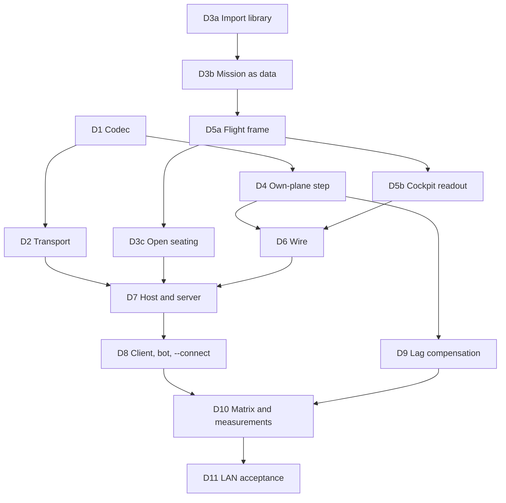

D1, D3a and D4 start together (D4 moves the shared step first and takes the
codec when D1 merges); D2 follows D1. D3b, D5a, D5b and D3c
all edit `main.rs` or combat's first-ownship code, so they run in that order,
each rebased on the one before; D5b and D3c may overlap once D5a has taken the
app off `own()`. D9 merged before them; D3c rebases on its change to combat's hit search.

## Lobby and hosting

Design for stages E and F of the [multiplayer plan](multiplayer-plan.md#stages),
taken together at John's request of 2026-10-01, written by the lead and
reviewed by John the same day; his answers are in the guide's
[decisions](MULTIPLAYER.md#decisions). Built so far: slice EF0, the research
and the dialog reader, slice EF1, the import of the art, slice EF2, the widget
kit, slice EF3, the host inside the game, slice EF4, the lobby on the wire,
slice EF5, discovery and addresses, slice EF6, chat, slice EF7, the Direct
Connection screen, and slice EF8, the lobby screen (below); the rest is
design.
Every choice is an agent decision unless it is credited to John.

John's direction (2026-10-01):

- A player hosts a game from inside the game and builds its mission with the
  Quick Mission creator.
- The menus reuse retail backgrounds and pieces, not necessarily retail's
  layouts: for the first mode, the MODEM CONNECTION background with the
  TCP/IP Network connection panel, retail buttons and other pieces.
- The first mode is a direct, unpublished lobby for friends: the game lists
  games broadcast on the local network and connects directly to an IP address
  or a domain name. A public lobby through the master server is stage I.
- Chat in the lobby and in flight.
- He tests "the whole shebang" together on his three machines; there is no
  separate command-line test of stage D.

In short:

- The hosting player's game runs the stage D host on a thread of its own, and
  flies its own aircraft as a client of that host over an in-process link, so a
  hosted game is presented exactly like a joined one and a stalled window never
  stalls the mission.
- A new **Direct Connection** screen finds games on the local network and
  joins one, or an address. **New** opens a **lobby**: the King builds the
  mission with the creator, players pick slots, arm their aircraft, chat, say
  they are ready, and the King starts. After the mission everyone returns to
  the lobby.
- Chat runs through the host with retail's receivers, in the lobby's message
  box and on a line in flight opened with `~`.
- Single player does not change.

### Surveys behind the design

Three read-only surveys of 2026-10-01 (in the lead's local notes); the first
is now the spec:

- **Retail art.** Settled in EF0 and written down in the
  [multiplayer spec](spec/multiplayer.md#retail-connection-screens) (what the
  player sees, with the rectangles, fonts, strings and `CHAT.TXT`) and the
  [menu format notes](formats/menu.md#multiplayer-connection-screens-dlg-records-panels-and-widget-pieces-ef0-2026-10-01)
  (the dialog records, the panel recipe and the widget pieces). In short: the
  NETWORK CONNECTION screen is `NETIPX3.PIC` plus a panel the game draws from
  `PANEL.PIC` and six `EDGE*.PIC` pieces plus `NEWNET.DLG`'s controls; MODEM
  CONNECTION is `MODEM3.PIC` with its panel baked in. The lobby's host and
  joiner dialogs are `NETNEW.DLG` and `NETJOIN.DLG`, the options panels
  `NETTCP.DLG` and `NETIPX2.DLG`, the message prompt `NETCEDT.DLG`; `MPSTATUS.PIC`
  and `MPFONT.PIC` are the connected-state status window of the menus (upper
  right), not the in-flight pane. The widget pieces are `EDITL/M/R` (typed in
  `WHEELFNT`, which the import also needs; the screens do not use them, see
  [the look](#finding-a-game-and-joining)), `LISTLFT/MID/RT/HI`, `PAGEBOX` and
  `CHECK00-06`; panel text is `PANELFNT`, list rows and the page counter
  `SMLFONT`, buttons `FONTACT` and `FONTDFT`. `CHAT.TXT` lies loose in the
  install. The import kept almost none of this before EF1 (about 40 names, with
  `WHEELFNT`; it keeps them now, see the EF1 row), and the 1.0 and 1.02F copies are
  byte-identical.
- **Menus.** There is no widget toolkit: each screen draws into the 640 by 480
  canvas with its own hit areas. Reusable today: the retail action buttons with
  the striped default cap, the PREV/NEXT rocker, the creator's paged list and
  bolted panel, two text fields (the controls search and the first-run path).
  There is no scrolling message box, no retail check box, no list built from the
  `LIST` pieces. The MULTI menu holds three "coming soon" rows. The creator
  produces a `MissionSpec`; its Fly passes through Load Ordnance into
  `build_mission`.
- **Hosting and chat.** `Host`, `World` and the transport can move to a thread
  as they are. Every seat is a network connection; there is no local seat. The
  host has no lobby phase (the first Ready starts the mission and everyone is
  disconnected at its end), no discovery and no chat. Flight's HUD shows seven
  message lines for five seconds each; `~` is unbound in flight.

### The host inside the game (stage E)

When a player presses New, the game starts a `tore_session::Host` on a thread
of its own with its own fixed 120 Hz clock and its UDP socket on the game port,
exactly as the dedicated server runs it. The hosting player's own game then
joins that host as a client, over an **in-process link** (a pair of queues that
implement the transport's datagram trait, no socket and no delay), and flies
through the same client session and screens a remote player uses.

*Agent decision:* this is the plan's stage E with one change. The plan had the
host's seat "fed directly" and the renderer reading the host's snapshots; a
local client gives the same zero-delay flight (its prediction matches the host
exactly on one machine, so nothing is ever corrected) with no second code path
for the host's screens. It costs one more copy of the mission's static data and
the own plane's prediction, both small.

- The host thread owns the `World` and never waits for the window: dragging,
  minimizing or a long frame on the hosting machine does not stall anyone.
- The thread stops when the host leaves or quits, telling every player; a
  panic on it ends the session for everyone with a plain message.
- On Windows the thread sleeps to just before each tick and finishes with a
  short spin, as the dedicated server does.
- A hosted game records the same capture and diagnostics as a joined one.

*Built (EF3)*, each an agent decision. The game hosts from the command line,
`tore-app --host MISSION_FILE`
([hosting from the game](DEDICATED-SERVER.md#hosting-from-the-game)), and
since EF7 and EF8 from its menus (New on Direct Connection opens a lobby).

- **The pieces.** The thread is `HostThread` in
  `crates/tore-app/src/net/hosting.rs`. `NetSession` (`net/session.rs`) runs
  over a `Transport`, a UDP socket or the link, and holds the thread when it
  hosts, so ending the session stops the host. The link is `tore_net::link`;
  the dual-stack `ServerSocket` and the sleep-then-spin `wait_until` moved
  from `tore-server` to `tore-net` unchanged, and the dedicated server and the
  host thread share them.
- **The link.** Two ends behind the transport's `Datagrams` trait, a locked
  queue each way of at most 1,024 datagrams; a full queue, or an end that is
  gone, drops the send, as a network would. The host's transport is
  `Linked<ServerSocket>`: the link is read first, then the socket. Datagrams
  from the link come from the reserved address `[100::]:0`, in the IPv6
  discard-only prefix and on port 0, which no UDP sender can have, and a
  datagram from the socket that claims it is dropped. The handshake treats it
  as any address: its own rate-limit budget, its own cookies, and an answer
  never larger than its request (a test joins over the link beside a remote
  client with no rate limiting and no cookie failure).
- **The thread** (`tore-host`, an 8 MiB stack like a main thread's). The game
  binds the socket itself, so a port in use is refused at once, then the
  thread builds the `Host` and runs the dedicated server's loop: receive,
  update, transmit, then wait until the next wake or 4 ms, whichever is
  sooner, sleeping and then spinning the last 0.4 ms (2 ms on Windows). The
  game's client starts joining at once; its first handshake packets wait in
  the link until the host is built (a client retries for 10 seconds).
- **Commands and reports.** In: `Stop`. *EF4:* the lobby's verbs are not
  commands: the hosting player's own connection is the King, so they go over
  that connection as the King's messages, as a remote King's would. Out:
  `Started` (aircraft, capacity), every `HostLog` entry (joins, refusals,
  seats, departures, the mission's start and end, overloads, faults), the
  `Phase` when its kind changes, `Note` for a socket error, and `Ended` with
  why: stopped, finished (the mission ended), the build failed, or a panic.
  The game reads them once a frame in `NetSession::pump` and writes each to
  its log after `Host:`.
- **Stopping.** `Stop` is the hosting player leaving the game
  (`Host::host_left`, EF4; EF3 used the console's `end`): a flying mission
  ends for every player with "Mission ended" (the host left the game) and
  their debrief, every player gets a Goodbye saying the host left and is
  disconnected once that is acknowledged, and the host stops when all are
  gone, or after 1.5 seconds disconnects the rest with "server stopping". The
  thread closes its socket before it reports its end; the game waits at most
  3 seconds for it. Quitting disconnects the hosting player's client and
  drops the session; the host takes the King's departure as the host
  leaving too. A game that loses its end of the channels stops the thread
  the same way. The hosting player's own connection is never dropped for
  silence ([below](#the-lobby)).
- **The panic rule.** A panic on the thread is caught. The thread tries once,
  itself guarded, to disconnect everyone with "server stopping" and send it,
  closes the socket and reports the panic; the hosting player's session ends
  with "The game you were hosting stopped: ..." on the main menu. A remote
  player that disconnect does not reach sees the client's timeout message.
  The game's panic hook still writes its fatal report, since the panic is a
  bug. Tests make the thread panic with a test-only command.
- **Measured** (the tests, synthetic import, debug build, this machine): a 30
  second hosted flight with a remote bot made no correction of the hosting
  player's plane at all and no hash mismatch. In a 2 second stall of the game
  side the host stepped exactly 240 ticks and the remote bot's longest gap
  between snapshots was 34 ms, one snapshot interval. After the stall the
  hosting player's plane was corrected at every snapshot for about 2 seconds
  (60 corrections, all adoptions of a state 4 ticks ahead of the prediction,
  while the client's input clock recovered) and never after. Leave and quit
  ended the host in 16 to 33 ms with a loopback guest; a panic was reported in
  10 ms. A windowed run (release build, 1280 by 960, a 12-aircraft mission
  with a `tore-bot` joined) hosted, flew, left with the debrief and stopped
  the host, and the bot was told. Hosting and joining the same mission cost
  the same per frame within the runs' noise (simulation and cameras 2.15 ms a
  frame hosting in both runs, against 2.20 and 2.33 ms joining a dedicated
  server; 9,000 frames each), and the hosting game held about 4 MB more at its
  peak (589 MB against 585 MB): the host's copy of the mission shares the
  game's import, so it is small.

### Finding a game and joining

The **Direct Connection** screen replaces the MULTI menu's stubs:

| Element | What it does |
| --- | --- |
| Callsign | The player's callsign, remembered between sessions |
| Games | Games found on the local network, paged with PREV/NEXT and "PAGE n of m": name, mission (theater, aircraft), players and capacity, a lock when it has a password, and whether it is in the lobby or flying |
| Players | The players of the selected game, with the King's crown |
| Messages | What the screen is doing: searching, found, joining, refused and why |
| Connect to | An address or a domain name, with an optional port; the last few are remembered |
| New | Host a game: start the host and open its lobby as King |
| Join | Join the selected game, or the address typed |
| Options | Port, password to send, the quick messages |
| Cancel | Back to Choose Activity |

The look (John, 2026-10-05; from 2026-10-01 it was `MODEM3`'s red photograph
under `NETIPX3`'s title bar): `NETIPX3` alone, its grey photograph under its
own title bar, which reads DIRECT NETWORK CONNECTION: the retail lettering is
covered with a copy of the bar's own texture and the shipped lettering,
`assets/direct-network-connection-title.png` (the words in Liberation Sans with
a shadow, on a transparent background, no retail pixels), is drawn over it at
the top right. A
`DirectNetworkConnection.png` of the player's own in the data folder is drawn
there instead (see `widgets/header.rs`, read by `widgets/png_read.rs`, a small
PNG reader with no dependency; that file is never in the repository or a
package if it carries retail art). The look continues with the TCP/IP Network
connection panel at
retail's size and place, drawn from the panel pieces, with retail's buttons,
list wells, rocker and page box. The full-size panel covers most of the
photograph, which shows at its edges and between the bar and the panel.
*John, 2026-10-01, after seeing the first renders:* every text field is a
plain grey recessed box (NEWNET's Callsign look) and not retail's red edit
control.

**Local discovery.** While the screen is open the game sends a small query to
the local network's broadcast address on the game port every two seconds. Any
host on that port, player-hosted or dedicated, answers the sender with its
game's summary. The query and answer are two new packet kinds under the
version-free hello id, so a different build still shows up, marked as a
different version; the answer is never longer than the query, as the
handshake already requires. IPv4 broadcast only: IPv6 discovery, port mapping
and the internet are stage J. *Agent decision.*

*Built (EF5); EF7 draws it, [below](#the-direct-connection-screen-as-built-ef7).* What the screen takes:

- **The packets** are `tore_net::packet` kinds 8 (Discover query, exactly 1,000
  bytes: the asker's protocol version, a nonce, zero padding) and 9 (Discover
  answer: the nonce, the host's protocol version, flags, players, capacity, the
  session id, the game's version and commit, the name, the mission summary, the
  King and the callsigns as far as they fit), layouts in the
  [wire protocol](formats/net-protocol.md#discovery). They use the `TORE-HELLO`
  id and so sit outside the protocol version: `PROTOCOL_VERSION` is unchanged
  and the encodings have a golden file of their own, `crates/tore-net/
  discover-golden.txt`, so this slice does not touch `wire-golden.txt` and
  does not collide with slices that raise the version. *Agent decisions:* the
  hello id rather than a `TORE-FIND` id (one fixed id, and an old host drops
  the kind as an unknown one either way); a separate rate limiter with the
  joins' limits, so queries cannot use up the joins' allowance; the answer
  carries the commit and the session id beside what the brief listed, the
  commit so the screen can tell the same build from another and the session id
  so one game answering from two addresses is listed once.
- **The host's answer.** `Server::receive` rate-limits a query and hands it up
  as `ServerEvent::Discover`; `Host::pump` calls `answer_discover`
  (`tore-session`'s `host/discover.rs`), which builds the answer from the
  lobby's state (`Host::discover_answer(nonce)`: name, `MissionSpec::summary()`,
  the connected players in joining order, the King's callsign, capacity, the
  password flag, full, the phase) in every phase, and `Server::answer_discover`
  fits it to the query's length before queuing it. The dedicated server and a
  hosting game answer alike, because both are a `Host`.
- **The search loop** is `net::search::Search`: `Search::start(port, own,
  now)` binds an IPv4 socket with broadcast on; `update(now)` (called every
  frame with a clock's time, never blocks) sends the round's queries every two
  seconds (to 255.255.255.255, to this machine's own network address and to
  loopback, all on the game port), reads the answers whose nonce is its own,
  forgets a game not heard for three rounds and a half, and queues
  `SearchEvent::Added`, `Changed` or `Dropped` for each change (a repeated
  identical answer is no event); `games()` is the list, by name, each game once
  at its best address (a network address before a loopback one) with a
  `Compat` that says the same build, another build or another protocol
  version; `poll_event()` takes the events. Dropping the `Search` stops it.
  *Agent decision (the lead's, 2026-10-01):* the search socket is bound to the
  game port itself when that port is free (`Search::start`), and to an
  ephemeral port when it is not, with a log line saying which
  (`local_port()` and `on_game_port()` tell the caller). A stateful firewall
  (ufw) cannot match a reply to a 255.255.255.255 query and drops it on any
  other port, so answering to the game port lets one rule, `ufw allow
  26900/udp`, cover hosting, joining and discovery. **For EF7:** the search
  holds the game port for as long as the `Search` lives, so the screen must
  drop its `Search` before this game hosts: the New button stops the search
  first, then starts the host, whose bind would otherwise fail with "Cannot
  host on UDP port" (a test in `hosting_tests.rs` covers both orders; with the
  host up, a new search falls back to another port and still finds the game
  through its unicast targets). `tore-app --find-games SECONDS [--port N]`
  runs the loop headlessly and prints each game found
  ([the guide](DEDICATED-SERVER.md#finding-games-from-the-command-line)).
  *Agent decision:* the machine's own network address is a target beside
  loopback, found by pointing an unconnected UDP socket at a far address (no
  packet is sent), so a game hosted here is also found at the address other
  machines use, and where a firewall drops the broadcast of one's own machine
  the list still shows the local game.
- **Addresses.** `tore_net::reach` holds `split_address` (every form: `host`,
  `host:port`, `[v6]`, `[v6]:port`, an IPv4 or IPv6 literal), `resolve` (every
  address, IPv4 first, each once) and `probe` (the handshake's first packet to
  one address, which a host answers with a stateless Challenge or a Refuse:
  `Reach::Answered`, `Refused`, `Silent` or `Cancelled`). `net::lookup::Lookup`
  runs both on a thread of its own: `Lookup::start(text, protocol_version)`
  parses at once and returns an error for text that is no address, `poll()`
  gives `Progress` events (`LookingUp`, `Found`, `Trying`, `NoAnswer`, and the
  last one: `Reached(address)`, `Refused(address, text)` or `Failed(text)`),
  `cancel()` or dropping it stops it, and the screen then joins the address in
  `Reached` with `NetSession::start` as `--connect` does. Each address gets
  three seconds. `--connect` and `tore-bot --connect` now try every address of
  a name the same way (a single address is not tested), blocking at start-up as
  they always did. A zone id (`[fe80::1%eth0]`) is passed to the system's
  lookup unparsed; not tested on a real link-local address.
- **Remembered settings.** `net::settings::Remembered`, one text file
  `network-v1.conf` in the data folder (`tore-network 1`, then `callsign`,
  `port`, `game-name` and up to eight `address` lines, most recent first);
  `--connect` and `--host` remember their address, port, game name and an
  explicit callsign. *Agent decision:* the password is not kept.

#### The Direct Connection screen as built (EF7)

*Built (EF7), 2026-10-01.* The screen is `crates/tore-app/src/direct_screen/`
(`mod.rs` the screen, `options.rs` its Options panel, `app.rs` the game's side,
`preview.rs` the headless pictures, `tests.rs`), made of the widget kit at
NEWNET's rectangles on `NETIPX3`, under its title bar or the player's. Everything below
is an agent decision unless it is credited to John.

- **Reaching it.** Choose Activity's Multi menu has two rows now, *Direct
  Connection...* and *Internet Lobby...* (the public lobby of stage I: it still
  answers "coming soon"); retail's six rows (Serial, Modem, IPX/SPX, TCP/IP,
  Disconnect, Airbase Assault) are not built. The screen covers Choose
  Activity entirely, so the menu is not drawn under it; the window title reads
  "Direct Connection". Single player's rows and screens do not change.
- **The kit's life.** `Menu::new` consumes the imported `Assets`, so it keeps
  what the kit is made of: `widgets::KitSource`, a copy of the menu pieces the
  kit shares with Choose Activity and the multiplayer pieces as bytes (about 3
  MB, built once at start-up for nothing but a copy). The first time the
  screen opens, a thread of its own decodes the kit from it ("Opening Direct
  Connection..." shows on Choose Activity's message line meanwhile, and the
  window keeps running); the game then keeps the `Arc<Kit>` for the rest of
  its life, so the second visit and the lobby (EF8) open at once. Measured:
  the kit builds in about 1.1 ms in a release build and 66 ms in the dev build
  (EF2 estimated 150 ms), so the player hardly sees the message at all.
- **Controls.** Callsign (remembered; a first visit starts in it, and Join and
  New ask for it in words: "Type your callsign first."), Connect to (an
  address or a name with an optional port, an address typed without a port
  uses Options' port), Show full games (kept in `network-v1.conf` as
  `show-full`; John's approved mock puts it on the screen, not in Options),
  Games, Players, Messages, New, Join, Options, Cancel.
  - **Games** lists what the search holds, four a page with the rocker and
    "PAGE n of m": the lock, the name, players over capacity and *Lobby*,
    *Flying* or *Closed*. A game from another build or protocol shows its
    version where the state goes, dimmed, and cannot be joined (so does a full
    game, shown only with "Show full games", and a closing one). The selected
    game's mission shows as a line under the Games box ("Mission: KOLA, clear,
    ..."), and its players in the Players box with the King's crown (a game
    with more players than its answer lists ends with "and N more"; the
    Players box has no pager, the wheel scrolls it).
  - **Join** goes to the selected game's address directly ("Attempting
    connection to 'Friday night' at 192.168.1.20:26900..."), or, for a typed
    address, through the lookup, which puts each step in Messages (looking up,
    found, trying, no answer from ..., answered) and tries every address the
    name gives; the lookup is cancelled by Cancel or Esc ("Cancelled."). When
    both a game is selected and an address typed, Join goes to whichever the
    player touched last (typing takes the list's selection away). A refusal,
    whether the host's at the handshake (full, wrong password, wrong version,
    a content check) or the lookup's, is a plain line in Messages and the
    screen stays.
  - **Enter** presses the default button: Join once a game is selected or an
    address typed, New otherwise (the blue face moves between them). Tab and
    Shift+Tab walk the controls, Esc is Cancel, Up and Down (or the wheel) in
    Connect to step through the addresses joined before (the last eight,
    most recent first), every control works by the mouse too.
  - **Cancel** stops a lookup, else leaves a session the screen started (it
    reads *Leave* then), else leaves the screen, in that order.
  - **Options** is a panel over the screen: the port (saved), the password to
    send when joining and to host with (typed as asterisks, kept while the
    game runs, never written down), the game name when hosting (saved; empty
    is "CALLSIGN's game"), and the retail quick messages, read only (editing
    them is phase 2). OK keeps the values, Cancel and Esc drop them, a bad port
    is refused in the panel.
- **The search.** It starts on the first turn after the screen opens, on the
  remembered port, and stops when the screen closes, when a join or New takes
  over, and while Options is up; it starts again when a join is refused or a
  session the screen started ends, and says what it is doing in Messages once
  for each port and outcome, not each time. It never blocks a frame (`Search::update` every frame, which
  sends one round of queries every two seconds). When the game port is
  already in use on this machine (a dedicated server, or another game, is
  running) the search listens on another port and says so in Messages: "UDP
  port 26977 is busy on this machine (is a game or a server running?), so the
  search listens on port 33590; other computers may not answer." The server
  on this machine is still found, through the search's loopback and own-address
  targets. `tore-server`'s port-in-use message now asks whether a game's Direct
  Connection screen is open on this machine.
- **New** drops the search first (EF5's note: the host needs the game port),
  then starts the host on its thread (EF3) as King, hosting the **Quick
  Mission creator's current mission** (its draft always exists, so "a default
  quick mission if none was built" is the creator's own defaults) with the
  game name from Options or "CALLSIGN's game", the port from Options, the
  password from Options, `open-planes friendly` and the mission's other
  settings at the spec's defaults (no cheats), airborne whatever the creator's
  Start says (EF8: everyone starts airborne). *EF8 replaced EF7's stopgap:*
  New opens the [lobby screen](#the-lobby-screen-as-built-ef8) with the
  hosting player as King and nobody holding a slot, and the mission starts
  only when the King presses Fly. A port in use or a build failure is a plain
  line in Messages ("Cannot host on
  UDP port 26977: Address already in use. Is another game or server using it?
  Choose another port in Options.").
- **After a flight.** *EF8:* a joined player lands in the lobby, flies when
  the King presses Fly, sees the debrief and is back in the lobby. A session
  that ends (a refusal at the handshake, the host leaving, a kick, Leave)
  closes the lobby and its reason is a line in Direct Connection's Messages,
  with the search running again.
- **Glue in other files.** `net/session.rs` has `Join::to(address, ...)` (a
  join to a known address; EF7's `NetSession::auto_restart` is gone, the lobby's
  King presses Fly); `net/play.rs` has
  `start_join` (shared with `--connect`), sends the session's messages to the
  screen instead of the main menu's message line while it is open, and says
  "Connected" there; `net/hosting.rs` has `begin_hosting`, which `--host`
  and the screen share and which returns the reason instead of showing it;
  `net/settings.rs` remembers `show-full`; the kit has `Button::set_default`,
  `TextField::masked` and `KitSource`; `main.rs` holds the screen's field, the
  event routing (keys, text, pointer, wheel, controller menu keys, focus and
  resize) and the snapshot states `--snapshot-state direct`, `direct-games`,
  `direct-trying`, `direct-refused` and `direct-options`.
- **Cost.** The screen's update and draw cost about 0.3 ms a frame in a
  release build with the search running: 0.29 ms in the ignored test
  (`direct_screen::tests::time_screen_frame`, 500 frames, a game selected) and,
  in the windowed game with a `tore-server` found and listed, 0.30 to 0.35 ms of
  draw (worst 1.4 ms on a loaded machine) and 2 to 3 microseconds of update,
  over 26,400 frames (88 windows of 300; `TORE_DIRECT_TIMING=1` logs this every 300 frames). The
  static backdrop (the background, panel, title and headings) is drawn once and
  copied, which took the draw from 0.75 ms to 0.3 ms. The window's present and
  the rest of the frame are not in these numbers. The game redraws the screen
  60 times a second while it is open, as it does for any session; a run with
  `--input-script` spins faster than that (about 1,500 frames a second, as it
  does on Choose Activity), so the script's frame rates say nothing.
- **Not built.** The baked "?" bar of the title picture does nothing (retail's
  second menu bar), the screen has no keyboard shortcut letters, and a name
  chosen from a callsign list (`CALLSIGN.DLG`) is not offered.

### The game port on each system (EF-X)

*Built (EF-X, 2026-10-01).* The search, a hosting game and the dedicated
server share one UDP port, so what each system does when two sockets ask for
it decides who gets the players' datagrams. Measured on the CI runners
(ubuntu-22.04, macos-14, macos-15-intel, windows-2022) and on the development
machine with a probe that binds the sockets in each order:

| | Linux | macOS | Windows |
| --- | --- | --- | --- |
| `[::]` socket | dual-stack: takes IPv4, IPv4 broadcast included | dual-stack: takes IPv4, IPv4 broadcast included (macos-14; the Intel runner has no broadcast route) | IPv6 only |
| `Listen::Any` binds | one socket, `[::]:port` | one socket, `[::]:port` | two, `[::]:port` and `0.0.0.0:port` |
| `[::]` while a `0.0.0.0` socket (the search) holds the port | refused | **bound beside it**; IPv4 goes to the other socket | **bound beside it** |
| `0.0.0.0` (the search) while `Listen::Any` holds the port | refused | refused | refused |
| `[::]` while a `127.0.0.1` socket holds the port | refused | refused | bound, and `0.0.0.0` too |

The third row was the defect: before EF-X, `ServerSocket::bind(Listen::Any)`
took "address in use" on its IPv4 socket to mean its own IPv6 socket covered
IPv4, so on macOS and Windows a host or server started while a search held
the port came up on IPv6 alone and no IPv4 player reached it, while the
search kept the port. Now, on "address in use", it frees its IPv6 socket and
tries IPv4 alone: if that binds, the IPv6 socket was covering it and is
bound again; if not, the port is refused on every system with "Cannot host
on UDP port" (the game) or "Cannot listen on" (the server), as Linux always
did. The search binds IPv4 only, so a search started after a host or server
falls back to another port on every system and says so; the New button's
order (stop the search, then host) is unchanged. One firewall rule for the
game port still covers hosting, joining and discovery everywhere: the
search's socket is the game port when it is free, and on Windows the IPv4
socket beside the IPv6 one is what takes the broadcast question. The last
row is Windows letting a wildcard socket share a port with a specific
address; nothing of the game's binds `127.0.0.1` on the game port, so it is
recorded only. Tests: `tore_net::socket`'s `any_binds_one_socket_or_two_on_one_port`
and `any_refuses_a_port_another_socket_holds_for_ipv4`, and
`hosting_tests.rs`'s `the_search_and_the_host_share_the_game_port_one_after_the_other`,
which failed on macOS and Windows before.

### Sleep and wait accuracy on each system (EF-X)

*Measured (EF-X, 2026-10-01)* on the CI runners with a probe test (100
sleeps of each length, and 360 ticks of a host's loop: wake at each 120 Hz
tick or after `MAX_NAP`, through `tore_net::wait_until` with `SPIN_MARGIN`),
three runs each, and a C probe on macOS; a range is the runs' spread:

| Runner | 1 ms sleep, mean / worst | 16 ms sleep, mean / worst | 120 Hz tick, late mean / worst |
| --- | --- | --- | --- |
| ubuntu-22.04 | 1.06 / 1.08 ms | 16.10 to 16.11 / 16.29 ms | 0.14 / 0.45 µs |
| windows-2022 | 1.08 / 1.53 ms | 16.32 / 16.87 ms | 0.2 to 3.7 µs / 1.2 ms |
| macos-14 (Apple silicon) | 4.4 to 8.4 / 11.7 ms | 48 to 90 / 154 ms | 6.2 to 7.5 / 36 ms |
| macos-15-intel | 1.9 to 6.5 / 10.1 ms | 27 to 66 / 142 ms | 1.2 to 2.1 / 20 ms |

A Windows host has no such problem: the 2 ms spin margin is more than its
sleeps need. The macOS runners' processes run at utility QoS (0x11) and
the kernel's timer coalescing lets their timers slip by up to 75 ms
(`kern.timer_coalesce_tier3_ns_max`). In a C probe on the same runners,
user-interactive QoS and `taskpolicy -l 0 -t 0` changed nothing, and a Mach
time-constraint thread policy made a 16 ms sleep last 16.04 ms (worst 17).
So the hosted mission's acceptance test is judged against late inputs on
macOS runners (every correction there followed one; making the sleeps that
coarse on Linux gives the same picture), and its strict form is an ignored
test.

*Built (EF-M, 2026-10-01).* The game's host thread and `tore-server`'s loop
now keep their tick on macOS through `tore-realtime-native`:

- **A Mach time-constraint policy** on the loop's thread, whose timers the
  kernel does not coalesce: period one tick (8.33 ms), computation half a
  tick, constraint one tick, preemptible. *Agent decision, fitted:* half a
  tick covers the host's measured cost (1.3 ms a tick with 30 aircraft,
  3.5 ms in the AI's opening fight, [the server guide](DEDICATED-SERVER.md#performance))
  and the wait's 0.4 ms spin; the work must be done before the next tick.
  The policy is set once the mission is built, since a real-time thread that
  runs long without blocking is demoted by the kernel for a while.
- **An `NSProcessInfo` activity**, `NSActivityUserInitiated |
  NSActivityLatencyCritical`, so App Nap leaves a hidden hosting game alone;
  user-initiated also keeps the Mac from idle sleep while it hosts. The
  game's host thread holds it from its start (before the mission builds) to
  its end, a panic included; `tore-server` holds it for its whole life (its
  `RealTimer`).
- **One log line** as the loop starts: "Host: macOS real-time scheduling
  on" in the game's log, "macOS real-time scheduling on" in the server's,
  or what was refused and why. Linux and Windows log nothing and change
  nothing: both calls are no-ops there.

Measured with the same method by EF-M's probe
(`crates/tore-realtime-native/tests/wait_probe.rs`, an ignored test run on
the CI runners through a temporary workflow, three runs each, workflow run
36946197357), each phase on a fresh thread: nothing applied, the activity
alone, the policy with the activity, and the policy after half a second of
work without blocking (a mission rebuilt on the loop's thread):

| Runner | Applied | 1 ms sleep, mean / worst | 16 ms sleep, mean / worst | 120 Hz tick, late mean / worst |
| --- | --- | --- | --- | --- |
| macos-14 | nothing | 4.6 to 8.3 / 13.5 ms | 51 to 73 / 144 ms | 6.0 to 9.3 / 28.5 ms |
| macos-14 | activity | 4.7 to 8.4 / 25.1 ms | 46 to 71 / 144 ms | 6.0 to 10.3 / 28.4 ms |
| macos-14 | **policy and activity** | 1.02 to 1.44 / 1.77 ms | 16.05 to 16.57 / 22.1 ms | 34 to 272 µs / 1.44 ms |
| macos-14 | policy, after the burst | 1.02 to 1.39 / 1.54 ms | 16.03 to 17.00 / 23.9 ms | 90 to 342 µs / 1.78 ms |
| macos-15-intel | nothing | 3.4 to 6.5 / 10.2 ms | 30 to 76 / 144 ms | 1.4 to 10.2 / 28.8 ms |
| macos-15-intel | activity | 1.9 to 6.9 / 10.2 ms | 30 to 75 / 143 ms | 2.6 to 9.5 / 26.0 ms |
| macos-15-intel | **policy and activity** | 1.08 to 1.11 / 1.28 ms | 16.18 to 16.29 / 30.7 ms | 0.7 to 1.3 µs / 0.40 ms |
| macos-15-intel | policy, after the burst | 1.08 to 1.12 / 1.32 ms | 16.11 to 16.81 / 80.2 ms | 0.4 µs to 2.0 ms / 103 ms |

On Linux and Windows every phase measured what nothing applied measures
(16 ms sleeps 16.07 to 16.45 ms on average, ticks under 4 µs late on
average). What it shows:

- The policy fixes the runners: a 120 Hz tick is noticed under 0.3 ms late
  on average and at most 1.4 ms, against 1.4 to 10 ms and up to 29 ms
  without it. An earlier run with a quarter tick of computation and half a tick of
  constraint (run 36945053889) measured the same (53 µs to 0.3 ms late on
  average, worst 1.4 ms on macos-14; one 17.6 ms outlier on Intel).
- The activity changes nothing on the runners, as expected: their timers
  slip because of their QoS, not App Nap. That it took is shown by `pmset
  -g assertions`, which lists the probe's `PreventUserIdleSystemSleep`
  assertion under the activity's reason on every macOS run. Whether it keeps
  a hidden game's loop on time on a real Mac is not measured.
- After half a second of work without blocking, Apple silicon stayed on
  time; on the Intel runner two of three runs had late stretches (worst 45
  and 103 ms), which looks like the kernel's fail-safe demotion of a busy
  real-time thread, which it lifts by itself. A rebuild happens in the lobby
  or between missions, not in flight. **Remaining risk:** not measured on a
  real Mac; the [server guide](DEDICATED-SERVER.md) says so.

The hosted mission's ignored strict test may pass on the macOS runners now
that the host thread takes the policy; it was not run.

### Real-time tests on shared runners (EF-Y)

*Built (EF-Y, 2026-10-01).* `release.yml` runs the whole test suite on every
platform before it packages, so one intermittent real-time failure on one
runner cost that platform's package. The game's real-time hosting tests run
a host thread, the hosting player's game (the test's own thread, pumped
every 16 ms) and a remote bot (a thread of its own) in real time, beside the
rest of the suite. EF-M's policy keeps the host thread on time on macOS, but
the test's game and bot threads still sleep as the runner lets them (up to
140 ms for 16, table above). Each such test now has two forms:

| Test | Normal suite (every runner) | Strict form (ignored; `network.yml`'s `strict-real-time` job on Linux) |
| --- | --- | --- |
| A hosted mission flies with no correction | No correction after seating without a late input in the second before it; at most one mismatch without one (the 32-bit Windows runner had one in 975, which no correction followed) | `a_hosted_mission_flies_with_no_correction_at_all`: no correction after seating and no mismatch |
| A two-second window stall stalls nobody | The guest's view of the host during the stall: 108 to 132 ticks a second and 24 snapshots a second over what it saw, no gap over 1 s; after the stall at most one correction without a late input, none once recovered | `..._strictly`: 216 to 264 ticks in the stall, no gap over 150 ms, at most one correction after it, none once recovered |
| An eight-second window stall drops nobody | The same view of the host; the rest (catch-up, settling, the crown, End mission) as before | `..._strictly`: 912 to 1008 ticks, no gap over 150 ms |

The rates are taken between the guest's own first and last readings in the
stall, so a guest that wakes late measures them right; the ticks at the
stall's two ends, which the strict form counts, are short by however late it
woke (a gap of 195 ms on macos-15-intel failed the old form). A host held up
by the stalled game would still fail the normal form: its gap would be the
stall's length and its rates near zero. The rule that a stall costs at most
one correction is also held exactly on the network simulator
(`a_stalled_game_recovers_with_at_most_one_correction` in tore-session).

Two more failures were not real time at all:

- **The diagnostics tests' folders.** Each named its temporary folder by the
  process and the clock in nanoseconds, but macOS's clock counts whole
  microseconds, so two tests starting together could share a folder and take
  each other's maintenance lock (a WouldBlock on macos-15-intel). The name
  now carries a counter as well.
- **A name that does not resolve.** The lookup test asked the system to
  resolve `no-such-host.invalid`, and on the macOS runner the lookup did not
  end in "Cannot find the server" within the test's 5 seconds (the test did
  not print what it saw instead). The test now uses a fake
  resolver that fails as the system's does; `tore_net::reach`'s own test
  still asks the system (it waits as long as the resolver takes), and the
  whole lookup through the system's resolver is the ignored
  `a_name_the_system_cannot_resolve_fails`, run by the strict job.

*Agent decisions:* the normal suite's bounds (1 s, a tenth of the tick rate,
24 snapshots a second, one unexplained mismatch) and the strict forms' home
in `network.yml` rather than `ci.yml`. **Open:** the 32-bit Windows runner's
one mismatch with no late input and no correction after it is not
explained; with one starved core on Linux every mismatch followed a late
input.

### The lobby

A host has a new phase, **Lobby**, before Flying and after each mission. In it
the mission is chosen but not flying, players are connected but not seated,
and the host sends every player the lobby's state whenever it changes.

| Element | Who | What it does |
| --- | --- | --- |
| Mission | everyone sees; the King edits | The mission's summary. **Mission...** opens the Quick Mission creator as it is, with its Fly button reading Accept; Accept returns to the lobby and sends the new mission to everyone |
| Slots | everyone | Every friendly aircraft (co-op): wing, member, type, and who flies it (a callsign, or AI). A player takes a free slot by clicking it |
| Players | everyone | Callsigns with the King's crown and the host's house, and who is ready |
| Messages and chat line | everyone | System lines and chat; Enter sends |
| Loadout | a seated player | The Load Ordnance page for the player's own slot; every player arms their own aircraft (John, 2026-10-01) |
| Ready | a seated player | Ready or not; a player marks ready once their loadout is chosen (John, 2026-10-01) |
| Fly | the King | Starts the mission when every seated player is ready |
| Leave | everyone | Back to Direct Connection; the King's leaving ends the session for a player-hosted game |

When the King presses Fly the host builds the mission (`World::new` with open
seating), seats every ready player in the slot they chose with the loadout they
armed, and starts its clock; everyone starts airborne (John, 2026-09-28). A
player who joins while the mission flies takes an AI aircraft in flight, as
stage D does, with that aircraft's loadout. When the mission ends each player
sees the debrief, then the lobby again, still connected (John, 2026-10-01); the
King can change the mission and fly again.

On the wire the lobby is a handful of new reliable messages (lobby state, take
or leave a slot, loadout, ready, the King's mission and settings, start, chat,
kick, pass the crown) and a protocol version bump. A dedicated server keeps the
mission its file names and has no King: its players pick slots and get ready, and
it starts as its `start` setting says. *Agent decisions.*

*Built (EF4)*, on the wire and in the sessions (EF8 built the screen on this). Each an agent decision unless credited.

- **The King** in a game a player hosts is the hosting player's own
  connection: `HostConfig::king` is the in-process link's address
  (`tore_net::LINK_ADDRESS`), which no UDP sender can have, with
  `StartMode::King`. Only the King changes the mission, starts it, ends it
  and kicks; anyone else asking is refused ("Only the King may do that.").
  The King's departure, or the host's (`Host::host_left`), ends the game for
  everyone: a flying mission ends with the reason "the host left the game"
  and the debriefs, and each player gets a Goodbye before the disconnect,
  which the client words as "The host left the game." *The King's
  connection never times out:* the host exempts it from the transport's
  5-second silence timeout (`tore_net::Server::set_silence_exempt`), and only
  when the King is at the link's address, which the hosted game's `Linked`
  transport refuses to any socket datagram, so no remote player can claim it.
  A hosting window held still (dragged or resized on Windows, a long load, a
  modal; [what stalls the loop](#a-stalled-game-stays-connected-ef-k)) stalls only that game: the mission flies on for everyone, the King's
  plane on its last controls for half a second and then neutral, as any
  stalled game's ([the stall rule](#a-stalled-game-stays-connected-ef-k)), and when the window
  comes back the client catches up as after any stall. The connection cannot
  really go silent for good: if the game goes away, its host thread goes with
  it, and a game that drops its host stops it politely. A King at a network
  address (phase 2) is dropped for silence like any player. Measured
  (`net/hosting_tests.rs`): an 8-second stall of the game side, with a remote
  bot flying; the host stepped 959 to 961 ticks, the bot's longest gap between
  snapshots was 34 to 39 ms, nobody was dropped, and the hosting player
  caught up by taking the host's newest state (a catch-up, rather than
  stepping the whole backlog), then had 0 to 8 corrections, the largest
  0.005 ft and 1.2 degrees, one every 125 ms at most, and none after (with
  the whole test suite running beside this real-time test the debug client is
  starved and is corrected for a few seconds more before it settles), and
  its End mission then returned both players to the lobby. A
  dedicated server has no King. The host's house is the King's player in a hosted game and nobody
  on a server. Passing the crown and the King's other settings are phase 2;
  the lobby state carries an empty settings list, and message kinds 23 and 24
  are kept for them.
- **The lobby state** goes to every player whenever it changes: the game's
  name, the mission's summary (`MissionSpec::summary`) and number, the phase
  (lobby, flying, ended), the start rule, the King and the house, the
  receiving player's own id, the players in the order they connected (lobby
  id, callsign, slot, ready, armed, flying, why the player's import
  cannot play the mission, if it cannot, and, since protocol 7, the platform
  its game said it runs on when it joined: Windows, macOS, Linux or unknown,
  John 2026-10-05), and the slots: the planes open to
  players (every friendly plane by default; a server's `open-planes`), each
  with its wing, member, aircraft and holder. A slot is held without seating
  anyone; one holder a slot. The state goes out only when something changed,
  and changes in quick succession go together: a player in the lobby gets at
  most one state every 250 ms, a flying one at most one a second, since its
  messages share 256 bytes of each snapshot packet. A connection's lobby
  requests are held to 20 a second (the rest of that second's are dropped
  unanswered and noted once in the log), and the same refusal is logged at
  most once a second. Lobby ids go round rather than being given again at
  once, so a King's kick meant for a player who just left never lands on the
  next.
- **Messages** (protocol 3, [layouts](formats/net-protocol.md#messages-as-built)).
  Player to host: Slot (take a plane's slot, the first free one, or leave),
  Loadout (for the player's own slot, or the standard load), Set ready, and
  the King's Change mission, Start, Kick (with the reason the player sees)
  and End mission. Host to player: Lobby, Refused (the request and why),
  Goodbye (kicked, or the host left) and Flight loadouts. Stage D's Ready is
  now Take plane: in the lobby it holds that plane's slot (or the first free
  one) and marks ready, in flight it flies the plane now, which is what a
  game with no lobby screen sends. Every lobby request names the lobby
  mission's number, and one meant for an earlier mission is refused.
- **Loadouts.** A player sends the loadout for its own slot; the host checks
  it with the rule the single-player Load Ordnance page applies before Fly,
  and refuses one it does not allow with that rule's words ("Station
  quantity exceeds capacity."). The rule stays where it was, shared:
  `tore_sim::combat::loadout::Loadout::validate` (each quantity within the
  station's capacity for that weapon, only weapons connected to flight, the
  fuel within the tanks, the weight within the maximum take-off weight).
  `tore_world::mission::LoadoutSpec::check_for_plane` puts the loadout on the
  aircraft's standard load and adds what the page's controls guarantee: one
  station for each, each station's capacity the page's, and nothing but the
  gun with the creator's Guns only. Cheat loading is refused until the phase
  2 King's setting for loadouts. Loadouts are chosen in the lobby only; one
  sent while the mission flies is refused. At the start the mission is built
  again with the held slots' loadouts (`MissionSpec::plane_loadouts`), each
  player is sent them (Flight loadouts) with the manifest entries they add
  (a loadout's other weapons), builds its copy again with them and compares
  those entries as at the mission's content check, and a joiner in flight
  gets the whole text with them, so its build and content manifest match the
  host's. A player whose copy differs is told and stays in the lobby, marked
  unable for that flight only: the mark goes when the lobby returns, and the
  client builds the lobby's mission again. A start whose build fails is
  refused to the King with the build's words.
- **Ready and start.** A player holding a slot marks ready. The King's Start
  is accepted in the lobby when every player holding a slot is ready and at
  least one holds one ("Not ready: Hawk." otherwise). The host then builds
  the mission and every ready player holding a slot takes its plane at the
  first tick, airborne (John, 2026-09-28). A player with no slot stays in the
  lobby while the mission flies; a player who joins, or gets ready, while it
  flies takes its slot's plane (or any free one) in flight, as stage D does.
- **The King's mission.** The host parses and builds the new mission to
  check it (refused with the build's own words), keeps it, frees the slots
  whose plane no longer exists (and the loadout of a plane whose aircraft
  changed, or that the new mission refuses, such as missiles under a new
  Guns only, whose player is told by a Notice), clears every ready and unable
  mark, raises the mission's number
  and sends it to every player, who builds it and runs the content check. A
  player whose import cannot play it sends Content refused with the reason,
  stays in the lobby marked unable (its slot freed; it cannot take one), and
  every player, the King included, sees why. Only in the lobby.
- **The return.** When a mission ends, every player gets Mission ended and,
  if it flew, its debrief, and the host returns to the lobby with everyone
  still connected, slots and loadouts kept and ready marks cleared (John,
  2026-10-01). A player who leaves its flight (Leave) is back in the lobby
  too, and the mission flies on for the others. The King's End mission ends
  it for everyone.
- **Kick.** The King's Kick sends the player a Goodbye with the King's words,
  gives its plane back to the AI with no debrief, and disconnects it once the
  goodbye is acknowledged. The King cannot kick the King.
- **Flights.** A connection now outlives a flight, and a new mission's ticks
  start again from 0, so each seating starts a new flight of the connection
  whose sections never meet the last one's
  ([protocol](formats/net-protocol.md#flights)).
- **A game hosted from the command line** (`tore-app --host`) is the King:
  its client takes its slot and readies by itself, and its game starts each
  mission as soon as every player holding a slot is ready and the hosting
  player is not reading a debrief (a game with a lobby screen, EF8, never starts
  by itself: its King presses Fly); a mission's end
  returns everyone to the lobby at once, a mission nobody flies any more ends
  at once, and End Mission ends the mission for everyone. Leaving or quitting
  ends the game for everyone. `tore-app --connect` takes `--slot` or the
  first free slot with the standard loadout and readies by itself, shows each
  mission's debrief and flies the next; its End Mission leaves the game. The
  lobby's changes go to the game's log.
- **The client session** exposes it all ([the calls](#the-client-session)):
  `Client::lobby()` and `ClientEvent::Lobby` when it changes; `take_slot`,
  `take_any_slot`, `leave_slot`, `send_loadout`, `set_ready`, and for the
  King `change_mission`, `start_mission`, `kick` and `end_mission`, each
  answered by the next lobby state or a `ClientEvent::Refused`; `unable()`,
  `goodbye()` and `close_text`. `ClientConfig::auto_ready` (on by default)
  makes the client take its slot (the plane asked for, else the first free
  one) with the standard loadout and mark ready whenever it is in the lobby,
  after each return and each mission change: what `tore-bot`, `--connect`
  and `--host` use. The lobby screen turns it off (`Join::lobby`, EF8).
- **The bot** plays the lobby that way, and a bot that is the King
  (`Bot::start_when_ready`) starts each mission once everyone holding a slot
  is ready. `tore-bot` leaves the game after `--seconds` (ending its flight
  first and waiting for its debrief) and prints the lobby's changes.
- **The dedicated server's lobby** has no King: [its rules](DEDICATED-SERVER.md#the-lobby).
- **Measured** (`client/lobby_tests.rs`, `host/tests.rs`, the synthetic
  import on the network simulator; `net/hosting_tests.rs` in real time): a
  King and two players took slots, armed (one loadout refused with the
  page's reason), readied (the King's early Start refused, naming who was
  not ready), flew with each player's loadout on its aircraft on the host,
  were returned to the lobby by the King's End mission and flew a second
  mission on a second flight of each connection; the King's mission change,
  an import that cannot play the mission, a kick, a join in flight and the
  server's start rules each behave as above. The hosted game, the King's
  bot and a remote bot over loopback UDP flew, were returned to the lobby
  and flew again.

*Correction to EF3's finding (EF4):* after the game side stalls for 2
seconds, the hosting player's plane was adopted at every queued snapshot (60
corrections, 58 of them adoptions about 26 ft each), because the exact states
that queued during the stall were applied on arrival, before the prediction
had stepped to the update's time, so each was a tick the client had not
reached. The client now applies only the newest exact state, after the
update's steps, and holds it while the host still reports repeating its late
inputs (at most 125 ms from when the hold began, however long the inputs
stay late); it steps the ticks the host has already stepped
without its input with the controls the host repeated; a prediction more
than 30 ticks behind its clock takes the host's newest exact state ahead of it
rather than step the whole backlog (a catch-up, counted apart from
corrections in `ClientStats::catch_ups`); and its inputs start
after the newest snapshot's tick. A 2-second stall now costs one correction
(0.01 ft on the simulator) in the tests, and at most one in the hosted test.

#### The lobby screen as built (EF8)

*Built (EF8), 2026-10-01.* The screen is `crates/tore-app/src/lobby_screen/`
(`mod.rs` the screen, `facts.rs` every rule on who may press what and the
words, `modal.rs` the Kick and Leave panels, `app.rs` the game's side,
`preview.rs` the headless pictures, `tests.rs`), made of the widget kit on
Direct Connection's background and panel. Everything below is an agent decision
unless it is credited to John.

**Opening and closing.** Join and New on Direct Connection open it as soon as
the session starts (`Join::lobby`, `begin_hosting(options, true)`): the game
shows "Connecting to the game..." until the host's first lobby state arrives.
The client's `auto_ready` is off, the King's game never starts a mission by
itself and a joiner's End Mission in flight returns that player to the lobby
(`client.leave`) instead of leaving the game. `--connect` and `--host` are
unchanged. The lobby ends with the session: Leave (the King is asked first:
"Leaving ends the game for everyone. Leave?"), a kick, the host leaving or a
connection that fails put its reason (`close_text`) in Direct Connection's
Messages, and the search starts again. The window title reads "Lobby".

**Layout** (640 by 480, in the Direct Connection panel; the title reads
"Lobby", text fields are John's grey boxes):

| Element | Place | Notes |
| --- | --- | --- |
| Game, Mission, start rule | three lines at (45, 106), (45, 120), (45, 134) | The game's name; the mission's summary; the start rule in plain words (the King's, or "This server starts the mission as soon as the first player holding a slot is ready.", or "always flying") |
| Slots | list (45, 168), 286 wide, five rows, rocker and PAGE box to its right | Own mark, "Wing 1 #3", aircraft, holder or AI, the holder's ready tick. Another player's slot is dimmed, your own green with the blue arrow |
| Players | list (404, 168), 186 wide, five rows | Crown (the King), house (the machine that runs the game), ready tick or red cross (unable), callsign (your own row green), status word (Armed, Ready, Flying, Unable, Slot) |
| Hint line | (45, 266) | What to do next, or the reason a selected player is unable |
| Messages and chat line | box (45, 294), 549 by 78; line (45, 377), 549 by 18 | EF6's `LobbyChat`: the game's words and chat in the Messages colours |
| Buttons | y 419, 85 wide, places at x 45, 138, 231, 324, 417, 510 | King: Mission..., Loadout, Ready, Kick, Fly, Leave. Everyone else: Loadout, Ready, Leave in the last three places |

**Who may press what** (`facts::buttons`, tested):

| Button | Offered to | Enabled when |
| --- | --- | --- |
| Mission... | the King (never on a server) | connected, mission not flying |
| Loadout | everyone | a slot is held, the player's game can play the mission, mission not flying |
| Ready | everyone | a slot is held, the game can play the mission, not flying; reads **Not Ready** when ready and **Join** while the mission flies |
| Kick | the King | a player other than the King is selected in Players |
| Fly | the King | every player holding a slot is ready (and one holds one); reads **End Mission** while the mission flies and ends it for everyone (a King who never joined the flight would otherwise have no way to stop it) |
| Leave | everyone | always |

A button that cannot be pressed stays drawn disabled; clicking it says why in
Messages ("Not ready: Hawk, Viper.", "Nobody holds a slot.", "Take a slot
first.", "Select another player in Players to kick.", the unable reason). Fly's
text for the unready is the host's own ("Not ready: ..."). The blue default
button, and so Enter (in the chat line only when it is empty), is Fly when it
can be pressed, else Ready once a slot is held and not marked.

**Slots and ready.** A click on a free slot takes it; a click on one's own
frees it; another player's slot cannot be clicked and says so. A double-click
is one click. Changing slot clears the ready mark and the loadout, as the host
does. Ready with no loadout chosen says "Ready with the standard stores. Press
Loadout first to choose others." Messages also tells who joined and left, the
mission changing, the mission flying and the return to the lobby, and a player
whose import cannot play the mission with the reason (that player's row is red
with a cross, its slot freed).

**While the mission flies** the same screen shows to a player with no flight (a
late joiner, or one who pressed End Mission): it can take a slot and press Join
(Ready) to fly at once. Measured against a `tore-server` with `start now`: the
game joined a flying mission from the lobby and flew a Tomcat, and its End
Mission returned it to the lobby of the still flying mission. The host may
refuse a plane (one shot down already: "No plane: Plane 2 is destroyed or has
lost its pilot.") and the line is in Messages.

**After the mission** each player's debrief closes to the lobby, still
connected, slots and loadouts kept (the Players list shows Armed again) and
ready cleared. The King's End Mission ends it for everyone; a joiner's returns
that player alone.

**A dedicated server's lobby** has no King: no Mission..., Kick or Fly, the
crown column is empty, and the start rule is in the head. Leave never asks.

**The creator in Accept mode** (the King's Mission...). The single-player
creator opened on `Screen::Quick` with `QuickMission::lobby` set: its OK button
reads **Accept** and answers as OK does; Start is locked to Airborne (touching
Start, by either mouse button, or its airport, says "Multiplayer: everyone
starts airborne, so Start is locked to Airborne. Accept sends this mission to
the lobby." in a notice at the lower left that does not cover the Start line);
what the host cannot take is reported by Accept before anything is sent
(`QuickMission::lobby_spec`: ground targets and unflyable aircraft, as single
player, a developer theater layout, and a mission the text form would change).
Accept sends `change_mission` and waits: the next lobby state with a new
mission number closes the creator; the host's refusal (the build's words) is
the creator's notice and stays. Cancel or Esc puts the draft back as it was
and sends nothing. Single player's creator is unchanged (the flag is off:
its OK, its Start, its notice and its drawing are as before, and a test covers
both).

**Load Ordnance in lobby mode** (Loadout). The single-player page for the
aircraft of the held slot (`Ordnance::lobby`): Fly reads **Accept** and Select
Plane reads **Cancel**, the mission's Guns only is applied when it opens and
said on the page, and Cheat loading answers "Cheat loading is not allowed in a
multiplayer game." (the page's menu reads "Cheat  Off (not allowed)"). Accept
checks the loadout with the host's own rule
(`LoadoutSpec::check_for_plane`), puts its words on the page when it fails
("Guns only is selected. Unload other weapons or return to setup and change
the restriction."), and otherwise sends it. The host answers only a refusal,
so the page closes when none has come in a second (0.3 s when the lobby already
showed the player armed); a refusal that arrives later (the mission changed) is a
line in Messages. The page is kept for the next visit while the mission and the
slot stay. Single player's `quick.ordnance` is set aside and put back, so its
page keeps its own loadout.

**Cost.** The screen's update is under a microsecond and its draw 0.35 ms a
frame in a release build (500 runs of the ignored test
`lobby_screen::tests::time_lobby_frame`: mean 0.348 ms, p95 0.359 ms; in the
windowed game with a bot joined, `TORE_DIRECT_TIMING=1` logged 0.358 ms mean
over 35 windows of 300 frames, worst frame 0.8 ms), against Direct
Connection's 0.26 to 0.35 ms: the static backdrop is drawn once and copied.

**Measured** (windowed, release build, `tools/agent-run.sh`, one window with a
`tore-bot` for the second player; the run scripts and screenshots are in the
lead's notes, `.local/mp-notes/ef8-run/`): Direct Connection, New, the lobby
as King, Mission... with the creator (a friendly wing of four), the locked
Start, Accept, a slot taken, Loadout with the weapons unloaded and an
AIM-9X on the wingtip, Accept, the bot joining and chatting, a line typed and
sent, Ready, Fly, the flight, End Mission, the debrief, the lobby again (the
bot Ready, the King's loadout kept), a second flight, Kick with a reason (the
bot was told "The King removed you from the game: spam"), and Leave with its
confirmation, back on Direct Connection. A second run joined a `tore-server`
from Direct Connection, took a slot, readied (the server starts at once), flew,
ended, and was back in the server's lobby, readied again and left; a third
joined a flying mission as described above; a fourth saw the server stop while
the game sat in its lobby and showed "The server ended the connection: the
server is stopping." on Direct Connection.

##### Smoke-test fixes (EF-F)

*Built (EF-F), 2026-10-01; each an agent decision
unless it is the lead's brief.* The EF9 smoke test (a hosting game, two more
games and a bot, in the lead's notes `.local/mp-notes/ef9/`) found these and
they are fixed:

- **Leaving one's own flight and joining it again.** A player who ended its
  flight (Ctrl+Q, back in the lobby while the others fly) and pressed Join was
  seated by the host, but its window stayed on the lobby saying "You are
  flying." with Loadout and Join greyed, and its plane flew neutral; only
  Leave worked. The cause: the game's own build of the mission
  (`net::session::Built`: the world the screens read and the drawn model of
  every aircraft type) is made once for each mission the host sends, when the
  client loads it, and `begin_session_flight` took it (`net_built.take()`) for
  the first seating. A second seating in the same running mission found none
  and waited for a build that never came. The session now keeps the mission's
  spec and the import (`NetSession::rebuild`) and `begin_session_flight`
  builds the mission again for a seating that has no build left (about the
  time the mission takes to load; the player has just pressed Join). A player
  can leave and join the same flight any number of times. The King has no such
  path to mend: its End Mission ends the mission for everyone, and the next
  mission is a new load (`Fly` in the lobby). Test:
  `net/rejoin_tests.rs` seats a lobby-mode `NetSession` three times in one
  running mission with its End Mission between (the synthetic import has no
  aircraft models, so the test checks that a build is made and kept for each
  seating; the windowed run flies it with the real import).
- **The debrief's headline.** The host's report says only whether the
  objectives were met, so a mission the King ended, or a joiner's own End
  Mission, read "MISSION FAILURE / You failed this Quick Mission." The
  networked debrief now decides in `net::debrief::ending` from the report and
  who ended it (the host's `MissionEnded` reason, which arrives just before the
  debrief, or the player's own Leave): the result stands, with the retail page,
  when the objectives were met (**MISSION SUCCESS**), or when the flight was
  lost (the player's pilot dead or ejected, or a friendly objective destroyed:
  **MISSION FAILURE**); anything else shows **MISSION ENDED** with one
  sentence: "You left the mission." (the player's own End Mission),
  "You ended the mission for everyone." (the King's own), "The King ended the
  mission." (a player who is not the King), "The server ended the mission."
  (a dedicated server's operator: the lobby has no King), "The time limit ended
  the mission.", "Everyone left the mission.", "The host is stopping the
  game." (a hosted game) or "The server is stopping.", and "The host left the
  game.". The outcome line on the second page reads **MISSION OUTCOME : INCOMPLETE**
  for these, retail's own word for a multiplayer mission that did not run to
  its end ([the debrief format notes](formats/debrief.md#page-contents)); the
  headline and sentences are the agent's. The retail first page's own layout is kept (its heading
  and sentence are replaced); the objectives and tables are the report's.
  Single player's debrief is unchanged: it still calls `Debrief::new`, which
  is now `Debrief::networked` with no ending and draws and words exactly as
  before (the existing page tests cover it).
- **Who removed a player.** A removed player's screen read "The King removed
  you from the game: ..." from a dedicated server, which has no King. The
  client words it by the lobby state it holds (`king` is empty on a server):
  "The server removed you from the game: ..." from a server and "The King
  removed you from the game: ..." from a game a player hosts
  (`Client::close_text`).
- **The diagnostics log says what the screen says.** The client's `net-*.tsv`
  `closed` and `refused` rows now use `Client::close_text`: a joiner whose
  host left logged "The server ended the connection: the server is stopping."
  while its screen read "The host left the game."; both now read "The host
  left the game." (and a kick logs the kick's wording).
- **A stale Closed row.** After a session ended, Direct Connection restarted
  its search and listed the game just left as "0/4 Closed" for the few seconds
  it still answered. The screen remembers the address of the game of the
  session that ended (the game joined, or this machine's game port for a game
  it hosted) and does not list that game while it answers Closed, nor say
  that it was found or lost in Messages; it is a game like any other once it
  answers anything else (a server's next mission) or has gone from the search.
  A game closing that was not just left shows as Closed, as before.
- **The cheat notice on the lobby's Load Ordnance page** ("Cheat loading is
  not allowed in a multiplayer game.", and the page's other messages) sat at
  the low left, over the names of the bottom two weapon rows. In lobby mode it
  now sits in the strip of backdrop between the title bar and the two panels,
  which covers no label. Single player's page is unchanged (the notice is
  where it was; both places are tested).
- **`stall SECONDS`**, a step of `--input-script` (at most 600 seconds): blocks
  the game's whole main loop, frames, the session's pump and the script
  itself, for that long, as a window held still or a long frame does. It is
  how a smoke test checks the keepalive and the neutral flying of a stalled
  game with a real loop stall: stopping the process (SIGSTOP) freezes the
  keepalive thread too, so it cannot. Listed with the other steps in
  [development](DEVELOPMENT.md#windowed-runs-from-scripts-and-agents) and in
  `input_script.rs`.

### Chat

Chat goes through the host, which forwards each line to its receivers:

| Receiver | Who hears it |
| --- | --- |
| All | Everyone (the only receiver in the lobby, as in retail) |
| Friendlies | The sender's side |
| Enemies | The other side |
| Wing | The sender's wing |
| Target | The human flying the sender's designated target |

- **Lobby:** the Messages box shows chat and system lines; a line at the
  bottom of the panel takes text, Enter sends (to All).
- **In flight** (John, 2026-10-01, kept simple): the `~` key (backtick on the
  same key) opens the chat line; while it is open Tab chooses the receiver,
  Enter sends and Esc closes it. Enter designates the nearest visible aircraft
  in flight, so it sends only while the line is open. While the line is open
  the keyboard types instead of flying; the joystick still flies. F1 to F12 send
  the matching line of `CHAT.TXT` only while the chat line is open, since the F
  keys are the views (*agent decision*).
- **The chat window** in flight is at the top left of the screen (John,
  2026-10-01), apart from the HUD's messages at the bottom, each line coloured
  by who sent it and to whom: **green** for the player's own side (to the side,
  the wing or the player), **blue** for a line to everyone from the player's
  side, **red** for a line from the enemy side. Retail's `MPSTATUS` art and
  font are the menus' connected-state window, not the flight pane (EF0), so
  retail's in-flight pane is unknown and only a reference; EF6 did not use
  them (below).
- Limits (*agent proposal*, built in EF6): 80 characters a line, five lines in five seconds
  a player, and observers do not reach the players flying (John,
  2026-09-28, refined 2026-10-01: they talk among themselves).
  Retail keeps `CHAT.TXT` text to 50 characters a line (EF0, S), shorter than
  this limit.

*Built (EF6)*, on the wire, in the host and in the game. The messages are
[kinds 25 and 26 of protocol 4](formats/net-protocol.md#chat-as-built); each
choice below an agent decision unless credited.

- **On the host** (`tore_session::host::chat`). A player's line goes to the host,
  which trims it, checks it, routes it and logs it (`HostLog::Chat`: the
  dedicated server writes `chat: Viper to friendlies (2 heard): Form up` to
  its console and log, and the hosting game to its log). **All** goes
  to every other connection, **Friendlies** and **Enemies** to the players
  flying on the sender's side or the other, **Wing** to those in the sender's
  wing, **Target** to the human flying the aircraft the sender has designated
  (`world.combat.state.view(plane).designated()`, an aircraft only). A player
  with no plane sends to All only and hears All only. **Observers** (John,
  2026-10-01): while a mission flies, a connection with no plane is an
  observer. *The lead's reading of who hears whom:* an observer's All reaches
  only the other observers, never a player flying; a flying player's All
  reaches observers and flyers alike. With nothing flying everyone is in the
  lobby and All reaches everyone. The sender is sent its own line back
  (retail's `YOU TO ALL`), so it sees what went out; then, if no other player
  heard it (an observer alone hears no one), "No one hears you." An AI-flown
  target hears nothing, so that is the case there; with nothing designated
  Target is refused ("You have no target designated."). A departed player is
  no longer a connection, and a plane the AI flies again has no human in it,
  so neither hears anything. The one place that decides is `Host::chat`.
- **Limits.** 80 characters of printable ASCII (space to `~`, the retail
  fonts' range), spaces trimmed from both ends, an empty line dropped
  silently, five lines in five seconds a player (a sliding window over the
  lines the host accepted; a refused line does not count), and the lobby's 20
  requests a second. Every refusal is a system line to the sender alone and a
  line in the log (the same words once a second at most). A quick message
  names a number 1 to 12 and a sound name of at most 12 printable
  characters ending `.5K` or `.11K`; otherwise it is refused.
- **Quick messages.** `CHAT.TXT`'s twelve lines are read from the pack once at
  start (`net::chat::load_quick_messages`) and an F key sends line n with its
  own receiver (or the one the player has picked, for a line with none) and
  its sound's name. The host forwards the sound to the receivers, who play it
  as a cockpit effect; **the sender does not hear its own** (the retail
  answer is unknown, EF0). A non-ASCII character of the file becomes `?`.
- **The client** (`Client::chat`, `chat_quick`, `chat_send`, and
  `ClientEvent::Chat`): a line the rules refuse before it is sent (empty, too
  long, not printable ASCII, a receiver other than All before flight, not
  connected) comes back as a `Refusal` for the caller to show; the host's
  answers arrive as `ClientEvent::Chat` lines, the player's own among them
  (`you`), and the host's words as system lines. The request is recorded in
  the capture like a lobby request, so a replay sends it again.
- **The flight's line** (`net/chat.rs`; `main.rs` calls it before the flight
  takes a key). `~` (physical Backquote, or a `` ` `` or `~` the layout
  prints) with no Ctrl, Alt or Super opens it while a networked flight shows,
  no menu or map is up and the window has the focus. Opening lets go of every
  held key (`Input::release_keys`), the trigger and the instrument press, as a
  menu does; the joystick and the mouse go on flying. Open, every key press is
  the line's; releases pass on to the flight. Tab goes round All, Friendlies,
  Enemies, Wing, Target (Shift+Tab back); the receiver is kept between
  openings and goes back to All when the flight ends. Enter sends and closes
  the line (an empty one just closes); Esc closes it; F1 to F12 send the quick
  message and close it. The key is a fixed row of the Controls screen ("Chat
  line (network games only)", Communication) and not rebindable; the keys
  while the line is open are in [the controls list](CONTROLS.md#built-in-controls-outside-the-tables).
  Single player never opens it (the hook needs a networked flight).
- **The window** (`Chat::draw`). The last 6 lines, at a place John chose
  (2026-10-01) from the instruments' layout setting (`App.instruments.layout`)
  at every draw, so changing the setting moves it: with the Small layout (six
  across the bottom) the top left, 5 layer units from the edges, wrapped at
  320 of the 640-unit layer; with the Large layout (the default) the left gap
  between the upper-left and lower-left instruments, in their column (162
  layer units wide less 4 either side, from 4 below the upper instrument to 4
  above the lower, anchored to the window's left edge like the instruments), so it covers neither
  at any window shape. Whole lines that do not fit the gap's height are
  dropped, oldest first, and the key hint goes before the open line does. The
  text is in the HUD font at the HUD's scale with its filtered edges, over a band of
  translucent black (60 percent) so every colour reads on sky or ground. A
  line stays 15 seconds and fades over the last 3; the band fades with the
  brightest line. While the line is open the window shows the last 8 lines
  whatever their age, then `SEND TO FRIENDLIES: text_` (the caret blinks twice
  a second; blue to All, green to the others) and a dim key hint. Colours are
  the message box's (`widgets::tone`), so the lobby and the flight agree:
  green `[116, 232, 124]` for a line from the reader's side to the side, the
  wing or the player; blue `[128, 176, 255]` to everyone from the reader's
  side or the lobby; red `[255, 118, 104]` from the other side whatever the
  receiver; pale grey `[214, 214, 208]` for the host's words. Retail's
  `MPSTATUS` pane and `MPFONT` are not used: the pane is an opaque 333 by 80
  black block that would hide a sixth of the top of the view.
- **Lines read** `YOU TO ALL: text` for the player's own and `VIPER TO WING:
  text` for another's (retail's `YOU TO ...` forms; retail shows only the
  sender's name on a line from another, the receiver here tells the player
  how it was meant); a line to the player's own plane as Target reads
  `VIPER TO YOU`.
- **The lobby's component** (`net/lobby_chat.rs`, placed by EF8): a
  `LobbyChat::new(messages_rect, field_at, width)` holding the kit's
  `MessageBox` and a plain grey `TextField` (80 characters, 18 high; John's
  2026-10-01 look for every field). `push` takes a `ChatLine` in its colour,
  `system` the screen's own words, `key` and `text_input` go to the line,
  `take_text` hands over the trimmed line for the screen to send to All, and
  `draw` draws both with the focus. A headless render in a mock panel is the
  ignored test `render_the_lobby_chat_in_a_mock_panel`.
- **The bot** (`Bot::say_at`, `quick_at`; `tore-bot --say SECONDS,RECEIVER,TEXT`
  and `--quick SECONDS,NUMBER`, both repeatable) sends its lines at their
  times after its first update, a line to anyone but All waiting until it
  flies, and prints every chat line it receives with the sender, the receiver
  and a sound.
- **Measured** (`client/chat_tests.rs`, synthetic resources on the simulator;
  the host's Target test chooses the designation through a test seam, since
  the synthetic import's radar sees nothing): routing for every receiver in
  the lobby and in flight (two sides, two wings, a target flown by a human
  and by the AI, no target, a player with no plane, a departed player), the
  limits, the quick messages and the system line back to the sender. A
  windowed run (a release game hosting with `--open-planes all`, a friendly
  `tore-bot` and an enemy one, the player's keys from an input script, through
  `tools/agent-run.sh`): the player opened the line with the backtick key,
  typed to All and to Friendlies, sent two quick messages (F9 with no
  target was refused by the host, F5 reached the friendly bot with its sound
  name), and received the bots' lines; each bot printed what it heard with
  its receiver (the friendly bot heard the player's lines to All and to
  Friendlies, the enemy bot only the line to All) and the game's log holds
  every line. Screenshots show the open line, a window with a line of each
  colour and a line fading out. Frame cost, 9000 frames at 1280 by 960
  with the bots silent and with each bot sending a line every 2 seconds (the
  window always full): UI composition 1.10 ms and 1.66 ms a frame on
  average, the frame interval 5.36 and 5.56 ms; the window's draw alone
  (`net::chat::tests::time_chat_draw`, release) takes 0.28 ms at 1280 by 960
  with six lines showing, 0.33 ms at 1920 by 1080 and 0.86 ms at 3840 by 2160, and
  0.42, 0.51 and 1.44 ms with the line open; with no lines it costs nothing.

### How stages E and F land

Two phases. The first is everything John's three-machine test needs; the
second, [phase 2](#phase-2-the-rest-of-stage-f), completes the plan's stage F.
Stage E's replays are designed and built apart, under
[recordings and diagnostics](#recordings-and-diagnostics).

**Phase 1: fly together.**

| Slice | Model | After | Work | Acceptance |
| --- | --- | --- | --- | --- |
| EF0 Connection screens research | Sonnet | | Fold the retail survey into `docs/spec/multiplayer.md` and `docs/formats/menu.md`; settle the unknowns (NEWNET's field rectangles, the panel fonts, the list row count); the dialog reader learns `_DrawText`, a dialog's PIC name and a list's row count | Spec written with evidence; reader tests decode every network dialog. **Built (EF0, 2026-10-01):** the spec and format notes above, a headless render of NETWORK CONNECTION from the spec's numbers beside John's screenshot, and `ui::dialog` now reads text records (position, label, tail), a size-zero dialog's picture name, a list's row count, edit boxes and check boxes |
| EF1 Import the art | Sonnet | EF0 | The import keeps the multiplayer screens' pictures, pieces, fonts, dialogs and menus and the retail `CHAT.TXT`; a marker makes an older import ask to re-import | Single-player baseline SAME; an import holds every new name; an older pack asks for a re-import | **Built (EF1, 2026-10-01):** `selection.rs` lists `MULTIPLAYER_ART` (35 pictures) and `MULTIPLAYER_DATA` (26 dialogs and menus), about 1.4 MB; `CHAT.TXT` is read loose from an installed folder and from the disc container's DCL entry and kept as `TORE_CHAT_V1`, parsed by `tore_formats::chat`; the marker `TORE_MULTIPLAYER_V1` is written by every import and asked for by the game's pack check only (`check_multiplayer_marker`), not by the dedicated server's; the game's check reads every new picture, dialog and menu, and the game holds them in `Assets::multiplayer_resources`, not in `theater_resources`, whose contents the combat tapes fingerprint. What was left out and why: [menu format notes](formats/menu.md#what-the-import-keeps-for-these-screens-ef1-2026-10-01) |
| EF2 Widget kit | Sonnet | EF1 | Reusable retail-style widgets: text field, list with paging, scrolling message box, check box, the panel recipe, a background composed of two retail pictures, keyboard focus | Unit tests; headless renders compared with retail screenshots; single-player captures identical | **Built (EF2, 2026-10-01):** the kit is `crates/tore-app/src/widgets/` (how a screen uses it is the module's documentation): `Kit` (the pieces decoded in the screen's palette, the two backgrounds in their own), `draw_panel`, `Background` (`MODEM3` under `NETIPX3`'s top 77 rows until 2026-10-05, now `NETIPX3` alone with the player's title bar over its top 77 rows), `Button` (with the disabled default from `ACTDFD0*`; the default button keeps its outline all round but not the cap's striped box, ghosted text is 1.275 times as bright, and the screens' text is drawn sharp at the window's resolution over the canvas, see [Sharp text](formats/menu.md#sharp-text-2026-10-05), John 2026-10-05), `TextField` (filters for callsign, address and port; `parse_address`; EF8: the plain grey box only, 13 high as a `bar` or 18 as a `line`, John 2026-10-01; EF2 had retail's red edit control as well, now removed), `List` (rows, columns, icons, rocker, "PAGE n of m"), `MessageBox`, `CheckBox`, `Focus`. No screen uses it yet and `main.rs` routing is unchanged: widgets take the key names and text the screens already receive. Agent decisions: the focus mark is a dotted pale rectangle that shows once the keyboard has been used; an empty list's page box reads `1  of  0` and its PREV and NEXT stay bright as on John's screenshot (they dim only at the ends of a list with rows); the selected row carries `LISTHI`'s gold stripe as a marker and the selection always stays on the shown page; the lock, crown and ready tick are authored pixel pictures (retail has none); the message box wraps with a two space hanging indent, keeps 200 lines, scrolls by wheel and keys and shows a thin bar when lines are hidden; buttons keep the existing pieces but label in `FONTACT`/`FONTDFT` as NEWNET does. A mock NETWORK CONNECTION built only of kit widgets is the same picture as EF0's render of the spec's numbers (0 of 307,200 pixels differ); drawing it whole (background, panel, three lists, a message box, two fields, a check box and four buttons) costs about 0.54 ms a frame in a release build and 1.1 ms in the dev build on this machine, of which the widgets are 0.31 ms and the rest the 640 by 480 background and panel; building the kit takes about 150 ms once, when a screen opens (the ignored tests in `widgets/mock_screen.rs`, 500 runs each) 
| EF3 Host in the game | Opus | | **Built.** The host on a thread inside the game, the in-process link, the local client, lifecycle and the game's 120 Hz clock | A hosted mission with a bot flies with no correction on the host's own plane; a two-second window stall stalls nobody; the session ends cleanly on leave, quit and a host panic |
| EF4 The lobby on the wire | Opus | EF3 | The host's lobby phase, slots, loadouts, ready and start, the King's mission, return to the lobby after a mission, the crown, kick; the dedicated server's lobby without a King; protocol version 3 | Simulator tests: players join a lobby, take slots, arm, ready, start, fly, return and fly again; the King's mission change reaches everyone; the wire golden test. **Built (EF4):** see [the lobby](#the-lobby); the crown stays the hosting player's (passing it is phase 2) |
| EF5 Discovery and addresses | Sonnet | EF4 | The discovery query and answer, the search loop, names resolved off the screen's thread with every address tried, remembered addresses | A host is found on 127.0.0.1 and on this machine's network address; a different build is shown as such; no answer is larger than its query. **Built (EF5):** see [finding a game and joining](#finding-a-game-and-joining) |
| EF6 Chat | Sonnet | EF4 | Chat on the wire with the host's routing, the lobby's box and line, the flight line and keys, the top-left chat window with its colours, `CHAT.TXT` quick messages, limits; `docs/CONTROLS.md` | Routing tests for every receiver; a windowed run types and receives chat in flight with a bot; the controls list test. **Built (EF6):** see [chat](#chat) |
| EF7 Direct Connection screen | Sonnet | EF2, EF5 | The MULTI menu's rows and the screen of "Finding a game and joining" | Headless renders; a windowed run finds a host on this machine and joins it. **Built (EF7):** see [the Direct Connection screen as built](#the-direct-connection-screen-as-built-ef7) |
| EF8 Lobby screen | Sonnet | EF2, EF4, EF6 | The lobby screen, the creator with Accept, Load Ordnance for one's own slot, the debrief and the return | A windowed run hosts, builds a mission, takes a slot, chats with a bot, starts, flies, ends and returns to the lobby. **Built (EF8):** see [the lobby screen as built](#the-lobby-screen-as-built-ef8) |
| EF9 Acceptance | lead, then John | all | The lead's smoke test on this machine (a hosting game, a joining game, a bot); then John on three machines (macOS, Linux, Windows) | John flies with friends from the menus. **Passed 2026-10-05:** John ran it on macOS, Linux and Windows and reports it works (protocol 7 builds; his hands-on report, no logs or figures kept) |
| EF-K Keepalive | Opus | EF6 | A joined game whose loop is stalled is kept connected by a keepalive thread, under the connection's own identity, for at most a minute; protocol version 5 | A joined client stalled 15 seconds is not dropped and recovers; one stalled past the bound is dropped; a keepalive from elsewhere keeps nothing alive; the King is unaffected. **Built (EF-K):** see [a stalled game stays connected](#a-stalled-game-stays-connected-ef-k) |
| EF-X CI on macOS and Windows | Opus | EF-K | Find and fix every macOS and Windows failure of `ci.yml` and `network.yml`, real platform behaviour or over-strict tests | One CI run green on all jobs; each system's game-port behaviour written down. **Built (EF-X):** see [the game port on each system](#the-game-port-on-each-system-ef-x) and [sleep and wait accuracy on each system](#sleep-and-wait-accuracy-on-each-system-ef-x); the macOS golden fingerprints were recorded again, Windows checkouts' CR LF line ends are read, and the real-time tests judge what a slow runner cannot change |
| EF-M A Mac host on time | Opus | EF-X | A Mach time-constraint policy on the game's host thread and `tore-server`'s loop, and an `NSProcessInfo` latency-critical activity while hosting, in a new native crate | The macOS runners' figures with the fix beside EF-X's; `ci.yml` and `network.yml` green; single-player baseline SAME. **Built (EF-M):** see [sleep and wait accuracy on each system](#sleep-and-wait-accuracy-on-each-system-ef-x) and the crate `tore-realtime-native` |
| EF-F Smoke-test fixes | Sonnet | EF9 | What the lead's smoke test found: a player who ended its own flight is seated again (it was stuck in the lobby), a networked debrief says how the mission ended instead of "MISSION FAILURE", a server's kick says "The server", the net log and the screen say the same words, a game just left is not listed as Closed, the lobby's cheat notice covers no label, and a `stall SECONDS` input-script step | Tests for each; a windowed run of host, joiner and bot: leave and rejoin twice, an 8 second stall that keeps the joiner connected, the debrief headlines, a server's kick wording. **Built (EF-F):** see [smoke-test fixes](#smoke-test-fixes-ef-f) |
| EF-Y Reliable real-time tests | Opus | EF-M | Make the real-time tests reliable on the CI runners (the 8 and 2 second stalls, the lookup, the hosted mission on 32-bit Windows, the diagnostics WouldBlock), fixing real defects if any | Three consecutive green `ci.yml` runs and a green `network.yml`; single-player baseline SAME. **Built (EF-Y):** see [real-time tests on shared runners](#real-time-tests-on-shared-runners-ef-y) |

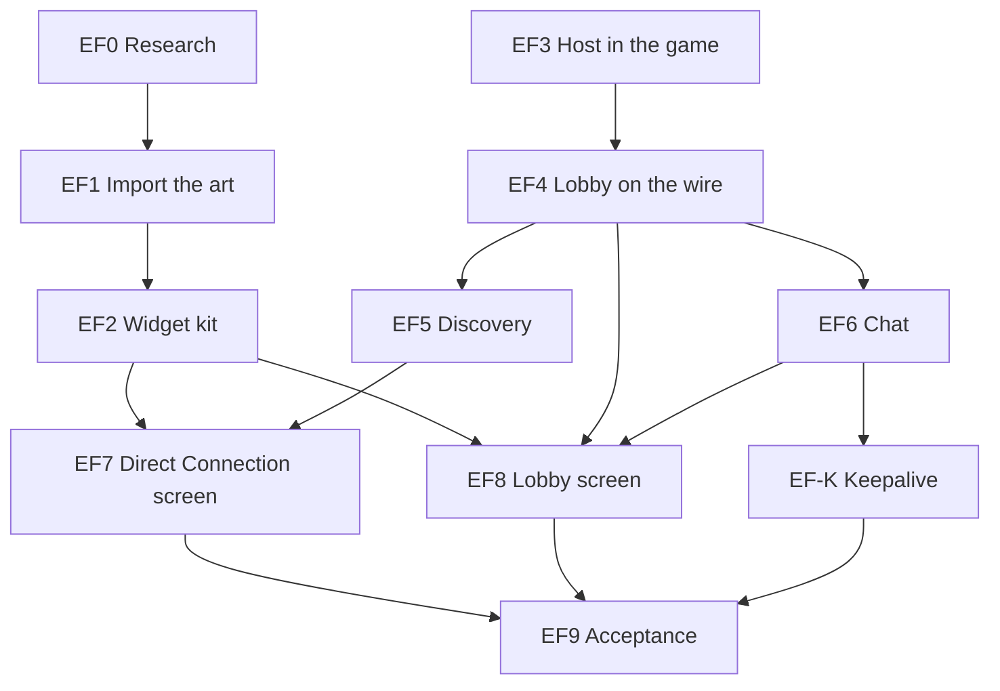

EF0 and EF3 start together. EF7 and EF8 both edit the menus and `main.rs`, so
they run one after the other.

#### Phase 2: the rest of stage F

Design for the rest of stage F, written by a design agent on 2026-10-05 for the
lead's run through Milestone 2. Stage E's last piece, captures converted to
smoothed replays, is designed and built apart, under
[recordings and diagnostics](#recordings-and-diagnostics). Everything below is
an *agent proposal* unless it is credited to John; his binding decisions are the
guide's [decisions](MULTIPLAYER.md#decisions). The questions that are John's to
answer are listed at the end of this subsection with a recommendation each, and
the design builds as written if he takes the recommendations.

In short:

- **The King's settings** are one numbered list, kept by the host, shown to
  every player in the lobby state, changed only by the King and checked by the
  host. A dedicated server takes the same list from its configuration file.
- **The crown and the house come apart.** The King runs the lobby and can pass
  the crown; the house is the machine that runs the host. The house leaving
  still ends a game a player hosts (until stage K's migration); the King
  leaving passes the crown on.
- **Death and revival** are two new mission commands: a lost plane is
  abandoned to the mission, and a revival either takes a free AI aircraft or
  spawns a new aircraft of the same type at the revival distance from the
  battle, with retail's revival weapons. The host counts lives and the delay.
- **Scoring** is mission facts recorded by the mission core (who killed whom,
  with which pilot aboard; damage; losses) and tallies, limits and the end kept
  by the host. A kill limit ends the mission as a time limit does.
- **The results** at the end list every aircraft, human and AI, and, in PvP,
  the scores, as new pages of the debrief.
- **Friend or foe:** the lock box's X follows the viewer's side, U squawks IFF,
  and Show Target Info labels aircraft, with a human's callsign beneath.
- **Human wingmen** hear their leader's orders as a radio call and text, and
  answer with four reply keys.
- **Observers** get a snapshot stream with no plane of their own, optionally
  delayed in PvP, watched through the replay viewer in a live mode.
- **An idle player's aircraft** goes to the AI after a King's setting of 10
  seconds away (menu, focus, stall) and comes back at the first control input.
- **A dedicated server can have a King**, when its configuration says so.
- Single player does not change, apart from three retail features it gains
  only if John agrees (question 2).

##### Where each rule lives

The mission core keeps what the simulation must decide the same way on every
machine, and what a checkpoint (stage H) must carry; the host session keeps the
people (players, the crown, lives, tallies); the screens only show and ask.

| Rule | Mission core (`tore-world`, `tore-sim`) | Host session (`tore-session`) | Screens (`tore-app`) |
| --- | --- | --- | --- |
| Sides | Each plane's side, fixed at setup (built) | Which sides humans may take (mode), lock sides | Slots list by side |
| Friendly fire | `MissionSpec::friendly_fire`, put on combat's `State::friendly_fire` at the build (the rule is built: B1) | The King's setting, written into the spec it sends | Settings panel |
| Loadout rule | `LoadoutSpec::check_for_plane` takes the rule | The King's setting; checks each loadout | Load Ordnance's Cheat loading enabled or refused |
| Realism | The spec's cheats (built) | The King's mission change | Settings panel's Realism page edits the mission |
| Death | A plane is lost: destroyed, pilot dead or ejected (`World::can_take` refuses it, built) | Notices the seat's loss, starts the delay | Revival prompt |
| Revival | `MissionCommand::Abandon` and `Revive`; the revival point; the weapons rule | Respawn rule, lives, delay; picks the AI plane or asks for a spawn | Enter to fly again |
| Scoring | Score facts each tick (kills with the pilots aboard, damage, losses) | Tallies by player and side, limits, the winner, the end | In-flight score board, SCORES page |
| Results | `debrief::results`: a row for every plane | Adds callsigns and scores, sends Results | RESULTS pages |
| Orders and replies | The order call to human wingmen; reply calls | Nothing new (seat commands) | Reply keys |
| Friend or foe | Nothing new | Nothing new | The X, IFF, labels, from the client's copy of the mission |
| Observers | Nothing new | The observer stream and its delay | The viewer in live mode |
| Idle aircraft | Handoff (built) | Away and back, the reservation, the setting | Away detection, the banner |
| The crown | Nothing | King, house, passing, a server's King | Players panel |

##### The King's settings

The settings are numbered (the wire carries a number and a value, as the lobby
state's placeholder already does) and live in one registry,
`tore_session::settings`, which holds each one's number, text name, values,
defaults, when it may change and its check. The host, the dedicated server's
configuration file, the lobby screen and the logs all read it, so a setting is
added in one place. Values the retail host dialogs offered are kept where they
are known; the rows of the `MC_*` dialogs are unknown
([retail spec](spec/multiplayer.md#the-hosts-mission-setting-dialogs)), so the
choices below are fitted to retail's ranges ([numbers](spec/multiplayer.md#numbers)).

| No. | Name | Values | Default, co-op | Default, PvP | The King changes it |
| --- | --- | --- | --- | --- | --- |
| 1 | `mode` | `co-op` (humans on the friendly side), `pvp` (humans on either side) | co-op | pvp | In the lobby |
| 2 | `max-players` | 1 to 30 | 30, or the server's | same | Any time, never below the players connected |
| 3 | `join-in-progress` | `off`, `on` | on | on | Any time |
| 4 | `visibility` | `hidden` (join by address only), `local` (answer the local network's search), `public` (also listed on the Internet Lobby: stage I builds it, refused until then) | local | local | Any time |
| 5 | `password` | set or not (the text travels only in the King's request, never in the lobby state) | not set | not set | Any time; applies to the next joins |
| 6 | `friendly-fire` | `off`, `on` | on | on | In the lobby |
| 7 | `lock-sides` | `off`, `on` | off | on | In the lobby |
| 8 | `loadouts` | `own` (what each aircraft really carries), `any` (any store on any station, the loadout page's Cheat) | own | own | In the lobby |
| 9 | `respawn` | `none`, `ai-slot` (take a free AI aircraft of one's side), `revive` (retail's revival: a new aircraft out of the battle) | none | revive | In the lobby |
| 10 | `lives` | 0 to 10, `unlimited` | unlimited | unlimited | In the lobby |
| 11 | `revive-delay` | 0 to 5 minutes, whole minutes | 0 | 0 | In the lobby |
| 12 | `revive-distance` | 1, 5, 10, 20 or 40 nautical miles | 10 | 10 | In the lobby |
| 13 | `revive-weapons` | `missiles`, `no-missiles` (keeps air-to-ground missiles), `guns`, `half-guns` | missiles | missiles | In the lobby |
| 14 | `fight` | `sides`, `free-for-all` | sides | sides | In the lobby |
| 15 | `tally` | `kills`, `damage`, `ratio` | kills | kills | In the lobby |
| 16 | `time-limit` | none, 1, 5, 10, 15, 20 or 30 minutes | none | 10 | In the lobby |
| 17 | `kill-limit` | none, 1, 2, 3, 5, 7 or 10 | none | 5 | In the lobby |
| 18 | `kill-owner` | `total`, `side`, `player` | side | side | In the lobby |
| 19 | `observer-delay` | 0, 10, 30 or 60 seconds; PvP only | 0 | 0 | In the lobby |
| 20 | `idle-ai` | `never`, 10, 30 or 60 seconds away | 10 | 10 | Any time |

- **Changing the mode** sets every other setting to the new mode's defaults,
  as the creator's own choices reset what depends on them; the King then
  adjusts. *Built (F2-0), agent decision:* "every other" is every setting the
  King changes in the lobby; the ones changed any time (players, join in
  progress, visibility, password, idle aircraft) belong to the game and are
  kept, as are the name and the password (`settings::Store::apply`). Settings 14 to 19 are greyed in co-op except the time limit, which
  ends a co-op mission too (the dedicated server's `time-limit` is this
  setting).
- **A change in the lobby** that alters what players chose (mode, lock
  sides, loadouts, a slot lock) clears every ready mark, as a mission change
  does; any other change keeps them. A change refused for its phase says
  "Change it in the lobby, between missions."
- **The game's name** is a text setting beside the numbers, changed any time.
- **Realism** stays the mission's own cheats (John's spec: inherited from the
  Quick Mission settings and locked for every human). The Settings panel's
  Realism page edits the lobby mission's cheats and sends it as a mission
  change; nothing changes the mission's cheats in flight, so every client's
  prediction keeps running the same rules. *This replaces the earlier gap-fill*
  in the guide that gave the King the Cheat menu in flight (question 6).
- **Stage I and K settings** are not here: what `public` does on the master
  server is stage I's (its design lists a game when the hosting thread is told
  `SetListed`, which this setting drives), and the pinned or calculated host
  and releasing a reserved aircraft are stage K's. Retail's in-flight Multi menu handicaps (reduce bullet accuracy and
  the rest, [retail](spec/multiplayer.md#retail-connection-screens)) are not in
  phase 2.

##### The King, the crown and the house

EF4 made the King the hosting player's own connection and its leaving the end
of the game. Phase 2 separates the two roles the guide already names:

- **The house** is the connection of the player whose game runs the host (the
  in-process link's address in a hosted game; none on a dedicated server). It is
  the one exempt from the silence timeout, and its leaving ends the game for
  everyone, as EF4 built it, until stage K migrates the host.
  `HostConfig::king` becomes `HostConfig::house`, and the King is a lobby role.
- **The King** is a player. In a hosted game it starts as the house. **Pass
  the crown** (message 23, the King only) gives it to another connected player.
  A King who leaves, or is dropped, passes it to the longest-connected player
  (in a hosted game that is the house). The King's Leave asks "Leaving ends
  the game for everyone." only of the house; a King who is not the house is
  told "The crown passes to Hawk."
- **Only the King** changes the mission and the settings, locks slots, starts
  and ends the mission, kicks and passes the crown (EF4's refusal "Only the
  King may do that." stands). The house without the crown is an ordinary player
  but for leaving.
- **A dedicated server** keeps no King by default. Its configuration's new
  `king first-player` gives the crown to the first player to join and then to
  the longest-connected; the server's start rule becomes the King's while a
  King is connected. `king-mission locked` refuses the King's mission changes
  (the file's mission and its settings stay; start, kick and the crown still
  work). When the last player leaves, the server waits out its empty timeout
  and goes back to its file's mission and settings, so a public server does not
  keep a stranger's choices.

##### Slots, sides and joining

- **Mode.** Co-op makes every friendly plane a slot (EF4's default); PvP makes
  every plane of both sides one, and the lobby lists them by side. The
  dedicated server's `open-planes` stays its own rule when it has no King.
- **Slot locks** (message 27, the King only): each slot is `open`, `closed`
  (the AI flies it; nobody takes it, the lead included) or `reserved` for one
  callsign (only that player takes it). A lock that removes a player's slot
  frees it and tells the player. The lobby state carries each slot's lock.
- **Join in progress off** refuses every seating after the mission's first
  tick, except a player's own revival: "This game takes no new pilots once the
  mission flies." Players in the lobby watch instead. On, the EF4 rules stand.
- **Lock sides** keeps each player on the side of the first plane it flew in
  this mission: taking a plane or a revival on the other side is refused, "Sides
  are locked until the mission ends."
- **Max players** lowers or raises the capacity the handshake checks (the
  lesser of it and the open slots, as built); the password and the visibility
  apply to the next joins and the next search answers: `hidden` answers no
  search, `local` answers the local network's, and the lock shows whenever a
  password is set.

##### Loadout rule, friendly fire and realism

- `LoadoutSpec::check_for_plane` takes the loadout rule. Under `any`, the
  Cheat loading the page offers is allowed and checked by the page's own cheat
  rules; under `own`, EF4's refusal stands. Changing the rule to `own` drops a
  kept cheat loadout to the standard load with a Notice, as a mission change
  does.
- `MissionSpec` gains `friendly_fire` (text form `friendly-fire on/off`, on
  when absent, refused off in a single-player spec), which the build puts on
  combat's setting. Single player's spec never carries it, so its build is
  unchanged.

##### Death, revival and lives

**When a plane is lost.** A human's plane is lost when it is destroyed or its
pilot is dead or has ejected, the same test `World::can_take` already makes.
The seat keeps the wreck until the player flies again or leaves. Retail's
player "presses Enter to re-enter the battle".

**Two mission commands** (`tore-world`, applied first in the tick with Take and
GiveBack):

- `MissionCommand::Abandon { seat }` frees the seat from its lost plane. The
  plane's pilot becomes `Pilot::Lost`: its cockpit goes on stepping inside the
  world with a paused game's neutral controls (wreck motion, the escape), as the
  host's departed-player orphans do today, which this replaces. Nobody can take
  it.
- `MissionCommand::Revive { seat, spawn }` abandons the seat's lost plane and
  seats it in a **new plane**: the next plane id after every plane the mission
  has had, in the old plane's wing with the next free member number, the same
  aircraft, at the spawn's position, heading and speed, with the spawn's
  loadout and full fuel. It is built as the mission builds an AI aircraft with
  a lobby loadout (`plane_loadouts`), then taken by the existing handoff, so
  every rule of the handoff holds. A `Spawned` message tells every client, whose
  copy of the mission adds the same plane, so the roster, the sides and the
  aircraft types know it.

**The revival point** (`world::revive::point`, fitted: retail says only "just
outside the battle zone at the host's revival distance"). The battle's centre
is the mean position of the living aircraft that have an aircraft of the other
side within 20 nm, or of every living aircraft if none has. The new plane is
placed on the bearing from that centre towards the mean start position of its
side's wings, at the revival distance from the centre, at the mission's
airborne start altitude, heading for the centre, at its aircraft's airborne
start speed.

**The weapons rule** (`world::revive::revival_loadout`), applied to the loadout
the player chose in the lobby (or the standard load): `missiles` keeps it whole;
`no-missiles` empties every air-to-air missile station and keeps air-to-ground
missiles, bombs and the gun; `guns` keeps the gun alone; `half-guns` keeps the
gun with half its rounds, rounded up. The same rule cuts an AI aircraft's
stores when the `ai-slot` rule hands one over.

**The host's part** (`host/revive.rs`):

- The respawn rule: `none` (the player watches until the mission ends),
  `ai-slot` (a free AI plane of the player's side open to it, its own wing
  first, then the side's other wings, lowest id first; Abandon then Take, with
  the weapons rule), or `revive` (Revive with a point and a loadout).
- **Lives** count revivals, per player per mission, reset at the next mission.
  **The delay** counts from the moment the plane was lost.
- A seat whose plane is lost is sent **Revival** (message 29): its lives left,
  the seconds until it may fly again, and the rule. The flight's HUD says "Press
  Enter to fly again (2 lives left)", "You can fly again in 0:45", or "No lives
  left. Esc, then Watch, shows the battle." Enter sends **Revive** (message 28);
  the answer is a new Seated (a new [flight](formats/net-protocol.md#flights))
  or a refusal in words.
- **Joining from the lobby** after a loss counts as a revival: the same rule,
  lives and delay apply, so leaving and pressing Join cannot dodge them (this
  changes EF-F's free rejoin for a player whose plane was lost).
- **Room.** A mission holds at most 64 planes at once (the wire's aircraft in
  a snapshot). A revival that would pass it first retires the oldest lost plane
  whose wreck has rested on the ground for 30 seconds: it leaves combat, the
  snapshots and the roster message, and keeps its ledger entries and its
  results row. With none to retire the revival waits and the HUD says so.

##### Scoring

Retail's rules ([numbers](spec/multiplayer.md#numbers)): only aircraft and
helicopters count; killing a human player before he ejects counts as two kills;
the tallies are total kills, total damage delivered to opponents, or the kill
ratio; the time limit and kill limit end the game; the kill owner says who must
reach the kill limit.

- **Facts in the mission core** (`tore-world`, `score.rs`). When the host
  turns scoring on (`World::set_scoring(true)`; single player never does, so
  its tick and fingerprint are untouched), each tick records, from the
  ledger's new kills and combat's strikes: `Kill` (shooter plane and its pilot,
  victim plane and its pilot, an aircraft or not, the pilot still aboard),
  `Damage` (shooter, victim, the hit's fraction of the victim's full hit
  points) and `Loss` (a human's plane lost, by any cause). The host drains them
  every tick. Combat's `Strike` gains the damage amount for this.
- **Tallies in the host** (`host/score.rs`), by player: kills (two for a human
  victim with the pilot aboard, one otherwise; aircraft only), damage to
  opponents (in aircraft: a whole aircraft's hit points is 1.0), losses, and the
  ratio (kills over losses, kills alone with no loss). A kill is credited to the
  player flying the shooter's plane at the kill's tick; a lost plane's late
  missile credits the player who flew it; an AI shooter scores nothing.
  Opponents are the other side's aircraft under `sides`, and every aircraft
  but one's own under `free-for-all` (the AI on one's own side does not count;
  `free-for-all` changes the scoring only, never who can hit whom).
- **Limits.** The kill limit is reached when the kills of every player together
  (`total`), of one side's players (`side`) or of one player (`player`) reach
  it. The mission then ends with the new reason **kill limit**, as the time
  limit ends it, with the winner by the tally: a side under `sides`, a player
  under `free-for-all`, or a draw.
- **Scores** (message 31) go to every player whenever they change, at most
  once a second, and with the end. In flight **K** opens and closes the score
  board, retail's Show Player Scores open to every player (the guide's
  gap-fill): one of retail's three headings, PLAYERS RANKED BY KILLS, KILL
  RATIO or TOTAL DAMAGE, the players in order with their side, and the time
  left.

*Built (F2-S, 2026-10-05).* What the build settled, each an agent decision
unless the design above says it:

- **Recording.** `tore_world::score::Recorder` lives on the world while
  scoring is on (`World::score`, `None` in single player). It runs after
  combat and the AI, before the radio drains combat's strikes, and only
  reads: combat's `Strike` gained `amount` (the hit points the hit took) and
  `State::strikes` reads the tick's strikes in place. A **kill** is recorded
  when a plane of the roster becomes lost by the handoff's own test (crashed,
  no hit points, pilot dead or escaped), credited as the debrief credits a
  loss: combat's kill, else the last plane to hit it; a plane whose last hit
  was its own, a crash with no hit and a plane lost out of bounds credit
  nobody. `pilot_aboard` is false only when the pilot escaped first, so a
  plane shot down and then ejected from counts as killed with its pilot
  aboard. Any other target a hit destroys (a ground object) is a kill with
  `aircraft` false. Each target's end is recorded once: the set of recorded
  targets is the recorder's only state between ticks.
- **Tallies.** The host keeps them by connection (its join order, never
  reused), so a lobby id given out again starts afresh; a player who leaves
  leaves the list, and what it scored stays in its side's tally. A side's
  tally is its players' only: the AI scores nothing, for its side either.
  Kills and damage count against opponents only; a kill of one's own side
  takes nothing away (retail's penalty, if any, is unknown).
- **Co-op.** Scores go out in co-op too, so K works there, but the scoring
  settings that are greyed in co-op do not apply: no kill limit, the fight by
  sides, and no winner.
- **The winner** is named only when a limit (kills or time) ends a PvP
  mission; a mission ended any other way sends its final scores with none.
  Players rank by the tally, then kills, then damage, then joining order; a
  free-for-all whose best two are level is a draw.
- **Scores** go to seated players and observers: whenever the tallies or
  the listed players and sides change, at most once every 120 ticks, and to
  a newly seated player or new observer at the next of those chances. An
  observer watching with a delay gets them once its stream shows their tick
  (F2-O1's `send_as_of`). At the end every connection gets the final scores
  at once, before the observers' watches end, Results and Mission ended.
- **The time limit** the host ends a mission at is now the settings store's
  (`time-limit`, which starts as the configuration's), so the King's change
  applies.
- **The client** keeps the newest Scores (`Client::scores`) and counts the
  time left down from its arrival (`Client::seconds_left`); a new mission or
  a flight's start clears them. Each one is a `scores` line in the game's net
  log, and `tore-bot` prints it (`NAME: scores: ...`, the words of
  `tore_session::client::scores::summary`).
- **The board** (`tore-app` `net/scoreboard.rs`, fitted: retail's layout is
  unknown): K opens and closes it in a networked flight, and it closes with
  each new flight. It is drawn in the HUD's font over a translucent band, 360
  layer units wide and centred, from 96 units down: the heading, a row for
  each player (rank, callsign, side, kills, losses, damage in aircraft, ratio)
  in the colours of the chat window (the viewer's side green, the other red,
  no side yet grey, the viewer's own row gold), each side's totals when the
  fight is by sides, the kill limit and the time left, and the winner once
  there is one. Before the first message it says "Waiting for the scores".

##### The multiplayer debrief

`tore_world::debrief::results(&World)` gives a row for every plane the mission
had, retired planes included, from the same `Ending::pilot` rule each seat's
report uses: status, damage, kills by the ten rows summed, friendly fire,
air-to-air and gun shots and hits. The host adds each row's pilot (a callsign,
or AI, and every callsign that flew it), the scores and the winner, and sends
**Results** (message 32) to every connection at the mission's end, observers
and players in the lobby included.

The debrief keeps the retail pages for the player's own plane and, in a
networked game, adds after the first page: **SCORES** (PvP only: the winner,
the ranking with each player's kills, losses, damage and ratio) and
**RESULTS** (every aircraft by side and wing, fifteen to a page:
callsign or AI, aircraft, status, kills, hit percentage, damage). Single
player's debrief is unchanged: the pages appear only with a Results message.

##### Friend or foe

- **The lock box's X.** Drawn today when the displayed target is on the
  *friendly* side (`main.rs`, `target_friendly`). It becomes "on the presented
  plane's side", so a player flying for the enemy side sees the X on its own
  side's aircraft. Single player always flies the friendly side, so it is
  unchanged.
- **IFF squawk (U).** Retail: "returns a Friendly message if you've targeted
  someone on your own side." The game answers from its copy of the mission:
  "IFF: Friendly" for an aircraft of the presented plane's side, "IFF: no
  reply" for any other (fitted: retail's other answer is unknown), "IFF: no
  target" with nothing designated. Today U says "IFF unavailable".
- **Show Target Info** (the Pref menu's row, Ctrl+T; listed as not implemented
  in the [menus lane](testing/lane-menus.md)). Retail: each target's identity
  below it in the forward view, with an aeroplane's current manoeuvre, orange,
  red when the object targets you, and in multiplayer each player's callsign
  beneath. Built from the frame's picture and readout: the identity of every
  visible aircraft and object, the manoeuvre for the displayed target (the
  target window's activity, the only one a client knows), red when the readout
  says it aims at the player, and the callsign of a human-flown aircraft from
  the roster. Off by default.

*Built (F2-C, 2026-10-05).* `target_info.rs` holds all three, as pure functions
of the flight's own copy of the mission: `Sides` answers the side of a plane
(the roster first, then the AI wings, then a runway's airport, friendly or
hostile; neutral and unknown airports are on no side), `iff` the squawk's
answer and `labels` the text under every visible aircraft and object. The
presented plane's side comes from the roster (a plane the roster does not list
is friendly), so single player is unchanged. The labels take the identity from
the frame's picture (an aircraft's exact identity, or an airport object's
name), the manoeuvre and the red from the readout's target brief, and the
callsign from the lobby state the client holds (the player whose slot is that
plane). They are drawn by the replay viewer's text routine, in the HUD's font
and size, under the aircraft's screen point. Agent decisions: a label reaches
10 nautical miles; at most 24 show, aircraft before objects and the nearest
first; the manoeuvre and the red are known for the displayed target only; the
orange is (255, 150, 40) and the red (255, 40, 40). Show Target Info is the Pref
row `Show target info?` and Ctrl+T (its imported accelerator), kept in
`FlightUi::target_info`, off at every flight's start and kept in a session's
menu.

##### Orders to human wingmen, and their replies

- **The order call.** A human lead's Alt-key order reaches human wingmen today
  only as a note that one was flown by a human (`ai_wings/orders.rs`). It
  becomes a radio call to each human member the order addressed: the lead's
  own order stems and a text line ("Lead: Break left"), delivered on that
  seat's channel with the usual hold and radio silence. The AI members act as
  before. Stage G's design (slice G3a, on the `multiplayer` branch) already
  turns the engage orders into assignment calls that every addressed wingman,
  human or AI, hears with its own bearing and range; F2-R voices every other
  order the same way and leaves those to G.
- **Replies and requests** are a new seat command, `SeatCommand::WingReply`,
  with four kinds from the guide: **Engaging** (Alt+Shift+E, `^ENGAGE`),
  **Winchester** (Alt+Shift+W, text only: no retail recording says it),
  **Bingo fuel** (Alt+Shift+B, `^BINGO`) and **Need help** (Alt+Shift+H, the
  retail recording whose phrase asks for help, `^CLRMY6` or `^OFFME`, chosen by
  its phrase text). The call goes from the seat's plane to its flight: every
  human of the wing hears it as a radio line ("Two: Winchester"). The AI does
  nothing with it (no AI work is asked for). A plane that leads its wing has no
  one to answer: the key says "You lead this flight." The keys work in single
  player too, where a lead has no human wingman, so they only say so.
- **Built (F2-C, 2026-10-05): the keys, ahead of their slices.** The four reply
  keys, K and U are catalog rows (`key:Alt-Shift-e` and the rest, so they remap
  like any key). Alt+Shift with a letter is read before the Alt letters, which
  stay the lead's orders; Alt+A and Alt+N stay free for stage G. Until the
  reply slice sends the call, the reply keys say "You lead this flight." for a
  plane that leads its wing (single player always does: John took this on
  2026-10-05) and "Winchester: not available yet" and so on for a wingman in a
  network flight; K says "Score board: network games only" in single player
  and, until F2-S drew the board, "Score board: not available yet" in a network
  flight. The slices that build them replace `flight_ui::reply_answer` and
  `score_board_answer`'s callers in `main.rs` (`Command::Reply` and
  `Command::ScoreBoard`); F2-S's K now opens the board in a network flight and
  says "network games only" in single player.
- **Keys** are in the [controls list](CONTROLS.md#multiplayer-phase-2) (built by F2-C; John took the recommended keys on 2026-10-05).

##### The observer view

John (2026-09-28): observers use the replay viewer's camera and playback
controls on the live session, cannot chat with the players flying, and in PvP
the King can set a delay applied by the host, so an observer's machine never
holds live positions.

- **Who observes.** While a mission flies, a connection with no plane: in the
  lobby (a late joiner, a player who ended its flight), a player whose plane is
  lost and who has no revival, and a player whose plane the AI flies while it is
  away. The lobby's **Watch** button, and Watch on the revival prompt, start it.
- **The stream** (`host/observe.rs`). **Observe** (message 33) starts or stops
  it and names the camera's subject (an aircraft, or a point). The host answers
  **Observing** (message 34: a new flight, the roster, the destroyed ground
  objects, the delay) and then sends the connection ordinary snapshots with no
  own plane: no own state hash, no readout, no exact state. Relevance follows
  the camera: the subject, everything within 20 nm of the camera's point and
  any missile within 10 nm at the full rate, the rest twice a second. The
  client sends Observe again when the subject changes, or the point moves more
  than 2 nm, at most twice a second.
- **The delay.** With a delay D the host keeps, for D seconds, every
  snapshot's whole quantized picture and the mission-wide events with their
  ticks, and builds an observer's snapshots and events from tick now less D:
  nothing newer leaves the host. About 9 MB at a 60-second delay for 30
  aircraft (measured by the slice). Scores to an observer are delayed the same.
- **The screen** (`net/observe.rs`). The client's interpolated observer frames
  feed the replay recorder's conversion (the one a single-player flight
  records with) into an in-memory recording that grows as the mission flies,
  and the replay viewer plays it in a **live mode**: the playhead follows the
  newest frame; the player may pause, step back, scrub within what has arrived
  (the last 10 minutes are kept) and press End to return to live; it can never
  go past live. The viewer's cameras, views, labels and panels work as on any
  replay. Esc leaves the view for the lobby.

*Built (F2-O1, 2026-10-05): the stream.* The host's part is
`host/observe.rs`, the client's `client/observe.rs`, the bot's `tore-bot
--observe PLANE|none`. Each choice below is an agent decision unless it says
otherwise.

- **Asking.** Observe is taken from a player in the lobby, or leaving its plane
  (its watch starts once it is back in the lobby), while the mission flies. It
  is refused "The mission is not flying; watch once it flies.", "Leave your
  aircraft before you watch." (taking or flying a plane) and "There is no plane
  12." (an aircraft subject the roster does not hold). Stop with no watch does
  nothing. The watch starts at the next tick that finds the game in the lobby:
  a new flight of the connection, the Observing message, then snapshots.
- **The picture** is the whole mission, quantized once a tick it is needed and
  shared by every observer (`from_world::observer_picture`): while a human
  flies, the first such seat's picture, whose own plane is an aircraft like any
  other; with nobody flying, built from combat's targets as the combat snapshot
  draws them (a test holds the two equal for the AI's aircraft). Every aircraft
  and ejected pilot is sent, in real plane ids; no missile is "aimed at" an
  observer.
- **Relevance.** The camera's point is an aircraft subject's place in the
  picture shown (kept while the aircraft is gone) or the point asked for; the
  subject itself is "viewed". The netcode's bands then apply from that point:
  within 20 nm, and missiles within 10 nm, at the full rate, the rest twice a
  second. With no subject every entity is near, as the packet allows.
- **The camera.** The host applies at most two changes a second from one
  connection; a change sooner waits and the newest waiting is applied when the
  half second has passed. The client sends the camera only when it changed (a
  new subject, or a point more than 2 nm from the one sent), at most twice a
  second, and a change in between goes with a later update.
- **Events.** An observer gets the mission-wide events (the tracker's, and the
  AI's ejections) and never a seat's own. Without a delay they are queued each
  tick as a seated player's are, and a new observer is first sent the mission
  as it stands (the destroyed ground objects in Observing, the craters, fires
  and effects as events), as a seated player is.
- **The delay** applies to every observer of a PvP mission whose
  `observer-delay` is set (co-op has none). The ring records from the mission's
  first tick whenever the mission flies with a delay, watched or not, so an
  observer who starts sees the battle as it was a delay ago at once: one frame
  each snapshot interval, at the ticks whose number is a multiple of the ticks
  per snapshot, and every mission-wide event with the tick it became known.
  **Every delayed observer's snapshot ticks are the ring's** (a correction to
  the wire's lobby-id phase, which holds without a delay): the host sends the
  frame of its tick less the delay, and with it the events that became known by
  then and the messages held for that tick. Events falling out of the ring are
  folded into the mission as it stood (the destroyed ground objects and the
  craters and fires), which is what a new delayed observer is told stands;
  short-lived effects are not carried. While the ring is younger than the delay
  the first snapshot waits until the delay has passed (Observing's tick says
  which it is).
- **News at a tick** the other slices send observers goes through
  `Host::send_as_of(connection, tick, message)`, which holds it for a delayed
  observer until its stream shows that tick (F2-S's scores, F2-V's new planes).
  The roster and the lobby state are not held: they carry no positions.
- **The end.** The stream ends with Observing's end at the observer's Stop
  (messages still held then go out), before the Seated message of a plane it
  takes, and at the mission's end, before the results and Mission ended. A
  delayed observer does not see the mission's last delay.
- **The client.** `Client::watch(subject)` asks (and moves the camera),
  `Client::stop_watching` stops, `Client::watching` says where it stands and
  `Client::observer_frame` gives the frame: every aircraft as a target in its
  real plane id, the ground objects, projectiles, debris, pilots, effects and
  marks, an empty player pose (no aircraft, plane `u32::MAX`), and the
  mission-wide events once the picture reaches them. The client stays in the
  lobby phase while it watches, and its automatic ready takes no plane. An
  observer's frames are not written to a capture.
- **Measured** (`host/observe_tests.rs`): with 30 aircraft the ring holds about
  4.6 KB a frame, 8.4 MB for a 60-second delay (1,800 frames); an observer of a
  15 against 15 fight, its camera on a plane in it, is sent about 12 KB a
  second, and the `net-server-observe` scenario's observer of twelve aircraft
  about 5 KB a second.
- **Room.** An observer is a connection like any other, so it counts against
  the handshake's capacity (the lesser of the player limit and the open
  planes): a game full of players takes no observer.

##### The AI flies an idle player's aircraft

The open question since 2026-09-28 (the guide's agent proposal: after 10
seconds without input the AI flies the aircraft until the player touches the
controls). Designed as the King's setting `idle-ai` (default 10 seconds,
question 4).

- **Away** is not a centred stick, which a player cruising hands-off also
  sends. A game is away while its controls are neutral because of a menu (the
  Esc or pause menu, a settings screen), the window lacking focus, or the loss
  of the controller it was flying with; the client sends **Away** (message 35)
  once that has lasted the setting's seconds. A game whose loop is stalled (the
  [stall rule](#a-stalled-game-stays-connected-ef-k)) is away by the host's own
  count after the same time.
- **The host** gives the plane back to the AI (GiveBack, the handoff's rules)
  and **reserves** it for that player: nobody else takes it, and its slot reads
  "AI (Viper away)". The player's connection observes its own plane meanwhile
  (the observer stream, its subject the plane), and the screen says "The AI is
  flying your aircraft. Move the stick or press any flight key to take it
  back."
- **Back** (message 36) at the first flight input with no menu up and the
  window focused: the host takes the plane back for the player at the next tick
  (a Take, a new flight), with its stores and damage as the AI left them. A
  plane lost while the AI flew it is lost to the player as any other (revival
  rules).

##### The lobby's display

The lobby screen (EF8) gains:

- **Buttons.** The King: Mission..., Settings..., Players..., Loadout, Ready,
  Fly, Leave, seven at 75 wide on a 79 pitch across the 549-wide row. Everyone
  else: Settings..., Loadout, Ready, Leave. While the mission flies Loadout
  reads **Watch**.
- **Settings...** opens a panel over the lobby with the registry's rows as the
  creator's text buttons (left click forward, right click back), on four pages
  behind the rocker: Game (mode, players, join in progress, visibility, password,
  friendly fire, lock sides, loadouts, idle aircraft, observer delay), Revival
  (respawn, lives, delay, distance, weapons), Scoring (fight, tally, time limit,
  kill limit, kill owner) and Realism (the mission's cheats). Every player sees
  it; for anyone but the King every row is greyed, as retail greys a client's
  settings. A row that does not apply (scoring in co-op) is greyed for the King
  too.
- **Players...** (the King): for the player selected in Players, Kick (EF8's
  reason panel) and Give the crown.
- **Slot locks.** The King's right click on a slot cycles open and closed;
  with a player selected in Players it reserves the slot for that player. A
  closed slot reads "Closed (AI)", a reserved one "Reserved: Hawk".
- **The head line** summarises the settings in words under the start rule:
  "Co-op, friendly fire on, no revival" or "PvP by sides, 5 kills or 10
  minutes, revival with unlimited lives".

##### Single player in phase 2

Nothing above changes single player by default. Its spec never carries the new
fields, the scoring facts are off, the mission commands and messages are never
sent, the debrief adds pages only with a Results message, and the X now
follows the presented plane's side, which in single player is always the
friendly one.
Three retail features reach single player (John agreed on 2026-10-05,
question 2, and F2-C built them): U's IFF answer, Show Target Info, and the
reply keys' "You lead this flight." line. The slices that touch the mission core (F2-1, F2-S, F2-V, F2-R) run the
single-player baseline and must compare SAME; the others run the quick guard.

##### State for exact checkpoints

Stage H must carry what phase 2 adds to the mission core: the scoring switch
(`World::set_scoring`) with the targets whose end it has recorded
(`score::Recorder::recorded`; built by F2-S, not coded yet), every `Pilot::Lost` plane and its cockpit, the
spawned planes (their roster entries, AI actors, combat rows) and which planes
are retired. The facts themselves are drained every tick and are not state.
What the host session keeps (the settings, the crown and the house, slot
locks, lives and delays, tallies, observers' delay rings, away reservations)
is the session's, which stage K moves with the host.

##### Phase 2 slices

Every slice follows the lead's rules for Milestone 2's remaining stages
(John, 2026-10-05): targeted tests, each added to the full suite, a battery
scenario for anything done through a binary (the `net` lane,
`docs/testing/lane-net.md`, being built beside this design), a rule in
`tools/battery_selection.py` for every new file, and an entry in the run's test
ledger. Each slice's tests go in **files of their own** (`host/king_tests.rs`,
`host/score_tests.rs` and so on), never in the shared `host/tests.rs`, so
parallel slices do not collide. F2-0 takes **the next protocol version** for
every message below; no later slice changes the wire without the lead.

| Slice | Model | After | Owns | Work | Acceptance |
| --- | --- | --- | --- | --- | --- |
| F2-0 Wire and seams | Opus | | `tore-session`: `wire/messages.rs`, `wire/inputs.rs`, `wire/mod.rs` (the version), the wire tests and `wire-golden.txt`, new `settings.rs`, new empty `host/{king,revive,score,observe,away,results}.rs` and the calls to them in `host/mod.rs`, `client/mod.rs` (events and senders); `tore-world`: `seats.rs` (`WingReply`, `Pilot::Lost`), `world/commands.rs` (the new commands' variants), new `world/{revive,replies}.rs` and `score.rs` holding only the shared types | Every message and field of the [phase 2 wire](formats/net-protocol.md#phase-2-the-kings-settings-revival-scores-and-observers) with its coding; the settings registry with ranges, defaults, names and checks, and the host's settings store (defaults, no King's changes yet); the types the slices share (`Reply`, `Spawn`, `RevivalWeapons`, score facts); the hooks each slice fills (the take check, the tick's revive, score and away calls, message dispatch), each doing nothing yet; requests not built yet are refused "Not available yet." | Round trip, fuzz and golden tests for every new message and field; the golden refreshed under the next version; the host refuses each new request politely; every existing session test passes; quick check `--no-battery` (the new world variants are never sent). **Built (F2-0, 2026-10-05):** protocol 8; the messages in `wire/messages.rs` (`SettingsChange`, `Lock`, `SlotLock`, `Revival`, `Spawned`, `Scores`, `Results`, `Observe`, `Observing`, `EndReason::KillLimit`), the wing reply as command 22; `tore_session::settings` with the registry, typed choices (`Mode`, `Respawn`, `Fight`, `ScoreTally`, `KillOwner` and the rest) and the `Store` the host keeps and sends in every lobby state; the world's `Reply`, `Spawn`, `RevivalWeapons` and `score::Fact`; the host's hooks in `host/{king,revive,score,observe,away,results}.rs`, the take check calling `king_take_refusal` then `revive_take_refusal`; the client's senders and five new events. The step refuses `Abandon` and `Revive` and ignores `WingReply`. A lost plane's roster entry goes out as the AI's (agent decision: the roster has no "nobody"). Tests: `wire/phase2_tests.rs`, `client/phase2_seams_tests.rs`, `settings_tests.rs`, `world/phase2_seams_tests.rs` and the samples' round trip, fuzz and golden. The compile-only arms for the new variants in `tore-app` (`main.rs`, `net/play.rs`, `net/hosting.rs`, `net/debrief.rs`, the lobby preview), `tore-server`'s `wiring.rs` and `radio_calls.rs` are each one line |
| F2-C Friend-or-foe cues and the new keys | Sonnet | | `tore-app`: `main.rs` (the X's side), new `target_info.rs`, `flight_ui.rs` (U, Ctrl+T and the Pref row), `input_catalog.rs` (every phase 2 key: IFF, Show Target Info, score board, the four replies, each answering "network games only" until its slice lands), `docs/CONTROLS.md` (generated), `docs/tore-keyboard-map.html` | The X on the presented plane's side; IFF's answers; Show Target Info's labels and colours; the catalog rows | Unit tests: the X for a viewer on each side; IFF for friendly, other and none; label text, colours and callsigns from a fixture picture and roster; the controls list test; a headless render of the labels; the menus lane's "Show target info" row no longer reports not implemented; quick guard. **Built (F2-C, 2026-10-05):** as [described above](#friend-or-foe); unit tests for the X on each side (and on a friendly and a hostile runway), IFF's three answers, label text, colours, callsigns, the cap and a headless render; the catalog rows and the controls test; a windowed `replay-script-friend-or-foe` scenario (the replay lane's input scripts) that presses U, Ctrl+T, K and a reply key in single player and compares a frame before and after for the orange text. Single-player change as planned (John, 2026-10-05): the full baseline was recorded and every difference explained in the run's notes |
| F2-1 The King's lobby | Opus | F2-0 | `host/king.rs`, `host/config.rs`, `host/lobby.rs`, `host/discover.rs`, new `host/king_tests.rs`, `client/lobby_tests.rs` additions; `tore-world` `mission.rs` (`friendly_fire`, the loadout rule) and `world/build.rs`; `tore-server` `config.rs` and `wiring.rs`; `docs/DEDICATED-SERVER.md` | The settings store's King's changes with their phase rules; mode and slots; slot locks; join in progress; lock sides; max players, password and visibility; the loadout rule; friendly fire into the spec; house and crown, passing it, the King's departure; a server's King; the server's configuration keys for every setting | Simulator tests: each setting reaches every lobby state; a non-King and a wrong phase are refused; PvP opens both sides; closed and reserved slots; join in progress off; lock sides; the loadout rule; friendly fire off in a flown mission; the crown passed, used and passed on at a departure; the house's leaving ends the game and the King's does not; a server's first-player King; configuration parsing. A `net` lane scenario: a `tore-server` with `king first-player` and a King bot that changes settings and starts. Single-player baseline SAME |
| F2-R Orders and replies | Sonnet | F2-0, F2-C, stage G's G3a and G8 | `tore-world` `world/replies.rs`, `radio_calls.rs`, `ai_wings/orders.rs`, the comms delivery; the app's handling of the four reply actions; `tore-bot --reply` | The order call to human wingmen; the reply calls and their refusals | World tests on the crowd fixture: a human lead's order reaches its human wingman as a call and a line, and nobody else; each reply reaches the flight's humans only, respects radio silence, and a lead's reply is refused; the radio journal; a `net` scenario with two bots in one wing exchanging an order and a reply. Single-player baseline SAME |
| F2-S Scoring | Opus | F2-0 | `tore-world` `score.rs` and its call in `world.rs`; `tore-sim` combat's `Strike` amount; `host/score.rs`, new `host/score_tests.rs`; the client's scores; `tore-app` new `net/scoreboard.rs` and its call in `net/play.rs` | Score facts; tallies; limits and the kill limit's end; Scores; the score board on K | World tests: a human killed with the pilot aboard counts two, after ejecting one, ground kills none, damage fractions, losses, AI shooters; host tests for each tally, fight type and owner, the kill limit's end with its winner and a draw, the time limit, the pace; a render test of the board. Single-player baseline SAME (facts off). **Built (F2-S, 2026-10-05):** as [described above](#scoring); the world's facts (`score.rs`, combat's `Strike::amount`), the host's tallies, limits, winner and pace (`host/score.rs`), the client's kept scores and their words (`client/scores.rs`), `tore-bot`'s scores lines, and K's board (`net/scoreboard.rs`, two short hunks in `main.rs`: the K arm and the draw call). Tests: `world/score_tests.rs` (a real gun burst's damage, kill and loss; ejection; AI shooters; no shooter; ground kills and fractions; recording changes nothing the mission does), `host/score_tests.rs` (on the simulator: kills, losses, damage, ratio, both fights, the kill limit by side, total and player with a winner and a draw, the time limit's winner, co-op, the pace, a late joiner and a departure), `client/scores.rs` (the words, and the real client keeping and counting down), the board's lines and a headless render, and the net lane's `net-server-scores` |
| F2-V Death and revival | Opus | F2-0 | `tore-world` `world/revive.rs`, `world/handoff.rs`, `ai_wings.rs` (the spawned aircraft), new `world/revive_tests.rs`; `host/revive.rs`, new `host/revive_tests.rs`; the client's revival state and its own copy's spawn; `tore-app` `net/play.rs` (the prompt and Enter); `tore-bot --revive` | Abandon and Revive; the revival point and loadout; retiring; lives, delay and the three rules; Join after a loss; replaces the host's orphans | World tests: a revived plane's place, heading, speed, stores under each weapons rule and its handoff invariants; Abandon keeps a wreck falling; 100 revivals in one mission stay within 64 planes; host tests for each rule, lives, the delay, the lobby's Join, lock sides; a client copy that adds the spawned plane; a `net` scenario where a bot ejects, revives and flies on. Single-player baseline SAME |
| F2-O1 The observer stream | Opus | F2-0 | `host/observe.rs`, new `host/observe_tests.rs`; the observer flight in `wire/connection.rs` and `wire/from_world.rs`; new `client/observe.rs`; `tore-bot --observe` | Observe and Observing, snapshots with no own plane, relevance by the camera, the delay ring | Simulator tests: an observer gets entities near its subject at the full rate and far ones twice a second; with a delay nothing newer than now less the delay is ever sent, events included; the stream stops at seating and at the end; bandwidth and the ring's memory measured and recorded; a `net` scenario with an observing bot. Quick guard. **Built (F2-O1, 2026-10-05):** as [described above](#the-observer-view): the host's watches and stream (`host/observe.rs`, the hooks in `host/mod.rs`: the watch on each connection, the stream on the host, the stop before Seated and at the end, the lobby's observing mark), `from_world::observer_picture`, `HostConnection::observer_snapshot`, the client's `watch`, `stop_watching` and `observer_frame` (`client/observe.rs`), `Host::send_as_of` for the slices that send news at a tick, and `tore-bot --observe`. Delayed observers' snapshot ticks are the ring's (agent decision). Tests: `host/observe_tests.rs` (rates by the camera, a point and none, the camera's limit, refusals, human-flown planes and events, the delay for snapshots, events and held messages, the stops, measurements; the 60-second ring `#[ignore]`d for the full run), `client/observe_tests.rs`, `from_world`'s observer picture; the `net-server-observe` scenario. Measured: 8.4 MB at a 60-second delay for 30 aircraft; about 12 KB/s to an observer of 30 |
| F2-L The lobby screen | Sonnet | F2-1 | `tore-app` `lobby_screen/` (new `settings_panel.rs` and `players_panel.rs`), `ordnance.rs` (lobby Cheat loading under the rule), the lobby's glue in `net/` | Settings..., Players..., slot locks, the seven buttons, Watch, the head's summary, greying | `facts` tests for who may press what; headless renders of each Settings page as King and not; a windowed run (through `tools/agent-run.sh`) hosting with a bot: settings changed and seen by the bot, the crown passed and taken back, a slot closed |
| F2-D The multiplayer debrief | Sonnet | F2-S | `tore-world` `debrief.rs` (`results`); `host/results.rs`; the client's Results; `tore-app` `debrief.rs` and `net/debrief.rs` (the SCORES and RESULTS pages) | Results rows, the message at the end, the pages | A world test with rows for every plane, human and AI, retired included; a host test that every connection gets Results; headless renders of both pages with 30 aircraft; the existing single-player page tests unchanged; quick guard |
| F2-A The AI flies an idle aircraft | Opus | F2-1, F2-O1 | `host/away.rs`, new `host/away_tests.rs`; away detection in `tore-app` `net/play.rs` and the banner; `tore-bot --away` | Away and Back, the stall's count, the reservation, the handoff both ways | Simulator tests: away for the setting's seconds hands the plane to the AI and reserves it; another player's take is refused; Back retakes it with its stores and damage; a stalled game the same; `never` does nothing; a `net` scenario with a bot away and back |
| F2-O2 The observer screen | Sonnet | F2-O1, F2-L, stage E's replays | `tore-app` new `net/observe.rs`; the viewer's live mode in `replay/`; the routing in `main.rs` | The live recording, the viewer's live mode, Watch and Esc | Tests of the growing recording, live, pause, scrub and End; a headless render; a windowed run watching a server with bots. Single-player replays byte-identical (the replay lane's `--changed` scenarios) |
| F2-X Acceptance | lead, then John | all | | The lead's smoke test: a hosting game, a joining game and bots in PvP with a kill limit, revivals, an observer with a delay, the crown passed, the idle AI; then John on three machines | John plays a PvP and a co-op game from the menus |

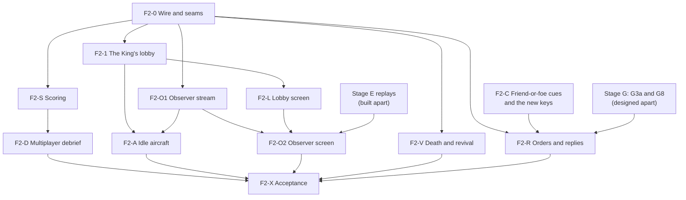

**What runs at once.** F2-0 and F2-C start together. Once F2-0 lands, F2-1,
F2-S, F2-V, F2-O1 and F2-R run in parallel (four Opus and one Sonnet): each
owns its own host module and test file, and the mission core's files split as
the table says. Their shared edges are small: `world.rs` (F2-S's call and
F2-V's fields), the client's `mod.rs` (event handling), `net/play.rs` (F2-S's
board, F2-V's prompt, later F2-A) and `tore-bot`'s options; each keeps those
diffs short and the later merge rebases. Then F2-L, F2-D and F2-A run together,
and F2-O2 last, once stage E's replays have merged.

**Beside stage G.** Stage G's slices edit some of the same files: G3a and G8
`world/commands.rs` (F2-0 adds one match arm there), G8 `comms.rs` and
`radio_calls.rs` (F2-R's), G3c and G8 the controls list and
`input_catalog.rs` (F2-C's), G6 `main.rs` and `weapon_hud.rs` (F2-C's X) and
G7 the wire (F2-0's). F2-R follows G3a and G8, since its order call extends
G's; for the others, whichever lands second rebases on the first, and the two
wire slices take the protocol versions the lead hands out in merge order. The
same holds beside stages I and J: J6 adds each player's connection path to
the lobby state and the lobby screen (F2-0's and F2-L's files), and stage I's
listing is driven by this design's `visibility` setting.

##### Questions for John

The design builds as written with these recommendations; each is John's to
change.

1. **Respawn rules.** The guide's "back at a base" becomes retail's revival:
   a new aircraft of the same type at the revival distance from the battle,
   airborne, with the revival weapons; beside it `ai-slot` (take a free AI
   aircraft of one's side) and `none`. A player whose plane was lost can no
   longer press Join for a free plane outside these rules. *Recommended.*
2. **Single player gains three retail features:** U answers IFF ("IFF:
   Friendly") instead of "IFF unavailable", Show Target Info (Pref row and
   Ctrl+T, off by default) works, and the reply keys say "You lead this
   flight." *Recommended: all three*; otherwise they are limited to networked
   flights.
3. **PvP defaults:** revival with unlimited lives, no delay, 10 nm, with
   missiles; by sides, total kills, kill limit 5 by one side, time limit 10
   minutes, sides locked. Co-op: no revival, no limits, friendly fire on.
   *Recommended as tabled.*
4. **The AI flies an idle aircraft** after 10 seconds away (menu, focus, a
   lost controller, a stall), in co-op and PvP, as the King's setting with
   `never` available. *Recommended.*
5. **A dedicated server's King:** none by default (today's behaviour); a
   server's configuration may give the crown to the first player
   (`king first-player`) and may lock its mission. *Recommended.*
6. **Realism is fixed for the flight:** the King sets the mission's cheats in
   the lobby; nobody's Cheat menu changes them in flight, which keeps every
   client's prediction exact. This replaces the guide's gap-fill that gave the
   King the Cheat menu in flight. *Recommended.*
7. **Keys:** replies on Alt+Shift+E (Engaging), Alt+Shift+W (Winchester),
   Alt+Shift+B (Bingo fuel) and Alt+Shift+H (Need help); the score board on K;
   U and Ctrl+T as retail; Enter flies again after a loss, as retail.
   *Recommended.*

## Master server and connectivity

Design for stages I and J of the [multiplayer plan](multiplayer-plan.md#stages),
taken together because a public list of games helps only hosts with an open
port until players can also reach each other through their routers. Written
by a design agent for the lead on 2026-10-05 from a survey of the
`multiplayer` branch at `884f9916`; not built, not yet reviewed by John.
Every choice is an *agent proposal* unless it is credited to John; John's
questions are collected by the lead. The specs that go with it:

- the master's wire: [master-protocol.md](formats/master-protocol.md);
- what the game's own transport adds: [net-protocol.md, through the master](formats/net-protocol.md#through-the-master-stages-i-and-j);
- running the master: [MASTER-SERVER.md](MASTER-SERVER.md);
- what players see and what is reported: the guide's
  [master server](MULTIPLAYER.md#master-server),
  [connection path](MULTIPLAYER.md#connection-path) and
  [telemetry](MULTIPLAYER.md#replay-and-telemetry).

In short:

- A new program, **`tore-master`**, standard library only, keeps the list of
  listed games, answers the game's **Internet Lobby** screen, introduces a
  joining player to a host, measures how each router maps the game port,
  relays the traffic of a pair that cannot reach each other, and counts
  anonymous telemetry. It runs as a systemd service on one small Linux
  machine (John, 2026-09-28: a Linode shared 2 GB plan, 1 TB a month).
- A host talks to the master **from its game port**, and a joining player
  from the socket it joins with, so the master learns the outside address of
  the very socket the game uses. A small router in front of the transport,
  `tore_net::master::Rendezvous`, takes the master's datagrams out of the
  game port's stream and wraps relayed traffic; the transport, the session
  and the game's screens are unchanged by it.
- A joining player tries every address it is given for the host at once
  (local, mapped, IPv6, as the master saw it), while the host punches back.
  After 3 seconds without an answer it asks the master for the relay, through
  which the same handshake and session run.
- A hosting game asks its router to forward the game port (UPnP, NAT-PMP or
  PCP), so most hosts are reachable without any of the rest.
- Direct Connection does not change: it never talks to the master.
- Single player does not change.

### Surveys behind the design

A read-only survey of the code at `884f9916`, line numbers indicative:

- **The transport knows a peer by its address.** `tore_net::Server` keeps
  its connections in `entries: BTreeMap<SocketAddr, Entry>` (`server.rs`)
  and its cookies and rate limits key on the address too. Every relayed
  player would arrive from the master's one address, so a relayed player
  needs an address of its own: the in-process link already solved this with
  a reserved address no UDP sender can have, `LINK_ADDRESS` (`link.rs`).
- **Everything reads through one trait.** `Host::receive_from`,
  `Client::receive_from` and the transport's own helpers take
  `&mut impl Datagrams` (`datagram.rs`), and the hosting game already wraps
  its socket in a decorator, `Linked<ServerSocket>` (`link.rs`), which reads
  the link first and drops datagrams that claim the link's address. A router
  for the master's datagrams and the relay is one more decorator of the same
  kind.
- **The host's port is dual-stack.** `ServerSocket::bind(Listen::Any, port)`
  (`socket.rs`) gives one IPv6 socket that takes IPv4 on Linux and macOS and
  two on Windows, on one port. The dedicated server holds one in
  `crates/tore-server/src/wiring.rs`; the hosting game's thread
  (`crates/tore-app/src/net/hosting.rs`, `serve`) holds a
  `Linked<ServerSocket>`. Both loops are receive, update, transmit, wait.
- **A joining game binds one family.** `Join::to` (`net/session.rs`) binds
  `0.0.0.0:0` or `[::]:0` by the server's family; `reach::probe` uses a
  socket of its own; `net::lookup::Lookup` tries a name's addresses one after
  another, three seconds each. An introduction must try several addresses of
  both families at once, from the socket the session then uses.
- **The summary exists.** `Host::discover_answer` (`tore-session`'s
  `host/discover.rs`) builds the game's name, mission, players, King,
  capacity, password flag and phase for discovery, and
  `DiscoverAnswer::fit` (`tore-net`'s `packet.rs`) cuts it to a length. A
  listing is the same facts.
- **The keepalive thread sends a ready datagram.** `Keepalive::start`
  (`keepalive.rs`) takes a clone of the game's socket, the host's address and
  the bytes to send; a relayed game gives it a socket wrapper that frames
  for the relay instead.
- **The simulator routes by address only.** `sim::SimNetwork` (`sim.rs`)
  delivers a datagram to the inbox bound at its destination; there is no
  translation, so routers must be added to it.
- **The screen is a stub.** The Multi menu's second row, *Internet Lobby...*,
  answers "coming soon" (`menu.rs`, the toast branch for bar 2). The Direct
  Connection screen (`direct_screen/`), its search loop (`net/search.rs`,
  `Search`, `GameList`, `Compat`), the widget kit (`widgets/`) and the title
  bar with a player's own lettering (`widgets/header.rs`) are all reusable.
- **No interface list.** The standard library cannot list a machine's
  addresses. EF5 found its own network address by pointing an unconnected UDP
  socket at a far address and reading the address the system chose
  (`net/search.rs`, `own_network_address`); the same works for IPv6.
- **No HTTP.** UPnP needs HTTP/1.1 and XML over TCP. `std::net::TcpStream`
  with bounded reads is enough for the few requests a router answers.

### Crates and modules

One new crate. Everything is standard library only; no new dependency.

| Where | Kind | Holds | Depends on |
| --- | --- | --- | --- |
| `tore-master` (new) | binary, with a library for its tests | The master: `Master`, a state machine that, like the transport, never reads a clock or touches a socket; its listings, browse, probes, introductions, relay and telemetry; the configuration, the run loop on two UDP ports, logs, statistics and the `flood` load tool | tore-net, tore-codec |
| `tore-net`, module `master` (new) | library | The master's packets (`packet.rs`), addresses and candidates (`candidate.rs`), the `Rendezvous` and its router (`rendezvous.rs`, `routed.rs`), the game's own addresses (`local.rs`), a host's side of introductions and relays (`meet.rs`, `relay.rs`), a player's side (`join.rs`) and the browse client (`browse.rs`) | tore-codec |
| `tore-net`, module `portmap` (new) | library | UPnP (SSDP and IGD over HTTP), NAT-PMP and PCP; blocking, for a thread of its own | std only |
| `tore-net`, module `sim` | library | Gains routers (`sim/nat.rs`): address translation, filtering, nesting, IPv6 firewalls, static forwards | |
| `tore-net`, the transport | library | The Punch packet, `Client::connect_any`, `Server::punch`, the path in the Challenge answer | |
| `tore-session` | library | The next protocol versions; the lobby's player list carries the path; the bot joins through the master | |
| `tore-server` | binary | Settings `broadcast` (John's name for the design's `list`), `master`, `telemetry`, `port-mapping`; the console's `broadcast on` and `broadcast off` | |
| `tore-app` | binary | The Internet Lobby screen (`internet_screen/`), its browse loop (`net/browse.rs`), telemetry (`net/telemetry.rs`), the hosting thread's rendezvous and port mapping, the joined session's rendezvous | |

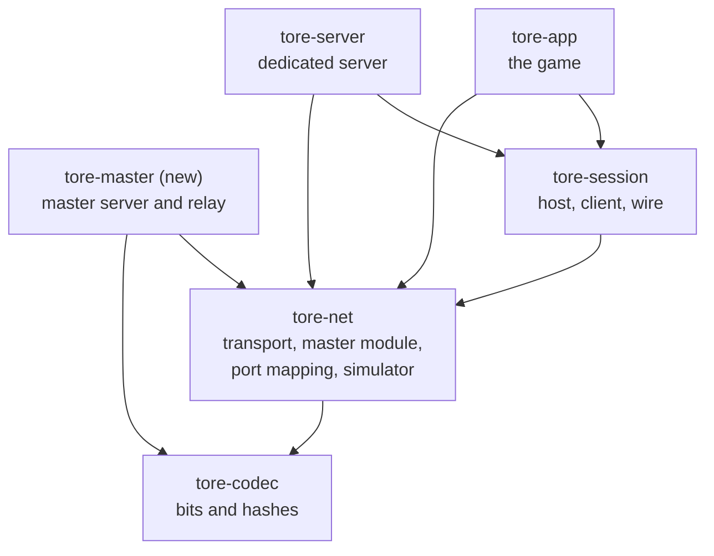

`tore-master` depends on nothing of the game's simulation or data: it never
reads the import, so the machine that runs it needs no copy of Fighters
Anthology, and nothing derived from retail media ever reaches it.

### The master

`tore-master` is one process on one thread. Its loop reads at most 1,024
datagrams from each of its two ports, hands each to `Master::receive(now,
port, from, bytes)`, calls `Master::update(now)` for its timers (expiry,
retries, relay idle, statistics), sends what `Master::poll_transmit` gives,
and sleeps a millisecond when there was nothing to do (agent decision: a
portable loop, measured in I2; a relay frame waits at most that long). Its
two ports are `ServerSocket`s on `Listen::Any`, so it serves IPv4 and IPv6 on
each.

| Module | Holds |
| --- | --- |
| `master.rs` | `Master`: the dispatch of every packet kind, the cookie key, the queue out |
| `listings.rs` | Listings by id and by token, their summaries, sources, expiry; the page order |
| `limits.rs` | Token buckets per source (an IPv4 address or an IPv6 /64) and in all, the table of sources with its bound, the answer-size rule |
| `browse.rs` | Browse pages and details |
| `probe.rs` | Probe answers on both ports |
| `introduce.rs` | Introductions, Meets and their retries, hints |
| `relay.rs` | Channels, keys, rates, idle, the monthly allowance and its file |
| `telemetry.rs` | Reports into daily counts, with a salt for distinct installs that is drawn each day and never written down |
| `stats.rs`, `log.rs` | A status line every minute and a daily table of counts ([operations](MASTER-SERVER.md#logs-and-statistics)) |
| `config.rs` | The configuration file, refused line by line as the server's is |
| `run.rs`, `main.rs` | The real loop, `--config`, `--check-config`, `flood` |
| `flood.rs` | `tore-master flood TARGET SECONDS`: a load tool that sends every kind of request from many source ports and reports what came back, so an operator can see the limits hold |

Bounds: at most 2,000 listings, 65,536 remembered sources, 64 relay
channels, a few thousand introductions under way (each forgotten after 30
seconds). With every table full it holds a few tens of megabytes.

**Built (I2, 2026-10-05)** as above, with these agent decisions:

- **The limits are generic cell rate buckets** (`limits.rs`): each keeps the
  time at which it is empty again, in integer time, so the same requests
  give the same answers on every system. A source is an IPv4 address or an
  IPv6 /64. Over a limit the request is dropped; the log says so once a
  minute per source.
- **The total answer rate drops the busiest first.** Every answer is
  charged to `answer-rate` (5,000 a second, a second's burst). Once half of
  it is spent, only a *quiet* source, one that has used at most half its own
  burst, is answered, so a flood is dropped before a player who asks now and
  then. That is how the design's "oldest source first" reads in the build.
- **Every answer is fitted to its request and never longer**, whoever sent
  it, not only to unproven senders (`Master::answer_in` encodes within the
  request's length). Unsupported, Unknown listing and the answers to Browse
  and Details share the source's browse bucket.
- **Heartbeats and Keeps share one bucket per listing**: one every 2
  seconds with bursts of 2, so a Heartbeat and a Keep falling due together
  both count. Unregister needs only the token and is never answered.
- **The host's mapping type comes from its probes.** Register carries no
  mapping type, but the Page's relay mark (and J2's hint) needs one, so the
  master pairs the two Probes of one test by their nonce and the sender's IP
  address, and keeps the verdict for 15 minutes under the address its main
  port saw (`probe.rs`). A game sends the same nonce to both ports (the
  [mapping test](formats/master-protocol.md#mapping-test)), and the second
  probe to the main port + 1. Seeing the host at one of its own Local or
  Global IPv6 candidates means no translation.
- **The browse cursor is an offset** into the sorted matches (at most 200);
  a list that changes between pages can repeat or skip a game until the
  next refresh. The browse client (`tore_net::master::browse::Browser`)
  drops repeats when it puts the pages together.
- **The console and the stop.** `status`, `listings` and `quit` on standard
  input; Ctrl+C and SIGTERM end the process at once, since catching a
  signal needs unsafe code. The telemetry file and the minute table are
  written every minute ([operations](MASTER-SERVER.md#running-it)).
- **The flood tool's second source.** On loopback it asks for the list from
  127.0.0.2, a second source to the master; against a master elsewhere that
  check is skipped ([the flood tool](MASTER-SERVER.md#the-flood-tool)).
- **The idle loop** costs 0.7 percent of one core in a debug build on the
  development machine (10 idle seconds, `/proc` CPU ticks), so the
  millisecond sleep stays.
- `tore-master` depends on `tore-net` only; `tore-codec` comes through it.
  `log.rs` holds the state folder's files and their UTC dates; `stats.rs`
  the status line and the minute table; `introduce.rs` and `relay.rs`
  count and drop their packets until J2 and J3.

### One socket, two protocols

A host's game port carries its players' traffic and the master's; a joining
player's socket carries the host's and the master's. The game keeps one
`Rendezvous` per socket that talks to the master, and reads and writes the
socket through it:

```rust
// tore_net::master (sketch; names are proposals)
pub struct Rendezvous { /* role, master addresses, listing or introduction, channels */ }

impl Rendezvous {
    pub fn host(config: HostRendezvous, now: Duration) -> Self;
    pub fn joiner(config: JoinRendezvous, now: Duration) -> Self;
    /// The socket as the transport should see it, for one receive or transmit.
    pub fn over<'a, D: Datagrams>(&'a mut self, socket: &'a mut D, now: Duration) -> Routed<'a, D>;
    /// Timers: heartbeats, keeps, retries, the race, relay idle.
    pub fn update(&mut self, now: Duration);
    /// The master's datagrams this side wants to send.
    pub fn transmit<D: Datagrams>(&mut self, socket: &mut D) -> io::Result<()>;
    pub fn poll_event(&mut self) -> Option<RendezvousEvent>;
    // A host's: set_summary, set_mapped, set_listed, report.
    // A player's: candidates, choose_relay, path.
}
```

What `Routed` does:

| Datagram | Goes to |
| --- | --- |
| Received from one of the master's addresses (either port, either family), not a Relay frame | The rendezvous, never the transport |
| Received from the master, a Relay frame of an open channel | The transport, as a datagram from the channel's relayed address ([net-protocol](formats/net-protocol.md#relayed-addresses)) |
| Received from a real socket claiming an address in `100::/64` | Dropped and counted, as `Linked` drops a claim of `LINK_ADDRESS` |
| Anything else received | The transport, unchanged |
| Sent by the transport to a relayed address | A Relay frame to the master |
| Sent by the transport to anything else | The socket, unchanged |

The hosting game's thread reads `Linked<ServerSocket>` through it, so the
link is still read first and a flood on the socket never holds back the
local player. Both host loops change by a line each:

```rust
host.receive_from(now, &mut rendezvous.over(&mut transport, now))?;
host.update(now);
rendezvous.set_summary_if_changed(|| host.discover_answer(0));
rendezvous.update(now);
host.transmit(&mut rendezvous.over(&mut transport, now))?;
rendezvous.transmit(&mut transport)?;
```

The master's address is looked up by name on a thread (the master may have
both an A and an AAAA record), again every 10 minutes and after the master
falls silent; until it is known the rendezvous sends nothing.

### Addresses and candidates

What each end tells the master about itself ([candidates](formats/master-protocol.md#common-fields)):

- **Local:** its own IPv4 address on the network that leads to the master,
  found by pointing an unconnected UDP socket at the master's IPv4 address
  and reading the address the system chose (no packet is sent), as
  `own_network_address` does toward a documentation address today. With the
  game port for a host, the socket's port for a player.
- **Global IPv6:** the same toward the master's IPv6 address, kept when it is
  in `2000::/3`. Taken this way it is the address the system will also send
  from, which matters when the system uses temporary privacy addresses: a
  host's firewall opens for the address it sends from.
- **Mapped:** the outside address a router's port mapping gave
  ([port mapping](#port-mapping)).
- **Seen:** the master fills in where it saw the packet come from.

A joining player's socket is a `ServerSocket::bind(Listen::Any, 0)` (stage J,
agent decision): one port, both families on every system, so its IPv4 and
IPv6 candidates and its Connect requests all leave from the same port.

### Listing a game

A host lists when it is told to: the Internet Lobby's **New** (stage I), a
dedicated server with `broadcast on` (John, 2026-10-05, off by default), `tore-app --host FILE --list`, and later the
King's Visibility setting (stage F phase 2: *public* lists, *private* does
not, *password* lists with the lock). The hosting thread takes
`Command::SetListed(bool)` so the lobby can change it while the game runs.

1. The rendezvous looks up the master and runs the
   [mapping test](formats/master-protocol.md#mapping-test).
2. It registers, answers the Challenge, and is Listed: the game reads
   "Listed on the Internet Lobby as 'Friday night'." and, for a host whose
   port is reachable, the address the master saw.
3. Every 30 seconds a Heartbeat carries `Host::discover_answer`, and 5
   seconds after a lobby change one more, at most one every 5 seconds; every
   15 seconds a Keep holds the router's mapping open.
4. An Unknown listing (the master restarted) means register again at once.
   No answer to anything for 10 seconds means the master is silent: the game
   reads "The Internet Lobby does not answer, so the game is not listed.
   Players can still join by address." and tries again after 2, 4, 8 and up
   to 60 seconds.
5. Stopping, or unlisting, sends Unregister three times.

The rendezvous reports to the hosting thread, which passes it to the game as
`Report::Listing(state)` (listed with the seen address, unlisted with why,
master silent) and to its log; `tore-server` prints it on its start and
status lines and in its log.

### The Internet Lobby screen

*Internet Lobby...* on the Multi menu opens it. It is the Direct Connection
screen's sibling: the same `NETIPX3` background, panel, widgets and
rectangles, with the title bar's lettering reading INTERNET LOBBY (a shipped
`assets/internet-lobby-title.png`, made the way the Direct Connection
lettering is, or the player's own `InternetLobby.png` in the data folder).

| Element | What it does |
| --- | --- |
| Callsign | Shared with Direct Connection |
| Games | The listings, paged with PREV/NEXT and "PAGE n of m": the lock, the name, players over capacity, *Lobby*, *Flying* or *Closed*, and a small relay mark when the master expects the relay; another build dimmed with its version, not joinable |
| Players | The selected game's players, with the King's crown, from its details |
| Mission line | The selected game's mission summary |
| Show full games, Show other versions | Check boxes; the first is shared with Direct Connection |
| Messages | What the screen is doing: asking, how many games, the join's steps, refusals |
| New | Host a listed game from the Quick Mission creator's mission, as Direct Connection's New does, and open the lobby |
| Join | Join the selected game ([joining through the master](#joining-through-the-master)) |
| Refresh | Ask for the list again now |
| Options | Port, password, game name (shared with Direct Connection), the master's address, "Forward the game port on my router" and "Send anonymous statistics" |
| Cancel | Back to Choose Activity |

- The list is asked for when the screen opens and every 15 seconds while it
  is open; the selected game's details every 5 seconds. Asking is a
  `net::browse::Browse` like the search's `Search`: a socket of its own, the
  `tore_net::master::Browser` state machine, `update(now)` every frame,
  events for added, changed and dropped games. It never blocks a frame.
- The first time the screen opens it writes one line about telemetry in
  Messages: "This game sends anonymous statistics to the Internet Lobby. Turn
  them off in Options." (if John keeps telemetry on by default).
- When the master cannot be reached the list stays empty and Messages says
  so; Direct Connection still works.
- `tore-app --browse SECONDS [--master ADDRESS]` lists the games headlessly,
  as `--find-games` does for the local network.
- Snapshot states for the menus lane: `internet`, `internet-games`,
  `internet-joining`, `internet-options`, `internet-unreachable`.

In stage I, Join goes straight to the address the master saw for the host
(a game whose host has an open or mapped port works); stage J's slice J5
replaces it with the introduction.

### Joining through the master

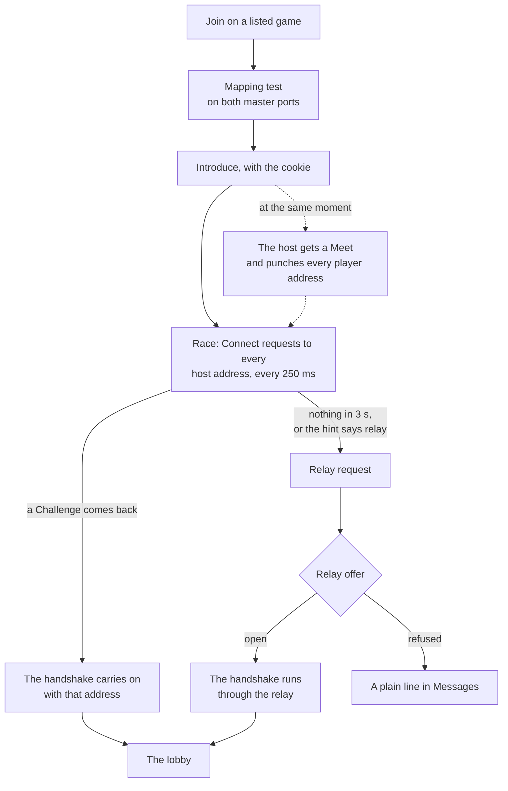

- The joined session's transport becomes `Transport::Internet`: the
  dual-stack socket and a joiner `Rendezvous`. `tore_session::Client` is
  started with every candidate through `Client::connect_any`
  ([net-protocol](formats/net-protocol.md#joining-from-several-addresses-at-once)).
- Messages, one line per step: "Asking the Internet Lobby to introduce you
  to 'Friday night'...", "Trying 3 addresses...", "Connected directly (IPv6)."
  or "No direct path; asking for the relay...", "Connected through the
  relay.", or the refusal's own text.
- The whole join gives up after 15 seconds, the relay's three included.
- `tore-bot --master ADDRESS --listing NAME [--path auto|direct|relay]` joins
  the same way headlessly; `--path relay` asks for the relay at once (for
  tests on one machine, where every direct path works).

### Hole punching

On a Meet the host's rendezvous asks the transport to send a
[Punch](formats/net-protocol.md#punch) (`Server::punch(to, introduction)`) to
each of the player's candidates, five times 200 ms apart, and acknowledges
the Meet. At most 10 Meets a second are acted on. Leaving the host's router,
the punches open its mapping for the player's addresses; leaving the
player's router, the Connect requests open its mapping for the host's. Which
pairs of routers can meet this way, in the terms of RFC 4787 (how a router
maps a socket's outside port, and which senders it lets in), is what the J2
tests assert on the [simulator](#the-nat-simulator):

| Host's router | Player's router | Expected path |
| --- | --- | --- |
| None, or a forwarded or mapped port | Any | Punched (or mapped) |
| One port for every destination, any filtering | One port for every destination, any filtering | Punched |
| One port for every destination, filtering by address only, or none | A new port for each destination | Punched: the host's punches open its router to the player's address, whatever port the player's router chose |
| One port for every destination, filtering by address and port | A new port for each destination | Relay |
| A new port for each destination | One port for every destination, filtering by address only, or none | Punched: the player learns the host's new port from its punch |
| A new port for each destination | One port for every destination, filtering by address and port | Relay |
| A new port for each destination | A new port for each destination | Relay, at once by the hint |
| Two routers, each one port for every destination | Any row above that punches | Punched |
| The same router as the player (both at home) | | Local: the local address answers first |
| A carrier's router that maps per destination, and no IPv6 | A router filtering by address and port | Relay |
| No NAT, IPv6 with a stateful firewall | No NAT, IPv6 with a stateful firewall | IPv6, punched through both firewalls |

### The relay

When the player asks, the master opens a channel, the host acknowledges it,
and the player gets the channel and its key. From then on:

- The player's transport sends to the channel's relayed address; `Routed`
  wraps each datagram in a Relay frame to the master; the master checks the
  key and the sender and forwards the frame to the host; the host's `Routed`
  unwraps it into a datagram from the same relayed address. The way back is
  the same.
- The player's keepalive thread (EF-K) gets a socket clone wrapped so that
  its Keepalive goes out as a frame (`ServerSocket::try_clone`, new, and a
  framing `Datagrams` wrapper in `master/relay.rs`).
- When the game connection ends, each end closes the channel; the master
  closes channels idle for 30 seconds, over their rate, or when the month's
  allowance is spent ([channel rules](formats/master-protocol.md#relay)).
- A relayed player's round trip is the player to the master to the host:
  where the master is matters, which is a question for John (the region).
- Cost, from the [plan's budget](multiplayer-plan.md#bandwidth-budget): about
  13 KB/s down and 2.6 KB/s up for a player in a full mission, about 60 MB
  an hour leaving the master, so 800 GB a month is about 13,000 relayed
  player-hours.

### Port mapping

`tore_net::portmap::PortMapper` asks the router to forward the game port. It
blocks, for at most 5 seconds in all, so the hosting game runs it on a thread
of its own; the dedicated server runs it on start when `port-mapping on`.
*Built (J4):* the library, standard library only; the hosts' use of it is
slice J4b.

- **Three protocols at once.** UPnP: an SSDP search (`M-SEARCH` to
  239.255.255.250:1900 for an InternetGatewayDevice, 2 seconds), the
  device's description over HTTP, then `GetExternalIPAddress` and
  `AddPortMapping` (UDP, the same outside port as the game port, a one-hour
  lease, or a lease of 0 for an old device that refuses others; on a
  conflict the next four ports are tried) on its `WANIPConnection` or
  `WANPPPConnection` service. NAT-PMP (RFC 6886) and PCP (RFC 6887) to the
  gateway on UDP 5351: PCP's MAP first, NAT-PMP when the gateway answers that
  it does not speak PCP. The first to succeed is used.
- **As built (J4, agent decisions).** UPnP and PCP each run on a scoped
  thread. The first to map claims the result; the other stops within 50 ms
  (every wait looks at a shared flag that often), and if it had mapped the
  port in the same instant it removes its own mapping, within one more
  second. The search asks for both IGD versions with `MX: 1` and is sent
  again once after a second without an answer. A device's description must
  come from the address that answered the search, and its control addresses
  must stay on that host, so an answer on the local network cannot send the
  game to another machine. `WANIPConnection` of the highest version is tried
  first, then `WANPPPConnection`. PCP and NAT-PMP repeat a request after
  250 ms, 500 ms, 1 s and 2 s. A PCP answer counts only from the gateway's
  address and port with the request's nonce, protocol and inside port.
  Every error reads as one line for the player; when every protocol fails,
  the most telling is kept (a second router, then taken ports, no outside
  address, a refusal, silence).
- **The gateway's address.** On Linux the default route in
  `/proc/net/route`, on Windows `route print`, on macOS and the BSDs `route
  -n get default` (each command read with `std::process::Command` and given
  a second), else the address that answered the SSDP search, else the local
  address with its last byte 1. *Corrected by J4 (agent decision):* the
  design put the SSDP answer first, but both RFCs send to the default
  router, which the system knows without waiting for the search, so PCP
  starts at once.
- **Behind a second router.** An outside address that is itself private or
  in the carriers' 100.64/10 means the mapping is on an inner router: it is
  removed, and the game says "Your router is behind another one, so the
  port could not be opened to the internet." UPnP and NAT-PMP ask for the
  outside address before mapping, so they map nothing then; PCP learns it
  in the mapping's answer and removes the mapping (agent decision). An
  outside address of 0.0.0.0, loopback or link-local means the router is not
  connected: "Your router has no internet address, so the port could not be
  opened."
- **IPv6.** PCP's MAP for the host's global IPv6 address opens the router's
  IPv6 firewall where the router allows it. UPnP's IPv6 firewall control is
  not tried. The IPv6 router comes from `/proc/net/ipv6_route` (with the
  interface's index for a link-local router), `route print -6` or `route -n
  get -inet6 default`; the request is asked alongside the IPv4 ones and
  reported apart from them.
- **Renewing and removing.** Renewed at half the lease; removed when hosting
  stops. A game that dies leaves a mapping that lapses within the hour.
  `PortMapper::renew` asks again by the protocol that made the mapping, and
  from the start for one that fails, within the same 5 seconds;
  `PortMapper::remove` takes at most 2 seconds. A mapper keeps one PCP nonce
  for its life, since a gateway refuses a known mapping asked for with
  another nonce until it lapses. Nothing is removed when a mapper is
  dropped (agent decisions).
- **Bounded.** HTTP bodies at most 64 KB and heads 16 KB, chunked bodies
  read, a minimal reader for the XML elements it needs (at most 20,000
  events, 64 deep), every read with a timeout; the parsers are fuzzed.
  Addresses in a router's answers must be literal: no name is looked up.
- **What the player sees.** In the lobby's Messages: "Your router forwards
  UDP port 26900 (UPnP). Friends can join at 203.0.113.5:26900.", or why not.
  The address is the game's Mapped candidate. Both lines are the
  `Display` of `Mapping` and `MapError`; `MapReport::telemetry` gives the
  report's port mapping value.
- **Tested against fakes.** `tore_net::portmap::fake` holds a UPnP device
  with its SSDP responder (`FakeUpnp`) and a PCP and NAT-PMP gateway
  (`FakeGateway`) on loopback, public as the simulator is, for the J4b
  tests. Every test points every target at them; none asks a real router.
- **Settings.** The game: "Forward the game port on my router" in both
  screens' Options, on by default (a question for John); it applies to every
  game the player hosts, from either screen, since a friend joining a Direct
  Connection game by address needs it as much. `tore-server`: `port-mapping`,
  off by default, since a server's port is normally forwarded by its owner.
  `tore-app --map-port SECONDS` maps, prints the result, waits and removes
  the mapping.

### The connection path, shown and reported

Every player's game knows how it reached the host
([path codes](formats/net-protocol.md#the-path-in-the-challenge-answer)):
local network, by address, mapped port, IPv6, punched, relay.

- **Shown:** the join's last line in Messages names it; the lobby's player
  list draws a small mark beside the platform mark for a relayed player and
  shows the path in the selected player's line (stage J's last slice, with
  the lobby state's next protocol version); the net diagnostics log's
  `connect` line gains the path.
- **Reported:** in the player's telemetry report, and the host's report
  counts its players by path. `tore-server`'s per-player log lines name it.
- **Used:** stage K's host selection never calculates a relayed host, and
  scores how open each candidate's router is from its mapping type and
  mapped port.

### Telemetry

What is sent, when, and the switch are in the guide's
[replay and telemetry](MULTIPLAYER.md#replay-and-telemetry); the bytes are
the master's [Report](formats/master-protocol.md#reports). The code:

- **The install id.** A random 64-bit number the game draws the first time it
  sends anything with telemetry on, kept in `network-v1.conf` as
  `install-id`. Turning telemetry off deletes it; turning it on again draws a
  new one, so the old and new cannot be linked. A dedicated server keeps its
  own in its data folder.
- **What sends.** Only games that use the master: a game hosting or joining
  through the Internet Lobby, and a listed dedicated server. Direct
  Connection never contacts the master.
- **The game:** `net/telemetry.rs` builds the player's or host's report from
  the session (length, most humans, path, time to connect, mapping results,
  relayed bytes) and sends it on the session's socket as it closes.
- **The master** turns reports into daily counts and never stores an
  address with them ([operations](MASTER-SERVER.md#what-the-master-keeps)).

### The NAT simulator

`tore_net::sim` gains routers (`sim/nat.rs`), so every path above is tested
in-process, deterministically, on the virtual clock. **Built (J1).**

- `SimNetwork::add_router(RouterConfig) -> RouterId`: the router's outside
  address, the inside addresses (a `Prefix`), how it maps (`Mapping`: one
  outside port for every destination; one per destination address; one per
  destination address and port), how it filters (`Filtering`: anyone; only
  addresses it has sent to; only addresses and ports it has sent to), how it
  picks outside ports (`PortChoice`: keep the inside port when free, the next
  free one, or seeded random), how long an idle mapping lasts (refreshed by
  outgoing traffic only), whether it loops back a datagram for its own
  outside address (hairpinning), and static forwards (a mapped or
  hand-forwarded port). The names are RFC 4787's.
- A router's outside address may be inside another router: a home router
  behind a carrier's (CGNAT) or behind a second home router.
- An IPv6 firewall is a router that translates nothing and filters by what
  was sent out (`RouterConfig::firewall`, an outside address of `None`).
- Each datagram is translated on its way out and on its way in, and the
  link's latency and loss apply as before; drops are counted per router and
  cause (`SimNetwork::router_stats`: no mapping, filtered, expired, and no
  hairpinning).
- Every existing use of the simulator, with no router added, behaves exactly
  as before: a test pins the received datagrams, the trace and the link
  counts of a lossy, reordering, duplicating run to the values the code
  before J1 gave.

What the build settled (each an agent decision):

- **When a router decides.** The routers on the sender's side translate a
  datagram as it is sent; the routers on the receiver's side check their
  mappings and filters when it arrives, with the state they have at that
  moment. So two ends punching toward each other at the same moment both
  get through, as on real routers, and a punch that arrives before the other
  end has sent is dropped. The network takes arrivals in through routers
  lazily, before anything sends or reads, each at its own arrival time.
  Routers on one path add no delay of their own; the link between the two
  sockets carries the whole latency.
- **Links across routers** are still keyed by the sending socket's own
  address and the address it sent to (for a datagram to a router, its
  outside address), so `set_default_link` covers every path and
  `set_link` can still single one out.
- **Where a socket or router stands.** `bind` places an address behind the
  router whose inside prefix holds it most narrowly, else on the open
  network. Two homes on the same `192.168.1.0/24` behind one carrier are
  told apart with `RouterConfig::behind` and `SimNetwork::bind_behind`.
  Sockets on one side of a router reach each other without it. Routers are
  added before the sockets behind them; a router that would take in an
  address already bound, an outside address another router or a socket has,
  or a forward to an address outside it is refused.
- **Mappings and ports.** Outside ports are 1,024 and up; a mapping's port is
  never shared, nor a forwarded one handed out. Keeping the inside port
  falls back to the next free one above it. Random ports come from a
  generator seeded by the network's seed and the router's number, so they
  change nothing else a seed decides.
- **Forwards** let anyone in, never expire, and carry the inside socket's own
  traffic out from the forwarded port, as routers with a port mapping do. A
  firewall's forward opens the inside address itself.
- **Hairpinning** loops a datagram back from the sender's outside address,
  through the filter like any other arrival; it is on by default, as RFC
  4787 asks. `RouterConfig::nat` is a typical home router: one outside port
  per socket, the inside port kept, filtering by address and port, two
  minutes idle.
- **Dual-stack sockets.** `SimNetwork::bind_dual(v4, v6)` is one socket at an
  IPv4 and an IPv6 address, as the joining player's dual-stack socket is: it
  sends from the address of the destination's family and receives at both,
  so a race can try both families from one socket.
- **What tests read.** Each trace entry gains `sent_as`, the source after the
  sender's routers (`None` when one dropped it), and
  `SimNetwork::mapped(router, inside, to)` gives a live mapping's outside
  address.

### Testing on one machine

Everything can be run on the development machine without the public master
([operations](MASTER-SERVER.md#testing-on-one-machine)):

- `tore-master --config` with `listen 127.0.0.1`, `port 26911` and
  `probe-port 26912` (other ports than the public ones, so a test never
  collides with a master John runs).
- The game with `--master 127.0.0.1:26911` (or the Options field), a
  `tore-server` with `broadcast on` and `master 127.0.0.1:26911`, and `tore-bot
  --master 127.0.0.1:26911 --listing NAME`.
- On one machine every direct path works, so the relay is tested with
  `--path relay`, and punching through routers only on the simulator.
- Port mapping is tested against a fake router on loopback (an SSDP
  responder and an HTTP device, a NAT-PMP and PCP responder), never the real
  router: mapping a port on John's router is his manual test.
- Rust tests cover the protocol, the master, the rendezvous and the race on
  the simulator; the net lane's `net-master-*` scenarios run the real
  binaries on loopback; the menus lane's `menus-snap-internet*` scenarios
  render the screen.

### How stages I and J land

Slices, each on its own `mp/<topic>` branch and worktree, merged by the lead
with the quick check per change and the check list at merge. "Opus" slices
are networking, concurrency or risky refactors, as John asked; the rest are
Sonnet. Each slice adds its tests to the full suite: Rust tests in the
crates it touches, and a battery scenario for anything done through a binary
(the net lane's `net-master-*`, the menus lane's `menus-snap-internet*`),
with slow tests ignored and named for the full run. Network scenarios are
drivers appended to `tools/battery_scenarios/net.py`, each in a family in
`tools/battery_selection.py`, and ignored Rust tests join the "Network tests
outside the battery" table in `docs/testing/README.md` (the net lane's
rules); slices that run at the same time each append there, which the lead
merges. No slice changes single
player; the quick single-player guard is enough for each, and none needs the
full baseline. The game's protocol version rises twice (J2 and J6), the
lead handing out the numbers; the master protocol starts at 1 and does not
change in these stages.

| Slice | Model | After | Owns | Work | Acceptance |
| --- | --- | --- | --- | --- | --- |
| I1 Master wire | Opus | | `tore-net/src/master/{mod,packet,candidate}.rs`, `tore-net/master-golden.txt`, one `pub mod master;` line in `tore-net/src/lib.rs` | Every packet of [master-protocol.md](formats/master-protocol.md): encode, bounded decode, padding, fitting answers to requests; addresses, candidates, mapping types; the summary coded as a discovery answer without its nonce; the constants (ports, version, the default master address as a placeholder until John names it); `CookieKey` made public for the master | Seeded round trips of every kind; 100,000 fuzzed datagrams never panic; the golden file; for every request an unproven sender may make, the largest possible answer is no longer than the request; a summary with every text at its limit and 30 callsigns fits Register, Heartbeat and Listing details, cut and flagged. **Built (I1, 2026-10-05):** `tore_net::master` with `packet.rs` (`MasterPacket`, the 26 kinds, `fit` on Register, Heartbeat, Listing details and Page, `RelayFrame` read in place), `candidate.rs` (addresses, candidates, `MappingType::from_probes`, `relay_likely`) and `mod.rs` (the constants, `DEFAULT_MASTER` as the placeholder `master.invalid:26901`, and `CookieKey`, a wrapper of the transport's cookie hash rather than the transport's type made public, so `entropy.rs` is unchanged); decoding is strict, so every packet has one encoding, and the 100,000-datagram fuzz checks that whatever decodes encodes back to the same bytes; what the build settled is in [the wire as built](formats/master-protocol.md#the-wire-as-built) |
| J1 NAT simulator | Opus | | `tore-net/src/sim.rs` moved to `sim/mod.rs`, new `sim/nat.rs` | [The NAT simulator](#the-nat-simulator) | One test per mapping, filtering and port-choice behaviour; mapping expiry refreshed by outgoing traffic only; hairpinning on and off; a router behind a router; an IPv6 firewall; static forwards; the same seed gives the same trace; every existing test that uses the simulator passes unchanged **Built (J1, 2026-10-05):** the routers as [designed](#the-nat-simulator), deciding arrivals when they arrive; 24 tests in `sim/nat.rs` cover each behaviour named here, a router deciding at arrival, two homes on one prefix behind a carrier, a dual-stack socket, links across routers and refused placements; a pinned fingerprint shows a run with no router gives exactly what the code before J1 gave, and every existing test passes unchanged |
| J4 Port mapping library | Opus | | `tore-net/src/portmap/{mod,ssdp,http,xml,igd,natpmp,pcp,gateway}.rs`, one `pub mod portmap;` line in `tore-net/src/lib.rs` | [Port mapping](#port-mapping): the three protocols at once, the gateway, renewing, removing, the second-router check | Against fakes on loopback: SSDP and the device description (both IGD versions, chunked bodies), `AddPortMapping`, the conflict code and the next port, a device that takes only a lease of 0, `DeletePortMapping`; NAT-PMP and PCP answers, PCP's version refusal falling back to NAT-PMP, nonces checked; a private outside address reported as a second router; every call ends within its time with a silent fake; the HTTP, XML and packet parsers fuzzed. **Built (J4, 2026-10-05):** 52 tests in `portmap`, about 6 seconds: every acceptance item, plus a `WANPPPConnection`, a device that needs equal ports after a conflict, refusals by each protocol, both gateways at once leaving one mapping, a failed renewal mapping again, a search answer naming another host not followed, and PCP for IPv6 on `::1`; the silent fakes end at 5.0 s for `map`, inside the budget for `renew` and `remove`. The fakes are public (`portmap::fake`) for J4b. The gateway is the system's default route first ([corrected](#port-mapping)) |
| I2 Master server | Opus | I1 | The new crate `crates/tore-master/` (every file), `tore-net/src/master/browse.rs`, the workspace `Cargo.toml` member and `Cargo.lock`, a `crates/tore-master/*` rule in `tools/battery_selection.py`, `docs/MASTER-SERVER.md` | [The master](#the-master): proving addresses, listings, heartbeats, keeps, expiry, Unknown listing, unregister, browse pages and details, probes on both ports, reports into daily counts, limits, the status line and daily table, the configuration and `--check-config`, the `flood` tool; the browse client. `introduce.rs` and `relay.rs` exist with their dispatch and drop their packets, counted, until J2 and J3 | On the simulator with a scripted host and browser: no listing without a cookie, and a forged source gets nothing but a 23-byte Challenge; a listing appears in the next Browse; a missing heartbeat drops it at 90 seconds (virtual clock), an Unregister at once; pages list every match once, filtered by build and fullness, in order; under a seeded flood from 1,000 sources the bytes answered to every unproven source are at most the bytes it sent, every limit holds, and a proper browser is still answered; IPv6 sources count by /64. Real sockets on 127.0.0.1: register and browse. Battery: `net-master-flood` (the master and its flood tool for 10 s; the status line shows the limits held and a browse during the flood answered). **Built (I2, 2026-10-05):** the crate as [the master](#the-master) describes, with the decisions listed there; 15 tests on the simulator in `master_tests.rs` (among them the forged Register, the exact 90-second expiry, pages under four filter sets, IPv6 by /64, probes behind an open and a symmetric router, and 1,000 flooding sources with the answer rate set to 1,000 so the total cap binds too), unit tests in each module, a real-socket test in `tests/loopback.rs`, the `Browser` client with its own tests, and `net-master-flood` in the net lane. The master logs `listed`, `moved` and `unlisted` lines ([formats](MASTER-SERVER.md#logs-and-statistics)) |
| I3 Listing from hosts | Opus | I1; its end-to-end commit after I2 | `tore-net/src/master/{rendezvous,routed,local}.rs`, `meet.rs` and `relay.rs` as dispatch stubs, `crates/tore-server/src/{config,wiring,run,console,options}.rs` and its tests, `docs/DEDICATED-SERVER.md`, `crates/tore-app/src/net/{hosting,hosting_tests,options}.rs` | The host's `Rendezvous` and `Routed` ([one socket](#one-socket-two-protocols), [listing](#listing-a-game)): lookup, mapping test, register, heartbeats with the summary, change heartbeats, keeps, register again, back-off, unregister; the install id in Register; the host's or server's Report at the session's end. `tore-server`: `broadcast` (off by default; John named it, the design said `list`), `master`, `telemetry`, the console's `broadcast on` and `broadcast off`, the start and status lines. The game: `HostSetup.listing`, `Command::SetListed`, `Report::Listing`, `--host FILE --list [--master ADDRESS]` | On the simulator against `tore_master::Master` (a dev-dependency): a host is browsable within its first exchange and its summary's changes within 5 seconds; a vanished host is gone within 90 seconds; a master restart is healed within one heartbeat; a silent master is asked with back-off, never more than once a second; game datagrams pass `Routed` unchanged and no master datagram reaches the transport; a claim of `100::/64` from the socket is dropped. A hosting thread with `listing` registers to an in-test master and unregisters on stop. Battery: `net-master-listing` (a master, a `tore-server` with `broadcast on`, `tore-app --browse 5` lists it; quitting the server removes it). **Built (I3, 2026-10-05):** `tore_net::master::{rendezvous,routed,local}` with `HostListing` tying the state machine to the master's lookup on a thread (again every 10 minutes and after a silence) and the host's own addresses; `tore-server`'s `broadcast`, `master`, `telemetry`, the console's `broadcast on` and `broadcast off`, a `Broadcast:` start line and the listing at the end of the status line; the game's `HostThread::start_listed` with a `Listing` beside the `HostSetup` (so the tests' hosts stay unchanged), `Command::SetListed`, `Report::Listing(ListingState)` and `--host FILE --list [--master ADDRESS]`. Agent decisions: the probes and the Register go out together (the listing does not wait for the mapping test); an unanswered request is repeated every 3 seconds until the master is silent, then after 2 to 60 seconds, the master's next address each time; no two Heartbeats or Keeps closer than 2 seconds, and no Keep when a Heartbeat is due within that; a change Heartbeat goes when the summary changes, at most one every 5 seconds, the summary looked at once a second; three Unregisters at once; the master's second port is the main port plus one; a stage I host counts its players' paths as local network or by address from their addresses; a server keeps its install id in `server-install-id` in its data folder, drawn at start while telemetry is on; `--host --list` sends no install id and no Report until I4's notice and switch. Tested on the simulator against a scripted master in `tore-net`, and end to end against the real `tore_master::Master` (a dev-dependency of `tore-server`, `listing_test.rs`: on the simulator with the Internet Lobby's own `Browser`, and a real server on 127.0.0.1); the hosting thread's test uses a small loopback master. `net-master-listing` judges the listing from `tore-master`'s own output until I4 adds `tore-app --browse 5` to it (the lead's call) |
| I4 Internet Lobby screen | Sonnet | I2; New after I3 | `crates/tore-app/src/internet_screen/*`, `net/{browse,telemetry,settings}.rs`, `menu.rs`, `main.rs` (routing, `--browse`, snapshot states), `widgets/header.rs`, `assets/internet-lobby-title.png`, the `internet_screen/*` rule in `tools/battery_selection.py`, the menus lane's `menus-snap-internet*` scenarios, `README.md`'s telemetry section | [The screen](#the-internet-lobby-screen); Join straight to the seen address; New hosting a listed game; Options (the master's address, port forwarding and statistics switches, kept in `network-v1.conf`); the install id; the player's Report | Screen tests (paging, filters, sorting, selection, keys, the shared callsign and port); headless renders of the five snapshot states; `--browse` against a scripted master; a windowed run through `tools/agent-run.sh`: open the Internet Lobby with a loopback master and a listed `tore-server`, join, fly 30 seconds, leave, and New lists a hosted game that a second `--browse` sees |
| J2 Introductions and punching | Opus | I2, I3, J1 | `crates/tore-master/src/introduce.rs`, `tore-net/src/master/{meet,join}.rs`, `tore-net/src/{client,server,packet}.rs`, `tore-session/src/client/` (joining through candidates), `tore-session/src/{bot.rs,bin/tore-bot.rs}`, the protocol version and `wire-golden.txt` | [Joining through the master](#joining-through-the-master) up to the race, and [hole punching](#hole-punching): Introduce with its cookie, Introduction and Meet with retries and hints on the master; Meet, punches and the ack on the host; the player's rendezvous; `Client::connect_any` with candidates learned from punches; the path byte in the Challenge answer and `ConnectDetails::path`; `tore-bot --master --listing --path`. The next protocol version | On the simulator, every row of the [punching table](#hole-punching) gives its expected path, at a 100 ms round trip within 1.5 seconds where it punches; a forged Introduce gets only a Challenge; a host sends at most five punches per address per Meet and acts on at most 10 Meets a second; a Punch with another id is only counted; the wire golden file. Battery: `net-master-introduce` (a master, a listed `tore-server`, `tore-bot --listing` joins through an introduction and flies 30 seconds) |
| J3 Relay | Opus | J2 | `crates/tore-master/src/relay.rs`, `tore-net/src/master/relay.rs`, `tore-net/src/master/routed.rs` (relayed addresses), `tore-net/src/socket.rs` (`try_clone`), the bot's `--path relay` | [The relay](#the-relay): channels, keys, the host's ack, rates, idle, the allowance and its file, closing; relayed addresses; the framing wrapper for the keepalive thread | On the simulator: the two relay rows of the punching table connect through the relay; a host with two relayed bots and one direct flies 60 seconds with the stage D matrix's limits for the direct and relayed bots alike (the relay adds only its delay); a frame from a third address or with a wrong key is dropped; a channel flooded at 200 KB/s passes 64 KB/s; idle channels close at 30 seconds; a spent allowance refuses new channels with its text and survives a master restart; a relayed bot stalled 15 seconds stays connected through its framed keepalives. Battery: `net-master-relay` (`tore-bot --path relay` against a listed `tore-server` through a loopback master, 30 seconds, no drop, the master's status counts the bytes) |
| J4b Port mapping in hosts | Sonnet | J4, I3, I4 | `crates/tore-app/src/net/{hosting,options}.rs`, `direct_screen/options.rs`, `internet_screen/options.rs`, `crates/tore-server/src/{config,wiring}.rs`, `docs/DEDICATED-SERVER.md` | A hosting game's mapper thread, its messages and the Mapped candidate; the switch in both Options panels; `tore-server`'s `port-mapping`; `tore-app --map-port` | Against the loopback fakes: hosting maps the port, shows the address, gives the rendezvous the Mapped candidate and removes the mapping when hosting stops; the switch off maps nothing; a second router is reported. No battery scenario (a real one would change John's router); the manual test is in IJ7 |
| J5 Joining through the master in the game | Opus | J2, I4; its relay commit after J3 | `crates/tore-app/src/net/{session,play}.rs`, `internet_screen/{mod,app}.rs`, a new `net/join_tests.rs` | `Transport::Internet`; Join on a listing runs the mapping test, the introduction, the race and the relay; the Messages lines; the framed keepalive for a relayed session; the path in the net log and the player's report | In-process: a hosting thread with a rendezvous, a master core and a game session joined by listing, once direct and once with `--path relay`, each seated and flying; the Messages lines in order; a refused introduction is a plain line. A windowed run joins a listed `tore-server` through a loopback master with the relay forced |
| J6 Path in the lobby | Sonnet | J5, J3 | `tore-session/src/wire/messages.rs` and `host/lobby.rs` (the player's path in 3 bits), `wire-golden.txt`, `crates/tore-app/src/lobby_screen/*`, `widgets/icons.rs` (the relay mark), `tore-server`'s per-player log lines | [Shown and reported](#the-connection-path-shown-and-reported); the next protocol version | Lobby state round trip with every path; the lobby screen's snapshot with a relayed player; the wire golden file |
| IJ7 Deployment and acceptance | lead, then John | all | `docs/baselines/master-<date>.md`, the default master address | John sets up the master as [the operations guide](MASTER-SERVER.md#deploying-at-jrovertoncom) says; the lead sets the default address and smoke-tests on this machine (a loopback master, a listed hosting game, a bot joining direct and relayed); then John's tests on real networks | The plan's acceptance for I and J: a session hosted on one machine appears in another's browser within one heartbeat and is gone within 90 seconds of its host vanishing; the flood test holds; connections succeed on a home router, through double NAT, over a phone hotspot (CGNAT) through the relay, and directly over IPv6 |

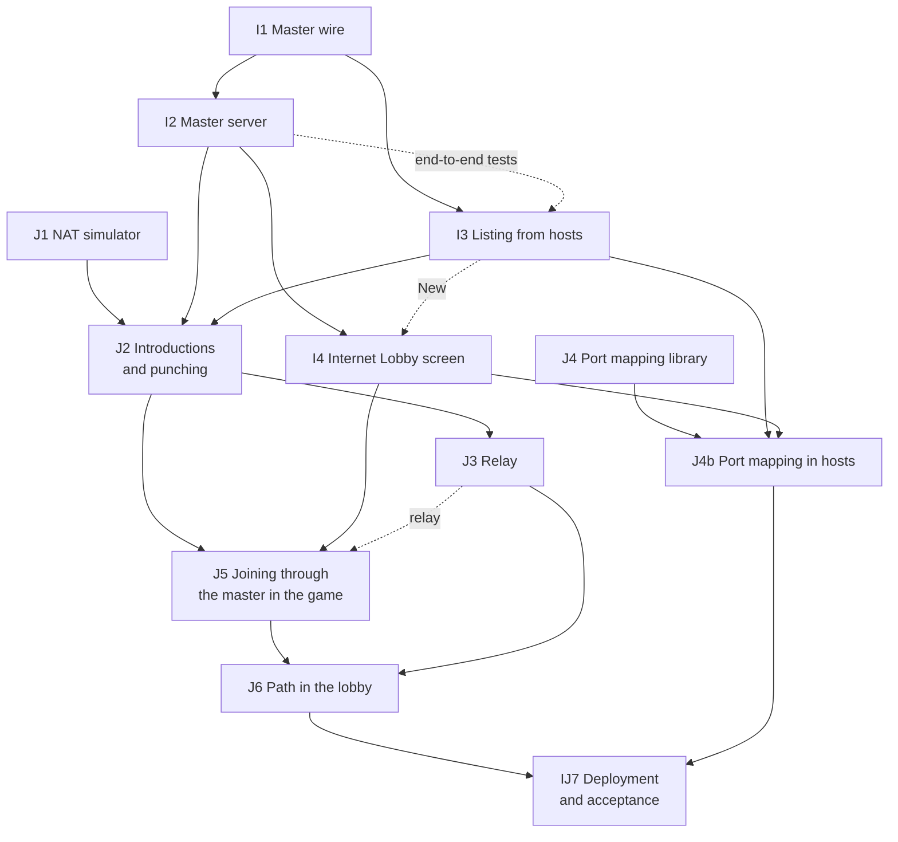

What can run at the same time (their files are disjoint):

1. **I1, J1 and J4** start together. Each adds one `pub mod` line to
   `tore-net/src/lib.rs` at its alphabetical place; J1 adds none (the `sim`
   module keeps its name).
2. **I2 and I3** once I1 is in. I3 builds against a scripted master in its
   tests and rebases on I2 for its last commit, the end-to-end tests against
   the real `Master`.
3. **I4 and J2** once I2 (and, for J2, I3 and J1) are in: I4 is the game's
   screens, J2 the transport, the master and the session.
4. **J3 and J4b** together: J3 is `tore-master` and `tore-net`, J4b the
   game's hosting and `tore-server`.
5. **J5**, then **J6**, then **IJ7**.

Other stages' slices touch some of the same files, which the lead
sequences: J6 and stage F phase 2 both change the lobby's wire and the lobby
screen; J5 and stage E's capture conversion both touch `net/session.rs`;
J2, J6 and any other slice that raises the protocol version need their
numbers handed out in merge order.

## Performance and threads

Implementation mode, on `performance`. John authorized plan revisions and
implementation with subagents on 2026-10-03. The lead reviewed their changes.
Implementation choices below are agent decisions. The [feature baseline](baselines/performance-threads.md)
records measurements and validation status; the [testing guide](testing/performance.md)
explains how to repeat them. Linux validation is complete. Platform and manual
review limits are recorded in the baseline.

The starting gameplay revision is `c1d1e736`, which includes PF1's exact firing
estimate shortcuts. PF0's earlier profile and code surveys are retained under
`.local/mp-notes/perf/`. They identified expensive observation, CPU aircraft
geometry, instrument preparation and per-seat host work. They are historical
candidate measurements, not the before reference for this implementation.

### What stays fixed

- Results remain bit for bit identical for the same inputs on the same platform.
  Goldens, recordings, combat tapes and the canonical single-player baseline
  remain unchanged. Render captures compare on the same GPU backend and settings.
- The AI retains its current actor iteration and same-tick decision visibility
  (John, 2026-10-02). Workers never make decisions from live peer state.
- The [frame loop under load](#the-frame-loop-under-load) keeps every tick a
  frame owes. There is no new tick cap (John, 2026-10-02), and simulation remains
  fixed at 120 Hz independently of rendering.
- All flight adapters retain their existing defaults and compatibility paths.
- Rayon is the approved new external dependency (John, 2026-10-02). Only the
  internal `tore-workers` crate names it. Project code retains its existing
  unsafe-code boundary; the native scheduling call stays in `tore-realtime-native`.
- GPU transforms, different culling, fewer shadow passes and other changes to
  pixels remain outside this work. No original executable is used.

### Shared scoped workers

One `tore-workers::Executor` is shared by the process, including a hosting game
and its frame loop. The fitted automatic size is available logical CPUs minus
three, capped at eight. If that leaves fewer than two workers, automatic
execution is serial. This leaves scheduling headroom, not reserved cores.
`TORE_WORKERS=0` runs inline; explicit sizes, including one, are capped at eight.
Invalid settings or thread-creation failure produce a diagnostic and retain
serial execution. Successful initialization is silent.

The interface provides ordered borrowed maps and disjoint mutable visits.
The unused mutable-map and join APIs were removed after review. Instrument
pages run as independent collection items; they do not overlap scene building.
No Rayon types cross the interface. Every scoped job finishes before its inputs
can change or a panic propagates. CPU jobs must not block waiting on each other.
Window operations and ordered GPU submission remain on the calling thread.

Tests construct explicit serial, parallel or repeatably shuffled executors;
they never mutate process environment to switch modes. Ordered results are
published by input index, not completion order. Tests exercise borrowed outputs,
mutable disjoint work, simultaneous callers, panic completion and nested work
with one worker. Thresholds are measured on this implementation, not inferred
from PF0's different `std` pool.

macOS workers request user-interactive QoS at startup through the existing
native boundary. This does not pin a core, guarantee a deadline or give workers
the host's real-time policy. Failures remain diagnostic. Terrain query entry
points that cross threads require `Sync`; sensor environments are constructed
within each job and need no shared lock.

### AI observation and ordered decisions

The implementation uses a narrower boundary than PF0's proposed full look
phase. Workers receive an actor-local context and borrowed sensor/memory inputs,
never `AiMission` or live peer actors. Each prepares owned observation state.
The normal actor loop still performs leader/runway reads, damage, ejection,
defense, decisions and flight in their original order. It applies the prepared
state exactly where the old observation call stood. No published-peer table is
needed.

New damage recovery observes inline because its preamble clears selection.
Dummy, destroyed and escaping actors are excluded. A later early return or
error discards unapplied results, leaving later actors unchanged. Serial
execution and fewer than four eligible actors retain the original in-place
observation path without speculative clones.

Prepared target visibility is a separate boolean vector, consumed at the
original decision-frame target loop. The pre-flight position and terrain
provider match those used by that loop; awareness memory keeps its original
metadata. Nothing is shared across actors or ticks, and visual rejection
reasons retain their original priority. Job-wide visibility caches were
measured and rejected because their lookup cost regressed smaller worker
configurations. The dispatch floor is a fitted performance choice, not a
gameplay constant.

Sensor channels share one actor-local visibility answer only when the ordered
endpoint bits match. A query with different endpoints calls the terrain service
again without replacing the first entry. This keeps repeated channel checks
cheap without making future callers depend on an implicit endpoint assumption.

A test-only copy of the unsplit observation code independently validates the
serial extraction. Worker comparisons cover complete actor/mission state,
flight bytes, outputs and bounded journal contents, including new damage
recovery, shared airports, cancelled landings, ejection, late leaders, human
handoff and error partial state.

### Ownships and host pictures

In combat, each active ownship's sensors, selection, emitters, mounted seeker,
weapon observation and firing estimate read fixed target rows and modify only
that ownship. Two or more active ownships can use workers. Inactive ownships
are untouched. Readiness, projectile capacity, ammunition, firing, IDs, random
streams and event publication retain the existing serial order.

The host prepares immutable pictures and readouts for the connections whose
snapshots are due. It preserves the staggered seat schedule and connection-ID
iteration order. Name registration, packet budgets, staging, sends and
sent/discard/acknowledgement bookkeeping remain serial. Missing planes/cockpits
keep their original skip behavior. Tests compare exact packet bytes and order
through failures, seat changes and reconnects, as well as world state.

### Frame preparation

Aircraft vertices are built per aircraft or debris piece, then concatenated
in the original model, target and debris order. Contact ranges use final batch
offsets. Fewer than four visible jobs use the original serial builder. This
also serves camera-panel views, including many aircraft sharing one model.

Static airport triangles and lines share one immutable cached batch keyed by
the standing placement set. Each renderer uploads only when the batch identity
changes. Scenery rebuilds, renderer replacement, destruction, reset and replay
seeking retain their normal lifecycle. Camera origin and palette changes do
not invalidate these world-space source vertices. The redundant late-frame
flight upload is removed; the pre-preview upload remains in place.

Instrument work includes page rasterisation and dirty-page scaling. Each
distinct page is one job; repeated occurrences of that page prepare in slot
order within the job, preserving final cache state even when sizes differ.
Immutable `Arc` cache entries avoid copying warm images. At least two distinct
pages can use workers. Jobs join at the existing `FlightCanvas::begin` call
point, after previews, readout, palette and hover state are fixed. Clearing,
composition and cache publication remain on the caller in original slot order.
Unshown cache entries remain available.

Already-sized images with transparent corners have an exact integer-coordinate
composition path. The original filter remains for scaling, fractional placement
and clipping. Independent pixel tests cover every source/destination alpha pair.
The tick presenter reuses an identical camera scene instead of rebuilding it
between unchanged simulation inputs. GPU and window work never moves to workers.

### Measurement rules

Before and after use the same release compiler, profile content, workload,
resolution and rendering settings. Raw output stays in `.local/`; measured
results have one home in the [feature baseline](baselines/performance-threads.md).
Do not time concurrent builds or another game. Retain repeated spreads and
outliers. Shader/GPU timings are not inferred from CPU samples.

Flight and terrain captures hold the explicitly prepared state during window
and GPU initialization. Startup wall time previously advanced their simulation
or weather, even between runs of one unchanged binary. Both comparison builds
use the same capture-only hold, and repeated-capture battery cases guard it.

- Light and heavy flights run at 1x, 2x, 4x and 8x, audio on/off. Lock cases
  must show AIM120.JT designation and an estimate at the requested speed.
  Fixed simulation-tick workloads record final-frame overshoot. Include a
  sustained accelerated-flight pass, not just the expensive opening fight.
- Host cases use 0, 15 and 30 humans. Measure complete elapsed operations,
  including worker completion. Linux host-thread CPU time excludes workers
  and is a separate diagnostic, never the threading speed-up.
- Test worker counts 0, 1, 2, 4 and 8, idle/busy dispatch, small work and
  simultaneous callers. A real hosting game with rendering, camera panels
  and audio additionally checks shared-pool contention and overloads.
- Record achieved simulation rate, frame p50/p95/p99/max and host elapsed
  costs. Eight-times speed needs 960 ticks per wall second, leaving less
  than 1.042 ms per tick before drawing. Faster CPU work does not guarantee
  that every heavy opening fight reaches 8x.
- CPU-only synthetic probes are portable and require no retail media.
  Actual frames require a graphics host and imported media. Report unrun
  platforms explicitly; do not claim CI validation from a local Linux pass.

Audio on/off measurements and user-space sampling did not reproduce PF1's
severe audio-dependent slowdown. Audio behavior is unchanged. Sampling cannot
establish callback dropout counts or rule out a rare lock stall. If a
reproducible gap remains, measure lock waiting/holding and callback silence
before choosing a fix, preserving tick events and deterministic offline output.

### Preservation and acceptance

The independent before reference is recorded before simulation edits. Serial
extraction is validated before becoming the worker reference. Never update a
golden to make a threading change pass. Explicit 0/1/2/4/8-worker and shuffled
comparisons include floating-point bits, ordered output, full journal contents,
all ownships and affected actor state. The older whole-tick fingerprint covers
selected fields and journal counts; it is not the sole proof.

The canonical single-player harness, AI probe recordings, replays, combat tapes,
network matrix and existing goldens remain guards. Fixed-tick capture hashes,
vertex/contact lists and canvas/cache comparisons validate presentation. New
cache tests cover destruction/reset, replay seeking, duplicates and resize.
Full repository checks and the same before/after workloads finish the pass.
John reviews the resulting flight before a merge into `multiplayer`.

### Slices

| Slice | Status | Needs | Scope | Acceptance |
| --- | --- | --- | --- | --- |
| PF0 Profile | Historical | | Historical profile and feasibility, done 2026-10-02 | Evidence in `.local/mp-notes/perf/` |
| PF1 Firing estimate | Built | | Built 2026-10-02 (`44f40971`, `67aa2b18`) | Existing exact-shortcut tests |
| PF2a Baseline and measurement | Measured | | Correct host elapsed timing; freeze behavior, captures and release cases | Reproducible before reference and successful workload assertions |
| PF2b Bounded serial fixes | Built | PF2a | Static geometry cache, exact visibility shortcuts, alpha composition and duplicate scene reuse | Original references, cache lifecycle tests, capture equality and measured gains |
| PF2c Audio investigation | Measured | PF2a | Compare audio on/off and sample remaining costs | No unapproved audio behavior change; limits and unreproduced cases reported |
| PF3a Worker pool | Built | PF2a | Shared collection executor, explicit test modes and macOS QoS | Ordered output, shuffled schedules, one-worker nesting and dispatch probe |
| PF3b Aircraft geometry | Built | PF3a | Per-aircraft CPU work and ordered contact offsets | Vertex/contact equality, capture hashes and frame timings |
| PF4a AI serial extraction | Built | PF2b | Restricted observation context with original publication point | Unsplit reference and full state/output checks |
| PF4b AI workers | Built | PF4a, PF3a | Observations and target visibility; ordered decisions unchanged | Scenario guards, canonical baseline and tick gains |
| PF5a Ownship workers | Built | PF3a | Observations and estimates; ordered readiness/firing | Many-ownship reference, capacity/counter and inactive-input tests |
| PF5b Host picture workers | Built | PF3a | Due-seat preparation with serial connection-ordered transport | Packet/order/bookkeeping comparisons and host elapsed timings |
| PF6 Instrument work | Built | PF2b, PF3b | Independent page preparation, including dirty scaling | Frozen canvas/cache reference and integrated frame gains |
| PF7 Acceptance | Linux validated | all applicable slices | Repeated frozen tests and measurements; hosted-flight contention; full diff review | Required Linux checks, unchanged behavior, measured gains and documented platform/manual review limits |

PF2a was recorded first. Independent files were delegated with one owner for
manifests and one for shared frame-loop edits. The lead reviewed full diffs and
reran acceptance checks. Measurements use frozen binaries/checkouts so later
edits cannot change a reference run. Integration follows [AGENTS.md](../AGENTS.md)
and stays on `performance` for John's review before a merge.

A separate render thread, parallel GPU encoding, mission-load workers and
threaded projectiles are outside this pass. GPU-side work remains a separate
decision; no pixel-changing shortcut is implied by a CPU speed-up.

## Exact checkpoints

Design for stage H of the [multiplayer plan](multiplayer-plan.md#stages),
written on 2026-10-05 by a design agent for the lead. The format, coding
rules, coverage rule and scenarios are in the
[checkpoint format](formats/checkpoint.md); this section is how the code is
shaped and how the work is split. John's decision is that host migration is
exact (2026-09-28); every other choice is an agent decision. The slice table
below marks each slice that is built.

In short:

- `World::checkpoint()` writes every piece of mutable mission state between
  two ticks; `World::restore(bytes)` loads it over a fresh `World` built from
  the same mission, which then steps on bit for bit. Mission setup (terrain,
  aircraft types, phrases, the layout) comes from the fresh world; the
  structure that handoffs change (cockpits, ownships, AI actors, radio
  channels) comes from the bytes.
- One trait, `tore_sim::checkpoint::Checkpoint`, codes each type exactly, with
  every field named so a forgotten one fails to compile. It reuses
  `tore-codec`'s exact float coding and the wire's exact flight coder, and
  changes no byte of the wire.
- Each module's coders sit beside it in a `<module>_checkpoint.rs` child
  module, so the encoders read private fields without opening them up and
  without editing simulation code. That also lets several agents code
  different modules at the same time.
- An equivalence test restores scenarios mid-fight, mid-landing, on the ground
  and with handoffs into fresh worlds and steps both copies on, on every CI
  platform.

### What the surveys found

Six read-only surveys at `884f9916` walked every type reachable from `World`
(the summary by area is in the
[format](formats/checkpoint.md#the-state-by-area)). What shaped the design:

- **Deterministic already.** No `HashMap`, `Rc`, `RefCell`, stored closure or
  thread-local in mission state; every map is a `BTreeMap`; every random
  stream is seeded from the mission and holds one or two integers. Worker
  results are never stored between ticks. The one process switch that changes
  results is the retail stall speeds.
- **Private everywhere.** Almost every state type keeps its fields private, so
  coders must live in a child module of the type's own module.
- **Structure changes mid-flight.** Handoffs insert and remove AI actors,
  ownships, cockpits, AI slots, configurations and radio channels. A restore
  cannot assume the fresh world's lists.
- **Copies of imported records.** Ownship and AI configurations, weapon
  records on stations and on missiles, sensor profiles and runway views (up to
  four per AI actor) are copied into state. They never change, but they are
  not derivable from the setup alone after a handoff, so they are coded once
  each as shared records.
- **Not everything called a cache is one.** Several fields documented as
  caches or presentation are read back by a later tick; the
  [scratch rule](formats/checkpoint.md#what-it-holds-and-what-it-leaves-out)
  keeps them coded.
- **Write-only explanations are large.** The AI journal, traces, draw logs and
  the radio journal's causes would double the number of types for text no
  standby needs; they are the "why-records" the checkpoint leaves out.
- **`World::tick` is combat's tick.** There is no separate world counter.

### The pieces

| Piece | Where | What |
| --- | --- | --- |
| `Checkpoint`, `InPlace` | `tore-sim/src/checkpoint.rs` | The traits: `save(&self, s, base)` and `load(l, base)`, or `save_in_place` and `restore_in_place(&mut self, l)` for holders that keep setup fields |
| `Saver`, `Loader` | same | A `BitWriter` with the shared-record table and the world's flight models; a `BitReader` with the shared records and the fresh world's flight models |
| `Models` | same; filled by `tore-world/src/checkpoint.rs` | Every distinct flight model the world holds, by aircraft identity and a canonical ordinal, as the import built it (`flight::State::import_model` undoes the weight scaling) |
| Macros | same, exported | `checkpoint_struct!` (with `shared { .. }` and `skip { field = rebuild }`), `checkpoint_enum!`, `checkpoint_tuple!`; `checkpoint_via_exact!` inside `tore-sim` |
| Standard impls | same | Integers, floats, `bool`, `String`, `()`, `Option`, `Box`, arrays, tuples, `Vec`, `VecDeque`, `BTreeMap`, `BTreeSet`; the flight state's helpers (`save_flight`, `load_flight`); `to_bytes`, `from_bytes`, `round_trip` and `round_trip_in_place` for the slices' tests |
| Leaf types shared by slices | `tore-sim/src/checkpoint_shared.rs`, `tore-sim/src/ai/checkpoint.rs`, the end of `tore-world/src/checkpoint.rs` | `AircraftId`, `Side`, `Activity`, `SeekerClass`, `ResolvedExperience`, `ScalarSpeed`, `SpeedLimits`, `ApproachEnd`, airfield `Phase`, `LandingReason`, `LandingOrder`, `RunwayView`, `AirfieldAnchors`, `Basis`, `FuelState`, `StationId`, `Rounds`, `StoreState`, `StoreCapability`, `Formation`, `WingControl`, `DispenserStore`, `Emitter`, `TargetView`, `ThreatReport`, `FrameEvent`, the gunner's `Target`, missile `Rules`, `DecisionRandom`; `PlaneId`, `SeatId`, `Crew`; and, through their `Exact` coders, the random streams and clocks, turbulence, cheats, sensor controls, wrecks and escapes |
| The container | `tore-world/src/checkpoint.rs` | Header, section framing, shared-record table, CRC-32, mission identity; `World::checkpoint`, `World::restore`, `World::mission_identity`, `checkpoint::layout` (read and check a container without restoring it), and with `test-support` `World::checkpoint_sections` and `World::restore_sections` (the twin restore) |
| Section coders | each slice's `*_checkpoint.rs` | One function pair per section, called by the container |
| The harness | `tore-world/src/world/checkpoint_tests.rs`, `world/checkpoint_scenarios.rs` | Scenario builders, twin restore per section, the whole-world equivalence, round trips, damaged bytes |
| Measurement | `tore-session/tests/checkpoint_cost.rs` | Size by section, encode and restore time and catch-up on real data, ignored |

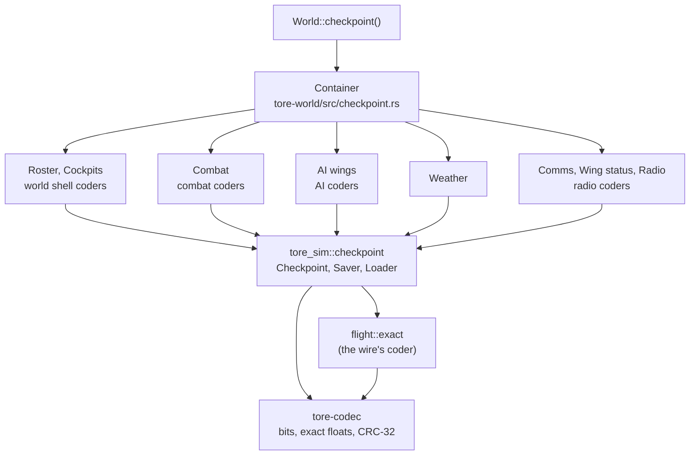

The new public surface is small: `World::checkpoint`, `World::restore`, the
error type, and the trait module (`tore_sim::checkpoint`) that `tore-world`
needs across the crate boundary. Coders are private child modules.

### Restoring, in order

`World::restore` checks the whole container first (magic, version, switches,
mission identity, CRC-32, section framing), then builds the flight model
table from the fresh world, decodes the shared records, and restores the
sections in id order. Each section's coder replaces its part of the world; a section never
reads another section's decoded values, only ids, so the order is a choice,
not a dependency. On an error the world is to be discarded.

### How stage H lands

Slices, each on its own `mp/h-<topic>` branch and worktree, merged by the
lead with the quick check per change. Every coding slice only adds files named
`*_checkpoint.rs` and fills the stubs H0 left for it; H0 adds every
`mod checkpoint` line the slices need, so no two slices edit the same file.
A coder never changes simulation code: if one needs a constructor or an
accessor, it lives in its own `*_checkpoint.rs` child module, which can see
the private fields. A slice that finds it must edit a simulation file stops
and asks the lead.

H0 codes every simple public type that more than one slice needs (the leaf
types above) and leaves a stub coder that returns `NotCovered` for every
other type that one slice codes and another slice's coder calls, and for each
section's root, so every slice compiles and tests on its own. The stubs are
`Weapon` and `live::Configuration` (`checkpoint_records.rs`), `Sensors`,
`SignatureProfile`, `JammerProfile` and `ThreatService` (H1); the roster,
cockpits and weather sections (H2); `live::State` (H3a); `Smoke`, `Devices`,
`Piece`, `Mark`, the blast `Rolls` and the combat section (H3b); `AiMission`
(H4); `Controller` (H5); the AI wings section and `Tracker` (H6); and the
comms and wing status sections, `AirfieldRadio` and `CrewVoice` (H7). A slice
that codes another module adds its own `*_checkpoint.rs` and the one `mod`
line in that module's file. A slice's acceptance is its own
round trips: values taken from stepped fixture worlds code to bytes, decode
to an equal value (by `PartialEq` where the type has it, otherwise by coding
again to the same bytes), and step on identically where the type can be
stepped alone. The **twin restore** of a whole section passes when every
slice under it has merged; the lead runs it at each merge.

| Slice | Model | After | Owns | Work | Acceptance |
| --- | --- | --- | --- | --- | --- |
| H0 Scaffolding | Opus | | `tore-sim/src/checkpoint.rs`, `checkpoint_shared.rs`, `checkpoint_tests.rs`, `tore-sim/src/ai/checkpoint.rs`, `tore-world/src/checkpoint.rs`, `radio_calls_checkpoint.rs`, `world/checkpoint_tests.rs`, `world/checkpoint_scenarios.rs`, `tore-session/tests/checkpoint_cost.rs`, the stub files, the `mod checkpoint` lines, `tools/battery_selection.py` rules | The traits, `Saver`, `Loader`, `Models`, macros, standard impls, flight helpers, shared leaf types; the container with versioning, identity and CRC; `World::checkpoint`, `restore`, `checkpoint_sections`, `restore_sections`; stubs; the radio section as the worked example; the harness with the scenarios the fixtures allow today, the twin restore and the whole-world test ignored until every section is covered; the measurement test | Unit tests of every standard impl, the macros' shared and skipped fields, shared records, flight states with one and two models per identity, the container's refusals (magic, version, switch, identity, CRC, framing, trailing bytes) and 10,000 damaged or random inputs without a panic, in both crates; the harness runs and reports `NotCovered` sections by name; single-player quick guard unchanged; the wire golden test unchanged. **Built (H0):** 14 unit tests in `tore-sim` and 4 harness tests (and the ignored whole-world test) in `tore-world`; the radio section restores into a twin in all three scenarios; a restored flight state flies on identically for two seconds; a field added to `Radio` without coding it failed to compile in its coder (checked by hand, then reverted) |
| H1 Records and sensors | Sonnet | H0 | `checkpoint_records.rs` (tore-sim), `sensors/track_checkpoint.rs`, `sensors/profile_checkpoint.rs`, `sensors/signature_checkpoint.rs`, `combat/threats_checkpoint.rs` | `Weapon` and its parts (tore-formats types, coded in `checkpoint_records.rs`), `live::Configuration` and `Station`, `SensorProfiles` and the profile types, `SignatureProfile`, `JammerProfile`, `Sensors` with contacts, strobes, plots and trails, `ThreatService` and its records; shared records for the big copies | Round trips of the crowd fixture's configurations, every ownship's and actor's sensors and threat services at ticks 300, 600 and 900; a weapon record carried by many stations codes once; sensors restored into a stepped copy step on identically for 600 ticks. **Built (H1, 2026-10-05):** every type of the row is coded with every field named and nothing skipped (the one scratch field, `Stored::current_this_tick` in the threat service, is coded anyway: it costs a bit and a restored service then compares equal). The weapon types and `Countermeasures` of `tore-formats` are coded in `checkpoint_records.rs` with `checkpoint_struct!`. *Agent decision:* a `Station`'s weapon is a shared record, and so is a `Configuration`'s `SensorProfiles` and a `Sensors`' copy of the same profiles, so an aircraft's suite costs an index beside its configuration; the configuration itself is plain, and callers code it with `Saver::shared`. `signature::Configuration` (the deployed fractions) is a per-step input, not state, and has no coder. A `Strobe`'s private line of sight is coded. In `tore-sim`: 13 unit tests (a 1,800-tick scripted sensor suite with a held track, strobes, stale plots and visual contacts restored at ticks 300, 600 and 900 and stepped on 600 ticks against the original; a threat service with all four evidence kinds, stale records and the same step-on; weapon records and configurations with the shared-record counts; damaged bytes); in `tore-world`, one crowd-fixture test round-trips every ownship's configuration, sensors and threat service, every AI actor's sensors and the dummy configurations at ticks 300, 600 and 900 (the crowd fight raises no missile warning by then, so the threat service's content is tested in `tore-sim`; an AI actor's own threat service is private to `AiActor` and is H4's). Sizes on the crowd fixture: four configurations in 540 bytes plus 3 shared records of 358 bytes; an ownship's sensors about 1.8 to 2.2 KB each (contacts, plots and trails), so about 60 KB for 30 aircraft before the profiles |
| H2 World shell | Sonnet | H0 | `tore-world/src/seats_checkpoint.rs`, `world_checkpoint.rs` (`Cockpit` and the roster, cockpits and weather sections), `tore-sim/src/airport_checkpoint.rs`, `environment_checkpoint.rs` | `Roster` and seats; `Cockpit` with its flight through `save_flight`, turbulence, stream, NAV mode and clocks; `airport::Service` with clearance and replies; `Environment`'s clock, ticks, fog stream, selection and tints, with a restore constructor that draws nothing | Round trips; the twin restore of roster and weather on the tick mission and the crowd fixture; the cockpits' twin once H6 and H7 merge **Built (H2, 2026-10-05):** `Roster` (planes, seats, `Pilot` with `Lost`, `Slot`), `Cockpit`, `airport::Service` (with `Reply`, `DeclineReason` and the clearance) and `Environment` are coded with every field named. Skipped: `Cockpit::previous_flight` (scratch: `plane::fly` begins each step by copying the flight into it; a restore sets it equal to the flight), `Environment::configuration` (setup). *Agent decision:* no restore constructor is needed. The weather section restores in place over the fresh `Environment`, which drew its first fog numbers when it was built, and overwrites the clock, ticks, stream, schedule and active list. The records are not coded whole: the fog callback rewrites only a record's tint scalar, so one value per record is coded and the count must match the fresh world's. The active list (blended copies) is coded whole, with `Layer`, `Deck` and `Callback` in `environment_checkpoint.rs`. *Agent decision:* a cockpit's aircraft identity (which names its flight model) is read from its plane's ownship in combat, so saving a cockpit whose plane has no ownship is an error; a real world never has one. *Agent decision:* `Roster::load` refuses planes or seats out of order, a pilot from a seat the roster lacks and a seat in a plane it lacks, since the roster binary-searches planes; a `Reply` nests `Repeated` at most 4 deep on loading. `WingId` and the wing `Side` are `tore-sim` types the trait cannot reach from `tore-world`, so a slot codes them field by field. In `tore-sim`: 6 unit tests (a service mid landing finishes the landing with the same events as its restored copy; every reply and decline reason; a weather clock with two fog layers restored into a fresh `Environment` after 35 seconds and 77 ticks draws and selects identically for 40 more seconds; another mission's weather is refused and changes nothing; damaged bytes). In `tore-world`: 3 roster unit tests (a roster with a lost plane, a waiting seat and a chosen wingman; the refusals; damaged bytes) and 3 world tests in `world/shell_checkpoint_tests.rs`: each scenario's roster, cockpits and weather at tick N restore into a world fresh from the build (an open mission has no cockpits there) with the original's structure and the same coding, the scenarios hold the state they are meant to (a tower conversation and turbulence in use; a seat waiting after a handoff), and damaged sections are refused without a panic. The cockpits' coder calls the result tracker, which slice H6 codes: until it merges, the cockpit tests print that they skip it, and the twin restore covers roster and weather only. Sizes: a roster 25 to 56 bytes, a weather section 24 bytes (458 once the open mission's blended layers are in), a cockpit 375 to 656 bytes (the exact flight is most of it), so the shell is under 5 KB at 30 aircraft as estimated |
| H3a Combat core | Sonnet | H0 | `combat/live_checkpoint.rs`, `combat/live/rewind_checkpoint.rs`, `combat/missiles_checkpoint.rs`, `combat/missiles/seeker_checkpoint.rs`, `combat/ledger_checkpoint.rs`, `combat_checkpoint.rs` (tore-sim) | `live::State` with ownships, targets, ownship rows, projectiles, effects, the ledger, actor support, marks' list, rewinds and the rewind history (each frame against the one before), random streams, counters, the tick; missile `Flight`, `Seeker`, `Motion`, `Cruise`, `Profile`; `PlayerTrigger`, `FallState`. Calls H1's and H3b's types | Round trips of `live::State` at crowd fixture ticks with missiles guiding and rounds in flight; the rewind history's size against one second at 30 aircraft printed; the combat section's twin once H1 and H3b merge |
| H3b Combat effects and wrapper | Sonnet | H0 | `combat/smoke_checkpoint.rs`, `countermeasures_checkpoint.rs`, `debris_checkpoint.rs`, `blast_checkpoint.rs` (tore-sim); `tore-world/src/combat_checkpoint.rs`, `snapshot_checkpoint.rs` | `Smoke`, `Devices` with flares and chaff (the `f32` opacity), `Piece`, `Mark`, blast `Rolls`; the `Combat` wrapper restored in place, `Trigger`, `FireInput`, `Pose`, `RenderHistory` and the picture types | Round trips; smoke and countermeasures restored into a copy evolve identically for 600 ticks |
| H4 AI mission | Sonnet | H0 | `ai/mission_checkpoint.rs`, `ai/airfield_checkpoint.rs`, `awareness_checkpoint.rs`, `incoming_fire_checkpoint.rs`, `defense_checkpoint.rs`, `engagement_checkpoint.rs`, `opportunity_checkpoint.rs`, `damage_checkpoint.rs`, `route_checkpoint.rs`, `ejection_checkpoint.rs` (tore-sim) | `AiMission` and `AiActor` with every field coded or skipped by class, the airfield `Sequence` and orders, `Memory`, `Lookout`, defense, incoming fire, assignments, opportunities, route types, the escape monitor. Calls H1's and H5's types | Round trips of `AiMission` in the tore-sim AI golden fixtures (airfield, landing, defense) by the existing debug-and-flight-bytes oracle; a restored mission steps on identically for 600 ticks there **Built (H4, 2026-10-05):** `AiMission` and `AiActor` are coded with every field named, in ten files (the nine `mod checkpoint` lines in `awareness`, `incoming_fire`, `defense`, `engagement`, `opportunity`, `damage`, `route`, `airfield` and `ejection` are the only edits to simulation files). An actor's flight goes through `save_flight` with its identity's aircraft, and its controller, sensors and threat service through H5's and H1's coders. Skipped, each with its class at the skip: `AiMission::journal`, `AiActor::trace` and `journal_memory` (why-records); `AiMission::{missiles, gun_rounds}` (scratch: the host sets both before every step, `AiWings::step` and the golden fixtures included, and only `update_defense` reads them, so a test that sets them once must set them again after a restore); `AiActor::adapter` (`last_requested` is read by nothing in the simulation and `gun_aim` is cleared and set again inside each step) and `last_input` (read only by the formation trace and the replay recorder's control display, and rewritten by every step that flies, so a restored actor reports neutral controls until its next flown step). *Agent decision:* `last_defense` is coded whole, `DefenseDebug` included, because the next tick reads whether the decision flew a motion and the debug type has no empty value to rebuild; `pending_threats`, `pending_events`, `device_schedule`, `observed_attacks`, `ignored_attack_ids` and `received_emitters` are coded because a later tick reads each. *Agent decision:* an actor's copied records are shared records: its home runway, its landing order, its ground start and its airfield sequence share the runway view (a mission of 30 actors on one runway costs one coding of it), and so does each gun's weapon record. `Delay` and `ProjectilePacing` (the stores' timings, in `StationSpec`) are coded here, in `mission_checkpoint.rs`, through `Delay`'s public API, since `weapon_service` is H5's. The real golden fixtures' builders are private to `golden_tests/ai.rs`, so the acceptance is met on scripted missions rebuilt in `mission_checkpoint_tests.rs` (H9 can run the same round trip through the `observe` hook of `reading_every_ai_record_changes_no_behaviour`): a six-aircraft fight with an infrared missile and tracer fire at an actor, a hit, a launch warning, an attack report, a human leader lost at tick 700 (the lead passes and a mission of opportunity starts), assignments, a priority landing and a wing route; ground starts on an unanchored and an anchored runway; and a landing from 40,000 ft out to parking. Each restores at six ticks of the fight (1, 220, 340, 460, 800 and 1,200) and at the first tick of every airfield phase it passes through, and the restored copy steps on 600 ticks with equal outputs, equal flight states every tick and byte-equal codings every 30 ticks. Other tests cover the gun and runway sharing (two records for five actors), every value type, damaged and cut bytes, and the monitor's random stream; replacing a field's load by a default in the actor coder failed the fight test (checked, then reverted) |
| H5 AI controller | Sonnet | H0 | `ai/controller_checkpoint.rs`, `motion_checkpoint.rs`, `steering_checkpoint.rs`, `gunnery_checkpoint.rs`, `wing_checkpoint.rs`, `formation_checkpoint.rs`, `weapon_service_checkpoint.rs`, `pursuit_checkpoint.rs`, `threat_checkpoint.rs` (tore-sim) | `Controller` and everything it owns: the manoeuvre and intents, the last intent batch, gunnery cycles and views, formation guidance and variation, recipient state, weapon service and stores, searches, defense motion, pending warnings, frame events, threat reports | Every controller of the AI golden fixtures at three ticks round-trips equal (`Controller` is `PartialEq`) **Built (H5, 2026-10-05):** `Controller` and its 40 coded fields, with 52 coders (types and enums) across the nine files (the eight `mod checkpoint` lines in `motion`, `steering`, `gunnery`, `wing`, `formation`, `weapon_service`, `pursuit` and `threat` are the only edits to simulation files). Skipped, each with its proof at the skip: `gun_views` and `formation_traffic` (scratch: the mission writes both before every `Controller::step`) and `trace` (why-record). *Agent decision:* `formation::Guidance::trace` is **coded**, not skipped: it is called a hidden inspection hook, but `Guidance::change_slot` reads whether it is set and the mission feeds each actor's trace phase and planned velocity into the others' traffic. The golden fixtures' builders are private to `golden_tests/ai.rs`, so the acceptance is met on a scripted crew rebuilt in `controller_checkpoint_tests.rs` (leader, wingman and ace under orders, warnings, hits, a gun and missile stores; a wingman reslotting around traffic): every controller round-trips equal to the original but for the scratch every 60 ticks and at ticks 600, 1,500 and 2,800, and a restored copy steps on with identical batches for 240 ticks; a field dropped from the coder by hand failed the crew test (checked, then reverted) |
| H6 AI wings | Sonnet | H0 | `tore-world/src/ai_wings_checkpoint.rs`, `ai_wings/reports_checkpoint.rs`, `chatter_checkpoint.rs`, `outcome_checkpoint.rs` | `AiWings` restored in place (slots, humans, configurations as shared records, damaged stations, handed-over skills, the two streams, pending guns, last hit points, activities, the projectile counter, HUD line state, `ai_shots`); reports, chatter watch, result tracker | Round trips in the crowd fixture; the AI wings section's twin once H1, H4 and H5 merge |
| H7 Radio | Sonnet | H0 | `tore-world/src/comms_checkpoint.rs`, `airfield_radio_checkpoint.rs`, `crew_voice_checkpoint.rs` | `Comms` with channels, pending calls, cooldown keys by table, the stream; `WingStatus`; `AirfieldRadio`; `CrewVoice` (the radio section's `Radio` is H0's worked example) | Round trips; the comms and wing status sections' twins on the tick mission with calls pending **Built (H7, 2026-10-05):** `Comms` (channels, pending calls, both cooldown maps, the stream, the call serial and the clock), `WingStatus`, `AirfieldRadio` (with its departure, approach and waiting notices) and `CrewVoice` are coded with every field named. Skipped, all why-records: `Comms::journal`, `Channel::recent`, `Call::origin`, `AirfieldRadio::notes` and `CrewVoice::gate` (a restored voice journals its first gate again). *Agent decision:* the seven cooldown keys are a fixed table in `comms_checkpoint.rs` (`COOLDOWN_KEYS`, coded by index); a key a rule uses that is not in the table fails the checkpoint with its name, and a unit test reads `radio_calls.rs` and `crew_voice.rs` to catch one before it ships. *Agent decision:* the runway views an `AirfieldRadio` holds are shared records, so a departure and an approach on the same runway cost one coding. In `tore-world`: 19 unit tests beside the coders (a radio with calls pending delivers on identically for ten seconds of ticks after a restore; a scripted crew voice speaks on identically for 2,000 ticks after a restore; a tower conversation delivers its three waiting notices identically; damaged bytes) and 3 world tests in `world/radio_checkpoint_tests.rs`: the tick mission's own tower conversation and crew voice round trip at five ticks, and on the tick mission and on the crowd fight the comms, wing status and radio sections restore into a twin that was never given calls the original holds (three calls with delays, two cooldowns), which then delivers them with the same cues for 900 ticks. The scenario harness's own twin has no call pending at tick N in any of the three scenarios, which is why these tests inject them. The coders of `AirfieldRadio` and `CrewVoice` run inside the cockpits section, so their twin is H2's once it merges |
| H8 Scenarios | Sonnet | H0 | `world/checkpoint_scenarios.rs`, `tore-world/src/test_support/resources.rs` | A synthetic import with an airport so `World::new` builds a ground start; the tick mission's wing ordered to land; a weather configuration that reselects inside the run; each scenario's state assertions at tick N | Each scenario builds twice identically and reaches its asserted state; nothing in the existing tests changes **Built (H8, 2026-10-05):** ten scenarios in `world/checkpoint_scenarios.rs`: H0's three with their state now asserted, and seven new (damaged aircraft, handoffs in the fight, missile duel, radio calls pending, AI landing, ground start, changing weather). Each `Scenario` has an `expect` that asserts the state it exists for at tick N and returns a note, and an optional `after` that asserts a later state; one test builds every scenario twice, compares the covered sections of the two builds, and runs both checks. `airport_resources()` in `test_support/resources.rs` is the synthetic import with one airport added to the theater's layout (a runway object whose shape holds the contact boxes the airfield's takeoff, landing and parking read, laid out as `tore-sim`'s airfield golden scenario lays them), so `World::new` builds a real ground start with the airport's anchors; `resources()` is unchanged, so no existing test sees the airport. No simulation file changed. *Agent decisions:* (1) The AI landing is the airport import's airborne mission, not the tick mission: the tick mission's AI aircraft are not an addressable wing (its landing order is answered "no addressed wingmen"), its airport has no taxi points, and its wingmen did not reach the final in 9,000 ticks. The two wingmen start at the first approach gate and 16,000 ft behind it, because the AI flies the three gates at its approach speed, which takes about 8,000 ticks to the final; the checkpoint is at 12,500, in the rollout (which lasts from tick 11,900 to 13,250), so this scenario runs 14,100 ticks. (2) The ground start's wingmen go from waiting straight to lining up (they queue beside the takeoff spot, so no `Taxi` phase is reached) and wait for the player's roll, so the checkpoint is at 2,000 and the run 1,400, not 240 and 900. (3) The crowd fixture's second station is not a seeker missile and its AI fires nothing and hits nothing, so no missile is in flight there: the missile and warning assertions are made on the missile duel (the open mission's real AIM-9 profile; the humans fire), and the damage scenario deals its damage with the development damage command and by setting a target row and an AI pilot's escape by hand, as the AI wings' own tests do. (4) H0's crowd fight keeps its script (no designation): a designation makes the guns call a radio line, which starts a cooldown the H7 twin test needs free at tick 600. The leaders designate in the damage and handoff scenarios, where the locks are asserted. (5) The weather scenario runs the fog callback on both layers so the layers are reselected every second of mission time, and ends the first layer five seconds in so the active layer changes inside the run. (6) The radio scenario asserts a waiting call by comparing the Comms section with the same mission's without the calls, because the channel's queue is private and its journal is drained each step. Timing: the test takes about 5 s in a debug build |
| H10 Data link | Sonnet | H0, G0 (and each later G slice that adds state) | `tore-world/src/datalink_checkpoint.rs` (new), the `datalink` line and a `DataLink` section in `tore-world/src/checkpoint.rs` | Code `DataLink` (members, pictures with their publish ticks, locks, engagements, assignments, the warned tables; the journal by the why-record rule) and add its section; the state the [data link](#flight-data-link) names for stage H as each G slice lands | Round trips of the picture on the crowd fixture at ticks before and after a publish; the twin restore of the data link section; added by the lead on 2026-10-05 when G0 gave `World` its `datalink` field (named as not yet coded in the destructuring until this slice) |
| H9 Integration and measurement | lead (Opus) | all | the harness's ignore markers, docs, baseline | Un-ignore the whole-world equivalence; run every scenario; measure sizes, encode, restore and catch-up on the synthetic crowd and on the 15 against 15 mission with real data; delta-code against the previous checkpoint only if the size needs it; fold the results into the budget and a `docs/baselines/` entry | Every scenario passes bit for bit on every CI platform; a field added without coding fails to compile (shown once, by hand); the measured figures recorded against the budget |

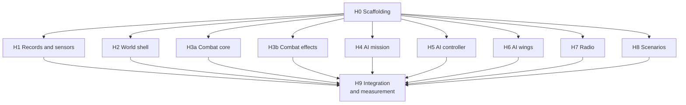

Every slice from H1 to H8 can run at the same time: their files are
disjoint and the stubs make each compile alone. With four or five agents at
once, *agent proposal:* a first wave of H1, H5, H2, H7 and H8 (the types the
others call, and the fixtures), then H3a, H3b, H4 and H6. The merge order
that completes sections soonest is H1, H5, H4, H6 (the AI wings section),
then H3b, H3a (combat), then H7, H2 (the rest).

**Single player.** No slice changes simulation behaviour: coders only read,
and restore runs only in tests until stage K. Each slice runs the quick check
(battery-free for `*_checkpoint.rs` files, which the battery map routes to no
scenario) and the single-player quick guard. The full single-player baseline
is needed only if a slice must touch a simulation file, which it should not.

**Stage G.** The data link adds a shared picture and radio frequencies. If
they become new `World` fields, each gets a section id and a coder in its own
`*_checkpoint.rs`; if they live inside `AiWings` or `Comms`, they join that
section's coder, whose field list will not compile until they are named.
