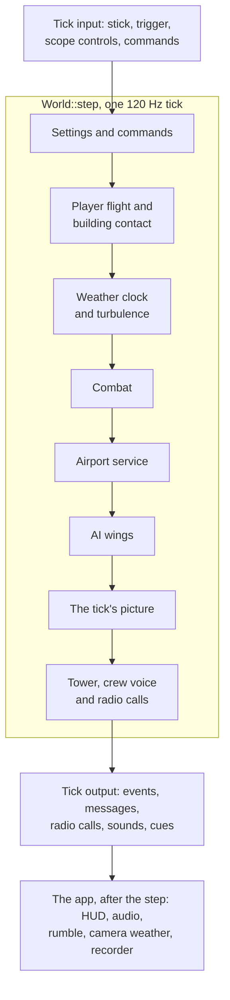
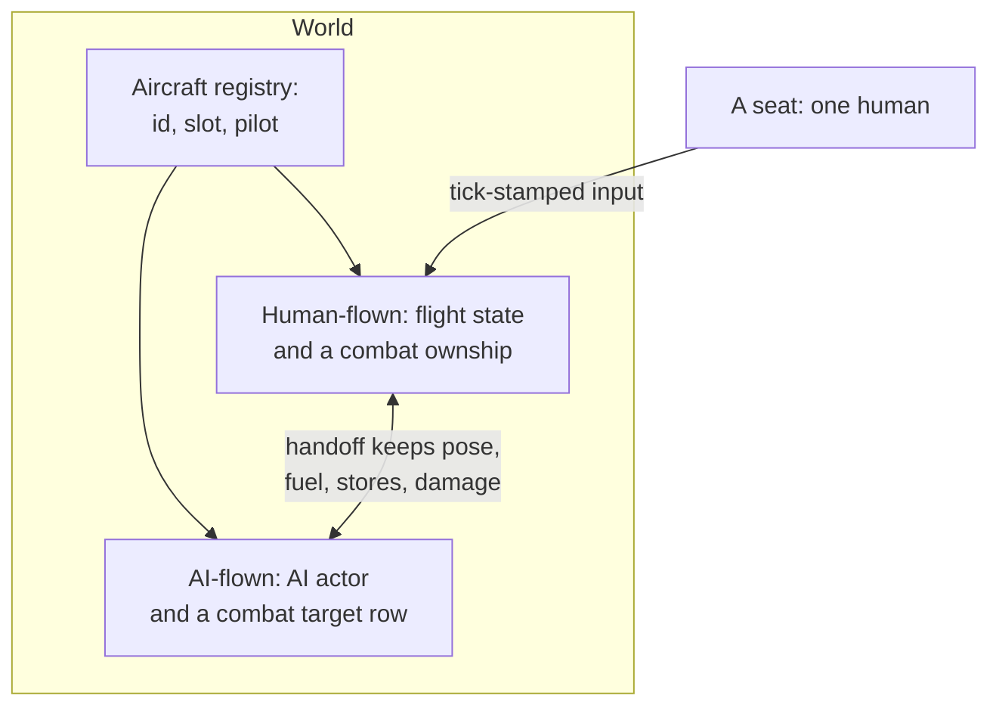
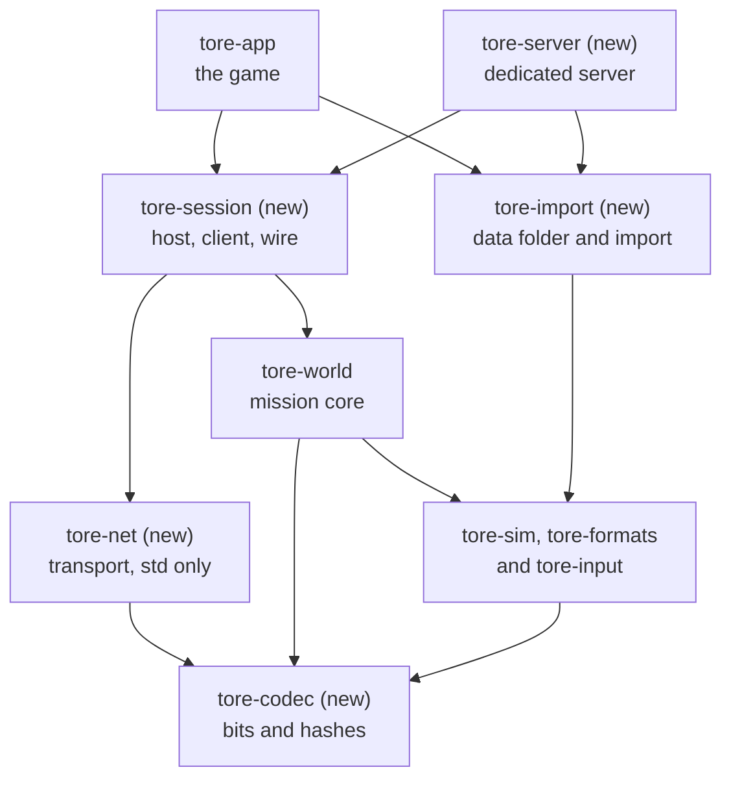
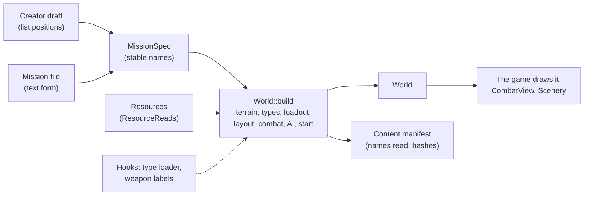
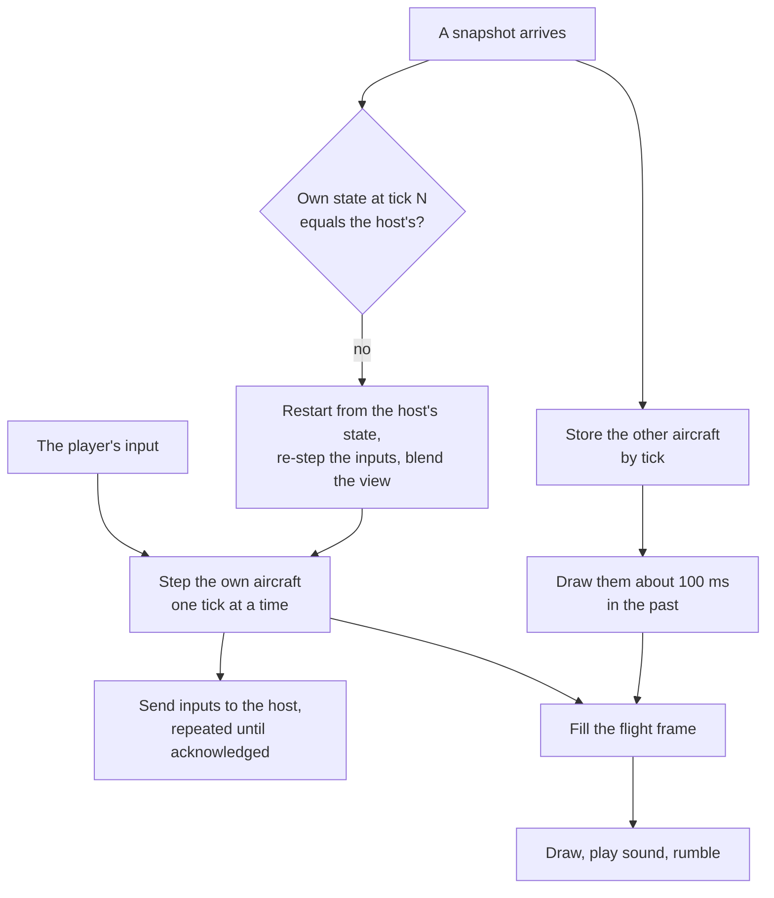
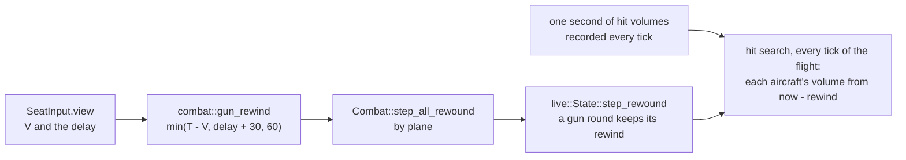
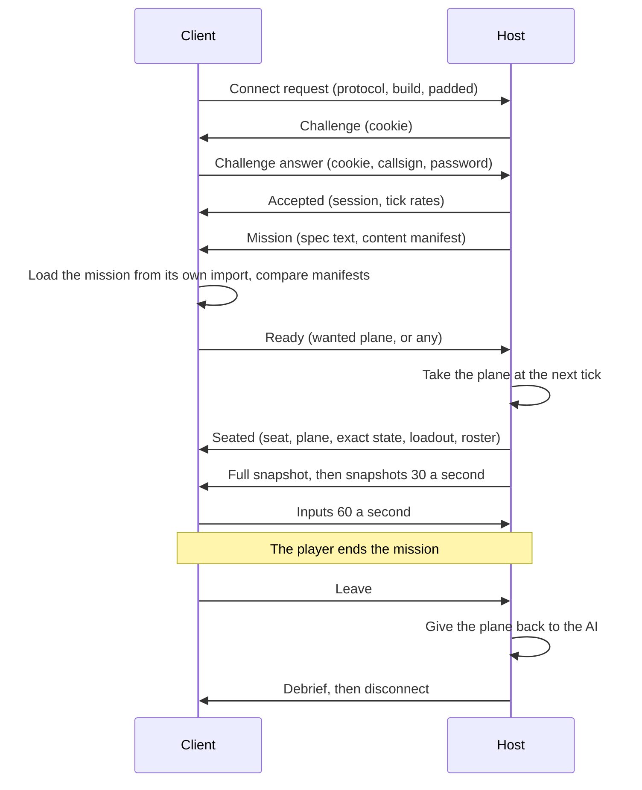
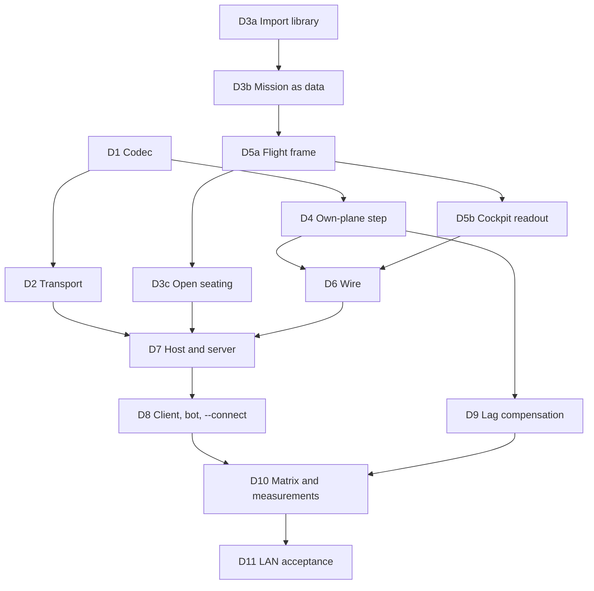

# Initial architecture

> **T.O.R.E: Tasteful Opinionated Reverse Engineered.**
> The thing being reverse engineered is the *experience*, not the executable. We
> trace what a player does and what the game does back, down to the numbers they
> would notice. How the original code achieved it is history: useful evidence,
> never a blueprint. If a sentence below reads like an instruction to reproduce
> the original's internals, it is out of date.
> <!-- tore-header v2 -->

The M0 environment supports the M1a menu slice, the M1b renderer across all 16 theaters, and M1c free flight in twelve aircraft (see the [roster guide](aircraft-import.md)) plus a development weapons range. M0's full title census, salvage inventory, parity specification, and AI VM decision remain open.

| Component | Choice | Purpose |
| --- | --- | --- |
| Language | Rust 2024, compiler 1.91.1 | Reproducible native builds |
| Workspace | `crates/tore-app`, `tore-formats`, `tore-import`, `tore-extract`, `tore-sim`, `tore-input`, `tore-input-native`, `tore-diagnostics-native`, `tore-replay`, `tore-world`, `tore-codec`, `tore-net` | Desktop shell and entry point, plus the format, import, extraction, simulation, input, mission recording, mission core, network encoding and network transport (both standard library only) crates |
| Window/input | `winit` 0.30 | Native window lifecycle and input |
| Graphics | `wgpu` 27 | Metal on macOS; native backends for Windows/Linux |
| Diagnostic facade | Existing `log` 0.4 and `tracing` 0.1 | Bounded app/backend logs without a logging framework |
| Startup bridge | `pollster` 0.4 | Wait for GPU initialization without a general async runtime |
| Audio device | `cpal` 0.16 | Native output for the small PCM mixer; [upstream API](https://docs.rs/cpal/0.16.0/cpal/) |
| Formats | Dependency-free `crates/tore-formats` | Bounded EALIB, raw-literal DCL, PIC/glyphs, a narrow CHOOSEAC DLG reader, BIT2, mission environment fields PL weather palettes, BRF aircraft/equipment, bounded SH projection and compiled FNT glyphs |
| Simulation | `crates/tore-sim` | Shared 120 Hz state/attitude, selectable hybrid dynamics, the shared aircraft sensor component and headless aircraft acceptance |
| Extraction | `crates/tore-extract` + `tools/extract_assets.py` | Title-independent archive discovery/extraction, safe output paths, provenance |
| Checks | Cargo, Python standard library, GitHub Actions | Local and CI checks |

These are baseline-compatible versions, not automatically the latest versions. Exact versions live in `Cargo.lock`. See upstream [wgpu 27 documentation](https://docs.rs/wgpu/27.0.1/wgpu/) and [winit 0.30 documentation](https://docs.rs/winit/0.30.13/winit/) for API contracts.

The shell creates its window on the main event loop and uploads a 640 × 480 RGBA menu canvas to a Metal/native GPU texture. The shader draws a scaled, letterboxed image using linear filtering. The same viewport calculation maps physical mouse coordinates back into retail coordinates, including Retina scaling. It handles zero-sized windows and recoverable surface loss. Fatal graphics/startup errors return a failing process status.

`tore-import` (`crates/tore-import`, standard library and `tore-formats` only, so a server can use it without the windowing, graphics and audio libraries) holds the whole import. Its `media_source.rs` decides what a chosen folder is by its contents: an installed game folder with loose archives, or a disc folder holding the Electronic Arts installer container (`SETUP.ESA`), whose stored archives are read in place by offset rather than copied. `tore-formats::executable` maps the executable's hash to one of the two reviewed builds and supplies that build's table addresses, so the disc's 1.0 build and the 1.02F patch decode the same content; an unknown build is refused before any archive is opened. Its `import.rs` selectively decompresses resources into a versioned local pack and verifies the pack from disk before the import completes, reporting progress by archive and resource count; `pack.rs` reads and writes the pack and loads the newest good one. The game's `assets.rs` calls it and adds what only the game needs: it validates and decodes the menu art, buttons, fonts and debrief art from the loaded resources (the library takes that check as a function, so a set the game cannot draw never reaches the cache). `menu.rs` composites original background, button pieces, and font strips and owns UI state. `renderer.rs` owns the surface, texture, and scaling. Every game object is built from imported assets before the window opens and the renderer needs a terrain world, so a first run cannot happen inside the game application: `main.rs` runs a pre-game shell, a second winit application handler holding `locate.rs` and the blit-only presenter in `canvas_present.rs`, on the same event loop through `run_app_on_demand`. Re-import from Pref ends the game application and runs the shell again; the event loop is created once. `audio.rs` mixes bounded local PCM, recorded music, and up to sixteen spatial voices with linear resampling into the device rate. `tore-sim::acoustics` advances sound wavefronts and passing-object detection at 120 Hz. Combat publishes bounded sound emissions with physical positions; the app uses the main camera as listener and the device mixer supplies stereo direction, distance gain and treble fade. An emission released by the player's own aircraft plays centered and without distance while the listener is in that cockpit; every other outside sound is muffled in a cockpit view. Up to ten looping sources (crash fires, other aircraft's engines) and, in external views, the player's own engine are placed with distance, stereo and Doppler pitch. See [audio behavior](audio.md). Explosions, craters and crash-site fires are drawn by `effect_renderer.rs` from the original sheets as textured sprites ([explosions](spec/explosions.md)). Audio initializes independently and can fail without blocking menus. No input device or microphone is opened.

The app and general extractor share the same EALIB/DCL readers. `Archive::open` reads a directory and seeks to selected resources; it does not load whole disc archives. The menu retains a 16 MiB resource cap; the general CLI has an explicit configurable cap for larger media. The Python entry point handles portable invocation and SHA-256 report enrichment; it contains no second decompressor.

Menu-only startup randomness chooses one of the five native backgrounds independently of future simulation state. The selected background's embedded palette colors shared sprites/fonts, and native bar offsets keep controls aligned. Hover/focus notifications do not enqueue audio.

Menu drawing uses CPU composition for this small static canvas; it is not a commitment to software-rendering flight scenes. The window sleeps while idle. Hover transitions and transient placeholder messages schedule temporary redraws. The fragment shader is authored source; it contains no retail bytes.


`tore-import` retains prior cache generations until a new import is synced and
validated from disk. Successful import and startup load remove older numbered
packs from that cache directory. Cleanup is best effort and does not touch
source media or extracted assets. [Retention contract](spec/import-cache.md).

## Startup diagnostics

`diagnostics.rs` installs a bounded `log` sink and panic hook at the start of
`main`, before preferences, assets and the event loop. Existing wgpu logging
and winit tracing feed the same sink. Startup stages and first presentations
are explicit checkpoints; simulation behavior and adapter choice are unchanged.
`startup.rs` owns unattended-dialog policy and media-free success, failure,
panic and synthetic graphics checks. Main-thread unwinding produces a fatal
report and a nonzero exit rather than resuming gameplay.

`tore-diagnostics-native` is a second narrow audited OS boundary. Its safe API
shows Windows MessageBox/AppKit errors without creating the game renderer and
writes Windows Application events. Linux notifications use an optional bounded
`notify-send` process. The app and simulation retain their unsafe-code ban.
The MSI registers the source against the executable's embedded message table.
The existing platform bindings and `log`/`tracing` dependencies are reused;
there is no additional GUI or logging framework.

File paths, retention, fallbacks and failure limits have one home in the
[startup diagnostics contract](spec/startup-diagnostics.md). Release packages
exercise the actual staged and extracted executable; desktop installation
acceptance remains separate.

## Boundaries for menu work

Keep `tore-formats` independent of windowing and GPU APIs. The future simulation likewise needs to run headlessly with deterministic inputs. Avoid empty placeholder crates or premature engine abstractions.

Menu rendering should consume decoded palettes, indexed images, font data, and recovered layout geometry. Recover specifications from the TypeScript reference; implement runtime behavior in Rust. Do not introduce a web shell, copy the Three.js engine, or select a modern widget toolkit before checking retail geometry requirements.

Import user-owned media at runtime into platform application data. The v1 pack is a development cache of selected decompressed resources, not a stable mod/save format. `gameassets/` is a local source-media convenience, not a runtime bundle or save-data location. See [menu formats](formats/menu.md) for the current limits and provenance.

## First simulation renderer

World image pages share a bounded 1024-square array, with sixteen logical pages
per layer. `static_art.rs` retains large scenery pictures at source resolution
and clips face geometry at page boundaries. Material-local storage metadata
keeps rectangular aircraft/smoke images and paged world/weather art distinct.
All sample, palette-remap and shadow paths use the corresponding addressing.
[Source coverage and static variant composition](spec/terrain-detail.md).

`terrain.rs` (in `tore-world`) builds `Terrain` from the selected retail MM and its resolved T2: the grid, the airport scene and the weather clock, with the height, surface and wind queries the simulation uses. It holds no art and reads no environment variable. `scenery.rs` builds `Scenery` from the same resources and the finished `Terrain`: the named or numbered texture references, DAY2 variant palette, terrain mesh, sky art, static airport geometry and per-camera weather. Neither has a GPU or window dependency. `sim_renderer.rs` uploads geometry and a texture array, owns depth targets and draws terrain plus a fullscreen sky pass; `terrain.wgsl` supplies the initial perspective, sampling and fog. `renderer.rs` composes this scene with the transparent CPU HUD, resizing depth and surface together. This separation allows aircraft/object/weather passes and a deterministic simulation to be added without coupling format readers to wgpu.

The initial implementation uses full-resolution fixed triangles and an authored sky/fog projection. It is not the native adaptive renderer. All geometry/colors come from local source data at runtime; no retail derivatives are embedded. See [theater findings](formats/theater.md) for recovered versus authored behavior. The Hornet adapter now advances at 120 fixed ticks/second; the developer free camera still uses elapsed wall time for inspection.

The creator selects among all 16 base theaters. Scene replacement rebuilds the GPU vertex/texture buffers for that world; a variable texture-array layer count also supplies the sky shader's layer index. Only the active world mesh is built, while the bounded source bundle remains cached. Maps and fonts stay in the menu compositor. Source text shading is preserved when tinting; ARMFont/SMLFONT replace the unsuitable BODYFONT in the investigation UI and notices.

The Hornet slice adds dependency resolution and bounded BRF/SH/FNT readers to `tore-formats`. `tore-sim::flight` contains fixed-tick state/integration without wgpu/winit dependencies; the app re-exports its interface; `aircraft.rs` adapts imported geometry and camera poses, and holds `Airframe`, which wraps the simulation's `AircraftType` (`aircraft_type.rs` in `tore-world`: the imported profile, flight model, sensors and engine outlet points, with no art) beside the drawn half. `instruments.rs` renders independent small rasters from flight/equipment state, each framed by the aircraft's own original instrument window picture (named by its HUD) and coloured every frame through the live cockpit palette, as the cockpit art is; page content draws in coordinates relative to the 138×114 screen ([bezel spec](spec/instrument-bezel.md)). The GPU terrain pass now accepts an aircraft vertex stream and original rectangular atlas with shared depth; front/other instrument cameras render offscreen. CLI extraction and cache import share the same dependency resolver. These adapters do not execute imported x86 modules. See [aircraft evidence and open questions](formats/aircraft.md).

`surface_lighting.rs` owns three geometric shadow maps and the shared light
uniform. `surface_lighting.wgsl` supplies continuous diffuse response, solar
warmth, orientation-dependent fill, painted-panel highlights, cloud transmission
and shadow sampling to terrain, aircraft and weapon
surfaces; sky/cloud shaders share its solar tint helper. Opaque batches enter
the shadow pass before the world pass. Partial sunrise/sunset uses the solid
disc's visible area and segment centroid for direct light and shadow direction.
Manually filtered depth neighbors each use receiver-plane correction and
continuous blocker weights. The bounded penumbra filter combines caster
distance with smooth camera-distance antialiasing. Terrain has a separate
stream of area-weighted shared normals for lighting; shadow depth still uses
actual triangles. Smooth sky, glare and shadow directions share fractional
weather-clock time. Sun-disc strength and geometric visibility are independent
of the sunglare toggle. Terrain alone reduces low-sun ambient fill on unexposed
slopes; exposed ridges, aircraft and water retain their existing response. Smooth aircraft geometry is complete,
including faces hidden from the camera, and hiding the player in cockpit view
does not remove its shadow caster. Material layer -6 identifies emissive combat
effects and -7 identifies textured flame sheets. Glass and flame sheets do not
cast solid shadows; ordinary cutout surfaces cast only their opaque texels. Stepped
mode retains palette lighting and camera face rejection. See the
[surface specification](spec/surface-lighting.md) for fitted limits.


`flight_views.rs` resolves manual-described camera relations from read-only flight,
combat and wing snapshots. The camera rig owns only presentation state: the
reference, last player missile, fixed fly-by position and saved Other View.
Weather, spatial audio, main rendering and the Other View panel use the same
camera rules. Remote aircraft/missile interior cameras hide the reference body without removing
it from simulation. A replay builds the same scene from recorded poses, and any
aircraft can be the reference. [Behavior and fitted constants](spec/flight-views.md).

`flight_ui.rs` owns desktop command dispatch, the imported menu's flight actions, session presentation settings and pause state; the menu's navigation, hit geometry and drawing are `pause_menu.rs`, shared with the replay viewer. `hud.rs` draws the forward-flight HUD from state and source font glyphs, projecting the ladder/path through the renderer's 60-degree camera convention. Simulation remains independent of both. The full-canvas cockpit is transparent art over the world; instrument windows are independent rasters. Menu/focus pauses stop fixed ticks and engine loops, and input transitions clear held controls. Shader zoom is shared by terrain and sky projection; camera previews restore the main camera before drawing.


`flight_canvas.rs` now composes the flight-only overlay at an aspect-responsive size (physical drawable, proportionally capped at 1920×1080). The separate GPU cockpit pass preserves uniform cover-fit in the centered forward view, and instrument layout rectangles anchor to actual edges. Native instrument rasters go directly to their destination sizes instead of passing through a reduced 640×480 composite. The original cockpit texture is uploaded once; unchanged scaled panel rasters are cached. Alpha-aware filtering prevents dark transparent borders. `renderer.rs` recreates its UI texture when dimensions change and uses the full viewport for flight; menus/viewer overlays retain their existing canvas. Pointer conversion uses the same responsive panel rectangles, while the centered pause menu retains menu coordinates. HUD metadata uses a 0.7225 layout scale, including the requested additional 15% reduction. Projection compensation preserves angular cues through resizing and portrait aspect.

`tore_sim::autopilot` owns captured heading/altitude, mode and an optional
world-space navigation target. `State::step_surface` consumes mode switches,
applies pilot override and generates control deflections before the selected
flight adapter runs. The HUD reads this state. See the
[autopilot specification](spec/autopilot.md).

### Flight presentation and measurement

`flight::State` remains authoritative at 120 Hz. `main` retains the preceding tick for render-only pose interpolation (shortest-path wrapped angles); pause/crash show authoritative state and restart resets history. Camera, exterior geometry and HUD consume the same presented pose. Everything else combat draws is captured once per tick, after the AI step, as a plain-data `RenderSnapshot` (`snapshot.rs`, which holds the pose types, the devices, `interpolate` and `blend`, and no drawing code): other aircraft with their devices, damage and wreck state, fixtures, weapons, effects, debris and ejected pilots, plus the player's own pose. Combat keeps the last two snapshots (`previous_snapshot`, `render_snapshot`), and the app's `CombatView` (`combat_view.rs`) holds the frame's tick fraction and blends them; the main view, mirrors and camera panels draw that blend through the shared `aircraft_batches` and `combat_geometry` helpers of `render_snapshot.rs` (the vertex building, with `CombatArt` and the afterburner light helpers), with the art and the other aircraft's models from the view, which a mission replay uses to draw a recording, so both show the same picture. Each pose also carries whether its afterburner flame lights the scene; the shared `afterburner_glow`, `target_glows` and `engine_outlets` helpers turn those into lights at the presented poses. Chaff and flares are not part of the snapshot: live flight hands the countermeasure renderer the combat state's devices, and a replay the same devices flown again from their recorded releases (`replay/devices.rs`). `replay/convert.rs` turns each snapshot, plus flight data it does not carry, into a `tore-replay` frame and a decoded frame back into a snapshot; a synthetic round-trip test draws both through the shared helpers and requires every vertex within the format's 1/64 ft position precision. Reset clears that history. AI gear, flap, hook, brake, bay, exhaust and control-surface samples use that
same render fraction; an aircraft whose AI stopped flying holds its last
devices, and fixtures retain their fixed devices. Audio consumes
authoritative state. No renderer smoothing feeds back into physics.

World camera depth uses `Depth32Float`, storing the near plane at depth 1 and
the far plane at depth 0. Using the near and far distances, the vertex shader computes clip Z as
`near * (far - view_z) / (far - near)`, then perspective division yields depth.
Depth clears to zero and nearer fragments compare greater. The existing near
plane and 2,200,000-foot far limit remain. Aircraft, terrain, static objects,
clouds, smoke, vapor, chaff, flares, flare glare and the spotting aid use
this same mapping. The separate
orthographic shadow maps keep their existing depth convention. This is an
agent-selected host correction for distant surface flicker; see
[NVIDIA's depth-precision analysis](https://developer.nvidia.com/blog/visualizing-depth-precision/).

Theaters are about a million feet across, where a 32-bit float steps 1/8 foot,
so aircraft built in world coordinates snapped a little differently every
frame and shimmered in exterior views. Camera positions are kept in f64, and
each frame `Scenery::set_origin` picks a render origin: the camera position
snapped to a 1,024-foot grid, shared by every camera that frame. Aircraft,
ejected pilots, weapons, debris, tracers and effects are built relative to it
(`Scenery::local`), and the scene uniform carries the origin and the camera's
exact offset from it. `object_vertex` and `shadow_object_vertex` place those
vertices through the offset; terrain and airports stay in world coordinates
and reach the camera through the origin, so only their own storage rounding
remains. Smoke, vapor and countermeasures stay in world coordinates. An origin
of zero reproduces world-coordinate vertices exactly.

Active simulation views request the next redraw without a post-render timer; AutoVsync and a requested maximum frame latency of one provide presentation backpressure. Idle menu behavior is unchanged. Failed/zero-size presentation does not continually schedule simulation redraws. `performance.rs` provides opt-in bounded CPU wall-time sampling via environment variables, with warmup exclusion and view cycling.

The GPU cockpit texture survives view and size changes; projection uniforms track the current aspect. Aircraft GPU resources are prepared when the renderer/theater loads. Live camera panels submit bounded asynchronous readbacks (at most one pending per camera page), consume completed rasters on later frames, and retain their last image while pending. The simulation renderer caches world-pass attachments (depth, multisampled colour and the render-scale image) for up to five output sizes, so the display, mirrors and 138×114 panels do not reallocate at every refresh. World pipelines live together in `sim_renderer::Pipelines` and are rebuilt when the anti-aliasing sample count changes. After the world pass, an optional resample pass scales the render-scale image to the output, and the spotting-aid pass draws single-sampled outlines using the world depth; `graphics.rs` holds the options and the [graphics options](spec/graphics-options.md) page specifies them. Offline captures retain an explicit blocking readback so smoke evidence contains the requested image. Direct GPU panel composition, full GPU UI rendering and native terrain LOD remain future optimization work.

`look.rs` owns authored held-key classification, look limits and exterior spherical orbit. Shift arrows are isolated from flight input and retain their look classification until physical release, including after modifier changes; Ctrl arrows, FA's thrust vectoring, do nothing yet. Camera motion uses elapsed presentation time while unpaused. Internal elevation is limited to the forward eye line through overhead; exterior orbit keeps a fixed radius and aims at the same interpolated aircraft pose. It does not alter simulation state or synchronously capture the GPU.

### Continuous attitude and momentum

`attitude.rs` supplies body bases, Rodrigues rotation, orthonormalization, and render interpolation. `flight::State` retains separate world velocity and pitch/roll response rates. The old pitch clamp and nose-derived position update are removed. Force integration and attitude response remain deterministic at 120 Hz; render interpolation does not feed back. `look` uses the same body basis for head rotation, while exterior orbit retains aircraft-centered inspection behavior. The HUD flight-path marker projects actual velocity bearing/elevation.

`cockpit_renderer.rs` and `cockpit.wgsl` project the complete original forward artwork and the 640×480 HUD raster through one aircraft-fixed plane. Relative eye/body axes move both layers together during head-look, independently of aircraft attitude. The pass draws after the world and before screen-anchored instruments/menus, including offline captures; camera instrument readbacks exclude it. A cached source-size glass mask follows the cockpit transform and clips the HUD when cockpit art is visible. The shader composites masked HUD behind cockpit art and mirror contents; cockpit-off/wide view bypasses the glass mask. Linear premultiplied sampling preserves transparent borders. HUD uploads and uniforms are nonblocking; resize does not rebuild the source texture. The sky shader projects SKY0 onto a finite hemisphere disk with `ray.xz / (1 + max(ray.y, 0))`, avoiding the latitude/longitude singularity and seam at zenith. Native sky mapping and full 3D cockpit geometry remain unimplemented; the projected source plane has finite coverage and cannot provide a rear/overhead interior.

The shared hybrid adapter and its recovered-versus-fitted boundaries are specified in [FLIGHT-MODEL.md](FLIGHT-MODEL.md). Scalars resolve once when constructing the aircraft-owned typed configuration; immutable model data are shared by presentation snapshots and envelope queries allocate no temporary hit vectors. Renderer-specific Hornet animation tests remain in the app.

Aircraft-specific fitted laws live in `tore-sim::models::{f18,rafale_c}`, selected
through `AircraftModel` and the `FlightModel` interface. Each owns independent
validated configuration covering mass, propulsion, envelopes, recovered departure/contact limits, equipment response and tuning. `State` holds the selected model; `Research` holds only evolving departure/contact/clock state. Updates take no raw aircraft argument. Integration and recovered algorithms are shared components.
`tore-sim::telemetry` exposes gauge-independent air/ground/altitude channels with
explicit units and unavailable sensor readings; analog gauge presentation must
remain downstream of this interface. See [model extension guide](FLIGHT-MODEL.md).
`State::trace` keeps a write-only `FlightTrace` of the last step's values and
applied effects with their causes, for the telemetry panel and replay logs;
nothing in the simulation reads it and it takes no part in state equality
([telemetry record](FLIGHT-MODEL.md#telemetry-record)).

## Shared physical input

`tore-input` is a dependency-free safe Rust crate for physical control bindings,
calibration, per-source contribution/ownership, context release rules, typed pilot
frames and bounded input tapes. `tore-sim` consumes those frames at 120 Hz and no
longer interprets keyboard names. Aircraft configuration and control response stay
in the respective model modules. The app translates keyboard/menu actions and
routes instrument focus to the existing stock controls.

`tore-input-native` owns a dedicated bounded device worker: Linux evdev/rumble,
Windows raw-controller readings/Gamepad vibration, and macOS GameController/
CoreHaptics plus generic HID queues. Apple gamepad input and haptics share the same
retained controller; public HID support queries suppress duplicate raw endpoints. It and the diagnostics boundary
permit audited unsafe platform FFI; `libc` and `windows` are thin platform bindings,
not a third-party input policy engine. Main-loop discovery never blocks a flight
frame. Presentation-only look resolution cannot change pilot-axis ownership.
It also runs the head-tracker receiver: a safe `std::net` loopback UDP socket on
its own thread that reads opentrack poses. Head and mouse look add to the
presented look angle only; they never touch pilot axes or the simulation.
See [contracts, platform limits and profile syntax](INPUT.md).

The app's input configuration screen (`controls_editor`) is one component opened
from the main menu and the paused flight menu. It owns a draft
`tore-input::Profile`; native capture is isolated from menu/gameplay dispatch.
`input_catalog` is the single table of listed actions and stock keyboard/mouse
assignments; it drives the screen's rows, stock-key remapping (`disable`
directives) and the generated [controls master list](CONTROLS.md). Canonical serialization validates
before file replacement and live rebaselining. General display/instrument/sound
preferences use a separate bounded versioned file and persist independently of
flight/aircraft state. Smoke/capture/performance diagnostics bypass those preferences.
Afterburner feedback combines a renewable finite low rumble with the engagement
impulse; context loss cancels both, without changing authoritative flight state.

## Manual combat and systems

`tore-sim::combat::live` owns the deterministic manual range at 120 Hz. Typed
configuration resolves each supported PT’s loadout, SEE/ECM equipment and damage
table once; mutable ammo, projectiles, hit points, subsystem counts and
adapter RNG remain in state (per ownship for the aircraft's own fields, see
[Combat: one ownship per human-flown aircraft](#combat-one-ownship-per-human-flown-aircraft)). Contacts are no longer its own: it holds a
`tore-sim::sensors` live state, feeds it ownship pose, equipment state and the
observable targets each tick, and asks it whether a specific target is supported
before a radar weapon launches. Physical airborne presence is separate from
destroyed combat state, so hit points reaching zero does not erase a return.
`combat::systems` contains bounded translations of
reviewed ECM probability and damage-selection helpers. Unknown native subsystem
side effects remain explicit gaps; the service reproduces combat behaviour rather
than reconstructing the original executable's combat tick.

`combat::ledger` records every projectile from its first step to its outcome
(hit with damage, missed, spoofed by a decoy, jammed), keyed by shooter,
intended target and retail weapon class, plus credited kills and each target's
last attacker. Nothing in flight reads it. The evaluator in `tore_world::debrief`
turns it into a report, and the app's `debrief.rs` keeps the screen that draws
the post-mission pages; `ai_wings.rs` (in `tore-world`) supplies the intended target of AI gun rounds and
reports decoyed missiles. See the [debrief spec](spec/debrief.md).

`combat::gunsight` supplies a renderer-independent fixed-step gun solution using
live projectile speed/drop helpers and current radar observations. `weapon_hud`
draws its pipper/range arc and projects a selected target into a square or edge
chevron. Combat retains a separate display-only target identity through sensor
loss; this never substitutes for `sensors` launch support or radar observations.
[Behavior and evidence](spec/gunsight-targeting.md).

`ai::gunnery` uses the same trajectory solver with explicitly permitted visual
or sensor observations. The controller chooses gun tracking through ordinary
flight inputs and authorizes individual rounds. `ai_wings` rechecks barrel
alignment after flight movement, debits one round only when emitting it, and
launches along the mounted forward axis. Shared live combat applies dispersion
and collision, excluding the shooter. See [gun employment](spec/ai-gun-employment.md).


The app merges independent keyboard/controller trigger holds, dispatches explicit
commands and consumes confirmed events for instruments, graphics, audio and the
bounded feedback mixer. Two-control modifier bindings consume their base controls
and require neutral release across layer/context changes. Native feedback errors
disable that device’s feedback until reconnect; finite leases and context stops
bound rumble. Combat notices reuse the existing HUD line and expire in simulation
ticks, so pause does not age them or expand overlay composition work.

Version-3 combat tapes record service inputs including jammer state, the player
sensor controls (channel, display range and history) and explicit fixture
commands; a designation is recorded by stable target identity, never by screen
coordinate. Replays validate identity/assets and reproduce combat state,
including adapter RNG and subsystem failures. Version-2 tapes still replay with
the default sensor controls; version 1 rejects explicitly. This
is combat-service determinism: it reproduces combat state, not a full application
replay. See [contracts, validation and limitations](baselines/weapons-systems.md).

## Additional aircraft

The aircraft registry includes F-14D, A-4E, X-31 EFM and the seven
[roster additions](spec/roster-aircraft.md). Each owns a typed
model configuration; presentation rigs remain in tore-app. Shared combat resolves
the selected identity's sensors by parsed record channel, never by aircraft name,
and reads its PT stations. Audio switching clears old
aircraft voices. See [aircraft behavior](spec/additional-aircraft.md).

The optional user-supplied [engine material](spec/engine-material.md) replaces reviewed burner
face materials at runtime. Its throttle glow is separate from the retail atlas
and does not change A-4E presentation or flame geometry.

Researched flight is now the default; `--legacy-flight` preserves the previous
model. HUD and audio share the [stall warning signal](spec/stall-warnings.md),
including the original imported warning samples.

Aircraft-owned exterior fits for the seven roster additions live in
`roster_animation.rs`, with reviewed source branch membership in
`additional_animation.rs`. The [animation contract](spec/aircraft-animation.md)
defines their presentation. F-22 bay fraction advances at the shared 120 Hz;
the renderer interpolates it, and manual combat can request it without changing
launch eligibility. Exterior canopy grading is a mesh material, independent
of cockpit artwork and world-view rendering. Its nearest surface is resolved
in a depth-only pass, then blended at 75% opacity over the opaque scene.

## Shared sensor boundary

`tore-sim::sensors` is one component serving all twelve imported aircraft. There
is no aircraft-specific radar code: `profile` normalizes each PT's own SEE and
ECM records into typed capability profiles resolved by parsed signature channel,
`signature` holds the single observer-relative aspect function, `detection` holds
the authored range model, `track` holds the live state (current observations, one
selected target, at most one acquired fire-control track across radar and
infrared, bounded history and received interference), and `passive` collects
received emitters for the exposure instrument. An unreviewed radar or ECM record
is an import error rather than a silent substitution.

The component decides what is observable and whether a specific target is
supported for a radar weapon. `tore-app::scope` only reprojects those shared
observations for drawing and picking, so the page cannot make a hidden target
selectable, and one projection serves both drawing and the mouse pick.
`instruments.rs` draws pages 9 and 0 from that input. Player controls (channel,
display range, history) travel as a per-tick input, which is why the combat tape
reproduces them. The flight adapters and renderer independence are unchanged.
[What is modelled, what is authored tuning and what is deferred](radar.md);
[what was validated](baselines/radar.md).

Missile profiles and the fitted finite-boost motion predictor live in
`combat::missiles`, independent of rendering. Its 120 Hz prediction shares live
lead steering, turn limits, maneuver losses and propulsion. The live adapter
refreshes the bounded maximum-range search at 2 Hz per selected observed target. The live adapter uses full release
velocity for accepted missile profiles; compatibility retains scalar source
motion. Explicit target role is separate from damage category. Launch-origin
minimum-range qualification persists through terminal closure, as specified in
[engagement rules](spec/missiles.md#minimum-engagement-and-target-role). Combat tape version 4 includes world velocity and bay permission, while versions 2 and 3
select compatibility rules. [Missile specification](spec/missiles.md).

Combat tape version 5 records radar power separately from transmission, preserving
passive-channel behavior and radar-off unguided releases. Versions before 5 imply
power on for the new guidance gate. Version 4 remains the missile rule-version boundary. Seeker mode and
controlled target heat/emission changes are recorded commands; seeker observations
and acquisition are reproduced from those inputs, the matching asset fingerprint
and terrain. `--combat-command compatibility-weapons` explicitly selects the old
weapon adapter. Flight adapter selection is independent. Fitted seeker synthesis
consumes the mounted-seeker amplitude and never controls acquisition. A tape does
not record the mission wind or the host turning a crashed flight into a dead
player: a replay is given the theater's wind, so smoke and countermeasures drift
as they did live, but a session in which the flight crashed replays with the
player alive.

`ai::damage` reads live component failures and proposes recovery and control
restrictions. `AiActor` latches the recovery commitment, uses the existing
landing path, and applies protective throttle commands to every real flight
path. The diagnostic damage trace is write-only. Dummies bypass these decisions
and flight stepping. Fire enters the existing per-pilot ejection monitor.
[Contract](spec/systems-damage.md#ai-pilot-response-to-faults).

Quick Mission launches AI wings by default; `--fixture-wings` retains the
straight-flight compatibility path. `Combat::mission_aircraft` retains the six
wing groups and their fitted spawn poses for restart. `AiWings` builds actors
after reset. AI emits aircraft inputs and the flight model alone advances
its pose; no steering pose overwrite follows physics. The bridge mirrors results into `combat::live::Target` for sensors,
rendering and damage. Each wing follows its own current leader from the shared
world snapshot ([lead succession](#lead-succession)); a human-flown aircraft
remains outside the AI actor list and is one world object in that snapshot.
`ai::awareness` owns timestamped current observations and frozen aircraft memory
for each actor. Only current observations enter target selection, weapon geometry
and firing; lost hostile records enter a separate controller search input. The
AI lookout is skill-filtered independently of imported player sensor
profiles, with six timed body directions and attention to a last measured point, and the mission terrain query masks visual and radar/infrared sensing.
Production sensor loading fails explicitly rather than enabling the sensorless
synthetic-fixture path. SEARCHING/ACQUIRING/REJOINING are simulation activities
read by Target view. [Behavior and limitations](spec/ai-awareness.md).
`combat::threats` owns bounded missile observations for every receiver, including
the player RWR. Controllers consume copied threat records through `ai::defense`;
they cannot inspect live missiles or private launcher targets. `ActorSupport`
snapshots bind each guided projectile to its own launcher, and the shared
seeker lifecycle supplies actual pitbull and support-loss state. Countermeasure
bursts are scheduled/debited by the mission before the bridge applies decoy
rolls. RWR drawing reads the same records and never drives the decision clock.
`ai::incoming_fire` observes gun rounds through the pilot's lookout and terrain
query. It retains only consecutive visual samples, anonymous close passes and
weapon-hit cues, never a hidden shooter identity. The app forwards victim-only
combat hit events, and copied round positions before the mission step. The
mission compares fire and missile urgency and supplies one `DefenseMotion` to
the controller. Gunfire does not request devices; valid missile bursts continue
through the existing scheduler. [Contract](spec/visual-awareness-under-fire.md).
`ai::engagement` gates current target selection by role and stance before B41
ranking. Quick Mission initializes a separate neutral engagement gate for every
actor. Accepted combat orders release it; formation and disengage commands
recall it without rewriting mission objectives. Recall suppresses repeated
offensive reactions to known projectile IDs while retaining missile evasion.
AI leaders release neutral wing members after a perceived attack or a current
hostile contact allowed by their mission. Recall prevents contact-only release;
existing individual orders survive an automatic wing release. Commands are
delivered after all same-tick decisions. `AiMission` delivers perception-only attack reports to assigned escorts and wing leaders
on the next tick, with a fixed expiry; bearings never become synthetic targets.
Escorts also assess detected aircraft against each assigned friendly's protection
zone using observed relative motion. Confirmed attackers outrank prospective
threats. Frozen contacts can guide investigation but still cannot authorize fire.
Quick Mission group objectives resolve through stable side/wing/member metadata
into per-actor assignments. Whole-group survival requirements are stored separately from combat orders.
The Target window combines player assignments, these requirements and allegiance
to select a typed Survive/Destroy label, with no label for other contacts. Source missions and
campaign outcomes remain outside the M1 assignment adapter.
`ai::formation` owns routine repositioning, trailing, breakout, intercept, stabilization and
capture guidance. Traffic and arrival states are snapshotted before any actor
advances, so iteration order cannot grant approach priority. Its trace hook is
read-only; optional host CSV logging is described in
[development diagnostics](DEVELOPMENT.md#formation-flight-traces). The formation
choice and placement are specified in [mission wings](spec/quick-mission-menu.md#mission-wings).
`ai::thought` holds the write-only [AI thinking record](REPLAYS.md#ai-thinking-record): controller and actor traces of each tick, a log of random draws, and a message journal the host drains once per tick through `AiWings::take_ai_journal`; no decision reads them, and golden fingerprints prove the AI behaves exactly as without them.
Rendering groups targets by imported airframe, with a cached
texture binding per identity and vertex buffers that grow to fit the formation.
The player's atlas is never substituted for another type. Fixed-step timing and
the three player flight adapters are unchanged. Normal flight loads supported default stores;
restricted native research flight keeps its clean configuration.

`combat::smoke` owns bounded, fixed-step puff histories independently of rendering
and guidance. The app supplies engine outlet positions once per combat tick;
contrails retain two minutes of history in a separate 72,000-puff budget.
[Smoke and contrail rules](spec/damage-smoke.md) define rates, size and fade.
The app's smoke pass retains original indexed smoke artwork and resolves it
through each camera's current weather palette and haze remaps. Clouds and smoke
share directional sunset lighting and air/cloud occlusion. It sorts keyed
billboards for each camera, blends them without depth writes, and depth-tests
against the world. It culls offscreen puffs without deleting their history,
then uploads one 24-byte instance per visible puff; the vertex shader builds
its six billboard vertices. Age and expiry remain fixed-step CPU state.
Coverage is premultiplied only after lighting to preserve transparent edges.
Gun release dispersion is sampled once in the shared fixed-step projectile
path using a stable projectile-identity hash. Cannons release individual physical
bullets at a fixed-step cadence; every third bullet draws one tracer ribbon,
without a duplicate projectile mesh. Ribbons follow the actual swept segments. A separate additive material pass supplies self-lit cores and halos
without depth writes or shadow casting; solid depth and atmospheric attenuation
still obscure them. [Gun behavior](spec/damage-smoke.md#gun-dispersion-and-luminous-tracers).
Aircraft damage keeps six aircraft-local accumulators beside the existing hit
points. Gun segments intersect fitted nose, cockpit, core, wing and tail volumes;
surface objects remain on their ordinary object damage path. `damage_art` packs
intact and damaged PICs losslessly into one runtime atlas per identity. It adds
persistent imported-texture marks at light regional damage, then selects a
reviewed A/C body only when its missing region matches the hit. Other regions
use fitted, mirrored face clipping. Damaged shapes bypass intact-model animation
address maps.

`combat::debris` computes both fitted A/B and C/D attachments from inert shape bounds and advances
pieces at 120 Hz with inherited velocity, gravity and tumble. First swept terrain
contact retires a piece and creates a short visual ground impact. The runtime
atlas also contains the matching fragment textures. Fragment state belongs to
combat simulation, so replay and rendering consume the same breakup lifecycle.

Quick Mission's `ai_wings` bridge mirrors live actor poses and damage, while
combat retains movement ownership of wrecks. Each AI projectile carries its
own weapon record; rendering resolves its shape by resource name, independent
of the player's station numbering. The simulation owns delayed warnings,
individual dispenser releases and scoped wing requests. The app realizes
those events in the existing projectile and effect services. See the
[AI integration contract](spec/ai.md#live-integration-and-authored-boundaries).

Wing commands use `AiMission::order_wing_report` for scoped per-recipient
outcomes. The player bridge resolves orders and applies B43 control effects;
AI requests use the same B46 receiver after all actors decide. `ai_wings/orders`
and `reports` keep delivery and advisory text separate from physical steering.
`audio::Mixer` owns a bounded serial radio queue, independent of simulation
execution. `tore-formats::radio` reads reviewed inert phrase records during
import; the existing archive and PCM readers load original recordings.
Radio chatter is observation only: `ai_wings/chatter` turns mission output
into events, combat's strike list attributes projectile damage, and
`radio_calls` words them and applies the listener rule before `comms` delivers
them. Each decision, said or held back, is also written to a bounded,
write-only journal (`comms::journal`) that the host drains once a tick
([communication journal](REPLAYS.md#communication-journal)).
[Radio chatter](spec/radio-chatter.md#implementation-in-tore),
[command behavior](spec/ai.md#live-wing-command-and-radio-integration),
[radio data](formats/radio.md), [controls](INPUT.md#player-wing-orders).

Routine formation transitions share previous-tick velocity intentions through
the immutable traffic snapshot. Each actor owns its staged route and yielding
position; no coordinator moves aircraft directly. Live random slot offsets are
smoothed in `Controller`, with vertical amplitude reduced to five feet. The
[transition specification](spec/ai.md#normal-formation-variation-and-transitions)
owns the fitted parameters and limits.

Smooth lens flare is a continuous optical-light composite over the completed
world, so the sky gradient is not quantized inside flare circles. Stepped mode
keeps indexed remapping. Water's solar glint tests geometric light visibility
before adding reflected sunlight; ordinary water shadow tint is a separate
operation. See [glare](spec/sun-glow.md#continuous-lens-flare-composition) and
[water reflection](spec/ocean.md#separate-sun-and-environment-reflection-trial).

## Airport scenes

Airport scenes are immutable imported data owned by `terrain::Terrain`. Their
static GPU geometry belongs to `scenery::Scenery`, which builds it from the same
placements (`terrain::Placements`) under a 32 MiB budget. It is batched by
placement and filtered each frame from combat-owned
target HP, so destroyed objects disappear consistently in main and mirror
views; a replay filters by its recorded destroyed objects instead. The airport
service derives availability from those combat targets and
owns player selection, clearance, landing progress, and typed replies.
Weather-only reconstruction preserves service and combat state. Theater changes
and flight restart rebuild both from the imported scene.

`tore-sim::ai::airfield` owns AI takeoff and landing sequences. The app resolves
STRIP anchors and home runways, then passes terrain and landable surfaces to
`AiMission::step_with_surface`. Aircraft motion remains driven by pilot inputs;
the renderer has no role in traffic gates or landing decisions.
[Behavior and fitted safety rules](spec/ai-airfield.md).
`airfield_radio` observes those states and player runway context without changing
flight. It coalesces status by actor and uses the shared `comms` channel, with
separate airport audio ownership for cancellation. Quick Mission resolves a
validated queue along the final taxiway legs before any actor is created.

The creator stores its accepted ground-start runway identity separately from the
editable draft. It constructs the existing airborne wing launch reference first,
then initializes the player's whole wing on the shared runway surface. Restart
reuses the accepted launch layout, airport, fuel and stores. Building height
inside a composite runway shape never supplies the support-plane elevation.
Terrain render triangles are split at airport footprint edges and recessed
below the fixed support plane, with perimeter walls. Source terrain and physics
queries are unchanged. Static solid and texture passes use ordered equal-depth
tests without depth bias, so they cannot pull pavement in front of aircraft. A per-shape vertical normalization
aligns the dominant horizontal paving layer with the placement's runway plane;
building height does not move that plane.

`runway_wind` classifies imported MTOW and decomposes wind relative to a supplied
heading. Hybrid aerodynamics consume full wind; wheel physics consumes the bounded
crosswind/tailwind difficulty fraction as a tire-grip adjustment;
HUD departure/ILS cues consume its unscaled assessment using the active runway
end. It leaves airborne wind, flight-adapter selection and clearance logic
independent. [Rules](spec/runway-wind.md).

Hybrid takeoff combines an airflow-dependent device-drag factor, imported flap
lift, and continuous low-speed lift allowance. Contact receives remaining wheel
load from world-vertical support forces, classifies touchdown before changing
velocity, then resolves post-tire movement or wheel release. This keeps parked
stability separate from aerodynamic airflow and avoids discarding small climbs.
[Takeoff/contact behavior](spec/takeoff-ground-contact.md).

The shared [HUD layout and startup rules](spec/hud-layout.md) keep projected
flight and targeting geometry separate from fixed readouts. NAV presentation
hides weapon-specific symbols while retaining the selected target cue. Player
startup applies gun/SAFE selection after loadout reset, with ground NAV chosen
by the application; explicit diagnostic overrides are resolved afterward.

Airport guidance receives the aircraft body-forward vector from live flight or
recorded launcher pose. It filters threshold candidates through the shared
90-degree forward cone and range/airport-altitude band before returning either
armed or active ILS data. Head-look is not an input, and replay needs no new
wire field. [Arming contract](spec/airports.md#ils-arming-envelope).

`flight_map.rs` draws the Shift-M map as an opaque flight overlay. Simulation
map observations combine the active sensor and visual returns, including surface
objects, without adding surface targets to air-to-air selection. The renderer
receives observed positions and identification flags. Right-side map buttons
filter only presentation. An explicit structural-resource allowlist hides
buildings by default, including unidentified returns, while preserving defenses
and other surface objects. Original MCICONS artwork
is optional for older caches. [Display rules](spec/flight-map.md).

The [target window](spec/target-window.md) builds read-only presentation data in
`tore-world::target_window`; its refresh clock, camera and picture contrast are
in `tore-app::target_preview`. It uses the same retained selection as the HUD,
existing aircraft activity, and an independent weather slot. Its asynchronous
camera results carry the requested target identity so a changed selection cannot
reuse another target's picture. No display state feeds combat decisions.

Quick Mission [Dummy aircraft](spec/dummy-aircraft.md) carry a separate launch
mode. The mission actor moves them at a fixed 400 knots instead of invoking its
combat controller or aerodynamic flight. They retain the existing world snapshot,
damage mirror and target identities alongside normal AI aircraft.

Target-camera readbacks preserve a scenery coverage mask in alpha for the 10%
background darkening, then restore opaque panel pixels. Camera-specific near
clipping improves magnified subject depth precision. Target preview requests use
an independent 24 Hz phase clock; the other camera panels retain their existing
refresh interval.

## Ownship systems state

`tore-sim::aircraft_systems` coordinates separate engine, fluids, fuel, controls,
structure and pilot components. Each owns its fault state and fixed-tick
progression. The coordinator couples oil pressure to engine temperature and
combines fatal outcomes; it does not own the components' timer arithmetic.
Regional structural effects supply one shared set of flight penalties for both
flight adapters, using the same regional fractions as the damage renderer.
The renderer currently hides all airframe marks and tears below 100% damage;
this gate never changes component state or aerodynamic penalties. The app transfers newly selected combat faults exactly once, resolves
hardpoint identities and forwards notifications to the existing sim log. Flight
applies power, controls and actuator limits, and consumes source tank fuel. The
Systems raster only reads this state. D is a report action and never applies a
hit. See [the behavior contract](spec/systems-damage.md).

## Wreck lifecycle

`tore-sim::wreck` owns fixed-tick aerodynamic wreck motion, captured per-engine
thrust and an independent explosion RNG. Ownship flight and combat targets both
use it after destruction; living AI decisions are untouched. The AI bridge only
copies live propulsion metadata for later use by the wreck. Airburst events
trigger existing audio/effects and hide the whole airframe and detached pieces.
[Behavior contract](spec/destroyed-aircraft.md).

## Pilot escape ownership

`tore-sim::ejection` owns seat/chute motion, survival and the fitted recovery
assessment. Player commands are recorded in the existing pilot tape; AI decides
before weapon releases. Combat continues to own AI wreck motion, while the
mission retains the detached pilot. The app imports original indexed art into
a separate texture batch and schedules voice/effect transitions. See the
[ejection specification](spec/ejection.md) and [source notes](formats/ejection.md).

## Mission recordings

`crates/tore-replay` is dependency free and knows nothing of the simulation
or the renderer: the recording model, the chunked writer, the bounded reader
and the exports (debug log, summary, anomaly flags, Tacview, comparison).
`tore-app/src/replay/` is the only place the app's types meet it.

The capture boundary is the per-tick `RenderSnapshot` (`snapshot.rs` in `tore-world`). Each tick, right after
the AI step, `replay/recorder.rs` reads the snapshot live flight draws plus
flight data the snapshot lacks, and diffs both against the previous tick to
find launches, hits, crashes, departures and AI activity changes.
`replay/convert.rs` turns a snapshot into frame pieces and a decoded frame
back into a snapshot; the draw rules that hold for a whole flight (loaded
models, which ids draw with them) travel in the header. Everything the
recorder reads was already computed by the tick. The few outputs it needed
are write-only and bounded, drained by the host and never read by flight: the
combat ledger's list of shot outcomes, combat's notes of released chaff and
flares and of the player's decoy rolls, the cockpit message lines in
`FlightUi`, the player commands in `Combat`, the AI message journal
(`AiWings::take_ai_journal`, handed to the recorder in `Tick::journal`) and
the communication journal (`Recorder::drain_comms`). Frames go to a writer
thread through a queue two seconds deep; a full queue drops the frame and the
next reports a gap, so the flight never waits for the disk. Probes with
recording on and off print byte-identical output.

A recording is made for one seat (`Recorder::for_seat`, built in B5): the plane
that seat flies is the recording's player, single player's default being seat 0
flying plane 0. The recorder reads that plane's flight, controls and ownship
where it read "the player, id 0", and records every other aircraft, human-flown
planes included, the way it records an AI aircraft (`Tick::others` gives it
their cockpits). A comms entry whose `heard_by` names only other seats is left
out of the recording, and `heard_by` itself is not written. The header carries
`draw.player` when the plane is not plane 0, and `convert::snapshot` reads it.
The viewer's own id 0 assumptions are still to change. See
[REPLAYS.md](REPLAYS.md#whose-flight-it-is).

The reasons live beside the capture: `replay/recorder/why.rs` reads the AI's
controller and actor records, the flight model's `FlightTrace` and the
bridge's decoy rolls, emits reason events on each change, and samples the
display trees at their rates; `replay/recorder/journal.rs` maps the two
journals to `comms.*`, `ai.defense` and `audio.music` events;
`replay/trees.rs` builds the trees as pure functions of those records, so
a live debug panel can build the same tree from the current tick.

`replay/library.rs` owns the `replays/` folder: names, `replays-v1.conf`
auto-delete settings, listing from each file's header, seek index and footer
(`Recording::peek`), and a cleanup that deletes only proven, unkept, inactive
recordings. `replay::identity::of` captures the resolved terrain for the
header and `replay::identity::terrain` rebuilds it, without environment
variables, through `Terrain::for_recorded`.
`replay/screen.rs` is the Replays screen, a main-menu overlay built from the
Controls screen's drawing helpers that reads a recording's details and
writes its exports on background threads the menu's redraw polls, so the
menu never waits on a file.
`replay/cli.rs` holds the `--recording-*` commands and the tick-by-tick
render check. See [mission replays](REPLAYS.md).

The mission replay viewer is its own screen, `Screen::Replay`, run by
`replay/viewer.rs` and wired into the app by `replay/host.rs`, which takes the
screen's window events before `main`'s own handling and hands back what the
app still owns: resizing, focus, Alt-Enter and quitting. The viewer owns a
`Terrain` and `Scenery` built from the recording's identity and its own
airframes, so the Quick Mission screen's world is untouched. Entering the
screen points the renderer at them (`set_scenery`, then `prepare_aircraft` for the recorded
player, since a world rebuild discards the aircraft); leaving restores the
game's world and ownship the same way. Each frame rebuilds the moment under
the playhead from the recording (`replay/playback.rs`) and makes the same
renderer calls as live flight, with the cockpit and mirrors switched off every
frame and a blank flight canvas carrying only the viewer's interface. Nothing
it draws feeds back into the simulation; see [replays](REPLAYS.md#viewer).
Its Esc menu (`replay/pause.rs`) is flight's paused menu widget
(`pause_menu.rs`, which `flight_ui.rs` embeds) over a tree built from the
imported one; the Graphics and Sound screens it opens stay the app's, drawn
into a layer the viewer puts over its frame, with their input left to
`main`'s handlers while they are open.
`replay/sound.rs` turns the stretch of recording each frame played at 1x
forwards into plain-data cues for the same audio calls live flight makes,
with the viewer's camera as the listener, and cancels them on a seek; see
[replay sound](REPLAYS.md#sound). The names it acts on (tone names, routes,
the two tower triggers, and `vocab::heard` for which entry of a line was
heard) live in `tore_replay::vocab`, which the recorder writes with.

The [debug panels](REPLAYS.md#debug-panels) are one code path for both hosts.
`replay/panels.rs` draws any display tree and the Comms panel in a 640x480
layer from a `Data` source: the replay's reads the recording at the playhead
through a per-chunk cache of decoded trees, live flight's (`replay/live.rs`)
keeps the latest of each tree and the comms and audio entries the recorder
writes (`Recorder::take_trees`, `Recorder::take_comms`), so a live panel
shows exactly what the recording holds. `replay/context_menu.rs` holds the
right-click menu, picking through the drawn camera's projection, and the
click-or-drag rule. The layer is composited centred on the view, only where a
panel or the menu drew (`FlightCanvas::centered_rects`). In flight the panels
only read: the menu's camera changes go through the ordinary view commands.

## Promo reel capture

`reel.rs` and the replay viewer's `director` module render promo footage. They read complete recordings into the same presentation helpers and `SimRenderer`, using a surface-free wgpu device and GPU readback. They never advance aircraft or AI state. Python expands the checked shot timeline and sends exact recorded ticks and camera parameters; a second cockpit pass can read back the HUD symbols alone, and the offline mixer can keep speech on its own stem. See the [production recipe](../tools/reel/README.md).

## Mission core and seats

Design for stages A and B of the [multiplayer plan](multiplayer-plan.md#stages),
written 2026-09-28. **Stages A and B are built, and stage C rebuilt them on main
with the bug bash** ([how stage C landed](#how-stage-c-landed)). The section is rewritten as
the stages land. John approved the design on 2026-09-28 with the decisions
credited to him below; every other choice is an agent decision. His decisions
are also in the [multiplayer guide](MULTIPLAYER.md#decisions).

In short:

- One type, `World`, owns the whole mission and advances it one 120 Hz tick at a
  time, with no window, GPU or audio. Single player, a player-hosted game and a
  dedicated server all drive the same `World`.
- Inside `World::step` the simulation runs in today's order. What the tick did
  for the screen, the speakers, the controllers and the replay recorder happens
  after the step, in the same order, from what the step reports.
- Every aircraft gets a pilot: the AI or a human seat. A human sends one
  tick-stamped input per tick. An aircraft can pass between the AI and a human in
  flight and keep its pose, fuel, stores and damage.
- Single player keeps its results tick for tick, apart from the changes John
  approved, listed under [single-player guarantee](#single-player-guarantee).

### Where the code stands

Stages A1 and A2 are built. The mission core is the `tore-world` crate
(`crates/tore-world`), which depends on `tore-sim`, `tore-formats` and
`tore-input` and on nothing that draws, opens a window or plays sound. `World`
(`crates/tore-world/src/world.rs`) holds the mission state that `App` used to
keep in separate fields and steps it in `World::step`. The redraw loop builds
each tick's input, calls the step and hands the output to a `TickPresenter` in
`main.rs`, which plays the cues in the loop's old order. `World::restart`
rebuilds a flight from its `Setup`. The AI probe runs the same tick, so
headless runs cover the live loop, and a fingerprint test
(`crates/tore-world/src/world/tick_tests.rs`) pins its order. The terrain is
split: `Terrain` (`terrain.rs`, in `tore-world`) holds what the simulation
queries and `Scenery` (`scenery.rs`, in the app) what the renderer draws, and
`App` holds a `Scenery` beside `World`. Combat and the aircraft are split as
well: `AircraftType` apart from `Airframe`, `Combat` apart from its art,
models, readouts and tape file (`CombatView` in the app's `combat_view.rs`
holds the app's half), and the render snapshot's data (`snapshot.rs`) apart
from its vertex building.

`tore-world` holds these modules, and the app re-exports each at its crate root
(`pub(crate) use tore_world::{...}` in `main.rs`) so app code keeps its
`crate::combat` style paths:

| Module | What it is |
| --- | --- |
| `world` | `World`, `Setup`, `TickInput`, `TickOutput` and `step`; `world/tick_tests.rs` is the fingerprint |
| `terrain` | `Terrain`, its `Overrides` and the shared `Placements` loader |
| `combat`, `combat_tape` | `Combat`; the tape's command names and the `Entry` record |
| `aircraft_type` | `AircraftType`, the simulation's view of one aircraft |
| `snapshot` | The tick's picture as data (`RenderSnapshot`, poses, `interpolate`) |
| `ai_wings` | `AiWings`, its orders, reports, chatter and engagement |
| `comms`, `radio_calls`, `crew_voice`, `airfield_radio` | The radio channel and every call generator |
| `situation` | The situation music's selector; the mission result check it reads is `ai_wings::outcome` |
| `mission_layout`, `target_window` | The Quick Mission layout and the target window's data |
| `test_support` | Synthetic fixtures for tests here and, through the `test-support` feature, in the app |

The app keeps what draws, listens or writes: `camera.rs` (the free camera, whose
start point is `Terrain::free_flight_start`), `combat_smoke.rs` (the
`--combat-smoke` check, which reads `TORE_COMBAT_EVIDENCE`), `tape_file.rs` (the
combat tape's writer and reader), `ai_roster_probe.rs` (the
`--ai-roster-probe-ticks` check, which prints) and the presentation half of
each split module. `tore-world` has its own `WorldResult` alias for boxed-error
results, uses `tore_sim::flight` and `tore_sim::attitude` directly, and has no
`log`, `tore-replay`, `unsafe` or environment variable read outside test code.

Stage B's first slice, B0, is built. `seats.rs` holds the planes, pilots and
seats below: `World::roster` lists every plane with its pilot and every seat,
and single player is seat 0 flying plane 0. What a human-flown plane keeps
outside combat (its flight, the flight at the start of the tick, turbulence,
the airport service, NAV mode and the clocks of its world-edge and OVERSPEED
messages) is a `Cockpit`, one per human-flown plane in
`World::cockpits`; the app presents `cockpits[0]`. `World::step` takes one
`SeatInput` from every seat that flies a plane, for the tick `World::tick`
names, and applies each seat's commands to its own plane. The flight step,
building contact, turbulence, the world edge and OVERSPEED rules and the
airport service run for every cockpit in
plane order, the first four through the
[shared plane step](#one-step-for-a-humans-plane). Combat keeps one ownship per human-flown plane (B1), and the AI
is handed every human-flown plane that has one (B3, see [the AI with several
humans](#the-ai-with-several-humans)). The radio is per seat (slice B4, below): each seat has its own
delivery queue, busy hold and radio silence, and each call is generated once.
B2 is built as well: everything a player does between ticks is a `SeatCommand`
in that seat's input, applied by `world/commands.rs` at the start of the tick
(see [seat input](#seat-input)). B3, the AI with several humans, is built. Every
AI aircraft is an `AiActor` in `tore-sim::ai` plus a `live::Target` row,
mirrored into each other once per tick. The plan's [code findings](multiplayer-plan.md#where-the-code-stands)
describe the code before stage A.

### Stage A: one mission core

#### What `World` owns

| `World` owns | The app keeps |
| --- | --- |
| The player's flight state, and its state at the start of the tick | The frame clock, pause and time compression (`flight::Clock`, `FlightUi`) |
| Combat: weapons, projectiles, targets, damage, effects, smoke, debris and the ledger | Cameras, views, look, zoom and head tracking |
| The AI wings (`AiWings` and its `AiMission`) | The HUD, instruments, flight menu and on-screen messages |
| The terrain and the weather clock (`Environment`) | Per-camera weather presentation, palettes and the render origin |
| The airport service and navigation mode | Audio: radio playback, music, RWR tones and spatial sound |
| Turbulence and its random numbers | Blackout and redout, and wing vapor, which only the renderer reads |
| Radio call generation: the tower, the crew voice, weapon, hit and wing calls, and the radio channel | Input devices, rumble and the input tape |
| The settings in force: cheats, AI mission preset, enemy skill and flight model | The replay recorder and library, and the debug panels |

Today's terrain type `terrain::World` was renamed `Terrain` first, in a commit of
its own. `Theater` would read better but already names the parsed T2 grid in
`tore-formats`. `Terrain` has been split in two, ahead of the crate move:

- `Terrain` (`terrain.rs`, `World` owns it) is what the simulation queries: the
  T2 grid, the map layout and weather choice, the airport scene and its runway
  anchors, the weather clock, and `height`, `surface`, `over_water`,
  `turbulence_reduced_surface`, `solid_contact`, `wind`, `air_data` and
  `runway_view`. It holds no art, palette or render origin, reads no
  environment variable and uses no `log`, `tore_replay` or presentation module.
  The weather time, wind and cloud altitude that `TORE_WEATHER_TIME`,
  `TORE_WIND` and `TORE_CLOUD_ALTITUDE` set arrive as an explicit `Overrides`
  that the app reads (`scenery::launch_overrides`); a recording's identity
  replaces them (`Terrain::for_recorded`). The camera type `Camera` is
  presentation geometry the simulation never reads, so it lives in the app
  (`camera.rs`); the point a free flight and the free camera start from is
  `Terrain::free_flight_start`, which both use.
- `Scenery` (`scenery.rs`, `App` owns it) is what the renderer draws: the land,
  sky and deck textures, the terrain mesh, the static airport geometry, ocean
  motion, the weather presentations for the main view and the four auxiliary
  camera slots, the resolved palette, fog and haze, and the render origin. It
  builds from the resources and the finished `Terrain`, and code that needs the
  weather or the airport scene takes `&Terrain` beside `&Scenery`. It is
  rebuilt wherever the terrain is (theater or weather change), its camera
  weather restarts where a flight starts (`Scenery::reset_presentations`, next
  to `World::restart`), and the replay viewer owns its own pair. The scenery
  and the terrain's airport scene share one loader (`terrain::Placements`), so
  the object volumes and the drawn shapes always agree.

#### One tick

`World::step` runs these in order. It is today's order with the presentation
taken out:

1. **Settings and commands.** The mission's commands (the cheats) are applied,
   then each seat's scope controls and commands, in seat order and in the order
   given: weapon selection, designation, arming, chaff and flares, the trigger,
   navigation-page and airport commands, radio silence and wing orders.
2. The player's flight state at the start of the tick is kept as `previous_flight`.
3. **Player flight.** The flight model steps with the tick's pilot input over
   the runway and terrain surface, with wind.
4. **Building contact**: a crash, or a rebound under the No Crashes cheat.
5. A fault in the restricted native research adapter stops the tick here and is
   reported. Nothing else in the tick runs, as today.
6. **Weather clock**: one environment step.
7. **Turbulence** acts on the player. Then the world edge (a turn-back
   warning from 100 nm beyond the map, the loss at 105 nm) and the OVERSPEED
   message are checked.
8. **Combat.** The trigger level is set, then combat steps: sensors, the player's
   weapons, projectiles, hits, damage, wrecks and contrails.
9. **Airport service.** It learns which runway objects were destroyed, then
   steps. The AI wings learn whether the player is landing.
10. **Events.** Every human-flown plane's system messages and combat's events
    are applied: jolts, destruction and weapon release sounds.
11. **AI.** Hit reports, then every AI actor, then crash sites and ejections.
12. **The tick's picture**: the render snapshot, with this tick's shot outcomes
    and AI journal.
13. **Radio.** The tower, the crew voice and the weapon, hit and wing calls are
    generated, and the calls due now are delivered.
14. Sound emissions are collected.



After the step the app presents the tick in the order the loop used to: HUD
messages, rumble, tower audio, the view change when the pilot dies, per-camera
weather, the view rig, wing vapor, blackout and redout, control-surface and
ejection sounds, the replay recorder's calls, radio playback, situation music,
RWR tones and spatial sound. The recorder's mid-tick call reads the finished
tick: the steps after the picture only generate radio calls and drain queues it
never reads, so what it records is unchanged.

*Agent decision:* because presentation now runs after the whole tick, a few
presentation steps read the end of the tick instead of its middle: per-camera
weather, the view rig's tracking of the player's last missile, wing vapor,
blackout and redout, and control-surface sounds. Before, they saw other
aircraft before those had moved in this tick, and the player before combat's
jolts. No simulation value, recording or fingerprint changes. In some views a
cloud tint, a vapor trail or the end of a blackout can differ by one tick
(1/120 s).

#### Tick input and output

Each tick's input is one `SeatInput` per seat (built in B0 and completed in B2)
and, for the mission, a list of `MissionCommand`s. A seat's input holds the
pilot input (`PilotInput`: stick, throttle and pilot commands such as gear,
flaps, radar power and eject), the trigger level, the scope controls and the
commands given since the last tick. Every command a player gives, from weapon
selection to wing orders, travels this way; see [seat input](#seat-input).

`TickOutput` holds, in tick order: combat's events; an ordered list of cues (HUD
lines, rumble, tower audio cues, weapon page turns, order calls, ejection
notices, delivered radio calls, and the points where the flight, combat and the
picture were done); how many of those cues the command phase made
(`commanded`); what became of each wing order (`orders`); every seat's weapon
release sounds (`releases`); shot outcomes; the AI journal; sound emissions; and
the native fault, if the tick stopped early. Every output queue inside `World`
is drained into it each tick, whether or not anyone reads it, so the state
between ticks never depends on its consumers. The radio's journal and the
player's command notes still go to the replay recorder directly, as they did
before.

**Every seat-specific output names its seat** (slice B7a, built). A host that
serves several seats reads each seat's own output from the one list, and a
presenter shows only the cues addressed to its seat, in the order they came:

| Output | Seat it is for |
| --- | --- |
| `Cue::Message { seat, text }` | A command's reply, the tower, "Landing complete" and the other cockpit lines belong to the seat whose plane they are about. Every human-flown plane's systems messages (`flight.systems.messages`) are drained every tick into its own seat, in cockpit order. |
| `Cue::Feedback { seat, event }` | Turbulence to the seat whose plane it shakes. Gun, missile, damage and crash feedback to the seat that flies the plane the combat event names. |
| `Cue::Tower { seat, stem }` | The seat whose tower request or clearance it is. |
| `Cue::WeaponCycled { seat }`, `Cue::OrderVoice { seat, stems }` | The seat that pressed the weapon page button or gave the order. |
| `Cue::Radio { seat, call }` | The seat that hears the call (built in B4). |
| `TickOutput::releases`, each a `Release { seat, sound, station }` | The seat whose plane fired; `station` indexes that plane's stores. |
| `OrderReply { seat, .. }` in `TickOutput::orders` | The seat that gave the order. |
| An aircraft's airburst | Every seat reads it: "Your aircraft exploded" for the seat that flew the aircraft, "Destroyed aircraft exploded" for every other. "Your aircraft exploded on impact" is for the seat that flew the aircraft only. |
| The AI wings' HUD line (`AiWings::take_message`) | Each seat whose plane flies in Friendly Wing 1, single player's wing. |
| `Cue::Flown`, `CombatStepped`, `Picture`, `WingEjection` | The mission: every presenter reads them. |

*Agent decision (B7a):* the AI wings' line carries two things in one queue: the
formation reports of Friendly Wing 1's members, and the activity line ("Enemy
2-1: Attacking") for any AI aircraft. Its one natural audience is the wing the
reports describe, so it goes to the seats flying in Friendly Wing 1, in cockpit
order. Single player flies the lead of that wing, so its output is unchanged. A
seat in another wing, or on the enemy side, sees none of it. Splitting the queue
by wing, so that other wings' seats hear their own activity, is left to the AI
wings' owner. A seat that has no ownship in combat gets no feedback or release
sound, since it fired nothing.

The app's `TickPresenter` and the AI probe present only `SEAT`'s cues, releases
and order replies (the recorder's release list is `seat_releases` in `main.rs`);
the markers and `WingEjection` are read whatever the seat.

#### Drivers

- **Single player:** the render loop keeps its frame clock, pause and time
  compression, builds each tick's input from the input devices and the
  instruments, calls `step` once per tick and presents the output.
- **AI probe** (`--ai-probe-ticks`, `--probe-matrix`): runs `World::step`. It
  gained weather, turbulence, building contact, the airport service, crew voice,
  event handling without the attack script and the runway surface with wind; its
  output and recordings changed once for this, in their own commit, the one
  planned change of probe output. The scripted pilot, the attack script, orders
  and threat fixtures act before each step, and the probe presents what it needs
  from the tick's output in the live order.
- **Full-tick fingerprint:** `crates/tore-world/src/world/tick_tests.rs` builds a
  `World` from synthetic fixtures (a low-flying player, two friendly and two
  enemy AI aircraft, two drones, a small airport), steps it 1,200 ticks with
  scripted input and folds the player's flight, combat's projectiles and
  targets, every AI actor, the weather clock and the whole `TickOutput` into
  one fingerprint each tick. It pins the tick order: a step that is swapped,
  dropped or repeated changes the value. It follows the conventions of the
  existing goldens (`tore-sim`'s `golden_tests.rs`): two runs in one process
  must match on every platform, and the recorded value is compared only on
  macOS on Apple silicon. The value is not recorded yet, because it can only be
  generated there: until it is set, that platform's run fails with the value in
  its message, and the constant `RECORDED` is then filled in. A deliberate
  behaviour change updates it in the same commit.
  `TORE_GOLDEN_VERBOSE=1` prints the fingerprint every 120 ticks to find where
  a change starts.
- **Unchanged:** `--headless-flight` and `--replay-input` stay the isolated
  flight-model probe, and the component probes (`--flight-probe-ticks`,
  `--countermeasure-preview`, `--combat-probe-ticks`, `--replay-combat`,
  `--combat-smoke`, `--ai-roster-probe-ticks`) keep testing one component each.
- **Later:** the dedicated server (stage D) and the player-hosted game's thread
  (stage E) drive the same `step` from a fixed 120 Hz clock that never pauses.

#### Rules for mission state

These make exact checkpoints (stage H) possible. They apply to everything in
`tore-world` and to all new mission state from stage B on:

- No file handles, sockets, threads, locks, `Rc`/`RefCell` or stored closures.
  The combat tape, the formation trace and the replay recorder are writers
  outside `World`, fed from its input and output.
- Imported data that never changes (terrain, aircraft, weapon and radio records)
  is shared by reference and named by content. Mutable state holds ids, not
  copies.
- One authoritative tick counter, `World::tick`. The component counters that
  exist today stay and are checked against it.
- No wall clock, no hash-map iteration and no unseeded random numbers. Every
  random stream has a fixed seed from the mission and, for an aircraft, its slot.
- No environment variables read inside `World`. The weather time, wind, cloud
  altitude and turbulence overrides are resolved into the mission setup before
  `World::new`, so every peer runs one configuration. One known exception: the
  flight model's weight-scaled stall speed can be switched off for the whole
  process with `--retail-stall-speeds` or `TORE_RETAIL_STALL_SPEEDS=1`
  (`tore_sim::flight::retail_stall_speeds`). It is a developer option, never a
  mission setting, and a networked game must not rely on it.
- No `log` or `tore-replay` in `tore-world`: warnings go into the tick output,
  and conversions to replay types live in the app.
- Combat's one second of hit volumes and the rewinds of the rounds in flight
  ([lag compensation](#hits-and-lag-compensation)) are mission state like the
  rounds themselves: a checkpoint carries them.

#### How stage A lands

A1, inside `tore-app`, done. Each commit was compared with the single-player
baselines byte for byte:

1. Rename `terrain::World` to `terrain::Terrain`.
2. Add `World` (`crates/tore-world/src/world.rs`) and move the mission fields of
   `App` into it. The tick body still runs in the redraw handler.
3. Move the tick body into `World::step`, with presentation after it.
4. Move the simulation half of a flight's start (`FreeFlight`, which is also
   restart) into `World::restart`, from a `Setup` that the creator fills when
   the player presses Fly, so a restart no longer reads the creator's UI state.
   A `World::new` that builds a mission with no app at all followed the A2
   splits, since combat was still built from the aircraft's render model; it is
   stage D's slice D3b (see [a mission with no window](#a-mission-with-no-window)).
5. Switch the AI probe to `World::step` (re-recorded output).
6. Add the full-tick fingerprint.

A2 first split, inside `tore-app`, what mixes simulation with presentation, then
moved the simulation set into `tore-world`. Both are done. The splits:

- `Airframe`: the aircraft type the simulation needs apart from the render
  model. Done: `AircraftType` (`aircraft_type.rs`) holds the profile, flight
  model, sensors and the engine outlet points that contrails and afterburner
  lights use, and `start` for the player's flight. `AircraftType::load` reads
  the simulation half from the resources (D3b); `Airframe::load` calls it and
  adds what only the drawn model gives, the engine outlets. `Airframe` (`aircraft.rs`)
  holds an `Arc<AircraftType>` beside the art, cockpit, HUD, animation rig and
  damage art, and dereferences to it. `World::restart`, `Combat::new`,
  `Combat::with_loadout` and the combat smoke harness take `&AircraftType`.
  The wing vapor attachments (`streamer_points`) stay on `Airframe`, since only
  the renderer reads them.
- `Combat`: its art, readouts and target cameras move out, and its render
  history splits from the interpolation. Done: `Combat` holds no art
  and no drawn model. It keeps an `Arc<AircraftType>` for every other aircraft
  type the mission loads (`dummy_types`), and the app keeps the matching
  `Airframe`s and the effect, smoke, weapon and ejection art (`CombatArt`) in
  a `CombatView` (`combat_view.rs`) beside the world, rebuilt wherever combat
  is. `combat_view.rs` also holds what reads `&Combat` for the screen: vertex
  building (`dummy_geometry`, `vertices`), the afterburner lights, the target
  window's cameras, `readout`, `status` and `equipment_damage_report`.
  `mission_aircraft` and `mission_dummies` take a loader that hands combat each
  type once; `CombatView::mission_aircraft` and `mission_dummies` load the
  drawn model with it. `render_snapshot.rs` is split: the tick's picture as
  data (`RenderSnapshot`, the pose types, the devices, `interpolate`, `blend`,
  `pose_state`) is `snapshot.rs`, and the vertex building stays in
  `render_snapshot.rs`. `Combat` keeps the last two snapshots, since an
  aircraft whose AI stopped flying holds the devices last drawn for it, and
  the frame's tick fraction and the blend at it are `CombatView`'s
  (`present`, `presented`, `pose`, `target_camera`); `flight_views::Scene::new`
  takes the view when it should place targets at the frame's fraction. A
  restart of the render history (`Combat::render_restarts`) puts the fraction
  back to 1 until the next frame sets one, as before. `Contact`,
  `CombatGeometry` and `Afterburner` stay in their renderer files: only the
  drawing reads them once combat's vertex building has left, so nothing on the
  simulation side needs them moved.
- `Terrain`: the simulation half apart from the scenery, as above. Done.
- Quick Mission setup apart from the creator's UI: `mission_layout.rs` holds
  the mission layout, ground layout, runway poses and map bounds, and
  `quick_mission.rs` keeps the creator's screen (done in this stage); the debrief evaluator (`capture`, `report`) apart from its
  pages (done in D7a: the evaluator lives in `tore_world::debrief` so a dedicated server can build each seat's report, and the app's `debrief.rs` keeps the screen and re-exports it); the target window's data apart from its refresh clock (`target_window.rs`
  keeps the data, `target_preview.rs` the clock and camera; done in this stage). The temporary re-exports these two splits left in `quick_mission.rs` and `target_window.rs` are gone: combat, its view and `world.rs` name `mission_layout` and `target_preview` directly.
- File writers and environment-variable reads leave simulation code, and `log`
  calls become output. The formation trace is done: `AiWings` collects its rows
  in a bounded list, and `formation_trace.rs` in the app reads
  `TORE_FORMATION_TRACE` and writes the file.
  The combat tape is done too: `Combat` holds no file. While a tape is being
  recorded it collects each record (the action name and the `Launcher`, as
  `combat_tape::Entry`) in a write-only list (`start_tape`, `record_tape`,
  `take_tape`). The app owns the `tape_file::Recorder`, writes the list after
  every tick (`World::step` puts its airport records in the same list) and
  again when the tape ends. The tape's bytes are the same as before. The
  `TORE_COMBAT_EVIDENCE` variable stays in the `--combat-smoke` harness, which
  is a command-line check and not mission state.

Then `git mv` moved the simulation set into `crates/tore-world`, with a
`[profile.dev.package.tore-world] opt-level = 2` entry like `tore-sim`'s, and
`tore-app` depends on it. It went in four commits. First, `Camera` left
`terrain.rs` for the app's `camera.rs`, and the free-flight start point became
`Terrain::free_flight_start`, which both the camera and `AircraftType::start`
call. Second, the `--combat-smoke` check left `combat.rs` for the app's
`combat_smoke.rs`. Third, the combat tape's writer and reader left
`combat_tape.rs` for the app's `tape_file.rs`, leaving the names and `Entry`
with combat. Fourth, the crate: the modules listed under
[where the code stands](#where-the-code-stands), plus `test_support` and
`combat::fixtures`, which hold the synthetic terrain, aircraft profile, combat
scene and AI wing rows that tests in both crates use (the app enables
`test-support` through its `dev-dependencies`; the tests that only the app uses
stayed in it). `cargo tree -p tore-world` shows no wgpu, winit, cpal or
pollster. The full-tick fingerprint, every behaviour item of the baseline
harness, every capture that does not depend on frame timing and the live
recordings' shared checksums, states and events matched the commit before the
move.

**Verification.** A local harness (`.local/mp-baseline/`, never committed)
records golden fingerprints, headless flights, AI probes with their mission
recordings, input and combat tapes and a long probe's run time, and compares
them byte for byte after every commit. Because no headless path runs the live
loop today, commit 3 is checked by review against the old loop, line by line,
and by a live run on a display. From commit 5 on, the AI probe runs the same
tick, so every later change is covered.

### Stage B: seats

#### Aircraft, pilots and seats

```rust
pub struct PlaneId(pub u32);    // one aircraft of the mission, for the whole mission
pub struct SeatId(pub u8);      // one per human; single player is seat 0

pub struct Plane {              // World's roster, in id order
    pub id: PlaneId,
    pub slot: Slot,             // side, wing and member, fixed at setup
    pub pilot: Pilot,
}
pub enum Pilot {
    Ai,                         // the AI actor with this id flies it
    Human(SeatId),
}
pub struct Seat {
    pub id: SeatId,
    pub plane: Option<PlaneId>, // None: waiting or observing
    pub crew: Option<Crew>,     // the radio's name for a second seat
    // later: its radio queue, crew voice, tower conversation and wing recipient
}
pub struct SeatInput {
    pub seat: SeatId,
    pub tick: u64,              // the tick it applies to: World::tick
    pub pilot: PilotInput,
    pub trigger: bool,
    pub commands: Vec<SeatCommand>, // applied in order at the start of the tick
}
```

These live in `crates/tore-world/src/seats.rs` (built in B0), with `Roster`, which
holds the planes and seats. *Agent decision:* the design first called a plane's
id `AircraftId`, but that name already means an aircraft type
(`tore_formats::aircraft::AircraftId`, used about 600 times), so a mission's
aircraft are planes. The scope controls and every between-tick command joined
`SeatInput` in B2, below.

`World::step(&[SeatInput])` takes one input per seat that flies a plane, and
refuses a missing, duplicate or wrong-tick input. Settings changes
(cheats in single player, the King's settings in multiplayer) are a separate
mission command, applied at the start of the tick before any seat.

**Where an aircraft's state lives.** An AI-flown aircraft keeps its state where
it lives today: the AI actor (flight state, stores, dispensers, sensors,
awareness) and its combat target row (hit points, hit sections, fault counts,
wreck). A human-flown aircraft has a `Cockpit` in `World` (flight state, its state
at the start of the tick, turbulence, the airport service and NAV mode) and an
ownship in combat (below). The flight state is the same type for both, `flight::State`.
Stores, damage and countermeasures convert exactly at a handoff, because the AI
and the cockpit both build them from the same `live::Configuration`.

*Agent proposal, approved by John on 2026-09-28:* this is a registry plus exact
conversion, not one struct
holding every aircraft. One struct would mean rewriting the AI mission, about
6,000 lines, to fly aircraft it does not own, and replacing single player's
damage rules. The registry gives the same guarantees (one id per aircraft, one
pilot at a time, nothing lost at a handoff) at much lower risk.

**Ids.** Aircraft keep today's numbers: the lead of Friendly Wing 1 is 0, the
other aircraft are numbered from 1 in the Quick Mission's roster order, and
ground objects stay at `0x4000_0000` upward. No code may assume that id 0 is a
human, since in multiplayer an AI may fly it: `PLAYER_OWNER` is gone (B1) and `PLAYER_ID` goes,
and code asks the aircraft's pilot instead. In single player, seat 0 flies
aircraft 0, exactly as today.



#### Seat input

*B2 is built (combat commands, scope and settings, wing orders, and the
pause and recording rules below).* The render loop builds seat 0's input from today's sources: the
pilot input, the trigger (Space and the bound fire control), the scope controls
and the commands given since the last tick. The app keeps them in one
queue in the order given (`App::seat_commands`); the first tick of the next
frame takes the whole queue, and `World::step` applies each command at the
start of the tick to the plane the seat flies. That is when they take effect
today, because window events always arrive between frames.

`SeatCommand` (`seats.rs`) lists them. Each is applied in
`world/commands.rs`, in the order given, by the cockpit of the seat's plane:

| Command | What the step does |
| --- | --- |
| `CycleWeapon` | The weapon selection steps and NAV mode follows the arming; the weapon page turns to it (`Cue::WeaponCycled { seat }`). |
| `Airport` | A NAV mode switch or a tower request, as in B0. |
| `Combat(command)` | Combat takes the command as it is: designation (next, previous, visual, by identity from a scope click) and the seeker mode or the designation release from the weapon display. |
| `Manual(command)` | A key, button or menu command: arming, seeker mode, clearing the designation, jettison and the range and development commands. It lets go of the trigger, gives combat the command, and puts the payload weight right. Outside `--live-fire` only arming, seeker and designation work, and the pilot gets "Manual range command requires --live-fire". |
| `RangeReset` | A new target on the range; "Target reset is available only with --live-fire" otherwise. |
| `ReleaseChaff`, `ReleaseFlare` | One cartridge or flare, with the retail messages ("Chaff launched, 11 left", "Out of flares"). Refused when the aircraft is destroyed, the pilot has ejected or it has no hit points. |
| `RadioSilence` | Toggles radio silence and tells the pilot ("Radio silence", "Radio traffic OK"). |
| `WingRecipient` | Chooses the wingman the seat's orders address, or the whole wing. It is state of the seat (`Seat::wing_recipient`). |
| `WingOrder`, `WingFormationCycle` | An Alt-key order goes to the AI wings with the seat's recipient and its designated target. The formation cycle reads the wing's next formation first. The pilot's own order call comes back as `Cue::OrderVoice`, the wing's report and any refusal as `Cue::Message`, each naming the seat, and `TickOutput::orders` lists what became of each order, with its seat. |
| `ReleaseTrigger` | `Combat::cancel`, which a menu opening, a pause, a modifier key or losing focus does. |
| `TriggerKey` | The Space key going down or up, with the app's "blocked" flag (paused, out of focus or a modifier held). |

`SeatInput::sensors` carries the seat's scope controls (channel, display range
and contact history). The step sets them on the seat's flight before that
seat's commands, every tick; the app used to copy them into the flight once a
frame. The scope's labels follow the controls as they stand now, not the
flight's copy, so they never lag a switch that was just pressed.

Settings are not a seat's: `World::step_with` takes `MissionCommand`s, applied
at the start of the tick before any seat's commands. `Settings` holds the
cheats (which include the enemy skill and guns only switches the AI reads), and
the step puts them on every human-flown plane, combat and the AI wings. The
app sends them on a flight's first tick and whenever the flight menu changes
them; it used to copy them every frame. The friendly list that the designation
keys skip is set when a flight starts (`World::restart`), since it never
changes in flight.

The messages the commands give the pilot come back as `Cue::Message` in the
tick's output. `TickOutput::commanded` says how many of the first cues the
command phase made, so the app can act between the commands and the rest of
the tick. The mission recording does: it opens the tick there
(`Recorder::start_tick`), which first notes the commands and their messages on
the frame before the tick, exactly where they were noted when the handlers ran
between frames.
`World::step_observed` also calls a closure after the command phase, for a
driver that reports what a command did (the AI probe does).

Two things change timing. A command given from the menu while paused now
takes effect on the first tick after resuming, instead of at once. And the
mission recording must keep listing a command on the frame before the tick that
applies it, as it does today (done, above).

The step hands an order to `AiWings::command_at` with the sender's plane, and
the AI routes it to the sender's own wing (slice B3, built): AI members act on
it, a human member only records that it was ordered, and a plane that does not
lead its wing is refused.

*Agent decisions (B2):*

- A pause refuses chaff and flares in the app, since only the app knows about
  the pause. The other refusals (destroyed, ejected, no hit points) are the
  tick's.
- The commands apply in the order given. Before, weapon-page buttons ran at the
  tick and every other command ran at once, so two commands given in one frame
  could swap.
- The scope controls reach the flight before the seat's commands. The frame
  loop used to copy them after the handlers had run, so a command given in the
  same frame as a channel change saw the old channel; it now sees the new one.
- The queue holds at most 256 commands.
- The order call and the wing's reply are played after the tick that applied
  the order, not at once. What the order does to the radio channel happens in
  the command phase: the call cuts off the wing lines still playing on the
  seat's channel (the journal notes the cut) and holds that channel for its
  length, for every seat and whether or not a sound device plays it (John,
  2026-09-29). Before, only a live game with a sound device cut off and held,
  a live game without one only held, and the AI probe did neither; one probe
  output and its recording changed with this rule.

#### Combat: one ownship per human-flown aircraft

Built in B1 (`tore-sim/src/combat/live.rs`). `live::State` keeps what every
aircraft shares: projectiles, the target rows of AI aircraft and ground objects,
effects, smoke, debris, countermeasure devices, the ledger, the mission settings
(cheats, weapon rules, friendly fire) and combat's one random stream. The
player-only fields (stations and rounds, selection and arming, the mounted
seeker, sensors, trigger and gun cadence, bay requests, hit points, hit
sections, fault counts and failure flags, chaff and flares, missile warnings,
score) live in an `Ownship`, one per human-flown aircraft, held in aircraft id
order (`State::ownships`, `ownship(id)`, `own()` for hosts with one). The host
adds and removes them with `add_ownship(Ownship::new(id, side, config,
external))` and `remove_ownship(id)`, which gives back the stores, damage and
countermeasures as the ownship left them.

`State::step_surface` takes one `OwnshipInput { aircraft, held, launcher }` per
ownship. Every player-only stage loops over the ownships in id order: guns-only
and pending damage, sensors, the mounted seeker and readiness, firing, the hit
test and damage pipeline, smoke, fragments, threat observation and the midair
pool. An ownship without an input is not stepped that tick. Cockpit questions
(readiness, seeker tone, the display target, the weapon estimate) go through
`State::view(id)` / `OwnshipView`, and commands through `State::command(id, ..)`.
Player-only events carry the aircraft id (`Fired`, `OwnshipDamaged`,
`SubsystemDamaged`, `OwnshipDestroyed`, `PilotKilled`, `OwnshipGroundImpact`,
`Jolt`, `Strike::victim`), and an ownship's projectiles are owned by its aircraft
id. With one ownship this is the earlier code in the earlier order of random
draws: the baseline compare was SAME on every behaviour item after B1's first
three steps.

Every ownship is an aircraft to the others. Each step builds a target row for it
from its own launcher, and that row is what the other ownships' sensors observe
(radar, passive emitters), what their mounted seeker and guided missiles
consider, what rounds hit and what the midair pool collides. A second ownship is
therefore detected, designated, shot at and collided with like any AI aircraft.

**Damage rules follow the pilot.** A human-flown aircraft uses today's player
rules: twice the aircraft's hit points (native), the damage spread, instant kills
and system faults gated by the Damage cheat, and Invulnerable. An AI-flown
aircraft uses today's AI rules. *Agent proposal, approved by John on
2026-09-28:* this keeps single player exact and gives every human the toughness
the player has today.

`tore-world`'s `Combat` serves every human-flown plane (B1's last step).
`Combat::step_all` takes each human-flown plane's flight, in aircraft id order,
puts every launcher into one combat step, then hands each flight what combat did
to its aircraft: system faults, payload, bay, radar and jammer, damage and the
crash. Each ownship has its own trigger (`Combat::trigger(aircraft)`, the
keyboard's and the controller's), and commands, trigger releases and cockpit
questions name the aircraft (`command_for`, `cancel_for`); the first ownship, the
one the app presents, keeps the one-flight calls (`step`, `command`, `cancel`,
`own()`), the combat tape and the command notes. *Since D3c* the tape, the notes
and the host's engine outlets follow `Combat::host_plane()`, single player's
plane 0 while it has an ownship and none in an open mission, and the build, the
tick and the handoff never call the one-flight calls, which panic with no
ownship. `World::step` calls it with
every cockpit, and the radio reads each plane's own ownship: hit points for
`cockpit_alive`, designation, weapon selection and incoming missiles for the
crew voice, the shooter and weapon of each `Fired` event for the weapon call.
Every other human-flown plane is in the tick's render snapshot as an ordinary
aircraft (its model, pose, devices, damage and pilot) beside the AI's; with one
cockpit the snapshot is unchanged. `Combat::add_ownship(ownship, contrail
offsets)` and `remove_ownship(aircraft)` are the calls a handoff (B6) uses: the
ownship carries the stores, damage and countermeasures in and out, and
`Ownship::localized_damage` is public for it. The AI still flies against the
first ownship only (B3).

*Agent decisions in B1 (not settled by the brief):*

- One counter (`State::next_shot`) numbers every ownship's rounds, so two
  ownships never share a projectile number; with one ownship it counts as the
  ownship's own `shots` did.
- `Projectile::incoming` is now `Option<u32>`, the ownship a round was aimed at
  when released. It is aim metadata (ledger aim, the diagnostic round) and no
  longer decides who a round can hit.
- The diagnostic `Incoming` command fires a round owned by no aircraft
  (`INCOMING_OWNER`) that carries the selected station's weapon record.
- Jammer deception against hits on AI rows (a dev range flag) uses the first
  ownship's ECM record, as the only ownship's did.
- Radar contacts of another ownship and its warnings use the same code as AI
  targets; the AI's own world snapshot still sees the human through the AI
  bridge (B3).

#### Hit tests and friendly fire

Before B1 a gun round could hit any aircraft except its owner, on either side,
the player included. Missiles were split: one aimed at the player could hit only
the player, and any other could hit any aircraft row, its own launcher included,
but never the player.

Built in B1's fourth step (rule from John, 2026-09-28, single player included): **a
gun round can hit any aircraft except the one that fired it, and a missile or
bomb can hit any aircraft once its fuze has armed**, whether it is an aircraft
that gets in the way, a new target it shifts to or its own launcher. One search
covers every aircraft row and every ownship, and the nearest contact along the
round's path wins. This ended the missile split: an enemy missile aimed at the
player can hit a wingman in its path, a missile aimed at someone else can hit the
player, and a decoyed missile no longer keeps aiming its hit at the player alone.
Damage follows the pilot: a hit on an ownship goes through the player pipeline, a
hit on an AI row through the AI pipeline.

*Agent decisions:* a round that starts inside its own launcher's hit volume
(every rocket and bomb with no arming delay does) is not a hit, so it cannot
explode on its pylon; only a round that comes back into the volume from outside
counts. This matches John's words at the design review: "missiles should be
able to hit anything once it leaves the shooting aircraft". Easy aiming widens the volume of other aircraft, never the shooter's own.
Missile and bomb records in the synthetic test fixtures keep an arming delay of
zero, so their tests rely on that rule.

Friendly fire is a mission setting, `State::friendly_fire`. `On` is single
player's behaviour and the default. `Off`, a lobby choice, means no round damages
an aircraft of its shooter's side, the shooter included; the round passes through
and flies on. Each aircraft has a side: the host sets it on ownships
(`Ownship::new(.., side, ..)`) and on AI rows (`add_dummy(.., side)`, from the
wing's side), and `NO_SIDE` (ground objects, fixtures, rounds nobody owns) is
never spared. Collisions stay on whatever the setting (John, 2026-09-28).

*Found by B7b's fight test, fixed in its own commit:* a hit on an ownship went
through the player's damage pipeline but never reached the ledger, so a human who
shot down another human (or its own leader) was credited with nothing and a
friendly-fire kill of a human never showed in the debrief. Now a hit on an
ownship by another ownship's round records the shooter as the last hit on it, and
a destroyed ownship is a recorded kill, as a hit on an AI row already was. The
AI is credited too (John, 2026-09-29): an AI shooter's hit on an ownship is the
last hit on it and its kill is the AI's, so the debrief and the replay recorder,
which names the player's killer from the ledger, show it. Ten of single player's
probe recordings changed with this rule in the stage C chain, in that event only. The diagnostic
incoming round belongs to no aircraft and is credited to nobody. The ownship's
own score (`hits`, `kills`) still counts hits on AI rows only, as before.

A loss with no shooter credits nobody (lead's decision, 2026-09-29): a
human-flown aircraft lost to the map edge or to overspeed is
recorded as lost without credit (`Ledger::lose_without_credit`, in
`Combat::step_all`) even when a shooter hit it earlier, as an AI aircraft lost
that way is (`AiWings::lose_uncredited`). An ordinary crash still goes to the
last shooter.

#### Handoff between the AI and a human

A handoff is a command, applied at the start of a tick before any other
command: a human takes an aircraft (joining, or rejoining their reserved one),
or gives one back (leaving, dropping or being kicked). Releasing a reserved
aircraft changes only who may take it; the AI keeps flying it. Only a living
aircraft whose pilot is still aboard can change hands.

**AI to human:**

1. The AI actor leaves the AI mission. The other actors keep their order.
2. The flight state moves over unchanged: position, velocity, attitude, fuel,
   systems, damage, gear and flaps, flight-model internals and their random
   state.
3. The combat target row becomes an ownship: the same fraction of hit points
   under the player rule, the same hit-section fractions and fault counts, each
   station's rounds from the AI's stores (failed stations stay failed), chaff and
   flares from its dispensers. Its sensors and missile warnings move over; the
   AI's equipment failures become the ownship's failure flags.
4. The weapon follows a flight start's rule (the gun if it carries something,
   else the first loaded station Guns only allows, else NAV, the bug bash's
   rule), and the AI's current
   target is designated if the aircraft's sensors hold it (*agent proposal*).
   The autopilot is off, and the human's controls apply from this tick.
5. If the aircraft leads its wing, the human becomes the wing's leader and the
   AI wingmen follow. The AI's orders and assignments are dropped.
6. The seat's radio queue, crew voice and tower conversation follow the
   aircraft.

**Human to AI:**

1. The ownship becomes a combat target row with the same fractions, the reverse
   of the above. Its stores, dispensers, sensors and warnings go to a new AI
   actor, built as at mission start: same slot, the same seed rule, fresh
   awareness, neutral. It joins the actor list in id order.
2. A wingman rejoins its leader, and a leader follows the flight plan (the
   guide's rule for a dropped player).
3. The flight model stays as it is.

Handoff tests check that position and speed change by no more than one normal
tick of flight, that fuel and rounds are identical, and that hit points keep
their fraction to within one point.

*Built (B6).* The handoff is two calls on `World`, `take_plane(seat, plane)` and
`give_back_plane(seat)`, and the mission commands `MissionCommand::Take { seat,
plane }` and `GiveBack { seat }` that `step_with` applies first in the tick, in
the order given, before any seat's commands. `can_take` and `can_give_back` say
whether a handoff would go through; a refused one changes nothing, and inside a
tick it is an error the host sees, so a host checks first. Each seat's input is
checked against the planes as the commands leave them: a seat that takes a plane
sends input for that tick, and a seat that gives its plane back sends none.

The two conversions are in `tore-sim` combat (`live::Ownship::from_ai` and
`Ownship::into_ai`, in `combat/live/handoff.rs`); the world's half is
`world/handoff.rs`. What each field becomes:

| Kept | AI to human | Human to AI |
| --- | --- | --- |
| Hit points | The row's fraction of `initial_hp` becomes the same fraction of the configuration's `damage_capacity` (twice the hit points), never below 1 for a living aircraft | The reverse, into the configuration's `hit_points` |
| Damage taken, hit-section amounts, fault counts | Same fractions; the breakup variant and section copy over | Same, back |
| Station rounds | Each station's rounds from the AI's store (an unlimited store counts as the station's full count); a station out of action gets the ownship's failed mark | Rounds and the failed mark back into a store per station, built as at mission start |
| Chaff and flares | From the AI's radar and infrared dispensers | Back into the two dispensers |
| Sensors and missile warnings | Moved over as they are | Moved back |
| Avionics failures | The AI's radar, infrared, visual and RWR failures are the ownship's flags; a jammer the row lost is `ecm_failed` | The reverse |
| Flight state | Moves to the cockpit unchanged (autopilot off, mission cheats applied) | Moves to the actor unchanged (cheats cleared: an AI aircraft carries none) |

A living aircraft never rounds to zero hit points, so a handoff cannot kill it.
The round trip keeps rounds, chaff and flares exactly and hit points to within
one point.

*Agent decisions in B6 (not settled by the brief):*

- A station's failed mark is the AI's own record of a fault (`damaged_stations`),
  not the `inhibited` flag the Air combat guns only setting also raises, so
  switching that setting on does not fail a human's missiles for good. A store
  that arrives at the AI already inhibited is recorded as damaged.
- The cockpit of a taken plane starts fresh where the AI kept nothing: turbulence
  at its default and seeded as a restart seeds it, no selected airport, NAV mode
  off (the gun is armed), the result tracker on the mission's home base. The crew
  voice, airfield radio and crew label are built for the plane's aircraft type,
  which is found among the mission's other aircraft types; the combat
  configuration is the AI's own, else the mission's for that type, else a flown
  aircraft's.
- The AI's current target (the one it engages or searches for) is designated
  through combat's own designation, so it holds only if the aircraft's sensors
  hold the contact, and no tape or command note records it.
- The new actor takes the skill the aircraft had before a human took it, else
  a wingmate's, else the side's first AI aircraft's. It gets no assignment, as
  an aircraft at mission start has none before the mission preset and group
  objectives are applied, so a preset such as CAP or Hold does not reach an
  aircraft that comes back from a human, and it acts as under Free.
- Taking a plane with a lower id than the first ownship makes that one the
  first cockpit, whose plane the render history follows, so a host that
  presents one seat should reserve the lowest ids for it. (B6 also kept the
  lowest-numbered human plane from being given back; D3c lifted that: any
  plane can go, the last one too, and the tick runs with no human.)
- Only a plane whose row is alive and whose pilot is aboard changes hands, in
  both directions. A destroyed or ejected plane stays as it is.
- Rendering: a plane given back that has no drawn model among the mission's
  other aircraft (single player's plane 0 when its type is not one the wings
  fly) is hidden in the tick's picture until the app supplies a model for it.
  Combat's snapshot looks a row's model up by its place among the mission's
  other aircraft. In an open mission plane 0 is one of them, so it is drawn.

#### The AI with several humans

*Built (B3).* The host hands the AI one `HumanAircraft` for each human-flown
plane that has an ownship, in id order (`AiWings::step`): its `HumanSlot` (plane
id, side, wing and member, from the roster's `Plane.slot`), its flight state,
its ownship's hit points and the signature and jammer of its configuration.
The AI builds a world object with `human_controlled` set from each, where it
built one for "the player". A human is never an `AiActor`.

- **Snapshots and evidence.** Missile snapshots take one launcher per ownship,
  attack evidence from an aircraft's RWR, emitters and sensors is delivered to
  that aircraft alone, `locks_on(id)` lists the locks on one aircraft, and a
  launch aimed at any human is `incoming` for it. Decoy rolls and compatibility
  threat reports read the weapon of the round's own owner, never plane 0's.
- **External leaders.** A wing whose current leader is human-flown has that human
  as its external leader, so AI wingmen fly formation on any human lead, not
  only on Friendly Wing 1. Each step refreshes the AI's list of humans
  (`AiMission::set_humans`), so a human that leaves stops leading.
- **Landing priority.** Every human keeps landing priority over AI traffic:
  `World::step` evaluates every cockpit in id order
  (`AiWings::update_landing_priority(id, ..)`), a claim keeps its runway busy
  and a joining wingman's wing-abort reads its own leader's claim.
- **Assignments.** Mission assignments and must-survive lists are kept for each
  human (`human_assignment(id)`, `must_survive(id)`). The presets and group
  stamps write every human they name: Escort and Intercept name every friendly
  human, a group stamp reaches only the humans in that group, and a survival list
  is written for every human. *Agent decision.*
- **Friendly lists.** `AiWings::friendly_ids(side)` lists a side's AI and human
  aircraft; `World::refresh_friendlies` gives each ownship its own side's list
  (restart calls it; a handoff calls it again).
- **Orders.** Wing orders, `next_formation` and the landing orders take the
  sender's plane and go to the sender's own wing, to AI and human members
  alike; a human member answers "flown by a human". Only the plane that leads its
  wing can order it (*agent decision*, following "orders from a seat whose
  aircraft leads its wing" below).
- **Numbering.** A wing with humans in it leaves their member numbers free of AI
  aircraft: the k-th AI member takes the k-th number no human holds
  (`AiWings::build_for`). One human at member 0 of Friendly Wing 1 is the old
  shift by one.
- **Contact reports.** A contact carries its group size and advice once and its
  clock position, elevation, range and type name measured from each human
  (`Contact::views`), for a radio that voices each seat's report; the plain
  fields are the first human's. *Agent decision:* B4 has not adopted `views`
  yet.
- **Return to base** (the bug bash's rule of 2026-09-29). A wing led by a human
  stays with its human (the AI skips any wing with an external leader).
  *Agent decision:* an AI-led wing with a human wingman goes home like any
  AI-led wing, and the human is never ordered. An ejected human counts as lost
  in return to base, traffic avoidance and succession, as an ejected AI pilot
  does: ejecting ends the aircraft's flight (`crashed`), which both the human's
  world object and an AI actor read.

*Removing and inserting actors, for handoff.* `AiWings::remove_actor(id)` takes
an AI aircraft out and returns its flight state, stores, dispensers, sensors,
missile warnings, equipment faults, skill and combat configuration; the others
keep their order. `AiWings::insert_actor` adds an aircraft in id order as at
mission start: same slot, the seed rule (its rank among the wing's member
numbers no human holds), fresh awareness, neutral, home the nearest runway its
side may use. It leads if it is its wing's leader, and takes its member number
as its formation slot, or its rank behind the leader once the flight has
re-formed. `ActorInsert::from_removed` puts an actor back as it left. The
preset assignment is not re-applied (*agent decision*). Both calls are for the
lead's handoff and have no caller yet.

#### Lead succession

John's rule (2026-09-28): if a flight lead is shot down, a human in the flight
takes the lead if there is one; otherwise the next AI member does, and the
flight re-forms on the new leader.

*Built (B3).*

- Each wing has a current leader, `AiMission::wing_leader`. At the start of the
  mission it is the wing's member 0 (a wing with no member 0 has none, as before).
  When the leader's aircraft is destroyed or its pilot ejects, lead passes on that
  tick to the lowest-numbered flying human member, or, if there is none, to the
  lowest-numbered flying AI member. The check runs at the start of every mission
  step, before anyone decides whom to follow, and again at its end, so a leader
  lost during the tick hands over on that tick. A wing with nobody left keeps its
  last leader.
- `ActorIdentity::leads` is the flag `is_leader()` reads; `member` stays the
  fixed roster number. The flight re-forms: the followers, human and AI, take
  formation slots 1, 2 and so on in member order. A member that was following
  the lost leader in to land stops, as the bug bash's succession did; this rule
  replaced the bug bash's renumbering at John's decision of 2026-09-29.
- Everything in the AI that keys on "the leader" reads the current leader instead
  of member 0: `leader_view` and the external leader, airfield clearance,
  escorts, automatic release, the contact report hold rule (the leader and the
  first wingman behind it report) and orders.
- A `LeadershipChange` in the mission output (wing, new leader, previous leader,
  whether the previous leader's pilot is alive: ejected and unhurt) becomes a
  `Chatter::Leadership` event, and the radio journals it (`Cause::Leadership`).
  For an AI new leader that is all there is.

*Mission of opportunity (aircraft pass, John's decision of 2026-09-30).* When
a human's lead passes to an AI aircraft, `refresh_leaders` starts an
`ai::opportunity::Opportunity` for the wing (`AiMission::begin_opportunity`):
the wing's AI members get free engagement and lose any recall, or, under
weapons hold or self-defense, the wing goes home at once. Each step,
`AiMission::fly_opportunities` runs right after the first leadership check: it
pools the hostile aircraft every living member sees or remembers
(`awareness::Memory`), and `Opportunity::step` keeps one last known point per
enemy aircraft and picks the one to search. The lead's controller gets it
through `Controller::set_wing_search` and flies it with the lost-contact search
(`MotionBranch::Search` with `opportunity: true`), after its own lost contact
and never as a target. When the search is over the lead flies the wing's
remaining waypoints (`Plan::Route`, `Controller::set_wing_route`,
`MotionBranch::WingRoute`), which the host hands over with
`AiMission::set_wing_route` (`AiWings::set_wing_route` by aircraft) and the
opportunity copies when the lead passes. *No host has a route yet:* Quick
Mission imports no mission route and the AI flies none, so only the probe's
`--probe-wing-route` calls it (agent decision: the plumbing waits for route
import rather than inventing routes). With no waypoint left,
`AiMission::send_home` (the same call the mission's return to base uses) lands
every airborne member at its home runway, or flies a lead with none home, and `airfield_clearance` keeps a
member still in `Phase::Waiting` parked. The numbers are agent decisions,
in the [AI spec](spec/ai.md#mission-of-opportunity-after-a-lost-human-leader).
A wing led by AI from the start is untouched. The AI probe prints a
`mission of opportunity:` line whenever what the wing does changes.
*Agent decision:* the rule is the same for every seat, since it keys on a
human's lead passing to AI, and no seat hears anything new.

A human new leader hears "You're the Wingleader now" (`^WNGLDR`, already
imported) five seconds later, spoken by the previous leader if that pilot is
still alive, for example after ejecting (retail: "voiced only when the previous
leader is still alive to send it"). Otherwise a HUD line only (*agent
proposal*; retail's triggers are unknown, see the
[radio chatter spec](spec/radio-chatter.md#youre-the-wingleader-now)).
*Built (B4 step 4).* `Radio::chatter` turns B3's `Chatter::Leadership` into
the call when `scene.human(new leader)` is a listener: a call to that seat
alone (`Audience::Plane`), five seconds later even if the previous leader is
human, important, voiced by the previous leader or, when that pilot is dead,
text only under the label `Flight`. When the AI takes the lead the existing
"now leads the wing" note is all there is (no call, no unheard entry), so
single player, where a human never becomes the new leader, is unchanged.
`radio_calls::leaders` reads the AI mission's current leader (`wing_leader`)
for the flight-leader audience.

Single player gained the same succession (John, 2026-09-28): when the player is
shot down, the first living wingman leads the rest, and when an AI leader dies
its next living member leads. It landed as its own commit with re-recorded
baselines. In the stage C chain, where it replaced the bug bash's succession,
it changed 33 of the 49 default probe recordings and 7 printed outputs. In 27
recordings only the journal's "now leads the wing" note differs (and, in one,
the "leader" or "wingman" word in the AI thinking record). In six, aircraft move
from the tick a wing changes leader, where the two rules differ: a wing whose
human leader is lost passes the lead to its first living wingman (the bug bash
left a human-led wing alone), which releases the wingmen to engage and refuses
the dead player's later wing order; and an AI wing keeps its members' numbers
where the bug bash renumbered them.

#### Radio, orders and debrief for each seat

- **Radio.** Each call is still generated once, with one variant roll and the
  same cooldowns, so every listener hears the same variant, as in retail. The
  listener rule then runs for each seat, against that seat's aircraft and
  flight, and each seat has its own delivery queue and busy hold. The crew voice
  and the tower run for each human-flown aircraft. With one seat this is today's
  radio.

  *Built (B4 step 1).* `radio_calls::step` gets the listeners (one `Listener`
  per human-flown plane: its seat, plane, radio flight, side, whether it is
  alive, its position and crew label) and the radio names of every plane
  (`radio_calls::members`, built from the roster so a human-flown plane has one
  too). `Radio::say` rolls and words a call once, asks the listener rule for
  each listener's label, and hands `Comms::send` the call with its hearers.
  `Comms` holds one channel per seat (queue of at most 64, busy hold, radio
  silence, the lines still audible for a cut-off) beside what is shared: the
  variant stream, the cooldowns, the call numbers and the journal. `Comms::due`
  returns `Delivery { seat, call }`, and `Cue::Radio` carries the seat, so a
  presenter shows only its own seat's lines. The journal has one entry per
  call, numbered once, and its `heard_by` names the seats it is about (queued,
  dropped by radio silence, delivered). Agent decisions: a seat hears a
  whole-flight call from any other plane of its wing while it is alive, hears a
  flight-leader call only if it flies the wing's leader (its first member until
  lead succession lands), and hears a friendly-fire complaint only if it is
  the shooter's seat; a human-flown plane's own calls are voiced at once; radio
  silence is each seat's own setting; the crew's missile-warning limit is
  kept for each seat, since two crews warn separately; a call no seat hears is
  one `Unheard` journal entry; a wingman's contact report is one call whose
  clock position, height, range and type naming are each seat's own, from B3's
  `Contact::views` (`Hearer::saying` gives a seat its own words).

  *Built (B4 step 2).* Each `Cockpit` holds a `CrewVoice` and an
  `AirfieldRadio`, both made for its seat and plane. `World::step_radio` runs
  each cockpit's tower conversation, then `WingStatus` (what the AI wingmen
  report from the airfield, decided once and handed to every cockpit in that
  wing), then each cockpit's delivery and crew voice, then the weapon, hit and
  wing calls, then the calls due. With one cockpit that is today's order and
  today's rolls. The crew voice's wingman is the first other member of the
  plane's own wing, by the roster's slot; for member 1 of a wing that is
  today's rule, which keeps a dead wingman from being replaced by the next
  (agent decision: the brief said "first other living member", which would
  change single player when a two-ship leader's wingman dies in a larger
  wing). Combat's player-only state (designation, weapon selection, incoming
  missiles) is still the first cockpit's, so `crew_voice::Host::ownship` is false
  for the other cockpits until B1 lands.
- **Orders.** Alt-key orders from a seat whose aircraft leads its wing go to that
  wing, to human and AI members alike. A human wingman gets the order as text and
  the recording. Reply and request keys for human wingmen are stage F.
- **Debrief.** Built for each seat, with that seat's aircraft as the pilot column
  and the first other member of its wing as the wingman column. The full
  multiplayer results screen is stage F.

  *Built (B5 step 1).* `tore_world::debrief::capture(&World, SeatId)` builds the report of
  the plane the seat flies (`None` for a seat that flies none). The pilot column
  is that plane: its hit points come from its ownship and its pilot state from
  its cockpit's flight. The wingman column is `debrief::wingman_of`, the first
  other member of the plane's wing by the roster's slot, human-flown or not. The
  objectives are `outcome::Requirements::of` for the plane, and friendly fire
  counts the kills the plane made. Every other human-flown plane is an ordinary
  aircraft of the ending, friendly when it flies the seat's side. The app asks
  for `SEAT`, seat 0, in the game, at the end of a recording and in the AI
  probe, which is today's debrief exactly. The success rule exists once, in
  `outcome::Standing` (`tore-world`): the debrief's `report` and the in-flight
  result check both read it, so the music, the radio calls and the debrief
  cannot disagree. *Agent decisions:* the mission still holds one assignment
  for the human (B3 makes it per plane), so every seat reads it; a seat that
  flies for the enemy side is supported by the debrief (its targets are the
  other side's aircraft) but the in-flight result check still assumes the
  friendly side until B3 gives planes a side there.
- **Mission result call.** The "mission accomplished" and "almost home" calls
  become `World` output for every seat (John, 2026-09-28). They used to be sent
  only when an audio device existed, so with `--no-audio` their HUD lines and
  recording entries now appear. The retail "mission failure" call is not part of
  this: TORE has never sent it, the in-flight trigger for a lost mission is
  unknown (see the [radio chatter spec](spec/radio-chatter.md#not-implemented-and-why)),
  and nothing here invents one.

  *Built (B4 step 3).* Each `Cockpit` holds an `outcome::Tracker`
  (`ai_wings/outcome.rs`): the 4 second result check, the rule that a result
  already decided at the first check disables the calls and the music's SUCC and
  HOME, and the home check. `World::step_results` runs it for every human-flown
  plane at the end of the tick's radio phase, with `outcome::succeeded`, which
  is the debrief's success rule (`outcome::Standing`) for that plane (no friendly aircraft shot
  down by it, every aircraft to destroy gone, every aircraft to protect flying;
  the mission's assignment is still the one for plane 0 until B3). It sends the
  call to the plane's seat after the tick's due calls, so it is delivered on the
  next tick, as the music's host did. The situation music keeps choosing music
  and reads the tracker's status (`Tracker::status`) instead of running its
  own. Agent decisions: every seat shares the mission's home base (the
  ground-start airport); the AI probe declares a mission start
  (`Setup::mission`) so its recordings carry the calls the live game sends.

#### Flight model in multiplayer

A mission setting chooses the flight model of AI aircraft. `Standard` is single
player as today: AI aircraft fly the legacy model, except wingmen that start on
the ground and aircraft that begin a landing. `AllHybrid`, for every multiplayer
mission (John, 2026-09-28), puts every AI aircraft on the hybrid model at mission
start, seeded as the AI probe's `--probe-flight-model researched` does, so a
human taking over an AI aircraft never feels its handling change. AI air combat
on the hybrid model was checked with 336 AI probe runs against the legacy model,
measured again at `663ac82` after the bug battery changed the AI: two more enemy
aircraft lost (255 against 253), one more friendly AI aircraft lost (27 against
26) and the same rounds fired (913) over 168 encounters on each, and no encounter
differs by more than one aircraft or one round. The earlier B7 measurement at
`42b3d76` had the same enemy losses, 23 friendly against 22 and 911 rounds
against 912. See [the comparison](baselines/ai-hybrid-2026-09-29.md).

*Built (B3).* `ai_wings::AiFlightModel` is the setting: `AiSetup::flight_model`
in `world.rs` (single player passes `Standard`) and the probe's
`--probe-ai-flight-model standard|all-hybrid`. `AllHybrid` gives every AI
aircraft that is not on the hybrid model yet the researched adapter, seeded
`1 + aircraft id` as the probe seeds its researched actors, and the same
seeding applies to an aircraft inserted later. Training targets, which only
drift on a straight line, stay as they are, and `Standard` cannot undo
`AllHybrid` (*agent decisions*). On the 41 default probes `AllHybrid` leaves 10
recordings identical (those already on the researched model, and the wing-only
ground start) and changes 31: the seven ground starts differ by fractions of a
knot in wings other than the player's, and the 24 air fights diverge from the
first tick with small shifts in launches and hits. The full comparison is the
one linked above.

#### Single-player guarantee

Single player keeps its results tick for tick through stages A and B, checked
by the baseline harness after every commit. These changes are the exceptions,
approved by John on 2026-09-28. Each lands as its own commit with re-recorded
baselines:

1. The AI probe's output, when it switches to the full tick.
2. The missile hit rule.
3. Lead succession.
4. The mission result calls ("mission accomplished" and "almost home", the two
   that exist) without an audio device.
5. The wing order call holds the radio channel whatever the audio (approved by
   John on 2026-09-29).
6. Kill credit for every shooter of a human-flown aircraft, the AI included
   (approved by John on 2026-09-29).

Presentation only, with no change to simulation or recordings: per-camera
weather, wing vapor, blackout and redout, the view rig and control-surface
sounds read the end of the tick (stage A), and a menu command given while paused
applies when play resumes (stage B).

#### How stage B lands

1. **B0** (lead): the types above and the registry, with seat 0 flying aircraft
   0. No behaviour change. Done: `seats.rs`, `World::roster`, `World::cockpits`
   and `World::step(&[SeatInput])`.
2. In parallel, each owning its own files:
   - **B1 combat**: ownships, events with aircraft ids, the hit rule and friendly
     fire setting (`tore-sim` combat, `tore-world`'s `combat.rs`).
   - **B2 seat input**: every between-tick command becomes a seat command (the
     world's input path and `main.rs`'s handlers). Done: see
     [seat input](#seat-input).
   - **B3 AI**: several humans, current leaders and succession, the actor
     removal and insertion handoff needs, and the flight-model setting
     (`tore-sim` AI, `ai_wings`). Done: see [the AI with several
     humans](#the-ai-with-several-humans).
   - **B4 radio**: the listener rule, queues, crew voice and tower for each seat.
   - **B5 debrief and recorder**: both for a chosen seat.
3. **B6** (lead): handoff, with its tests. Done: see [handoff between the AI
   and a human](#handoff-between-the-ai-and-a-human).
4. **B7**: the tests that close stage B. Done. B7a: every seat-specific tick
   output names its seat (see [tick input and output](#tick-input-and-output)).
   B7b, in `crates/tore-world/src/world/`, on the crowded mission of `crowd.rs`
   (two humans and two AI wingmen in each of two wings, the humans handed their
   planes through the handoff):
   - `fight_tests.rs` flies the four seats through a 3,000 tick fight with
     scripted stick, radar and gun bursts. It shows the run repeats exactly (a
     digest of every plane, ownship, AI row and the radio journal), every
     human's sensors see the other humans, ownships hit ownships of either side
     (friendly fire on, and a setting that spares a shooter's own side) and AI
     aircraft, the AI wingmen fly on their human leader, also once the friendly
     lead is shot down and passes to the other human, each seat hears only its
     own radio and gets its own HUD lines, and each seat's debrief inputs
     (`ai_wings::outcome`) name its own plane.
   - `succession_tests.rs` covers an AI leader shot down (the next AI member
     leads that tick, the flight re-forms, nothing is said), a human leader shot
     down or ejected with a human wingman (that seat alone hears "You're the
     Wingleader now" five seconds later, voiced by the previous leader when the
     pilot ejected alive and a text line when not) and a human leader shot down
     with only AI wingmen (the first living AI member leads).
   - The hybrid probe comparison is
     [ai-hybrid-2026-09-29](baselines/ai-hybrid-2026-09-29.md).
   - The fight test found one bug, fixed in its own commit: a hit by one ownship on
     another never reached the ledger (see [hit tests and friendly
     fire](#hit-tests-and-friendly-fire)).

### How stage C landed

Stage C (built 2026-09-29) brought the overnight bug bash into the multiplayer
work. The bug bash had gone to `main` (81dee6b) while stages A and B were
written against the old `main`, and both had reshaped the same code: the tick,
combat, the AI bridge, the debrief and the recorder.

- **Rebuilt, not merged.** The 66 multiplayer commits were replayed one by one on
  the new `main`, so history stays linear and every commit builds. The bug bash's
  code moved along with each refactor: where stage A moved the tick, combat or the
  recorder, the bug bash's edits to that code went to the new place in the same
  commit.
- **Segment by segment.** The replay ran in segments, each ending at a checkpoint:
  the build, the tests and the behaviour baseline, compared with a canonical
  recording of the new chain. Refactor segments had to be SAME. The planned
  changes (listed under [single-player guarantee](#single-player-guarantee)) were
  re-measured in their own commits, each difference explained.
- **The bug bash's player rules apply to every human-flown plane.** They went
  in the commit that makes that state per seat, not onto seat 0 alone:
  - The tick's rules (world-edge warning and loss, OVERSPEED message)
    run for each cockpit in `World::step`, and their messages, and the gear ground
    sensor's, are cues addressed to that seat.
  - Combat state the bug bash added (empty stations and the selection ring,
    start-up weapon selection, `Invulnerable`) lives on each
    `Ownship`, with the loss causes on each.
  - The kill ledger credits nobody for a loss with no shooter (world edge,
    overspeed), for any aircraft, humans included, even if a shooter
    hit it earlier. The AI kill credit of stage B does not bring credit back for
    these.
  - The debrief's Cause row and friendly-objective side are per seat, and the
    recorder writes the loss cause and external fuel for each recorded seat.
  - The AI's return to base, traffic avoidance and wing abort see every human
    plane, and a human-led wing stays with its human. The AI's world-edge and
    overspeed losses credit nobody.
  - The HUD's BAY and time-rate readouts and the flight-start rules read the
    presented seat's state.
- **Lead succession.** Both branches had built it. Multiplayer's rule kept
  (John, 2026-09-29): every aircraft keeps its number and callsign, a human in the
  flight leads before an AI member, and a human is told. The bug bash's
  renumbering was retired, and its one extra behaviour was ported: a wingman that
  was following the lost leader in to land stops, since the new leader must not
  keep the landing. In single player, AI wings pick the same new leader but keep
  their numbers.
- **Later moves onto `main` rebase this branch itself.** rerere holds only the
  conflict hunks of the replay, not a whole resolved history, so a later bug-bash
  fix is rebased onto the rebuilt branch, not replayed from stage A again.

## Network sessions

Design for stage D of the [multiplayer plan](multiplayer-plan.md#stages),
written by the lead on 2026-09-30, revised the same day after an independent
review, and reviewed by John the same day: his answers are in the guide's
[decisions](MULTIPLAYER.md#decisions). It is being built slice by slice; the
[slice table](#how-stage-d-lands) marks each slice that is built.
Every choice here is an agent decision unless it is credited to John. The three
follow-up specs the plan assigns to stage D are:

- the wire protocol: [net-protocol.md](formats/net-protocol.md);
- the netcode numbers: [multiplayer guide](MULTIPLAYER.md#netcode-numbers);
- the dedicated server: [DEDICATED-SERVER.md](DEDICATED-SERVER.md).

In short:

- A **host** runs the mission's `World` on a fixed 120 Hz clock that, once the
  mission flies, never pauses. In stage D the host is the dedicated server,
  `tore-server`, a program with no window, GPU or audio. Stage E puts the same
  host inside a player's game.
- A **client** is a player's game joined to a host. It loads the mission from
  its own import, flies its own aircraft ahead of the host with its own inputs
  (prediction), draws everything else a little in the past between the host's
  snapshots (interpolation), and shows the cockpit readouts the host computes
  for it.
- The flight screen stops reading the simulation directly. It draws a
  **flight frame**: the player's plane and flight state, the picture of the
  mission, the cockpit readout and the tick's cues. Single player fills the
  frame from its own `World`; a client fills it from its session. That is how
  one set of screens serves both.
- Single player does not change. Every slice must compare SAME with the
  single-player baseline; stage D plans no single-player behaviour change.

### Surveys behind the design

Three read-only surveys at `2ada9f8` (kept in the lead's local notes, not
committed) found:

- **No mission can be built without the game app.** `World` has no
  constructor: the creator's Fly button, the AI probe and the tests each
  assemble one by hand in `tore-app` (`Action::MissionFly`, `ai_probe_run`),
  with the creator's list indices, the drawn aircraft (`Airframe::load`) and
  `CombatView` in the path. The import lived
  in the app binary (`assets.rs`, `media_source.rs`), which links the audio
  library, so a Linux server without ALSA could not even start it; slice D3a
  moved it into `tore-import`.
- **The tick assumes a human.** `World::step_with` refuses a tick with no
  human-flown plane; combat's `own()` and `own_id()` panic without an ownship
  and serve "the first ownship" as the presented one; the tick's picture and
  one radio path read `cockpits[0]`. Plane 0 is never an AI actor or a combat
  target row: the creator removes the player's slot from Friendly Wing 1, and
  plane 0 starts from the player's start and layout.
- **The screens read live simulation state.** The HUD, weapon HUD, scope, RWR,
  target window, weapon page, map, seeker tone, RWR tone and situation music
  read the ownship's private combat state and run simulation logic on it
  (`OwnshipView::readiness`, `estimated_hit_percent`, `seeker_tone` and
  others), about 180 call sites. Several are evaluated every frame from the
  frame's interpolated flight, not once a tick. Many places assume that the
  player is aircraft 0.
- **A human plane's part of the tick is small but not only the flight
  model.** One hybrid flight step takes well under a microsecond and needs the
  flight state, the pilot input and the terrain under the aircraft. Around it
  the tick adds building contact (which ground objects still stand),
  turbulence (the cockpit's own state and random stream, and the weather
  clock's reading), the world-edge and OVERSPEED rules, and, every tick, what
  combat writes back: the payload (stores less the external fuel burned), the
  bay held open for a release, radar and jammer forced off by failures, and
  the damage figures. The flight state is 3,256 bytes, 1,512 of them a
  write-only trace.
- **A full mission is cheap to host.** The AI probe's 15 against 15 fight (30
  aircraft) steps in 1.1 to 1.2 ms per tick on the development machine
  (release build, Ryzen 9 7900X): about 14 percent of one core at 120 Hz.
- **The replay coder is a model, not a library.** Its quantization steps and
  bounded reader fit, but it is byte oriented, private to `tore-replay` and
  predicts each tick from the one before, so one lost packet would break it.

### Crates

Stage D adds five crates, all on the standard library only. No new external
dependency.

| Crate | Kind | Holds | Depends on |
| --- | --- | --- | --- |
| `tore-codec` | library | Bit writer and bounded bit reader, variable-length integers, quantizers, FNV-1a and CRC-32. Shared by the wire, the exact own-plane coder and, in stage H, the checkpoints | std only |
| `tore-net` | library | UDP transport, packet header and checksum, connection handshake, acknowledgements and round-trip time, reliable ordered messages, statistics, and the network simulator. **Built (D2).** The host and client are state machines that never read a clock or touch a socket: the caller passes the time in, feeds them datagrams and sends what they give, over a UDP socket or the simulator (agent decision) | tore-codec |
| `tore-import` | library | The data folder, the import pack's reader and writer, media detection and the import itself, moved out of `tore-app` so a server can import and load without the game. *Built (D3a).* | tore-formats |
| `tore-session` | library | The game's side of networking: the wire messages, the host session (clock, inputs, snapshots, joins), the client session (prediction, interpolation, clock steering, readouts) and the headless bot client. *Wire built (D6)*: the module `wire` has every section and message, the cockpit readout's included, with each end's bookkeeping (acknowledged baselines, priorities, the event queue, the name table) and no clock or socket ([what it settled](formats/net-protocol.md#what-the-games-sections-settled)). *Host built (D7a)*: the module `host` ([the host session](#the-host-session)) | tore-world, tore-net, tore-codec |
| `tore-server` | binary | The dedicated server: configuration, import, logging and the console. **Built (D7b):** options, configuration file, `--import`, `--check`, start-up refusals, the real-time run loop, the console, status lines and the log, around `tore_session::Host`. The run loop drives the host through a small `Host` trait (`host.rs`) that `wiring.rs` implements with `tore_session::Host`, so the loop, console and log are tested against a scripted host on a fake clock (agent decision). Which build is a release is `app::is_release`, the stamped `TORE_BUILD_VERSION` tag, which the game's `--connect` (D8) must use too | tore-session, tore-import |

`tore-sim` and `tore-world` gain `tore-codec` for the exact own-plane state and
the readout coding. `tore-app` gains `tore-session` and `tore-import`. The plan's
`tore-master` is stage I. *Agent decision:* the plan listed `tore-net` and
`tore-server` for stage D; `tore-codec` keeps the simulation crates from
depending on a network crate, `tore-import` keeps the audio library out of the
server, and `tore-session` keeps sockets and threads out of `tore-world`, whose
[rules for mission state](#rules-for-mission-state) forbid them.



(`tore-import` depends on `tore-formats` only; the diagram draws the existing
simulation and data crates as one box.)

### A mission with no window

**The mission as data.** *Built (D3b).* A `MissionSpec`
(`tore_world::mission`) is a Quick Mission written with stable names instead of
the creator's list positions, which differ between installs: the theater code,
the condition (clear, cloudy, foggy, dawn, sunset, night) and any resolved
weather overrides (time of day, wind, cloud deck), the start (airborne
altitude, or the runway object for a ground start), the separation, six wings
(aircraft by its selection key such as `F18.PT`, or `faxx` for the F/A-XX,
which shares `F22N.PT` with the F-22N, count and skill), the preset and group
objectives and survival, guns only, the cheats in force, the flight models (the
hybrid model for the humans, `AllHybrid` for the AI in every networked mission,
John 2026-09-28) and the loadout of plane 0 when a player flies it from the
start. It has a text form of `key value` lines like the preference files
(`MissionSpec::from_text` and `to_text`), which the server's
[mission file](DEDICATED-SERVER.md#the-mission-file) uses and a host sends to
every joining client. Parsing refuses anything out of range and names the
line, and a test parses the guide's own example, so the two cannot drift.
Things the game sets by flag or by environment variable and a server has no use
for (`--enemy-skill`, `--fixture-wings`, `--legacy-flight`, the weather
overrides, the loadout) are fields too, with the creator's defaults when a file
leaves them out. *Agent decision:* a ground start keeps the creator's altitude
setting, because the creator's check that airborne aircraft clear the ground
reads it even then.

**Building it.** *Built (D3b).* `World::new(&MissionSpec, &dyn ResourceSource,
Seating)` builds the mission with no app: the terrain for the theater and
condition under the spec's weather overrides, the aircraft types, the player's
loadout, the layout and the clearance checks, combat and the AI wings, and then
the start, which is `World::restart` run once,
exactly as the creator's Fly button and `restart` did by hand before. The
creator's refusals keep their text (guns only with a missile loaded, ground
start without the hybrid model, altitude under the terrain).
`Seating::SinglePlayer` is today's mission: seat 0 flies plane 0 with the
loadout the spec gives it; `Seating::Open` puts every plane on the AI (below).
`World::build` is the same with the caller's
`Hooks` and returns what the start reported beside the world; the game passes
its own drawn-model loader so that one load of each aircraft type serves both
halves, the player's already loaded type, and the loadout screen's weapon
display names (the simulation's weapon rows carry them, and the screens print
them). A caller that goes on to call `restart` starts the mission a second
time, so the game's Fly builds the world, swaps it in and runs only its own
presentation resets. The creator turns its draft into a spec
(`QuickMission::mission_spec`), single player and the server share the one
path, and the single-player baseline guards it. The simulation half of
loading an aircraft is `AircraftType::load` (`load_type` for an `Arc`): parse,
identity check, sensors, flight model. The engine outlets come from the drawn
shape, so the game's `Airframe::load` sets them on what `load` returns and a
headless host leaves them empty; a client works them out from its own art.



`World::restart` still rebuilds the flight from the `Setup` and the combat the
build made, as it did from the creator's (the population and the accepted
layout persist in combat, which is what a restart of a Quick Mission has
always reused); to rebuild a mission from its spec, which is what a server
does when a mission ends and the next begins, call `World::new` again.
*Correction to the design*, which said restart rebuilds from the spec. The
build applies the spec's cheats through the same `Settings` command the flight
menu sends, and only when they are not the defaults, so a build that set the
AI's guns only is not undone by a command that says nothing. The AI probe
stays on its own path, on purpose: it builds its combat from the aircraft's
default load rather than a creator loadout, edits the creator's draft in place
for its geometry flags, sets up probe-only formation tracing, scripted starts
and pilots between the steps of the build, and never restarts (its `Setup`
carries no AI). Moving it would need probe hooks in the middle of
`World::build` for no gain, since `World::new` is now the headless path.

**Open seating and no human.** *Built (D3c).* `Seating::Open` is a networked
mission: the AI flies every plane, plane 0 included, and humans take planes by
[handoff](#handoff-between-the-ai-and-a-human) and give them back at any time.

- **Plane 0 on the AI.** Friendly Wing 1 keeps its full count
  (`MissionSpec::open_wing_launches`), so plane 0 is the wing's member 0: an AI
  actor that leads the wing, and a combat target row like its wingmen.
  `Combat::open()` starts with no ownship and numbers its aircraft rows from 0
  (`live::State::open_mission`), and the snapshot looks a row's model up from
  the first row's id rather than by `id - 1`. Plane 0 starts from the spawn
  plan like its wingmen (`ai_wings::mission_spawns_for(.., player: false)`),
  on the spot single player's player would take: `restart` works out that
  start (altitude, the layout's turn, the runway) the same way for both and
  places the wings around it. A ground start parks Friendly Wing 1, the wing
  the departure is laid out for, whether or not a human flies in it, plane 0
  on the first slot with the lead's seed. Every AI aircraft flies the hybrid
  model (`AllHybrid`, John 2026-09-28).
- **A tick with no human.** `World::step_with` takes no seat input; combat
  steps with no ownship; the AI gets no human aircraft; the radio, the crew
  voice, the tower and the result checks have no cockpit to serve. Nothing on
  the build, the tick or the handoff calls `Combat::own()` or `own_id()`.
- **Handoff both ways at any time**, plane 0 included, and the last human
  giving back the last plane. A plane given back while its rounds are in the
  air: each round takes its own copy of its station's weapon record
  (`live::State::remove_ownship`), as the AI's rounds carry theirs, so it
  flies on with no ownship to look it up in.
- **The picture.** With no cockpit there is no picture plane
  (`World::picture_plane_if_any()` is `None`) and the render history keeps
  nothing: it is emptied when the last human leaves, and starts over from the
  first cockpit's plane when a human takes one or the first cockpit changes
  hands (*agent decision*: a server draws nothing, so it keeps no history).
  `World::picture_plane()` stays for presenters, which always have a cockpit.
- **Restart.** `World::restart` of an open mission starts it again with every
  plane on the AI: every cockpit and seat goes, and humans take planes again.
  A server starts each new mission with `World::new` anyway.
- **What an open spec refuses** (*agent decision*, refused rather than
  overridden so a mission file says what it flies): straight-flight fixture
  wings (nobody would fly), a player loadout (nobody flies from the start;
  plane 0 carries the AI's standard stores, with Guns only applied as for any
  AI aircraft), and the legacy human or standard AI flight model.
- **Single player** takes the same path as before: the same start, the same
  build of the AI with its one human, and the baseline compares SAME.

**Resources and the content check.** `tore-import` loads the pack into the
same name-to-bytes map the app uses today. *Built (D3b).* `World::new` reads it
through `ResourceSource`, a read-only lookup that the plain map and
`ResourceReads` both provide (*agent decision:* the view is `ResourceReads`, so
as not to clash with `tore_import::Resources`, the map's name). `ResourceReads`
notes every name the build asks for, present or not, and
`ResourceReads::manifest` gives the sorted names with an FNV-1a 64 hash of each
resource's bytes: the mission's **content manifest**. A name the build asked for
that the import lacks has no hash, so a file one side has and the other lacks
is a difference too, and `Manifest::differences` names them. The theater
catalog the terrain reads to label the theater opens every theater grid, so
all sixteen `.T2` files are in the manifest.
A client builds the same mission from its own import and compares manifests at
join. Only what the simulation reads is compared, so a 1.0 disc import and a
1.02F import play together: slice D3a compared the two imports resource by
resource and found 24 of 4,093 that differ, all menu, dialog, HUD and
mission-module files that differ by four bytes (the link timestamp in their
headers); every aircraft, weapon, sensor, theater, object, shape and radio
resource and every entry the import derives from `FA.EXE` is byte-identical
([result](formats/esa-installer.md#the-import-pack-under-both-builds)). A
difference is refused with the names of the files that differ.

**What a joining client also needs.** The host tick, from which the weather
clock's reading follows (its seconds of day and ticks are a function of the
tick and the mission's start time), and the combat's contrail sortie number,
which sets each aircraft's contrail height. Both travel in the Mission message.

### One step for a human's plane

*Built (D4, the shared step).* The per-plane part of the tick is one set of
functions in `tore-world`, `world::plane`, that `World::step` calls for every
cockpit in the tick's order and a client calls for its own plane with no
`World`, `Combat` or `AiWings`:

1. `fly`: the flight at the start of the tick is kept, the flight steps with
   the pilot's input over the terrain's surface, and building contact is
   tested against the ground objects still standing (a crash, or a rebound
   with no crashes).
2. The weather clock steps; this is the mission's, not the plane's.
3. `after_weather`: turbulence from the cockpit's own state and random stream
   and the weather clock's **reading** at that tick (its native ticks and
   seconds of day, `WeatherReading`), then the world edge and OVERSPEED with
   their message clocks. It returns the warning lines and the turbulence
   shake for the seat.
4. Combat steps, and its step hands each flight to two write-backs with the
   plane's **ownship terms** (`OwnshipTerms`, plain data):
   `take_system_hits` (a systems hit for every subsystem hit the ownship counts
   beyond the flight's own, with the notice for a damaged hardpoint, and the
   crash when the systems are fatal), then, after combat has reacted to that
   crash, `take_combat` (the payload less the external fuel burned, the bay
   held open for a release, radar and jammer forced off, the damage fraction,
   section and regions, the impact report on a damage event, and the crash
   and the pilot's death at no hit points or on a cockpit hit).
5. `take_event` for each of the tick's combat events: a missile blast's jolt
   and the ownship's destruction.

`OwnPlane::step` runs all of these in that order for one plane, after giving
the flight the seat's sensor controls as the command phase does. Single
player keeps its results exactly: the functions are the old code in the old
order, moved, and the tick fingerprint (`world/tick_tests.rs`) did not move.

What the step reads besides the plane's own state (the flight, the flight at
the start of the tick, the turbulence state and random stream, and the two
message clocks) is an argument:

- the terrain, which a client builds from its own import; the step reads no
  weather clock from it, only the reading it is given;
- the ground objects standing as the tick starts, which a client learns from
  the host's destruction events;
- the weather clock's reading after its step, a function of the host tick
  and the mission's start time;
- the **ownship terms**, what changes during the mission: the 45 subsystem
  hit counts; the radar, visual, infrared and jammer failures; the stores'
  weight; whether a release holds the bay open; hit points; the broken
  section; and the damage taken in each of the six sections, in whole points.
  *Correction to the design*, which listed fewer: the visual and infrared
  failures and the subsystem counts are read too, for the hardpoint notices
  and the systems hits;
- the plane's ownship **configuration**, what the loadout fixes: the damage
  capacity, the external tanks, the stations' names and each sensor's
  hardpoint. *Agent decision:* it is mission data the client already has, like
  the aircraft type, so it stays out of the terms and is never sent;
- the tick's combat events; those about other planes change nothing.

`TickOutput::terms` carries each plane's terms of the tick. The command
phase's rarer flight writes, a mission's new cheats and the payload after a
range command, are not part of the step. The systems messages stay queued on
the flight for the caller, which `World::step` drains into the seat's HUD cues.
A test flies a copy of a plane beside the `World` from tick 600 to 1,200 with
only what the step reads, for the single-player tick mission (turbulence,
gear, throttle, flaps, gun) and for a human wingman of the crowd fixture that
fires, is hit and is shot down, and the copy matches the cockpit to the last
bit, trace included (`world/plane_tests.rs`).

On the host the ownship terms come from combat each tick. A client uses the
terms of its latest snapshot and keeps them until the next one: they change
only when the plane fires, is hit or fails, and the host then sends the exact
state (below). The standing ground objects come from the host's destruction
events.

#### The exact state of a human's plane

*Built (D4).* `world::plane::ExactState` is everything the step reads and
writes that is not the mission's fixed data: the flight state, the cockpit's
turbulence state and random stream, the two message clocks and the ownship
terms the plane last took. It codes against an optional baseline, an earlier
exact state of the same plane the reader also has, and its hash is FNV-1a 64
of its coding with no baseline, the own state hash of the
[snapshot header](formats/net-protocol.md#the-own-aircraft).

- **Coded:** every field of the flight state, the private ones included (the
  hybrid model's state and random stream, the weight-scaled stall factor,
  `lift_g`, the systems with their queued messages, the autopilot, the escape
  and the wreck, the armed ejection), in `tore-sim` beside each type
  (`flight::exact`). Each 64-bit value is the exclusive-or with the baseline's
  (`tore-codec`), so an unchanged field costs one bit; smaller integers and
  enums are coded the same way as 64-bit patterns, flags as one bit.
- **Not coded:** the write-only trace, which equality ignores and the next
  step rewrites; the flight at the start of the tick, which the next step
  overwrites before it reads it (a decoded plane starts with it equal to the
  flight); and the imported tables. The decoder takes the aircraft type's
  flight model as the import builds it and rebuilds the weight-scaled envelope
  polygons from it and the coded scale with the step's own code. The native
  research adapter is refused.
- **Every field named.** Each coder destructures its struct and builds it
  back with every field listed and no `..`, so a field added to any part of
  the state without coding it fails to compile. The two random-stream and
  clock types in `tore-formats` gained accessors for their raw parts, for
  this restore only (lead-approved, 2026-09-30).
- *Agent decisions:* the coding choices above, that is, small values as
  64-bit patterns against the baseline's, the message clocks and queued
  messages coded, the flight at the start of the tick and the ownship's
  configuration left out.
- **Measured:** an airborne hybrid-model plane codes to 331 bytes with no
  baseline and 204 to 226 against its state 4 ticks earlier (tore-sim test);
  with the turbulence stream and terms, the crowd fixture's human wingman
  through its fight costs 163 to 257 bytes, mean 209, against the exact state
  one snapshot back, and 478 bytes with no baseline. That sits at the low
  end of the protocol's 200 to 350 byte estimate.

The acceptance test (`world/plane_tests.rs`) codes a plane at tick 600 with no
baseline, decodes it into a fresh copy with an aircraft type of its own, and
steps the copy to tick 1,200 beside the `World`: for the single-player tick
mission and for a crowd wingman that fires, is hit and is shot down, both on
the hybrid model, the copy equals the cockpit, has the same own state hash and
the same flight at the start of the tick on every tick. Round trips of states
on the ground, airborne, damaged, as a wreck and after ejection, each flying on
identically for two seconds, and decoding of truncated, damaged and random
bytes without a panic, are in `tore-sim`.

### The host session

*Built (D7a), the cockpit readout excepted*, which waits for its wire coding
(slice D5b and D6's second part): `tore_session::Host` (`crates/tore-session/src/host`).
`tore_session::Host` owns the `World` (built with `World::new(spec, resources,
Seating::Open)`), the network endpoint and one record per
connection: its seat, its input buffer, what it has acknowledged and its queue
of events. It is driven by a fixed clock: once the mission flies, 120 ticks a
second of real time, never paused, never compressed. Before that, a server
set to wait for its first player holds the mission at tick 0 and sends no
snapshots, so no client's clock depends on it. If the process falls behind it
runs up to 30 ticks in one go to catch up and logs that the server is
overloaded; it never skips simulated time.

Each tick the host:

1. Applies joins and departures as `MissionCommand::Take` and `GiveBack`.
2. Takes each seated player's input for this tick from that player's input
   buffer: stick, throttle, trigger, scope controls, commands and the tick the
   player's screen showed (for [lag compensation](#hits-and-lag-compensation)).
   A late or missing input repeats the player's last stick, throttle, trigger
   and scope controls with no commands; commands that arrive late are applied
   on the next tick, in order, never dropped.
3. Steps the `World` with every seat's input.
4. Sorts the tick's output: each seat's cues, releases and order replies go to
   that seat's event queue, mission-wide events (effects, marks, destroyed
   objects, ejections, launches, gun bursts, countermeasure releases, sounds)
   to every queue.
5. Notes, for each seat, whether this tick did anything to its plane that the
   player's game cannot foresee: a repeated input, a command applied at
   another tick, a hit, a blast, a release, a change of ownship terms.

Every fourth tick (30 a second, John 2026-09-28) it builds one snapshot packet
per connection: a hash of that player's own plane state; that player's
[cockpit readout](#the-flight-screen-draws-a-frame); the player's
unacknowledged events; and every other aircraft, missile, debris piece and
ejected pilot, coded against what the player has acknowledged, with room kept
for them. When the player's game cannot have predicted its plane exactly (step
5), when it reports a mismatch, and at least once a second, the host also sends
the plane's exact state in a second packet. The
[wire protocol](formats/net-protocol.md#snapshots) has the rules.

The dedicated server runs the host on its main thread: it waits on the socket
with a short timeout, steps due ticks and sends due packets. Stage E runs the
same host on a thread inside the game.

**The calls** (agreed with the server slice, D7b). `Host::new(spec,
resources, HostConfig)` refuses a setting out of range
(`HostConfig::validate`), the retail stall-speed switch and a mission the
import cannot build. The caller passes the time in and moves datagrams:
`receive` or `receive_from` (a socket or the simulator), `update(now)` for
the due ticks, snapshots, timeouts and the lifecycle, `poll_transmit` or
`transmit`, and `next_wake(now)`, the time until the next tick (at most
10 ms), for the socket's wait. The console's commands are `start_now`,
`kick(seat)`, `end`, `restart` and `stop`; `phase()` says where the mission
is. `poll_log` gives every join, refusal, seat change, departure with its
reason, the mission's start, end and restart, overloads and faults, each with
its tick; `status(now)` gives the server's status line (tick, mission time,
players, capacity, aircraft, mean and longest tick cost since the last call,
load as a fraction of one core, overloads, bytes each way) and `players()`
each player's figures (round trip, loss, input arrival spread, input margin,
inputs repeated, bytes each way). The host reads no clock for the mission;
only the tick-cost figure reads the process's clock.

**As built**, each an agent decision unless credited:

- **Inputs.** The buffer keeps each tick's controls once (a repeated or
  forged copy of a tick already held is ignored), drops ticks already stepped
  and ticks more than a second ahead, and gives each tick the view of the
  section's newest tick shifted back by the ticks between. A repeated tick's
  view moves on with it. Commands are numbered from 1 by the player's game,
  so a snapshot's "commands applied" of 0 means none; a number already taken
  is a duplicate, and a command waits for its tick unless it names one more
  than a second ahead. A command that names an already stepped tick is
  applied at the next one and marks the plane's state unforeseeable. At most
  256 commands wait; more ends the connection.
- **The input margin** in a snapshot header is the worst margin of the
  inputs first received since the last snapshot (each tick counted once, when
  it first arrives); with none received it repeats the last figure.
- **No mission command but handoffs.** The host never sends `Settings`: the
  mission file's cheats are applied when `World::new` builds the mission, and
  a default `Settings` would clear the AI's guns-only flag.
- **Gun bursts.** A burst starts with the first new gun round of a shooter's
  gun station and is sent at once with no length; it ends when that station
  fires no round for its weapon's round interval (its burst time times 30
  over its physical rounds, in ticks, as combat's gun cadence spaces them)
  plus 2 ticks, and is then sent again from its first tick with its length.
  A launch event goes out for every new missile, rocket or bomb.
- **"Your aircraft exploded"** comes from the tick's own lines for the seat
  ("Your aircraft exploded", "... on impact"), sent as that event instead of
  a HUD line.
- **Unforeseeable** for a seat: a repeated input, a command at another tick,
  a change of its ownship terms, and any combat event about its plane (it
  fired, was damaged, had a subsystem hit, was destroyed, lost its pilot, hit
  the ground, was jolted by a blast or burst).
- **Relevance.** Distance and a missile aimed at the plane come from the
  positions; the player's own flight is its wing; "tracked by a friendly
  sensor" is a contact or visual contact of any human-flown plane on the
  player's side (the AI's sensors are not consulted yet); the view's subject
  is the input's view subject.
- **Room for messages** in a snapshot packet is what the transport says the
  due reliable messages take (`Server::messages_due_bytes`), at most 256
  bytes, so no entity waits for room a message does not use. New names go in
  a Names message just before the packet that first uses them.
- **Seating.** Seat ids are the lowest free from 0. The Seated message's
  loadout is the plane's stations as they are (weapon, capacity, rounds left)
  and its fuel. A newly seated player's first snapshot queues the mission as
  it stands: every mark and every effect still showing.
- **A plane that cannot go back.** When a player leaves a plane that is
  destroyed or whose pilot is dead or gone, the AI cannot take it; it stays
  with the departed player's seat, flown with neutral input, and the roster
  keeps that callsign on it. Its seat id is not given out again during the
  mission.
- **Capacity.** A join is refused as full when the connected players reach
  the lesser of `max-players` and the open planes; connections already
  leaving do not count.

### The client session

`tore_session::Client` joins a host, loads the mission and then, every frame:

- **Predicts its own aircraft.** It runs [its plane's step](#one-step-for-a-humans-plane)
  with the player's inputs, one tick per 1/120 s of its own clock, and keeps
  the inputs, commands and states of the last second. Each snapshot carries a
  hash of the host's state of the plane at an earlier tick N; the client
  compares it with the hash of its own state for tick N. Equal, which is the
  normal case on the same platform when the host applied the same inputs,
  means nothing to do. When they differ, the client reports it and the host
  sends the exact state. When an exact state arrives, the client restarts from
  it at its tick, steps its stored inputs and commands again up to now, and
  slides the drawn aircraft from where it was to the corrected place within
  about 150 ms, so a small correction does not jump. Stick and throttle values
  are quantized before the client steps them, so the host steps exactly what
  the client stepped.
- **Keeps its clock ahead of the host.** Inputs for tick T must reach the host
  before it steps T. The host reports, in each snapshot, the smallest margin by
  which the player's inputs arrived; the client runs its clock up to 2 percent
  fast or slow to keep that margin, over the last two seconds, at one tick plus
  one input packet's interval, and one interval more while loss is high, so a
  single lost packet costs nothing.
- **Draws everything else in the past.** Other aircraft, missiles, debris and
  pilots are drawn at a render time a little behind the newest snapshot, about
  100 ms, between the two snapshots around it (a cubic curve through their
  positions and velocities, attitude turned the short way). The delay adapts
  to how steadily snapshots arrive. When one is late the client continues along
  the last motion for up to 250 ms, then holds. Far entities, which the host
  sends only twice a second (John, 2026-09-30), are drawn further in the past,
  their own update interval plus the normal delay, so they follow the same
  smooth curve and never need guessing ahead; whatever the player's view
  follows is always sent at the full rate. The HUD's target box, the
  target views and the gunsight's lead use a target's drawn pose, the one lag
  compensation judges hits against.
- **Rebuilds what the host does not send.** Smoke, contrails and the fire
  columns of crash sites are regenerated from the drawn aircraft, missiles and
  marks with the simulation's own rules; chaff and flares are flown again from
  their release events, as the replay viewer already does; explosions and hit
  flashes age locally from their spawn; other aircraft's gun rounds are drawn
  from burst events, and its own at once from its trigger. None of these change
  the simulation, which the host alone runs.
- **Presents the cues addressed to it**: HUD lines, radio calls with their
  recordings, the tower, weapon release sounds, rumble, the mission result
  calls, and the debrief the host sends when the player leaves.

A client cannot pause or compress time. The Esc menu, the map and the settings
screens draw over the running flight, and while the pause or Esc menu is up, or
the window has lost focus, the controls go neutral: stick centred, throttle
held, trigger released (John, 2026-09-30). The Restart key is refused in a
session with a message. End Mission leaves the session with the player's
debrief.



### The flight screen draws a frame

Today the flight screen reads `World` directly. Stage D puts one plain-data
**flight frame** between them:

| Part | Single player fills it from | A client fills it from |
| --- | --- | --- |
| The presented seat and its plane id | seat 0 and plane 0 | the seat and plane the host gave it |
| The plane's flight state now and at the start of the tick | the cockpit | its prediction |
| The mission picture: every other aircraft, ground object, missile, round, effect, mark, debris piece and pilot | `RenderSnapshot` as today, built for the presented seat | interpolated entities and local effects |
| Smoke, contrails, chaff and flares | combat | regenerated locally |
| The cockpit readout | built from `World` for the seat, every frame as today | the newest readout in a snapshot |
| The tick's cues and launches for the seat | `TickOutput` | events from the host |
| Mission data that never changes: terrain, aircraft types, ground objects, the roster's slots, sides and names, the weapon rules and range mode | `World` | the client's copy of the mission |

The **cockpit readout** is what the seat's displays show, computed where the
simulation state lives: stores and the selected station, arming, readiness,
the seeker's state and tone, the estimated ranges, hit percentage and firing
band, the designated, displayed and view targets, radar, infrared and visual
contacts with their trails, the map contacts, RWR emitters and missile records,
the RWR tone's inbound missiles and locks, damage and faults, chaff and flares,
shots, hits and kills, the airport service's state, NAV mode, the target
window's readout, the situation music's inputs and the mission result. Contacts
are sent with their positions in the world, so the client draws them around its
predicted aircraft. The friendly list the designation keys skip follows from
the roster's sides.

`tore-world` builds it (`World::cockpit_readout(seat, launcher)`) from the
seat's ownship and a launcher, the plane's position, attitude and speed. Single
player builds it every frame from the frame's interpolated flight, exactly
where the weapon HUD and the seeker tone compute today, so its captures stay
byte-identical; a host builds it at each snapshot from the tick's flight.

Every "aircraft 0 is the player" assumption in the screens (the view rig's
player body and missile owner, the RWR tone's owner, the target window's
viewer, spatial sound's own aircraft, `ai_wings::PLAYER_ID` in presentation)
reads the frame's plane instead, and `Combat::snapshot` builds the picture for
any seat. The view rig learns of every missile launch from launch events, so a
missile that lives less than one snapshot is still the F12 view's last missile.

*Built (D5a, the frame).* `tore_world::frame::FlightFrame` is the plain-data
frame, with nothing in it that draws:

| Field | What it holds |
| --- | --- |
| `seat`, `plane` | The presented seat and the plane it flies |
| `flight`, `previous` | The plane's flight as the last tick left it, and at the start of that tick |
| `presented` | The flight to draw: `flight` and `previous` blended to the frame's instant, or `flight` for a tick's frame and a frozen flight |
| `picture` | The presented `RenderSnapshot` for the seat: its plane is the `player` pose and every other aircraft is a target |
| `smoke`, `devices` | The puffs of hits, wrecks and motors and the contrails; chaff and flares |
| `tick_cues` | The cues of the tick being presented; `cues()` yields the seat's own and the mission-wide ones with their place in the tick |

The fields borrow, because the smoke holds tens of thousands of puffs;
`presented` is a `Cow`. `World::flight_frame(seat, presented, picture, cues)`
fills a frame from the `World`, and `World::presented_flight(seat, alpha)`
makes the blended flight. The app owns the tick fraction and the interpolated
picture (`CombatView::presented`), so it passes both in; a client session will
pass what its own clock and interpolation give. The redraw builds one frame
after the tick loop and every camera, panel, HUD and sound below reads it. The
per-tick presenter builds a short-lived frame for each thing it reads, because
it also calls methods that need the app mutably.

`Combat::snapshot(plane, flight, wings)` is the picture for any plane that has
an ownship: that plane is the player pose, in the flight given, and every
other human-flown plane, the first one too, is an ordinary target drawn from
the pose its last step left (combat now keeps a pose for every ownship, not
only the ones after the first). `restart_render`, `advance_render` and
`refresh_render` take the plane as well. The mission's render history is built
for one plane, `World::picture_plane()`, the first cockpit's (agent decision):
a host that serves other seats builds theirs with `snapshot`. With no cockpit
it keeps none (D3c).

The "aircraft 0 is the player" reads are gone from the screens: the view rig
(`Scene::new(plane, ..)`, `Rig::for_plane(plane)`: the scene's player body,
the wing group of the player, what counts as the player's own missile and the
inbound-threat view), the RWR tone, the flight music (which now also counts
only its own plane's damage, where it counted every ownship's), the target
window's viewer, the map, the scope, the weapon HUD, the status line and the
damage report. The app's own reads of the first ownship (`state.own()`,
`own_view()`) became reads of the frame's plane, which slice D5b then replaced
with the cockpit readout (below). `ai_wings::PLAYER_ID` is no longer read by the
screens; it stays in the AI wings module and two headless probes. Left as they
were, on purpose:
the headless probes, the ordnance and combat smoke checks and the replay
recorder, which build a combat with one ownship and have no presented seat.

One thing the screens still assume, for a later slice: the scene the camera
views are built from (`Scene::new`) still lists the AI aircraft and ground
objects of combat's target rows, so another human's plane is not a subject of
the F6 and F7 views until the scene is built from the frame's picture, which the
client (D8) needs.

*Built (D5b, the readout).* `tore_world::readout::CockpitReadout` is the
plain-data readout, with no reference into combat. `World::cockpit_readout(seat,
launcher)` builds it (`Combat::cockpit_readout(plane, launcher, wings, cockpit)`
does the work; `readout::build` is its body), and `FlightFrame::readout` holds
it, built by `World::flight_frame` from the launcher of the flight the frame
presents. Every list has a limit (`MAX_CONTACTS` and the others in
`readout.rs`); a longer one keeps the entries nearest the plane. The groups are
the wire's:

| Group | Holds |
| --- | --- |
| Header | The plane and the combat tick (the warning tone's clock) |
| `stores` | The selected station, arming, launch mode, the rounds at every station (failed ones marked) and which stations were loaded at the start |
| `seeker` | The mounted seeker's status, target and observation, and the tone it plays |
| `estimates` | Readiness, guidance available, can lock, the HUD's observation, maximum range, favourable firing band, in range, hit percentage and the flight seconds to the target |
| `targets` | The designated identity, and the displayed and view targets (the view target is the sight hold) as rows: identity, aircraft, position, velocity, hit points and damage by section |
| `sensors` | The sensors' step count, selected and acquired target and its track status, which channels are installed and operating, the radar's track range, radar and infrared contacts (with world positions), stale plots, noise strobes and the contacts' trails |
| `visual` | Visual contacts |
| `map` | Map contacts with whether a visual return identified them, whether they fly, and what an identified aircraft is |
| `rwr` | Passive emitters, the threat service's missile records, the missiles in flight aimed at the plane (for the warning tone and the music) and the seeker classes of the locks the AI holds on it |
| `damage` | Hit points, damage, the subsystem hit counts, the five failure flags and the plane's shots, hits and kills |
| `countermeasures` | Chaff and flares left |
| `airport` | NAV mode and the tower's service (selected airport, clearance, which runways are down) |
| `target_window` | What the AI says of the displayed target: the objective, and whether it is a fixture or an AI pilot with its activity and skill and whether it aims at the viewer |
| `music` | The designated target when it is a live enemy aircraft, the AI aircraft aiming a missile at the plane, and the mission result and home latch |

What stays out of it, because the client has it or it is the picture's: the
loadout (`FlightFrame::config`, the weapon records of the plane's stations,
changed only when the stores are loaded), the airport scene, the roster's sides
and names, the weapon rules, and the target rows the camera views are built from.
Single player builds it every rendered frame from the frame's interpolated
flight, where the weapon HUD and the target cue draw; the instruments, the
scope's reprojection and the target window's bearing use the flight as the last
tick left it, as before; and the seeker tone is the readout of the tick frame,
as before. Per-tick readers (the RWR tone, the situation music, the view rig's
target) read the readout of the tick's frame. The frame's readout is built when
a display first reads it (`ReadoutSlot`), and the frames of one tick share one
build (`World::flight_frame_sharing`), so a windowed tick builds it once and a
rendered frame once more; `OwnshipView::at(launcher)` works the observation and
the firing solution out once for all the estimates. The navigation page still
reads the plane's tower service from its cockpit, at the start of each tick. The app
reads it in `weapon_hud`, `scope`, `combat_view`, `flight_map`, `flight_views`,
`flight_music`, `rwr_tone` and the redraw; `combat_view::PlaneState` is gone.
The airport group holds a clone of the plane's `airport::Service`, for the ILS
guidance and the navigation page, which ask it questions every frame (agent
decision: a clone keeps the guidance exact between ticks). What the wire needs
of it is the selected airport, the clearance and which runways are down.
Measured plain (every field at its natural width, no coding): a busy seat of the
crowd fight is about 2.5 KB, of which the radar contacts and their trails are
most; a contact is 77 bytes and a trail point 24 bytes at that width, and the
wire's quantization and its changed-group bits are D6's to count against the
200-byte budget.

The sound's own aircraft is fixed: `tore_sim::acoustics::Listener::own` names
the aircraft the listener flies, and `Passes::step` takes that aircraft's source
as its own. `audio::spatial_sources` labels every source with its plane's id, and
the replay's sources and listener use the recorded player's id, so the reserved
`u32::MAX` relabel is gone.

### Hits and lag compensation

*Built (D9).* The host decides every hit. Missiles, rockets and bombs are
simulated only on the host and are not rewound (John, 2026-09-28).

Gun rounds fired by a human are tested against targets **as the shooter saw
them** (John, 2026-09-28). Each seat's input names the host tick its screen
showed (V) for the tick the input is for (T), and its interpolation delay:
`SeatInput::view`, a `SeatView { tick, interpolation_delay }` (`seats.rs`),
which the wire slice fills from the input's view offset and delay. `None`, as
single player, the AI probe and every local seat give, means no rewind.
Because the player's game runs ahead of the host and draws other aircraft
behind it, `T - V` is the whole round trip plus the interpolation delay plus
the input margin. *Correction to the plan*, whose estimate of half the round
trip plus the delay measured from the input's arrival was too small. A round
fired on tick T carries a rewind of `T - V` ticks, of which the part beyond the
interpolation delay is capped at 30 ticks (250 ms), as the plan capped latency:
a player on a very slow link is judged against where targets were 250 ms plus
the delay ago, never earlier. The rewind is at most 60 ticks (500 ms).
`combat::gun_rewind` (`tore-world`) computes it; a view of tick T or later is
no rewind.



**The history.** Combat (`tore-sim`, `combat/live/rewind.rs`) records, once a
tick, every aircraft's hit volume exactly as the hit search reads it: position,
the position a tick before (a gun round is tested in the aircraft's moving
frame), attitude and radius, for the AI's aircraft rows and every human-flown
aircraft. It records where the search reads the current volume, after the AI
rows have moved for the tick, and keeps 120 ticks (1 second). Ground objects do
not move and have none. The history and the rewinds of the rounds in flight
live in `live::State`, inside `World`, since the hit search runs in
`World::step`; they are mission state, so stage H's checkpoints will carry them
([rules for mission state](#rules-for-mission-state)).

**The rewound search.** On every tick of its flight a round with a rewind tests
each aircraft against its volume from `now - rewind` instead of the current one.
An aircraft with no entry that far back (it did not exist yet) is tested at its
oldest entry. Everything else is today's code: which aircraft can be hit, the
nearest contact, damage, the ledger, friendly fire and the launcher's own
volume rule use the aircraft as it is now. A round with no rewind (every AI
round, every missile, rocket and bomb, and every round in single player) takes
exactly today's path. `World::step` hands `Combat::step_all_rewound` each
human-flown plane's rewind, and combat gives it to the gun rounds that plane
fires on the tick.

*Agent decisions (D9):*

- The rewind of a round is kept beside the rounds (`State::rewind_of`, by
  projectile number), not in `Projectile`, whose many literals in the app and
  the AI would all have changed; a round that ends takes its rewind with it.
- The damage section of a rewound hit comes from the volume the round was
  tested against, and the hit's effect is moved from that past volume onto
  the aircraft as it is now, so the sparks show on the aircraft every screen
  draws instead of up to 500 ms behind it.
- Whether an aircraft can still be hit (alive, not the shooter, friendly fire)
  is decided on its state now, not its state then: a target destroyed since
  the shooter's view is not hit again.

A client draws its own tracers at once from its trigger and its predicted
aircraft, and other aircraft's bursts from the host's burst events (shooter,
gun, first and last tick). A missile appears on the client when the host
launches it, one round trip after the trigger (about 0.15 s at 150 ms), since
only the host knows whether the launch was ready.

### Joining, leaving and the end of a mission



- **Which plane.** Until the stage F lobby, a joining player asks for a plane
  by id (`--slot`) or takes the first free friendly plane, Friendly Wing 1's
  lead first. The server's configuration lists the planes open to humans
  (default: every friendly plane). A plane that is destroyed, has lost its
  pilot or is flown by a human cannot be taken. *Built (D7a):* a refused
  plane gets Seat refused with the reason and the player may ask again; with
  `open-planes all` a player asking for any plane gets the first free
  friendly one before any enemy one.
- **Callsigns.** A callsign already in use gets a suffix (`Viper_2`, John
  2026-09-28), shortened first if the whole would pass 15 characters.
- **Loadout.** A player keeps the loadout of the aircraft they take, the late
  joiner's rule of the [guide](MULTIPLAYER.md#slots-ai-fill-and-handoff).
  Choosing one on the Load Ordnance screen before the mission is stage F.
- **Leaving.** End Mission sends Leave; the host builds the player's debrief
  (`tore_world::debrief::capture` for the seat, moved out of the game in D7a
  so the server can build it; the game keeps the screen), sends it, and gives
  the plane back to the AI at the next tick. *Built (D7a):* the host then
  disconnects the player once the debrief is acknowledged, or after 5 seconds.
  A player whose packets stop for 5 seconds, or who is kicked, gives the plane
  back the same way with no debrief. A
  destroyed plane stays destroyed; the seat can end the mission as in single
  player. Respawns are stage F.
- **The end.** When the host ends the mission, every seated player gets
  "Mission ended" and their debrief, and is then disconnected; players join
  again for the next mission. *Built (D7a):* Mission ended goes first, then
  the debrief; every connection, seated or not, is disconnected with "server
  stopping" once they are acknowledged or after 5 seconds; a join while the
  mission is ended is refused as shutting down with the seconds to the next
  one. The console's `end` and `restart` send the end reason "ended by the
  server" ([protocol](formats/net-protocol.md#messages-as-built)); `quit`
  disconnects everyone with "server stopping" and sends no debriefs. The empty
  timeout counts from the moment the last seated player leaves (sends Leave
  or is dropped). The dedicated server's rules for starting,
  ending and restarting are in the [server guide](DEDICATED-SERVER.md#the-mission-lifecycle).
- **Settings.** The mission's cheats come from the server's mission file and
  apply to everyone. On a client the Cheats menu keeps only the settings that
  change nothing but its own screen (no sun whiteout, no G effects, no screen
  shake). The retail stall-speed switch (`--retail-stall-speeds`) is a
  developer option for the whole process: a server refuses to start with it
  and a client refuses to join with it, so every machine flies one
  configuration.
- **Builds.** John's rule is that the build must match
  ([guide](MULTIPLAYER.md#compatibility-handshake)). *Agent decision on what
  that means:* two tagged release builds match when their versions are equal;
  any other build must have the same commit, since compile-time tuning (for
  example the stall reference fractions) changes the simulation and would make
  every prediction wrong.

### Recordings and diagnostics

John decided on 2026-09-30 that in stage D a client does not record a mission
replay live (the recorder reads the host's AI and combat state, which a client
does not have). Instead each networked flight keeps:

- a **capture**: every packet the client received, with its arrival time, and
  every input it sent, in a file beside the replays, kept and pruned by the
  replays' own auto-delete rules. It is what the client knew, complete, so the
  client session can be run again from it offline, exactly;
- a **diagnostics log** (`logs/net-<date>.tsv` in the data folder): once a
  second the round trip, loss, snapshot arrival spread, input margin,
  interpolation delay, corrections made and bytes each way, plus every join,
  drop and refusal.

In stage E a capture **converts into a replay** (John, 2026-09-30): every
aircraft follows a smooth curve through every update the client received,
using hindsight, instead of what the player saw live with its guesses ahead;
the own aircraft follows the host's states and the prediction between them;
events, radio and effects come from the host's events. The replay carries the
diagnostics. The dedicated server logs the same figures for every player.

### How stage D lands

Slices, each on its own `mp/d-<topic>` branch and worktree, merged by the lead
with the quick check per change and the check list plus the single-player
baseline at merge. "Opus" slices are networking, concurrency, determinism or
risky refactors, as John asked; the rest are Sonnet.

| Slice | Branch | Model | After | Work | Acceptance |
| --- | --- | --- | --- | --- | --- |
| D1 Codec | `mp/d-codec` | Sonnet | | `tore-codec`: bits, variable-length integers, quantizers, FNV-1a, CRC-32 | Round trips at every width; a bounded reader never panics on 100,000 seeded random inputs; known CRC-32 and FNV-1a test vectors. **Built (D1):** also the bucketed signed coding, exact floats against a baseline and short strings; the readers reject every non-canonical form |
| D2 Transport | `mp/d-net` | Opus | D1 | `tore-net`: packets, handshake, acks and round trip, reliable ordered messages, statistics, UDP and the simulator | On the simulator at 300 ms and 5 percent loss with duplicates and reordering: the handshake completes, 10,000 reliable messages arrive once and in order, a 64 KB message arrives whole, the round trip estimate is within 5 percent and the loss estimate within 1 point; a challenge is never larger than its request; a seeded packet fuzz never panics; two real sockets on 127.0.0.1 connect. **Built (D2):** 10,000 messages each way and 64 KB arrive in 25 simulated seconds; the round trip reads 286 to 306 ms across 20 seeds, mostly a little low under reordering; the loss estimate equals the loss over the packets it judged, 4.6 and 5.7 percent over the run; the fuzz reaches bad-packet and protocol-error endings; IPv6 loopback works too. [Wire details the build settled](formats/net-protocol.md#what-the-transport-settled) |
| D3a Import library | `mp/d-import` | Sonnet | | **Built (D3a).** `tore-import` out of the app: data folder, pack, media detection, import | Single-player baseline SAME; the app imports and loads as before; `cargo tree -p tore-import` has no winit, wgpu or cpal; where both a 1.0 and a 1.02F import are available, the simulation resources of a sample mission hash the same |
| D3b Mission as data | `mp/d-mission` | Sonnet | D3a | **Built (D3b).** `MissionSpec` and its text form; `World::new` with single-player seating; the creator builds through it | Single-player baseline SAME; the spec round-trips through text; a headless test builds a single-player mission from synthetic resources and steps it |
| D4 Own-plane step and exact state | `mp/d-own-state` | Opus | D1 | The shared per-plane step; an exact coder and hash for a human plane's flight, turbulence and ownship terms, every field destructured | Single-player baseline SAME; a plane stepped by `World` and a copy stepped by the shared function from a decoded state, with the same inputs and terms, stay bit-identical for 1,200 ticks; adding a field to the state without coding it fails to compile. **Built (D4):** see [one step for a human's plane](#one-step-for-a-humans-plane) and [its exact state](#the-exact-state-of-a-humans-plane); an airborne plane's exact state costs about 200 bytes against a baseline one snapshot back |
| D5a Flight frame | `mp/d-frame` | Sonnet | D3b | The flight frame with its plane id; the screens, views and sounds read it; no "aircraft 0 is the player" in presentation; the picture for any seat | Single-player baseline SAME and every GPU capture byte-identical; a test builds the picture for a second seat of the crowd fixture with that seat's plane as the player. **Built (D5a):** see [the flight screen draws a frame](#the-flight-screen-draws-a-frame) |
| D5b Cockpit readout | `mp/d-readout` | Sonnet | D5a | The cockpit readout and its builder; the HUD, weapon HUD, scope, RWR, target window, map and music read it | Single-player baseline SAME and every capture byte-identical; readouts for two seats of the crowd fixture each name their own plane's stores, contacts and damage. **Built (D5b):** see [the flight screen draws a frame](#the-flight-screen-draws-a-frame) |
| D3c Open seating | `mp/d-open` | Opus | D5a | `Seating::Open`: plane 0 on the AI, a tick with no human, combat with no ownship | Single-player baseline SAME; a headless test builds an open mission with every plane on the AI, steps it 1,200 ticks, then a seat takes plane 0, flies, and gives it back. **Built (D3c):** see [open seating and no human](#a-mission-with-no-window); the run repeats to the bit, and two seats hand planes in both wings through a fight, the last leaving the mission with no human |
| D6 Wire | `mp/d-wire` | Opus | D1, D3b, D4, D5b | `tore-session`'s messages: inputs, snapshots with acknowledged baselines, priorities and relevance, own-state hash and exact state, readouts, events (bursts and launches included), join messages, debrief | Every message round-trips; a snapshot decodes with any earlier packet lost; entities always get their share of the packet; a wire golden test fails when the bytes change without a protocol version bump; bytes per snapshot measured on the 15 against 15 mission against the [budget](multiplayer-plan.md#bandwidth-budget). **Built (D6):** seeded round trips of every section and message; a 3,000-snapshot run dropping, duplicating and reordering packets and acknowledgements rebuilds every entity exactly; 100,000 fuzzed bodies; the golden copy `crates/tore-session/wire-golden.txt`. On the 15 against 15 mission (29 other aircraft, up to 31 missiles in flight) the Snapshot section is 177 to 879 bytes, mean 350, before the readout; the readout's record is 4 to 506 bytes, mean 52, against a plain size of mean 1,895; the whole download is 13.2 KB/s before the messages ([details](formats/net-protocol.md#what-the-games-sections-settled)) |
| D7 Host and server | `mp/d-host` | Opus | D2, D3c, D6 | The host session, its clock and input buffers; `tore-server` with its configuration, import and console | A server flies a 15 against 15 mission for 10 minutes with nobody connected under 20 percent of one core; scripted test clients join and leave 100 times without an error; late, early, missing and duplicated inputs are applied as specified. **Host built (D7a):** [the host session](#the-host-session); each seat's cockpit readout goes in its snapshots (D6), and a seated client holds the host's readout of each snapshot tick exactly once the first second has brought it across; on the simulator scripted clients join, fly and leave 100 times with no error, each plane going back to the AI; a seated client's entities, own-state hashes and exact states match the host's world at every snapshot tick, with and without 5 percent loss and duplication; the 15 against 15 UKR mission with nobody connected flies 10 minutes at 1.46 ms a tick, 17.5 percent of one core (release, Ryzen 9 7900X), the world's own step alone costing the same within 2 percent; its first minute, while all 30 aircraft fight, costs 3.4 ms a tick (41 percent) with or without the host, the remaining minutes 1.2 to 1.3 ms. **Server half built (D7b, `mp/d-server`):** `tore-server`'s options, configuration file (every setting, default and range tested), import, `--check` (run on a real 1.02F import for the guide's example mission: 12 planes, 14 runways, a content digest; built through `Seating::Open`), start-up refusals (missing or stale import, a mission the import cannot build, a bad setting or mission line with its number, the retail stall-speed switch, a taken port), the run loop on a fake clock against a scripted host, the console, the status line and the log; and on 127.0.0.1 a scripted client (the transport's client and the wire's messages) joins over a real UDP socket, takes plane 0, flies, leaves, and the console's `quit` ends the server, with the log recording each step. The server ran the guide's mission with real data at 6 to 7 ms a tick in a debug build (not measured in release) |
| D8 Client, bot and `--connect` | `mp/d-client` | Opus | D5b, D6, D7 | The client session: join, prediction, reconciliation, smoothing, interpolation (the slow entities' longer delay included), clock steering, local effects, neutral controls in menus; the headless bot (the client session with a scripted pilot); the game's `--connect`; the capture and the diagnostics log | On the simulator with no loss, one platform and no hit, the prediction never differs from the host; two bots fly a 5-minute fight against a server; a windowed client flies against a server on this machine through `tools/agent-run.sh` |
| D9 Lag compensation | `mp/d-lagcomp` | Opus | D4 | The hit-volume history in combat, the view tick in `SeatInput`, rewound gun hit tests | Single-player baseline SAME; a burst aimed at the drawn position of a target crossing at 500 knots, with a 150 ms round trip and a 100 ms interpolation delay, hits with compensation and misses without; the cap holds. **Built (D9):** see [hits and lag compensation](#hits-and-lag-compensation); missiles fired by the same seat carry no rewind |
| D10 Matrix and measurements | `mp/d-bots` | Sonnet | D8, D9 | The simulator matrix as a test, a CI job with a server and two bots, load and bandwidth at 2, 8, 15 and 30 humans | The [matrix limits](MULTIPLAYER.md#netcode-numbers) hold; CI passes on all three platforms; `docs/baselines/net-<date>.md` records the matrix, bandwidth against the budget and host CPU per human |
| D11 LAN acceptance | lead, then John | Opus | all | Agents smoke-test a dedicated server with a windowed client and a bot on the development machine; then John flies it on three machines on his LAN, macOS, Linux and Windows (John, 2026-09-30); docs brought to built | The plan's stage D acceptance, with evidence from both |



D1, D3a and D4 start together (D4 moves the shared step first and takes the
codec when D1 merges); D2 follows D1. D3b, D5a, D5b and D3c
all edit `main.rs` or combat's first-ownship code, so they run in that order,
each rebased on the one before; D5b and D3c may overlap once D5a has taken the
app off `own()`. D9 merged before them; D3c rebases on its change to combat's hit search.
