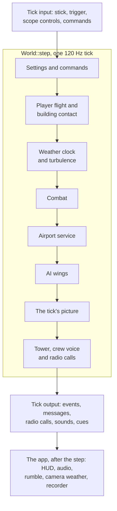
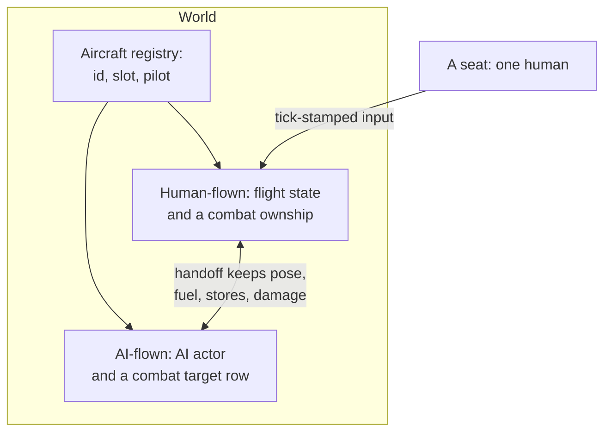

# Initial architecture

> **T.O.R.E: Tasteful Opinionated Reverse Engineered.**
> The thing being reverse engineered is the *experience*, not the executable. We
> trace what a player does and what the game does back, down to the numbers they
> would notice. How the original code achieved it is history: useful evidence,
> never a blueprint. If a sentence below reads like an instruction to reproduce
> the original's internals, it is out of date.
> <!-- tore-header v2 -->

The M0 environment supports the M1a menu slice, the M1b renderer across all 16 theaters, and M1c free flight in twelve aircraft (see the [roster guide](aircraft-import.md)) plus a development weapons range. M0's full title census, salvage inventory, parity specification, and AI VM decision remain open.

| Component | Choice | Purpose |
| --- | --- | --- |
| Language | Rust 2024, compiler 1.91.1 | Reproducible native builds |
| Workspace | `crates/tore-app`, `tore-formats`, `tore-extract`, `tore-sim`, `tore-input`, `tore-input-native`, `tore-diagnostics-native`, `tore-replay` | Desktop shell and entry point, plus the format, extraction, simulation, input and mission recording crates |
| Window/input | `winit` 0.30 | Native window lifecycle and input |
| Graphics | `wgpu` 27 | Metal on macOS; native backends for Windows/Linux |
| Diagnostic facade | Existing `log` 0.4 and `tracing` 0.1 | Bounded app/backend logs without a logging framework |
| Startup bridge | `pollster` 0.4 | Wait for GPU initialization without a general async runtime |
| Audio device | `cpal` 0.16 | Native output for the small PCM mixer; [upstream API](https://docs.rs/cpal/0.16.0/cpal/) |
| Formats | Dependency-free `crates/tore-formats` | Bounded EALIB, raw-literal DCL, PIC/glyphs, a narrow CHOOSEAC DLG reader, BIT2, mission environment fields PL weather palettes, BRF aircraft/equipment, bounded SH projection and compiled FNT glyphs |
| Simulation | `crates/tore-sim` | Shared 120 Hz state/attitude, selectable hybrid dynamics, the shared aircraft sensor component and headless aircraft acceptance |
| Extraction | `crates/tore-extract` + `tools/extract_assets.py` | Title-independent archive discovery/extraction, safe output paths, provenance |
| Checks | Cargo, Python standard library, GitHub Actions | Local and CI checks |

These are baseline-compatible versions, not automatically the latest versions. Exact versions live in `Cargo.lock`. See upstream [wgpu 27 documentation](https://docs.rs/wgpu/27.0.1/wgpu/) and [winit 0.30 documentation](https://docs.rs/winit/0.30.13/winit/) for API contracts.

The shell creates its window on the main event loop and uploads a 640 × 480 RGBA menu canvas to a Metal/native GPU texture. The shader draws a scaled, letterboxed image using linear filtering. The same viewport calculation maps physical mouse coordinates back into retail coordinates, including Retina scaling. It handles zero-sized windows and recoverable surface loss. Fatal graphics/startup errors return a failing process status.

`media_source.rs` decides what a chosen folder is by its contents: an installed game folder with loose archives, or a disc folder holding the Electronic Arts installer container (`SETUP.ESA`), whose stored archives are read in place by offset rather than copied. `tore-formats::executable` maps the executable's hash to one of the two reviewed builds and supplies that build's table addresses, so the disc's 1.0 build and the 1.02F patch decode the same content; an unknown build is refused before any archive is opened. `assets.rs` selectively decompresses resources into a versioned local pack and validates them before import completes, reporting progress by archive and resource count. `menu.rs` composites original background, button pieces, and font strips and owns UI state. `renderer.rs` owns the surface, texture, and scaling. Every game object is built from imported assets before the window opens and the renderer needs a terrain world, so a first run cannot happen inside the game application: `main.rs` runs a pre-game shell, a second winit application handler holding `locate.rs` and the blit-only presenter in `canvas_present.rs`, on the same event loop through `run_app_on_demand`. Re-import from Pref ends the game application and runs the shell again; the event loop is created once. `audio.rs` mixes bounded local PCM, recorded music, and up to sixteen spatial voices with linear resampling into the device rate. `tore-sim::acoustics` advances sound wavefronts and passing-object detection at 120 Hz. Combat publishes bounded sound emissions with physical positions; the app uses the main camera as listener and the device mixer supplies stereo direction, distance gain and treble fade. An emission released by the player's own aircraft plays centered and without distance while the listener is in that cockpit; every other outside sound is muffled in a cockpit view. Up to ten looping sources (crash fires, other aircraft's engines) and, in external views, the player's own engine are placed with distance, stereo and Doppler pitch. See [audio behavior](audio.md). Explosions, craters and crash-site fires are drawn by `effect_renderer.rs` from the original sheets as textured sprites ([explosions](spec/explosions.md)). Audio initializes independently and can fail without blocking menus. No input device or microphone is opened.

The app and general extractor share the same EALIB/DCL readers. `Archive::open` reads a directory and seeks to selected resources; it does not load whole disc archives. The menu retains a 16 MiB resource cap; the general CLI has an explicit configurable cap for larger media. The Python entry point handles portable invocation and SHA-256 report enrichment; it contains no second decompressor.

Menu-only startup randomness chooses one of the five native backgrounds independently of future simulation state. The selected background's embedded palette colors shared sprites/fonts, and native bar offsets keep controls aligned. Hover/focus notifications do not enqueue audio.

Menu drawing uses CPU composition for this small static canvas; it is not a commitment to software-rendering flight scenes. The window sleeps while idle. Hover transitions and transient placeholder messages schedule temporary redraws. The fragment shader is authored source; it contains no retail bytes.


`assets.rs` retains prior cache generations until a new import is synced and
validated from disk. Successful import and startup load remove older numbered
packs from that cache directory. Cleanup is best effort and does not touch
source media or extracted assets. [Retention contract](spec/import-cache.md).

## Startup diagnostics

`diagnostics.rs` installs a bounded `log` sink and panic hook at the start of
`main`, before preferences, assets and the event loop. Existing wgpu logging
and winit tracing feed the same sink. Startup stages and first presentations
are explicit checkpoints; simulation behavior and adapter choice are unchanged.
`startup.rs` owns unattended-dialog policy and media-free success, failure,
panic and synthetic graphics checks. Main-thread unwinding produces a fatal
report and a nonzero exit rather than resuming gameplay.

`tore-diagnostics-native` is a second narrow audited OS boundary. Its safe API
shows Windows MessageBox/AppKit errors without creating the game renderer and
writes Windows Application events. Linux notifications use an optional bounded
`notify-send` process. The app and simulation retain their unsafe-code ban.
The MSI registers the source against the executable's embedded message table.
The existing platform bindings and `log`/`tracing` dependencies are reused;
there is no additional GUI or logging framework.

File paths, retention, fallbacks and failure limits have one home in the
[startup diagnostics contract](spec/startup-diagnostics.md). Release packages
exercise the actual staged and extracted executable; desktop installation
acceptance remains separate.

## Boundaries for menu work

Keep `tore-formats` independent of windowing and GPU APIs. The future simulation likewise needs to run headlessly with deterministic inputs. Avoid empty placeholder crates or premature engine abstractions.

Menu rendering should consume decoded palettes, indexed images, font data, and recovered layout geometry. Recover specifications from the TypeScript reference; implement runtime behavior in Rust. Do not introduce a web shell, copy the Three.js engine, or select a modern widget toolkit before checking retail geometry requirements.

Import user-owned media at runtime into platform application data. The v1 pack is a development cache of selected decompressed resources, not a stable mod/save format. `gameassets/` is a local source-media convenience, not a runtime bundle or save-data location. See [menu formats](formats/menu.md) for the current limits and provenance.

## First simulation renderer

World image pages share a bounded 1024-square array, with sixteen logical pages
per layer. `static_art.rs` retains large scenery pictures at source resolution
and clips face geometry at page boundaries. Material-local storage metadata
keeps rectangular aircraft/smoke images and paged world/weather art distinct.
All sample, palette-remap and shadow paths use the corresponding addressing.
[Source coverage and static variant composition](spec/terrain-detail.md).

`terrain.rs` constructs a world from the selected retail MM and its resolved T2, named or numbered texture references and DAY2 variant palette. Its camera and surface queries have no GPU/window dependency. `sim_renderer.rs` uploads geometry and a texture array, owns depth targets and draws terrain plus a fullscreen sky pass; `terrain.wgsl` supplies the initial perspective, sampling and fog. `renderer.rs` composes this scene with the transparent CPU HUD, resizing depth and surface together. This separation allows aircraft/object/weather passes and a deterministic simulation to be added without coupling format readers to wgpu.

The initial implementation uses full-resolution fixed triangles and an authored sky/fog projection. It is not the native adaptive renderer. All geometry/colors come from local source data at runtime; no retail derivatives are embedded. See [theater findings](formats/theater.md) for recovered versus authored behavior. The Hornet adapter now advances at 120 fixed ticks/second; the developer free camera still uses elapsed wall time for inspection.

The creator selects among all 16 base theaters. Scene replacement rebuilds the GPU vertex/texture buffers for that world; a variable texture-array layer count also supplies the sky shader's layer index. Only the active world mesh is built, while the bounded source bundle remains cached. Maps and fonts stay in the menu compositor. Source text shading is preserved when tinting; ARMFont/SMLFONT replace the unsuitable BODYFONT in the investigation UI and notices.

The Hornet slice adds dependency resolution and bounded BRF/SH/FNT readers to `tore-formats`. `tore-sim::flight` contains fixed-tick state/integration without wgpu/winit dependencies; the app re-exports its interface; `aircraft.rs` adapts imported geometry and camera poses. `instruments.rs` renders independent small rasters from flight/equipment state, each framed by the aircraft's own original instrument window picture (named by its HUD) and coloured every frame through the live cockpit palette, as the cockpit art is; page content draws in coordinates relative to the 138×114 screen ([bezel spec](spec/instrument-bezel.md)). The GPU terrain pass now accepts an aircraft vertex stream and original rectangular atlas with shared depth; front/other instrument cameras render offscreen. CLI extraction and cache import share the same dependency resolver. These adapters do not execute imported x86 modules. See [aircraft evidence and open questions](formats/aircraft.md).

`surface_lighting.rs` owns three geometric shadow maps and the shared light
uniform. `surface_lighting.wgsl` supplies continuous diffuse response, solar
warmth, orientation-dependent fill, painted-panel highlights, cloud transmission
and shadow sampling to terrain, aircraft and weapon
surfaces; sky/cloud shaders share its solar tint helper. Opaque batches enter
the shadow pass before the world pass. Partial sunrise/sunset uses the solid
disc's visible area and segment centroid for direct light and shadow direction.
Manually filtered depth neighbors each use receiver-plane correction and
continuous blocker weights. The bounded penumbra filter combines caster
distance with smooth camera-distance antialiasing. Terrain has a separate
stream of area-weighted shared normals for lighting; shadow depth still uses
actual triangles. Smooth sky, glare and shadow directions share fractional
weather-clock time. Sun-disc strength and geometric visibility are independent
of the sunglare toggle. Terrain alone reduces low-sun ambient fill on unexposed
slopes; exposed ridges, aircraft and water retain their existing response. Smooth aircraft geometry is complete,
including faces hidden from the camera, and hiding the player in cockpit view
does not remove its shadow caster. Material layer -6 identifies emissive combat
effects and -7 identifies textured flame sheets. Glass and flame sheets do not
cast solid shadows; ordinary cutout surfaces cast only their opaque texels. Stepped
mode retains palette lighting and camera face rejection. See the
[surface specification](spec/surface-lighting.md) for fitted limits.


`flight_views.rs` resolves manual-described camera relations from read-only flight,
combat and wing snapshots. The camera rig owns only presentation state: the
reference, last player missile, fixed fly-by position and saved Other View.
Weather, spatial audio, main rendering and the Other View panel use the same
camera rules. Remote aircraft/missile interior cameras hide the reference body without removing
it from simulation. A replay builds the same scene from recorded poses, and any
aircraft can be the reference. [Behavior and fitted constants](spec/flight-views.md).

`flight_ui.rs` owns desktop command dispatch, the imported menu's flight actions, session presentation settings and pause state; the menu's navigation, hit geometry and drawing are `pause_menu.rs`, shared with the replay viewer. `hud.rs` draws the forward-flight HUD from state and source font glyphs, projecting the ladder/path through the renderer's 60-degree camera convention. Simulation remains independent of both. The full-canvas cockpit is transparent art over the world; instrument windows are independent rasters. Menu/focus pauses stop fixed ticks and engine loops, and input transitions clear held controls. Shader zoom is shared by terrain and sky projection; camera previews restore the main camera before drawing.


`flight_canvas.rs` now composes the flight-only overlay at an aspect-responsive size (physical drawable, proportionally capped at 1920×1080). The separate GPU cockpit pass preserves uniform cover-fit in the centered forward view, and instrument layout rectangles anchor to actual edges. Native instrument rasters go directly to their destination sizes instead of passing through a reduced 640×480 composite. The original cockpit texture is uploaded once; unchanged scaled panel rasters are cached. Alpha-aware filtering prevents dark transparent borders. `renderer.rs` recreates its UI texture when dimensions change and uses the full viewport for flight; menus/viewer overlays retain their existing canvas. Pointer conversion uses the same responsive panel rectangles, while the centered pause menu retains menu coordinates. HUD metadata uses a 0.7225 layout scale, including the requested additional 15% reduction. Projection compensation preserves angular cues through resizing and portrait aspect.

`tore_sim::autopilot` owns captured heading/altitude, mode and an optional
world-space navigation target. `State::step_surface` consumes mode switches,
applies pilot override and generates control deflections before the selected
flight adapter runs. The HUD reads this state. See the
[autopilot specification](spec/autopilot.md).

### Flight presentation and measurement

`flight::State` remains authoritative at 120 Hz. `main` retains the preceding tick for render-only pose interpolation (shortest-path wrapped angles); pause/crash show authoritative state and restart resets history. Camera, exterior geometry and HUD consume the same presented pose. Everything else combat draws is captured once per tick, after the AI step, as a plain-data `RenderSnapshot` (`render_snapshot.rs`): other aircraft with their devices, damage and wreck state, fixtures, weapons, effects, debris and ejected pilots, plus the player's own pose. Combat keeps the last two snapshots, and the main view, mirrors and camera panels draw their blend at the same fraction through the shared `aircraft_batches` and `combat_geometry` helpers, which a mission replay uses to draw a recording, so both show the same picture. Each pose also carries whether its afterburner flame lights the scene; the shared `afterburner_glow`, `target_glows` and `engine_outlets` helpers turn those into lights at the presented poses. Chaff and flares are not part of the snapshot: live flight hands the countermeasure renderer the combat state's devices, and a replay the same devices flown again from their recorded releases (`replay/devices.rs`). `replay/convert.rs` turns each snapshot, plus flight data it does not carry, into a `tore-replay` frame and a decoded frame back into a snapshot; a synthetic round-trip test draws both through the shared helpers and requires every vertex within the format's 1/64 ft position precision. Reset clears that history. AI gear, flap, hook, brake, bay, exhaust and control-surface samples use that
same render fraction; an aircraft whose AI stopped flying holds its last
devices, and fixtures retain their fixed devices. Audio consumes
authoritative state. No renderer smoothing feeds back into physics.

World camera depth uses `Depth32Float`, storing the near plane at depth 1 and
the far plane at depth 0. Using the near and far distances, the vertex shader computes clip Z as
`near * (far - view_z) / (far - near)`, then perspective division yields depth.
Depth clears to zero and nearer fragments compare greater. The existing near
plane and 2,200,000-foot far limit remain. Aircraft, terrain, static objects,
clouds, smoke, vapor, chaff, flares, flare glare and the spotting aid use
this same mapping. The separate
orthographic shadow maps keep their existing depth convention. This is an
agent-selected host correction for distant surface flicker; see
[NVIDIA's depth-precision analysis](https://developer.nvidia.com/blog/visualizing-depth-precision/).

Theaters are about a million feet across, where a 32-bit float steps 1/8 foot,
so aircraft built in world coordinates snapped a little differently every
frame and shimmered in exterior views. Camera positions are kept in f64, and
each frame `World::set_origin` picks a render origin: the camera position
snapped to a 1,024-foot grid, shared by every camera that frame. Aircraft,
ejected pilots, weapons, debris, tracers and effects are built relative to it
(`World::local`), and the scene uniform carries the origin and the camera's
exact offset from it. `object_vertex` and `shadow_object_vertex` place those
vertices through the offset; terrain and airports stay in world coordinates
and reach the camera through the origin, so only their own storage rounding
remains. Smoke, vapor and countermeasures stay in world coordinates. An origin
of zero reproduces world-coordinate vertices exactly.

Active simulation views request the next redraw without a post-render timer; AutoVsync and a requested maximum frame latency of one provide presentation backpressure. Idle menu behavior is unchanged. Failed/zero-size presentation does not continually schedule simulation redraws. `performance.rs` provides opt-in bounded CPU wall-time sampling via environment variables, with warmup exclusion and view cycling.

The GPU cockpit texture survives view and size changes; projection uniforms track the current aspect. Aircraft GPU resources are prepared when the renderer/theater loads. Live camera panels submit bounded asynchronous readbacks (at most one pending per camera page), consume completed rasters on later frames, and retain their last image while pending. The simulation renderer caches world-pass attachments (depth, multisampled colour and the render-scale image) for up to five output sizes, so the display, mirrors and 138×114 panels do not reallocate at every refresh. World pipelines live together in `sim_renderer::Pipelines` and are rebuilt when the anti-aliasing sample count changes. After the world pass, an optional resample pass scales the render-scale image to the output, and the spotting-aid pass draws single-sampled outlines using the world depth; `graphics.rs` holds the options and the [graphics options](spec/graphics-options.md) page specifies them. Offline captures retain an explicit blocking readback so smoke evidence contains the requested image. Direct GPU panel composition, full GPU UI rendering and native terrain LOD remain future optimization work.

`look.rs` owns authored held-key classification, look limits and exterior spherical orbit. Shift arrows are isolated from flight input and retain their look classification until physical release, including after modifier changes; Ctrl arrows, FA's thrust vectoring, do nothing yet. Camera motion uses elapsed presentation time while unpaused. Internal elevation is limited to the forward eye line through overhead; exterior orbit keeps a fixed radius and aims at the same interpolated aircraft pose. It does not alter simulation state or synchronously capture the GPU.

### Continuous attitude and momentum

`attitude.rs` supplies body bases, Rodrigues rotation, orthonormalization, and render interpolation. `flight::State` retains separate world velocity and pitch/roll response rates. The old pitch clamp and nose-derived position update are removed. Force integration and attitude response remain deterministic at 120 Hz; render interpolation does not feed back. `look` uses the same body basis for head rotation, while exterior orbit retains aircraft-centered inspection behavior. The HUD flight-path marker projects actual velocity bearing/elevation.

`cockpit_renderer.rs` and `cockpit.wgsl` project the complete original forward artwork and the 640×480 HUD raster through one aircraft-fixed plane. Relative eye/body axes move both layers together during head-look, independently of aircraft attitude. The pass draws after the world and before screen-anchored instruments/menus, including offline captures; camera instrument readbacks exclude it. A cached source-size glass mask follows the cockpit transform and clips the HUD when cockpit art is visible. The shader composites masked HUD behind cockpit art and mirror contents; cockpit-off/wide view bypasses the glass mask. Linear premultiplied sampling preserves transparent borders. HUD uploads and uniforms are nonblocking; resize does not rebuild the source texture. The sky shader projects SKY0 onto a finite hemisphere disk with `ray.xz / (1 + max(ray.y, 0))`, avoiding the latitude/longitude singularity and seam at zenith. Native sky mapping and full 3D cockpit geometry remain unimplemented; the projected source plane has finite coverage and cannot provide a rear/overhead interior.

The shared hybrid adapter and its recovered-versus-fitted boundaries are specified in [FLIGHT-MODEL.md](FLIGHT-MODEL.md). Scalars resolve once when constructing the aircraft-owned typed configuration; immutable model data are shared by presentation snapshots and envelope queries allocate no temporary hit vectors. Renderer-specific Hornet animation tests remain in the app.

Aircraft-specific fitted laws live in `tore-sim::models::{f18,rafale_c}`, selected
through `AircraftModel` and the `FlightModel` interface. Each owns independent
validated configuration covering mass, propulsion, envelopes, recovered departure/contact limits, equipment response and tuning. `State` holds the selected model; `Research` holds only evolving departure/contact/clock state. Updates take no raw aircraft argument. Integration and recovered algorithms are shared components.
`tore-sim::telemetry` exposes gauge-independent air/ground/altitude channels with
explicit units and unavailable sensor readings; analog gauge presentation must
remain downstream of this interface. See [model extension guide](FLIGHT-MODEL.md).
`State::trace` keeps a write-only `FlightTrace` of the last step's values and
applied effects with their causes, for the telemetry panel and replay logs;
nothing in the simulation reads it and it takes no part in state equality
([telemetry record](FLIGHT-MODEL.md#telemetry-record)).

## Shared physical input

`tore-input` is a dependency-free safe Rust crate for physical control bindings,
calibration, per-source contribution/ownership, context release rules, typed pilot
frames and bounded input tapes. `tore-sim` consumes those frames at 120 Hz and no
longer interprets keyboard names. Aircraft configuration and control response stay
in the respective model modules. The app translates keyboard/menu actions and
routes instrument focus to the existing stock controls.

`tore-input-native` owns a dedicated bounded device worker: Linux evdev/rumble,
Windows raw-controller readings/Gamepad vibration, and macOS GameController/
CoreHaptics plus generic HID queues. Apple gamepad input and haptics share the same
retained controller; public HID support queries suppress duplicate raw endpoints. It and the diagnostics boundary
permit audited unsafe platform FFI; `libc` and `windows` are thin platform bindings,
not a third-party input policy engine. Main-loop discovery never blocks a flight
frame. Presentation-only look resolution cannot change pilot-axis ownership.
It also runs the head-tracker receiver: a safe `std::net` loopback UDP socket on
its own thread that reads opentrack poses. Head and mouse look add to the
presented look angle only; they never touch pilot axes or the simulation.
See [contracts, platform limits and profile syntax](INPUT.md).

The app's input configuration screen (`controls_editor`) is one component opened
from the main menu and the paused flight menu. It owns a draft
`tore-input::Profile`; native capture is isolated from menu/gameplay dispatch.
`input_catalog` is the single table of listed actions and stock keyboard/mouse
assignments; it drives the screen's rows, stock-key remapping (`disable`
directives) and the generated [controls master list](CONTROLS.md). Canonical serialization validates
before file replacement and live rebaselining. General display/instrument/sound
preferences use a separate bounded versioned file and persist independently of
flight/aircraft state. Smoke/capture/performance diagnostics bypass those preferences.
Afterburner feedback combines a renewable finite low rumble with the engagement
impulse; context loss cancels both, without changing authoritative flight state.

## Manual combat and systems

`tore-sim::combat::live` owns the deterministic manual range at 120 Hz. Typed
configuration resolves each supported PT’s loadout, SEE/ECM equipment and damage
table once; mutable ammo, projectiles, player HP, subsystem counts and
adapter RNG remain in state. Contacts are no longer its own: it holds a
`tore-sim::sensors` live state, feeds it ownship pose, equipment state and the
observable targets each tick, and asks it whether a specific target is supported
before a radar weapon launches. Physical airborne presence is separate from
destroyed combat state, so hit points reaching zero does not erase a return.
`combat::systems` contains bounded translations of
reviewed ECM probability and damage-selection helpers. Unknown native subsystem
side effects remain explicit gaps; the service reproduces combat behaviour rather
than reconstructing the original executable's combat tick.

`combat::ledger` records every projectile from its first step to its outcome
(hit with damage, missed, spoofed by a decoy, jammed), keyed by shooter,
intended target and retail weapon class, plus credited kills and each target's
last attacker. Nothing in flight reads it. The app's `debrief.rs` turns it into
the post-mission pages; `ai_wings.rs` supplies the intended target of AI gun rounds and
reports decoyed missiles. See the [debrief spec](spec/debrief.md).

`combat::gunsight` supplies a renderer-independent fixed-step gun solution using
live projectile speed/drop helpers and current radar observations. `weapon_hud`
draws its pipper/range arc and projects a selected target into a square or edge
chevron. Combat retains a separate display-only target identity through sensor
loss; this never substitutes for `sensors` launch support or radar observations.
[Behavior and evidence](spec/gunsight-targeting.md).

`ai::gunnery` uses the same trajectory solver with explicitly permitted visual
or sensor observations. The controller chooses gun tracking through ordinary
flight inputs and authorizes individual rounds. `ai_wings` rechecks barrel
alignment after flight movement, debits one round only when emitting it, and
launches along the mounted forward axis. Shared live combat applies dispersion
and collision, excluding the shooter. See [gun employment](spec/ai-gun-employment.md).


The app merges independent keyboard/controller trigger holds, dispatches explicit
commands and consumes confirmed events for instruments, graphics, audio and the
bounded feedback mixer. Two-control modifier bindings consume their base controls
and require neutral release across layer/context changes. Native feedback errors
disable that device’s feedback until reconnect; finite leases and context stops
bound rumble. Combat notices reuse the existing HUD line and expire in simulation
ticks, so pause does not age them or expand overlay composition work.

Version-3 combat tapes record service inputs including jammer state, the player
sensor controls (channel, display range and history) and explicit fixture
commands; a designation is recorded by stable target identity, never by screen
coordinate. Replays validate identity/assets and reproduce combat state,
including adapter RNG and subsystem failures. Version-2 tapes still replay with
the default sensor controls; version 1 rejects explicitly. This
is combat-service determinism: it reproduces combat state, not a full application
replay. See [contracts, validation and limitations](baselines/weapons-systems.md).

## Additional aircraft

The aircraft registry includes F-14D, A-4E, X-31 EFM and the seven
[roster additions](spec/roster-aircraft.md). Each owns a typed
model configuration; presentation rigs remain in tore-app. Shared combat resolves
the selected identity's sensors by parsed record channel, never by aircraft name,
and reads its PT stations. Audio switching clears old
aircraft voices. See [aircraft behavior](spec/additional-aircraft.md).

The optional user-supplied [engine material](spec/engine-material.md) replaces reviewed burner
face materials at runtime. Its throttle glow is separate from the retail atlas
and does not change A-4E presentation or flame geometry.

Researched flight is now the default; `--legacy-flight` preserves the previous
model. HUD and audio share the [stall warning signal](spec/stall-warnings.md),
including the original imported warning samples.

Aircraft-owned exterior fits for the seven roster additions live in
`roster_animation.rs`, with reviewed source branch membership in
`additional_animation.rs`. The [animation contract](spec/aircraft-animation.md)
defines their presentation. F-22 bay fraction advances at the shared 120 Hz;
the renderer interpolates it, and manual combat can request it without changing
launch eligibility. Exterior canopy grading is a mesh material, independent
of cockpit artwork and world-view rendering. Its nearest surface is resolved
in a depth-only pass, then blended at 75% opacity over the opaque scene.

## Shared sensor boundary

`tore-sim::sensors` is one component serving all twelve imported aircraft. There
is no aircraft-specific radar code: `profile` normalizes each PT's own SEE and
ECM records into typed capability profiles resolved by parsed signature channel,
`signature` holds the single observer-relative aspect function, `detection` holds
the authored range model, `track` holds the live state (current observations, one
selected target, at most one acquired fire-control track across radar and
infrared, bounded history and received interference), and `passive` collects
received emitters for the exposure instrument. An unreviewed radar or ECM record
is an import error rather than a silent substitution.

The component decides what is observable and whether a specific target is
supported for a radar weapon. `tore-app::scope` only reprojects those shared
observations for drawing and picking, so the page cannot make a hidden target
selectable, and one projection serves both drawing and the mouse pick.
`instruments.rs` draws pages 9 and 0 from that input. Player controls (channel,
display range, history) travel as a per-tick input, which is why the combat tape
reproduces them. The flight adapters and renderer independence are unchanged.
[What is modelled, what is authored tuning and what is deferred](radar.md);
[what was validated](baselines/radar.md).

Missile profiles and the fitted finite-boost motion predictor live in
`combat::missiles`, independent of rendering. Its 120 Hz prediction shares live
lead steering, turn limits, maneuver losses and propulsion. The live adapter
refreshes the bounded maximum-range search at 2 Hz per selected observed target. The live adapter uses full release
velocity for accepted missile profiles; compatibility retains scalar source
motion. Explicit target role is separate from damage category. Launch-origin
minimum-range qualification persists through terminal closure, as specified in
[engagement rules](spec/missiles.md#minimum-engagement-and-target-role). Combat tape version 4 includes world velocity and bay permission, while versions 2 and 3
select compatibility rules. [Missile specification](spec/missiles.md).

Combat tape version 5 records radar power separately from transmission, preserving
passive-channel behavior and radar-off unguided releases. Versions before 5 imply
power on for the new guidance gate. Version 4 remains the missile rule-version boundary. Seeker mode and
controlled target heat/emission changes are recorded commands; seeker observations
and acquisition are reproduced from those inputs, the matching asset fingerprint
and terrain. `--combat-command compatibility-weapons` explicitly selects the old
weapon adapter. Flight adapter selection is independent. Fitted seeker synthesis
consumes the mounted-seeker amplitude and never controls acquisition. A tape does
not record the mission wind or the host turning a crashed flight into a dead
player: a replay is given the theater's wind, so smoke and countermeasures drift
as they did live, but a session in which the flight crashed replays with the
player alive.

`ai::damage` reads live component failures and proposes recovery and control
restrictions. `AiActor` latches the recovery commitment, uses the existing
landing path, and applies protective throttle commands to every real flight
path. The diagnostic damage trace is write-only. Dummies bypass these decisions
and flight stepping. Fire enters the existing per-pilot ejection monitor.
[Contract](spec/systems-damage.md#ai-pilot-response-to-faults).

Quick Mission launches AI wings by default; `--fixture-wings` retains the
straight-flight compatibility path. `Combat::mission_aircraft` retains the six
wing groups and their fitted spawn poses for restart. `AiWings` builds actors
after reset. AI emits aircraft inputs and the flight model alone advances
its pose; no steering pose overwrite follows physics. The bridge mirrors results into `combat::live::Target` for sensors,
rendering and damage. Each wing follows its own leader from the shared world
snapshot; the human leader remains outside the AI actor list.
`ai::awareness` owns timestamped current observations and frozen aircraft memory
for each actor. Only current observations enter target selection, weapon geometry
and firing; lost hostile records enter a separate controller search input. The
AI lookout is skill-filtered independently of imported player sensor
profiles, with six timed body directions and attention to a last measured point, and the mission terrain query masks visual and radar/infrared sensing.
Production sensor loading fails explicitly rather than enabling the sensorless
synthetic-fixture path. SEARCHING/ACQUIRING/REJOINING are simulation activities
read by Target view. [Behavior and limitations](spec/ai-awareness.md).
`combat::threats` owns bounded missile observations for every receiver, including
the player RWR. Controllers consume copied threat records through `ai::defense`;
they cannot inspect live missiles or private launcher targets. `ActorSupport`
snapshots bind each guided projectile to its own launcher, and the shared
seeker lifecycle supplies actual pitbull and support-loss state. Countermeasure
bursts are scheduled/debited by the mission before the bridge applies decoy
rolls. RWR drawing reads the same records and never drives the decision clock.
`ai::incoming_fire` observes gun rounds through the pilot's lookout and terrain
query. It retains only consecutive visual samples, anonymous close passes and
weapon-hit cues, never a hidden shooter identity. The app forwards victim-only
combat hit events, and copied round positions before the mission step. The
mission compares fire and missile urgency and supplies one `DefenseMotion` to
the controller. Gunfire does not request devices; valid missile bursts continue
through the existing scheduler. [Contract](spec/visual-awareness-under-fire.md).
`ai::engagement` gates current target selection by role and stance before B41
ranking. Quick Mission initializes a separate neutral engagement gate for every
actor. Accepted combat orders release it; formation and disengage commands
recall it without rewriting mission objectives. Recall suppresses repeated
offensive reactions to known projectile IDs while retaining missile evasion.
AI leaders release neutral wing members after a perceived attack or a current
hostile contact allowed by their mission. Recall prevents contact-only release;
existing individual orders survive an automatic wing release. Commands are
delivered after all same-tick decisions. `AiMission` delivers perception-only attack reports to assigned escorts and wing leaders
on the next tick, with a fixed expiry; bearings never become synthetic targets.
Escorts also assess detected aircraft against each assigned friendly's protection
zone using observed relative motion. Confirmed attackers outrank prospective
threats. Frozen contacts can guide investigation but still cannot authorize fire.
Quick Mission group objectives resolve through stable side/wing/member metadata
into per-actor assignments. Whole-group survival requirements are stored separately from combat orders.
The Target window combines player assignments, these requirements and allegiance
to select a typed Survive/Destroy label, with no label for other contacts. Source missions and
campaign outcomes remain outside the M1 assignment adapter.
`ai::formation` owns routine repositioning, trailing, breakout, intercept, stabilization and
capture guidance. Traffic and arrival states are snapshotted before any actor
advances, so iteration order cannot grant approach priority. Its trace hook is
read-only; optional host CSV logging is described in
[development diagnostics](DEVELOPMENT.md#formation-flight-traces). The formation
choice and placement are specified in [mission wings](spec/quick-mission-menu.md#mission-wings).
`ai::thought` holds the write-only [AI thinking record](REPLAYS.md#ai-thinking-record): controller and actor traces of each tick, a log of random draws, and a message journal the host drains once per tick through `AiWings::take_ai_journal`; no decision reads them, and golden fingerprints prove the AI behaves exactly as without them.
Rendering groups targets by imported airframe, with a cached
texture binding per identity and vertex buffers that grow to fit the formation.
The player's atlas is never substituted for another type. Fixed-step timing and
the three player flight adapters are unchanged. Normal flight loads supported default stores;
restricted native research flight keeps its clean configuration.

`combat::smoke` owns bounded, fixed-step puff histories independently of rendering
and guidance. The app supplies engine outlet positions once per combat tick;
contrails retain two minutes of history in a separate 72,000-puff budget.
[Smoke and contrail rules](spec/damage-smoke.md) define rates, size and fade.
The app's smoke pass retains original indexed smoke artwork and resolves it
through each camera's current weather palette and haze remaps. Clouds and smoke
share directional sunset lighting and air/cloud occlusion. It sorts keyed
billboards for each camera, blends them without depth writes, and depth-tests
against the world. It culls offscreen puffs without deleting their history,
then uploads one 24-byte instance per visible puff; the vertex shader builds
its six billboard vertices. Age and expiry remain fixed-step CPU state.
Coverage is premultiplied only after lighting to preserve transparent edges.
Gun release dispersion is sampled once in the shared fixed-step projectile
path using a stable projectile-identity hash. Cannons release individual physical
bullets at a fixed-step cadence; every third bullet draws one tracer ribbon,
without a duplicate projectile mesh. Ribbons follow the actual swept segments. A separate additive material pass supplies self-lit cores and halos
without depth writes or shadow casting; solid depth and atmospheric attenuation
still obscure them. [Gun behavior](spec/damage-smoke.md#gun-dispersion-and-luminous-tracers).
Aircraft damage keeps six aircraft-local accumulators beside the existing hit
points. Gun segments intersect fitted nose, cockpit, core, wing and tail volumes;
surface objects remain on their ordinary object damage path. `damage_art` packs
intact and damaged PICs losslessly into one runtime atlas per identity. It adds
persistent imported-texture marks at light regional damage, then selects a
reviewed A/C body only when its missing region matches the hit. Other regions
use fitted, mirrored face clipping. Damaged shapes bypass intact-model animation
address maps.

`combat::debris` computes both fitted A/B and C/D attachments from inert shape bounds and advances
pieces at 120 Hz with inherited velocity, gravity and tumble. First swept terrain
contact retires a piece and creates a short visual ground impact. The runtime
atlas also contains the matching fragment textures. Fragment state belongs to
combat simulation, so replay and rendering consume the same breakup lifecycle.

Quick Mission's `ai_wings` bridge mirrors live actor poses and damage, while
combat retains movement ownership of wrecks. Each AI projectile carries its
own weapon record; rendering resolves its shape by resource name, independent
of the player's station numbering. The simulation owns delayed warnings,
individual dispenser releases and scoped wing requests. The app realizes
those events in the existing projectile and effect services. See the
[AI integration contract](spec/ai.md#live-integration-and-authored-boundaries).

Wing commands use `AiMission::order_wing_report` for scoped per-recipient
outcomes. The player bridge resolves orders and applies B43 control effects;
AI requests use the same B46 receiver after all actors decide. `ai_wings/orders`
and `reports` keep delivery and advisory text separate from physical steering.
`audio::Mixer` owns a bounded serial radio queue, independent of simulation
execution. `tore-formats::radio` reads reviewed inert phrase records during
import; the existing archive and PCM readers load original recordings.
Radio chatter is observation only: `ai_wings/chatter` turns mission output
into events, combat's strike list attributes projectile damage, and
`radio_calls` words them and applies the listener rule before `comms` delivers
them. Each decision, said or held back, is also written to a bounded,
write-only journal (`comms::journal`) that the host drains once a tick
([communication journal](REPLAYS.md#communication-journal)).
[Radio chatter](spec/radio-chatter.md#implementation-in-tore),
[command behavior](spec/ai.md#live-wing-command-and-radio-integration),
[radio data](formats/radio.md), [controls](INPUT.md#player-wing-orders).

Routine formation transitions share previous-tick velocity intentions through
the immutable traffic snapshot. Each actor owns its staged route and yielding
position; no coordinator moves aircraft directly. Live random slot offsets are
smoothed in `Controller`, with vertical amplitude reduced to five feet. The
[transition specification](spec/ai.md#normal-formation-variation-and-transitions)
owns the fitted parameters and limits.

Smooth lens flare is a continuous optical-light composite over the completed
world, so the sky gradient is not quantized inside flare circles. Stepped mode
keeps indexed remapping. Water's solar glint tests geometric light visibility
before adding reflected sunlight; ordinary water shadow tint is a separate
operation. See [glare](spec/sun-glow.md#continuous-lens-flare-composition) and
[water reflection](spec/ocean.md#separate-sun-and-environment-reflection-trial).

## Airport scenes

Airport scenes are immutable imported data owned by `terrain::World`. Static
GPU geometry is batched by placement and filtered each frame from combat-owned
target HP, so destroyed objects disappear consistently in main and mirror
views; a replay filters by its recorded destroyed objects instead. The airport
service derives availability from those combat targets and
owns player selection, clearance, landing progress, and typed replies.
Weather-only reconstruction preserves service and combat state. Theater changes
and flight restart rebuild both from the imported scene.

`tore-sim::ai::airfield` owns AI takeoff and landing sequences. The app resolves
STRIP anchors and home runways, then passes terrain and landable surfaces to
`AiMission::step_with_surface`. Aircraft motion remains driven by pilot inputs;
the renderer has no role in traffic gates or landing decisions.
[Behavior and fitted safety rules](spec/ai-airfield.md).
`airfield_radio` observes those states and player runway context without changing
flight. It coalesces status by actor and uses the shared `comms` channel, with
separate airport audio ownership for cancellation. Quick Mission resolves a
validated queue along the final taxiway legs before any actor is created.

The creator stores its accepted ground-start runway identity separately from the
editable draft. It constructs the existing airborne wing launch reference first,
then initializes the player's whole wing on the shared runway surface. Restart
reuses the accepted launch layout, airport, fuel and stores. Building height
inside a composite runway shape never supplies the support-plane elevation.
Terrain render triangles are split at airport footprint edges and recessed
below the fixed support plane, with perimeter walls. Source terrain and physics
queries are unchanged. Static solid and texture passes use ordered equal-depth
tests without depth bias, so they cannot pull pavement in front of aircraft. A per-shape vertical normalization
aligns the dominant horizontal paving layer with the placement's runway plane;
building height does not move that plane.

`runway_wind` classifies imported MTOW and decomposes wind relative to a supplied
heading. Hybrid aerodynamics consume full wind; wheel physics consumes the bounded
crosswind/tailwind difficulty fraction as a tire-grip adjustment;
HUD departure/ILS cues consume its unscaled assessment using the active runway
end. It leaves airborne wind, flight-adapter selection and clearance logic
independent. [Rules](spec/runway-wind.md).

Hybrid takeoff combines an airflow-dependent device-drag factor, imported flap
lift, and continuous low-speed lift allowance. Contact receives remaining wheel
load from world-vertical support forces, classifies touchdown before changing
velocity, then resolves post-tire movement or wheel release. This keeps parked
stability separate from aerodynamic airflow and avoids discarding small climbs.
[Takeoff/contact behavior](spec/takeoff-ground-contact.md).

The shared [HUD layout and startup rules](spec/hud-layout.md) keep projected
flight and targeting geometry separate from fixed readouts. NAV presentation
hides weapon-specific symbols while retaining the selected target cue. Player
startup applies gun/SAFE selection after loadout reset, with ground NAV chosen
by the application; explicit diagnostic overrides are resolved afterward.

Airport guidance receives the aircraft body-forward vector from live flight or
recorded launcher pose. It filters threshold candidates through the shared
90-degree forward cone and range/airport-altitude band before returning either
armed or active ILS data. Head-look is not an input, and replay needs no new
wire field. [Arming contract](spec/airports.md#ils-arming-envelope).

`flight_map.rs` draws the Shift-M map as an opaque flight overlay. Simulation
map observations combine the active sensor and visual returns, including surface
objects, without adding surface targets to air-to-air selection. The renderer
receives observed positions and identification flags. Right-side map buttons
filter only presentation. An explicit structural-resource allowlist hides
buildings by default, including unidentified returns, while preserving defenses
and other surface objects. Original MCICONS artwork
is optional for older caches. [Display rules](spec/flight-map.md).

The [target window](spec/target-window.md) builds read-only presentation data in
`tore-app::target_window`. It uses the same retained selection as the HUD,
existing aircraft activity, and an independent weather slot. Its asynchronous
camera results carry the requested target identity so a changed selection cannot
reuse another target's picture. No display state feeds combat decisions.

Quick Mission [Dummy aircraft](spec/dummy-aircraft.md) carry a separate launch
mode. The mission actor moves them at a fixed 400 knots instead of invoking its
combat controller or aerodynamic flight. They retain the existing world snapshot,
damage mirror and target identities alongside normal AI aircraft.

Target-camera readbacks preserve a scenery coverage mask in alpha for the 10%
background darkening, then restore opaque panel pixels. Camera-specific near
clipping improves magnified subject depth precision. Target preview requests use
an independent 24 Hz phase clock; the other camera panels retain their existing
refresh interval.

## Ownship systems state

`tore-sim::aircraft_systems` coordinates separate engine, fluids, fuel, controls,
structure and pilot components. Each owns its fault state and fixed-tick
progression. The coordinator couples oil pressure to engine temperature and
combines fatal outcomes; it does not own the components' timer arithmetic.
Regional structural effects supply one shared set of flight penalties for both
flight adapters, using the same regional fractions as the damage renderer.
The renderer currently hides all airframe marks and tears below 100% damage;
this gate never changes component state or aerodynamic penalties. The app transfers newly selected combat faults exactly once, resolves
hardpoint identities and forwards notifications to the existing sim log. Flight
applies power, controls and actuator limits, and consumes source tank fuel. The
Systems raster only reads this state. D is a report action and never applies a
hit. See [the behavior contract](spec/systems-damage.md).

## Wreck lifecycle

`tore-sim::wreck` owns fixed-tick aerodynamic wreck motion, captured per-engine
thrust and an independent explosion RNG. Ownship flight and combat targets both
use it after destruction; living AI decisions are untouched. The AI bridge only
copies live propulsion metadata for later use by the wreck. Airburst events
trigger existing audio/effects and hide the whole airframe and detached pieces.
[Behavior contract](spec/destroyed-aircraft.md).

## Pilot escape ownership

`tore-sim::ejection` owns seat/chute motion, survival and the fitted recovery
assessment. Player commands are recorded in the existing pilot tape; AI decides
before weapon releases. Combat continues to own AI wreck motion, while the
mission retains the detached pilot. The app imports original indexed art into
a separate texture batch and schedules voice/effect transitions. See the
[ejection specification](spec/ejection.md) and [source notes](formats/ejection.md).

## Mission recordings

`crates/tore-replay` is dependency free and knows nothing of the simulation
or the renderer: the recording model, the chunked writer, the bounded reader
and the exports (debug log, summary, anomaly flags, Tacview, comparison).
`tore-app/src/replay/` is the only place the app's types meet it.

The capture boundary is the per-tick `RenderSnapshot`. Each tick, right after
the AI step, `replay/recorder.rs` reads the snapshot live flight draws plus
flight data the snapshot lacks, and diffs both against the previous tick to
find launches, hits, crashes, departures and AI activity changes.
`replay/convert.rs` turns a snapshot into frame pieces and a decoded frame
back into a snapshot; the draw rules that hold for a whole flight (loaded
models, which ids draw with them) travel in the header. Everything the
recorder reads was already computed by the tick. The few outputs it needed
are write-only and bounded, drained by the host and never read by flight: the
combat ledger's list of shot outcomes, combat's notes of released chaff and
flares and of the player's decoy rolls, the cockpit message lines in
`FlightUi`, the player commands in `Combat`, the AI message journal
(`AiWings::take_ai_journal`, handed to the recorder in `Tick::journal`) and
the communication journal (`Recorder::drain_comms`). Frames go to a writer
thread through a queue two seconds deep; a full queue drops the frame and the
next reports a gap, so the flight never waits for the disk. Probes with
recording on and off print byte-identical output.

The reasons live beside the capture: `replay/recorder/why.rs` reads the AI's
controller and actor records, the flight model's `FlightTrace` and the
bridge's decoy rolls, emits reason events on each change, and samples the
display trees at their rates; `replay/recorder/journal.rs` maps the two
journals to `comms.*`, `ai.defense` and `audio.music` events;
`replay/trees.rs` builds the trees as pure functions of those records, so
a live debug panel can build the same tree from the current tick.

`replay/library.rs` owns the `replays/` folder: names, `replays-v1.conf`
auto-delete settings, listing from each file's header, seek index and footer
(`Recording::peek`), and a cleanup that deletes only proven, unkept, inactive
recordings. `terrain::World::identity` captures the resolved world for the
header and `World::for_identity` rebuilds it without environment variables.
`replay/screen.rs` is the Replays screen, a main-menu overlay built from the
Controls screen's drawing helpers that reads a recording's details and
writes its exports on background threads the menu's redraw polls, so the
menu never waits on a file.
`replay/cli.rs` holds the `--recording-*` commands and the tick-by-tick
render check. See [mission replays](REPLAYS.md).

The mission replay viewer is its own screen, `Screen::Replay`, run by
`replay/viewer.rs` and wired into the app by `replay/host.rs`, which takes the
screen's window events before `main`'s own handling and hands back what the
app still owns: resizing, focus, Alt-Enter and quitting. The viewer owns a
`World` built from the recording's identity and its own airframes, so the
Quick Mission screen's world is untouched. Entering the screen points the
renderer at them (`set_world`, then `prepare_aircraft` for the recorded
player, since a world rebuild discards the aircraft); leaving restores the
game's world and ownship the same way. Each frame rebuilds the moment under
the playhead from the recording (`replay/playback.rs`) and makes the same
renderer calls as live flight, with the cockpit and mirrors switched off every
frame and a blank flight canvas carrying only the viewer's interface. Nothing
it draws feeds back into the simulation; see [replays](REPLAYS.md#viewer).
Its Esc menu (`replay/pause.rs`) is flight's paused menu widget
(`pause_menu.rs`, which `flight_ui.rs` embeds) over a tree built from the
imported one; the Graphics and Sound screens it opens stay the app's, drawn
into a layer the viewer puts over its frame, with their input left to
`main`'s handlers while they are open.
`replay/sound.rs` turns the stretch of recording each frame played at 1x
forwards into plain-data cues for the same audio calls live flight makes,
with the viewer's camera as the listener, and cancels them on a seek; see
[replay sound](REPLAYS.md#sound). The names it acts on (tone names, routes,
the two tower triggers, and `vocab::heard` for which entry of a line was
heard) live in `tore_replay::vocab`, which the recorder writes with.

The [debug panels](REPLAYS.md#debug-panels) are one code path for both hosts.
`replay/panels.rs` draws any display tree and the Comms panel in a 640x480
layer from a `Data` source: the replay's reads the recording at the playhead
through a per-chunk cache of decoded trees, live flight's (`replay/live.rs`)
keeps the latest of each tree and the comms and audio entries the recorder
writes (`Recorder::take_trees`, `Recorder::take_comms`), so a live panel
shows exactly what the recording holds. `replay/context_menu.rs` holds the
right-click menu, picking through the drawn camera's projection, and the
click-or-drag rule. The layer is composited centred on the view, only where a
panel or the menu drew (`FlightCanvas::centered_rects`). In flight the panels
only read: the menu's camera changes go through the ordinary view commands.

## Promo reel capture

`reel.rs` and the replay viewer's `director` module render promo footage. They read complete recordings into the same presentation helpers and `SimRenderer`, using a surface-free wgpu device and GPU readback. They never advance aircraft or AI state. Python expands the checked shot timeline and sends exact recorded ticks and camera parameters; a second cockpit pass can read back the HUD symbols alone, and the offline mixer can keep speech on its own stem. See the [production recipe](../tools/reel/README.md).

## Mission core and seats

Design for stages A and B of the [multiplayer plan](multiplayer-plan.md#stages),
written 2026-09-28. **Nothing in this section is built yet.** It is rewritten
as the stages land. John approved the design on 2026-09-28 with the decisions
credited to him below; every other choice is an agent decision. His decisions
are also in the [multiplayer guide](MULTIPLAYER.md#decisions).

In short:

- One type, `World`, owns the whole mission and advances it one 120 Hz tick at a
  time, with no window, GPU or audio. Single player, a player-hosted game and a
  dedicated server all drive the same `World`.
- Inside `World::step` the simulation runs in today's order. What the tick did
  for the screen, the speakers, the controllers and the replay recorder happens
  after the step, in the same order, from what the step reports.
- Every aircraft gets a pilot: the AI or a human seat. A human sends one
  tick-stamped input per tick. An aircraft can pass between the AI and a human in
  flight and keep its pose, fuel, stores and damage.
- Single player keeps its results tick for tick, apart from the changes John
  approved, listed under [single-player guarantee](#single-player-guarantee).

### Where the code stands

The live tick is written inline in `main.rs`'s `RedrawRequested` handler, the
`for _ in 0..steps` loop. Its mission state is spread over about twenty `App`
fields, and the loop interleaves simulation with HUD messages, audio calls,
rumble cues, camera work and replay recorder calls. No headless path runs this
loop: `--ai-probe-ticks` repeats a reduced version by hand (no weather,
turbulence, building contact, airport service or crew voice), and
`--headless-flight` steps the flight model alone. The player is `App.flight` plus
one ownship's worth of player-only fields in `combat::live::State`; every AI
aircraft is an `AiActor` in `tore-sim::ai` plus a `live::Target` row, mirrored
into each other once per tick. The plan's
[code findings](multiplayer-plan.md#where-the-code-stands) have the rest.

### Stage A: one mission core

#### What `World` owns

| `World` owns | The app keeps |
| --- | --- |
| The player's flight state, and its state at the start of the tick | The frame clock, pause and time compression (`flight::Clock`, `FlightUi`) |
| Combat: weapons, projectiles, targets, damage, effects, smoke, debris and the ledger | Cameras, views, look, zoom and head tracking |
| The AI wings (`AiWings` and its `AiMission`) | The HUD, instruments, flight menu and on-screen messages |
| The terrain and the weather clock (`Environment`) | Per-camera weather presentation, palettes and the render origin |
| The airport service and navigation mode | Audio: radio playback, music, RWR tones and spatial sound |
| Turbulence and its random numbers | Blackout and redout, and wing vapor, which only the renderer reads |
| Radio call generation: the tower, the crew voice, weapon, hit and wing calls, and the radio channel | Input devices, rumble and the input tape |
| The settings in force: cheats, AI mission preset, enemy skill and flight model | The replay recorder and library, and the debug panels |

Today's terrain type `terrain::World` is renamed `Terrain` first, in a commit of
its own. `Theater` would read better but already names the parsed T2 grid in
`tore-formats`. In A1 `World` owns the `Terrain` whole, as `App` does now.
Before the crate move it splits in two: the terrain the simulation queries
(the T2 grid, the airport scene and its runway anchors), shared by reference,
and the scenery the renderer draws (meshes, textures, sky art, palettes and the
per-camera weather), which stays in the app.

#### One tick

`World::step` runs these in order. It is today's order with the presentation
taken out:

1. **Settings and commands.** Cheats, the scope controls and the friendly list
   are applied. Queued weapon-page clicks, navigation-page selections and airport
   commands run in the order they were given.
2. The player's flight state at the start of the tick is kept as `previous`.
3. **Player flight.** The flight model steps with the tick's pilot input over
   the runway and terrain surface, with wind.
4. **Building contact**: a crash, or a rebound under the No Crashes cheat.
5. A fault in the restricted native research adapter stops the tick here and is
   reported. Nothing else in the tick runs, as today.
6. **Weather clock**: one environment step.
7. **Turbulence** acts on the player.
8. **Combat.** The trigger level is set, then combat steps: sensors, the player's
   weapons, projectiles, hits, damage, wrecks and contrails.
9. **Airport service.** It learns which runway objects were destroyed, then
   steps. The AI wings learn whether the player is landing.
10. **Events.** The player's system messages and combat's events are applied:
    jolts, destruction and weapon release sounds.
11. **AI.** Hit reports, then every AI actor, then crash sites and ejections.
12. **The tick's picture**: the render snapshot, with this tick's shot outcomes
    and AI journal.
13. **Radio.** The tower, the crew voice and the weapon, hit and wing calls are
    generated, and the calls due now are delivered.
14. Sound emissions are collected.



After the step the app presents the tick in the order the loop used to: HUD
messages, rumble, tower audio, the view change when the pilot dies, per-camera
weather, the view rig, wing vapor, blackout and redout, control-surface and
ejection sounds, the replay recorder's calls, radio playback, situation music,
RWR tones and spatial sound. The recorder's mid-tick call reads the finished
tick: the steps after the picture only generate radio calls and drain queues it
never reads, so what it records is unchanged.

*Agent decision:* because presentation now runs after the whole tick, a few
presentation steps read the end of the tick instead of its middle: per-camera
weather, the view rig's tracking of the player's last missile, wing vapor,
blackout and redout, and control-surface sounds. Before, they saw other
aircraft before those had moved in this tick, and the player before combat's
jolts. No simulation value, recording or fingerprint changes. In some views a
cloud tint, a vapor trail or the end of a blackout can differ by one tick
(1/120 s).

#### Tick input and output

`TickInput` (stage A, one player) holds the pilot input (`PilotInput`: stick,
throttle and pilot commands such as gear, flaps, radar power and eject), the
trigger level, the scope controls, the queued commands of step 1 and the
settings in force. In A the other player commands (weapon selection keys,
designation, chaff and flares, wing orders) still reach `World` between ticks
through its methods, as today. Stage B turns every one of them into tick-stamped
seat input.

`TickOutput` holds, in tick order: combat's events; an ordered list of cues (HUD
lines, rumble, tower audio cues, ejection notices, delivered radio calls and
the point where the picture was taken); the player's weapon
release sounds; shot outcomes; the AI journal; sound emissions; and the native
fault, if the tick stopped early. Every output queue inside `World` is drained
into it each tick, whether or not anyone reads it, so the state between ticks
never depends on its consumers.

#### Drivers

- **Single player:** the render loop keeps its frame clock, pause and time
  compression, builds each tick's input from the input devices and the
  instruments, calls `step` once per tick and presents the output.
- **AI probe** (`--ai-probe-ticks`, `--probe-matrix`): switches to `World::step`
  in a commit of its own. It gains weather, turbulence, building contact, the
  airport service, crew voice, event handling without the attack script and the
  runway surface with wind. Its output and recordings are re-recorded then; this
  is the one planned change of probe output. The scripted pilot, the attack
  script, orders and threat fixtures become tick input and commands before the
  step.
- **Full-tick fingerprint:** a new committed test that builds a `World` from
  synthetic fixtures, steps it with scripted input and fingerprints flight,
  combat and AI state. It pins the tick order from then on. Like the existing
  goldens, its recorded values are compared on the recorded platform only.
- **Unchanged:** `--headless-flight` and `--replay-input` stay the isolated
  flight-model probe, and the component probes (`--flight-probe-ticks`,
  `--countermeasure-preview`, `--combat-probe-ticks`, `--replay-combat`,
  `--combat-smoke`, `--ai-roster-probe-ticks`) keep testing one component each.
- **Later:** the dedicated server (stage C) and the player-hosted game's thread
  (stage D) drive the same `step` from a fixed 120 Hz clock that never pauses.

#### Rules for mission state

These make exact checkpoints (stage G) possible. They apply to everything that
moves into `tore-world` and to all new mission state from stage B on:

- No file handles, sockets, threads, locks, `Rc`/`RefCell` or stored closures.
  The combat tape, the formation trace and the replay recorder are writers
  outside `World`, fed from its input and output.
- Imported data that never changes (terrain, aircraft, weapon and radio records)
  is shared by reference and named by content. Mutable state holds ids, not
  copies.
- One authoritative tick counter, `World::tick`. The component counters that
  exist today stay and are checked against it.
- No wall clock, no hash-map iteration and no unseeded random numbers. Every
  random stream has a fixed seed from the mission and, for an aircraft, its slot.
- No environment variables read inside `World`. The weather time, wind, cloud
  altitude and turbulence overrides are resolved into the mission setup before
  `World::new`, so every peer runs one configuration.
- No `log` or `tore-replay` in `tore-world`: warnings go into the tick output,
  and conversions to replay types live in the app.

#### How stage A lands

A1, inside `tore-app`. Each commit is compared with the single-player baselines
byte for byte:

1. Rename `terrain::World` to `terrain::Terrain`.
2. Add `World` (`crates/tore-app/src/world.rs`) and move the mission fields of
   `App` into it. The tick body still runs in the redraw handler.
3. Move the tick body into `World::step`, with presentation after it.
4. Move mission construction and restart (the simulation half of `MissionFly`
   and `FreeFlight`) into `World::new` and `World::restart`, from a `Setup`
   holding the Quick Mission choices that restart now reads back from the
   creator's UI state.
5. Switch the AI probe to `World::step` (re-recorded output).
6. Add the full-tick fingerprint.

A2 first splits, inside `tore-app`, what mixes simulation with presentation.
These splits touch different files and can run in parallel:

- `Airframe`: the aircraft type the simulation needs (profile, flight model,
  sensors, contrail and streamer points) apart from the render model.
- `Combat`: its art, render history, readouts and target cameras move out;
  plain types that live in renderer files today (`Contact`, `CombatGeometry`,
  `Afterburner`) move to plain modules. `render_snapshot` splits its pose data
  from its vertex building.
- `Terrain`: the simulation half apart from the scenery, as above.
- Quick Mission setup (layout, ground layout, runway poses) apart from the
  creator's UI; the debrief evaluator (`capture`, `report`) apart from its
  pages; the target window's data apart from its refresh clock.
- File writers and environment-variable reads leave simulation code, and `log`
  calls become output.

Then `git mv` moves the simulation set into `crates/tore-world`, with a
`[profile.dev.package.tore-world] opt-level = 2` entry like `tore-sim`'s, and
`tore-app` depends on it. `cargo tree -p tore-world` must show no wgpu, winit,
cpal or pollster.

**Verification.** A local harness (`.local/mp-baseline/`, never committed)
records golden fingerprints, headless flights, AI probes with their mission
recordings, input and combat tapes and a long probe's run time, and compares
them byte for byte after every commit. Because no headless path runs the live
loop today, commit 3 is checked by review against the old loop, line by line,
and by a live run on a display. From commit 5 on, the AI probe runs the same
tick, so every later change is covered.

### Stage B: seats

#### Aircraft, pilots and seats

```rust
pub struct AircraftId(pub u32); // one per Quick Mission slot, for the whole mission
pub struct SeatId(pub u8);      // one per human; single player is seat 0

pub struct Aircraft {           // World's registry, in id order
    pub id: AircraftId,
    pub slot: Slot,             // side, wing and member, fixed at setup
    pub pilot: Pilot,
}
pub enum Pilot {
    Ai,                         // the AI actor with this id flies it
    Human(SeatId),
}
pub struct Seat {
    pub id: SeatId,
    pub aircraft: Option<AircraftId>, // None: waiting or observing
    // its radio queue, crew voice, tower conversation and wing recipient
}
pub struct SeatInput {
    pub seat: SeatId,
    pub tick: u64,              // the tick it applies to
    pub pilot: PilotInput,
    pub trigger: bool,
    pub sensors: sensors::Controls,
    pub commands: Vec<SeatCommand>, // applied in order at the start of the tick
}
```

`World::step(&[SeatInput])` takes one input per human seat. Settings changes
(cheats in single player, the King's settings in multiplayer) are a separate
mission command, applied at the start of the tick before any seat.

**Where an aircraft's state lives.** An AI-flown aircraft keeps its state where
it lives today: the AI actor (flight state, stores, dispensers, sensors,
awareness) and its combat target row (hit points, hit sections, fault counts,
wreck). A human-flown aircraft has a record in `World` (flight state, its state
at the start of the tick, turbulence and the airport service) and an ownship in
combat (below). The flight state is the same type for both, `flight::State`.
Stores, damage and countermeasures convert exactly at a handoff, because the AI
and the cockpit both build them from the same `live::Configuration`.

*Agent proposal, approved by John on 2026-09-28:* this is a registry plus exact
conversion, not one struct
holding every aircraft. One struct would mean rewriting the AI mission, about
6,000 lines, to fly aircraft it does not own, and replacing single player's
damage rules. The registry gives the same guarantees (one id per aircraft, one
pilot at a time, nothing lost at a handoff) at much lower risk.

**Ids.** Aircraft keep today's numbers: the lead of Friendly Wing 1 is 0, the
other aircraft are numbered from 1 in the Quick Mission's roster order, and
ground objects stay at `0x4000_0000` upward. No code may assume that id 0 is a
human, since in multiplayer an AI may fly it: `PLAYER_OWNER` and `PLAYER_ID` go,
and code asks the aircraft's pilot instead. In single player, seat 0 flies
aircraft 0, exactly as today.



#### Seat input

The render loop builds seat 0's input from today's sources: the pilot input,
the trigger (Space and the bound fire control), the scope controls, and every
command that today changes combat, the airport service or the AI wings between
ticks: weapon selection, designation, arming, seeker mode, chaff and flares,
jettison, trigger release, weapon-page and navigation-page clicks, airport
commands, the wing recipient and wing orders. They apply at the start of the
next tick, in the order given. That is when they take effect today, because
window events always arrive between frames.

Two things change timing. A command given from the menu while paused now takes
effect on the first tick after resuming, instead of at once. And the mission
recording must keep listing a command on the frame before the tick that applies
it, as it does today; the step applies commands in a first phase that the
recorder can observe before the rest of the tick runs.

#### Combat: one ownship per human-flown aircraft

`live::State` keeps what every aircraft shares: projectiles, the target rows of
AI aircraft and ground objects, effects, smoke, debris, countermeasure devices,
the ledger and combat's random stream. The player-only fields (stations and
rounds, selection and arming, the mounted seeker, sensors, trigger and gun
cadence, bay requests, hit points, hit sections, fault counts and failure flags,
chaff and flares, missile warnings) move into an `Ownship`, one per human-flown
aircraft, keyed by aircraft id, with its own `Launcher` each tick. Every
player-only path loops over the ownships in id order: firing, sensors and
seeker, readiness, the hit test and damage pipeline, the fault hand-off, smoke,
fragments, threat observation and the midair pool. Player-only events carry the
aircraft id. With one ownship this is today's code and today's order of random
draws.

A human-flown aircraft appears in every other ownship's sensor picture and in
the AI's world snapshot. With one human there is no other ownship, so single
player sees no difference.

**Damage rules follow the pilot.** A human-flown aircraft uses today's player
rules: twice the aircraft's hit points (native), the damage spread, instant kills
and system faults gated by the Damage cheat, and Invulnerable. An AI-flown
aircraft uses today's AI rules. *Agent proposal, approved by John on
2026-09-28:* this keeps single player exact and gives every human the toughness
the player has today.

#### Hit tests and friendly fire

Today a gun round can hit any aircraft except its owner, on either side, the
player included. Missiles are split: one aimed at the player can hit only the
player, and any other can hit any aircraft row, its own launcher included, but
never the player.

Stage B's rule (John, 2026-09-28, single player included): **a gun round can
hit any aircraft except the one that fired it, and a missile or bomb can hit any
aircraft once its fuze has armed**, whether it is an aircraft that gets in the
way, a new target it shifts to or its own launcher. This ends the missile split:
an enemy missile aimed at the player can hit a wingman in its path, a missile
aimed at someone else can hit the player, and a decoyed missile no longer keeps
aiming its hit at the player alone.

Friendly fire becomes a mission setting. On is single player's behaviour. Off,
a lobby choice, means no round damages an aircraft of its shooter's side, the
shooter included. Collisions stay on whatever the setting (John, 2026-09-28).

#### Handoff between the AI and a human

A handoff is a command, applied at the start of a tick before any other
command: a human takes an aircraft (joining, or rejoining their reserved one),
or gives one back (leaving, dropping or being kicked). Releasing a reserved
aircraft changes only who may take it; the AI keeps flying it. Only a living
aircraft whose pilot is still aboard can change hands.

**AI to human:**

1. The AI actor leaves the AI mission. The other actors keep their order.
2. The flight state moves over unchanged: position, velocity, attitude, fuel,
   systems, damage, gear and flaps, flight-model internals and their random
   state.
3. The combat target row becomes an ownship: the same fraction of hit points
   under the player rule, the same hit-section fractions and fault counts, each
   station's rounds from the AI's stores (failed stations stay failed), chaff and
   flares from its dispensers. Its sensors and missile warnings move over; the
   AI's equipment failures become the ownship's failure flags.
4. The gun is selected and armed, as at an airborne start, and the AI's current
   target is designated if the aircraft's sensors hold it (*agent proposal*).
   The autopilot is off, and the human's controls apply from this tick.
5. If the aircraft leads its wing, the human becomes the wing's leader and the
   AI wingmen follow. The AI's orders and assignments are dropped.
6. The seat's radio queue, crew voice and tower conversation follow the
   aircraft.

**Human to AI:**

1. The ownship becomes a combat target row with the same fractions, the reverse
   of the above. Its stores, dispensers, sensors and warnings go to a new AI
   actor, built as at mission start: same slot, the same seed rule, fresh
   awareness, neutral. It joins the actor list in id order.
2. A wingman rejoins its leader, and a leader follows the flight plan (the
   guide's rule for a dropped player).
3. The flight model stays as it is.

Handoff tests check that position and speed change by no more than one normal
tick of flight, that fuel and rounds are identical, and that hit points keep
their fraction to within one point.

#### The AI with several humans

- Each human-flown aircraft is a world object in the AI's snapshot, built at the
  AI step from its flight state and ownship, as the player's is today.
- Each wing led by a human registers that human as its external leader, so AI
  wingmen fly formation on any human lead, not only on Friendly Wing 1.
- Every human keeps landing priority over AI traffic, in id order.
- Mission assignments and must-survive lists are kept per aircraft, not for "the
  player".
- The friendly list that T and Enter skip is built per side.

#### Lead succession

John's rule (2026-09-28): if a flight lead is shot down, a human in the flight
takes the lead if there is one; otherwise the next AI member does, and the
flight re-forms on the new leader.

- Each wing has a current leader. At the start of the mission it is the wing's
  first member. When the leader's aircraft is destroyed or its pilot ejects,
  lead passes on that tick to the lowest-numbered living human member, or, if
  there is none, to the lowest-numbered living AI member.
- Everything in the AI that keys on "the leader" reads the current leader
  instead of the first member: formation, airfield clearance, escorts,
  automatic release, contact reports and orders.
- The new leader hears "You're the Wingleader now" (`^WNGLDR`, already imported)
  five seconds later, spoken by the previous leader if that pilot is still alive,
  for example after ejecting (retail: "voiced only when the previous leader is
  still alive to send it"). Otherwise a HUD line only (*agent proposal*; retail's
  triggers are unknown, see the
  [radio chatter spec](spec/radio-chatter.md#youre-the-wingleader-now)).
- Single player gains the same succession (John, 2026-09-28): when the player is
  shot down, the first living wingman leads the rest, and when an AI leader dies
  its next living member leads. This changes AI behaviour and its fingerprints, so it lands
  as its own commit with re-recorded baselines.

#### Radio, orders and debrief for each seat

- **Radio.** Each call is still generated once, with one variant roll and the
  same cooldowns, so every listener hears the same variant, as in retail. The
  listener rule then runs for each seat, against that seat's aircraft and
  flight, and each seat has its own delivery queue and busy hold. The crew voice
  and the tower run for each human-flown aircraft. With one seat this is today's
  radio.
- **Orders.** Alt-key orders from a seat whose aircraft leads its wing go to that
  wing, to human and AI members alike. A human wingman gets the order as text and
  the recording. Reply and request keys for human wingmen are stage E.
- **Debrief.** Built for each seat, with that seat's aircraft as the pilot column
  and the first other member of its wing as the wingman column. The full
  multiplayer results screen is stage E.
- **Mission result call.** The "mission accomplished" and "mission failure"
  calls become `World` output for every seat. Today they are sent only when an
  audio device exists, so with `--no-audio` their HUD lines and recording entries
  now appear (John, 2026-09-28).

#### Flight model in multiplayer

A mission setting chooses the flight model of AI aircraft. `Standard` is single
player as today: AI aircraft fly the legacy model, except wingmen that start on
the ground and aircraft that begin a landing. `AllHybrid`, for every multiplayer
mission (John, 2026-09-28), puts every AI aircraft on the hybrid model at mission
start, seeded as the AI probe's `--probe-flight-model researched` does, so a
human taking over an AI aircraft never feels its handling change. AI air combat
on the hybrid model is checked with AI probe runs against the legacy baselines.

#### Single-player guarantee

Single player keeps its results tick for tick through stages A and B, checked
by the baseline harness after every commit. These changes are the exceptions,
approved by John on 2026-09-28. Each lands as its own commit with re-recorded
baselines:

1. The AI probe's output, when it switches to the full tick.
2. The missile hit rule.
3. Lead succession.
4. The mission result call without an audio device.

Presentation only, with no change to simulation or recordings: per-camera
weather, wing vapor, blackout and redout, the view rig and control-surface
sounds read the end of the tick (stage A), and a menu command given while paused
applies when play resumes (stage B).

#### How stage B lands

1. **B0** (lead): the types above and the registry, with seat 0 flying aircraft
   0. No behaviour change.
2. In parallel, each owning its own files:
   - **B1 combat**: ownships, events with aircraft ids, the hit rule and friendly
     fire setting (`tore-sim` combat, the app's `combat.rs`).
   - **B2 seat input**: every between-tick command becomes a seat command (the
     world's input path and `main.rs`'s handlers).
   - **B3 AI**: several humans, current leaders and succession, the actor
     removal and insertion handoff needs, and the flight-model setting
     (`tore-sim` AI, `ai_wings`).
   - **B4 radio**: the listener rule, queues, crew voice and tower for each seat.
   - **B5 debrief and recorder**: both for a chosen seat.
3. **B6** (lead): handoff, with its tests.
4. **B7**: a headless test with two humans in each of two wings flying through a
   fight, succession tests with a human and an AI lead, and the hybrid probe
   comparison.
