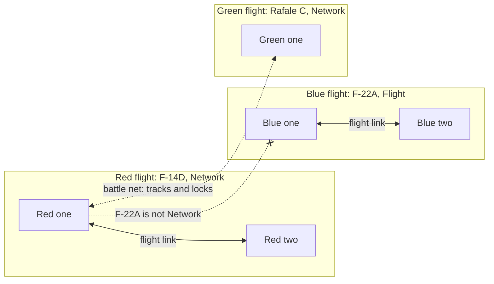

# Flight data link

> **T.O.R.E: Tasteful Opinionated Reverse Engineered.**
> The thing being reverse engineered is the *experience*, not the executable. We
> trace what a player does and what the game does back, down to the numbers they
> would notice. How the original code achieved it is history: useful evidence,
> never a blueprint. If a sentence below reads like an instruction to reproduce
> the original's internals, it is out of date.
> <!-- tore-header v2 -->

Stage G design of 2026-10-05, for the [multiplayer plan](multiplayer-plan.md#stages).
Nothing on this page is built yet. It is the guide for players and agents:
what a flight shares, which aircraft can share it, what the player sees and
hears, and how the AI uses it. The code design and the slices that build it
are in the [architecture guide](ARCHITECTURE.md#flight-data-link); the bytes on
the network are in the [wire protocol](formats/net-protocol.md#data-link-stage-g).

John set the feature on 2026-09-28 ([guide](MULTIPLAYER.md#flight-data-link)):
a wing shares one picture of who tracks what, who is locked on what and who
was assigned what; AI and humans read and write the same picture; it works in
single player; older aircraft get assignments by voice only, with bearing and
range from the receiver; a mixed flight shares what its least capable member
can receive; the picture updates 4 times a second and locks and assignments
go at once; every assignment is also a radio call. Everything else on this
page is an **agent proposal** awaiting John's review unless it says otherwise.
Fighters Anthology had no flight data link; its nearest feature, remote
targeting through a friendly sentry aircraft, is described
[below](#relation-to-fighters-anthology).

## Contents

- [In short](#in-short)
- [What a flight shares](#what-a-flight-shares)
- [Which aircraft can share it](#which-aircraft-can-share-it)
- [What the player sees](#what-the-player-sees)
- [What the player hears](#what-the-player-hears)
- [Giving assignments](#giving-assignments)
- [How the AI uses the link](#how-the-ai-uses-the-link)
- [Frequencies](#frequencies)
- [Timing](#timing)
- [Multiplayer and replays](#multiplayer-and-replays)
- [What changes in single player](#what-changes-in-single-player)
- [Numbers](#numbers)
- [Relation to Fighters Anthology](#relation-to-fighters-anthology)
- [Not in stage G](#not-in-stage-g)

## In short

- Each aircraft type has a **link tier**: Voice, Flight or Network.
- Two members of one flight are **linked** when both have at least the Flight
  tier. Linked members see each other's contacts, locks, assignments and
  state on their displays. A member that is not linked to another gets only
  what the radio says.
- Two aircraft of different flights on the same side are linked over the
  **battle net** when both have the Network tier. They share contacts and
  locks, never assignments.
- A flight lead **assigns** targets: one wingman, the whole flight, or a
  **sort** that gives each wingman a different bandit. Every assignment is a
  radio call, "Two, attack bandit, bearing 270, 15 miles, angels 20", with the
  bearing, range and height measured from the wingman who receives it.
- The AI reads the same picture instead of looking into other aircraft's
  minds, and an AI lead gives assignments too.
- Each flight talks on its own **wing net**. The side shares one **battle
  net**, which a player can choose to monitor.

## What a flight shares

The picture of one flight holds four things. Which of them a member receives
depends on its links ([tiers](#which-aircraft-can-share-it)).

| Part | What it holds | Who receives it | When it changes |
| --- | --- | --- | --- |
| **Engagements** | Which bandit each member is attacking: an AI's chosen target, a human's locked target | Every member, whatever its tier | At once |
| **Locks** | Which member holds a radar lock on which aircraft | Linked members | At once |
| **Assignments** | Which target the lead gave each member, how (link or voice), and whether the member has locked it since | The member assigned, and the lead; linked members see them on their displays | At once |
| **Tracks** | The hostile aircraft each member's radar, infrared sensor or eyes hold, with position and velocity | Linked members; Network members of other flights | 4 times a second |
| **Member state** | Each member's fuel state, weapons state and coarse damage | Linked members | 4 times a second |

*Agent proposal:* engagements reach every member, Voice tier included. The
retail AI already avoids piling onto a bandit a wingman is attacking (the
[B41 penalty](spec/ai.md#b41-target-retention-eligibility-and-ranking)), and
pilots without a data link tell each other by radio. Taking that away from
older aircraft would make their AI worse than retail's.

Tracks are aircraft only. Ground targets wait for the air-to-ground work.

**Member state** is coarse, as a pilot would report it. Position and heading,
which John's list includes, need nothing of their own: every aircraft is in
the picture each game draws and the AI already flies formation on them, so the
link adds only these three:

| State | Values |
| --- | --- |
| Fuel | Normal, joker, bingo, fumes, out: the [fuel call levels](spec/radio-chatter.md#fuel-calls) |
| Weapons | Missiles (any air-to-air missile left), guns only, Winchester (nothing left) |
| Damage | None, light (hit points above half), heavy (half or less) |

## Which aircraft can share it

Every aircraft type has one tier. Agent proposal for the twelve ported
aircraft, for John's approval (the plan asks for one). The F-22N and the
F/A-XX take the F-22A's row, as they take its sensors.

| Tier | Shares in its flight | Shares with other flights | Receives assignments |
| --- | --- | --- | --- |
| **Voice** | Engagements only, by radio | Nothing | By voice: bearing, range and height |
| **Flight** | Engagements, locks, assignments, tracks, member state | Nothing | By link, with display cues, and by voice |
| **Network** | As Flight | Tracks and locks, over the battle net, with other Network aircraft | As Flight |

| Aircraft | Tier | Why |
| --- | --- | --- |
| F/A-18D Hornet | Network | The retail manual lists an AN/ASW-25 radio data link |
| F-14D Tomcat | Network | The retail manual lists an AN/ASW-27B digital data link |
| Rafale C | Network | The retail manual lists MIDS, "equivalent to JTIDS/Link 16" |
| F-22A Raptor (F-22N, F/A-XX) | Flight | The retail manual: "Intra-flight data link automatically shares tactical information between two or more F-22s" |
| Su-35 | Flight | No evidence in the manual; a gameplay grouping for the late Flanker |
| Su-27 Flanker-B | Flight | No evidence in the manual; a gameplay grouping, so each side has linked fighters |
| MiG-29 Fulcrum-C | Voice | No link in the manual |
| MiG-23 Flogger-B | Voice | No link in the manual |
| MiG-21 Fishbed | Voice | No link in the manual |
| Su-25 Frogfoot-A | Voice | No link in the manual |
| A-4E Skyhawk | Voice | No link in the manual |
| X-31 EFM | Voice | A research aircraft with no tactical link |

The manual's avionics notes are evidence for a plausible grouping, not a
recovered game rule: the tiers are opinionated, like the rest of the link.
They are not derived from the radar presets or the countermeasure
generations, which are gameplay groupings of their own
([radar](radar.md)).

**The least capable member.** Each pair of members is judged on its own: two
members are linked when both have the Flight tier or better. In a flight of
two F-22As and an A-4E, the F-22As share their picture with each other, and
the A-4E hears the radio. Quick Mission wings fly one aircraft type, so a
Quick Mission flight is always all one tier; mixed flights come with missions
and campaigns, and stage G's tests build them directly.

## What the player sees

Cues appear only where the player's aircraft is linked to the member they are
about. A Voice-tier aircraft shows none of them; its pilot hears the radio.

| Where | Cue |
| --- | --- |
| Radar | A contact a flightmate has locked carries that member's number to the right of its square (up to two numbers, then `+`). A contact the lead assigned to you has a diamond around it, blinking once a second until you lock it, then steady. A contact the player, as lead, assigned carries the wingman's number to its left. A track that only a linked aircraft sees (your own radar does not) is a hollow square in peach, retail's colour for remote contacts |
| Target window | A tag under the activity line: `ASSIGNED BY LEAD`, `ASSIGNED TO 2`, `2 LOCKED`, `2 3 LOCKED` or, over the battle net, `LOCKED BY BLUE 1`. When the displayed aircraft is a linked flightmate, its state: `FUEL BINGO  GUNS ONLY  DAMAGED` |
| HUD | The assigned target wears four corner brackets, a different shape from the target box, blinking once a second until you lock it; the brackets go when you lock it |
| Sort warning | When you and a linked flightmate lock the same aircraft, unless the lead assigned it to you both: the HUD line `Sort: Red two is locked on your target.` and a short beep (`^BEEP2`, the retail radar-link beep) |

Every cue is an agent proposal. The colours, shapes and words follow the
displays as they are: the radar's square contacts and bracket selection mark,
the target window's upper-case lines, and the HUD's one-line messages
([radar](spec/radar.md), [target window](spec/target-window.md)).

A link track can be looked at but not designated in stage G: the designation
keys still cycle the player's own contacts. Retail let a player designate a
sentry aircraft's remote contacts ([below](#relation-to-fighters-anthology)),
so designating link tracks is a likely follow-up.

## What the player hears

**The assignment call.** The lead says it, on the wing net. It is never
dropped by radio silence, as the player's orders are not.

| Part | Words | Recordings |
| --- | --- | --- |
| Who | The wingman's position, "Two"; the flight colour, "Red", when the whole flight is addressed | `^NUM02`; `^RED`, `^BLUE`, `^GREEN`, `^BLACK`, `^WHITE` (orange, purple and yellow flights have the words only) |
| What | "attack bandit" | `^ATTACK`, `^BANDIT` |
| Bearing | "bearing 270": from the wingman to the target, whole degrees | `^BEARING` and the number |
| Range | "15 miles": from the wingman, whole nautical miles; left out under 1 mile | the miles rule of the contact report |
| Height | "angels 20": the target's height in thousands of feet | `^ANGELS` and the number |

Example: "Two, attack bandit, bearing 270, 15 miles, angels 20." Numbers
follow retail's rule for the waypoint call: up to twelve is one word, larger
numbers are said digit by digit ("two seven zero"), and the last digit of the
bearing and the height falls in pitch
([radio chatter](spec/radio-chatter.md#waypoint-calls)). Ranges of 1 to 10,
20 and 30 miles have their own recordings. The recordings for bearing, angels
and the flight colours were imported and unused until now.

There is no "engage" recording (only the reply "Engaging"), so the call says
"attack", as retail's own attack order does. The words are an agent proposal;
the shape is John's example.

When the whole flight is addressed, the call is made once and each hearer
hears the bearing, range and height from its own aircraft, as each hearer of a
contact report hears its own clock position.

**Replies.** A wingman that takes an assignment by link answers as it answers
"Engage my target" today ("Engaging", "I'm on him" and the other retail
lines). A Voice-tier AI wingman answers "Tally Ho" (`^TALLYHO`) once it finds
the bandit, and nothing if it never does. A human wingman answers with the
reply keys of stage F's phase 2.

**The sort warning** is a beep and a HUD line, with no voice: retail has no
recording for "sort", "locked" or "spike".

## Giving assignments

Only the aircraft that leads its wing assigns, as only it can give wing
orders today.

| Order | Key | What the link does |
| --- | --- | --- |
| Engage my target | Alt+E (existing) | Assigns the lead's designated target to the addressed wingman, or to every wingman with Alt+0 |
| Engage from formation | Alt+R (existing) | The same assignment; the wingman stays in formation as before |
| **Sort** | **Alt+A** (new, proposed) | Gives each addressed wingman a different bandit from the lead's picture |
| Disengage, protect me, attack on contact, bug out, land | existing keys | Clear the addressed wingmen's assignments |

Address a wingman first with Alt+Shift+1 to 4, or the whole flight with Alt+0,
as today ([controls](CONTROLS.md)).

**Sort.** The lead's own target (its designation, or its AI target) stays
the lead's. The other hostile aircraft the lead knows of within 40 nautical
miles (its own contacts, plus linked tracks when it has a Flight tier or
better) are handed out to the addressed wingmen in member order, each taking
the bandit nearest to itself that nobody has yet. When there are more
wingmen than bandits, the spare wingmen take the bandit nearest to them, at
most two to one bandit. A wingman known to be Winchester, at bingo fuel or
worse, or heavily damaged is skipped. Each assignment is its own radio call,
3.5 seconds apart.

**Ends of an assignment.** An assignment lasts until the target is destroyed
or lands, the wingman or the target is lost, the lead gives that wingman
another target order, or the lead changes. Locking the target marks it
acknowledged: the cues stop blinking.

## How the AI uses the link

- **Choosing a target.** The retail penalty against attacking a bandit a
  wingman already attacks now reads the flight's engagements in the picture.
  The picture also counts a human member's locked target, which today's AI
  cannot see.
- **Taking an assignment by link.** The wingman gets the target itself. If its
  own sensors do not hold the target, but a linked flightmate's track does, it
  flies toward the track until its own radar or eyes find it. Today it refuses
  such an order ("cannot see the target").
- **Taking an assignment by voice.** A Voice-tier AI wingman gets only the
  words: the bearing, range and height it heard. It looks for a hostile
  aircraft its own sensors hold near that point (within 3 miles plus a tenth
  of the range said, and 5,000 feet of the height said) and takes the nearest.
  If it holds none, it flies toward the point for up to 60 seconds, looking.
- **An AI lead assigns.** Under loose control an AI lead shares its target
  with wingmen in formation, up to two attackers on one bandit. That is the
  retail rule ([wing control](spec/ai.md#b43-wing-commands-and-formation-variation)
  and its attacker allowance, [B41](spec/ai.md#b41-target-retention-eligibility-and-ranking)),
  specified but never connected until now. An AI lead with a Flight tier or
  better sorts instead when it commits and knows of two or more bandits, at
  most once every 30 seconds. Its assignments are radio calls like a human
  lead's.
- **The sort warning.** When two linked members lock the same bandit and
  neither was assigned it, the AI member with the higher member number looks
  for another target and leaves that bandit alone for 10 seconds, if another
  is eligible. A human is never moved.
- **Member state.** An AI lead skips wingmen it knows to be Winchester, at
  bingo fuel or worse, or heavily damaged. A Voice-tier lead knows only what
  its wingmen said on the radio (their fuel calls).

## Frequencies

Today every seat has one radio channel and hears its own flight. Stage G
names that the **wing net** and adds the side's **battle net**.

| Net | Who talks on it | Who hears it |
| --- | --- | --- |
| Wing net, one per flight | Everything a flight says today, and the assignment calls | The flight, as today |
| Battle net, one per side | The leads of the side's flights repeat their contact reports and assignment calls; the Network data link | Seats that monitor it, with **Alt+N** (new, proposed; off by default, so single player sounds as it does today); Network aircraft for the link |

A battle-net line is labelled by flight and position ("Blue one"), voiced with
the flight colour where it has a recording, and shown with `Net` before the
speaker on the HUD line. Radio silence drops battle-net chatter as it drops
wing chatter. Retail's AWACS report (`^NOBADET`, `^NOTOREP`, `^BANSVIR` and
the contact words) belongs on the battle net, but its trigger is unknown
([radio chatter](spec/radio-chatter.md#awacs-report)) and no ported aircraft is
a sentry, so it waits.

Text chat keeps its own receivers (All, Friendlies, Enemies, Wing, Target):
nets are for radio calls.

## Timing

| Item | Rate |
| --- | --- |
| Tracks and member state | Published 4 times a second, on every thirtieth tick (John, 2026-09-28) |
| Engagements, locks, assignments, sort warnings | The tick they happen (John, 2026-09-28: sent at once) |
| An AI wingman's view of its flight's engagements | As each AI decides, in turn, within the tick, which keeps the AI's same-tick visibility (John, 2026-10-02) |
| The assignment call | At once for the first; 3.5 seconds apart within a sort |

## Multiplayer and replays

The host computes the whole picture. Each player's game receives its own
aircraft's share of it inside the cockpit readout, and each assignment, lock
change and sort warning as an event at once, the way radio calls arrive
([wire](formats/net-protocol.md#data-link-stage-g)). A human in slot 2 sees
exactly what the AI in slot 2 would receive, which is John's rule.

A replay records each member's tier at the start, every assignment (with its
call's words), lock, acknowledgement, cleared assignment and sort warning, as
`datalink` events beside the communication journal. The assignment calls land
in the comms record as radio calls ([replays](REPLAYS.md)). The 4-times-a-second
tracks are not recorded: they are what each aircraft's sensors held, which the
AI thinking record already shows for the AI.

## What changes in single player

Stage G is a planned single-player change (the AI wingmen gain the picture
and new calls). Each change lands on its own with a single-player baseline
comparison that explains every difference; John approves the differences
before the merge. In order:

1. The AI counts a human's locked target as an engagement: AI wingmen spread
   away from the player's bandit.
2. The player's Engage my target and Engage from formation say the
   assignment call instead of "Attack".
3. Wingmen take assignments by tier: linked wingmen pursue a target only a
   flightmate's track holds; Voice-tier wingmen search the point they heard.
4. AI leads share and sort, and linked AI members move off a bandit when the
   sort warning fires.
5. The cues are drawn.
6. Recordings gain the `datalink` events.

The new keys (Alt+A, Alt+N) change nothing until pressed, and the battle net
is silent until monitored.

## Numbers

Every number below is **fitted**, an agent decision recorded for review, unless
it says otherwise.

| Item | Value |
| --- | --- |
| Publishing | Every 30 ticks, at ticks divisible by 30 |
| Tracks a flight shares | 32, nearest to the flight's lead |
| Tracks in one player's readout | 24, nearest to the player's aircraft |
| Sort and share reach | 40 nautical miles from the lead |
| Attackers on one bandit in a sort | At most 2, retail's "two" attacker allowance |
| Calls in a sort | 3.5 seconds apart |
| AI lead's sorts | At most one every 30 seconds per flight |
| Voice cue match | Within 3 nautical miles plus a tenth of the range said, and 5,000 feet of the height said |
| Voice cue search | Up to 60 seconds |
| Sort warning | Once per pair of locks on one bandit; at most one every 10 seconds per seat |
| Yield after a sort warning | 10 seconds away from that bandit |
| Blinking cues | Once a second, half on, as the HUD's radar-ready diamond |
| Heavy damage | Hit points at half or less |

## Relation to Fighters Anthology

Retail had no flight data link between wingmen. It had **remote targeting**:
with a friendly sentry aircraft (E-3, E-2C, Il-76, the J-STAR or a recon drone)
in the mission, Shift+A ("Supplemental air-air radar link on.") put the sentry's
air contacts on the player's radar as peach-coloured contacts, which the
targeting keys could select, and Shift+G did the same for ground targets
(manual, "Remote Targeting"; [radio chatter](spec/radio-chatter.md#datalink-and-rearm-messages);
[keyboard](spec/keyboard.md)). TORE ports no sentry aircraft yet, so remote
targeting is not built. The link borrows retail's peach for tracks that are
not the player's own, so the two will look alike when it is.

Retail's own wing behaviour stays: the penalty against doubling up on a bandit,
the loose-control target share and the engage replies are retail rules the
link now carries, not new ones.

## Not in stage G

- Designating link tracks with the targeting keys (likely next, see above).
- Remote targeting through sentry aircraft, and the AWACS report.
- Ground targets in the picture.
- Assignments across flights (a mission commander assigning another flight).
- Relaying: a Flight-tier member never passes on what it hears over the
  battle net, because it cannot hear it.
- Per-aircraft link tiers for mods and new aircraft beyond the F-22A's
  variants: each new aircraft needs its row.
