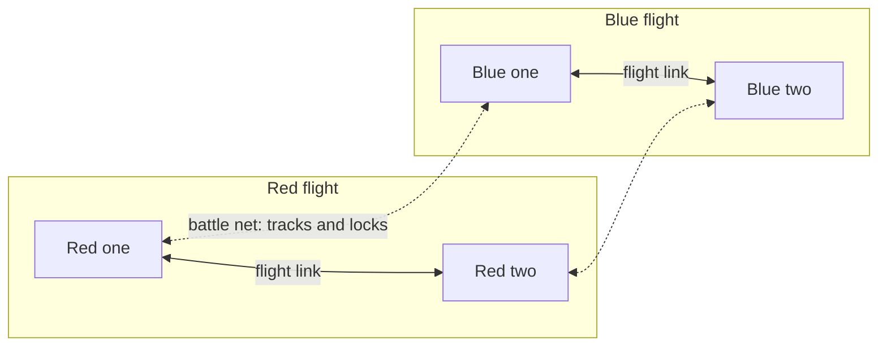

# Flight data link

> **T.O.R.E: Tasteful Opinionated Reverse Engineered.**
> The thing being reverse engineered is the *experience*, not the executable. We
> trace what a player does and what the game does back, down to the numbers they
> would notice. How the original code achieved it is history: useful evidence,
> never a blueprint. If a sentence below reads like an instruction to reproduce
> the original's internals, it is out of date.
> <!-- tore-header v2 -->

Stage G design of 2026-10-05, for the [multiplayer plan](multiplayer-plan.md#stages).
Built so far: the radar table and the picture's bookkeeping (slice G0), the engagement table (G1), the assignments with their calls (G3a), the player's locked target in the AI's engagement table (G2), the cues (G6) and the sort order on Alt+A (G3c, 2026-10-05). Of this page a player today meets the assignment call, the sort, AI wingmen that spread away from the bandit the player has locked, and the cues (the radar markers, the target window tags, the HUD brackets and the sort warning); the rest waits for its slices. It is the guide for players and agents:
what a flight shares, who can share it, what the player sees and
hears, and how the AI uses it. The code design and the slices that build it
are in the [architecture guide](ARCHITECTURE.md#flight-data-link); the bytes on
the network are in the [wire protocol](formats/net-protocol.md#data-link-stage-g).

John set the feature on 2026-09-28 ([guide](MULTIPLAYER.md#flight-data-link)):
a wing shares one picture of who tracks what, who is locked on what and who
was assigned what; AI and humans read and write the same picture; it works in
single player; the picture updates 4 times a second and locks and assignments
go at once; every assignment is also a radio call, with bearing and range from
the receiver. John first asked for older aircraft to get assignments by voice
only and for a mixed flight to share what its least capable member could
receive. He dropped that on 2026-10-05: **all friendlies get the data link
whatever their aircraft type**, and an aircraft with no radar only lacks the
radar scope's marks ([decisions](MULTIPLAYER.md#decisions); John's ruling of
2026-10-05, below). Everything else
on this page is an **agent proposal** awaiting John's review unless it says
otherwise.
Fighters Anthology had no flight data link; its nearest feature, remote
targeting through a friendly sentry aircraft, is described
[below](#relation-to-fighters-anthology).

## Contents

- [In short](#in-short)
- [What a flight shares](#what-a-flight-shares)
- [Who shares it](#who-shares-it)
- [What the player sees](#what-the-player-sees)
- [What the player hears](#what-the-player-hears)
- [Giving assignments](#giving-assignments)
- [How the AI uses the link](#how-the-ai-uses-the-link)
- [Frequencies](#frequencies)
- [Timing](#timing)
- [Multiplayer and replays](#multiplayer-and-replays)
- [What changes in single player](#what-changes-in-single-player)
- [Numbers](#numbers)
- [Relation to Fighters Anthology](#relation-to-fighters-anthology)
- [Not in stage G](#not-in-stage-g)

## In short

- Every aircraft of a side is **linked** with every other, whatever its type
  (John, 2026-10-05). Members of one flight see each other's contacts, locks,
  assignments and state on their displays. Aircraft of different flights on
  the same side are linked over the **battle net**: they share contacts and
  locks, never assignments.
- The one thing that depends on the aircraft type is whether it has a
  **radar**. An aircraft with no radar is still linked, and its AI uses the
  picture like any other; its player sees every cue except the radar scope's
  marks, because the aircraft has no scope (John, 2026-10-05). Every aircraft ported so far has
  a radar.
- A flight lead **assigns** targets: one wingman, the whole flight, or a
  **sort** that gives each wingman a different bandit. Every assignment is a
  radio call, "Two, attack bandit, bearing 270, 15 miles, angels 20", with the
  bearing, range and height measured from the wingman who receives it.
- The AI reads the same picture instead of looking into other aircraft's
  minds, and an AI lead gives assignments too.
- Each flight talks on its own **wing net**. The side shares one **battle
  net**, which a player can choose to monitor.

## What a flight shares

The picture of one flight holds five things. Every member of the side
receives them, as the table says ([who shares it](#who-shares-it)).

| Part | What it holds | Who receives it | When it changes |
| --- | --- | --- | --- |
| **Engagements** | Which bandit each member is attacking: an AI's chosen target, a human's locked target | Every member of the flight | At once |
| **Locks** | Which member holds a radar lock on which aircraft | Every member of the side, in the flight and over the battle net | At once |
| **Assignments** | Which target the lead gave each member, and whether the member has locked it since | The member assigned, and the lead; the flight sees them on its displays | At once |
| **Tracks** | The hostile aircraft each member's radar, infrared sensor or eyes hold, with position and velocity | Every member of the side, in the flight and over the battle net | 4 times a second |
| **Member state** | Each member's fuel state, weapons state and coarse damage | The flight | 4 times a second |

*Agent proposal:* engagements reach every member of the flight. The retail
AI already avoids piling onto a bandit a wingman is attacking (the
[B41 penalty](spec/ai.md#b41-target-retention-eligibility-and-ranking)), so the
picture carries that rule, and a human's locked target joins it.

Tracks are aircraft only. Ground targets wait for the air-to-ground work.

**Member state** is coarse, as a pilot would report it. Position and heading,
which John's list includes, need nothing of their own: every aircraft is in
the picture each game draws and the AI already flies formation on them, so the
link adds only these three:

| State | Values |
| --- | --- |
| Fuel | Normal, joker, bingo, fumes, out: the [fuel call levels](spec/radio-chatter.md#fuel-calls) |
| Weapons | Missiles (any air-to-air missile left), guns only, Winchester (nothing left) |
| Damage | None, light (hit points above half), heavy (half or less) |

## Who shares it

**John, 2026-10-05:** "All friendlies get data link regardless of aircraft
type (unless radar isn't on the plane which then player doesn't see)." So the
design has no tiers and no rule about the least capable member. Every aircraft
of a side is a member of the picture with the whole capability: sharing inside
its flight and over the side's battle net.

The aircraft type holds one flag, **has a radar**
(`tore_sim::datalink::has_radar`). The F-22N and the F/A-XX take the F-22A's
row, as they take its sensors. Every ported aircraft has a radar record
(`--sensor-summary` lists each one's), so the flag is true for all fourteen
selectable aircraft today. It is there for the first aircraft without one.

An aircraft with no radar:

- is a member like any other: its AI reads the picture, takes assignments
  and shares what it holds, and the other members see its locks, tracks and
  state;
- gives its player every cue except the radar scope's marks. **John,
  2026-10-05:** "keep target window and hud cues, just we can't see the
  radar." The target window's tag and flightmate state, the HUD's brackets
  and the sort warning stay; the scope is the one display it does not have.
  (Slice G6 first gated every cue on the radar flag, an agent decision that
  John narrowed the same day.)

## What the player sees

Cues are about the members of the player's side. An aircraft with no radar
shows all of them but the radar scope's marks (John, 2026-10-05; see
[who shares it](#who-shares-it)).

| Where | Cue |
| --- | --- |
| Radar | A contact a flightmate has locked carries that member's number to the right of its square (up to two numbers, then `+`). A contact the lead assigned to you has a diamond around it, blinking once a second until you lock it, then steady. A contact assigned to a flightmate carries that member's number to its left (the lead sees its wingmen's, and so does every other member of the flight). A track that only another member sees (your own radar does not) is a hollow square in peach, retail's colour for remote contacts. Marks sit on remote tracks too |
| Target window | A tag under the activity line, the first that applies: `ASSIGNED BY LEAD`, `ASSIGNED TO 2` (or `2 3`), `2 LOCKED` (or `2 3 LOCKED`) or, over the battle net, `LOCKED BY BLUE 1`. When the displayed aircraft is a flightmate, its state follows, a line for each thing not as it should be: `FUEL BINGO`, `GUNS ONLY` (or `WINCHESTER`), `DAMAGED` (or `HEAVILY DAMAGED`) |
| HUD | The assigned target wears four corner brackets, a different shape from the target box, blinking once a second until you lock it; the brackets go when you lock it. They show only where the target is inside the HUD's view |
| Sort warning | When you and a flightmate lock the same aircraft, unless the lead meant it (both of you were assigned it, or one of you assigned it to the other): the HUD line `Sort: Red two is locked on your target.` and a short beep (`^BEEP2`, the retail radar-link beep) |

Every cue is an agent proposal, built as written in slice G6. The colours,
shapes and words follow the displays as they are: the radar's square contacts and bracket selection mark,
the target window's upper-case lines, and the HUD's one-line messages
([radar](spec/radar.md), [target window](spec/target-window.md)).

A link track can be looked at but not designated in stage G: the designation
keys still cycle the player's own contacts. Retail let a player designate a
sentry aircraft's remote contacts ([below](#relation-to-fighters-anthology)),
so designating link tracks is a likely follow-up.

## What the player hears

**The assignment call.** The lead says it, on the wing net. It is never
dropped by radio silence, as the player's orders are not.

| Part | Words | Recordings |
| --- | --- | --- |
| Who | The wingman's position, "Two"; the flight colour, "Red", when the whole flight is addressed | `^NUM02`; `^RED`, `^BLUE`, `^GREEN`, `^BLACK`, `^WHITE` (orange, purple and yellow flights have the words only) |
| What | "attack bandit" | `^ATTACK`, `^BANDIT` |
| Bearing | "bearing 270": from the wingman to the target, true, whole degrees from 1 to 360, always three digits said one by one: 016 is "zero one six", 005 is "zero zero five", north is "three six zero" (John, 2026-10-05: real-world brevity) | `^BEARING` and one `^NUMnn` for each digit, `^NUM00` for a zero |
| Range | "15 miles": from the wingman, over the ground, whole nautical miles; left out under 1 mile | the miles rule of the contact report |
| Height | "angels 20": the target's height in thousands of feet, to the nearest thousand | `^ANGELS` and the number |

Example: "Two, attack bandit, bearing 270, 15 miles, angels 20." The bearing
is John's: three digits one by one, with the original's zero recording. The
range and the height follow retail's rule for the waypoint call: up to twelve
is one word, larger numbers are said digit by digit, and the last digit of the
bearing and the height falls in pitch
([radio chatter](spec/radio-chatter.md#waypoint-calls)). Ranges of 1 to 10,
20 and 30 miles have their own recordings. The recordings for bearing, angels
and the flight colours were imported and unused until now.

There is no "engage" recording (only the reply "Engaging"), so the call says
"attack", as retail's own attack order does. The words are an agent proposal;
the shape is John's example.

**A blanket attack order.** An order that names no target, such as Attack on
contact to the wingmen, is called "Attack bandits" (`^ATTACK`, `^BANDITS`)
with no bearing, range or height (John, 2026-10-05). It makes no assignment.

When the whole flight is addressed, the call is made once and each hearer
hears the bearing, range and height from its own aircraft, as each hearer of a
contact report hears its own clock position. The lead, who speaks the call,
hears it from the first wingman addressed, the one that replies. Today only
the human lead hears it: giving it to a human wingman's radio is stage F's
order call (slice F2-R).

**Replies.** A wingman that takes an assignment answers as it answers
"Engage my target" today ("Engaging", "I'm on him" and the other retail
lines). A human wingman answers with the reply keys of stage F's phase 2.

**The sort warning** is a beep and a HUD line, with no voice: retail has no
recording for "sort", "locked" or "spike".

## Giving assignments

Only the aircraft that leads its wing assigns, as only it can give wing
orders today.

| Order | Key | What the link does |
| --- | --- | --- |
| Engage my target | Alt+E (existing) | Assigns the lead's designated target to the addressed wingman, or to every wingman with Alt+0 |
| Engage from formation | Alt+R (existing) | The same assignment; the wingman stays in formation as before |
| **Sort** | **Alt+A** (new, John 2026-10-05; built, G3c) | Gives each addressed wingman a different bandit from the lead's picture |
| Disengage, protect me, attack on contact, bug out, land | existing keys | Clear the addressed wingmen's assignments |

Address a wingman first with Alt+Shift+1 to 4, or the whole flight with Alt+0,
as today ([controls](CONTROLS.md)).

**Sort (built, slice G3c, 2026-10-05).** The lead's own target (its designation,
or its AI target) stays the lead's. The other hostile aircraft the side's
picture holds that are within 40 nautical miles of the lead (in a straight
line) are handed out to the addressed wingmen in member order, each taking
the bandit nearest to itself that nobody has yet. When there are more
wingmen than bandits, the spare wingmen take the bandit nearest to them, at
most two to one bandit. A wingman known to be Winchester, at bingo fuel or
worse, or heavily damaged is skipped. Each assignment is its own radio call,
3.5 seconds apart. In the game:

- Address the flight with Alt+0 or one wingman with Alt+Shift+1 to 4 first,
  as for any order. A human wingman gets the assignment's cues; an AI
  wingman takes the bandit as it takes Engage my target (its first wingman
  answers "Engaging") and flies the bandit's track if its own sensors have
  not found it yet.
- The first call plays at once, as every order does. Each later call (one for
  each AI wingman, in member order) follows 3.5 seconds after the one before
  and is heard as a radio line from your own flight position ("Red one:
  'Four, attack bandit, bearing 090, 12 miles, angels 20'"). A human
  wingman gets no call yet: that is stage F's order call to human wingmen.
- The HUD line reads "Sort: 3 assigned", with ", 1 skipped" for each wingman
  left out for its state and ", 1 without a bandit" for each fit wingman that
  found every bandit already taken by two. With no bandit in reach (or none
  but your own target) it reads "Sort: no other bandit in reach".
- The bandits are the picture's tracks, published four times a second, carried
  forward at their velocity to the moment of the sort. They include your own
  contacts, which your flight publishes with everyone else's; a bandit first
  sensed in the last quarter second is not yet known to the sort.
- *Agent decisions:* the range is measured in a straight line, not over the
  ground. Distances and ties: the lower aircraft id wins a tie. Wingmen's
  fuel, weapons and damage are as the picture last published them, so a
  wingman not yet published is taken as fit. A sort assignment is recorded
  with the order "Sort", and the AI wingman's order in the comms journal is an
  "Engage my target" to that wingman alone (one line each).

**Ends of an assignment.** An assignment lasts until the target is destroyed
or lands, the wingman or the target is lost, the lead gives that wingman
another target order, or the lead changes. Locking the target marks it
acknowledged: the cues stop blinking.

## How the AI uses the link

- **Choosing a target.** The retail penalty against attacking a bandit a
  wingman already attacks now reads the flight's engagements in the picture.
  The picture also counts a human member's locked target, which the AI could
  not see before: **built (slice G2, 2026-10-05)**. An AI wingman ranks the
  bandit its human flightmate has locked 10,000 ft farther away than it is
  (20,000 ft when two others already attack it), so it takes another bandit if
  one is nearly as close. A bandit the wingman already attacks and is within
  20,000 ft stays its target, as before.
- **Taking an assignment: built (slice G3b, 2026-10-05).** The wingman gets
  the target itself. If its own sensors do not hold the target, but a
  flightmate's track does, it takes the order anyway, keeps the target and
  flies toward the track (carried forward at the track's velocity) until its
  own radar or eyes find it. It never launches or locks on what only the link
  holds: it fires only on a target it holds itself. The link covers the two
  Engage orders; Approach still needs the wingman's own sensors. When neither
  the wingman nor the picture holds the aircraft (the picture's tracks are
  four a second, so an order in the first quarter second of a contact), it
  answers "cannot see the target" as before. The track is the freshest one any
  member of the side reports; if no member reports it any more, the wingman
  falls back to choosing a target as it would without the order.
- **An AI lead assigns.** Under loose control an AI lead shares its target
  with wingmen in formation, up to two attackers on one bandit. That is the
  retail rule ([wing control](spec/ai.md#b43-wing-commands-and-formation-variation)
  and its attacker allowance, [B41](spec/ai.md#b41-target-retention-eligibility-and-ranking)),
  specified but never connected until now. An AI lead
  sorts instead when it commits and knows of two or more bandits, at
  most once every 30 seconds. Its assignments are radio calls like a human
  lead's.
- **The sort warning.** When two members of a flight lock the same bandit and
  neither was assigned it, the AI member with the higher member number looks
  for another target and leaves that bandit alone for 10 seconds, if another
  is eligible. A human is never moved.
- **Member state.** An AI lead skips wingmen it knows to be Winchester, at
  bingo fuel or worse, or heavily damaged.

## Frequencies

Today every seat has one radio channel and hears its own flight. Stage G
names that the **wing net** and adds the side's **battle net**.

| Net | Who talks on it | Who hears it |
| --- | --- | --- |
| Wing net, one per flight | Everything a flight says today, and the assignment calls | The flight, as today |
| Battle net, one per side | The leads of the side's flights repeat their contact reports and assignment calls; the data link between flights | Seats that monitor it, with **Alt+N** (new, proposed; off by default, so single player sounds as it does today); every aircraft of the side for the link |

A battle-net line is labelled by flight and position ("Blue one"), voiced with
the flight colour where it has a recording, and shown with `Net` before the
speaker on the HUD line. Radio silence drops battle-net chatter as it drops
wing chatter. Retail's AWACS report (`^NOBADET`, `^NOTOREP`, `^BANSVIR` and
the contact words) belongs on the battle net, but its trigger is unknown
([radio chatter](spec/radio-chatter.md#awacs-report)) and no ported aircraft is
a sentry, so it waits.

Text chat keeps its own receivers (All, Friendlies, Enemies, Wing, Target):
nets are for radio calls.

## Timing

| Item | Rate |
| --- | --- |
| Tracks and member state | Published 4 times a second, on every thirtieth tick (John, 2026-09-28) |
| Engagements, locks, assignments, sort warnings | The tick they happen (John, 2026-09-28: sent at once) |
| An AI wingman's view of its flight's engagements | As each AI decides, in turn, within the tick, which keeps the AI's same-tick visibility (John, 2026-10-02) |
| The assignment call | At once for the first; 3.5 seconds apart within a sort |

## Multiplayer and replays

The host computes the whole picture. Each player's game receives its own
aircraft's share of it inside the cockpit readout, and each assignment, lock
change and sort warning as an event at once, the way radio calls arrive
([wire](formats/net-protocol.md#data-link-stage-g)). A human in slot 2 sees
exactly what the AI in slot 2 would receive, which is John's rule.

A replay records each member's radar flag at the start, every assignment (with its
call's words), lock, acknowledgement, cleared assignment and sort warning, as
`datalink` events beside the communication journal. The assignment calls land
in the comms record as radio calls ([replays](REPLAYS.md)). The 4-times-a-second
tracks are not recorded: they are what each aircraft's sensors held, which the
AI thinking record already shows for the AI.

## What changes in single player

Stage G is a planned single-player change (the AI wingmen gain the picture
and new calls). Each change lands on its own with a single-player baseline
comparison that explains every difference; John approves the differences
before the merge. In order:

1. The AI counts a human's locked target as an engagement: AI wingmen spread
   away from the player's bandit.
2. The player's Engage my target and Engage from formation say the
   assignment call instead of "Attack".
3. Wingmen take assignments by link (built, G3b): they pursue a target only a
   flightmate's track holds, where they used to refuse it.
4. AI leads share and sort, and AI members move off a bandit when the
   sort warning fires.
5. The cues are drawn (built, G6): the flightmates' lock numbers, the tags and the sort warning show in a flight with AI wingmen; the assignment cues wait for the lead's assignments (G3a).
6. Recordings gain the `datalink` events.

The new keys (Alt+A, built; Alt+N) change nothing until pressed, and the battle net
is silent until monitored.

## Numbers

Every number below is **fitted**, an agent decision recorded for review, unless
it says otherwise.

| Item | Value |
| --- | --- |
| Publishing | Every 30 ticks, at ticks divisible by 30 |
| Tracks a flight shares | 32, nearest to the flight's lead |
| Tracks in one player's readout | 24, nearest to the player's aircraft |
| Sort and share reach | 40 nautical miles from the lead |
| Attackers on one bandit in a sort | At most 2, retail's "two" attacker allowance |
| Calls in a sort | 3.5 seconds apart |
| AI lead's sorts | At most one every 30 seconds per flight |
| Sort warning | Once per pair of locks on one bandit; at most one every 10 seconds per seat |
| Yield after a sort warning | 10 seconds away from that bandit |
| Blinking cues | Once a second, half a second on, as the warning receiver blinks (the HUD's radar-ready diamond blinks twice a second; agent decision, G6) |
| Heavy damage | Hit points at half or less |

## Relation to Fighters Anthology

Retail had no flight data link between wingmen. It had **remote targeting**:
with a friendly sentry aircraft (E-3, E-2C, Il-76, the J-STAR or a recon drone)
in the mission, Shift+A ("Supplemental air-air radar link on.") put the sentry's
air contacts on the player's radar as peach-coloured contacts, which the
targeting keys could select, and Shift+G did the same for ground targets
(manual, "Remote Targeting"; [radio chatter](spec/radio-chatter.md#datalink-and-rearm-messages);
[keyboard](spec/keyboard.md)). TORE ports no sentry aircraft yet, so remote
targeting is not built. The link borrows retail's peach for tracks that are
not the player's own, so the two will look alike when it is.

Retail's own wing behaviour stays: the penalty against doubling up on a bandit,
the loose-control target share and the engage replies are retail rules the
link now carries, not new ones.

## Not in stage G

- Designating link tracks with the targeting keys (likely next, see above).
- Remote targeting through sentry aircraft, and the AWACS report.
- Ground targets in the picture.
- Assignments across flights (a mission commander assigning another flight).
- Per-aircraft capability beyond the radar flag: each new aircraft needs its
  row.
