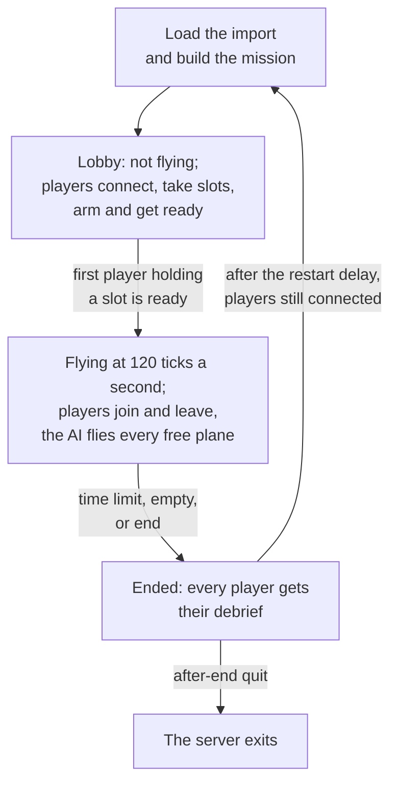

# Dedicated server

> **T.O.R.E: Tasteful Opinionated Reverse Engineered.**
> The thing being reverse engineered is the *experience*, not the executable. We
> trace what a player does and what the game does back, down to the numbers they
> would notice. How the original code achieved it is history: useful evidence,
> never a blueprint. If a sentence below reads like an instruction to reproduce
> the original's internals, it is out of date.
> <!-- tore-header v2 -->

Stage D design of 2026-09-30, reviewed by John the same day. **Built (D7b, on
the host session of D7a):** the program: the options, the configuration file,
the import, `--check`, the start-up refusals, the real-time run loop, the
console, the status line and the log; on 127.0.0.1 a scripted client joins over
a real UDP socket, flies and leaves, and `quit` stops the server. **Built
(D8b):** the game joins one with `--connect` ([joining from the
game](#joining-from-the-game)). **Built (EF3):** a player's game hosts the
same host session itself with `--host` ([hosting from the
game](#hosting-from-the-game)). **Built (I3):** it lists itself on the
Internet Lobby when `broadcast` is on ([broadcasting](#broadcasting-on-the-internet-lobby)).
The dedicated server is part of the [multiplayer plan](multiplayer-plan.md#stages)
and the [multiplayer guide](MULTIPLAYER.md#dedicated-servers). Fighters
Anthology had no dedicated server; everything on this page is an agent
proposal unless it is credited to John.

## Contents

- [What it is](#what-it-is)
- [Importing the game](#importing-the-game)
- [Running it](#running-it)
- [The configuration file](#the-configuration-file)
- [The mission file](#the-mission-file)
- [The mission lifecycle](#the-mission-lifecycle)
- [The lobby](#the-lobby)
- [Joining from the game](#joining-from-the-game)
- [Hosting from the game](#hosting-from-the-game)
- [Finding games from the command line](#finding-games-from-the-command-line)
- [Broadcasting on the Internet Lobby](#broadcasting-on-the-internet-lobby)
- [Console, status and logs](#console-status-and-logs)
- [Ports and firewalls](#ports-and-firewalls)
- [Discovery and the firewall](#discovery-and-the-firewall)
- [Running it as a service](#running-it-as-a-service)
- [Performance](#performance)
- [Security](#security)
- [Not in stage D](#not-in-stage-d)

## What it is

`tore-server` is a separate program with no window, graphics or sound. It
runs one Quick Mission at a time at a fixed 120 ticks a second, never paused.
The AI flies every aircraft no human holds, and players join with the game and
take aircraft in flight. It builds for Linux, Windows and macOS from the same
workspace as the game:

```sh
cargo build --release --locked -p tore-server
```

It does not link the game's windowing, graphics or audio libraries, so it
starts on a machine without a display or a sound system.

The server simulates the flight models, terrain and weapons from the retail
data, so it needs its operator's own copy of Fighters Anthology, imported the
same way the game imports it. Nothing derived from retail media is ever sent
over the network: every player's game reads its own import, and the server
checks that the two agree ([content check](#joining-from-the-game)).

## Importing the game

```sh
tore-server --import /path/to/FIGHTERS
```

The path is an installed Fighters Anthology folder or a disc folder (the one
holding `SETUP.ESA`), exactly as the game's first-run import accepts, from the
1.0 disc build or the 1.02F patch ([first-run import](spec/first-run-import.md)).
It writes the import into the data folder and prints where its report is. The
import is the same code the game runs, moved into the `tore-import` library.

The data folder is the game's own by default (`TORE_DATA_DIR` or `--data-dir`
changes it), so on a machine that already has the game imported the server
needs no import at all. Loading prunes older import generations in that folder,
as the game does ([import cache](spec/import-cache.md)).

## Running it

```sh
tore-server --config server.conf
```

| Option | Meaning |
| --- | --- |
| `--config FILE` | The [configuration file](#the-configuration-file); default `server.conf` in the data folder |
| `--data-dir DIR` | The data folder holding the import and the logs |
| `--import FOLDER` | Import the game, then exit |
| `--port N`, `--mission FILE` | Override those two settings of the configuration file |
| `--check` | Load the import and the mission, print the mission's aircraft with their plane numbers, its runways, its content manifest and the import's content, then exit without opening the port |
| `--help`, `--version` | Print the options, or the version and commit, and exit |

*Built (D7b).* *Agent decisions:* with no `server.conf` in the data folder the
defaults apply (a configuration file named with `--config` must exist); a
`--mission` path is taken against the current folder, like any command-line
path, where the configuration file's own `mission` is taken against the
configuration file; `--check` also reads the configuration file, since the
mission path and `open-planes` come from it, and it builds the mission once,
which is what catches a mission the import cannot fly. `--import` prints its
progress as the game's first-run screen shows it and ends with the path of
`import-report.txt`. `--check` prints each plane as its number, aircraft,
wing, place in the wing and skill, each runway as its number, airport name and
length (a short strip is marked: nobody starts there), and the manifest's
resource count and 64-bit digest. A mission that cannot be built is refused
with the builder's own words, for example "Selected runway is unavailable".

*Built (L3, 2026-10-05).* `--check` then prints the import's content
([compatibility](ARCHITECTURE.md#compatibility)): where the import came from,
its counts and one line per item with its kind, key and digest, so an
operator can compare two imports line by line (`tore-bot --content-report`
prints the same lines for any data folder):

```text
Content: Fighters Anthology 1.02F, imported by T.O.R.E 0.1.4 (48d62dac)
Content items: 14 aircraft, 16 theaters, 131 weapons, the shared data
  aircraft A4E.PT 3f0c9a2e7d61b845
  ...
  shared data 9b17e2c04d5a6f38
```

An import made before stage L has no record of its source in the pack; the
server reads its Fighters Anthology build from the `FA.EXE:` line of
`import-report.txt` beside the pack, and the importer is unknown
("imported by an unknown T.O.R.E"). No re-import is needed.

At start it prints the version and commit, the data folder, a summary of the
mission, the port it listens on, whether it broadcasts on the Internet Lobby
(`Broadcast: off ...` or `Broadcast: on, to the Internet Lobby at ...`) and
"Waiting for players". It refuses to start,
with a plain message, when the import is missing or stale, the mission names
an aircraft, theater or runway the import does not have, a setting is unknown
or out of range, or the retail stall-speed switch (`--retail-stall-speeds` or
`TORE_RETAIL_STALL_SPEEDS`) is on, since every machine in a session must fly one
configuration.

## The configuration file

One setting per line, a name and a value, `#` to the end of the line is a
comment, as in the game's preference files. An unknown name is refused at
start, so a typo never passes silently.

| Setting | Default | Meaning |
| --- | --- | --- |
| `name` | `T.O.R.E server` | Shown to joining players, and in the server browser once it exists (stage I) |
| `port` | `26900` | The UDP port |
| `address` | `any` | The local address to listen on; `any` listens on every IPv4 and IPv6 address the machine has |
| `password` | none | A password players must give. It crosses the network as plain text |
| `max-players` | `30` | 1 to 30 (John's default, 2026-09-28); a co-op mission seats at most its 15 friendly planes |
| `mission` | `mission.txt` | The [mission file](#the-mission-file), relative to the configuration file |
| `open-planes` | `friendly` | Which planes humans may take: `friendly` (the mode's planes: the friendly ones in co-op, every plane with `mode pvp`), `all` or a list of plane numbers. A listed plane opens its whole lineage: a revival's or the AI's respawn of it is open too |
| `snapshot-rate` | `60` | Snapshots a second to each player: 10, 12, 15, 20, 24, 30, 40 or 60 (John, 2026-10-06; 30 before). Aircraft far from a player update 4 times a second at most. Halving it roughly halves the server's upload ([performance](#performance)). It is the server's own: the lobby shows it and the King cannot turn it (a game a player hosts has the King's lobby setting of 60, 30 or 20 instead, slice R1) |
| `start` | `first-player` | `first-player`: the lobby waits, the mission not flying, until the first player holding a slot is ready; `now`: it flies from the start ([the lobby](#the-lobby)) |
| `time-limit` | `0` | Minutes after which the mission ends; 0 for none. The King's own time limit (below) replaces it until the server goes back to its file |
| `empty-timeout` | `60` | Seconds the mission keeps flying after the last player leaves, before it ends |
| `after-end` | `restart` | `restart` the same mission, or `quit` |
| `restart-delay` | `30` | Seconds between a mission's end and the next start |
| `status-interval` | `10` | Seconds between status lines; 0 for none |
| `broadcast` | `off` | `on` lists the server on the Internet Lobby, so players find it there ([broadcasting](#broadcasting-on-the-internet-lobby)); `off` keeps it private: players join by address or find it on their local network (John, 2026-10-05, as OpenRA's servers do) |
| `master` | the public master | The master server the server broadcasts to, `HOST` or `HOST:PORT` (port 26901 when none is given) |
| `telemetry` | `on` | While broadcasting, send the master anonymous statistics at the end of each mission (John, 2026-10-05: on by default); `off` sends none |
| `port-mapping` | `off` | `on` asks the router to forward the game port when the server starts, by UPnP, NAT-PMP or PCP, and removes it when the server stops ([ports](#ports-and-firewalls)). Off by default, since a server's port is normally forwarded by its owner |
| `king` | `none` | `first-player`: the first player to join wears the crown, and when the King leaves the longest-connected player does; the King changes the mission and the settings below, locks slots, starts, ends, kicks and passes the crown ([the King](#the-kings-settings-and-a-king)). `none` (John, 2026-10-05: the default): nobody is King |
| `king-mission` | `open` | `locked`: the King may not change the mission or the settings; start, kick, slot locks and the crown still work. The lobby tells every player, so the King's Mission... opens read only with "This server's mission is fixed." (protocol 20). Needs `king first-player` |

The King's settings ([architecture](ARCHITECTURE.md#the-kings-settings)) take
the same names in the file, so a server without a King can still run a PvP game
or a delayed observer. Each value is one of the setting's words or a number:

| Setting | Default (co-op, PvP) | Values |
| --- | --- | --- |
| `mode` | `co-op` | `co-op` (humans fly for the friendly side) or `pvp` (for either side); `pvp` changes the defaults of the settings below to PvP's |
| `join-in-progress` | `on` | `off` refuses every seating once the mission has flown its first tick |
| `visibility` | `local` | `local` answers the local network's search, `hidden` does not; a server lists itself on the Internet Lobby only with `broadcast on`, so `public` is refused |
| `friendly-fire` | `on` | `off`: no round damages an aircraft of its shooter's side |
| `lock-sides` | `off`, `on` | PvP only (refused in co-op). `off` lets players choose and change side; `on` (locked once flown) keeps each player on the side of the first plane it flew in a mission; `balanced` (Autobalance, John 2026-10-09) has the host seat each player on the side with fewer humans, refuses the players' own choice of side and keeps the sides fixed in flight ([the rule](ARCHITECTURE.md#autobalance-as-built-a1)). The lobby calls the setting Sides |
| `loadouts` | `own` | `any` allows the loadout page's Cheat loading |
| `respawn` | `none`, `revive` | `none`, `ai-slot` or `revive` |
| `lives` | `unlimited` | 0 to 10 or `unlimited` |
| `revive-delay` | `0` | Minutes: 0 to 5 (`none` is 0) |
| `revive-distance` | `10` | Nautical miles: 1, 5, 10, 20 or 40 (retail's), or 50, 75, 100 or 150 (John, 2026-10-09) |
| `revive-weapons` | `missiles` | `missiles`, `no-missiles`, `guns` or `half-guns` |
| `fight` | `sides` | PvP only: `sides` or `free-for-all` |
| `tally` | `kills` | PvP only: `kills`, `damage` or `ratio` |
| `kill-limit` | `none`, `5` | PvP only: `none`, 1, 2, 3, 5, 7 or 10 |
| `kill-owner` | `side` | PvP only: `total`, `side` or `player` |
| `observer-delay` | `0` | PvP only, seconds: 0 (`none`), 10, 30 or 60 |
| `ai-respawn` | `on` | `off` or `on`: whether a lost AI aircraft comes back under the revival rules (`lives`, counted per original aircraft, and `revive-delay`), at its flight's original spawn point, as a wingman of its flight. No effect while `respawn` is `none` (John, 2026-10-09). The log has a line for each AI loss and respawn |
| `idle-ai` | `5` | Minutes a player's game is away before the AI flies its aircraft: `never`, 1, 2, 5 or 10 (written in minutes, as `time-limit` is; John, 2026-10-06, slice F2-O4) |

The player limit, the password and the time limit are the settings
`max-players`, `password` and `time-limit` above.

*Built (D7b).* A name that appears twice is refused too, and a setting with no
value. A comment runs from the first `#`, so a password cannot contain one.
*Agent decisions for the ranges the table leaves open:* `name` is 1 to 60
printable characters, `password` at most 255 bytes (the wire's string limit),
`address` is `any` or an IP address (not a host name), `open-planes` lists plane
numbers 0 to 29 separated by spaces or commas (and each must exist in the
mission, which start-up checks), `time-limit` is at most 10,080 minutes (a
week), `empty-timeout` at most 86,400 seconds, and `restart-delay` and
`status-interval` at most 3,600 seconds.

*Built (F2-1), agent decisions:* a setting that applies only in PvP (`fight`,
`tally`, `kill-limit`, `kill-owner`, `observer-delay`) is refused without
`mode pvp` ("line 7: `kill-limit` applies only in PvP: add `mode pvp`, or leave
it out"), since a co-op server would never use it; `revive-delay` is written
in minutes, as `time-limit` is, and every other number in the unit the table
gives; a value off its list is refused with the list ("`kill-limit` must be
none, 1, 2, 3, 5, 7 or 10, not `4`"). The file's time limit may be any whole
minute up to a week, while a King picks from the lobby's list (none, 1, 5,
10, 15, 20 or 30 minutes).

## The mission file

A Quick Mission written as text: the same fields the Quick Mission creator
sets, with names instead of list positions, so a file works on any import.
It is the text form of `MissionSpec` ([architecture](ARCHITECTURE.md#a-mission-with-no-window)),
the same text the server sends every joining player. The reader is
`MissionSpec::from_text` in `tore-world`, and a test parses the example below
straight out of this guide, so the two stay in step.

```text
tore-mission 1
theater UKR
condition clear
start airborne 20000
separation-nm 20
preset free
guns-only no
wing friendly 1 F18.PT 4 experienced
wing friendly 2 F14.PT 2 average
wing enemy 1 MIG29.PT 4 experienced
wing enemy 2 SU27.PT 2 ace
survive friendly 2 yes
objective enemy 2 intercept friendly 1
cheats none
```

One `key value` line each; everything after a `#` is a comment and blank
lines do not count. An error names its line, for example `line 4: `MOON` is not
a theater`. An unknown key, theater, aircraft, skill, name or out-of-range
value is refused, so a typo never passes silently; so is a line that appears
twice.

| Line | Meaning |
| --- | --- |
| `tore-mission 1` | The file's version; always first |
| `theater CODE` | Required. One of the sixteen theater codes the creator offers: `BAL`, `CUB`, `EGY`, `LFA`, `FRA`, `GRE`, `IRA`, `KURILE`, `TVIET`, `SPA`, `APA`, `PGU`, `NSK`, `WTA`, `UKR`, `VLA` |
| `condition NAME` | `clear` (the default), `cloudy`, `foggy`, `dawn`, `sunset` or `night`: the weather, the clock and the cloud deck the creator's choice sets |
| `time-of-day HH:MM`, `wind HEADING FEET-PER-SECOND`, `cloud-deck FEET` | Optional weather overrides of the condition's own, as the game's `TORE_WEATHER_TIME`, `TORE_WIND` and `TORE_CLOUD_ALTITUDE` set them: the wind is written as they write it, a heading of -360 to 360 degrees and a speed of 0 to 200 feet a second, and the cloud deck is 0 to 400,000 feet |
| `start airborne FEET` | 5,000 (the default), 10,000, 20,000 or 40,000 ft, the creator's choices |
| `start ground RUNWAY [FEET]` | A ground start from a runway object, by its number in the theater's layout (the object's id is 1,073,741,824 plus it; `--check` lists the theater's runways by number and airport name). The optional altitude is the creator's altitude setting, which a ground start keeps for its airborne aircraft to clear the ground (5,000 by default). A ground start needs the hybrid flight model for humans |
| `start ground auto [FEET]` | A ground start whose runway the world picks from the ground target (below), the creator's default when a target is set and no airport was named. Until the surface layout places starts from the target, the world takes the first friendly airport whose runway holds the wing. Needs the hybrid flight model for humans, as any ground start does |
| `ground-target TEMPLATE` | The creator's friendly ground target (its field 30), by the name of its template mission, for example `QUCOL` (the Ukraine armored column). It must be one of the theater's targets, listed in [the Quick Mission template reference](formats/quick-templates.md#recorded-facts-from-faexe-102f); the "nothing" entry of each theater is no target, so leave the line out. Absent means no ground target |
| `defenses aaa LEVEL sam LEVEL` | How heavily the target's anti-aircraft guns and SAM sites are manned (the creator's fields 31 and 32): `none`, `light`, `moderate` or `heavy`, which the creator words "not", "lightly", "moderately" and "heavily" and which man 0, 25, 60 and 100 percent of the template's slots. Needs a `ground-target`; absent means none of either |
| `surface-seed N` | The whole number the target's layout is rolled from (which slots are manned, which units stand there, where). Absent or 0 means none drawn: the host draws one when the flight starts. The creator draws one each time a flight with a target starts and keeps it for restarts |
| `enemy-nationality N` | The enemy's nationality, 0 to 59, an index into the creator's list (its field 20); it picks which equipment the target's units are drawn from. Absent means the theater's own enemy, as the creator gives it |
| `separation-nm N` | 1, 2, 5 (the default), 10, 20, 50, 75, 100, 150, 200 or 300, the creator's choices |
| `preset NAME` | The AI's standing orders: `free` (the default), `cap`, `intercept`, `escort`, `self-defense` or `hold` |
| `guns-only yes/no` | The creator's air combat setting; `no` by default. With the standard load it leaves the guns loaded and unloads the missiles |
| `wing SIDE N AIRCRAFT COUNT SKILL` | Up to three wings a side; `wing friendly 1` is required. The aircraft is its exact identity, one of `F18.PT` (the F/A-18D), `RAFALE.PT` (the Rafale C), `F14.PT`, `A4E.PT`, `F31.PT` (the X-31), `MIG29.PT`, `SU27.PT`, `MIG21.PT`, `SU25.PT`, `MIG23.PT`, `SU35.PT`, `F22.PT`, `F22N.PT` (the F-22N) or `faxx` (the F/A-XX); skills are `novice`, `average`, `experienced`, `ace` or `dummy`. Friendly wing 1 holds 1 to 5 aircraft, the others 0 to 5. A wing with no line has no aircraft. The other wings are flown by the AI, which cannot fly the helicopters, the V-22, the AV-8 or the Yak-141 yet, so a mission that puts one of them in a wing other than friendly wing 1 is refused ([AI wingmen](spec/variety-flight.md#ai-wingmen)) |
| `objective SIDE N NAME [SIDE N]` | A wing's objective: `inherit` (the default, the preset), `free`, `cap`, `intercept` or `escort` another wing (an enemy wing for `intercept`, another wing of its own side for `escort`), `self-defense`, `hold` |
| `survive SIDE N yes/no` | The wing must survive; `no` by default |
| `cheats LIST` | `none` (the default), or a list of the game's cheats: `unlimited-ammo`, `unlimited-fuel`, `no-spins`, `no-turbulence`, `extra-g`, `ignore-weapon-weights`, `no-sun-whiteout`, `no-g-effects`, `no-screen-shake`, `no-crashes`, `easy-aiming`, `ignore-midair-collisions`, `easy-targeting`, `guns-only`, `easy-physics`, `damage=invulnerable`, `damage=realistic` and `enemy-ai=LEVEL` (`novice`, `average`, `experienced` or `ace`); they apply to every player |
| `flight-model human hybrid/legacy`, `flight-model ai standard/hybrid` | The flight models: the hybrid model for humans (the default, and the only one a networked mission uses) and `hybrid` for every AI aircraft (the default here). `legacy` and `standard` are the single-player game's own settings |
| `enemy-skill novice/average/none` | The game's `--enemy-skill`: every enemy wing at one level. `none` by default |
| `fixture-wings yes/no` | The game's `--fixture-wings` development setting: straight-flight fixtures instead of AI wings. A server does not use it |
| `loadout fuel POUNDS`, `loadout cheat yes/no`, `loadout station N WEAPON COUNT QUANTITY` | The loadout of plane 0 for a single-player start, as the creator's Load Ordnance page leaves it: the fuel, the loadout screen's Cheat, and one line for every station, in the aircraft's station order, naming its weapon's resource, its capacity and what it carries. **Used only by single player**: an open (networked) mission refuses it, since nobody flies from the start |
| `friendly-fire on/off`, `loadouts own/any` | A networked mission's two settings that its build needs (*built, F2-1*): `friendly-fire off` spares every aircraft its own side's rounds, `loadouts any` allows Cheat loadings. The host writes them from its settings into the mission it sends, so a server's own `friendly-fire` and `loadouts` settings decide them and the mission file leaves them out; single player refuses both |
| `plane-loadout PLANE fuel POUNDS`, `plane-loadout PLANE cheat no`, `plane-loadout PLANE station N WEAPON COUNT QUANTITY` | The loadout a player chose in the lobby for one plane of a networked mission, the same lines as `loadout` with the plane number first. *Built (EF4).* The host writes them into the mission it sends when a flight starts, so every player builds the same aircraft; a server's own file normally leaves them out, and a plane with none carries its aircraft's standard load. Each is checked as the [lobby's loadout rule](#the-lobby) says, and single player refuses them |

*Status of the ground target lines:* they are read, checked against the
theater's targets, carried to every player and shown in the lobby's creator,
but the surface units themselves (the target's buildings, vehicles, SAMs and
guns) are the next slices of the [surface defenses spec](spec/surface-defenses.md).
Until they land, a mission with a target flies without them and the server's
log says so when it builds the mission.

Planes are numbered as in the game: plane 0 is the lead of friendly wing 1,
then every other aircraft in wing order. `--check` prints the list. Every
plane carries its aircraft's standard load unless a player chose another for
it in the lobby, and a player who takes a plane in flight keeps the load of
the plane they take. Every AI
aircraft flies the hybrid flight model in a networked mission (John,
2026-09-28). Until the stage F lobby lets the creator save one, mission files
are written by hand.

Writing a spec back out (`MissionSpec::to_text`) gives the same lines in this
order, leaving out the ones at their default, and reading that text gives the
same spec. *Agent decisions:* the wind line writes the game's units rather than
knots so nothing is rounded; the optional altitude on a ground start, the flight
model, enemy skill, fixture wings and loadout lines are the parser's additions
for the game's own use of the same text.

## The mission lifecycle



- **Lobby.** With `start first-player` the mission is built but does not
  fly until the first player holding a slot is ready, so the first player
  starts it the way a single player starts a Quick Mission
  ([the lobby](#the-lobby)). No snapshots are sent while it waits.
- **Flying.** Players join and take free planes in flight and leave at any
  time. A player who leaves, or whose game goes silent for 5 seconds, gives
  the plane back to the AI at once; it is not held for a rejoin until stage K.
  *Since EF-K* a game that is still running but whose loop is held up (a
  window dragged on Windows, a long frame, a screenshot) is not silent: a
  small thread of the game sends a
  [keepalive](formats/net-protocol.md#keepalive) once a second for up to a
  minute, and the player keeps the plane, which flies on with its last
  controls for half a second and then with a paused game's neutral controls
  (stick centred, throttle where it was, trigger released) until the game is
  back. The log shows the stall when the first keepalive arrives and its end
  when the game is back:

  ```text
  seat 2 Viper: game stalled, flying neutral
  seat 2 Viper: game back after 7.4 s
  ```

  (a player in the lobby shows as `Viper: game stalled`), and the player's
  once-a-minute figures count the ticks repeated, 120 for each second of it;
  a stall shorter than about a second sends no keepalive and logs nothing.
  A game stalled for longer than a minute leaves with the usual "silent" line
  about 65 seconds after it stopped
  ([details](ARCHITECTURE.md#a-stalled-game-stays-connected-ef-k)).
  A destroyed plane stays destroyed; respawns are stage F.
- **Ending.** The mission ends at the time limit, once the last player has been
  out of the flight for the empty timeout, or on the console's `end`. Every
  player gets "Mission ended" first and every seated player then its own
  debrief. *Since EF4* the players stay connected, back in the lobby with their
  slots and loadouts and their ready marks cleared, for the next mission; a
  join while the mission is ended is refused as shutting down, with the
  seconds to the next one. A player who ends the mission on their side gets
  their debrief at once, is back in the lobby, and the mission flies on for
  the others.
- **Next.** After the restart delay the same mission starts again from its
  file, fresh, back in the lobby (or flying, with `start now`), or the server
  exits. With `after-end quit` every player is disconnected with the text
  "server stopping" once its messages are acknowledged, and the host stops
  once they are gone, or 5 seconds after the end.

*Built (D7a, D7b), the host's settled rules:* the number of players a mission
seats is the lesser of `max-players` and the planes open to humans (the status
line's `players 2/15`); the empty timeout counts from the moment the last
seated player leaves (sends Leave or is dropped), not from the mission's start;
`end` and `restart` tell the players "ended by the server"; `quit` disconnects
everyone at once with "server stopping" and sends no debriefs. If a tick or the
rebuild for the next mission fails, the host logs the fault, and ends the
mission (or stops, when the rebuild itself failed).

## The lobby

*Built (EF4).* Before each mission flies, and again after it, the server is in
its lobby: players are connected but not flying, take slots, choose their
loadouts and mark ready, and every player is sent the lobby's state whenever
it changes. The design is the architecture's
[lobby](ARCHITECTURE.md#the-lobby); a game a player hosts has a King, a
dedicated server has none. *The dedicated server's rules, agent decisions:*

- **The mission** is the mission file's, always: nobody can change it, and
  every player's **Mission...** button shows it read only (the lobby pass,
  John 2026-10-09). A player whose import cannot play it is told why and stays connected in the
  lobby, marked unable, and cannot take a slot.
- **Slots** are the planes `open-planes` opens (every friendly plane by
  default, every plane with `mode pvp`), one player a slot, held from the lobby across missions until the
  player leaves it or the game. A player holding a slot may send a loadout
  for it, which the host checks by the single-player Load Ordnance page's
  rule (each store within its station's capacity, only weapons that fly,
  fuel within the tanks, weight within the maximum take-off weight, nothing
  but the gun with the mission's Guns only; cheat loading is refused) and
  refuses with that rule's words; a plane with none flies its standard load.
- **`start first-player`**: the mission starts flying when the first player
  holding a slot marks ready, with every ready slot holder in its plane at
  the first tick. Players who get ready later, or join later, take their
  slot's plane (or any free one) in flight, as in stage D. Players who hold
  no slot stay in the lobby while it flies.
- **`start now`**: the mission flies from the start, and after each restart;
  players who join, or get ready, take their slot's plane in flight.
- **After a mission**: `after-end restart` keeps every player connected,
  back in the lobby with its slot and loadout and its ready mark cleared,
  and after the restart delay the fresh mission waits in the lobby (or flies,
  with `start now`); `after-end quit` disconnects everyone and exits.
- **Nobody is King** by default: the King's requests (change the mission and
  the settings, start, end the mission, kick, pass the crown, lock a slot)
  are refused with "Only the King may do that."; the console still ends and
  restarts, kicks a seated player by seat, and kicks any player by lobby id
  (`kick-player`). With `king first-player` the server has a King (below).
- **Loadouts** are chosen in the lobby; one sent while the mission flies is
  refused. A player whose own copy of a loadout's other weapon differs from
  the server's is told at the flight's start and kept in the lobby for that
  flight, and may fly the next. A game with no lobby screen
  (`tore-app --connect`, `tore-bot`) takes its slot and marks ready by
  itself, so a server with `start first-player` starts as soon as the first
  such player joins, as before.

### The King's settings and a King

*Built (F2-1).* The file's King's settings (`mode`, `kill-limit` and the
rest) apply from the start, whether or not the server has a King, and every
player sees them in the lobby. With `king first-player` (John, 2026-10-05):

- **The crown** goes to the first player to join; when the King leaves, to the
  player connected longest. The log says "Viper wears the crown", and "Viper
  passed the crown to Hawk" when the King gives it away.
- **The King** changes the mission and the settings, locks slots (closed, or
  kept for a callsign), starts the mission, ends it, kicks and passes the
  crown, with the same rules as in a game a player hosts
  ([architecture](ARCHITECTURE.md#the-kings-lobby-as-built-f2-1)). The log
  names every change: "Viper changed the settings: mode pvp, kill-limit 3".
- **The start** is the King's while a King is connected: `start first-player`
  and `start now` wait for the King's Fly, and come back once nobody wears the
  crown.
- **`king-mission locked`** keeps the file's mission and settings: the King's
  changes are refused "This server's mission and settings are its
  operator's."; start, kick, slot locks and the crown still work. The lobby
  tells every player (protocol 20, slice K1), so the King's Mission... opens
  the read-only page, "This server's mission is fixed.", instead of an editor
  whose Accept would be refused.
- **Empty again.** Once the last player has been gone for the `empty-timeout`
  and the server is in its lobby, it goes back to its file's mission and
  settings and opens every slot, so a public server does not keep a
  stranger's choices: "The server has been empty for its empty timeout: back to
  its file's mission and settings".

## Joining from the game

*Since EF7* the game joins a server from its menus too: Choose Activity, Multi,
**Direct Connection**. The screen lists the games and servers found on the
local network (a server answers the search on its game port), and **Join**
joins the selected one; a server elsewhere is joined by typing its address or
name in *Connect to* (and its port after a colon, when it is not the Options
port). Callsign and password are the screen's too (the password is in
Options). A refusal (full, wrong password, another version, a content check)
is a line in the screen's Messages and the screen stays. While the screen is
open it holds the game port for its search: a server started on this machine
meanwhile cannot bind the port, and says so ("is a game's Direct Connection
screen open on this machine?"); close the screen first, or give the server
another `port`. When the server's port is already taken the other way round,
the screen's search listens on another port, says so in Messages, and still
finds the server on this machine;
[how the screen works](ARCHITECTURE.md#the-direct-connection-screen-as-built-ef7).

*Since EF8* a successful join opens the **lobby screen**, the same screen a
hosting player sees without the King's buttons
([how it works](ARCHITECTURE.md#the-lobby-screen-as-built-ef8)). A server has
no King, so the lobby shows the server's start rule in plain words: with
`start first-player` "This server starts the mission as soon as the first
player holding a slot is ready", with `start now` "This server's mission is
always flying: take a slot and press Ready to join it". The player clicks a
free slot to take it, may press **Loadout** to arm that aircraft (the server
checks it with the Load Ordnance page's rules and refuses Cheat loading),
and presses **Ready** (it reads **Join** while the mission flies). End Mission in
flight returns that player to the server's lobby with its debrief, while the
server's mission goes on; **Leave** returns to Direct Connection, and a server
that stops or kicks the player puts its reason in Direct Connection's
Messages ("The server ended the connection: the server is stopping."; a
player the console removes with `kick-player` reads "The server removed you
from the game: REASON", since a server has no King).
A game with no lobby screen (`tore-app --connect`, `tore-bot`) still takes a
slot and marks ready by itself.

The game also joins a server from the command line:

```sh
tore-app --connect 192.168.1.20 --callsign Viper
```

| Option | Meaning |
| --- | --- |
| `--connect HOST[:PORT]` | The server's address or name; the port defaults to 26900 |
| `--callsign NAME` | 1 to 15 printable ASCII characters, none given means `Pilot`; a callsign already in use gets a suffix (`Viper_2`), shortened first to stay within 15 |
| `--slot N` | The plane to take; without it, the first free friendly plane, friendly wing 1's lead first |
| `--password TEXT` | The server's password, if it has one |

`HOST` is a name or an address; an IPv6 address needs brackets to carry a
port (`[fe80::1]:26900`). *Since EF5,* a name that gives several addresses
(for example an IPv4 and an IPv6 one) is tried address by address, IPv4 first,
three seconds each, and the first that answers the handshake is joined (one
address is joined as it is); `tore-bot --connect` does the same. The game
remembers the address, the callsign (when `--callsign` gave one), the port and
the game name in `network-v1.conf` in its data folder, beside the other
preference files; the password is never kept. The options are checked at start, before anything is
sent, and a game started with `--retail-stall-speeds` refuses to join (every
machine in a session flies the same aircraft model). `--callsign`, `--slot`
and `--password` go with `--connect` and nothing else. While it flies, the game
keeps a [diagnostics log and a capture](ARCHITECTURE.md#recordings-and-diagnostics)
and records no replay.

Once the options pass, the game opens its window as usual and joins in the
background: the main menu shows "Joining ..." while it connects, loads the
mission and is seated, and then the flight screen takes over. In the flight
there is no pause and no time compression, the Restart key and the Cheat
rows that change the mission are refused or hidden (the server sets the
cheats), and the Esc menu draws over the running flight: while it is up, or the
window has lost focus, the aircraft flies on with the stick centred, the
throttle held and the trigger released. A plane that is refused (taken,
destroyed, not open) is asked for again as any free plane. End Mission leaves
the game: the host sends the debrief, which the game shows before the main
menu. *Since EF4* the game joins the [lobby](#the-lobby): it takes `--slot`'s
slot (or the first free one) with the standard loadout and marks ready by
itself; when a mission ends it shows the debrief, stays connected, readies
again and flies the next mission when it starts; the lobby's changes go to
the game's log. A drop,
a refusal, a data mismatch or a server stopping is a plain message on the
main menu. A client draws gun rounds: its own at once from its trigger, and
other aircraft's from the host's burst events. They are for the eye only; the
host decides every hit.

The game loads the mission from its own import and compares its content
manifest with the server's: the names and hashes of every resource the
simulation reads for that mission (aircraft, weapons, theater, radio phrases).
A 1.0 disc import and a 1.02F import play together, since they differ only in
menu and HUD resources. A difference is refused with the names of the files
that differ. The game version and protocol must match as well
([wire protocol](formats/net-protocol.md#versions)). *Decided with the lead, 2026-09-30:* a build is a tagged release when the build stamped `TORE_BUILD_VERSION` at compile time (`option_env!("TORE_BUILD_VERSION").is_some()`, as the game's `version::version()` already tests); release builds match by version and other builds by commit. The server's rule is `app::is_release` in `crates/tore-server/src/app.rs`, and the game's `--connect` must use the same test.

## Hosting from the game

*Since EF7* a player hosts from the menus too: Choose Activity, Multi,
**Direct Connection**, **New**. It hosts the Quick Mission creator's current
mission (build it first on the creator's page) under the game name, port and
password of Options, and the game's own player is the house, which wears
the crown; unlike `--host`
it opens the lobby, where the King builds the mission with **Mission...**
(the Quick Mission creator, its OK reading Accept), takes a slot, arms the
aircraft with **Loadout**, readies, and presses **Fly** when everyone holding a
slot is ready; after the mission the debrief returns everyone to the lobby.
**Leave** closes the game for everyone (the King is asked first). A port in use
is a line in the screen's Messages. [How the screens
work](ARCHITECTURE.md#the-lobby-screen-as-built-ef8).

A player can also host a game from the command line, and the others join it
with `--connect` (or from their menus):

```sh
tore-app --host duel.txt --callsign Viper
```

| Option | Meaning |
| --- | --- |
| `--host MISSION_FILE` | Host this [mission file](#the-mission-file), the dedicated server's format |
| `--port N` | The UDP port to listen on, on every IPv4 and IPv6 address; default 26900 |
| `--name TEXT` | The game's name, shown to joining players; 1 to 60 printable characters, default `CALLSIGN's game` |
| `--open-planes friendly\|all\|N,N` | Which planes players may take, as the `open-planes` setting; default `friendly` |
| `--password TEXT` | The password joining players must give; the hosting player's own game gives it too |
| `--callsign NAME`, `--slot N` | The hosting player's own, as for `--connect` |
| `--list` | Also list the game on the Internet Lobby (I3), as a server with `broadcast on` lists itself |
| `--master HOST[:PORT]` | The master `--list` lists on; default the public one, port 26901 when none is given |

The game runs the same host session as `tore-server`, on a thread of its own
with its own 120 ticks a second, and joins it as an ordinary client over an
in-process link: the hosting player flies through exactly the screens a
joining player sees, with no delay, and a stalled or minimized window stalls
nobody else ([design](ARCHITECTURE.md#the-host-inside-the-game-stage-e)). The
others join with `tore-app --connect` to the hosting machine's address, through
the same port and firewall as a server ([ports and
firewalls](#ports-and-firewalls)).

*Built (EF3, EF4). Agent decisions:* the server's defaults (`max-players
30`, `snapshot-rate 60`, no time limit), except that the hosting player is the
King of the [lobby](ARCHITECTURE.md#the-lobby): the game takes its slot
(`--slot`, or the first free one) and readies by itself, and starts each
mission as soon as every player holding a slot is ready and the hosting player
is not reading a debrief (a game hosted from the menus never starts by itself: its King presses Fly). End
Mission ends the mission for everyone: each player gets "Mission ended" and
their debrief and is back in the lobby, still connected, and the next mission
starts as before. A mission nobody flies any more ends at once (no empty
timeout). The hosting player's own connection is never dropped for silence, so
dragging or resizing the window, or a long load, stalls only that game while
the others fly on. When the hosting player leaves the game (the window closes, Exit),
the game ends for everyone: each remote player gets "Mission ended" (the host
left the game) and their debrief if they were flying, and "The host left the
game", and the port is free again at once. A mission file that cannot be read, a line it does not take or an option
out of range refuses the start with the file and line, as the server refuses
them; a mission the import cannot build, an `--open-planes` plane the mission
lacks or a port in use is a plain message on the main menu. If the host fails
while flying, the hosting player is told "The game you were hosting stopped:
..." and the remote players "the server is stopping", or, if even that cannot
be sent, the usual "no packets for 5 seconds". The host's log lines go to the
game's log with `Host:` in front, and the hosted session keeps the same
diagnostics log and capture as a joined one, the capture named `hosted`.

*Built (I3).* With `--list` the host thread talks to the master from the
game port, as a [broadcasting server](#broadcasting-on-the-internet-lobby)
does, and the game's log says where the listing stands ("Listed on the
Internet Lobby, seen at ADDRESS." or "The Internet Lobby does not answer, so
the game is not listed. Players can still join by address."); leaving the
game takes it off the list at once. A game hosted without `--list`, and
every game hosted from Direct Connection, never talks to the master. *Built
(I4, 2026-10-05):* `--list` follows the Internet Lobby's statistics switch
(on by default, in `network-v1.conf`): it sends the install id and the
hosting game's Report at the end of the session, and the first time it says the
one-time notice on the console and in the log (*agent decision*, a command line
has no screen). Turn them off in the Internet Lobby's Options.

*Since F2-1* the King's Visibility setting lists a hosted game as well:
`public` lists it on the Internet Lobby (a game hosted without `--list` then
lists itself on the public master, with no statistics), `local` or `hidden`
takes it off, and `hidden` also stops answering the local network's search. A
game hosted with `--list` starts public. The King can pass the crown to another
player; the hosting player stays the house, whose leaving still ends the game.

## Finding games from the command line

*Built (EF5).* To check what a network shows without opening the game:

```sh
tore-app --find-games 8 [--port 26900]
```

It looks for games on the local network for that many seconds (0.1 to 3600)
and prints each game when it first answers, one line each on stdout, fields
separated by tabs: address, whether the build matches (`same build`, `other
build` or `other protocol`, with the host's version and commit), name, mission
summary, players and capacity, phase (`lobby`, `flying`, `closed`), the King
(`-` for a dedicated server), `password` or `open`, `full` or `not full`.
When nothing answers it prints `No games found.` and exits 0 all the same;
what it is doing (and the version line) goes to stderr, so the output can be
read by a script. It takes no window and no import. Run it on a second
machine with a host or a server up on the first: it is the way to check
[discovery](#discovery-and-the-firewall) between machines. `--port` is the
game port the hosts use. Any other session option (`--connect`, `--host`, ...)
is refused with it.

*Built (I4).* `tore-app --browse SECONDS [--master HOST[:PORT]]` does the same for
the Internet Lobby: it asks the master (the one in the Internet Lobby's Options,
else `master.jroverton.com:26901`) for that many seconds and prints one line per
listed game on stdout (name, players, phase, password, full, build, whether it
is a dedicated server, the relay mark, then its mission, King and players),
`N games listed.` or `No games listed.`. A master that cannot be found or does
not answer exits 1 with the reason on stderr. Only `--master` goes with it.

## Broadcasting on the Internet Lobby

*Built (I3, 2026-10-05).* A server is private unless its operator turns
broadcasting on (John, 2026-10-05, as OpenRA's servers do): with `broadcast
on` in the configuration, or `broadcast on` typed at the console, it lists
itself on the master server, and the game's Internet Lobby shows it. Players
then join it as they join any listed game; joining by address works either
way. How listing works on the wire is the master protocol's
[listing a game](formats/master-protocol.md#listing-a-game); the design is
the architecture guide's [master server and
connectivity](ARCHITECTURE.md#master-server-and-connectivity).

- The server talks to the master **from its game port**, so the master sees
  the outside address players reach, and nothing else needs forwarding: the
  same UDP port rule covers both. The master's datagrams never reach the
  host session.
- It registers at once (the master first checks that the address is really
  the server's), sends the lobby's summary (name, mission, players, whether
  it has a password, lobby or flying, build) every 30 seconds and within 5
  seconds of a change, and a small keep-alive every 15 seconds so the
  router keeps the port open. `quit` and `broadcast off` take it off the
  list at once; a server that dies drops off within 90 seconds.
- The log says what happens: `Broadcasting: listed on the Internet Lobby
  (HOST:PORT), seen at ADDRESS` (the address the master saw, which is the
  one players outside reach), a new address when the router changes it, the
  router test's result, and `Broadcasting: the Internet Lobby at ... does
  not answer, so the server is not listed. Players can still join by
  address.` when the master is silent for 10 seconds. It then asks again
  after 2, 4, 8 and up to 60 seconds, and looks the master's name up again.
- **Anonymous statistics.** While broadcasting with `telemetry on` (the
  default), the server sends the master one report at the end of each
  mission: its version and system, the mission's minutes, the most players
  at once, its players counted by how they connected (in stage I: the local
  network or by address), and how its router maps the port. The registration
  carries the same anonymous install id. *Agent decisions:* the id is kept in
  `server-install-id` in the data folder, drawn at start while telemetry is
  on; `telemetry off` deletes it, so a later id cannot be linked to the old.
  A server that does not broadcast sends nothing.
- *Agent decisions:* the master's second port, for the router test, is its
  main port plus one (26902 for 26901); the master's name is looked up on a
  thread at start and every 10 minutes.

To try it on one machine, run a master on loopback ([testing on one
machine](MASTER-SERVER.md#testing-on-one-machine)) and set `broadcast on`
and `master 127.0.0.1:26911` in `server.conf`.

## Console, status and logs

The server reads commands from its standard input:

| Command | Does |
| --- | --- |
| `status` | One status line now |
| `players` | Every connected player: lobby id, seat, callsign, plane, round trip, loss, input margin, inputs repeated |
| `kick SEAT` | Gives the plane back to the AI and disconnects the player (a seated player; one in the lobby has no seat) |
| `kick-player ID [REASON]` | Removes the player with that lobby id (the `players` table's first column), in the lobby or flying, telling it the reason; its plane, if it flies one, goes back to the AI with no debrief (EF4) |
| `end` | Ends the mission now, with debriefs |
| `restart` | Ends the mission and starts it again at once |
| `broadcast on`, `broadcast off` | Lists the server on the Internet Lobby, or takes it off at once, whatever the configuration said (I3) |
| `quit` | Tells every player the server is stopping, then exits |

Ctrl+C stops the process at once instead; the players' games report the lost
connection after 5 seconds. *Built (D7b), agent decisions:* `help` lists the
commands; a console whose input ends (a service with no terminal) is left
alone, so only `quit` or a signal stops the server; `kick` names a seat as
`players` shows it, and a seat with no player is answered, not an error; the
console thread only reads lines, and the run loop acts on them within 4 ms.

A status line every `status-interval` seconds:

```text
00:12:30 tick 90000 players 2/15 aircraft 30 load 11% (1.1 ms a tick) up 64 KB/s down 7 KB/s
```

While the server broadcasts, the line ends with where its listing stands,
for example `, broadcast: listed, seen at 203.0.113.5:26900` (I3).

The log (`logs/server-<date>.log` in the data folder) records the start,
every connection, refusal, seat change and departure with its reason, the
mission's end, every chat line a player sends (*built, EF6*: `chat: Viper to
friendlies (2 heard): Form up`, with the sender, the receiver and how many
others heard it; a line the host refuses is a refusal line), what each
player's import holds and what not everyone can use (*built, L3*: below),
the lobby pass's lines about the AI and the lead (*built, R1 and R2*: "Red
2-3 lost plane 7: the AI respawns it in 0:30", "Red 2-5 respawned in plane 14
at its original spawn, x 81.2 nm, z 40.0 nm", "waits for room to respawn", "no
lives left"; "Blue 1 lead belongs to Viper", "passes to plane 1 (AI), standing
in for Viper", "goes back to Viper in plane 12", "has no owner now"; and
Autobalance's seating, "Alpha took the slot of plane 6"), and once a minute
each player's figures: the same round trip,
loss, snapshot arrival spread, input margin, inputs repeated and bytes each
way that a player's game writes to its own
[diagnostics log](ARCHITECTURE.md#recordings-and-diagnostics).

**Content and gaps** (*built, L3, 2026-10-05*;
[compatibility](ARCHITECTURE.md#compatibility)). After the start lines the
server says what its own import is (`Content: Fighters Anthology 1.02F,
imported by T.O.R.E 0.1.4 (48d62dac), 162 items`). A `content` line follows
each player's join: its Fighters Anthology build, the T.O.R.E that made its
import, and the items it lacks, has differently or has that the server lacks
(up to twelve named, then "and N more"):

```text
content Hawk: Fighters Anthology 1.0, imported by T.O.R.E 0.1.4 (48d62dac); the same items as the host
content Ace: Fighters Anthology 1.02F, imported by T.O.R.E 0.1.3 (9a1b2c3d); lacks aircraft SU27.PT, aircraft MIG29.PT
```

A `gaps` line says what not every player can use whenever that changes: a
join, a leave, or `gaps: none` once the last such player has gone.

```text
gaps: aircraft SU27.PT (Ace lacks it); weapon AIM9X.JT (Hawk differs)
```

The server's own mission is never refused for a gap: a player who cannot fly
it stays in the lobby, unable, with the reason in the log as before, now
about the item ("Ace's game has no Su-27, which this mission flies."). A King
on the server cannot choose a mission or a loadout that uses an item in a
gap. These lines go to the console and the log alike.

*Built (D7b).* Every log line starts with a UTC date and time, and a new file
starts at UTC midnight (the standard library has no time zones; agent
decision). The start lines, joins, refusals, seat changes, departures, the
mission's end and console actions also appear on the console. Status lines go
to the console only, and each player's once-a-minute figures line to the log
file only. The figures line also carries the bytes
sent to and received from that player since it joined. A log file that cannot
be written is reported once on the console and the server carries on without
it. The clock the run loop waits on sleeps until 0.4 ms (2 ms on Windows, whose
sleep can be coarse) before each deadline and then spins; the host catches up
any tick a late wake-up missed (agent decision).

**How late the loop wakes (measured on the CI runners, EF-X, 2026-10-01).**
On Linux and Windows a sleep lasts what it asks: a 16 ms sleep took 16.1 to
16.4 ms on average and at most 16.9, a 1 ms one 1.06 to 1.08 ms, and the loop
woke for a 120 Hz tick under 4 microseconds late on average, at most 1.2 ms
on Windows. **On macOS it can be far worse:** on both macOS runners a 16 ms
sleep took 27 to 90 ms on average and up to 154 ms, a 1 ms one 2 to 8 ms, and
the loop woke 1.2 to 7.5 ms late on average and up to 36 ms. The cause is
macOS's timer coalescing for a process it does not treat as in the
foreground: the runners' processes run at utility QoS, and the kernel then
lets a timer slip by up to 75 ms (`kern.timer_coalesce_tier3_ns_max`). Raising
the thread's QoS did not change it; a real-time (time-constraint) thread did
(16.04 ms).

**On a Mac the loop now wakes on time (EF-M, 2026-10-01).** On macOS the
server runs its loop as a real-time thread (a Mach time-constraint policy:
one 120 Hz tick of period, half a tick of computation; agent decision) and
holds an App Nap exemption, latency-critical and user-initiated, for its
whole life, which also keeps the Mac from idle sleep while it runs. After
the start lines the log says what took: "macOS real-time scheduling on", or
what was refused and why. On the macOS runners this
brought a 120 Hz tick to under 0.3 ms late on average and at most 1.4 ms,
and a 16 ms sleep to 16.0 to 16.6 ms on average
([every figure](ARCHITECTURE.md#sleep-and-wait-accuracy-on-each-system-ef-x)).
A game that hosts does the same on its host thread. Linux and Windows are
unchanged. Started from Terminal, by launchd or in a hidden window, a Mac
host is expected to keep its tick, but this is measured on the CI runners
only, not on a real Mac. One known gap: just after the loop's thread has
worked for a long time without a break (a mission rebuilt, between missions)
macOS may briefly let it wake late again; the Intel runner showed late
stretches of up to 0.1 s after half a second of such work.

## Ports and firewalls

The server uses one UDP port, 26900 unless set. On a LAN nothing else is
needed. For players on the internet, forward that UDP port on the router to the
server by hand, or let the server ask the router with `port-mapping on`. *Built (J4b).*
The server asks by UPnP, NAT-PMP and PCP at once when it starts, logs what the router did
(`Port mapping: Your router forwards UDP port 26900 (UPnP). Friends can join at
203.0.113.5:26900.`, or why not), tells the master the outside address
when it broadcasts, asks again after 10 minutes if the router did not answer, and removes the
mapping when it stops. A router behind another router cannot be mapped; the log says so.
NAT traversal and the relay are the rest of stage J. A
server that [broadcasts](#broadcasting-on-the-internet-lobby) talks to the
master from the same port, so it needs no other rule.
Windows and macOS ask once whether the unsigned program may accept connections.

The start line `Listening on UDP` shows the sockets. Listening on every
address (the default), Linux and macOS listen with one IPv6 socket that takes
IPv4 as well, `[::]:26900`; Windows, whose IPv6 sockets take IPv6 only,
listens with two, `[::]:26900 and 0.0.0.0:26900`. Either way one firewall
rule for the UDP port covers both. When another program holds the port for
IPv4 (another server, or a game's Direct Connection screen on this machine),
the server refuses to start on every system rather than listen on IPv6 alone
([the game port on each system](ARCHITECTURE.md#the-game-port-on-each-system-ef-x)).

## Discovery and the firewall

*Built (EF5).* The server, and a game that hosts, answer a discovery query on
the game port ([wire protocol](formats/net-protocol.md#discovery)): a game on
the local network lists them without being told an address. Nothing needs to
be set up. The answer carries the game's name, mission, players, King, whether
it has a password or is full, and whether it is in the lobby or flying, in a
packet never longer than the question.

The question is a broadcast to 255.255.255.255 on the game port, so it reaches
a host only where the network passes broadcast and the host's firewall lets
UDP on the game port in. On the host's machine:

- **Linux.** A firewall that denies incoming traffic by default drops the
  broadcast and the joins alike: allow the game port, for example `sudo ufw
  allow 26900/udp`. On the development machine (ufw active)
  a broadcast to its own network interface never reached its own sockets, while
  one to the loopback network did; ufw's default deny is the likely cause (not
  confirmed: checking needs root). The server's one IPv6 socket takes IPv4
  and IPv4 broadcast (checked on Linux and on a macOS CI runner).
- **Windows.** The first run asks whether the program may accept connections;
  allow it on the private network. The public-network profile blocks incoming
  broadcast. The server binds a separate IPv4 socket there, as it does for
  joins, which is what receives the broadcast (checked on a Windows CI
  runner, EF-X).
- **macOS.** The same first-run question; allow incoming connections. One
  IPv6 socket takes IPv4 and the broadcast, as on Linux.

The searching machine matters too. The search socket is bound to the game
port itself when that port is free, so the same firewall rule that lets joins
in (`sudo ufw allow 26900/udp`) also lets the answers to a broadcast in: a
stateful firewall such as ufw cannot match a reply to a 255.255.255.255 query
and drops it on any other port, which is why a search from an ephemeral port
found only the unicast targets (this machine's own addresses) on the
development machine. When the game port is taken (this game is hosting, or a
server runs on it) the search uses another port, the log says so, and answers
to a broadcast may be dropped by such a firewall. The search holds the game
port while it runs, so a server started on this machine meanwhile cannot bind
it (on every system since EF-X: before it, macOS and Windows started the
server on IPv6 alone, where no IPv4 player reached it); the game's Direct Connection screen stops its search before it hosts.

A machine on several networks (a laptop with Wi-Fi and a VPN) sends its
question out of the default interface only; a host on another network is
joined by its address. Wi-Fi networks that isolate clients, and guest networks,
pass neither broadcast nor joins. Discovery is best effort: joining by address
always works.

## Running it as a service

On Linux, a systemd unit:

```ini
[Unit]
Description=T.O.R.E-Fighters dedicated server
After=network-online.target

[Service]
ExecStart=/opt/tore/tore-server --config /var/lib/tore/server.conf --data-dir /var/lib/tore
User=tore
Restart=on-failure

[Install]
WantedBy=multi-user.target
```

On Windows and macOS it runs in a terminal; a service wrapper is not planned
for stage D.

## Performance

Measured on the development machine (Ryzen 9 7900X, release build) with real
data and the headless bot, on a 15 against 15 Quick Mission, at the default
60 snapshots a second (slice D12, 2026-10-06; [the baseline](baselines/net-rates-2026-10-06.md)
has the method, every figure and the same runs at 30 a second):

| Humans | Host cost a tick, whole run (busiest minute) | Share of one core | Upload to each player, mean (busiest second) | Upload in total, mean (busiest second) |
| --- | --- | --- | --- | --- |
| 2 | 0.8 ms (1.7) | 10% | 19.8 KB/s (66) | 40 KB/s, 0.32 Mbit/s (131 KB/s) |
| 8 | 1.3 ms (2.7) | 15% | 23.5 KB/s (74) | 188 KB/s, 1.50 Mbit/s (520 KB/s) |
| 15 | 2.1 ms (3.6) | 25% | 21.9 KB/s (74) | 329 KB/s, 2.63 Mbit/s (1,020 KB/s) |
| 30 | 3.4 ms (4.6) | 41% | 26.3 KB/s (63) | 788 KB/s, 6.31 Mbit/s (1,777 KB/s) |

About 2.7 KB/s comes back from each player. A tick is 8.3 ms, so one core
carries 30 humans at about two fifths of it. Each player's snapshots are
built on their own tick of each interval (seat number modulo the ticks per
snapshot, two at 60 a second), so with 30 players a tick builds at most 15
snapshots instead of 30; the 99th percentile tick with 30 is 7 ms and the
longest 10 to 11 ms. The few ticks over 8.3 ms are run late and caught up,
never skipping time. A server on a machine that is also busy with other work
reports "overloaded" while it catches up; give a 30-player server a core of
its own. The bytes are the transport's payload, without the 28 bytes of IP
and UDP headers on each packet.

**Upload.** At 60 snapshots a second the server sends about twice what it
did at 30 (1.50 Mbit/s with 15 players and 3.58 with 30 at 30 a second, the
same day). On a weaker uplink, lower `snapshot-rate`: 30, the
rate until 2026-10-06, halves the snapshots' share.
The plan's [bandwidth budget](multiplayer-plan.md#bandwidth-budget) compares
the figures with its estimates.

## Security

Traffic is not encrypted in v1: the password keeps strangers out, but anyone
who can watch the network can read it. The server trusts no packet it cannot
decode and limits connection attempts
([wire protocol](formats/net-protocol.md#security)). Run it under its own user.
It reads its configuration, its mission file and its data folder, and writes
only its logs.

## Not in stage D

One mission at a time, Quick Missions only. The lobby, slots and loadout
choice before flight are built (EF4); the King's settings, chat, respawns,
PvP scoring, observers, the server browser and NAT traversal are stages F, I
and J; holding a dropped player's plane for a rejoin is stage K.
