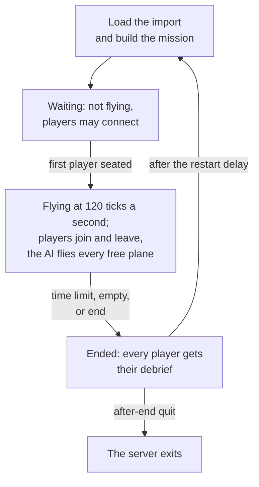

# Dedicated server

> **T.O.R.E: Tasteful Opinionated Reverse Engineered.**
> The thing being reverse engineered is the *experience*, not the executable. We
> trace what a player does and what the game does back, down to the numbers they
> would notice. How the original code achieved it is history: useful evidence,
> never a blueprint. If a sentence below reads like an instruction to reproduce
> the original's internals, it is out of date.
> <!-- tore-header v2 -->

Stage D design of 2026-09-30, reviewed by John the same day; **nothing here
is built yet.** The dedicated server is part of the [multiplayer plan](multiplayer-plan.md#stages)
and the [multiplayer guide](MULTIPLAYER.md#dedicated-servers). Fighters
Anthology had no dedicated server; everything on this page is an agent
proposal unless it is credited to John.

## Contents

- [What it is](#what-it-is)
- [Importing the game](#importing-the-game)
- [Running it](#running-it)
- [The configuration file](#the-configuration-file)
- [The mission file](#the-mission-file)
- [The mission lifecycle](#the-mission-lifecycle)
- [Joining from the game](#joining-from-the-game)
- [Console, status and logs](#console-status-and-logs)
- [Ports and firewalls](#ports-and-firewalls)
- [Running it as a service](#running-it-as-a-service)
- [Performance](#performance)
- [Security](#security)
- [Not in stage D](#not-in-stage-d)

## What it is

`tore-server` is a separate program with no window, graphics or sound. It
runs one Quick Mission at a time at a fixed 120 ticks a second, never paused.
The AI flies every aircraft no human holds, and players join with the game and
take aircraft in flight. It builds for Linux, Windows and macOS from the same
workspace as the game:

```sh
cargo build --release --locked -p tore-server
```

It does not link the game's windowing, graphics or audio libraries, so it
starts on a machine without a display or a sound system.

The server simulates the flight models, terrain and weapons from the retail
data, so it needs its operator's own copy of Fighters Anthology, imported the
same way the game imports it. Nothing derived from retail media is ever sent
over the network: every player's game reads its own import, and the server
checks that the two agree ([content check](#joining-from-the-game)).

## Importing the game

```sh
tore-server --import /path/to/FIGHTERS
```

The path is an installed Fighters Anthology folder or a disc folder (the one
holding `SETUP.ESA`), exactly as the game's first-run import accepts, from the
1.0 disc build or the 1.02F patch ([first-run import](spec/first-run-import.md)).
It writes the import into the data folder and prints where its report is. The
import is the same code the game runs, moved into the `tore-import` library.

The data folder is the game's own by default (`TORE_DATA_DIR` or `--data-dir`
changes it), so on a machine that already has the game imported the server
needs no import at all. Loading prunes older import generations in that folder,
as the game does ([import cache](spec/import-cache.md)).

## Running it

```sh
tore-server --config server.conf
```

| Option | Meaning |
| --- | --- |
| `--config FILE` | The [configuration file](#the-configuration-file); default `server.conf` in the data folder |
| `--data-dir DIR` | The data folder holding the import and the logs |
| `--import FOLDER` | Import the game, then exit |
| `--port N`, `--mission FILE` | Override those two settings of the configuration file |
| `--check` | Load the import and the mission, print the mission's aircraft with their plane numbers, its runways and its content manifest, then exit without opening the port |

At start it prints the version and commit, the data folder, a summary of the
mission, the port it listens on and "Waiting for players". It refuses to start,
with a plain message, when the import is missing or stale, the mission names
an aircraft, theater or runway the import does not have, a setting is unknown
or out of range, or the retail stall-speed switch (`--retail-stall-speeds` or
`TORE_RETAIL_STALL_SPEEDS`) is on, since every machine in a session must fly one
configuration.

## The configuration file

One setting per line, a name and a value, `#` to the end of the line is a
comment, as in the game's preference files. An unknown name is refused at
start, so a typo never passes silently.

| Setting | Default | Meaning |
| --- | --- | --- |
| `name` | `T.O.R.E server` | Shown to joining players, and in the server browser once it exists (stage I) |
| `port` | `26900` | The UDP port |
| `address` | `any` | The local address to listen on; `any` listens on every IPv4 and IPv6 address the machine has |
| `password` | none | A password players must give. It crosses the network as plain text |
| `max-players` | `30` | 1 to 30 (John's default, 2026-09-28); a co-op mission seats at most its 15 friendly planes |
| `mission` | `mission.txt` | The [mission file](#the-mission-file), relative to the configuration file |
| `open-planes` | `friendly` | Which planes humans may take: `friendly`, `all` (load tests; proper PvP is stage F) or a list of plane numbers |
| `snapshot-rate` | `30` | Snapshots a second to each player: 10, 12, 15, 20, 24, 30, 40 or 60 |
| `start` | `first-player` | `first-player`: the mission waits, not flying, until the first player is seated; `now`: it flies from the start |
| `time-limit` | `0` | Minutes after which the mission ends; 0 for none |
| `empty-timeout` | `60` | Seconds the mission keeps flying after the last player leaves, before it ends |
| `after-end` | `restart` | `restart` the same mission, or `quit` |
| `restart-delay` | `30` | Seconds between a mission's end and the next start |
| `status-interval` | `10` | Seconds between status lines; 0 for none |

## The mission file

A Quick Mission written as text: the same fields the Quick Mission creator
sets, with names instead of list positions, so a file works on any import.
It is the text form of `MissionSpec` ([architecture](ARCHITECTURE.md#a-mission-with-no-window)),
the same text the server sends every joining player.

```text
tore-mission 1
theater UKR
condition clear
start airborne 20000
separation-nm 20
preset free
guns-only no
wing friendly 1 F18.PT 4 experienced
wing friendly 2 F14.PT 2 average
wing enemy 1 MIG29.PT 4 experienced
wing enemy 2 SU27.PT 2 ace
survive friendly 2 yes
objective enemy 2 intercept friendly 1
cheats none
```

| Line | Meaning |
| --- | --- |
| `tore-mission 1` | The file's version; always first |
| `theater CODE` | One of the sixteen theater codes the creator offers: `BAL`, `CUB`, `EGY`, `LFA`, `FRA`, `GRE`, `IRA`, `KURILE`, `TVIET`, `SPA`, `APA`, `PGU`, `NSK`, `WTA`, `UKR`, `VLA` |
| `condition NAME` | `clear`, `cloudy`, `foggy`, `dawn`, `sunset` or `night` |
| `time-of-day HH:MM`, `wind KNOTS FROM`, `cloud-deck FEET` | Optional weather overrides, as the game's `TORE_WEATHER_TIME`, `TORE_WIND` and `TORE_CLOUD_ALTITUDE` set them |
| `start airborne FEET` | 5,000, 10,000, 20,000 or 40,000 ft, the creator's choices |
| `start ground RUNWAY` | A ground start from a runway object; `--check` lists the theater's runways by number and airport name |
| `separation-nm N` | 1, 2, 5, 10, 20, 50, 100, 150, 200 or 300, the creator's choices |
| `preset NAME` | The AI's standing orders: `free`, `cap`, `intercept`, `escort`, `self-defense` or `hold` |
| `guns-only yes/no` | The creator's air combat setting |
| `wing SIDE N AIRCRAFT COUNT SKILL` | Up to three wings a side. The aircraft is its exact identity, one of `F18.PT` (the F/A-18D), `RAFALE.PT` (the Rafale C), `F14.PT`, `A4E.PT`, `F31.PT` (the X-31), `MIG29.PT`, `SU27.PT`, `MIG21.PT`, `SU25.PT`, `MIG23.PT`, `SU35.PT`, `F22.PT`, `F22N.PT` (the F-22N) or `faxx` (the F/A-XX); skills are `novice`, `average`, `experienced`, `ace` or `dummy`. Friendly wing 1 holds 1 to 5 aircraft, the others 0 to 5 |
| `objective SIDE N NAME [SIDE N]` | A wing's objective: `inherit`, `free`, `cap`, `intercept` or `escort` another wing, `self-defense`, `hold` |
| `survive SIDE N yes/no` | The wing must survive |
| `cheats LIST` | `none`, or a list of the game's cheat names; they apply to every player |

Planes are numbered as in the game: plane 0 is the lead of friendly wing 1,
then every other aircraft in wing order. `--check` prints the list. Every
plane carries its aircraft's standard load, and a player keeps the load of
the plane they take; choosing a loadout before flight is stage F. Every AI
aircraft flies the hybrid flight model in a networked mission (John,
2026-09-28). Until the stage F lobby lets the creator save one, mission files
are written by hand.

## The mission lifecycle



- **Waiting.** With `start first-player` the mission is built but does not
  fly until someone is seated, so the first player starts it the way a single
  player starts a Quick Mission.
- **Flying.** Players join and take free planes in flight and leave at any
  time. A player who leaves, or whose game goes silent for 5 seconds, gives
  the plane back to the AI at once; it is not held for a rejoin until stage K.
  A destroyed plane stays destroyed; respawns are stage F.
- **Ending.** The mission ends at the time limit, once the last player has been
  gone for the empty timeout, or on the console's `end`. Every seated player
  gets "Mission ended" and their own debrief, and is then disconnected; players
  join again for the next mission. A player who ends the mission on
  their side gets their debrief at once and the mission flies on for the others.
- **Next.** After the restart delay the same mission starts again from its
  file, fresh, or the server exits.

## Joining from the game

Until the stage F lobby, the game joins a server from the command line:

```sh
tore-app --connect 192.168.1.20 --callsign Viper
```

| Option | Meaning |
| --- | --- |
| `--connect HOST[:PORT]` | The server's address or name; the port defaults to 26900 |
| `--callsign NAME` | 1 to 15 printable characters; a callsign already in use gets a suffix (`Viper_2`), shortened first to stay within 15 |
| `--slot N` | The plane to take; without it, the first free friendly plane, friendly wing 1's lead first |
| `--password TEXT` | The server's password, if it has one |

The game loads the mission from its own import and compares its content
manifest with the server's: the names and hashes of every resource the
simulation reads for that mission (aircraft, weapons, theater, radio phrases).
A 1.0 disc import and a 1.02F import play together, since they differ only in
menu and HUD resources. A difference is refused with the names of the files
that differ. The game version and protocol must match as well
([wire protocol](formats/net-protocol.md#versions)).

## Console, status and logs

The server reads commands from its standard input:

| Command | Does |
| --- | --- |
| `status` | One status line now |
| `players` | Every connected player: seat, callsign, plane, round trip, loss, input margin, inputs repeated |
| `kick SEAT` | Gives the plane back to the AI and disconnects the player |
| `end` | Ends the mission now, with debriefs |
| `restart` | Ends the mission and starts it again at once |
| `quit` | Tells every player the server is stopping, then exits |

Ctrl+C stops the process at once instead; the players' games report the lost
connection after 5 seconds.

A status line every `status-interval` seconds:

```text
00:12:30 tick 90000 players 2/15 aircraft 30 load 11% (1.1 ms a tick) up 64 KB/s down 7 KB/s
```

The log (`logs/server-<date>.log` in the data folder) records the start,
every connection, refusal, seat change and departure with its reason, the
mission's end, and once a minute each player's figures: the same round trip,
loss, snapshot arrival spread, input margin, inputs repeated and bytes each
way that a player's game writes to its own
[diagnostics log](ARCHITECTURE.md#recordings-and-diagnostics).

## Ports and firewalls

The server uses one UDP port, 26900 unless set. On a LAN nothing else is
needed. For players on the internet, forward that UDP port on the router to the
server; automatic port mapping, NAT traversal and the relay are stage J.
Windows and macOS ask once whether the unsigned program may accept connections.

## Running it as a service

On Linux, a systemd unit:

```ini
[Unit]
Description=T.O.R.E-Fighters dedicated server
After=network-online.target

[Service]
ExecStart=/opt/tore/tore-server --config /var/lib/tore/server.conf --data-dir /var/lib/tore
User=tore
Restart=on-failure

[Install]
WantedBy=multi-user.target
```

On Windows and macOS it runs in a terminal; a service wrapper is not planned
for stage D.

## Performance

Measured on 2026-09-30 on the development machine (Ryzen 9 7900X, release
build): a 30-aircraft Quick Mission with one human-flown plane steps in 1.1 to
1.2 ms a tick, about 14 percent of one core at 120 ticks a second. What each
human adds, and the upload each player costs, are measured in stage D against
the [bandwidth budget](multiplayer-plan.md#bandwidth-budget); the plan
estimates about 22 KB/s of upload per player at 30 aircraft before relevance
filtering, to which stage D adds each player's cockpit readout.

## Security

Traffic is not encrypted in v1: the password keeps strangers out, but anyone
who can watch the network can read it. The server trusts no packet it cannot
decode and limits connection attempts
([wire protocol](formats/net-protocol.md#security)). Run it under its own user.
It reads its configuration, its mission file and its data folder, and writes
only its logs.

## Not in stage D

One mission at a time, Quick Missions only. The lobby, the King, chat,
respawns, PvP scoring, observers, loadout choice before flight, the server
browser and NAT traversal are stages F, I and J; holding a dropped player's
plane for a rejoin is stage K.
