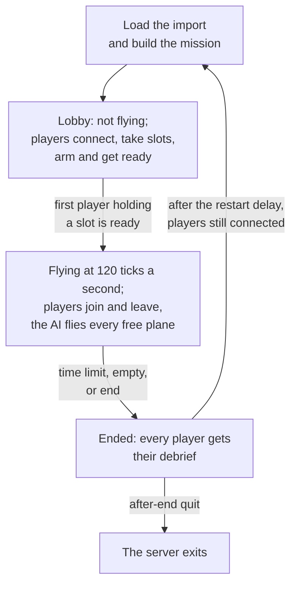

# Dedicated server

> **T.O.R.E: Tasteful Opinionated Reverse Engineered.**
> The thing being reverse engineered is the *experience*, not the executable. We
> trace what a player does and what the game does back, down to the numbers they
> would notice. How the original code achieved it is history: useful evidence,
> never a blueprint. If a sentence below reads like an instruction to reproduce
> the original's internals, it is out of date.
> <!-- tore-header v2 -->

Stage D design of 2026-09-30, reviewed by John the same day. **Built (D7b, on
the host session of D7a):** the program: the options, the configuration file,
the import, `--check`, the start-up refusals, the real-time run loop, the
console, the status line and the log; on 127.0.0.1 a scripted client joins over
a real UDP socket, flies and leaves, and `quit` stops the server. **Built
(D8b):** the game joins one with `--connect` ([joining from the
game](#joining-from-the-game)). **Built (EF3):** a player's game hosts the
same host session itself with `--host` ([hosting from the
game](#hosting-from-the-game)). The dedicated server is part of the [multiplayer plan](multiplayer-plan.md#stages)
and the [multiplayer guide](MULTIPLAYER.md#dedicated-servers). Fighters
Anthology had no dedicated server; everything on this page is an agent
proposal unless it is credited to John.

## Contents

- [What it is](#what-it-is)
- [Importing the game](#importing-the-game)
- [Running it](#running-it)
- [The configuration file](#the-configuration-file)
- [The mission file](#the-mission-file)
- [The mission lifecycle](#the-mission-lifecycle)
- [The lobby](#the-lobby)
- [Joining from the game](#joining-from-the-game)
- [Hosting from the game](#hosting-from-the-game)
- [Console, status and logs](#console-status-and-logs)
- [Ports and firewalls](#ports-and-firewalls)
- [Discovery and the firewall](#discovery-and-the-firewall)
- [Running it as a service](#running-it-as-a-service)
- [Performance](#performance)
- [Security](#security)
- [Not in stage D](#not-in-stage-d)

## What it is

`tore-server` is a separate program with no window, graphics or sound. It
runs one Quick Mission at a time at a fixed 120 ticks a second, never paused.
The AI flies every aircraft no human holds, and players join with the game and
take aircraft in flight. It builds for Linux, Windows and macOS from the same
workspace as the game:

```sh
cargo build --release --locked -p tore-server
```

It does not link the game's windowing, graphics or audio libraries, so it
starts on a machine without a display or a sound system.

The server simulates the flight models, terrain and weapons from the retail
data, so it needs its operator's own copy of Fighters Anthology, imported the
same way the game imports it. Nothing derived from retail media is ever sent
over the network: every player's game reads its own import, and the server
checks that the two agree ([content check](#joining-from-the-game)).

## Importing the game

```sh
tore-server --import /path/to/FIGHTERS
```

The path is an installed Fighters Anthology folder or a disc folder (the one
holding `SETUP.ESA`), exactly as the game's first-run import accepts, from the
1.0 disc build or the 1.02F patch ([first-run import](spec/first-run-import.md)).
It writes the import into the data folder and prints where its report is. The
import is the same code the game runs, moved into the `tore-import` library.

The data folder is the game's own by default (`TORE_DATA_DIR` or `--data-dir`
changes it), so on a machine that already has the game imported the server
needs no import at all. Loading prunes older import generations in that folder,
as the game does ([import cache](spec/import-cache.md)).

## Running it

```sh
tore-server --config server.conf
```

| Option | Meaning |
| --- | --- |
| `--config FILE` | The [configuration file](#the-configuration-file); default `server.conf` in the data folder |
| `--data-dir DIR` | The data folder holding the import and the logs |
| `--import FOLDER` | Import the game, then exit |
| `--port N`, `--mission FILE` | Override those two settings of the configuration file |
| `--check` | Load the import and the mission, print the mission's aircraft with their plane numbers, its runways and its content manifest, then exit without opening the port |
| `--help`, `--version` | Print the options, or the version and commit, and exit |

*Built (D7b).* *Agent decisions:* with no `server.conf` in the data folder the
defaults apply (a configuration file named with `--config` must exist); a
`--mission` path is taken against the current folder, like any command-line
path, where the configuration file's own `mission` is taken against the
configuration file; `--check` also reads the configuration file, since the
mission path and `open-planes` come from it, and it builds the mission once,
which is what catches a mission the import cannot fly. `--import` prints its
progress as the game's first-run screen shows it and ends with the path of
`import-report.txt`. `--check` prints each plane as its number, aircraft,
wing, place in the wing and skill, each runway as its number, airport name and
length (a short strip is marked: nobody starts there), and the manifest's
resource count and 64-bit digest. A mission that cannot be built is refused
with the builder's own words, for example "Selected runway is unavailable".

At start it prints the version and commit, the data folder, a summary of the
mission, the port it listens on and "Waiting for players". It refuses to start,
with a plain message, when the import is missing or stale, the mission names
an aircraft, theater or runway the import does not have, a setting is unknown
or out of range, or the retail stall-speed switch (`--retail-stall-speeds` or
`TORE_RETAIL_STALL_SPEEDS`) is on, since every machine in a session must fly one
configuration.

## The configuration file

One setting per line, a name and a value, `#` to the end of the line is a
comment, as in the game's preference files. An unknown name is refused at
start, so a typo never passes silently.

| Setting | Default | Meaning |
| --- | --- | --- |
| `name` | `T.O.R.E server` | Shown to joining players, and in the server browser once it exists (stage I) |
| `port` | `26900` | The UDP port |
| `address` | `any` | The local address to listen on; `any` listens on every IPv4 and IPv6 address the machine has |
| `password` | none | A password players must give. It crosses the network as plain text |
| `max-players` | `30` | 1 to 30 (John's default, 2026-09-28); a co-op mission seats at most its 15 friendly planes |
| `mission` | `mission.txt` | The [mission file](#the-mission-file), relative to the configuration file |
| `open-planes` | `friendly` | Which planes humans may take: `friendly`, `all` (load tests; proper PvP is stage F) or a list of plane numbers |
| `snapshot-rate` | `30` | Snapshots a second to each player: 10, 12, 15, 20, 24, 30, 40 or 60 |
| `start` | `first-player` | `first-player`: the lobby waits, the mission not flying, until the first player holding a slot is ready; `now`: it flies from the start ([the lobby](#the-lobby)) |
| `time-limit` | `0` | Minutes after which the mission ends; 0 for none |
| `empty-timeout` | `60` | Seconds the mission keeps flying after the last player leaves, before it ends |
| `after-end` | `restart` | `restart` the same mission, or `quit` |
| `restart-delay` | `30` | Seconds between a mission's end and the next start |
| `status-interval` | `10` | Seconds between status lines; 0 for none |

*Built (D7b).* A name that appears twice is refused too, and a setting with no
value. A comment runs from the first `#`, so a password cannot contain one.
*Agent decisions for the ranges the table leaves open:* `name` is 1 to 60
printable characters, `password` at most 255 bytes (the wire's string limit),
`address` is `any` or an IP address (not a host name), `open-planes` lists plane
numbers 0 to 29 separated by spaces or commas (and each must exist in the
mission, which start-up checks), `time-limit` is at most 10,080 minutes (a
week), `empty-timeout` at most 86,400 seconds, and `restart-delay` and
`status-interval` at most 3,600 seconds.

## The mission file

A Quick Mission written as text: the same fields the Quick Mission creator
sets, with names instead of list positions, so a file works on any import.
It is the text form of `MissionSpec` ([architecture](ARCHITECTURE.md#a-mission-with-no-window)),
the same text the server sends every joining player. The reader is
`MissionSpec::from_text` in `tore-world`, and a test parses the example below
straight out of this guide, so the two stay in step.

```text
tore-mission 1
theater UKR
condition clear
start airborne 20000
separation-nm 20
preset free
guns-only no
wing friendly 1 F18.PT 4 experienced
wing friendly 2 F14.PT 2 average
wing enemy 1 MIG29.PT 4 experienced
wing enemy 2 SU27.PT 2 ace
survive friendly 2 yes
objective enemy 2 intercept friendly 1
cheats none
```

One `key value` line each; everything after a `#` is a comment and blank
lines do not count. An error names its line, for example `line 4: `MOON` is not
a theater`. An unknown key, theater, aircraft, skill, name or out-of-range
value is refused, so a typo never passes silently; so is a line that appears
twice.

| Line | Meaning |
| --- | --- |
| `tore-mission 1` | The file's version; always first |
| `theater CODE` | Required. One of the sixteen theater codes the creator offers: `BAL`, `CUB`, `EGY`, `LFA`, `FRA`, `GRE`, `IRA`, `KURILE`, `TVIET`, `SPA`, `APA`, `PGU`, `NSK`, `WTA`, `UKR`, `VLA` |
| `condition NAME` | `clear` (the default), `cloudy`, `foggy`, `dawn`, `sunset` or `night`: the weather, the clock and the cloud deck the creator's choice sets |
| `time-of-day HH:MM`, `wind HEADING FEET-PER-SECOND`, `cloud-deck FEET` | Optional weather overrides of the condition's own, as the game's `TORE_WEATHER_TIME`, `TORE_WIND` and `TORE_CLOUD_ALTITUDE` set them: the wind is written as they write it, a heading of -360 to 360 degrees and a speed of 0 to 200 feet a second, and the cloud deck is 0 to 400,000 feet |
| `start airborne FEET` | 5,000 (the default), 10,000, 20,000 or 40,000 ft, the creator's choices |
| `start ground RUNWAY [FEET]` | A ground start from a runway object, by its number in the theater's layout (the object's id is 1,073,741,824 plus it; `--check` lists the theater's runways by number and airport name). The optional altitude is the creator's altitude setting, which a ground start keeps for its airborne aircraft to clear the ground (5,000 by default). A ground start needs the hybrid flight model for humans |
| `separation-nm N` | 1, 2, 5 (the default), 10, 20, 50, 100, 150, 200 or 300, the creator's choices |
| `preset NAME` | The AI's standing orders: `free` (the default), `cap`, `intercept`, `escort`, `self-defense` or `hold` |
| `guns-only yes/no` | The creator's air combat setting; `no` by default. With the standard load it leaves the guns loaded and unloads the missiles |
| `wing SIDE N AIRCRAFT COUNT SKILL` | Up to three wings a side; `wing friendly 1` is required. The aircraft is its exact identity, one of `F18.PT` (the F/A-18D), `RAFALE.PT` (the Rafale C), `F14.PT`, `A4E.PT`, `F31.PT` (the X-31), `MIG29.PT`, `SU27.PT`, `MIG21.PT`, `SU25.PT`, `MIG23.PT`, `SU35.PT`, `F22.PT`, `F22N.PT` (the F-22N) or `faxx` (the F/A-XX); skills are `novice`, `average`, `experienced`, `ace` or `dummy`. Friendly wing 1 holds 1 to 5 aircraft, the others 0 to 5. A wing with no line has no aircraft |
| `objective SIDE N NAME [SIDE N]` | A wing's objective: `inherit` (the default, the preset), `free`, `cap`, `intercept` or `escort` another wing (an enemy wing for `intercept`, another wing of its own side for `escort`), `self-defense`, `hold` |
| `survive SIDE N yes/no` | The wing must survive; `no` by default |
| `cheats LIST` | `none` (the default), or a list of the game's cheats: `unlimited-ammo`, `unlimited-fuel`, `no-spins`, `no-turbulence`, `extra-g`, `ignore-weapon-weights`, `no-sun-whiteout`, `no-g-effects`, `no-screen-shake`, `no-crashes`, `easy-aiming`, `ignore-midair-collisions`, `easy-targeting`, `guns-only`, `damage=invulnerable`, `damage=realistic` and `enemy-ai=LEVEL` (`novice`, `average`, `experienced` or `ace`); they apply to every player |
| `flight-model human hybrid/legacy`, `flight-model ai standard/hybrid` | The flight models: the hybrid model for humans (the default, and the only one a networked mission uses) and `hybrid` for every AI aircraft (the default here). `legacy` and `standard` are the single-player game's own settings |
| `enemy-skill novice/average/none` | The game's `--enemy-skill`: every enemy wing at one level. `none` by default |
| `fixture-wings yes/no` | The game's `--fixture-wings` development setting: straight-flight fixtures instead of AI wings. A server does not use it |
| `loadout fuel POUNDS`, `loadout cheat yes/no`, `loadout station N WEAPON COUNT QUANTITY` | The loadout of plane 0 for a single-player start, as the creator's Load Ordnance page leaves it: the fuel, the loadout screen's Cheat, and one line for every station, in the aircraft's station order, naming its weapon's resource, its capacity and what it carries. **Used only by single player**: an open (networked) mission refuses it, since nobody flies from the start |
| `plane-loadout PLANE fuel POUNDS`, `plane-loadout PLANE cheat no`, `plane-loadout PLANE station N WEAPON COUNT QUANTITY` | The loadout a player chose in the lobby for one plane of a networked mission, the same lines as `loadout` with the plane number first. *Built (EF4).* The host writes them into the mission it sends when a flight starts, so every player builds the same aircraft; a server's own file normally leaves them out, and a plane with none carries its aircraft's standard load. Each is checked as the [lobby's loadout rule](#the-lobby) says, and single player refuses them |

Planes are numbered as in the game: plane 0 is the lead of friendly wing 1,
then every other aircraft in wing order. `--check` prints the list. Every
plane carries its aircraft's standard load unless a player chose another for
it in the lobby, and a player who takes a plane in flight keeps the load of
the plane they take. Every AI
aircraft flies the hybrid flight model in a networked mission (John,
2026-09-28). Until the stage F lobby lets the creator save one, mission files
are written by hand.

Writing a spec back out (`MissionSpec::to_text`) gives the same lines in this
order, leaving out the ones at their default, and reading that text gives the
same spec. *Agent decisions:* the wind line writes the game's units rather than
knots so nothing is rounded; the optional altitude on a ground start, the flight
model, enemy skill, fixture wings and loadout lines are the parser's additions
for the game's own use of the same text.

## The mission lifecycle



- **Lobby.** With `start first-player` the mission is built but does not
  fly until the first player holding a slot is ready, so the first player
  starts it the way a single player starts a Quick Mission
  ([the lobby](#the-lobby)). No snapshots are sent while it waits.
- **Flying.** Players join and take free planes in flight and leave at any
  time. A player who leaves, or whose game goes silent for 5 seconds, gives
  the plane back to the AI at once; it is not held for a rejoin until stage K.
  A destroyed plane stays destroyed; respawns are stage F.
- **Ending.** The mission ends at the time limit, once the last player has been
  out of the flight for the empty timeout, or on the console's `end`. Every
  player gets "Mission ended" first and every seated player then its own
  debrief. *Since EF4* the players stay connected, back in the lobby with their
  slots and loadouts and their ready marks cleared, for the next mission; a
  join while the mission is ended is refused as shutting down, with the
  seconds to the next one. A player who ends the mission on their side gets
  their debrief at once, is back in the lobby, and the mission flies on for
  the others.
- **Next.** After the restart delay the same mission starts again from its
  file, fresh, back in the lobby (or flying, with `start now`), or the server
  exits. With `after-end quit` every player is disconnected with the text
  "server stopping" once its messages are acknowledged, and the host stops
  once they are gone, or 5 seconds after the end.

*Built (D7a, D7b), the host's settled rules:* the number of players a mission
seats is the lesser of `max-players` and the planes open to humans (the status
line's `players 2/15`); the empty timeout counts from the moment the last
seated player leaves (sends Leave or is dropped), not from the mission's start;
`end` and `restart` tell the players "ended by the server"; `quit` disconnects
everyone at once with "server stopping" and sends no debriefs. If a tick or the
rebuild for the next mission fails, the host logs the fault, and ends the
mission (or stops, when the rebuild itself failed).

## The lobby

*Built (EF4).* Before each mission flies, and again after it, the server is in
its lobby: players are connected but not flying, take slots, choose their
loadouts and mark ready, and every player is sent the lobby's state whenever
it changes. The design is the architecture's
[lobby](ARCHITECTURE.md#the-lobby); a game a player hosts has a King, a
dedicated server has none. *The dedicated server's rules, agent decisions:*

- **The mission** is the mission file's, always: nobody can change it. A
  player whose import cannot play it is told why and stays connected in the
  lobby, marked unable, and cannot take a slot.
- **Slots** are the planes `open-planes` opens (every friendly plane by
  default), one player a slot, held from the lobby across missions until the
  player leaves it or the game. A player holding a slot may send a loadout
  for it, which the host checks by the single-player Load Ordnance page's
  rule (each store within its station's capacity, only weapons that fly,
  fuel within the tanks, weight within the maximum take-off weight, nothing
  but the gun with the mission's Guns only; cheat loading is refused) and
  refuses with that rule's words; a plane with none flies its standard load.
- **`start first-player`**: the mission starts flying when the first player
  holding a slot marks ready, with every ready slot holder in its plane at
  the first tick. Players who get ready later, or join later, take their
  slot's plane (or any free one) in flight, as in stage D. Players who hold
  no slot stay in the lobby while it flies.
- **`start now`**: the mission flies from the start, and after each restart;
  players who join, or get ready, take their slot's plane in flight.
- **After a mission**: `after-end restart` keeps every player connected,
  back in the lobby with its slot and loadout and its ready mark cleared,
  and after the restart delay the fresh mission waits in the lobby (or flies,
  with `start now`); `after-end quit` disconnects everyone and exits.
- **Nobody is King**: the King's requests (change the mission, start, end the
  mission, kick) are refused with "Only the King may do that."; the console
  still ends and restarts, kicks a seated player by seat, and kicks any
  player by lobby id (`kick-player`).
- **Loadouts** are chosen in the lobby; one sent while the mission flies is
  refused. A player whose own copy of a loadout's other weapon differs from
  the server's is told at the flight's start and kept in the lobby for that
  flight, and may fly the next. A game with no lobby screen
  (`tore-app --connect`, `tore-bot`) takes its slot and marks ready by
  itself, so a server with `start first-player` starts as soon as the first
  such player joins, as before.

## Joining from the game

Until the stage F lobby, the game joins a server from the command line:

```sh
tore-app --connect 192.168.1.20 --callsign Viper
```

| Option | Meaning |
| --- | --- |
| `--connect HOST[:PORT]` | The server's address or name; the port defaults to 26900 |
| `--callsign NAME` | 1 to 15 printable ASCII characters, none given means `Pilot`; a callsign already in use gets a suffix (`Viper_2`), shortened first to stay within 15 |
| `--slot N` | The plane to take; without it, the first free friendly plane, friendly wing 1's lead first |
| `--password TEXT` | The server's password, if it has one |

`HOST` is a name or an address; an IPv6 address needs brackets to carry a
port (`[fe80::1]:26900`). *Since EF5,* a name that gives several addresses
(for example an IPv4 and an IPv6 one) is tried address by address, IPv4 first,
three seconds each, and the first that answers the handshake is joined (one
address is joined as it is); `tore-bot --connect` does the same. The game
remembers the address, the callsign (when `--callsign` gave one), the port and
the game name in `network-v1.conf` in its data folder, beside the other
preference files; the password is never kept. The options are checked at start, before anything is
sent, and a game started with `--retail-stall-speeds` refuses to join (every
machine in a session flies the same aircraft model). `--callsign`, `--slot`
and `--password` go with `--connect` and nothing else. While it flies, the game
keeps a [diagnostics log and a capture](ARCHITECTURE.md#recordings-and-diagnostics)
and records no replay.

Once the options pass, the game opens its window as usual and joins in the
background: the main menu shows "Joining ..." while it connects, loads the
mission and is seated, and then the flight screen takes over. In the flight
there is no pause and no time compression, the Restart key and the Cheat
rows that change the mission are refused or hidden (the server sets the
cheats), and the Esc menu draws over the running flight: while it is up, or the
window has lost focus, the aircraft flies on with the stick centred, the
throttle held and the trigger released. A plane that is refused (taken,
destroyed, not open) is asked for again as any free plane. End Mission leaves
the game: the host sends the debrief, which the game shows before the main
menu. *Since EF4* the game joins the [lobby](#the-lobby): it takes `--slot`'s
slot (or the first free one) with the standard loadout and marks ready by
itself; when a mission ends it shows the debrief, stays connected, readies
again and flies the next mission when it starts; the lobby's changes go to
the game's log. A drop,
a refusal, a data mismatch or a server stopping is a plain message on the
main menu. A client draws gun rounds: its own at once from its trigger, and
other aircraft's from the host's burst events. They are for the eye only; the
host decides every hit.

The game loads the mission from its own import and compares its content
manifest with the server's: the names and hashes of every resource the
simulation reads for that mission (aircraft, weapons, theater, radio phrases).
A 1.0 disc import and a 1.02F import play together, since they differ only in
menu and HUD resources. A difference is refused with the names of the files
that differ. The game version and protocol must match as well
([wire protocol](formats/net-protocol.md#versions)). *Decided with the lead, 2026-09-30:* a build is a tagged release when the build stamped `TORE_BUILD_VERSION` at compile time (`option_env!("TORE_BUILD_VERSION").is_some()`, as the game's `version::version()` already tests); release builds match by version and other builds by commit. The server's rule is `app::is_release` in `crates/tore-server/src/app.rs`, and the game's `--connect` must use the same test.

## Hosting from the game

Until the lobby (stage F, slices EF7 and EF8), a player hosts a game from the
command line, and the others join it with `--connect`:

```sh
tore-app --host duel.txt --callsign Viper
```

| Option | Meaning |
| --- | --- |
| `--host MISSION_FILE` | Host this [mission file](#the-mission-file), the dedicated server's format |
| `--port N` | The UDP port to listen on, on every IPv4 and IPv6 address; default 26900 |
| `--name TEXT` | The game's name, shown to joining players; 1 to 60 printable characters, default `CALLSIGN's game` |
| `--open-planes friendly\|all\|N,N` | Which planes players may take, as the `open-planes` setting; default `friendly` |
| `--password TEXT` | The password joining players must give; the hosting player's own game gives it too |
| `--callsign NAME`, `--slot N` | The hosting player's own, as for `--connect` |

The game runs the same host session as `tore-server`, on a thread of its own
with its own 120 ticks a second, and joins it as an ordinary client over an
in-process link: the hosting player flies through exactly the screens a
joining player sees, with no delay, and a stalled or minimized window stalls
nobody else ([design](ARCHITECTURE.md#the-host-inside-the-game-stage-e)). The
others join with `tore-app --connect` to the hosting machine's address, through
the same port and firewall as a server ([ports and
firewalls](#ports-and-firewalls)).

*Built (EF3, EF4). Agent decisions:* the server's defaults (`max-players
30`, `snapshot-rate 30`, no time limit), except that the hosting player is the
King of the [lobby](ARCHITECTURE.md#the-lobby): the game takes its slot
(`--slot`, or the first free one) and readies by itself, and starts each
mission as soon as every player holding a slot is ready and the hosting player
is not reading a debrief (until the lobby screen's Fly button, EF8). End
Mission ends the mission for everyone: each player gets "Mission ended" and
their debrief and is back in the lobby, still connected, and the next mission
starts as before. A mission nobody flies any more ends at once (no empty
timeout). The hosting player's own connection is never dropped for silence, so
dragging or resizing the window, or a long load, stalls only that game while
the others fly on. When the hosting player leaves the game (the window closes, Exit),
the game ends for everyone: each remote player gets "Mission ended" (the host
left the game) and their debrief if they were flying, and "The host left the
game", and the port is free again at once. A mission file that cannot be read, a line it does not take or an option
out of range refuses the start with the file and line, as the server refuses
them; a mission the import cannot build, an `--open-planes` plane the mission
lacks or a port in use is a plain message on the main menu. If the host fails
while flying, the hosting player is told "The game you were hosting stopped:
..." and the remote players "the server is stopping", or, if even that cannot
be sent, the usual "no packets for 5 seconds". The host's log lines go to the
game's log with `Host:` in front, and the hosted session keeps the same
diagnostics log and capture as a joined one, the capture named `hosted`.

## Console, status and logs

The server reads commands from its standard input:

| Command | Does |
| --- | --- |
| `status` | One status line now |
| `players` | Every connected player: lobby id, seat, callsign, plane, round trip, loss, input margin, inputs repeated |
| `kick SEAT` | Gives the plane back to the AI and disconnects the player (a seated player; one in the lobby has no seat) |
| `kick-player ID [REASON]` | Removes the player with that lobby id (the `players` table's first column), in the lobby or flying, telling it the reason; its plane, if it flies one, goes back to the AI with no debrief (EF4) |
| `end` | Ends the mission now, with debriefs |
| `restart` | Ends the mission and starts it again at once |
| `quit` | Tells every player the server is stopping, then exits |

Ctrl+C stops the process at once instead; the players' games report the lost
connection after 5 seconds. *Built (D7b), agent decisions:* `help` lists the
commands; a console whose input ends (a service with no terminal) is left
alone, so only `quit` or a signal stops the server; `kick` names a seat as
`players` shows it, and a seat with no player is answered, not an error; the
console thread only reads lines, and the run loop acts on them within 4 ms.

A status line every `status-interval` seconds:

```text
00:12:30 tick 90000 players 2/15 aircraft 30 load 11% (1.1 ms a tick) up 64 KB/s down 7 KB/s
```

The log (`logs/server-<date>.log` in the data folder) records the start,
every connection, refusal, seat change and departure with its reason, the
mission's end, and once a minute each player's figures: the same round trip,
loss, snapshot arrival spread, input margin, inputs repeated and bytes each
way that a player's game writes to its own
[diagnostics log](ARCHITECTURE.md#recordings-and-diagnostics).

*Built (D7b).* Every log line starts with a UTC date and time, and a new file
starts at UTC midnight (the standard library has no time zones; agent
decision). The start lines, joins, refusals, seat changes, departures, the
mission's end and console actions also appear on the console. Status lines go
to the console only, and each player's once-a-minute figures line to the log
file only. The figures line also carries the bytes
sent to and received from that player since it joined. A log file that cannot
be written is reported once on the console and the server carries on without
it. The clock the run loop waits on sleeps until 0.4 ms (2 ms on Windows, whose
sleep is coarse) before each deadline and then spins; the host catches up any
tick a late wake-up missed (agent decision; the margins are not measured on
Windows).

## Ports and firewalls

The server uses one UDP port, 26900 unless set. On a LAN nothing else is
needed. For players on the internet, forward that UDP port on the router to the
server; automatic port mapping, NAT traversal and the relay are stage J.
Windows and macOS ask once whether the unsigned program may accept connections.

## Discovery and the firewall

*Built (EF5).* The server, and a game that hosts, answer a discovery query on
the game port ([wire protocol](formats/net-protocol.md#discovery)): a game on
the local network lists them without being told an address. Nothing needs to
be set up. The answer carries the game's name, mission, players, King, whether
it has a password or is full, and whether it is in the lobby or flying, in a
packet never longer than the question.

The question is a broadcast to 255.255.255.255 on the game port, so it reaches
a host only where the network passes broadcast and the host's firewall lets
UDP on the game port in. On the host's machine:

- **Linux.** A firewall that denies incoming traffic by default drops the
  broadcast and the joins alike: allow the game port, for example `sudo ufw
  allow 26900/udp`. On the development machine (ufw active)
  a broadcast to its own network interface never reached its own sockets, while
  one to the loopback network did; ufw's default deny is the likely cause (not
  confirmed: checking needs root). The server's socket takes IPv4 broadcast
  on its IPv6 socket (checked on Linux).
- **Windows.** The first run asks whether the program may accept connections;
  allow it on the private network. The public-network profile blocks incoming
  broadcast. The server binds a separate IPv4 socket there, as it does for
  joins, which is what receives the broadcast (not yet measured on Windows).
- **macOS.** The same first-run question; allow incoming connections.

A machine on several networks (a laptop with Wi-Fi and a VPN) sends its
question out of the default interface only; a host on another network is
joined by its address. Wi-Fi networks that isolate clients, and guest networks,
pass neither broadcast nor joins. Discovery is best effort: joining by address
always works.

## Running it as a service

On Linux, a systemd unit:

```ini
[Unit]
Description=T.O.R.E-Fighters dedicated server
After=network-online.target

[Service]
ExecStart=/opt/tore/tore-server --config /var/lib/tore/server.conf --data-dir /var/lib/tore
User=tore
Restart=on-failure

[Install]
WantedBy=multi-user.target
```

On Windows and macOS it runs in a terminal; a service wrapper is not planned
for stage D.

## Performance

Measured on the development machine (Ryzen 9 7900X, release build) with real
data and the headless bot, on a 15 against 15 Quick Mission
([the baseline](baselines/net-2026-09-30.md) has the method and every figure):

| Humans | Host cost a tick, minutes 2 to 5 (the AI's opening fight costs 3.5 ms in the first minute) | Share of one core | Upload to each player | Upload in total |
| --- | --- | --- | --- | --- |
| 0 | 1.3 ms | 15% (21% over 5 minutes) | | |
| 2 | 1.5 ms | 18% | 10.5 KB/s | 21 KB/s |
| 8 | 2.3 ms | 27% | 12.3 KB/s | 98 KB/s (0.79 Mbit/s) |
| 15 | 2.8 ms | 33% | 12.8 KB/s | 192 KB/s (1.54 Mbit/s) |
| 30 | 6.8 ms | 81% | 14.0 KB/s | 419 KB/s (3.35 Mbit/s) |

Each human adds about 0.1 to 0.2 ms a tick, and about 2.6 KB/s comes back from
each player. A tick is 8.3 ms, so one core carries 15 humans comfortably and 30
at about four fifths of it. Each player's snapshots are built on their own
tick of the four in each interval (seat number modulo 4), so with 30 players a
tick builds at most 8 snapshots instead of 30: the 99th percentile of a tick
fell from 13.9 to 10 ms and the longest from 21.8 to 18.5 ms. The few ticks
over 8.3 ms are the AI's opening fight with a snapshot or two on top; the host
runs them late and catches up, never skipping time. A server
on a machine that is also busy with other work reports "overloaded" while it
catches up; give a 30-player server a core of its own. The bytes are the
transport's payload, without the 28 bytes of IP and UDP headers on each packet.
The plan's [bandwidth budget](multiplayer-plan.md#bandwidth-budget) compares
them with its estimates: every row is within it, though a player's busiest second
(38 KB/s) goes over the 22 KB/s estimate.

## Security

Traffic is not encrypted in v1: the password keeps strangers out, but anyone
who can watch the network can read it. The server trusts no packet it cannot
decode and limits connection attempts
([wire protocol](formats/net-protocol.md#security)). Run it under its own user.
It reads its configuration, its mission file and its data folder, and writes
only its logs.

## Not in stage D

One mission at a time, Quick Missions only. The lobby, slots and loadout
choice before flight are built (EF4); the King's settings, chat, respawns,
PvP scoring, observers, the server browser and NAT traversal are stages F, I
and J; holding a dropped player's plane for a rejoin is stage K.
