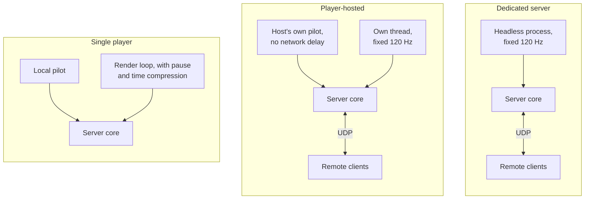
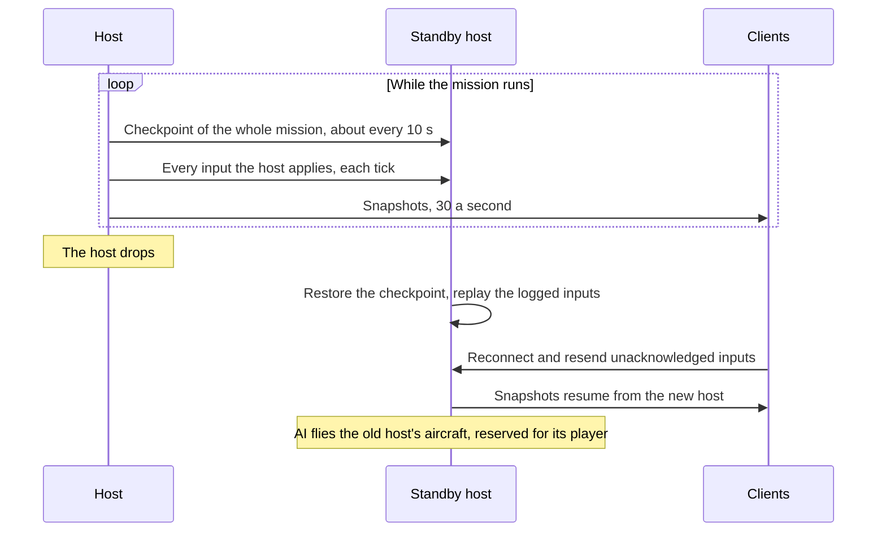
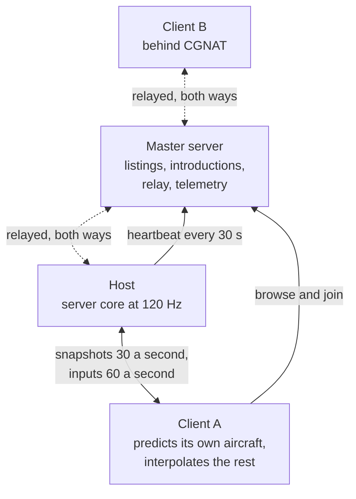
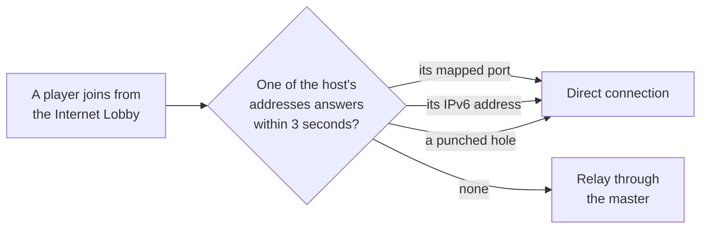

# Multiplayer

> **T.O.R.E: Tasteful Opinionated Reverse Engineered.**
> The thing being reverse engineered is the *experience*, not the executable. We
> trace what a player does and what the game does back, down to the numbers they
> would notice. How the original code achieved it is history: useful evidence,
> never a blueprint. If a sentence below reads like an instruction to reproduce
> the original's internals, it is out of date.
> <!-- tore-header v2 -->

Planning, 2026-09-28. Nothing on this page is implemented yet.

This is the design guide for Milestone 2 multiplayer. It is built from the
feature spec John wrote on 2026-09-28 and his planning answers the same day.
Every behaviour here is **opinionated**, requested by John on 2026-09-28, unless
it carries one of these marks:

- *Retail gap-fill (agent)*: where the feature spec is silent, retail
  multiplayer's rule applies. That is John's rule (2026-09-28). He named the
  revival and scoring settings, chat keys and receivers, airborne start, and the
  lock-box X and IFF squawk. Other items with this mark are an agent applying
  his rule, awaiting his review.
- *Agent proposal*: a suggestion awaiting John's review, never attributed to him.

- What Fighters Anthology's own multiplayer did: [retail multiplayer](spec/multiplayer.md).
- Where this design departs from retail: [relation to Fighters Anthology](#relation-to-fighters-anthology).
- Delivery stages, code findings and risks: [multiplayer plan](multiplayer-plan.md).

## Contents

- [Goals](#goals)
- [Roles and identity](#roles-and-identity)
- [Lobby and Quick Mission flow](#lobby-and-quick-mission-flow)
- [Slots, AI fill and handoff](#slots-ai-fill-and-handoff)
- [Rejoin and observers](#rejoin-and-observers)
- [Comms and chat](#comms-and-chat)
- [Flight data link](#flight-data-link)
- [Sim rules in multiplayer](#sim-rules-in-multiplayer)
- [Debrief](#debrief)
- [Architecture](#architecture)
- [Networking](#networking)
- [Replay and telemetry](#replay-and-telemetry)
- [Relation to Fighters Anthology](#relation-to-fighters-anthology)
- [Decisions](#decisions)
- [Open questions](#open-questions)

## Goals

Milestone 2 adds co-op multiplayer on top of the existing Quick Mission creator.
Humans take open wing slots, AI flies everything else, and a mission never
breaks when someone drops, including the host.

- One server core that runs both as a self-hosted headless dedicated server and
  inside a player's game.
- A public lobby with a server browser, backed by a small master server.
- Automatic host selection and seamless host migration.
- Seamless AI and human slot swapping, including join in progress and rejoin.
- A built-in flight data link so wingmen share targets, locks and assignments,
  limited by each aircraft's era.
- Connections that just work for most players, including behind carrier-grade
  NAT (CGNAT).

**Not in v1:**

- Accounts, or any identity beyond a callsign and a short-lived rejoin token.
- Anti-cheat. The host is trusted.
- Voice chat.
- Missions and campaigns beyond Quick Mission. The
  [roadmap](ROADMAP.md#milestone-2-multiplayer) extends multiplayer to them later.
- PvP balancing. PvP ships in v1 as a side choice, but tuning it is not a v1 target.
- Airbase Assault, the retail multiplayer-only mode ([retail](spec/multiplayer.md#airbase-assault)).
- Encryption. Traffic, passwords and tokens travel unencrypted; see
  [transport](#transport).

## Roles and identity

**King** (crown icon) controls the lobby. The mission's creator starts as King
and can hand the crown to another player. If the King leaves without handing it
off, the crown passes to the longest-connected human.

**Host** (house icon) is the machine running the server core. It is calculated
by default ([host selection](#host-selection)). The King can pin a specific
player, including themselves, or leave it calculated. Both roles show in the
lobby player list.

**Callsign.** There are no accounts. Each player types a callsign, which is only
a display name. If it is already taken in the session, the later joiner gets a
suffix: "Viper" and "Viper_2".

**Rejoin token.** On first join the server issues a token that the game saves in
the background. Tokens are specific to one server and expire after 24 hours.

## Lobby and Quick Mission flow

v1 multiplayer runs through the existing Quick Mission creator. The creator
builds a mission as usual, then opens its slots to humans.

1. The creator builds the Quick Mission, sets lobby options and becomes King.
2. The session is listed in the server browser, or kept private.
3. Players enter a callsign and pick an open slot. In co-op, humans take blue
   (friendly) flights. In PvP, humans pick any side. Unclaimed slots stay AI.
4. The mission starts. Players can still join mid-game by taking over an AI
   aircraft in an active flight: blue side in co-op, any side in PvP.
5. The mission ends and the debrief shows every human and AI aircraft on one
   results screen.

**Lobby controls** (King only):

| Setting | Notes |
| --- | --- |
| Mode | Co-op (humans on blue) or PvP (humans on any side) |
| Max human players | Default 30; the rest stays AI. Co-op can seat at most 15, see [slots](#slots-ai-fill-and-handoff) |
| Host | Calculated (default) or pinned to a specific player |
| Slot locks | Reserve or close specific slots, including lead |
| Lock sides | PvP only: prevents switching sides mid-mission |
| Visibility | Public, private or password |
| Join in progress | On or off |
| Kick | Frees the slot back to AI |
| Release reserved aircraft | Frees a disconnected player's aircraft for others |
| Friendly fire | On or off |
| Respawn rules | None, into an open AI slot, or back at a base |
| Revival | Retail's settings apply to every respawn: lives (0 to 10, or unlimited), delay (0 to 5 minutes), distance from the battle (1 to 40 miles) and weapons (with missiles, without missiles, guns only, half guns) |
| Scoring | PvP: retail's fight type (sides or free for all), kill tally (total kills, total damage or kill ratio), time limit (1 to 30 minutes), kill limit (1 to 10) and kill owner (total, one side or one player) |
| Difficulty and realism | Inherits the Quick Mission settings, locked for all humans |

Settings a player may not change are shown grayed out, as in retail. The
revival and scoring ranges are retail's ([numbers](spec/multiplayer.md#numbers)).

*Built on the wire (EF4, 2026-10-01; the screen is EF8, below):* the lobby
with its King (the hosting player), slots, each player's own loadout, ready
and the King's start, the King's mission change, kick, and the return to the
lobby after each mission with everyone still connected; a dedicated server's
lobby has no King. The King's settings in the table above are phase 2.
([architecture](ARCHITECTURE.md#the-lobby))

*Built (EF7, 2026-10-01): finding and joining.* Choose Activity's Multi menu
opens the **Direct Connection** screen, the first half of the flow above. It
lists the games found on the local network (name, players, whether they are in
the lobby or flying, a lock for a password, another build shown as such), shows
the selected game's mission and players, joins the selected game or a typed
address or name (every address a name gives is tried, and a refusal comes back
as a plain line), and **New** hosts a game from the Quick Mission creator's
current mission. Options holds the port, the password and the game's name, and
shows the retail quick messages. The game remembers the callsign, the port, the
game name, the last eight addresses and "Show full games"; the password is
never kept. A join or New opens the lobby (EF8, below). How it works:
[architecture](ARCHITECTURE.md#the-direct-connection-screen-as-built-ef7).

*Built (EF8, 2026-10-01): the lobby screen.* Join and New open the **lobby**
(the screen reads "Lobby"). Its head shows the game's name, the mission's
summary and the start rule in plain words. **Slots** lists every friendly
aircraft (wing, member, aircraft, who holds it or AI, a tick when the holder is
ready); a click on a free slot takes it, a click on one's own frees it, and a
slot another player holds is dimmed and cannot be clicked. **Players** lists
the callsigns with the King's crown, the house of the player whose machine runs
the game, a tick for ready and a red cross with the reason (shown under the
lists) for a player whose game cannot play the mission. **Messages** is the
chat box and its line (Enter sends to all). The buttons: **Mission...** (the
King) opens the Quick Mission creator with its OK reading **Accept**, Start
locked to Airborne ("Multiplayer: everyone starts airborne") and what a host
cannot take refused before anything is sent; **Loadout** opens Load Ordnance
for the player's own aircraft, with Accept and Cancel, the mission's Guns only
applied and Cheat loading refused on the page; **Ready** toggles (a player who
readies without choosing a loadout flies the standard stores, and Messages says
so); **Fly** (the King, blue when everyone holding a slot is ready) starts the
mission, and says "Not ready: Hawk." otherwise; **Kick** (the King, on a
selected player) asks for the reason the player will see; **Leave** returns to
Direct Connection, and asks "Leaving ends the game for everyone. Leave?" of the
King. While a mission flies the lobby stays open to a late joiner or to a
player who ended their flight: take a slot and press **Join** to fly at once,
with the standard stores; the King's Fly then reads **End Mission**. After a
mission each player reads the debrief and returns to the lobby, still
connected, slots and loadouts kept and ready cleared. A dedicated server's
lobby is the same without the King's buttons. How it works, the layout and
what was measured:
[architecture](ARCHITECTURE.md#the-lobby-screen-as-built-ef8).

*Designed (phase 2, 2026-10-05; agent proposals awaiting John unless
credited):* the King's settings in the table become one numbered list that the
host keeps and every player sees in the lobby's **Settings...** panel, greyed
for anyone but the King, as retail greys them. Each setting's values and its
co-op and PvP defaults are in the
[architecture](ARCHITECTURE.md#the-kings-settings). Max human players, join in
progress, the password and the visibility (hidden, answering the local
network's search, or public once stage I lists games) change at any time; the
rest only in the lobby. The King passes the crown from
**Players...**, which also kicks; a King who leaves passes it to the
longest-connected player. The *house*, the game that runs the host, is apart
from the crown: its leaving still ends a game a player hosts, until host
migration (stage K). Difficulty and realism stay the mission's own cheats, set
by the King in the lobby and fixed for the flight. Not in phase 2: the Host row
(pinned or calculated) and releasing a reserved aircraft (stage K), and what
public visibility does on the master server (stage I).

**Start.** Everyone starts airborne, as in retail multiplayer. Late joiners take
over aircraft already flying. *Retail gap-fill (agent):* until multiplayer
ground starts exist, "back at a base" starts the player airborne near their
side's base. *Designed (phase 2):* this is retail's revival: a new aircraft of
the player's type, airborne, at the revival distance from the battle on the
bearing of its side's start, with the revival weapons
([architecture](ARCHITECTURE.md#death-revival-and-lives)).

## Slots, AI fill and handoff

The Quick Mission creator places up to two sides of three wings, with up to five
aircraft per wing: 30 aircraft at most. Each aircraft is a slot. In co-op only
the 15 blue slots can seat humans, so the default of 30 humans is reachable only
in PvP.

Every slot not held by a human is flown by AI. A joining human takes over an AI
aircraft in flight with its current position, speed, fuel, weapons and damage.
A human who drops is replaced by AI at once and the mission continues.

Each wing flies one aircraft type, chosen by the King in the creator.
*Retail gap-fill (agent):* each human chooses the loadout for their own slot on
the normal Load Ordnance screen before the mission starts, as retail players
armed their own aircraft. A late joiner keeps the loadout of the aircraft they
take over.

*Designed (phase 2):* in PvP every aircraft of both sides is a slot. The King
can lock a slot: **closed** (the AI flies it and no human takes it, the lead
included) or **reserved** for one callsign. With join in progress off, nobody
takes an aircraft once the mission flies except to fly again after a loss; with
lock sides on, a player stays on the side of the first aircraft it flew. A
revival adds a new aircraft to the player's wing; a mission holds at most 64
aircraft at once, and the oldest wreck that has rested 30 seconds is retired to
make room ([architecture](ARCHITECTURE.md#slots-sides-and-joining)).

**Flight model.** Every aircraft in a multiplayer mission flies the hybrid
flight model, AI included, so a human taking over an AI aircraft never feels its
handling change. Single player is unchanged: airborne AI keep the legacy model
there.

**Lead succession.** If a flight lead is shot down, a human in the flight takes
the lead if there is one; otherwise the next AI member does, and the flight
re-forms on the new leader. The new leader hears the retail "You're the
Wingleader now" call ([radio chatter](spec/radio-chatter.md#youre-the-wingleader-now)).
Single player gains the same succession: the AI takes over from a player who is
shot down. Built in stage B: the AI passes the lead (B3), and a human who takes
it hears the call (B4).

## Rejoin and observers

**Rejoin.** When a human disconnects, AI takes over their aircraft. A wingman
follows the flight; a lead follows the flight plan. The aircraft stays reserved
for that player as long as it is alive, and other joiners cannot take it unless
the King releases it. The player rejoins with their saved token and gets the
aircraft back. If the aircraft is destroyed, or the mission ends before they
return, they rejoin as an observer until the round ends.

**Observers** use the replay viewer's camera and playback controls on the live
session. This covers players whose aircraft was destroyed, players who join with
no slot available, and pure spectators. Observers cannot chat to the players
flying, but they talk among themselves ([decision](#decisions)). In
PvP the King can set an observer delay so observers cannot relay live positions
to a side. The delay is applied by the host before anything is sent, so an
observer's machine never holds live positions.

*Designed (phase 2; the decision above is John's, the rest agent proposals):*
a connection with no plane while the mission flies can **Watch**: the host
sends it snapshots with no plane of its own, near its camera at the full rate
and the rest twice a second, delayed by the King's observer delay (0, 10, 30 or
60 seconds, PvP only). The game shows them in the replay viewer in a **live
mode**: the view follows the newest moment, and the player can pause, scrub
back through the last 10 minutes and return to live, never past it. A player
whose aircraft is lost flies again by the King's respawn rule and lives, or
watches when none is left ([architecture](ARCHITECTURE.md#the-observer-view)).
Rejoining with a token is stage K. *Built (F2-O1, 2026-10-05):* the stream, as
described; the live mode of the viewer is slice F2-O2's.

## Comms and chat

When a human leads, their wing orders go to all wingmen, human or AI. Human
wingmen receive the order as audio plus a short text line. Human wingmen can send
standard replies and requests: "engaging", "winchester", "bingo", "need help".

v1 keeps today's Alt-key wing orders and adds keys for the human wingmen's
replies and requests. An on-screen comm rose is deferred.

The game's radio today is one shared channel on which the player hears their own
flight. Separate wing and battle-net frequencies (for AWACS) do not exist yet and
are new work.

Text chat is available in the lobby and in flight. Voice chat is out of scope.
Chat uses retail's keys and receivers: `~` to type, and receivers All,
Friendlies, Enemies, Wing and Target ([retail keys](spec/multiplayer.md#what-the-player-sees-and-does)).
Before flight only All is available. *Retail gap-fill (agent):* a
`CHAT.TXT`-style file of up to 12 quick messages. *Built (EF6):* chat runs
through the host in the lobby and in flight, with the `~` line, the receivers,
the top-left window and `CHAT.TXT`'s quick messages on F1 to F12 while the line
is open ([how](ARCHITECTURE.md#chat), [keys](CONTROLS.md#built-in-controls-outside-the-tables)).

Every radio call is generated by the server core and delivered to each player as
a list of recordings. Each machine plays the imported recordings itself and
applies its own listener rule: a player hears their own flight and the nets
their aircraft can receive.

## Flight data link

A wing shares one tactical picture: who is tracking what, who is locked on what,
and which target was assigned to whom. AI and humans read and write the same
picture, so a human in slot 2 gets exactly what the AI in slot 2 would. It works
the same in single player, which keeps AI wingmen honest.

**Shared within a flight:**

- Radar contacts each member is tracking.
- Hard locks and the member holding them.
- Target assignments from lead: "engage my target", "engage bandit X", sort orders.
- Member state: position, heading, fuel state, weapons state and coarse damage.

**Cues:**

| Where | Cue |
| --- | --- |
| Radar | One marker for a contact locked by a wingmate, a different marker for "assigned to you" |
| Target window | A tag such as "2 LOCKED" or "ASSIGNED BY LEAD" |
| HUD | The assigned target's box uses a distinct shape, or pulses until you lock it |
| Sort warning | A short alert when two flight members lock the same bandit |

**Who has it.** *John, 2026-09-28:* the link was gated by era, so that older
aircraft got assignments by voice only and a mixed flight shared what its least
capable member could receive. *John, 2026-10-05:* "All friendlies get data link
regardless of aircraft type (unless radar isn't on the plane which then player
doesn't see)." Every aircraft of a side is linked, in its flight and over the
battle net; the aircraft type holds only a has-a-radar flag, and a player whose
aircraft has no radar sees no link cues on the displays it does not have. The
[data link guide](DATALINK.md#who-shares-it) has the detail.

**Rates.** The shared track picture updates at 4 Hz. Locks and assignments are
sent immediately.

**Radio backing.** Every data link assignment also fires a radio call built from
the imported voice recordings, such as "Two, engage bandit, bearing 270, 15."
Bearing and range are measured from the receiving aircraft. The order is heard
even with a data link, lands in the replay's comms record, and behaves the same
for human and AI wingmen. All data link events are recorded in the replay.

*Designed (stage G, 2026-10-05); slice G0, the radar flag and the picture, is built and nothing reads it yet:* the [data link guide](DATALINK.md)
says what the player sees and hears, who shares what, how the AI
uses the picture, the wing and battle nets, and what changes in single player;
the code design and its slices are in the
[architecture guide](ARCHITECTURE.md#flight-data-link) and the bytes in the
[wire protocol](formats/net-protocol.md#data-link-stage-g). Its choices are agent
proposals awaiting John's review: the call's words ("Two,
attack bandit, bearing 270, 15 miles, angels 20": there is no "engage"
recording), the sort order (Alt+A), the battle net and its monitor key
(Alt+N, off by default), and each single-player change.

## Sim rules in multiplayer

- No pause and no time compression.
- Opening the in-flight menu, losing window focus or unplugging a controller
  does not pause the mission. The controls go neutral meanwhile (John,
  2026-09-30). *Designed (phase 2, awaiting John):* after the King's
  `idle-ai` time away, 10 seconds by default, the AI flies the aircraft,
  reserved for the player, until the player touches the flight controls
  ([architecture](ARCHITECTURE.md#the-ai-flies-an-idle-players-aircraft)).
- Game speed and realism settings are locked by the lobby for everyone.
- If a flight lead is shot down, a human in the flight takes the lead if there
  is one, otherwise the next AI member ([lead succession](#slots-ai-fill-and-handoff)).
- *Retail gap-fill (agent):* the Cheat menu is available to the King only and
  its settings apply to every human, following retail's host-only rule.
  *Phase 2 design (agent proposal, awaiting John):* the King sets the
  mission's cheats in the lobby, and nobody changes them in flight, so every
  player's prediction runs the same rules all mission long.
- *Designed (phase 2):* friendly fire is a mission setting the King chooses
  (on by default); collisions stay on whatever it says (John, 2026-09-28).
- Leaving never ends the mission for anyone else. *Agent proposal:* only the
  King can end it early.

**Telling friend from foe.** An X appears in the middle of the missile lock box
when the target is on your side, and an IFF squawk (U) on the selected target
answers Friendly for a same-side aircraft, both as in retail. *Retail gap-fill
(agent):* with Show Target Info on, a human's callsign appears beneath the
aircraft's label.

*Built (phase 2, slice F2-C; John took it as designed, 2026-10-05):* the X follows the player's own side, so a player flying
for the enemy sees it on the enemy's aircraft; U answers "IFF: Friendly" for
the player's side and "IFF: no reply" otherwise (fitted); Show Target Info
(the Pref row, Ctrl+T) labels every visible aircraft and object with its
identity, the displayed target with its manoeuvre, in orange, red when it
aims at the player, and a human's callsign beneath
([architecture](ARCHITECTURE.md#friend-or-foe)).

## Debrief

The debrief shows every human and AI aircraft on one results screen: kills, hit
percentages, damage and pilot status for each. The retail single-player debrief
shows only the player and one wingman, so this is a new layout. In PvP it also
shows the scores under the lobby's scoring settings. As in retail, only aircraft
and helicopters count toward a score, and shooting down a human player before
they eject counts as two kills. *Retail gap-fill (agent):* retail's INCOMPLETE outcome, used only in
multiplayer, applies when the King ends a mission early, and every player can
open a score board in flight, as retail's host could with Show Player Scores.

*Built (EF-F, agent decisions):* the first page of a networked debrief does not
call a mission that somebody ended a failure. When the mission's objectives
decided it, the retail page stands: **MISSION SUCCESS**, or **MISSION
FAILURE** when the player's pilot was lost or a friendly objective destroyed.
Otherwise the page reads **MISSION ENDED** with who ended it ("You left the
mission.", "The King ended the mission.", "The server ended the mission.",
"The time limit ended the mission.", "The host left the game."), and the
outcome line reads **INCOMPLETE**, retail's word for it. Single player's
debrief is unchanged ([how it works](ARCHITECTURE.md#smoke-test-fixes-ef-f)).
A player who ended its own flight can press Join and fly it again, any number
of times; a player the server removes reads "The server removed you from the
game: REASON" (a game a player hosts says "The King").

*Designed (phase 2):* a networked debrief adds, after its first page,
**SCORES** (PvP: the winner and each player's kills, losses, damage and ratio)
and **RESULTS** (every aircraft, human and AI, with its pilot, status, kills,
hit percentage and damage). Kills count as retail counts them: aircraft only,
two for a human shot down with the pilot aboard. The **K** key opens the score
board in flight for every player. After a loss a player's Join counts as flying
again under the respawn rules, so leaving cannot dodge the lives
([architecture](ARCHITECTURE.md#scoring)).

## Architecture

There is one netcode path. The **server core** is the authoritative mission: the
flight model of every aircraft, AI, weapons, damage, weather and objectives. It
runs in three ways:

| Mode | Where the core runs | Notes |
| --- | --- | --- |
| Single player | In the game, stepped by the render loop | Pause and time compression work as today |
| Player-hosted | In the host's game, on its own thread | The host's own aircraft is fed directly, with no network delay |
| Dedicated | A headless process with no window, GPU or audio | Configured by file |

The same server core sits at the centre of all three:

Other players' games are **clients**. A client predicts its own aircraft locally
and shows everything else interpolated between snapshots from the host. Anything
fixed for dedicated servers fixes player-hosted games too. How one networked
tick flows between a client and the host is drawn in the
[plan](multiplayer-plan.md#client).

### Host selection

By default the host is calculated. Candidates are scored on upload bandwidth and
median ping to all other peers first, then how open their NAT is, then CPU.
Upload weighs heavily, because the host sends state to every client. A peer that
can connect only through the relay is never a calculated host, since every
client's traffic would then flow through the relay. If the best candidate looks
underpowered for the slot count, the King sees a warning. The King can instead
pin a player as host.

### Host migration

When the host drops, the next-best candidate starts the server core from the
latest state it holds, peers reconnect to it, and the mission continues. Target:
a few seconds of disruption at most, with no mission reset. The AI the old host
was flying keeps flying, because AI runs in the server core. If the King pinned
the host and that player leaves, selection falls back to calculated.

Migration is **exact** (John, 2026-09-28). The new host continues from a
complete checkpoint of the mission: every aircraft, missile and AI pilot,
including what each AI was in the middle of doing and its random numbers. AI
pilots do not change their minds at a migration. The replay format cannot supply
this: replays store what was drawn, rounded, and cannot restart a simulation.
Checkpoints are a new, separate format.

Not every client holds the full picture, because distant aircraft are sent less
often. The host therefore keeps one or two **standby hosts**, the next candidates
in line. It sends them a checkpoint about every 10 seconds, a setting, and every
input it applies in between. A standby that takes over restores the last
checkpoint and replays those inputs to catch up, then carries on:

When the old and new host run the same operating system and processor type, the
result is exactly what the old host would have computed. Across platforms it can
differ in the last digits, which clients correct like any other prediction
error. See the [plan](multiplayer-plan.md#host-migration-exact-checkpoints).

### Dedicated servers

A headless build for Linux, Windows and macOS, configured by file. It can list
itself on the master server or stay private for direct connect. It is the
foundation for later large battles and live campaigns.

A dedicated server simulates flight models, terrain and weapons from the retail
data, so its operator must import their own copy of Fighters Anthology, the same
way the game does. Nothing derived from retail media is ever sent over the
network. How to set one up and run it: [dedicated server guide](DEDICATED-SERVER.md)
(stage D design, not built yet).

## Networking

A session on the internet. Solid arrows are direct traffic; dotted arrows are
traffic the master relays for a player who cannot connect any other way:

### Master server

A small service, planned for jroverton.com, that lists games, introduces
players to hosts and relays the traffic of those who cannot connect any
other way. Its protocol is versioned from day one. *Designed 2026-10-05;
the master program, `tore-master`, is built apart from introductions and the
relay (I2, 2026-10-05), the game's side is not yet; every item below is an
agent proposal unless credited, and John's decisions of 2026-10-05 are in
the [last table of decisions](#decisions):* the [architecture](ARCHITECTURE.md#master-server-and-connectivity),
the [master's wire](formats/master-protocol.md) and
[running it](MASTER-SERVER.md).

- **The Internet Lobby.** Choose Activity's Multi menu, *Internet
  Lobby...*, opens a screen in Direct Connection's look whose title reads
  INTERNET LOBBY. It lists the games on the master, refreshed every 15
  seconds: a lock for a password, the name, players over capacity, *Lobby*
  or *Flying*, and a small mark when the master expects the relay. Games of
  another build are hidden unless "Show other versions" is ticked, and then
  shown dimmed, as Direct Connection shows them. Selecting a game shows its
  mission and players. **Join** joins it ([connection path](#connection-path)),
  **New** hosts a game that is listed, **Refresh** asks again, **Options**
  holds the port, password and game name (shared with Direct Connection),
  the master's address, "Forward the game port on my router" and "Send
  anonymous statistics".
- **What is listed.** A game hosted from the Internet Lobby is listed; one
  hosted from Direct Connection is not. Once the King's Visibility setting
  exists (stage F phase 2), *public* lists, *private* does not and
  *password* lists with the lock. A dedicated server lists itself when its
  configuration says `broadcast on`, off by default (John, 2026-10-05). The lobby's Messages say
  whether the game is listed and, when the router lets players in, the
  address they reach.
- **Heartbeats.** A listed game sends its summary (name, mission, players,
  King, password, lobby or flying, build) every 30 seconds and 5 seconds
  after a change, and a small packet every 15 seconds that keeps the router's
  port open. A listing not heard from for 90 seconds disappears; a host that
  stops removes it at once.
- **Abuse limits** (the [open question](#open-questions)'s proposal, now
  designed): a host proves its address before it is listed; every request
  is limited per IPv4 address or IPv6 /64 network; at most 8 listings from
  one; the master never answers an unproven sender with more bytes than it
  sent; the relay carries only pairs it introduced, at most 64 KB/s each way
  per pair and within a monthly allowance ([numbers](formats/master-protocol.md#limits)).
- **When it is down,** the Internet Lobby is empty. Local games, Direct
  Connection and joining by address never use the master.

### Connection path

A player joining from the Internet Lobby reaches the host the first way that
works:

1. **Port mapping** by the host. *Agent proposal, designed:* a hosting game
   asks its router to forward the game port by UPnP, NAT-PMP or PCP, whichever
   the router speaks, on by default with a switch in Options; the lobby's
   Messages say whether it worked and the address friends can join at. It
   also helps a friend joining a Direct Connection game by address.
2. **Direct IPv6**, *agent proposal*. Many CGNAT providers, including Starlink
   and T-Mobile Home Internet, give customers public IPv6 addresses, so two IPv6
   players can often connect directly without the relay.
3. **NAT hole punching**, with the master introducing both peers: each starts
   sending to the other at the same moment, which opens both routers.
4. **Relay** through the master for everything else, including CGNAT without
   IPv6. Flight sim state is small, so relay cost stays low.

*Designed 2026-10-05:* the first three are tried at once, every address of
the host together, and the relay is asked for when none answers within 3
seconds, or at once when the master's router test shows punching cannot
work. A join through the relay takes about 4 seconds; most take well under
one.

**Shown and reported.** *Agent proposal:* the join's last line says how the
player connected ("Connected directly (IPv6).", "Connected through the
relay."), the lobby marks a relayed player beside the platform mark, and the
path is in the network log, the dedicated server's log and the anonymous
statistics. The paths: local network, by address, mapped port, IPv6,
punched, relay. A port forwarded by hand reads "punched", since the game
cannot tell the two apart. A relayed player is never the calculated host
(John, 2026-09-28).

Direct connect by address stays available for dedicated servers and LAN, and
skips the master entirely. *Built (EF7):* the game's Direct Connection screen
joins a typed address or name, and lists games on the local network, without a
master.

### Netcode model

Host-authoritative. The sim runs at 120 Hz. The host sends state snapshots at
30 Hz by default, a setting to raise after testing. Each client predicts its own
aircraft and the host corrects it. Other aircraft are interpolated between
snapshots. Snapshots are delta-compressed, with relevance filtering so distant
contacts update less often.

**Hit authority.** Missiles are resolved by the host. Gun hits are resolved by
the host after rewinding targets to where the shooter saw them (lag
compensation).

### Netcode numbers

Stage D design of 2026-09-30, reviewed by John the same day
([decisions](#decisions)). Every number is an *agent proposal* unless it is
credited to John; stage D measures them and its baseline replaces the
estimates. How they are used is in the
[architecture guide](ARCHITECTURE.md#network-sessions), and the bytes in the
[wire protocol](formats/net-protocol.md).

**Rates.**

| Item | Value | Source |
| --- | --- | --- |
| Simulation | 120 ticks a second | John, 2026-09-28 |
| Snapshots | 30 a second to each player (every fourth tick, each seat on its own tick of the four: seat number modulo 4, an agent decision so a full server does not build all at once); a server setting of 10, 12, 15, 20, 24, 30, 40 or 60, the rates that divide 120 | John, 2026-09-28; the other rates are an agent proposal |
| Inputs | Up to 60 packets a second, each repeating every unacknowledged tick up to 24 ticks (200 ms) | Agent proposal |
| Keepalive | At least 10 packets a second each way; a joined game whose loop is stalled sends a [Keepalive](formats/net-protocol.md#keepalive) once a second, for at most 60 seconds (EF-K) | Agent proposal |
| Packet size | At most 1,200 bytes | Guide |

**Clocks, delays and smoothing.**

| Item | Value |
| --- | --- |
| Input margin | The client keeps its clock ahead of the host so that the smallest margin by which its inputs arrived over the last 2 seconds is 1 tick plus one input packet's interval (3 ticks, 25 ms, at 60 packets a second), and one interval more while loss over the last 10 seconds is above 1 percent; a single lost packet then costs nothing |
| Clock steering | The client's clock runs between 0.98 and 1.02 times real time; it jumps only when more than 250 ms off. *Correction (D8a):* the first margin the host reports after seating also sets the clock outright, since the Seated message can arrive late and seating snaps anyway |
| Missing input | The host repeats the player's last stick, throttle, trigger and scope controls with no commands; a command that arrives late is applied on the next tick. After 60 ticks (half a second) in a row with no input, or once the player's keepalives arrive, the game counts as stalled and the seat flies a paused game's neutral controls until its next input (EF-K follow-up; the threshold is an agent decision) |
| Interpolation delay | Starts at 100 ms and adapts between 50 and 250 ms, keeping the drawn time at least 2 ticks behind the newest snapshot over the last 2 seconds, or 6 ticks while loss over the last 10 seconds is above 1 percent |
| Interpolation | A cubic curve through two snapshots' positions and velocities; attitude turns the short way between them |
| Extrapolation | Up to 250 ms along the last motion when a snapshot is late, then the aircraft holds |
| Own aircraft check | Every snapshot carries a hash of the host's state of the player's plane at tick N, compared with the prediction for tick N; equal means no correction. The exact state follows when the host knows the prediction cannot match, when the client reports a mismatch, and at least once a second |
| Correction blend | The drawn aircraft slides from its old path to the corrected one with a 50 ms time constant: 95 percent of the way within 150 ms |
| Snap | No blend when the correction is over 100 ft or 20 degrees, or when the player is seated |
| Too small to show | A correction under 0.01 ft and 0.01 degrees is applied without a visible blend (last-digit differences between platforms) |
| Across platforms | A client on another operating system or processor than the host differs in the last digits every tick, so it reports a mismatch at each snapshot and receives the exact state every time: about 6 to 10 KB/s more, with corrections too small to show |

**Hits.**

| Item | Value | Source |
| --- | --- | --- |
| Missiles, rockets, bombs | Decided by the host, not rewound | John, 2026-09-28 |
| Gun rounds from a human | Tested against targets as the shooter's screen showed them: the rewind is the whole round trip plus the interpolation delay plus the input margin | John, 2026-09-28; the formula corrects the plan's estimate |
| Lag compensation cap | The part of the rewind beyond the interpolation delay is capped at 250 ms (30 ticks), so the whole rewind is at most 500 ms; the host keeps 1 second of history | Plan (250 ms for latency); agent proposal (how it applies, history) |
| Own tracers | Drawn at once on the shooter's screen; a missile appears when the host launches it, one round trip after the trigger | Agent proposal |

**Relevance.** How often each client hears about each entity (John,
2026-09-30: 30 a second near, twice a second for the rest, smoothed):

| Band | Rate | Priority weight |
| --- | --- | --- |
| The player's own flight, anything within 20 nm, anything a friendly sensor tracks, any missile aimed at the player, any missile within 10 nm, and whatever the player's view follows (the target, wing, external and fly-by views' subject) | Every snapshot (30 a second) | 1 |
| Everything else | Twice a second | 1/15 |

A band sets how often an entity is due: a near one every snapshot, a far one
twice a second. A due entity waits only when the packet is full, and then goes
first next time. In a 30-aircraft LAN mission everything due is expected to fit
every time (measured in D6: it does, but for a snapshot now and then in
missile-heavy moments while 256 bytes are kept for messages). *Correction
(D6):* the design called a band only a priority, which would have sent far
entities at the full rate whenever there was room.
The view rule is an *agent decision*, so that an aircraft the player watches is
never a twice-a-second one.

**Smoothing the slow ones** (John asked that they never jitter; the method is
an *agent decision*). An entity sent twice a second is drawn further in the
past than the others: its own update interval plus the normal delay, about
600 ms, on the same curve through its updates, so the client never has to guess
ahead of it and it moves as smoothly as a near one. When an entity changes band
its delay slides to the new one at no more than a tenth of real time (half a
second of delay over five seconds), so its speed never visibly jumps. At 20 nm
and beyond, being half a second in the past is invisible; radar, RWR and the
target window come from the host's own readout, not from the drawn aircraft.

**Connections.**

| Item | Value |
| --- | --- |
| Connecting | The client repeats each handshake step every 250 ms and gives up after 10 seconds |
| Dropped player | 5 seconds without a valid packet; the AI takes the plane at once. A game whose loop is stalled (a window dragged, a long frame) keeps its plane for up to 60 seconds through its [keepalive](ARCHITECTURE.md#a-stalled-game-stays-connected-ef-k) (EF-K, agent decision), flown neutral meanwhile |
| Players per server | A setting, default 30 (John, 2026-09-28); a co-op mission seats at most its 15 friendly planes |
| Default port | UDP 26900, a setting |

**Stage D acceptance limits.** A server and two headless bot clients fly a
scripted 5-minute fight in the network simulator, once per combination of
round trip (50, 150 and 300 ms, with arrival spread of plus or minus 10 percent
of the one-way delay) and loss (0, 2 and 5 percent each way, plus 1 percent
duplicated packets):

| Measure | Limit |
| --- | --- |
| Own aircraft, same platform, with no late input and no hit, blast or weapon release in the last second | No correction at all: the prediction equals the host bit for bit |
| Own aircraft, all snapshots | At least 99 percent need no visible correction at up to 2 percent loss, 97 percent at 5 percent; outside the second after a hit, blast or release, 99 percent of corrections are under 1 ft |
| Other aircraft | The drawn position against the host's at the same moment: 99 percent of frames within 1 ft at no loss, 3 ft at 2 percent and 10 ft at 5 percent |
| Extrapolated frames | Under 1 percent at 2 percent loss, under 3 percent at 5 percent |
| Inputs the host had to repeat | Under 0.5 percent of ticks at up to 2 percent loss, under 2 percent at 5 percent, after the first 5 seconds |
| Bandwidth | Measured each way per player and recorded against the [plan's budget](multiplayer-plan.md#bandwidth-budget) |

*Measured (D10):* the matrix is a test in `tore-session` (`client/matrix_tests.rs`),
a short form of 60 simulated seconds a cell in the normal suite and the five
minutes an ignored test; every limit holds in all nine cells, with the own
aircraft needing no correction at all after the first second of seating
([baseline](baselines/net-2026-09-30.md)). The mission is the synthetic
fixtures', whose AI never fires, so no bot is hit; corrections after a hit are
covered by the D4 and D8a tests instead.

### Transport

Hand-rolled UDP on the standard library's sockets, identical on Linux, Windows
and macOS. A thin layer on top provides sequence numbers, acks, a reliable
ordered channel (lobby, chat, slot changes, orders) and an unreliable channel
(state). Packets stay under about 1,200 bytes, below common MTU limits. Traffic
is not encrypted in v1, so a password keeps strangers out of a lobby but is not
secret from someone who can watch the network.

### Compatibility handshake

On join, the game compares:

- The T.O.R.E build and protocol version, which must match.
- A manifest of content hashes per aircraft, theater and weapon set.

T.O.R.E imports only Fighters Anthology, from the disc's 1.0 build or the 1.02F
patch ([first-run import](spec/first-run-import.md)). USNF-only and ATF Gold
installs cannot run it, so today's differences come from the FA build and, later,
from mods and custom aircraft such as the [F/A-XX](spec/fa-xx.md). The lobby
only offers aircraft and theaters that every human in the session has. A player
missing something sees why in plain language instead of a failed join.

## Replay and telemetry

**Replay** stays separate from netcode and records on each local machine. A
client's recording holds what that client saw. Besides flight, AI decisions and
comms, it logs network diagnostics: round-trip time, packet loss, snapshot
arrival and prediction corrections, so a replay can explain a rubber-banding or
desync report. Replays also record slot changes, joins, drops, host migrations
and data link events.

**Telemetry.** The heartbeat and the session end report anonymously to the
master server:

- An anonymous install ID.
- Session length and human count.
- Connection path used: UPnP, punch or relay.
- Host migrations and whether they succeeded.

This measures real use and sizes the relay before it becomes a problem.
*Agent proposal:* a Pref switch turns telemetry off, and the README says what is
sent.

*Designed 2026-10-05 (agent proposals; the default and the contents are
John's to decide):*

- **Who sends.** Only games that use the master: a game hosting or joining
  through the Internet Lobby, and a listed dedicated server. Direct
  Connection and single player send nothing.
- **What.** One report when such a session ends: the install id, whether the
  game played, hosted or served, its version and platform, the session's
  minutes and most humans, how the player connected and how long it took,
  how the router maps the game port, which port-mapping method worked,
  bytes through the relay, a host's players counted by path, and (stage K)
  host migrations and how many failed. A listed game's registration carries
  the install id beside the listing. The bytes are the master's
  [Report](formats/master-protocol.md#reports).
- **The switch.** "Send anonymous statistics" in the Internet Lobby's
  Options, on by default, with one line in Messages the first time the
  screen opens; a dedicated server's `telemetry` setting. Turning it off
  deletes the install id, and turning it on again draws a new one.
- **What the master keeps.** Counts per day, never an address with them;
  distinct installs are counted with a salt drawn each day and never written
  down ([details](MASTER-SERVER.md#what-the-master-keeps)).
- The README says all of this in plain words.

## Relation to Fighters Anthology

Fighters Anthology had multiplayer: up to eight players over LAN or TCP/IP, two
over modem or serial cable ([retail multiplayer](spec/multiplayer.md)). The
design above keeps its roles and several of its rules, and departs from it in
these places:

| Topic | Fighters Anthology | T.O.R.E v1 | Label |
| --- | --- | --- | --- |
| Connections | Serial, modem, IPX LAN, TCP/IP by typed address | Server browser, NAT traversal and relay; direct connect by address | Opinionated, John 2026-09-28 |
| Players | 2 to 8 | Up to 30 humans | Opinionated, John 2026-09-28 |
| Host leaves | Game ends for everyone | Host migration | Opinionated, John 2026-09-28 |
| Client leaves | Game continues | Game continues; AI flies the aircraft, reserved for rejoin | Opinionated, John 2026-09-28 |
| Mission types | Single Mission, Quick Mission, Airbase Assault | Quick Mission only | Scope, John 2026-09-28 |
| Pause | Any player pauses everyone | No pause | Opinionated, John 2026-09-28 |
| Time compression | None | None | Matches retail |
| Mission control | Host sets parameters and cheats; others see them grayed out | King sets them; others see them grayed out | Matches retail, with the King in the host's role |
| Aircraft choice | Each player picks their own type | Each human takes a slot in a King-built wing | Opinionated, John 2026-09-28 |
| AI | AI wings from the creator | AI flies every open slot and takes over dropped players | Opinionated, John 2026-09-28 |
| Sides | Each player picks Friendly or Enemy | Co-op: humans on blue. PvP: any side | Opinionated, John 2026-09-28 |
| Start | Everyone starts airborne | Everyone starts airborne | Matches retail, John 2026-09-28 |
| Death | Revive with Enter; host sets lives, delay, distance and weapons | The spec's respawn rules, with retail's revival settings | Both, John 2026-09-28 |
| Scoring | Kill tally, time and kill limits, kill owner | Retail's scoring settings in PvP | Matches retail, John 2026-09-28 |
| Chat | `~` with five receivers and `CHAT.TXT` | Retail keys and receivers; quick messages | Matches retail, John 2026-09-28; quick messages are a retail gap-fill (agent) |
| Telling friend from foe | X in the lock box, names under callsigns, IFF squawk (U) | All three kept | X and IFF: John 2026-09-28; names: retail gap-fill (agent) |
| Ctrl+Q exit | Ends the mission for everyone | Leaves; only the King ends the mission | Opinionated, agent proposal |

## Decisions

Made by John on 2026-09-28:

| Question | Decision |
| --- | --- |
| Tick rate | Sim at 120 Hz; netcode snapshots at 30 Hz, a setting to raise after testing |
| Replay and netcode | Separate; replay records locally and logs network diagnostics for troubleshooting |
| Transport | Hand-rolled UDP on standard sockets with a thin reliability layer |
| Hit authority | Missiles resolved by the host; guns resolved by the host rewinding to the shooter's view (lag compensation) |
| Data link | Shared track picture sent at 4 Hz; locks and assignments sent immediately as reliable events |
| Rejoin | Indefinite while the aircraft is alive, reserved for the player; otherwise observe until the round ends |
| Observer mode | Replay controls on the live session; no chat with any team; optional observer delay in PvP |
| Identity | Callsign, no account; duplicates get a suffix (Viper_2); a server-specific rejoin token lasting 24 hours |
| Max humans | Default 30, configurable; revisit after load testing |
| Lobby control | King (crown) controls the lobby and can hand it off; Host (house) is calculated or pinned by the King |
| PvP | In v1: humans pick any side and can take any AI slot mid-game; the King can lock sides |
| Relay | Linode shared 2 GB plan with 1 TB monthly transfer; relayed peers are never the calculated host |

Made by John on 2026-09-28 while planning:

| Question | Decision |
| --- | --- |
| Retail rules | The feature spec wins where it speaks; where it is silent, retail multiplayer's rule fills the gap: revival and scoring settings, chat keys and receivers, airborne start, lock-box X and IFF squawk |
| Migration fidelity | Exact checkpoint, including AI thinking and random number states, rather than rebuilding from a partial state |
| Flight model | Every aircraft in a multiplayer mission flies the hybrid model; single player unchanged |
| Comm rose | Not in v1; keep the Alt-key orders and add reply and request keys |

Made by John on 2026-09-28 at the review of the stage A and B design
([architecture](ARCHITECTURE.md#mission-core-and-seats)):

| Question | Decision |
| --- | --- |
| Missile hits | A missile can hit anything once it leaves the aircraft that fired it: an aircraft that gets in the way, or a new target it shifts to. Single player too |
| Lead succession | A human in the flight takes the lead if there is one; otherwise the next AI member does. Single player too |
| Mission result calls | "Mission accomplished" and "almost home" (the two that exist) are generated by the mission core for every player, whether or not a sound device is present |
| Damage rules | Follow the pilot: a human-flown aircraft keeps today's player rules, an AI-flown one the AI rules; a handoff keeps the fraction of damage |
| Aircraft record | A registry of aircraft flown by the AI or by human seats; a handoff converts stores and damage exactly (agent proposal, approved) |
| Collisions | Always on, whatever the friendly-fire setting |
| Refactor window | Stages A and B may change the AI whenever it makes sense; no other work is going in |

Made by John on 2026-09-29 at the stage B review
([architecture](ARCHITECTURE.md#mission-core-and-seats)):

| Question | Decision |
| --- | --- |
| Wing order call | The call cuts off the wing lines still playing and holds the sender's radio channel for its length, for every seat and whether or not a sound device plays it. Single player too |
| Kill credit | Every shooter is credited: an AI that shoots down a human-flown aircraft gets the kill in the debrief and the mission recording, as a human does. Single player too |
| Merge from main | When the bug bash lands on main, merging it into the multiplayer work is its own stage, a new C, and the later stages move down one letter. Built 2026-09-29 ([how stage C landed](ARCHITECTURE.md#how-stage-c-landed)) |

Made by John on 2026-09-30 at the stage D design review
([architecture](ARCHITECTURE.md#network-sessions)):

| Question | Decision |
| --- | --- |
| Menus in a networked flight | Nothing pauses. While the pause or Esc menu is up the controls go neutral (stick centred, throttle held, trigger released); a window that loses focus counts as paused (agent reading). Whether the AI takes over after a while stays open for stage F. *The lead's application, 2026-10-01:* a joined game whose loop is stalled (a window held, a long frame) counts as paused too: once the host has had no input from it for half a second, or hears its keepalives, it flies the seat with the same neutral controls until the next input ([the stall rule](ARCHITECTURE.md#a-stalled-game-stays-connected-ef-k)) |
| Relevance | 30 updates a second for what is near or tracked, twice a second for everything else, smoothed so those never jitter ([netcode numbers](#netcode-numbers)) |
| Recordings of networked flights | In stage D each client keeps a capture of what the network brought, with a diagnostics log, instead of recording a replay live. A capture converts into a replay whose aircraft follow a smooth curve through every update received, using hindsight, rather than what the player saw live; the conversion comes in stage E. Until then this replaces the 2026-09-28 rule that each machine records its own replay |
| Stage D acceptance | Agents smoke-test a dedicated server with clients on the development machine; John then tests on three machines on his LAN, macOS, Linux and Windows |
| Stage D agent proposals | Approved as designed: the five new crates, UDP port 26900, the server's mission lifecycle, the build match rule, a joining player keeps the plane's loadout, own tracers at once and own missiles when the host launches them, 1.0 and 1.02F imports together once verified, and the retail stall-speed switch refused in networked play |

Made by John on 2026-10-01 for stages E and F
([lobby and hosting](ARCHITECTURE.md#lobby-and-hosting)):

| Question | Decision |
| --- | --- |
| Testing stage D | Networking is done; John tests everything together on his three machines once the menus exist, not stage D from the command line |
| Direct play first | The first mode is a direct, unpublished lobby for friends: games broadcast on the local network are listed, and a player connects directly to an IP address or a domain name. A public lobby is stage I |
| Hosting and the mission | A player hosts from inside the game and builds the mission with the Quick Mission creator as the template |
| The look | Retail backgrounds and pieces, not necessarily retail layouts: the NETWORK CONNECTION background (`NETIPX3`, a grey photograph; the red MODEM CONNECTION photograph was used until 2026-10-05) with its title bar, which a player can reword with a PNG of their own, and the TCP/IP Network connection panel, retail buttons and other pieces |
| Re-import | Expected: every player re-imports once for the new screens' art |
| Phase 1 | Everything the base test in the game needs: Direct Connection, hosting with the creator, the lobby with slots, loadout, ready, chat and start, flight with chat, the debrief and the return; the King's settings are phase 2 |
| Loadouts | Each player chooses their own loadout as part of the lobby and marks ready once it is chosen. Phase 2 adds a setting: any store on any aircraft, or restricted to what each aircraft carries |
| Chat in flight | The `~` key (backtick) opens the chat line, since Enter designates in flight; while it is open Tab chooses the receiver and Enter sends. The chat window is at the top left, coloured green for the player's side, blue for a line to everyone from the player's side, red for a line from the enemy |
| Chat window place | John, 2026-10-01: top left, unless the player uses large instruments (the default layout; the Small layout is six across the bottom). Then it sits on the left side in the gap between the upper-left and lower-left instruments, covering neither. The game chooses from the instruments' layout setting each frame, so changing the setting moves the window; the lines are fitted to the gap at every window shape (fewer lines when the room is short) |
| Observers and chat | John, 2026-10-01: observers cannot chat to the active players, but can talk amongst themselves. While a mission flies, a connection with no plane (in the lobby, not flying) is an observer. *The lead's reading of who hears whom, implemented in EF6:* an observer's lines go only to other observers, and their All reaches only the other plane-less connections; observers still receive the flying players' lines to All; flying players send and receive as before; with nothing flying everyone is in the lobby and All reaches everyone |
| After a mission | Everyone returns to the lobby, still connected |
| Text fields | John, 2026-10-01: no red and grey text areas. Every field a player types in on a multiplayer screen (the lobby's chat line and Kick reason, Connect to, the Options port, password and game name) is a plain grey recessed box with readable panel text, like NEWNET's Callsign field. Retail's red edit control (`EDITL/M/R`, wide-spaced `WHEELFNT`) is not used anywhere, and the widget kit no longer carries it |
| Screen background | John, 2026-10-05, replacing the 2026-10-01 look (the red `MODEM CONNECTION` photograph with `NETIPX3`'s title bar over it): the screens draw `NETIPX3` alone, its grey photograph under its own title bar (its top 77 rows: the chrome, the badge, the "?" help bar). The retail lettering NETWORK CONNECTION is covered with a copy of the bar's own texture (from the player's import, in memory) and the lettering DIRECT NETWORK CONNECTION, shipped as `assets/direct-network-connection-title.png` (the words in Liberation Sans, open licensed, over a dark offset copy as a shadow, on a transparent background, no retail pixels; John first set it in Helvetica and swapped it for this on 2026-10-05 so it ships cleanly), is drawn over it, fixed to the bar's top right. A `DirectNetworkConnection.png` in the data folder, if there, is used instead of the shipped lettering (any size up to 640 wide, fixed to the top right, transparency honoured). That file is the player's own and is never in the repository or a package if it carries retail's badge or texture |
| Platform beside the name | John, 2026-10-05: the lobby shows each player's platform, a Windows, macOS or Linux mark, next to the player's name. *Built (agent decisions):* each game sends the system it was built for when it joins (Windows, macOS, Linux, or unknown for any other), and the host lists it with each player in the lobby state (protocol 7, [the wire](formats/net-protocol.md#connecting)). It is only shown; nothing in the session depends on it. Drawing the marks is the lobby screen's part, a separate change |
| Three-machine test | John, 2026-10-05: ran the local three-platform test (macOS, Linux and Windows, protocol 7 builds from `48d62dac`) and confirmed it works. Recorded from his report: no logs, frame figures or list of what was flown were kept, and which machine hosted was not noted |

Made by John on 2026-10-05 on the designs for the rest of the milestone: the
data link ([DATALINK.md](DATALINK.md)), stage F phase 2
([phase 2](ARCHITECTURE.md#phase-2-the-rest-of-stage-f)) and the master server
and connectivity ([architecture](ARCHITECTURE.md#master-server-and-connectivity),
[operations](MASTER-SERVER.md)):

| Question | Decision |
| --- | --- |
| Who has the data link | Every friendly aircraft, whatever its type: the design's Voice, Flight and Network tiers are dropped. An aircraft with no radar is still linked, but its player sees no link cues on displays it does not have |
| Single-player AI changes of the data link | Approved, each landing with its own baseline report: the AI counts the player's lock, linked wingmen take a target only a flightmate tracks, AI leads share and sort, linked AI yield |
| Order voice | An assignment is called with its geometry ("Two, attack bandit, bearing 270, 15 miles, angels 20"); a blanket attack order to the wingmen is called "Attack bandits" |
| Battle net | In v1: tracks and locks shared across flights of a side, flight leads' reports by voice to seats that monitor it (off by default); the AWACS report waits for sentry aircraft |
| Data link keys | Alt+A sorts the flight's targets; Alt+N monitors the battle net |
| Where the master runs | John's own Linode at jroverton.com, `master.jroverton.com` (A and AAAA records), UDP 26901 and 26902; John opens the ports and deploys it |
| Telemetry | On by default, with a switch and a one-time notice, sending only what [Replay and telemetry](#replay-and-telemetry) lists |
| A dedicated server's listing | Off by default; the operator turns broadcasting on in its configuration (as OpenRA's servers do) |
| Port mapping | On by default while hosting, with a switch; the mapping is removed when hosting stops |
| Relay cap | New relay channels are refused at 95 percent of 800 GB a month; John confirms the plan's transfer allowance on the account |
| Master abuse limits | Approved as in the [master protocol's limits](formats/master-protocol.md) |
| Internet Lobby title | Lettered like DIRECT NETWORK CONNECTION; a player's own `InternetLobby.png` takes its place |
| Master in releases | The release workflow also publishes a Linux `tore-master`, built on Ubuntu |
| Respawn | Retail's revival (a new aircraft out of the battle, with the revival weapons), beside taking a free AI aircraft (`ai-slot`) and no respawn (`none`); pressing Join after a loss obeys the same rules |
| Retail features in single player | U answers IFF, Show Target Info works (off by default), and the reply keys say "You lead this flight." when the player leads |
| Phase 2 defaults | As designed, to start: PvP revives with unlimited lives, no delay, 10 nm, missiles, scored by sides on total kills, kill limit 5, 10 minutes, sides locked; co-op has no revival and friendly fire on |
| Idle aircraft | The AI flies an aircraft whose player has been away 10 seconds (a menu, lost focus, a lost controller, a stall), reserved for the player; a King's setting that can be set to never |
| A dedicated server's King | None by default; `king first-player` makes the first player King, and the mission can be locked |
| Realism in flight | Fixed for the flight: no in-flight Cheat menu changes, so every client's prediction stays exact |
| Phase 2 keys | Replies Alt+Shift+E (Engaging), Alt+Shift+W (Winchester), Alt+Shift+B (Bingo fuel), Alt+Shift+H (Need help); K the score board; U and Ctrl+T as retail; Enter flies again after a loss |
| Converted replays' effects | John, 2026-10-05: a replay converted from a capture shows smoke, contrails and gun rounds, regenerated as the live client does (a follow-up to the conversion) |
| Whose plane a converted replay follows | John, 2026-10-05: the conversion swaps plane numbers so the player's plane is plane 0, as the viewer expects, and records the real plane in the header; the viewer learns to follow any seat with the observer screen, which needs it anyway |
| A converted replay checked by ear and eye | John watches a converted replay of a real two-player flight, with sound, once the conversion is merged |
| Checkpoints and presentation | John, 2026-10-05: smoke, contrail and flare puffs are coded exactly in a checkpoint; revisited only if the measured size is over the budget |
| Explanations after a migration | John, 2026-10-05: accepted that the replay's and debug panels' explanations of calls and decisions begun before the checkpoint can be missing on the new host; nothing in play changes |
| Checkpoints are not saves | John, 2026-10-05: a checkpoint is read only by the same build, is never a save file, and gives no quick save |

## Open questions

From the feature spec. Mission start, PvP scoring and collisions were settled by
John on 2026-09-28 (see [decisions](#decisions)).

- **Master server abuse limits:** rate limiting and fake listing protection.
  *Agent proposal:* a listing must first answer a challenge sent to its address;
  heartbeats and queries are rate-limited per address; listings expire after
  90 seconds without a heartbeat; the master never answers an unverified sender
  with more bytes than it received.
  *Designed 2026-10-05* on that proposal, with numbers
  ([master server](#master-server), [limits](formats/master-protocol.md#limits)),
  awaiting John's review.

Raised by the stage I and J design (2026-10-05), each with the agent
proposal the design is built on:

- **Where the master runs.** A new Linode 2 GB machine (the plan John chose
  for the relay on 2026-09-28) or the existing jroverton.com server; which
  region; the name; the ports. *Agent proposal:* its own Linode, in the region
  nearest most players, `master.jroverton.com`, UDP 26901 and 26902
  ([deploying](MASTER-SERVER.md#deploying-at-jrovertoncom)).
- **Telemetry's default and contents.** *Agent proposal:* on by default, with
  the switch and a one-time notice, sending only the list in
  [telemetry](#replay-and-telemetry).
- **A dedicated server listing itself.** *Agent proposal:* off unless its
  configuration says `broadcast on` (John chose the name and the default
  on 2026-10-05; see [decisions](#decisions)).
- **Port mapping by default.** The game changing the player's router
  settings while hosting. *Agent proposal:* on, with the switch, removed when
  hosting stops, and said in Messages.
- **The relay's monthly cap.** *Agent proposal:* the relay stops taking new
  pairs at 95 percent of 800 GB a month, so the plan is never exceeded.
- **The Internet Lobby's title.** *Agent proposal:* INTERNET LOBBY lettered
  the way DIRECT NETWORK CONNECTION is (Liberation Sans with its shadow,
  shipped), with a player's own `InternetLobby.png` taking its place.

Raised while planning (2026-09-28):

- **Menu, focus loss and controller loss in flight.** With no pause, what does
  the aircraft do? *Agent proposal:* the pilot's controls return to neutral
  while the menu is open, and after 10 seconds without input the AI flies the
  aircraft until the player touches the controls again. John settled the first
  half on 2026-09-30 (neutral controls, [decisions](#decisions)); the AI
  takeover is still open. *Designed in phase 2* as the King's setting
  `idle-ai`, 10 seconds by default, with `never` available
  ([architecture](ARCHITECTURE.md#the-ai-flies-an-idle-players-aircraft)),
  awaiting John.
- **Dedicated server King.** *Agent proposal:* the first human to join a
  dedicated server becomes King, unless its config file fixes the mission and
  locks the settings. Stage D's server always takes its mission and settings
  from its files ([server guide](DEDICATED-SERVER.md)). The stage F design and
  EF4 built the server's lobby with no King: its mission comes from its file
  and its `start` setting starts it ([rules](DEDICATED-SERVER.md#the-lobby)).
  *Designed in phase 2, awaiting John:* no King by default, as built; a
  server's configuration may give the crown to the first player
  (`king first-player`) and may lock its mission (`king-mission locked`)
  ([architecture](ARCHITECTURE.md#the-king-the-crown-and-the-house)).
- **No eligible host.** If every peer can connect only through the relay, no one
  can be the calculated host. *Agent proposal:* the King sees a plain warning
  and can pin a relayed host anyway, or use a dedicated server.
- **Lobby screens.** Retail's connection screens, Players dialog and message
  window exist in the retail media. Research whether their art can be reused, as
  the project rules prefer.
- **Reply keys.** Which keys the human wingmen's replies and requests use. They
  are new actions, so the [controls list](CONTROLS.md) changes with them.
  *Proposed in phase 2, awaiting John:* Alt+Shift+E Engaging, Alt+Shift+W
  Winchester, Alt+Shift+B Bingo fuel, Alt+Shift+H Need help
  ([keys](CONTROLS.md#multiplayer-phase-2)). John answered
  on 2026-10-05 (all as recommended); the keys exist since slice F2-C.
