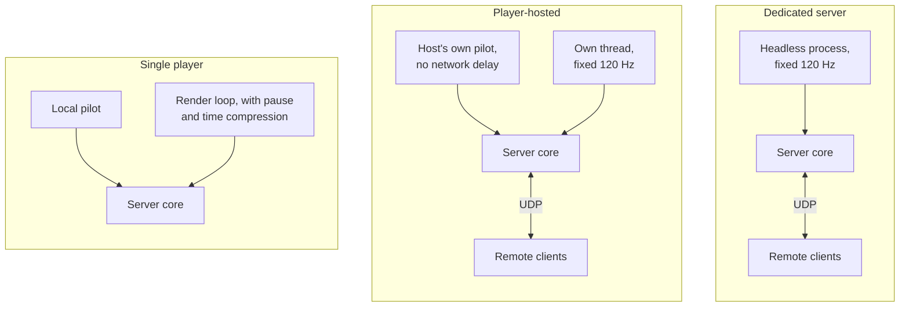
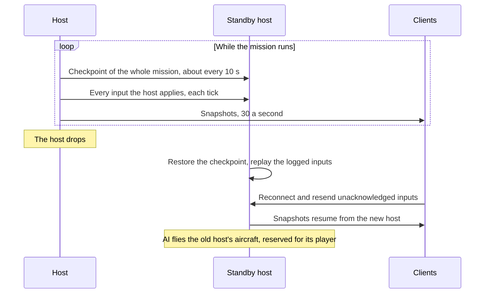
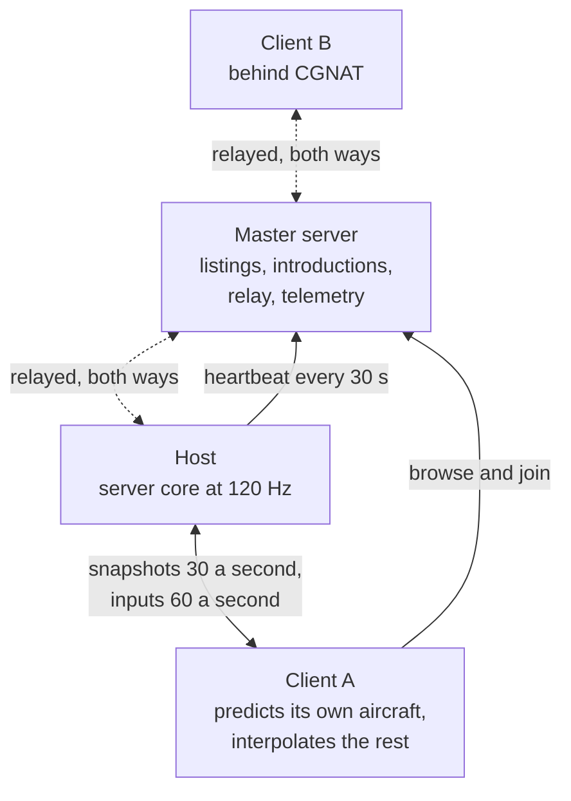
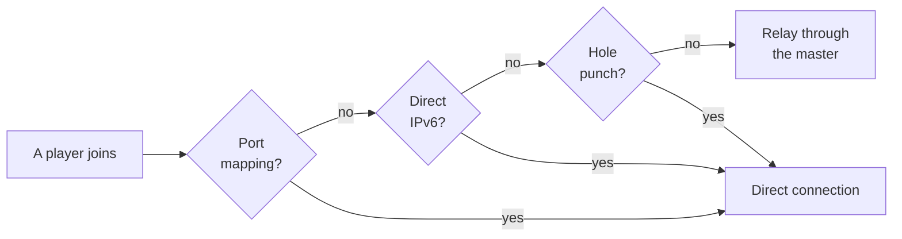

# Multiplayer

> **T.O.R.E: Tasteful Opinionated Reverse Engineered.**
> The thing being reverse engineered is the *experience*, not the executable. We
> trace what a player does and what the game does back, down to the numbers they
> would notice. How the original code achieved it is history: useful evidence,
> never a blueprint. If a sentence below reads like an instruction to reproduce
> the original's internals, it is out of date.
> <!-- tore-header v2 -->

Planning, 2026-09-28. Nothing on this page is implemented yet.

This is the design guide for Milestone 2 multiplayer. It is built from the
feature spec John wrote on 2026-09-28 and his planning answers the same day.
Every behaviour here is **opinionated**, requested by John on 2026-09-28, unless
it carries one of these marks:

- *Retail gap-fill (agent)*: where the feature spec is silent, retail
  multiplayer's rule applies. That is John's rule (2026-09-28). He named the
  revival and scoring settings, chat keys and receivers, airborne start, and the
  lock-box X and IFF squawk. Other items with this mark are an agent applying
  his rule, awaiting his review.
- *Agent proposal*: a suggestion awaiting John's review, never attributed to him.

- What Fighters Anthology's own multiplayer did: [retail multiplayer](spec/multiplayer.md).
- Where this design departs from retail: [relation to Fighters Anthology](#relation-to-fighters-anthology).
- Delivery stages, code findings and risks: [multiplayer plan](multiplayer-plan.md).

## Contents

- [Goals](#goals)
- [Roles and identity](#roles-and-identity)
- [Lobby and Quick Mission flow](#lobby-and-quick-mission-flow)
- [Slots, AI fill and handoff](#slots-ai-fill-and-handoff)
- [Rejoin and observers](#rejoin-and-observers)
- [Comms and chat](#comms-and-chat)
- [Flight data link](#flight-data-link)
- [Sim rules in multiplayer](#sim-rules-in-multiplayer)
- [Debrief](#debrief)
- [Architecture](#architecture)
- [Networking](#networking)
- [Replay and telemetry](#replay-and-telemetry)
- [Relation to Fighters Anthology](#relation-to-fighters-anthology)
- [Decisions](#decisions)
- [Open questions](#open-questions)

## Goals

Milestone 2 adds co-op multiplayer on top of the existing Quick Mission creator.
Humans take open wing slots, AI flies everything else, and a mission never
breaks when someone drops, including the host.

- One server core that runs both as a self-hosted headless dedicated server and
  inside a player's game.
- A public lobby with a server browser, backed by a small master server.
- Automatic host selection and seamless host migration.
- Seamless AI and human slot swapping, including join in progress and rejoin.
- A built-in flight data link so wingmen share targets, locks and assignments,
  limited by each aircraft's era.
- Connections that just work for most players, including behind carrier-grade
  NAT (CGNAT).

**Not in v1:**

- Accounts, or any identity beyond a callsign and a short-lived rejoin token.
- Anti-cheat. The host is trusted.
- Voice chat.
- Missions and campaigns beyond Quick Mission. The
  [roadmap](ROADMAP.md#milestone-2-multiplayer) extends multiplayer to them later.
- PvP balancing. PvP ships in v1 as a side choice, but tuning it is not a v1 target.
- Airbase Assault, the retail multiplayer-only mode ([retail](spec/multiplayer.md#airbase-assault)).
- Encryption. Traffic, passwords and tokens travel unencrypted; see
  [transport](#transport).

## Roles and identity

**King** (crown icon) controls the lobby. The mission's creator starts as King
and can hand the crown to another player. If the King leaves without handing it
off, the crown passes to the longest-connected human.

**Host** (house icon) is the machine running the server core. It is calculated
by default ([host selection](#host-selection)). The King can pin a specific
player, including themselves, or leave it calculated. Both roles show in the
lobby player list.

**Callsign.** There are no accounts. Each player types a callsign, which is only
a display name. If it is already taken in the session, the later joiner gets a
suffix: "Viper" and "Viper_2".

**Rejoin token.** On first join the server issues a token that the game saves in
the background. Tokens are specific to one server and expire after 24 hours.

## Lobby and Quick Mission flow

v1 multiplayer runs through the existing Quick Mission creator. The creator
builds a mission as usual, then opens its slots to humans.

1. The creator builds the Quick Mission, sets lobby options and becomes King.
2. The session is listed in the server browser, or kept private.
3. Players enter a callsign and pick an open slot. In co-op, humans take blue
   (friendly) flights. In PvP, humans pick any side. Unclaimed slots stay AI.
4. The mission starts. Players can still join mid-game by taking over an AI
   aircraft in an active flight: blue side in co-op, any side in PvP.
5. The mission ends and the debrief shows every human and AI aircraft on one
   results screen.

**Lobby controls** (King only):

| Setting | Notes |
| --- | --- |
| Mode | Co-op (humans on blue) or PvP (humans on any side) |
| Max human players | Default 30; the rest stays AI. Co-op can seat at most 15, see [slots](#slots-ai-fill-and-handoff) |
| Host | Calculated (default) or pinned to a specific player |
| Slot locks | Reserve or close specific slots, including lead |
| Lock sides | PvP only: prevents switching sides mid-mission |
| Visibility | Public, private or password |
| Join in progress | On or off |
| Kick | Frees the slot back to AI |
| Release reserved aircraft | Frees a disconnected player's aircraft for others |
| Friendly fire | On or off |
| Respawn rules | None, into an open AI slot, or back at a base |
| Revival | Retail's settings apply to every respawn: lives (0 to 10, or unlimited), delay (0 to 5 minutes), distance from the battle (1 to 40 miles) and weapons (with missiles, without missiles, guns only, half guns) |
| Scoring | PvP: retail's fight type (sides or free for all), kill tally (total kills, total damage or kill ratio), time limit (1 to 30 minutes), kill limit (1 to 10) and kill owner (total, one side or one player) |
| Difficulty and realism | Inherits the Quick Mission settings, locked for all humans |

Settings a player may not change are shown grayed out, as in retail. The
revival and scoring ranges are retail's ([numbers](spec/multiplayer.md#numbers)).

**Start.** Everyone starts airborne, as in retail multiplayer. Late joiners take
over aircraft already flying. *Retail gap-fill (agent):* until multiplayer
ground starts exist, "back at a base" starts the player airborne near their
side's base.

## Slots, AI fill and handoff

The Quick Mission creator places up to two sides of three wings, with up to five
aircraft per wing: 30 aircraft at most. Each aircraft is a slot. In co-op only
the 15 blue slots can seat humans, so the default of 30 humans is reachable only
in PvP.

Every slot not held by a human is flown by AI. A joining human takes over an AI
aircraft in flight with its current position, speed, fuel, weapons and damage.
A human who drops is replaced by AI at once and the mission continues.

Each wing flies one aircraft type, chosen by the King in the creator.
*Retail gap-fill (agent):* each human chooses the loadout for their own slot on
the normal Load Ordnance screen before the mission starts, as retail players
armed their own aircraft. A late joiner keeps the loadout of the aircraft they
take over.

**Flight model.** Every aircraft in a multiplayer mission flies the hybrid
flight model, AI included, so a human taking over an AI aircraft never feels its
handling change. Single player is unchanged: airborne AI keep the legacy model
there.

**Lead succession.** If a flight lead is shot down, lead passes to the next
member, human or AI, and the flight continues. The new leader hears the retail
"You're the Wingleader now" call ([radio chatter](spec/radio-chatter.md#youre-the-wingleader-now)).
Single player gains the same succession.

## Rejoin and observers

**Rejoin.** When a human disconnects, AI takes over their aircraft. A wingman
follows the flight; a lead follows the flight plan. The aircraft stays reserved
for that player as long as it is alive, and other joiners cannot take it unless
the King releases it. The player rejoins with their saved token and gets the
aircraft back. If the aircraft is destroyed, or the mission ends before they
return, they rejoin as an observer until the round ends.

**Observers** use the replay viewer's camera and playback controls on the live
session. This covers players whose aircraft was destroyed, players who join with
no slot available, and pure spectators. Observers cannot chat with any team. In
PvP the King can set an observer delay so observers cannot relay live positions
to a side. The delay is applied by the host before anything is sent, so an
observer's machine never holds live positions.

## Comms and chat

When a human leads, their wing orders go to all wingmen, human or AI. Human
wingmen receive the order as audio plus a short text line. Human wingmen can send
standard replies and requests: "engaging", "winchester", "bingo", "need help".

v1 keeps today's Alt-key wing orders and adds keys for the human wingmen's
replies and requests. An on-screen comm rose is deferred.

The game's radio today is one shared channel on which the player hears their own
flight. Separate wing and battle-net frequencies (for AWACS) do not exist yet and
are new work.

Text chat is available in the lobby and in flight. Voice chat is out of scope.
Chat uses retail's keys and receivers: `~` to type, and receivers All,
Friendlies, Enemies, Wing and Target ([retail keys](spec/multiplayer.md#what-the-player-sees-and-does)).
Before flight only All is available. *Retail gap-fill (agent):* a
`CHAT.TXT`-style file of up to 12 quick messages.

Every radio call is generated by the server core and delivered to each player as
a list of recordings. Each machine plays the imported recordings itself and
applies its own listener rule: a player hears their own flight and the nets
their aircraft can receive.

## Flight data link

A wing shares one tactical picture: who is tracking what, who is locked on what,
and which target was assigned to whom. AI and humans read and write the same
picture, so a human in slot 2 gets exactly what the AI in slot 2 would. It works
the same in single player, which keeps AI wingmen honest.

**Shared within a flight:**

- Radar contacts each member is tracking.
- Hard locks and the member holding them.
- Target assignments from lead: "engage my target", "engage bandit X", sort orders.
- Member state: position, heading, fuel state, weapons state and coarse damage.

**Cues:**

| Where | Cue |
| --- | --- |
| Radar | One marker for a contact locked by a wingmate, a different marker for "assigned to you" |
| Target window | A tag such as "2 LOCKED" or "ASSIGNED BY LEAD" |
| HUD | The assigned target's box uses a distinct shape, or pulses until you lock it |
| Sort warning | A short alert when two flight members lock the same bandit |

**Era gating.** Data link capability is a per-aircraft component. Modern jets get
the full link with shared tracks and cues. Older aircraft get assignments by
voice only, with bearing and range, and the pilot finds the target on their own
radar or by eye. A mixed flight shares what the least capable member can
receive, per member. No era or capability table exists yet: the twelve ported
aircraft need one, proposed by an agent and approved by John.

**Rates.** The shared track picture updates at 4 Hz. Locks and assignments are
sent immediately.

**Radio backing.** Every data link assignment also fires a radio call built from
the imported voice recordings, such as "Two, engage bandit, bearing 270, 15."
Bearing and range are measured from the receiving aircraft. The order is heard
even with a data link, lands in the replay's comms record, and behaves the same
for human and AI wingmen. All data link events are recorded in the replay.

## Sim rules in multiplayer

- No pause and no time compression.
- Opening the in-flight menu, losing window focus or unplugging a controller
  does not pause the mission. What the aircraft does meanwhile is an
  [open question](#open-questions).
- Game speed and realism settings are locked by the lobby for everyone.
- If a human lead is shot down, lead passes to the next member, human or AI.
- *Retail gap-fill (agent):* the Cheat menu is available to the King only and
  its settings apply to every human, following retail's host-only rule.
- Leaving never ends the mission for anyone else. *Agent proposal:* only the
  King can end it early.

**Telling friend from foe.** An X appears in the middle of the missile lock box
when the target is on your side, and an IFF squawk (U) on the selected target
answers Friendly for a same-side aircraft, both as in retail. *Retail gap-fill
(agent):* with Show Target Info on, a human's callsign appears beneath the
aircraft's label.

## Debrief

The debrief shows every human and AI aircraft on one results screen: kills, hit
percentages, damage and pilot status for each. The retail single-player debrief
shows only the player and one wingman, so this is a new layout. In PvP it also
shows the scores under the lobby's scoring settings. As in retail, only aircraft
and helicopters count toward a score, and shooting down a human player before
they eject counts as two kills. *Retail gap-fill (agent):* retail's INCOMPLETE outcome, used only in
multiplayer, applies when the King ends a mission early, and every player can
open a score board in flight, as retail's host could with Show Player Scores.

## Architecture

There is one netcode path. The **server core** is the authoritative mission: the
flight model of every aircraft, AI, weapons, damage, weather and objectives. It
runs in three ways:

| Mode | Where the core runs | Notes |
| --- | --- | --- |
| Single player | In the game, stepped by the render loop | Pause and time compression work as today |
| Player-hosted | In the host's game, on its own thread | The host's own aircraft is fed directly, with no network delay |
| Dedicated | A headless process with no window, GPU or audio | Configured by file |

The same server core sits at the centre of all three:

Other players' games are **clients**. A client predicts its own aircraft locally
and shows everything else interpolated between snapshots from the host. Anything
fixed for dedicated servers fixes player-hosted games too. How one networked
tick flows between a client and the host is drawn in the
[plan](multiplayer-plan.md#client).

### Host selection

By default the host is calculated. Candidates are scored on upload bandwidth and
median ping to all other peers first, then how open their NAT is, then CPU.
Upload weighs heavily, because the host sends state to every client. A peer that
can connect only through the relay is never a calculated host, since every
client's traffic would then flow through the relay. If the best candidate looks
underpowered for the slot count, the King sees a warning. The King can instead
pin a player as host.

### Host migration

When the host drops, the next-best candidate starts the server core from the
latest state it holds, peers reconnect to it, and the mission continues. Target:
a few seconds of disruption at most, with no mission reset. The AI the old host
was flying keeps flying, because AI runs in the server core. If the King pinned
the host and that player leaves, selection falls back to calculated.

Migration is **exact** (John, 2026-09-28). The new host continues from a
complete checkpoint of the mission: every aircraft, missile and AI pilot,
including what each AI was in the middle of doing and its random numbers. AI
pilots do not change their minds at a migration. The replay format cannot supply
this: replays store what was drawn, rounded, and cannot restart a simulation.
Checkpoints are a new, separate format.

Not every client holds the full picture, because distant aircraft are sent less
often. The host therefore keeps one or two **standby hosts**, the next candidates
in line. It sends them a checkpoint about every 10 seconds, a setting, and every
input it applies in between. A standby that takes over restores the last
checkpoint and replays those inputs to catch up, then carries on:

When the old and new host run the same operating system and processor type, the
result is exactly what the old host would have computed. Across platforms it can
differ in the last digits, which clients correct like any other prediction
error. See the [plan](multiplayer-plan.md#host-migration-exact-checkpoints).

### Dedicated servers

A headless build for Linux, Windows and macOS, configured by file. It can list
itself on the master server or stay private for direct connect. It is the
foundation for later large battles and live campaigns.

A dedicated server simulates flight models, terrain and weapons from the retail
data, so its operator must import their own copy of Fighters Anthology, the same
way the game does. Nothing derived from retail media is ever sent over the
network.

## Networking

A session on the internet. Solid arrows are direct traffic; dotted arrows are
traffic the master relays for a player who cannot connect any other way:

### Master server

A small service, planned for the existing jroverton.com server. Hosts send a
heartbeat about every 30 seconds with mission, theater, open slots, player count,
build version and a summary of their content. The master also introduces peers
for hole punching and runs the relay. Its protocol is versioned from day one.

### Connection path

Tried in order:

1. **UPnP** port mapping, when the router allows it. *Agent proposal:* also try
   NAT-PMP and PCP, the simpler protocols many routers support.
2. **Direct IPv6**, *agent proposal*. Many CGNAT providers, including Starlink
   and T-Mobile Home Internet, give customers public IPv6 addresses, so two IPv6
   players can often connect directly without the relay.
3. **NAT hole punching**, with the master introducing both peers.
4. **Relay** through the master for everything else, including CGNAT without
   IPv6. Flight sim state is small, so relay cost stays low.

Direct connect by address stays available for dedicated servers and LAN, and
skips the master entirely.

### Netcode model

Host-authoritative. The sim runs at 120 Hz. The host sends state snapshots at
30 Hz by default, a setting to raise after testing. Each client predicts its own
aircraft and the host corrects it. Other aircraft are interpolated between
snapshots. Snapshots are delta-compressed, with relevance filtering so distant
contacts update less often.

**Hit authority.** Missiles are resolved by the host. Gun hits are resolved by
the host after rewinding targets to where the shooter saw them (lag
compensation).

### Transport

Hand-rolled UDP on the standard library's sockets, identical on Linux, Windows
and macOS. A thin layer on top provides sequence numbers, acks, a reliable
ordered channel (lobby, chat, slot changes, orders) and an unreliable channel
(state). Packets stay under about 1,200 bytes, below common MTU limits. Traffic
is not encrypted in v1, so a password keeps strangers out of a lobby but is not
secret from someone who can watch the network.

### Compatibility handshake

On join, the game compares:

- The T.O.R.E build and protocol version, which must match.
- A manifest of content hashes per aircraft, theater and weapon set.

T.O.R.E imports only Fighters Anthology, from the disc's 1.0 build or the 1.02F
patch ([first-run import](spec/first-run-import.md)). USNF-only and ATF Gold
installs cannot run it, so today's differences come from the FA build and, later,
from mods and custom aircraft such as the [F/A-XX](spec/fa-xx.md). The lobby
only offers aircraft and theaters that every human in the session has. A player
missing something sees why in plain language instead of a failed join.

## Replay and telemetry

**Replay** stays separate from netcode and records on each local machine. A
client's recording holds what that client saw. Besides flight, AI decisions and
comms, it logs network diagnostics: round-trip time, packet loss, snapshot
arrival and prediction corrections, so a replay can explain a rubber-banding or
desync report. Replays also record slot changes, joins, drops, host migrations
and data link events.

**Telemetry.** The heartbeat and the session end report anonymously to the
master server:

- An anonymous install ID.
- Session length and human count.
- Connection path used: UPnP, punch or relay.
- Host migrations and whether they succeeded.

This measures real use and sizes the relay before it becomes a problem.
*Agent proposal:* a Pref switch turns telemetry off, and the README says what is
sent.

## Relation to Fighters Anthology

Fighters Anthology had multiplayer: up to eight players over LAN or TCP/IP, two
over modem or serial cable ([retail multiplayer](spec/multiplayer.md)). The
design above keeps its roles and several of its rules, and departs from it in
these places:

| Topic | Fighters Anthology | T.O.R.E v1 | Label |
| --- | --- | --- | --- |
| Connections | Serial, modem, IPX LAN, TCP/IP by typed address | Server browser, NAT traversal and relay; direct connect by address | Opinionated, John 2026-09-28 |
| Players | 2 to 8 | Up to 30 humans | Opinionated, John 2026-09-28 |
| Host leaves | Game ends for everyone | Host migration | Opinionated, John 2026-09-28 |
| Client leaves | Game continues | Game continues; AI flies the aircraft, reserved for rejoin | Opinionated, John 2026-09-28 |
| Mission types | Single Mission, Quick Mission, Airbase Assault | Quick Mission only | Scope, John 2026-09-28 |
| Pause | Any player pauses everyone | No pause | Opinionated, John 2026-09-28 |
| Time compression | None | None | Matches retail |
| Mission control | Host sets parameters and cheats; others see them grayed out | King sets them; others see them grayed out | Matches retail, with the King in the host's role |
| Aircraft choice | Each player picks their own type | Each human takes a slot in a King-built wing | Opinionated, John 2026-09-28 |
| AI | AI wings from the creator | AI flies every open slot and takes over dropped players | Opinionated, John 2026-09-28 |
| Sides | Each player picks Friendly or Enemy | Co-op: humans on blue. PvP: any side | Opinionated, John 2026-09-28 |
| Start | Everyone starts airborne | Everyone starts airborne | Matches retail, John 2026-09-28 |
| Death | Revive with Enter; host sets lives, delay, distance and weapons | The spec's respawn rules, with retail's revival settings | Both, John 2026-09-28 |
| Scoring | Kill tally, time and kill limits, kill owner | Retail's scoring settings in PvP | Matches retail, John 2026-09-28 |
| Chat | `~` with five receivers and `CHAT.TXT` | Retail keys and receivers; quick messages | Matches retail, John 2026-09-28; quick messages are a retail gap-fill (agent) |
| Telling friend from foe | X in the lock box, names under callsigns, IFF squawk (U) | All three kept | X and IFF: John 2026-09-28; names: retail gap-fill (agent) |
| Ctrl+Q exit | Ends the mission for everyone | Leaves; only the King ends the mission | Opinionated, agent proposal |

## Decisions

Made by John on 2026-09-28:

| Question | Decision |
| --- | --- |
| Tick rate | Sim at 120 Hz; netcode snapshots at 30 Hz, a setting to raise after testing |
| Replay and netcode | Separate; replay records locally and logs network diagnostics for troubleshooting |
| Transport | Hand-rolled UDP on standard sockets with a thin reliability layer |
| Hit authority | Missiles resolved by the host; guns resolved by the host rewinding to the shooter's view (lag compensation) |
| Data link | Shared track picture sent at 4 Hz; locks and assignments sent immediately as reliable events |
| Rejoin | Indefinite while the aircraft is alive, reserved for the player; otherwise observe until the round ends |
| Observer mode | Replay controls on the live session; no chat with any team; optional observer delay in PvP |
| Identity | Callsign, no account; duplicates get a suffix (Viper_2); a server-specific rejoin token lasting 24 hours |
| Max humans | Default 30, configurable; revisit after load testing |
| Lobby control | King (crown) controls the lobby and can hand it off; Host (house) is calculated or pinned by the King |
| PvP | In v1: humans pick any side and can take any AI slot mid-game; the King can lock sides |
| Relay | Linode shared 2 GB plan with 1 TB monthly transfer; relayed peers are never the calculated host |

Made by John on 2026-09-28 while planning:

| Question | Decision |
| --- | --- |
| Retail rules | The feature spec wins where it speaks; where it is silent, retail multiplayer's rule fills the gap: revival and scoring settings, chat keys and receivers, airborne start, lock-box X and IFF squawk |
| Migration fidelity | Exact checkpoint, including AI thinking and random number states, rather than rebuilding from a partial state |
| Flight model | Every aircraft in a multiplayer mission flies the hybrid model; single player unchanged |
| Comm rose | Not in v1; keep the Alt-key orders and add reply and request keys |

## Open questions

From the feature spec. Mission start and PvP scoring were settled by John on
2026-09-28 (see [decisions](#decisions)).

- **Relevance bands:** which aircraft each client receives at the full 30 Hz and
  which at reduced rates, by distance and sensor range. *Agent proposal:* 30 Hz
  for your own flight, anything within 20 nm, anything any friendly sensor
  tracks and any missile aimed at you; 10 Hz from 20 to 60 nm; 2 Hz beyond.
- **Human-to-human collisions and midairs.** *Agent proposal:* the host detects
  them with the same test single player uses, from its own positions for both
  aircraft. Collisions stay on regardless of the friendly-fire setting.
- **Master server abuse limits:** rate limiting and fake listing protection.
  *Agent proposal:* a listing must first answer a challenge sent to its address;
  heartbeats and queries are rate-limited per address; listings expire after
  90 seconds without a heartbeat; the master never answers an unverified sender
  with more bytes than it received.

Raised while planning (2026-09-28):

- **Menu, focus loss and controller loss in flight.** With no pause, what does
  the aircraft do? *Agent proposal:* the pilot's controls return to neutral
  while the menu is open, and after 10 seconds without input the AI flies the
  aircraft until the player touches the controls again.
- **Dedicated server King.** *Agent proposal:* the first human to join a
  dedicated server becomes King, unless its config file fixes the mission and
  locks the settings.
- **No eligible host.** If every peer can connect only through the relay, no one
  can be the calculated host. *Agent proposal:* the King sees a plain warning
  and can pin a relayed host anyway, or use a dedicated server.
- **Lobby screens.** Retail's connection screens, Players dialog and message
  window exist in the retail media. Research whether their art can be reused, as
  the project rules prefer.
- **Reply keys.** Which keys the human wingmen's replies and requests use. They
  are new actions, so the [controls list](CONTROLS.md) changes with them.
