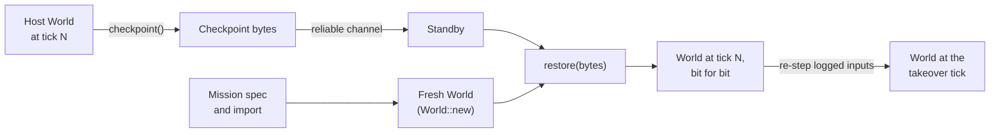

# Exact checkpoints

> **T.O.R.E: Tasteful Opinionated Reverse Engineered.**
> The thing being reverse engineered is the *experience*, not the executable. We
> trace what a player does and what the game does back, down to the numbers they
> would notice. How the original code achieved it is history: useful evidence,
> never a blueprint. If a sentence below reads like an instruction to reproduce
> the original's internals, it is out of date.
> <!-- tore-header v2 -->

Design of 2026-10-05 for stage H of the [multiplayer plan](../multiplayer-plan.md#stages)
and its section [host migration: exact checkpoints](../multiplayer-plan.md#host-migration-exact-checkpoints).
This is T.O.R.E's own format; Fighters Anthology had nothing like it. How the
work is split into slices, and what is built, is in the
[architecture guide](../ARCHITECTURE.md#exact-checkpoints). Every choice below
is an agent decision unless it is credited to John. John's binding decision is
that host migration is exact (2026-09-28): the new host continues from the
whole mission, down to each AI pilot's thinking and random numbers.

## Contents

- [What a checkpoint is](#what-a-checkpoint-is)
- [What it holds and what it leaves out](#what-it-holds-and-what-it-leaves-out)
- [Restoring](#restoring)
- [Layout](#layout)
- [Sections](#sections)
- [Coding rules](#coding-rules)
- [Versioning](#versioning)
- [Keeping it complete](#keeping-it-complete)
- [The equivalence scenarios](#the-equivalence-scenarios)
- [Measurement](#measurement)
- [The state, by area](#the-state-by-area)

## What a checkpoint is

A checkpoint is every piece of mutable mission state in a `World`, taken
between two ticks, as bytes. `World::checkpoint()` writes it.
`World::restore(bytes)` loads it into a `World` built from the same mission,
which then steps on exactly as the original would have.

- **What it is for.** A host sends one to each standby host about every 10
  seconds, and the inputs it applies in between. A standby that takes over
  restores the latest checkpoint and re-steps the logged inputs
  ([guide](../MULTIPLAYER.md#host-migration)).
- **Same build only.** Checkpoints travel only inside a session, between
  peers the handshake has already matched by build and protocol. They are not
  save files: a checkpoint from another build is refused, never converted.
- **Not a replay.** A replay records what was drawn, rounded. A checkpoint
  records what the simulation will read next, exactly.
- **Not for joining.** A joining client gets a snapshot keyframe, not a
  checkpoint. Clients never need AI internals.



## What it holds and what it leaves out

Every field of every type reachable from `World` falls in exactly one class.
The class decides how it is coded:

| Class | What it is | Coded? |
| --- | --- | --- |
| Mutable state | Anything a later tick can read: flight states, AI controllers and memories, missiles, gun rounds, random streams, counters, queues that can be non-empty between ticks, timers, and presentation state the next tick reads back (smoke outlets, the render history's devices) | Yes, exactly |
| Copied records | Imported data copied into mutable state: weapon records, ownship configurations, sensor profiles, runway views | Yes, by value, once each as a [shared record](#shared-records) |
| Mission setup | Fixed when the mission is built: the theater, terrain, airport scene, aircraft types, phrases, `Setup`, the layout, spawn plans | No: the fresh `World` built from the same mission has it |
| Why-records | Write-only explanations for the recorder and the debug panels: the AI journal, actor and controller traces, draw logs, the radio journal, a radio call's `origin`, the formation trace, decoy and device notes the app alone drains | No (see below) |
| Per-tick scratch | Rewritten every tick before anything reads it, and empty or stale between ticks | No, but only with a comment proving it |
| Local | Belongs to one machine: worker pools, file writers, the combat tape's list, render caches outside `World` | No |

**The why-records rule.** The simulation never reads a why-record, so leaving
them out cannot change any later tick. After a restore, the recorder's
explanation of a call or decision that started before the checkpoint can be
missing; nothing else differs. *Agent decision:* coding them would add about
60 more types (the journal's `Cause` alone has 40 variants) for text that no
standby needs. Small gates that only decide whether to write a journal line
(`JournalMemory`, `Journal::windows`, `CrewVoice::gate`) are why-records too.

**The scratch rule.** A field is scratch only if a comment at the skip shows
that every path writes it before any read in the next tick. When in doubt,
code it: a field that is coded needlessly costs bytes, a field skipped wrongly
costs exactness. The surveys found several "caches" that are not:
`Ownship::range_estimate` and `mounted_key` refresh only every 60 ticks or on
a change, `AiWings::last_hp` triggers the next damage report, and the render
history's devices are drawn again for an aircraft whose AI stopped, and
`formation::Guidance::trace`, a "hidden inspection hook" that `change_slot` and the
other actors' traffic read.

**Process switches.** One process-wide switch changes simulation results: the
retail stall speeds (`tore_sim::flight::retail_stall_speeds`). The header
records it, and a restore in a process with the other setting is refused. A
session refuses the switch anyway.

## Restoring

*Agent decision:* a checkpoint restores **over a fresh `World` built from the
same mission and import** (`World::new` with the same `MissionSpec` and
seating, or the same test fixture). The fresh world supplies the mission setup.
The checkpoint supplies everything else, including the structure:

- **Structure comes from the bytes.** Handoffs add and remove cockpits, combat
  ownships, AI actors, AI slots and radio channels mid-flight, so the restored
  lists are rebuilt from the checkpoint, never matched to the fresh world's.
  A fresh open mission has no cockpits; a restored one has as many as the
  checkpoint says.
- **Flight models by identity.** A flight state codes the `AircraftId` of its
  aircraft and its model's ordinal beside its exact state. On loading, the
  flight model comes from the fresh world's model table (`Models`): every
  distinct model, as the import built it, of every aircraft type and every
  flight the world holds. Handoffs move flights, never models, so the table
  is the same all mission long and on both sides. A world built from an import
  has one model per identity, so the ordinal is 0; test fixtures can carry two
  (a synthetic player beside real AI rows), which the ordinal tells apart, in
  an order fixed by a fingerprint of each model.
- **Copied records by value.** Ownship configurations, weapon records, sensor
  profiles and runway views are coded in full, once each, so a restore never
  needs the import's files.
- **In place, then discard on error.** Holders that mix setup with state
  (`World`, `Combat`, `AiWings`, the weather `Environment`) restore their
  mutable fields in place and keep their setup fields. Everything below them is
  decoded as new values. If a restore fails, the world is half-restored and
  must be thrown away: build a fresh one. *Agent decision:* atomic restore
  would need every holder to be cloneable for no use in practice.
- **Checks before writing.** The container is checked whole (magic, version,
  switches, identity, CRC-32) before any field is touched, so a damaged or
  foreign checkpoint fails before the world changes.

The **mission identity** is FNV-1a 64 over what the fresh world fixes and the
checkpoint relies on: the terrain's theater and layout, the aircraft
identities of every loaded type in load order, every plane's slot, and the
setup's start. It catches a restore into a different mission, not a
different import: the handshake's content manifest already guarantees the
import.

## Layout

All integers are little-endian bit fields packed least significant bit first,
with [tore-codec](../../crates/tore-codec/src/lib.rs)'s `BitWriter`, exactly as
the [wire protocol](net-protocol.md#overview). Each section starts on a byte
boundary.

| Part | Coding | Notes |
| --- | --- | --- |
| Magic | 8 bytes, `TORECKPT` | |
| Container version | 16 bits | 1 |
| Switches | 8 bits | Bit 0: retail stall speeds on. Others zero |
| Tick | 64 bits | `World::tick()`, the tick the next step runs |
| Mission identity | 64 bits | See [restoring](#restoring) |
| Section count | varint | |
| Each section | id (8 bits), byte length (varint), padding to a byte, the body | Ids in ascending order, each at most once |
| CRC-32 | 32 bits | IEEE, over every byte before it |

The shared records are section 0 and come first, so a loader has them before
any section refers to one. A loader checks that each body ends exactly at its
length with only zero padding: a coder that writes a field its reader does not
read fails here, not ticks later.

## Sections

One section per mutable field of `World`, so a new field on `World` cannot
compile without a section (see [keeping it complete](#keeping-it-complete)):

| Id | Section | What | Restored |
| --- | --- | --- | --- |
| 0 | Shared records | Copied records referred to by index | First |
| 1 | Roster | Planes' pilots, seats, crews, wing recipients | New value |
| 2 | Combat | `Combat` and its `live::State`: ownships, targets, projectiles with guidance, effects, smoke, contrails, debris, marks, the ledger, the rewind history, random streams, the combat tick (`World::tick`) | In place |
| 3 | AI wings | `AiWings` and its `AiMission`: actors with flight, controller, memory, sensors and stores; leaders, opportunities; the bridge's maps and random streams | In place |
| 4 | Cockpits | Every human-flown plane's `Cockpit`: flight, turbulence and its stream, airport service, NAV mode, message clocks, tower radio, crew voice, result tracker | New value |
| 5 | Weather | The weather clock, its ticks, the fog random stream, the selection schedule, the active layers and each record's tint scalar (`Environment`'s mutable part) | In place |
| 6 | Comms | Radio channels, cooldowns, the radio random stream | New value |
| 7 | Wing status | The AI wingmen's airfield report memory | New value |
| 8 | Radio | The radio call memory (hits by shooter and victim) | New value |

Not coded at `World` level: `setup`, `phrases` and every terrain field but
the weather (mission setup). Stage G adds the data link's picture and the
radio frequencies: each new `World` field gets the next free id; state added
inside an existing holder joins that holder's section.

### Shared records

A record is coded once into section 0 and referred to by its index, a
varint. Two records are the same when their codings are byte-identical, so
equal weapon records carried by 30 aircraft and 40 missiles cost one coding.
Each record starts with a 32-bit tag of its type, checked on loading.
Indices follow first use while the sections are written, so the same world
always writes the same bytes. A record may refer to earlier records.

### Flight states

A flight state is coded as its `AircraftId` and its model's ordinal (two
varints) and then the
[exact own-plane coding](../ARCHITECTURE.md#the-exact-state-of-a-humans-plane)
(`flight::State::write_exact`, no baseline) that the wire already uses. The
same bytes as the wire mean one coder to keep complete, not two. The write-only
trace is not coded, as on the wire. The native research adapter is refused,
as on the wire. A cockpit's `previous_flight` is per-tick scratch: the next
step overwrites it before reading it, so a restored cockpit starts with it
equal to `flight`, as a decoded own plane does.

## Coding rules

The trait is `tore_sim::checkpoint::Checkpoint`:

```rust
pub trait Checkpoint: Sized {
    fn save(&self, s: &mut Saver, base: Option<&Self>) -> Result<(), CheckpointError>;
    fn load(l: &mut Loader<'_>, base: Option<&Self>) -> Result<Self, CheckpointError>;
}
```

`Saver` wraps a `BitWriter` with the shared-record table and the world's
flight models; `Loader` wraps a `BitReader` with the shared records and the
fresh world's flight models. Holders restored in place implement `InPlace`
(`save_in_place` and `restore_in_place(&mut self, ..)`) instead. The rules:

- **Exact values.** Every float is coded by its bits (the exclusive-or coding
  of `tore-codec`'s `write_f64_xor`, against the baseline or zero), so NaN
  payloads, signed zeros and infinities survive. `f32` the same at 32 bits.
  Integers by their bit pattern at their width; `usize` as a 64-bit value
  that must fit the platform on loading (32-bit Windows is a CI target).
- **Baselines.** `base` is an earlier value of the same field the reader also
  has, or `None`. Checkpoints code against `None` except where a coder chooses
  a baseline inside its own value: a sequence of similar records (the rewind
  history's frames, smoke puffs) may code each element against the one before.
  An unchanged 64-bit value then costs one bit.
- **Collections.** `Vec`, `VecDeque`, `BTreeMap` and `BTreeSet` code a varint
  count and then their items in order. A count larger than the bits left is
  refused before anything is allocated. Maps code each key without a baseline
  and each value against the baseline map's value at the same key. No
  `HashMap` or `HashSet` may enter mission state (none exists).
- **Strings** code a varint byte count and UTF-8 bytes, with no 255-byte cap:
  composed radio text can be longer.
- **Enums.** A field-less enum codes its variant's fixed number, a varint,
  with `checkpoint_enum!`. An enum with data is written by hand as one `match` with
  every variant and no `_` arm, so a new variant fails to compile.
- **Every field named.** A struct's coder destructures it with every field
  listed and no `..`, and builds it back the same way.
  `checkpoint_struct!(Type { a, b } shared { c } skip { d = <rebuild> })` does
  both (`shared` fields are coded as shared records, `skip` fields rebuilt by
  their expression); `checkpoint_tuple!(Type(a, b))` does it for a tuple
  struct; a hand coder does it in a `let Type { .. } = self` with every field.
  A skipped field names its class in a comment: why-record, scratch (with the
  proof), setup or local.
- **`&'static str`** in state codes as an index into a fixed table beside the
  type (the radio cooldown keys are the one case found), and an unknown string
  on saving is an error, not a silent skip.
- **Cross references** stay as the ids the simulation uses (aircraft,
  projectile, missile, seat and plane ids; station indices). They need no
  translation, because the restored world uses the same ids. Lists that the
  simulation keeps sorted are restored in the order coded, which is that order.
- **Where a coder lives.** Most state has private fields, so each module's
  coders live in a child module beside it, in a file named
  `<module>_checkpoint.rs` and declared in the module as
  `#[path = "<module>_checkpoint.rs"] mod checkpoint;` (the pattern
  `ai/mission.rs` already uses for its observation code). Coders read fields
  and never change simulation code. A type from another crate (`AircraftId`,
  `Weapon`, `NativeRng`, `PilotInput`) is coded in `tore-sim`, which owns the
  trait. Types with an `Exact` coder already (the flight state's parts,
  turbulence, cheats, sensor controls) reuse it through
  `checkpoint_via_exact!`.
- **Why a new trait.** `Exact` is the wire's own-plane coder, frozen by the
  wire's golden test. Checkpoints need a context (shared records, the import
  table) and generic collections that `Exact` does not have, and must not
  change a byte of the wire.

## Versioning

The container version changes only when the container's layout changes (the
header, the section framing, the shared-record table). A change inside a
section's coding needs no version: checkpoints never cross builds, and the
handshake already refuses a different build. *Agent decision:* a schema hash
of every coder was considered and rejected; it would make every simulation
change touch a golden value with no protection that the build check does not
already give.

## Keeping it complete

Every future change to simulation state must update the checkpoint. Three
guards turn a forgotten field into a failure instead of a silent desync:

1. **It does not compile.** Each coder names every field. A field added to a
   struct, a variant added to an enum or a field added to `World` is a
   compile error until it is coded or skipped with its class.
2. **The section does not end where it should.** A coder whose reader and
   writer disagree fails its section's length check on the first restore.
3. **The equivalence test diverges.** A field skipped as scratch or setup
   that a later tick reads makes the restored world differ from the original
   within the scenario's M ticks.

New state therefore costs: name the field in its type's coder (one word in a
macro, usually), and, for a new type, a coder in its module's
`<module>_checkpoint.rs`. Stage G's data link is the first expected user.

## The equivalence scenarios

The equivalence test steps a mission to tick N, checkpoints it, restores it
into a fresh world, steps both M more ticks with the same inputs, and requires
on every tick the same tick output (every field but the why-records) and, every
30 ticks and at the end, byte-identical checkpoints. It also checks that a
restored world checkpoints to the same bytes it was restored from, and that
truncated, damaged and random bytes are refused without a panic. It runs in
the normal `cargo test` on every CI platform (Linux, Windows 64 and 32-bit,
macOS); every scenario is built from synthetic fixtures, never retail data.

| Scenario | Fixture | At tick N the test asserts | N, M |
| --- | --- | --- | --- |
| Single player | The full-tick fingerprint mission (`world/tick_tests.rs`) with its script and drones. *Built (H0, asserted H8)* | A turbulence event begun, the airport selected and the tower's reply held, the player flying fast | 600; 600 |
| Dogfight with rounds in flight | The crowd fixture (`world/crowd.rs`): four against four at 10,000 ft, four human seats. *Built (H0, asserted H8)* | Gun rounds in flight, every ownship holding radar contacts | 600; 600 |
| Handoffs in the open mission | `World::new` with `Seating::Open` from the synthetic import, three against three; seats take planes at steps 60 and 61, one gives its plane back at 500, another takes one at 640. *Built (H0, asserted H8)* | Restored into a world fresh from `World::new`, so the structure (cockpits, ownships, actors) differs from the fresh world's; the plane given back is the AI's again | 700; 600 |
| Damaged aircraft | The crowd fixture with Realistic damage; the damage command on a human's aircraft at steps 800 to 802, one AI aircraft shot down at 840 (its row emptied, its pilot ejected by hand) and another hurt at 850. *Built (H8)* | An ownship with hit points lost and a system fault, a wreck falling, a pilot under canopy, a hurt AI aircraft flying | 900; 600 |
| Handoffs in the fight | The crowd fixture; seat 1 gives its plane back at step 500 and takes an AI plane at 560. *Built (H8)* | The roster, cockpits and AI actors as the handoffs left them, the leaders holding a designated contact | 700; 600 |
| Missile duel | `World::new` open mission, one against one at 5 nautical miles, two seats; seat 1 fires its guns at step 1,400 and seat 0 a guided missile when in range. *Built (H8)* | A guided missile in flight, a missile warning held by a threat service, gun rounds in flight, both aircraft alive; they meet 400 ticks after the checkpoint | 1,700; 1,100 |
| Radio calls pending | The single-player fingerprint mission with three calls (delays of 5, 9 and 14 seconds) and two cooldowns put into the player's channel at step 570. *Built (H8)* | Both cooldowns running, the Comms section differing from the same mission's without the calls | 600; 900 |
| AI landing | `World::new` over the synthetic import with an airport, airborne, the wing ordered to land at step 20; the two wingmen start at the first approach gate and 16,000 ft behind it. *Built (H8)* | One wingman in the rollout on the runway, the other holding or approaching; after the run the first has cleared the runway and the second is on approach | 12,500; 1,600 |
| Ground start | `World::new` over the synthetic import with an airport, `Start::Ground`, a wing of four, the player's takeoff at step 5. *Built (H8)* | A wingman parked, one lining up on the taxiway, the player rolling at over 100 ft/s | 2,000; 1,400 |
| Changing weather | The single-player fingerprint mission with a weather configuration whose two layers both run the fog callback and whose first layer ends five seconds in. *Built (H8)* | The first layer active with a fog tint drawn; after the run the second layer is active | 300; 1,200 |

The scenarios live in `world/checkpoint_scenarios.rs`. Each has an `expect`
that asserts its state at tick N, and the test
`every_scenario_builds_twice_identically_and_reaches_its_asserted_state` runs
them. The synthetic airport is `airport_resources()` in
`test_support/resources.rs`: the import of `resources()` with one runway
airport in the theater's layout, whose shape carries the contact boxes the
AI's takeoff, landing and parking read.

Until every section is coded, the whole-world test is ignored with its reason,
and each slice runs the **twin restore** instead: build the scenario twice,
step both to N, restore only the covered sections from one into the other, and
step on. The uncovered sections are already equal in the twin, so any
difference comes from the covered sections' coding. The harness finds the
covered sections itself: a section is covered when it checkpoints alone, and
any error but "not coded yet" fails the test.

A twin restore can only catch a coding error in state that matters during the
M ticks: a field that is wrongly skipped but empty at tick N, or that no
later tick reads, is invisible to it (H0 checked this by skipping fields of
the radio section on purpose: they were empty at N in every scenario, and
the test still passed). That is why each scenario asserts the state it is
meant to exercise at tick N.

## Measurement

Measured by the final slice, recorded in the
[bandwidth budget](../multiplayer-plan.md#bandwidth-budget) and a baseline:

- the size of each section and of the whole checkpoint, on the synthetic
  crowd fixture (every run) and on the 15 against 15 Ukraine mission with real
  data (an ignored test that reads `TORE_DATA_DIR`), at the start, in the
  first-minute furball and after five minutes;
- encoding and restore time, release build, on the development machine;
- the catch-up cost: a restore plus 1,200 ticks of re-stepping, against the
  plan's estimate of 1 to 3 seconds.

The plan's budget is 150 to 600 KB per checkpoint and 15 to 60 KB/s per
standby. The surveys estimate a 15 against 15 mission at about 300 to 700 KB
before any delta coding, most of it the rewind history (one second of hit
volumes for every aircraft, about 16 KB per aircraft raw) and the AI actors'
memories and sensors (3 to 6 KB each). Coding each rewind frame against the
one before is part of the combat slice. Delta coding against the previous
checkpoint is built only if the measured size needs it.

*Built (H3a):* the rewind history codes only the newest 61 frames, the ones a
gun round's rewind (at most 60 ticks) can read, and each volume's previous
position is one flag. That is about 5.7 KB per aircraft on the crowd fixture,
so about 170 KB for 30 aircraft, and about 57 KB for the whole combat state
of eight.

## The state, by area

What six read-only surveys at `884f9916` found, for the coders. Line numbers
drift; the coders, not this table, are the record.

| Area | Root | Types to code (about) | Typical size, 15 against 15 | Notes |
| --- | --- | --- | --- | --- |
| World shell | `World`, `Roster`, `Cockpit`, `Environment`, `airport::Service` | 15 | under 5 KB | Roster, cockpits and airport service fully private; only the weather clock, its fog random stream and fog tints change in `Terrain` |
| Combat core | `live::State`, `Ownship`, `Target`, `Projectile`, missile `Flight` and `Seeker`, `Ledger`, `rewind::History` | 60 | 100 to 500 KB | `World::tick` is combat's tick. Two xorshift streams. A round with no weapon record of its own reads its owner's station, so ownships load before projectiles are used |
| Combat effects | `Combat` wrapper, `Smoke`, `Devices`, `Piece`, `Mark`, `RenderHistory` | 30 | a few KB; up to MBs of contrail and flare puffs at worst | Presentation, but read back by the next tick or the picture. The one stored `f32` is a flare puff's opacity |
| Records and sensors | `Weapon`, `live::Configuration`, `SensorProfiles`, `Sensors`, `ThreatService`, `RunwayView` | 40 | 10 to 30 KB shared | Shared by ownships and AI actors |
| AI mission | `AiMission`, `AiActor` and its airfield sequence, memory, threats, defense, assignment | 45 | 100 to 200 KB | Actors are inserted and removed by handoff. Two random streams per actor besides the controller's |
| AI controller | `Controller` and its manoeuvre, intents, gunnery, formation guidance, weapon service | 40 | about 20 KB | Already `Clone + PartialEq`, with traces and draw logs outside equality |
| AI wings | `AiWings`, its reports, chatter watch, result trackers | 12 | a few KB, plus configurations as shared records | Two random streams; `ai_shots` grows with every AI round in the default rules: code it, measure it |
| Radio | `Comms`, `Radio`, `WingStatus`, `AirfieldRadio`, `CrewVoice` | 16 | under 1 KB idle | One random stream; seven `&'static str` cooldown keys |

The skip list the surveys support, with the class of each: why-records:
`AiMission::journal`, `AiActor::trace` and `journal_memory`, `Controller::trace`,
every `DecisionRandom`'s draw log, `Comms::journal`, `Channel::recent`,
`Call::origin`, `AirfieldRadio::notes`, `CrewVoice::gate`,
`AiWings::{last_output, decoy_rolls, formation_trace, threat_reports}`,
`Reports::{notes, queued, activity}` (journal entries only),
`live::State::decoy_log`, `Ledger::outcomes`. Scratch:
`Cockpit::previous_flight`, `Controller::{gun_views, formation_traffic}`,
`ControlAdapter`, `AiActor::last_input`, `AiMission::{missiles, gun_rounds}`
(each with its proof at the skip); `RenderHistory::places` is rebuilt from the
coded snapshot. Small outputs that a screen reads before the next step, such
as combat's hit records and the sensors' map contacts, are coded: a standby
that becomes a hosting game shows them. Setup: `World::{setup, phrases}`, `Terrain` but the weather,
`Environment::configuration`, `Combat::{dummy_types, dummy_configs,
airport_objects, mission_spawns, mission_layout, contrail_offsets, dummies,
initial_ammo, range, open, clean_recording}`, `AiWings::{airfields,
flight_model, mission_preset}` and `Watch::{names, seats}`. Local:
`Combat::{tape, notes, last_launcher}`. Everything else is coded.
