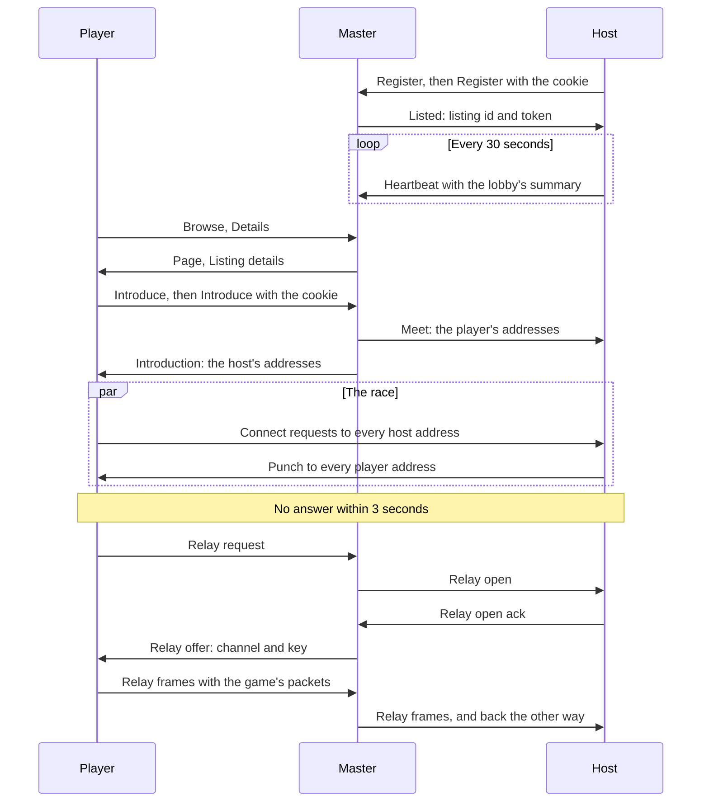
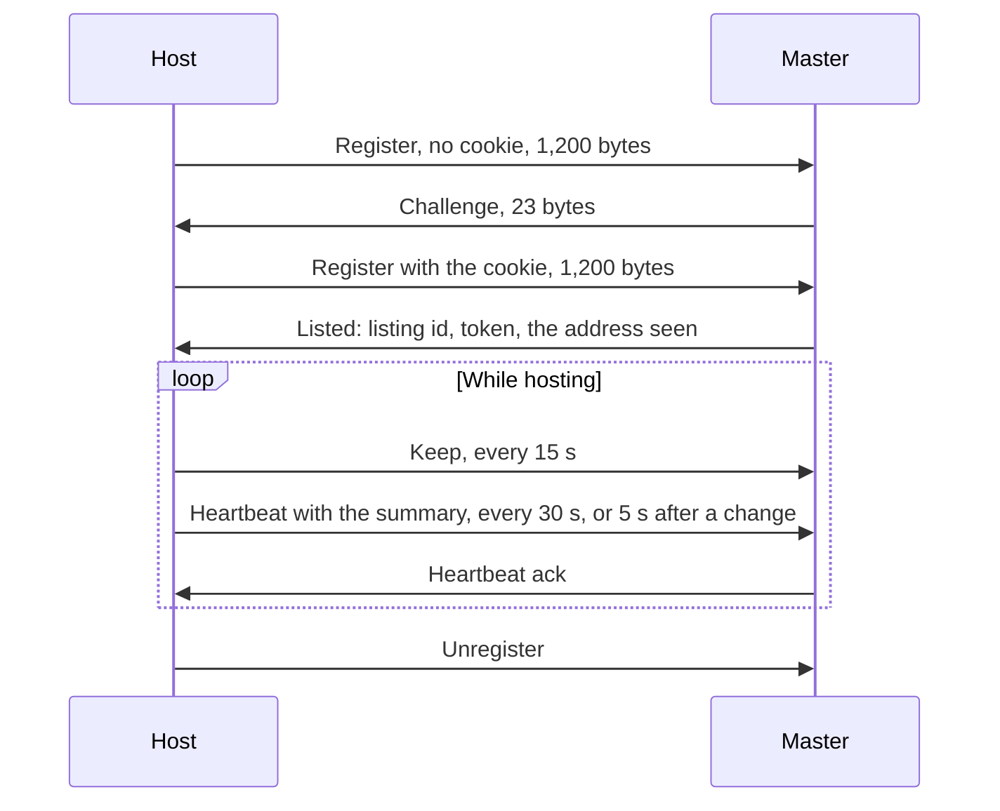

# Master server protocol

> **T.O.R.E: Tasteful Opinionated Reverse Engineered.**
> The thing being reverse engineered is the *experience*, not the executable. We
> trace what a player does and what the game does back, down to the numbers they
> would notice. How the original code achieved it is history: useful evidence,
> never a blueprint. If a sentence below reads like an instruction to reproduce
> the original's internals, it is out of date.
> <!-- tore-header v2 -->

Design of 2026-10-05 for stages I and J of the
[multiplayer plan](../multiplayer-plan.md#stages). *Built (I1, 2026-10-05):*
the wire itself, every packet's encoder and bounded decoder, in `tore-net`'s
`master` module; what the build settled is in
[the wire as built](#the-wire-as-built). *Built (I2, 2026-10-05):* the
master itself, `tore-master`, apart from introductions and the relay
(slices J2 and J3), and the Internet Lobby's browse client. The game's side
and the screens are not built yet. The
[architecture guide](../ARCHITECTURE.md#master-server-and-connectivity)
has the design and the slices that build it, and the
[operations guide](../MASTER-SERVER.md) says how the master is run. Every
choice below is an *agent proposal* awaiting John's review, unless it is
credited to him. This is T.O.R.E's own protocol; Fighters Anthology had no
master server ([retail spec](../spec/multiplayer.md)).

The master server is a small public service. It keeps a list of the games
that want to be found, answers the Internet Lobby's questions about them,
introduces a joining player to a host so the two can open a path through
their routers, and relays the traffic of a pair that cannot. The game's own
traffic between a host and its players is the
[game's wire protocol](net-protocol.md); this page is only what is said to
the master.

## Contents

- [Overview](#overview)
- [Packets](#packets)
- [Versions](#versions)
- [Proving an address](#proving-an-address)
- [Common fields](#common-fields)
- [Listing a game](#listing-a-game)
- [Browsing](#browsing)
- [Mapping test](#mapping-test)
- [Introductions](#introductions)
- [Relay](#relay)
- [Reports](#reports)
- [Limits](#limits)
- [Security](#security)
- [Golden file](#golden-file)
- [The wire as built](#the-wire-as-built)

## Overview

- **UDP, two ports.** The master listens on UDP 26901 for everything and on
  UDP 26902 for the second half of the [mapping test](#mapping-test) only.
  Both on IPv4 and IPv6. The ports are settings
  ([operations](../MASTER-SERVER.md#the-configuration-file)).
- **The game port talks to the master.** A host sends to the master from its
  game port, the socket its players join, so the master sees the address and
  port its router gives that socket. A joining player sends from the socket it
  will join with. That is what makes introductions and the relay work: the
  master learns the outside address of the very socket the game uses.
- **Separate from the game's protocol.** Master packets carry their own
  checksum id, `TORE-MASTER`, and their own version. A game's transport never
  sees them: the game routes every datagram from the master's addresses to
  its master code before the transport reads anything
  ([the router](../ARCHITECTURE.md#one-socket-two-protocols)).
- **Small and bounded.** Every master datagram carries at most 1,232 bytes, so
  a relayed game datagram (at most 1,200 bytes) and the relay's 15 bytes fit
  the smallest IPv6 path (1,280 bytes less 48 bytes of IPv6 and UDP headers).
- **Never a reflector.** The master never answers a sender whose address it
  has not proven with more bytes than that sender sent
  ([proving an address](#proving-an-address)).
- **Bits, little end first,** with `tore-codec`, as in the game's protocol.
  Strings are an 8-bit length and that many bytes of UTF-8; numbers are
  unsigned unless a row says otherwise.

## Packets

Every master packet starts with a byte-aligned header:

| Field | Size | Meaning |
| --- | --- | --- |
| Checksum | 32 bits | CRC-32 (IEEE) over the 11 bytes `TORE-MASTER` followed by every byte after this field |
| Kind | 8 bits | One of the kinds below |
| Version | 16 bits | The sender's master protocol version, 1 for now |

The header is 7 bytes. A datagram that is too short, too long, of an unknown
kind or fails its checksum is dropped silently and counted.

| Kind | Name | Direction | Answer | Section |
| --- | --- | --- | --- | --- |
| 1 | Challenge | master to anyone | | [Proving an address](#proving-an-address) |
| 2 | Unsupported | master to anyone | | [Versions](#versions) |
| 3 | Register | host to master | Challenge, Listed | [Listing](#listing-a-game) |
| 4 | Listed | master to host | | [Listing](#listing-a-game) |
| 5 | Heartbeat | host to master | Heartbeat ack, Unknown listing | [Listing](#listing-a-game) |
| 6 | Heartbeat ack | master to host | | [Listing](#listing-a-game) |
| 7 | Keep | host to master | Unknown listing, else none | [Listing](#listing-a-game) |
| 8 | Unknown listing | master to host | | [Listing](#listing-a-game) |
| 9 | Unregister | host to master | none | [Listing](#listing-a-game) |
| 10 | Browse | anyone to master | Page | [Browsing](#browsing) |
| 11 | Page | master to asker | | [Browsing](#browsing) |
| 12 | Details | anyone to master | Listing details | [Browsing](#browsing) |
| 13 | Listing details | master to asker | | [Browsing](#browsing) |
| 14 | Probe | anyone to both master ports | Probe answer | [Mapping test](#mapping-test) |
| 15 | Probe answer | master to prober | | [Mapping test](#mapping-test) |
| 16 | Introduce | player to master | Challenge, Introduction | [Introductions](#introductions) |
| 17 | Introduction | master to player | | [Introductions](#introductions) |
| 18 | Meet | master to host | Meet ack | [Introductions](#introductions) |
| 19 | Meet ack | host to master | | [Introductions](#introductions) |
| 20 | Relay request | player to master | Relay offer | [Relay](#relay) |
| 21 | Relay offer | master to player | | [Relay](#relay) |
| 22 | Relay open | master to host | Relay open ack | [Relay](#relay) |
| 23 | Relay open ack | host to master | | [Relay](#relay) |
| 24 | Relay | both ends to master, master to the other end | | [Relay](#relay) |
| 25 | Relay close | either end or the master | | [Relay](#relay) |
| 26 | Report | game to master | none | [Reports](#reports) |

How the pieces fit, for a player who joins a listed game through the relay
(most joins stop at the punch, which the race in the middle settles):

## Versions

The **master protocol version** is in every packet's header. It is separate
from the game's protocol version
([net-protocol](net-protocol.md#versions)), because one master serves every
build of the game at once: games of many builds talk to it for years.

- The master supports a range of versions, today 1 to 1. It answers in the
  version the packet came in.
- A packet of a version outside the range gets **Unsupported**, if it fits:
  the lowest and highest version supported (16 bits each) and a plain text
  (a string, at most 100 bytes), for example "This game is older than the
  Internet Lobby supports. Update the game to see internet games." It is sent
  only when it is no longer than the packet it answers; otherwise nothing is
  sent.
- A later master version may add kinds and fields. A master keeps answering
  every version in its range with that version's layout, so a master is
  updated before a game that needs a newer version ships
  ([operations](../MASTER-SERVER.md#updating)).
- The game's own build and protocol version travel inside the packets that
  need them (Register, Browse, Introduce) so the master can filter by them.

## Proving an address

UDP source addresses can be forged. Before the master keeps anything for a
sender or sends it anything larger than it sent, the sender proves that it
receives at its address, as the game's handshake does
([net-protocol](net-protocol.md#connecting)).

- **Cookie.** A keyed hash of the sender's address and port, its nonce and
  the current 10-second time slot, with a key drawn from the system's
  entropy when the master starts: the same keyed hash as the game's
  handshake cookie (`tore-net`'s `CookieKey`). The current
  and the previous slot are accepted.
- **Challenge** (kind 1): nonce (64, the request's), cookie (64). 23 bytes.
  The master answers a Register or Introduce that carries no cookie, or a
  wrong or old one, with a Challenge. The sender repeats the request with
  the cookie.
- **Padded requests.** Requests that an unproven sender may make are padded
  with zeros to a fixed length, at least as long as the largest answer:
  Register and Browse to 1,200 bytes, Details and Introduce to 1,000, Probe
  to 64. A padded request of another length, or with padding that is not
  zero, is dropped. The answer is fitted to the request's length, as the
  game's discovery answer is ([net-protocol](net-protocol.md#discovery)).
- **Tokens.** A listed host proves itself afterwards with its listing token,
  a 64-bit secret the master gave it in Listed. A player in an introduction
  proves itself by its address and the introduction id.

| Request | Padded to | Largest answer from an unproven sender | Answer to a proven one |
| --- | --- | --- | --- |
| Register | 1,200 | Challenge, 23 bytes | Listed, at most 53 bytes |
| Browse | 1,200 | Page, at most 1,200 | |
| Details | 1,000 | Listing details, at most 1,000 | |
| Probe | 64 | Probe answer, at most 35 | |
| Introduce | 1,000 | Challenge, 23 bytes | Introduction, at most 1,000; and a Meet to the host |
| Heartbeat, Keep, Unregister | not padded | Unknown listing (15 bytes), only when no longer than the request | Heartbeat ack, at most 34 |
| Relay request, Relay | not padded | nothing | Relay offer; frames forwarded to the other end only |
| Report | not padded | nothing | nothing |

## Common fields

**Address.** A family bit (0 IPv4, 1 IPv6), then 32 or 128 bits of address,
then the port (16). An IPv4-mapped IPv6 address is sent as IPv4.

**Candidate.** An address one end might be reached at, with its kind (3 bits):

| Kind | Name | Meaning |
| --- | --- | --- |
| 0 | Local | An address on the sender's own network: its LAN IPv4 address, or an IPv6 address that is not global, with the game port |
| 1 | Seen | The source address and port the master saw the sender's packet come from; the master fills these in, a sender never sends them |
| 2 | Mapped | An outside address a router's port mapping gave (UPnP, NAT-PMP or PCP) |
| 3 | Global IPv6 | The sender's own global IPv6 address (2000::/3) with the game port; no translation, but a firewall may stand in front |

A **candidate list** is a count (4 bits, at most 8) and the candidates. A
sender lists at most one Local IPv4, one Mapped and one Global IPv6. How a
game finds its own addresses without an interface list (the standard library
has none) is in the [architecture guide](../ARCHITECTURE.md#addresses-and-candidates).

**Mapping type** (2 bits), the result of the [mapping test](#mapping-test):
0 unknown, 1 no translation (the seen address is the sender's own), 2 the
same outside port to both master ports, 3 a different outside port to each.

**Build.** The game's protocol version (16), game version (string, at most 64
bytes), game commit (string, at most 64 bytes) and a release bit (1, then 7
zero bits): the same three facts the game's build match rule reads
([net-protocol](net-protocol.md#versions)).

## Listing a game

A host lists its game from its game port. It registers once, sends a
heartbeat every 30 seconds with the lobby's summary, a smaller Keep every 15
seconds so its router keeps the port's mapping open, and unregisters when it
stops. A listing not heard from for 90 seconds is dropped.

**Register** (kind 3), padded to 1,200 bytes:

| Field | Size | Meaning |
| --- | --- | --- |
| Nonce | 64 | The host's, random, kept for this listing |
| Cookie | 64 | 0 the first time; the Challenge's cookie after |
| Build | | [Common fields](#common-fields) |
| Flags | 8 | Bit 0 a dedicated server, bit 1 telemetry on, then zeros |
| Install id | 64 | The anonymous install id when telemetry is on, else 0 ([reports](#reports)) |
| Platform | 8 | The Challenge answer's codes ([net-protocol](net-protocol.md#connecting)) |
| Candidates | | Local, Mapped and Global IPv6, as the host knows them |
| Summary | | The [listing summary](#the-listing-summary) |
| Padding | | Zeros to 1,200 bytes |

A Register whose cookie is good creates the listing, or, from the same
address with the same nonce, gets the same Listed again. A good Register from
an address that already has a listing with another nonce replaces it (the
game restarted on the same port).

**Listed** (kind 4): nonce (64), listing id (64, public: what browsers name
the listing by), token (64, secret: what the host proves itself with), the
address seen (an [address](#common-fields)), heartbeat interval in seconds
(8, 30), keep interval in seconds (8, 15), expiry in seconds (8, 90). The
intervals are the master's to set, so they can change without a game update.

**Heartbeat** (kind 5): token (64), a change counter (16, raised when the
summary changes), candidates, the summary. Not padded: a heartbeat with a
token the master does not know gets Unknown listing, which is smaller. The
host sends one every heartbeat interval, and also 5 seconds after its lobby
changes (a player joins or leaves, the phase changes), at most one every 5
seconds. *Agent proposal:* without the change heartbeat a browser would show
a game's player count up to 30 seconds late.

**Heartbeat ack** (kind 6): listing id (64), the address seen. A host whose
seen address changes (its router gave the port a new outside address) tells
the game, which shows the new address.

**Keep** (kind 7): token (64). 15 bytes. Its only purpose is to send
something out of the host's router often enough that the router keeps the
game port's mapping: many home routers forget an idle UDP mapping after 30
to 60 seconds, which would break introductions. The master answers only an
unknown token. A Keep or Heartbeat with a known token from a new address
moves the listing to that address (the router rebound the port), at most once
a minute per listing.

**Unknown listing** (kind 8): the token (64) that was not known. The host
registers again. This is how a master restart recovers: every host is
listed again within one heartbeat.

**Unregister** (kind 9): token (64). The listing is removed at once. No
answer. A host sends it three times when it stops hosting or unlists.

### The listing summary

What the browser shows. It is the game's discovery answer
([net-protocol](net-protocol.md#discovery)) without its nonce: protocol
version, flags (password, full, truncated callsigns, phase), players,
capacity, session id, game version, game commit, game name, mission summary,
the King's callsign, and the callsigns. A host builds it with
`Host::discover_answer`, as it answers a discovery query, so the Internet
Lobby and Direct Connection show the same facts. It is fitted (the callsign
list cut from the end, the truncated flag set) to what is left of the packet,
as the discovery answer is fitted to its query.

## Browsing

The Internet Lobby asks for the list a page at a time, then for the details
of the game the player selects.

**Browse** (kind 10), padded to 1,200 bytes: nonce (64), the asker's
[build](#common-fields), filters (8: bit 0 include other builds, bit 1
include full games), cursor (32, 0 for the first page).

**Page** (kind 11), at most as long as the Browse: nonce (64), how many
listings match (16), the next cursor (32, 0 when this is the last page), the
count of entries (8), then each entry:

| Field | Size | Meaning |
| --- | --- | --- |
| Listing id | 64 | What Details and Introduce name |
| Flags | 8 | Bit 0 password, bit 1 full, bit 2 dedicated server, bit 3 another build, bit 4 relay likely (the host's mapping type is 3 and it has no Mapped or Global IPv6 candidate), then zeros |
| Phase | 2 | Lobby, flying or closed, as in discovery |
| Players, capacity | 8, 8 | |
| Platform | 3 | The host's |
| Game version | string | Only when bit 3 is set, to show which build |
| Name | string | At most 64 bytes |

Entries are sorted by the master: games in the lobby first, then flying, then
by players, most first, then by name. A page holds 10 to 20 entries
depending on the names; the master stops at 200 matching listings (the count
says how many there were). *Agent proposal:* "the same build" uses the
game's own rule (two release builds with the same version, or the same
commit), so by default a player sees only games they can join; "include
other builds" shows the rest, marked.

**Details** (kind 12), padded to 1,000 bytes: nonce (64), listing id (64).

**Listing details** (kind 13), at most 1,000 bytes: nonce (64), listing id
(64), a found bit (1, then 7 zero bits), and when found the
[summary](#the-listing-summary) fitted to what is left.

## Mapping test

How a router treats the game port decides whether hole punching can work. A
game finds out by sending a **Probe** to both master ports from its game
port. The master answers each from the port it arrived at with the address
it saw.

**Probe** (kind 14), padded to 64 bytes: nonce (64). A game sends the same
nonce to both ports, the second Probe to the main port + 1: the master
pairs the two by nonce and IP address to learn a host's mapping type, which
Register does not carry (agent decision, I2; the Page's relay mark needs
it).

**Probe answer** (kind 15): nonce (64), which port (8: 0 the main port, 1 the
second), the address seen. At most 43 bytes.

- The same outside port in both answers: the router maps the socket to one
  outside port whoever it talks to (mapping type 2). Hole punching can work.
- Different outside ports: the router maps per destination (mapping type 3,
  "symmetric"). Punching between two such routers fails; the relay is used
  at once.
- The outside address equals the game's own: no translation (type 1).

With one master address the test cannot tell a router that maps per
destination address from one that maps per destination address and port, and
it cannot test filtering at all (that needs a second IP address). It is a
hint that saves time, not a verdict: an introduction still tries every
candidate unless both ends are type 3. A host runs it when it registers and
every 10 minutes after; a player runs it before it asks for an introduction.

## Introductions

A player who chooses a listed game asks the master to introduce it. The
master tells the host where the player is, and the player where the host is,
at the same moment, and both start sending to each other. The player's
Connect requests and the host's Punch packets open each router's mapping for
the other; whichever of the player's requests reaches the host first gets an
answer, and the game's ordinary handshake carries on from there
([net-protocol](net-protocol.md#through-the-master-stages-i-and-j)).

**Introduce** (kind 16), padded to 1,000 bytes:

| Field | Size | Meaning |
| --- | --- | --- |
| Nonce | 64 | The player's, random |
| Cookie | 64 | 0 the first time; the Challenge's cookie after |
| Listing id | 64 | The game chosen |
| Build | | The player's |
| Mapping type | 2 | From the player's mapping test, then 6 zero bits |
| Candidates | | Local and Global IPv6, as the player knows them |

**Introduction** (kind 17), to the player, at most 1,000 bytes:

| Field | Size | Meaning |
| --- | --- | --- |
| Nonce | 64 | The player's |
| Result | 8 | 0 introduced; 1 no such listing; 2 another build; 3 the game is full; 4 the player has too many introductions under way |
| Introduction id | 64 | Names this introduction; the host's Punch packets carry it |
| Hint | 8 | 0 race the candidates, then ask for the relay; 1 ask for the relay at once (both mapping types are 3, and the host has no Mapped or Global IPv6 candidate) |
| Seen | address | The player's address as the master saw it |
| Host mapping type | 2 | Then 6 zero bits |
| Host candidates | | Seen first, then Mapped, Global IPv6 and Local |
| Text | string | For a refusal: the plain reason the player reads |

**Meet** (kind 18), to the host, from the main port: introduction id (64),
the player's mapping type (2, then 6 zero bits), the player's candidates
(Seen first, then Global IPv6 and Local). The master sends it at the same
moment as the Introduction and repeats it every 250 ms until a Meet ack
arrives, three times at most.

**Meet ack** (kind 19): token (64), introduction id (64).

A host that receives a Meet sends a Punch to each of the player's candidates
five times, 200 ms apart, and answers Connect requests as it always does.
An introduction is forgotten by the master after 30 seconds.

## Relay

When the race finds no path within 3 seconds, or the hint says so at once,
the player asks for a relay. The master opens a **channel** between the
player and the host, and from then on each end wraps the game's datagrams
for the other in Relay frames sent to the master, which forwards them. The
game's transport on each end sees an ordinary peer at an address that stands
for the channel ([relayed addresses](net-protocol.md#relayed-addresses)), so
the handshake, the session and its timeouts run unchanged through it.

**Relay request** (kind 20): nonce (64, the Introduce's), introduction id
(64). Accepted only from the address the introduction saw for the player.

**Relay open** (kind 22), to the host: introduction id (64), channel (32),
key (32), the player's seen address. Repeated every 250 ms until a **Relay
open ack** (kind 23: token 64, channel 32), three times at most.

**Relay offer** (kind 21), to the player, once the host has acknowledged or
the master has given up: nonce (64), introduction id (64), result (8: 0
open, 1 the host did not answer, 2 the relay is full, 3 the relay's monthly
allowance is spent, 4 the relay is switched off, 5 too many channels from
this address), channel (32), key (32), and a text (a string) for a refusal.

**Relay** (kind 24): channel (32), key (32), then one game datagram, at most
1,200 bytes. 15 bytes of overhead. The master forwards a frame only when the
key is the channel's and the sender is one of its two ends (the host's
listed address or the player's seen address); it rewrites nothing but sends
the frame on to the other end unchanged. Anything else is dropped and
counted.

**Relay close** (kind 25): channel (32), key (32), reason (8: 0 closed by an
end, 1 idle, 2 over the channel's rate, 3 the allowance is spent, 4 the master
is stopping). Either end sends it when its game connection ends; the master
sends it to both ends when it closes a channel itself. Sent three times.

**Channel rules** (agent proposals; the numbers are master settings):

| Rule | Value |
| --- | --- |
| Rate | 64 KB/s each way per channel, averaged over a second, with bursts to 128 KB; frames over it are dropped, not queued. A player's busiest second measured in stage D was 38 KB/s ([bandwidth](../multiplayer-plan.md#bandwidth-budget)) |
| Idle | A channel with no frame either way for 30 seconds is closed |
| Channels | 64 at once in all, at most 2 per player address and 30 per listing |
| Allowance | 800 GB of relayed traffic out of the master each calendar month (UTC), of the plan's 1 TB (John, 2026-09-28); at 95 percent new channels are refused, at 100 percent open ones are closed |
| Keys | Drawn from the system's entropy for each channel |

A channel is tied to the two addresses it was opened for. If either end's
router moves its port to a new outside address, the channel's frames from
there are dropped and the game connection times out as any lost connection
does; stage K's rejoin brings the player back.

## Reports

Telemetry, when the game's setting allows it
([guide](../MULTIPLAYER.md#replay-and-telemetry)). A game sends one
**Report** (kind 26) when a session it found or hosted through the Internet
Lobby ends, and a listed dedicated server sends one at the end of each
mission. There is no answer; a report that is lost is lost.

| Field | Size | Meaning |
| --- | --- | --- |
| Install id | 64 | The anonymous install id; never 0 |
| Role | 2 | 0 a player, 1 a hosting game, 2 a dedicated server |
| Game version | string | |
| Platform | 8 | |
| Minutes | 16 | How long the session lasted |
| Humans | 8 | The most humans in it at once |
| Path | 3 | How a player connected: 0 local network, 1 by address, 2 mapped port, 3 IPv6, 4 punched, 5 relay ([connection path](../MULTIPLAYER.md#connection-path)) |
| Time to connect | 8 | From asking for the introduction to the handshake's end, in tenths of a second, at most 25.5 s |
| Mapping type | 2 | The game's own |
| Port mapping | 3 | 0 not tried, 1 UPnP, 2 NAT-PMP, 3 PCP, 4 tried and failed, 5 mapped but behind a second router |
| Relayed kilobytes | 32 | A player's traffic through the relay |
| Players by path | 6 × 8 | A host's or server's players, counted by their path |
| Migrations, failed | 8, 8 | Host migrations in the session and how many failed (stage K; 0 until then) |

What the master keeps of a report is in the
[operations guide](../MASTER-SERVER.md#what-the-master-keeps): daily counts,
never the sender's address.

## Limits

Per source, an IPv4 address or an IPv6 /64 network (one home is given a whole
/64, so counting single IPv6 addresses would let one home pass any limit).
Every number is a master setting, and these are its defaults (agent
proposals):

| What | Limit | Over it |
| --- | --- | --- |
| Register, with and without cookie | 10 a minute per source | Dropped |
| Listings | 8 per source, 2,000 in all | Register answered with nothing |
| Heartbeat, Keep | One every 2 seconds per listing | Dropped |
| Browse and Details | 20 a second per source, bursts of 40 | Dropped |
| Probe | 4 a second per source | Dropped |
| Introduce | 4 a second and 30 a minute per source; 10 a second per listing | Dropped, or Introduction result 4 |
| Relay request | 2 a minute per source | Dropped |
| Report | 1 a minute per source, bursts of 5 | Dropped |
| Every answer together | 5,000 a second | Dropped, oldest source first |
| Sources remembered | 65,536; the least recently heard is forgotten first | |
| Datagrams read per turn | 1,024 | The rest wait for the next turn |
| Strings | As the [game's limits](net-protocol.md#limits) and the discovery answer's | Packet dropped as malformed |
| Candidates | 8 per list | Packet dropped as malformed |
| Listing summary | Fitted to the packet | |

## Security

As with the game's traffic ([net-protocol](net-protocol.md#security)),
nothing is encrypted: the master's packets, the listing token and the relay
keys can be read by anyone who can watch the network between a game and the
master. What the protocol guards against:

- **Reflection and amplification.** No answer to an unproven sender is
  longer than its request ([proving an address](#proving-an-address)), and
  the master sends nothing to a third party except a Meet or Relay open to a
  host whose address is proven, on behalf of a player whose address is
  proven.
- **Fake listings.** A listing needs a cookie, so it cannot be made for an
  address that is not the sender's; at most 8 per source. A listing that
  stops sending heartbeats is gone in 90 seconds. A listing's texts are
  checked as the game checks a discovery answer.
- **Stolen listings.** Changing or removing a listing needs its token.
- **Punches as a weapon.** A host punches only addresses the master has seen
  a proven player send from (or that the player listed beside them), five
  times each, for at most 10 introductions a second. A Punch is 13 bytes.
- **An open proxy.** The relay forwards only between the two ends of a
  channel it opened for an introduction, with the channel's key, within the
  channel's rate.
- **Malformed packets.** Every decoder is bounded and returns an error rather
  than panicking; a seeded fuzz test feeds each one random and mutated
  packets.

## Golden file

The encodings of a fixed set of packets of every kind are kept in
`crates/tore-net/master-golden.txt` and compared by a test, as the game's
wire and discovery packets are. Bytes that change without a new master
protocol version fail the test.

The test is `master_golden` in `tore-net`'s `master/packet.rs`. The file
records the master version (`master-version 1`) and one line per sample:
a name, the length, and the bytes in hex (a padded request's bytes up to
its padding). The test also decodes every committed line back to its sample.
To add a sample, or after raising `MASTER_VERSION`, refresh it with
`TORE_UPDATE_MASTER_GOLDEN=1 cargo test --locked -p tore-net master_golden`.
Under the same version, a refresh that would change a committed line is
refused.

## The wire as built

*Built (I1, 2026-10-05).* `tore_net::master`: `packet.rs` (the 26 kinds,
their encoders and decoders, fitting), `candidate.rs` (addresses,
candidates, mapping types) and `mod.rs` (the constants and the cookie key).
What the build settled beyond the sections above (agent decisions unless
the sections above say otherwise):

- **One encoding for every packet.** Decoding is strict: an unnamed code, a
  reserved bit that is set, a text over its limit, trailing bytes or a
  stray bit after the last field, or padding that is not zero makes the
  packet malformed. So whatever decodes is exactly what it encodes to again,
  and the fuzz test checks this for every datagram it decodes.
- **Fields are bit-packed** one after another, with no alignment between
  them, as the tables give them. "2 bits, then 6 zero bits" and "1 bit, then
  7 zero bits" are read as one byte whose value must be a named code (or 0
  or 1).
- **Addresses.** After the family bit, the address's octets go in their
  usual order (`a.b.c.d`), 8 bits each, then the port as a 16-bit number.
  An IPv4-mapped address sent as IPv6 is malformed, since it is sent as
  IPv4. An IPv6 address's flow label and scope are not sent.
- **A sender's own candidate lists** (Register, Heartbeat, Introduce) never
  hold a Seen candidate: one that does is malformed. The master's lists
  (Introduction, Meet) may.
- **Versions are checked before kinds.** A packet with a good checksum in a
  version outside the supported range is reported as unsupported, with its
  version and kind byte, even when its kind is unknown here: a later version
  may name it. **Unsupported** itself has a layout no version changes, so it
  is read whatever its header's version, and the master writes it with the
  request's version in its header.
- **The install id goes with the telemetry bit.** In Register, an id that
  is not 0 with telemetry off, or 0 with telemetry on, is malformed. A
  Report with an install id of 0 is malformed.
- **Platform codes are kept raw** (the byte, or 3 bits in a Page), not
  checked against the codes this build names. One master serves every
  build, and a later build may name a new system. A Page entry's code must
  fit 3 bits (at most 7).
- **Refusal texts.** An Introduction's and a Relay offer's text is at most
  200 bytes, the game's own refusal limit. The other texts take the
  discovery answer's limits: build texts and names 64 bytes, the mission
  summary 200, a callsign 15.
- **Relay frames.** A frame must carry a game datagram of 1 to 1,200 bytes:
  an empty one is malformed. `RelayFrame` reads a frame without copying the
  datagram, for the master's forwarding and the game's router.
- **Fitting.** `Register::fit` (to 1,200 bytes), `Heartbeat::fit` (to 1,232)
  and `ListingDetails::fit` (to the request's length) cut the summary's
  texts to their limits, then keep callsigns from the start while they fit,
  and set the truncated flag when any are left out. With a host's three
  candidates, the largest lobby (every text at its limit and 30 callsigns
  of 15 characters) fits all three whole: a Register of 1,103 bytes before
  its padding, a Heartbeat of 954, Listing details of 929. Only a Register
  with eight IPv6
  candidates loses callsigns. `Page::fit` keeps entries from the start
  while they fit (at most 255), and the master sets the next cursor from
  how many it kept.
- **Sizes.** The largest small answers, with IPv6 addresses: Listed 53
  bytes, Heartbeat ack 34, Probe answer 35. The smallest Heartbeat is 37
  bytes, longer than the 15-byte Unknown listing that may answer it. The
  longest Unsupported (a 100-byte text) is 112 bytes, so it never answers a
  64-byte Probe.
- **The cookie key.** `tore_net::master::CookieKey` wraps the transport's
  own cookie hash, so both use one keyed hash, and does the 10-second slot
  arithmetic. A cookie is never 0, which a request uses for "no cookie yet".
- **The default master** is the placeholder `master.invalid:26901` until
  John names the public master (slice IJ7). The reserved `.invalid` name
  never resolves, so no build sends anything to anyone before then.
- **Constants** in `tore_net::master`: the version and its supported range,
  the two ports, the listing intervals (30, 15 and 90 seconds, and 5 seconds
  for a change heartbeat), 10 seconds to a silent master, three copies of
  Unregister and Relay close, the 10-minute mapping test, the 30-second
  introduction, the Meet's 250 ms and three tries, five punches 200 ms apart,
  3 seconds to the relay and 15 to give up, 30 seconds of relay idle, and
  200 matching listings.
