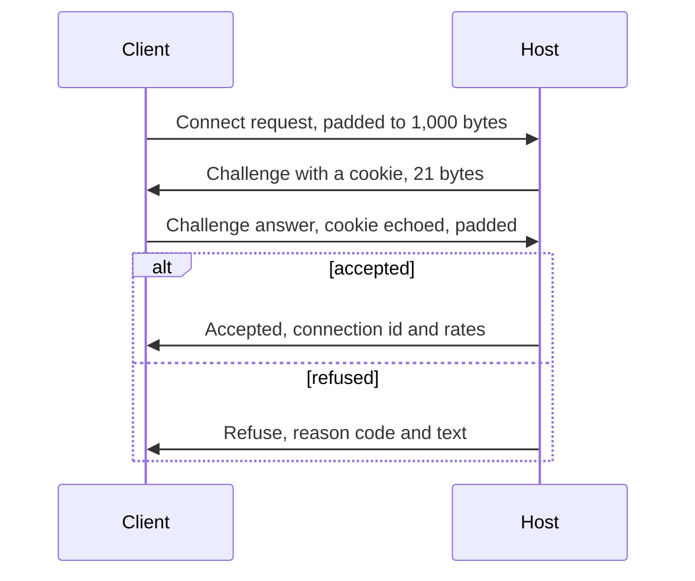
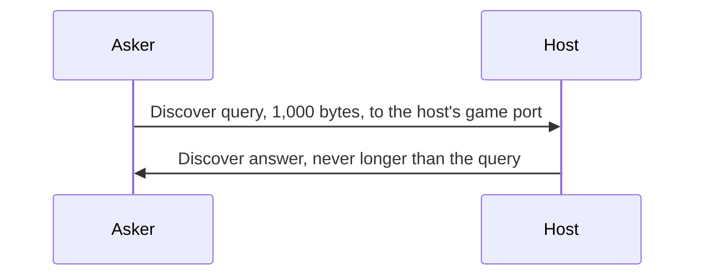

# Network wire protocol

> **T.O.R.E: Tasteful Opinionated Reverse Engineered.**
> The thing being reverse engineered is the *experience*, not the executable. We
> trace what a player does and what the game does back, down to the numbers they
> would notice. How the original code achieved it is history: useful evidence,
> never a blueprint. If a sentence below reads like an instruction to reproduce
> the original's internals, it is out of date.
> <!-- tore-header v2 -->

Design of 2026-09-30 for stage D of the [multiplayer plan](../multiplayer-plan.md#stages),
reviewed by John the same day. The transport, from [Overview](#overview) to
[Reliable messages](#reliable-messages), is built in `tore-net` (slice D2; [what
the build settled](#what-the-transport-settled)); the game's sections and
messages, from [Inputs](#inputs) on, are built in `tore-session`'s `wire`
module (slice D6; [what the build settled](#what-the-games-sections-settled)),
the cockpit readout's coding included. This is T.O.R.E's own
protocol. Fighters Anthology's wire format is unknown
([retail spec](../spec/multiplayer.md)) and nothing here tries to match it.
Every choice below is an agent decision unless it is credited to John. How the
host and the client use these messages is in the
[architecture guide](../ARCHITECTURE.md#network-sessions); the rates, delays and
limits a player notices are in the [netcode numbers](../MULTIPLAYER.md#netcode-numbers).

## Contents

- [Overview](#overview)
- [Packets](#packets)
- [Connecting](#connecting)
- [Keepalive](#keepalive)
- [Discovery](#discovery)
- [Through the master (stages I and J)](#through-the-master-stages-i-and-j)
- [Acknowledgements and round trip](#acknowledgements-and-round-trip)
- [Reliable messages](#reliable-messages)
- [What the transport settled](#what-the-transport-settled)
- [Inputs](#inputs)
- [Snapshots](#snapshots)
- [Events](#events)
- [Data link (stage G)](#data-link-stage-g)
- [Quantization](#quantization)
- [What the game's sections settled](#what-the-games-sections-settled)
- [Phase 2: the King's settings, revival, scores and observers](#phase-2-the-kings-settings-revival-scores-and-observers) (designed)
- [Compatibility (stage L)](#compatibility-stage-l) (designed)
- [Limits](#limits)
- [Captures](#captures)
- [Versions](#versions)
- [Security](#security)

## Overview

- **UDP, one port.** A server listens on one UDP port, 26900 by default (a
  setting; not checked against the IANA registry). IPv4 and IPv6 both work
  when the address is given; finding each other across the internet is
  stages I and J ([through the master](#through-the-master-stages-i-and-j)).
- **Small packets.** Every datagram carries at most 1,200 bytes, under the
  smallest common path limits, so nothing is ever fragmented by the network.
- **Every packet stands alone.** A snapshot is coded against states the
  client has already acknowledged, never against a packet that might be lost,
  so a client decodes each packet it receives whatever happened to the others.
- **Bits, little end first.** Fields are packed with `tore-codec`: bits are
  written least significant first into bytes in order. Section bodies start on
  a byte boundary.
- **Four channels in one packet.** Unreliable state (snapshots and inputs),
  events repeated until acknowledged, reliable ordered messages, and the
  header's acknowledgements, which every packet carries.
- **Time is ticks.** Every time on the wire is a host tick (1/120 s) as an
  unsigned 32-bit number, which wraps after 414 days.

## Packets

Every packet starts with a byte-aligned header:

| Field | Size | Meaning |
| --- | --- | --- |
| Checksum | 32 bits | CRC-32 (IEEE) over the protocol id followed by every byte after this field, least significant byte first |
| Kind | 8 bits | One of the kinds below |

The protocol id is not sent. It is the 8 bytes `TORE-NET` followed by the
protocol version as 16 bits, so a packet from another program or another
version fails its checksum and is dropped silently. The kinds a
different version must still read, Connect request, Refuse and the two
discovery kinds, use the fixed id `TORE-HELLO` instead, which carries no
version.

| Kind | Name | Direction | Checksum id |
| --- | --- | --- | --- |
| 1 | Connect request | client to host | `TORE-HELLO` |
| 2 | Challenge | host to client | versioned |
| 3 | Challenge answer | client to host | versioned |
| 4 | Accepted | host to client | versioned |
| 5 | Refuse | host to client | `TORE-HELLO` |
| 6 | Payload | both | versioned |
| 7 | Disconnect | both | versioned |
| 8 | Discover query | anyone to a host | `TORE-HELLO` |
| 9 | Discover answer | host to the asker | `TORE-HELLO` |
| 10 | [Keepalive](#keepalive) (protocol 5) | client to host | versioned |
| 11 | [Punch](#punch) (protocol 9) | host to client | versioned |

A **Payload** packet, the only kind once connected, continues:

| Field | Size | Meaning |
| --- | --- | --- |
| Connection id | 32 bits | The number the host gave in Accepted; a packet with another number is dropped |
| Sequence | 16 bits | This packet's number in its direction, wrapping |
| Ack | 16 bits | The newest sequence received from the other side |
| Ack bits | 32 bits | Bit i set: sequence `ack - 1 - i` was received |
| Ack delay | 16 bits | Time from receiving `ack` to sending this packet, in units of 16 microseconds (at most 65,534 units, about 1 s); 65,535 means nothing has been received yet, and the ack and ack bits mean nothing (agent decision, D2) |
| Sections | rest | Each: kind 8 bits, length 16 bits (bytes), body |

The payload header is 19 bytes with the checksum and kind. Section kinds:

| Section | Kind | Direction |
| --- | --- | --- |
| [Messages](#reliable-messages) | 1 | both |
| [Inputs](#inputs) | 2 | client to host |
| [Snapshot](#snapshots) | 3 | host to client |
| [Events](#events) | 4 | host to client |
| [Own state](#the-own-aircraft) | 5 | host to client |

An empty Payload is a keepalive while a side's loop runs; a joined game
whose loop is stalled sends the [Keepalive](#keepalive) packet instead. A section of an unknown kind, a second
Messages section, a length that runs past the packet, an acknowledgement of a
sequence never sent, or a body that fails its own checks drops the whole
packet, unacknowledged; such packets are counted, and 50 of them within 5 seconds from one
connection end it.

## Connecting

The handshake keeps the host from holding any state, or sending more bytes
than it received, before a client proves it can receive at its address.

| Packet | Fields |
| --- | --- |
| Connect request | protocol version (16), client nonce (64), game version (string), game commit (string), zero padding to 1,000 bytes. The version and the nonce come first and never move, so a host of any version can refuse with the nonce |
| Challenge | client nonce (64), cookie (64); 21 bytes |
| Challenge answer | client nonce (64), cookie (64), callsign (string, 1 to 15 printable ASCII characters), password (string, may be empty), game version and game commit again (the host kept nothing from the request), platform (8, protocol 7), [path](#the-path-in-the-challenge-answer) (8, protocol 9), zero padding to 1,000 bytes |
| Accepted | client nonce (64), connection id (32, random, never 0), session id (64), ticks per second (8, always 120), ticks per snapshot (8, 4 by default), host tick now (32); 31 bytes |
| Refuse | client nonce (64), reason (8), text (string, up to 200 bytes) |
| Disconnect | connection id (32), reason (8); sent three times at once; 10 bytes |

A request or answer that is not exactly 1,000 bytes, or whose padding is not
zero, is dropped. Accepted and Refuse carry the client's nonce, and the client
takes neither without it, so a stranger who cannot see the traffic cannot
refuse or misdirect a join; the game version and commit are repeated in the
answer because the host's accept decision needs them and it keeps no state
between the two (agent decisions, D2, which also moved the nonce ahead of the
strings).

The **platform** byte names the operating system the player's game runs on:
0 unknown (a build for another system), 1 Windows, 2 macOS, 3 Linux. A game
sends the system it was built for. The host keeps it with the player and
sends it in the [lobby's player list](#messages-as-built), so a lobby can
show it beside the callsign (John's request, 2026-10-05). Any other code
makes the answer malformed, and it is dropped. The host only shows the
platform; nothing in the session depends on it. Its byte, its codes and the
lobby's 3 bits are agent decisions. With a callsign of `c` bytes, a password
of `p`, a game version of `v` and a commit of `m`, the byte is at offset
`25 + c + p + v + m` of the packet (checksum 4, kind 1, nonce 8, cookie 8 and
the four strings' length bytes), and zero padding follows it.

The **cookie** is a keyed hash of the client's address and port, its nonce
and the current 10-second time slot, with a key drawn at host start from the
standard library's randomly seeded hasher. The host accepts the current and
the previous slot. It keeps no record of a client until a Challenge answer
with a good cookie arrives. A repeated Challenge answer from the same address
and nonce gets the same Accepted again, never a second connection. A good
answer with a new nonce from an address that already has a connection replaces
it: the game restarted on the same port (agent decision, D2). The
connection id is drawn the same way as the cookie's key. A callsign already in
use gets a suffix (`Viper_2`), shortened first if the whole would pass 15
characters.

A client resends its current step every 250 ms and gives up after 10 seconds
("no answer from the server"). The host answers at most 20 connect requests
and answers a second from one IP address and 200 in all, counted per whole
second of its clock.

**Refusal reasons**, each with a plain-language text the client shows:

| Code | Reason |
| --- | --- |
| 1 | Different protocol version (the text names both) |
| 2 | Different game build (see [versions](#versions)) |
| 3 | Server full |
| 4 | Wrong password |
| 5 | The server is shutting down or restarting the mission |
| 6 | Kicked |

A client whose own retail stall-speed switch is on refuses to connect before
sending anything, and a server refuses to start with it, so that switch never
needs a code.

The content check happens after the mission loads, as a reliable message
(below), because only then can the client compare.

**Disconnect reasons** (the codes are an agent decision, D2): 1 the player
left, 2 timeout (5 seconds without a valid packet, a
[Keepalive](#keepalive) included; a host may exempt a
connection, as a hosting game exempts its own player's over the in-process
link, EF4), 3 too many bad packets,
4 protocol error (a message ahead of its window, or fragments that do not fit
together), 5 content mismatch, 6 server stopping, 7 kicked.

## Keepalive

*Built (EF-K), protocol 5; agent decisions unless credited.* A joined game's
loop can stop for longer than the 5-second timeout without the game being
gone: a window dragged on Windows, a long frame, a screenshot on a loaded
machine ([what stalls it, by platform](../ARCHITECTURE.md#a-stalled-game-stays-connected-ef-k)).
While it is stopped, a small thread of the game speaks for it.

| Field | Size | Meaning |
| --- | --- | --- |
| Checksum | 32 bits | As every packet, under the versioned id |
| Kind | 8 bits | 10 |
| Connection id | 32 bits | The number the host gave in Accepted |

Nine bytes, smaller than the empty Payload (19 bytes) it stands in for.

- **Who sends it.** Only a game joined over UDP, from a thread that holds a
  clone of the game's own socket, so it comes from the connection's address.
  The thread sends it once the game's loop has not taken a turn for 1
  second, then once a second, and never once the loop has not turned for 60
  seconds (the bound): a game that is truly hung still times out, 5 seconds
  after its last keepalive. The thread only sends this one packet; it never
  reads the socket or touches the client's state, and it stops when the
  connection closes or the session ends. The hosting game's own connection
  has none: it is exempt from the timeout (EF4).
- **What the host does.** A Keepalive from the connection's own address with
  its own id counts as hearing from the connection: no acknowledgement, no
  round trip, no rate statistic, no answer. The first since the game's last
  Payload tells the host's session the game has stalled, which flies the
  seat neutral and logs it (the
  [stall rule](../ARCHITECTURE.md#a-stalled-game-stays-connected-ef-k)). One from any
  other address is counted as from an unknown address, one with another id as
  stale, one of another version fails its checksum, and none of them keeps
  anything alive. A host before protocol 5 drops the kind as invalid, but
  versions must match to join anyway.
- **A client** that receives one counts it as unexpected.

## Discovery

*Built (EF5).* Any host answers "who is hosting here?", whether or not the
asker can join it: the game's Direct Connection screen asks the local network
this way and lists what answers. The two packets are transport packets, not
the session's reliable messages. They sit under the fixed `TORE-HELLO` id,
so a host of any later build still reads the query and answers, and a game
of another build still reads the answer and lists the host marked as another
version. They never change under this protocol or any later one: a different
layout is a different kind. They therefore have a golden file of their own,
`crates/tore-net/discover-golden.txt`, outside the protocol version's
(agent decision); the test `discover_golden` compares it. A host of a build
from before slice EF5 drops a query silently, as it drops any kind it has no
name for (an invalid packet, counted and never answered).

| Packet | Fields |
| --- | --- |
| Discover query | asker's protocol version (16), asker's nonce (64), zero padding to exactly 1,000 bytes. The padding must be zero when the asker's version is the host's; another version may put fields in it, which this build ignores |
| Discover answer | nonce (64, the query's), protocol version (16, the host's), flags (8), players (8), capacity (8), session id (64), game version, game commit, game name, mission summary, King's callsign (each a string), count (8), then that many callsigns (strings) |

The answer's flags, from the least significant bit: password needed, full (no
place for another player), the callsign list is truncated, then two bits of
phase (0 lobby, 1 flying, 2 closed: the mission has ended or the host is
stopping, and joins are refused), then three zero bits. The summary is
`MissionSpec::summary()`, one line (theater, weather, start, the two sides);
the King is the callsign of the player who may change the mission, empty on a
dedicated server; the callsigns are the connected players in the order they
joined; the session id names one game across the addresses it answers from.
Texts are cut to fit: build texts to 64 bytes, the name to 64, the summary to
200, the King to 15 (the callsign limit).

**The size rule.** No answer is ever longer than its query, whatever the
lobby holds: a query is exactly 1,000 bytes and the host fits its answer to
that. The fixed part of the answer is at most about 440 bytes with every text
at its limit, and the callsigns follow while they fit (the largest lobby,
30 callsigns of 15 characters, takes 480 bytes more, which fits); a list that
would not fit is cut from the end and the answer says so in the truncated flag.
An answer that still does not fit is not sent. A spoofed query therefore
gains nothing by size, as with the handshake's Challenge.

**Who answers.** The host's game port answers, in every phase, from the
lobby's state: a player-hosted game and a dedicated server alike, in the lobby,
flying and after the mission, until the host stops. The host's transport reads a
query, rate-limits it by source address (20 a second per address and 200 in
all, the connect limits but counted apart so a flood of queries cannot take the
joins' allowance, an agent decision) and hands it to the session, which fills
in the answer from its lobby state and queues it for the asker.

**Where it is asked.** A game looks for others by sending a query every two
seconds to the limited broadcast address (255.255.255.255) on the game port, to
this machine's own network address and to its loopback address, and listens
for answers on the same socket, which is bound to the game port when that is
free (so one firewall rule covers everything). Discovery is IPv4 only; IPv6 discovery, port
mapping and the internet are stage J. A host on an IPv6 socket that also takes
IPv4 receives IPv4 broadcast on Linux and macOS (checked on this machine with
a query to the loopback network's broadcast address, which a firewall leaves
alone, and on the Linux and macos-14 CI runners with one to 255.255.255.255);
Windows, whose IPv6 sockets are IPv6 only, gets an IPv4 socket beside it from
the server's socket code, and that socket takes the broadcast (checked on the
Windows CI runner, EF-X;
[each system's sockets](../ARCHITECTURE.md#the-game-port-on-each-system-ef-x)). A machine's firewall may drop incoming broadcast on its real network
interfaces: on the development machine (ufw active) a broadcast to its own
interface never reached its own sockets, and a Windows firewall asks on first
run
([the dedicated server's note](../DEDICATED-SERVER.md#discovery-and-the-firewall)).
Join by address always works without it.

## Through the master (stages I and J)

*Design of 2026-10-05 for stages I and J; agent proposals awaiting John's
review. Built (J2, 2026-10-05, protocol 9):* the Punch, joining from several
addresses at once and the path byte. *Built (J3, 2026-10-05):* the relayed
addresses, with no change to the game's protocol.
What the game's own transport needs so that players can find and reach each
other across the internet. What is said to the master itself
is its own protocol, [master-protocol.md](master-protocol.md); how the pieces
fit together is in the
[architecture guide](../ARCHITECTURE.md#master-server-and-connectivity).

**Master packets never reach the transport.** A host's game port, and the
socket a player joins from, also talk to the master. The game routes every
datagram from the master's addresses to its master code before the
transport reads anything, and sends the master code's datagrams on the same
socket. Were one to reach the transport it would fail the checksum (its id
is `TORE-MASTER`) and be counted as invalid, nothing more.

### Punch

| Field | Size | Meaning |
| --- | --- | --- |
| Checksum | 32 bits | As every packet, under the versioned id |
| Kind | 8 bits | 11 |
| Introduction id | 64 bits | The id the master gave the introduction |

Thirteen bytes, sent by a host to each address of a player the master
introduced, five times 200 ms apart. Its job is to leave the host's router:
going out, it opens the router's mapping for the player's address, so the
player's Connect requests get in. A player's game that is connecting with
that introduction id and receives a Punch from an address it was not told
about adds that address to the ones it tries (the host's router chose
another outside port for the player than for the master). Any other Punch is
counted as unexpected. It is under the versioned id: the master introduces a
player only to a host of the same build.

*As built (J2, agent decisions):* the host's rendezvous sends the punches
itself, on the game port beside its master datagrams: it knows the game's
protocol version from the build it lists, so neither host loop changes and
there is no `Server::punch`. A Meet repeated for an introduction already met
is acknowledged again and never punched again, so an address gets at most
five punches per introduction. Port 0, unspecified and relayed addresses are
never punched. A joining client that receives a Punch with its introduction
id from an address it already tries, or after its race has chosen, ignores
it (the host's five punches outlast most races); one with another id, or to
a join with no introduction, is counted as unexpected; a host counts any
Punch it receives as unexpected.

### Joining from several addresses at once

A player's game told several addresses for one host (its address as the
master saw it, a port its router mapped, its IPv6 address, its local network
address) tries them all at once. `Client::connect` takes one address; stage J
adds `Client::connect_any`, which sends the same Connect request, same nonce,
to every address every 250 ms. The first Challenge or Refuse that carries
the nonce chooses the address, and from then on the client is the ordinary
client of that one address; datagrams from the others are counted as from an
unknown address. The host is unchanged: each request gets a stateless
Challenge, and only the Challenge answer the client sends to the chosen
address starts a connection. Four addresses cost at most 16 KB/s of
requests. The client still gives up after 10 seconds; the game asks the
master for the relay after 3 seconds with no answer
([master protocol](master-protocol.md#relay)).

*As built (J2):* `Client::connect_any(config, targets, introduction, now)`
takes `Target`s, each an address and the [path](#the-path-in-the-challenge-answer)
a join there takes; `Client::connect` is the race of one typed address. Agent
decisions: a race tries at most 12 addresses, the master's (at most 8) and
up to four learned from punches; an address given twice counts once; an
IPv4 sender that a dual-stack socket reports as its IPv4-mapped IPv6 address
is the same sender, here and once connected. Before the race chooses, a
datagram from an address it does not try is counted as from an unknown
address, as after.

### Relayed addresses

Through the relay, each end's transport sees the other at a reserved address
that stands for the relay channel, as the in-process link's peer is
`LINK_ADDRESS`, `[100::]:0` ([the link](../ARCHITECTURE.md#the-host-inside-the-game-stage-e)):
`[100::1:HHHH:LLLL]:0`, where `HHHH:LLLL` is the 32-bit channel number. The
whole `100::/64` prefix is reserved: it is in the IPv6 discard-only prefix
and uses port 0, which no UDP sender can have, and a datagram from a real
socket that claims any address in it is dropped and counted.

- A datagram the transport sends to a relayed address goes to the master as
  a Relay frame of that channel; a Relay frame from the master comes back as
  a datagram from that address. The game's datagram is unchanged inside the
  frame and stays at most 1,200 bytes.
- The handshake, its cookies and rate limits, the reliable messages, the
  5-second timeout and the [Keepalive](#keepalive) work as with any address.
  A stalled relayed game's keepalive thread sends through a wrapper that
  frames for the channel, so the host hears it from the channel's address.
- A host knows a relayed player by the address. Stage K never calculates a
  relayed host (John, 2026-09-28: relayed peers are never the calculated
  host).

*As built (J3):* both ends' routers (`tore_net::master::routed`) do the
wrapping, and `relayed_address` and `channel_of` turn a channel into its
address and back. Only `[100::1:HHHH:LLLL]:0` stands for a channel; the
rest of the prefix is never handed out. A joining player connects to the
relayed address with an ordinary `Client::connect`, so the path reads
"relay" at both ends. The keepalive thread's wrapper is
`tore_net::master::RelayFraming`, over a clone of the joining socket
(`ServerSocket::try_clone`).

### The path in the Challenge answer

*Protocol 9 (slice J2).* One byte after the platform byte: how
the player reached the host, the codes the master's
[reports](master-protocol.md#reports) use: 0 local network, 1 by address, 2
mapped port, 3 IPv6, 4 punched, 5 relay. Any other code makes the answer
malformed. The host keeps it with the player, and a later protocol version
puts it in the lobby's player list (3 bits) so every player sees it. A host
takes a relayed address as relay whatever the byte says.

| The address the race chose | Path |
| --- | --- |
| A private address (10/8, 172.16/12, 192.168/16, a link-local address, an IPv6 ULA; the carriers' 100.64/10 is not one), from the Direct Connection list, typed, or the host's Local candidate | 0 local network |
| Typed on Direct Connection, or `--connect`, not on the local network | 1 by address |
| The host's Mapped candidate | 2 mapped port |
| The host's Global IPv6 candidate | 3 IPv6 |
| The host's address as the master saw it | 4 punched: the game cannot tell a punched hole from a port the host forwarded by hand, so both read "punched". *Agent decision (J2):* a seen address that is also the host's own Mapped or Global IPv6 candidate reads as that one, 2 or 3 |
| An address a Punch taught the race | 4 punched |
| A relayed address | 5 relay |

*As built (J2):* the host's transport puts the path in its join details
(`ConnectDetails::path`), a relayed address as the relay whatever the byte
says. Nothing shows it yet: the lobby's player list carries it from slice J6,
and a host's Report still counts its players by their addresses
(`rendezvous::path_of`) until the hosts keep each player's path.

**Discovery stays IPv4.** *Agent proposal:* local networks carry IPv4
broadcast, and the master covers the internet, so the game does not look for
games on IPv6 multicast.

## Acknowledgements and round trip

- Sequences are compared the wrapping way: `a` is newer than `b` when
  `a - b` taken modulo 65,536 is between 1 and 32,767.
- Every packet acknowledges the newest sequence received and the 32 before it.
  A sent packet is **delivered** when an acknowledgement names it and **lost**
  when 33 newer packets are acknowledged without it. A packet already received,
  or more than 32 behind the newest, is dropped unread: it could not be
  acknowledged.
- **Round trip.** When an acknowledgement names a new newest packet, the
  sample is `now - (time that packet was sent) - ack delay`. It is smoothed as
  TCP does (gain 1/8 for the mean, 1/4 for the mean deviation). Before the
  first sample it is taken as 250 ms; a client whose Challenge answer went out
  once takes the wait for Accepted as its first sample (agent decisions, D2).
  Under reordering the estimate runs a little low, since the newest packet,
  the only one whose delay comes back, is more often a fast one: readings of
  286 to 306 ms, most below 300, on a 300 ms path with arrivals spread by
  plus or minus 15 ms (20 seeds).
- **Loss** is lost over lost plus delivered, over the last 5 seconds.
- **Arrival spread** is measured on snapshot packets (host to client) and on
  input packets (client to host) from the tick each carries, in the manner of
  RFC 3550's interarrival jitter. The transport does not read ticks: the
  session gives it each packet's send time, from its tick, and arrival time.
- Each side sends at least 10 packets a second while its loop runs; with
  nothing else to say it sends an empty Payload. A joined game whose loop is
  stalled sends a [Keepalive](#keepalive) once a second instead.

## Reliable messages

For what must arrive once and in order: the mission, seating, the roster, the
debrief, leaving, (protocol 3) the lobby and (protocol 4) chat.

- Each message has a 16-bit id, counting up from 0 in each direction, a kind
  (8 bits) and a body of at most 256 bytes.
- The sender keeps unacknowledged messages in a window of 256. A message goes
  into a packet's Messages section when it has never been sent or was last sent
  more than `max(1.25 × round trip, 30 ms)` ago. The packet remembers which
  messages it carried; when the packet is delivered, they are acknowledged.
- The receiver hands messages over in id order, holds early ones within the
  window and drops duplicates. An id 256 or more ahead of the next one to hand
  over is a protocol error. An id behind it is a duplicate however far back,
  since a packet that waited on the way can carry an id the sender's window has
  since left far behind (32 packets carry at most 8,160 new ids, so no real
  duplicate is 32,768 back).
- **Large messages** (the mission, the seated state, the roster, the debrief)
  are split into fragments of up to 256 bytes, each its own message; the first
  carries the total length in its record header (at most 64 KB, which the
  window of 256 holds whole). Ordered delivery puts them back together.
- During flight the Messages section takes at most 256 bytes of a snapshot
  packet, and before seating it may fill the packet. The budget is the
  session's per connection; the first due message goes whenever it fits the
  packet, even past the budget, so a whole fragment always moves and
  snapshots keep flowing.

**Message kinds:**

| Kind | Direction | Body |
| --- | --- | --- |
| Mission | host to client | The `MissionSpec` in its text form, the content manifest (resource names and their FNV-1a 64 hashes), the host tick now, the contrail sortie number, and the lobby mission's number (protocol 3) |
| Content refused | client to host | The mission's number, the resource names whose hash differs or which are missing, and the plain reason; in protocol 3 the player stays in the lobby, marked unable (before, the host disconnected with "content mismatch") |
| Take plane (stage D's Ready) | client to host | The mission's number and the plane wanted, or any: in the lobby, hold that slot and mark ready; in flight, fly it now |
| Seat refused | host to client | Reason text (plane taken, destroyed, lost its pilot, not open to humans, no free plane); the client may ask again |
| Seated | host to client | The connection's new [flight](#flights) (protocol 3), seat id, plane id, the tick of the state, the plane's exact state ([own aircraft](#the-own-aircraft)), its loadout (station weapon names, counts, mounts), the full roster, the standing and destroyed ground objects |
| Roster | host to client | Every plane: id, side, wing, member, aircraft key, pilot (AI, or a human's seat and callsign); sent on every change |
| Names | host to client | The [flight](#flights) whose table they extend (protocol 3), and new entries of the connection's name table: weapon records, shapes and sound names used by snapshots and events |
| Notice | host to client | A line of text for the HUD, for example "Mission restarts in 30 seconds" |
| Leave | client to host | The player ends its flight: the debrief, then back in the lobby, still connected (protocol 3; before, the host disconnected the player) |
| Debrief | host to client | The seat's debrief report as the single-player debrief shows it |
| Mission ended | host to client | Why (every human left, time limit, server stopping, ended by the server's operator or the King, the host left the game) and seconds until the next mission, if any; with a next mission the player stays, back in the lobby, otherwise the host disconnects the player once it and the debrief are acknowledged |

The lobby's messages, protocol 3 ([the lobby](../ARCHITECTURE.md#the-lobby)):

| Kind | Direction | Body |
| --- | --- | --- |
| Slot | client to host | The mission's number, and take a plane's slot, take the first free one, or leave it |
| Loadout | client to host | The mission's number, the slot's plane, and the loadout for it or none (the standard load) |
| Set ready | client to host | The mission's number, and ready or not |
| Change mission | client to host, the King | The new `MissionSpec` text |
| Start | client to host, the King | Nothing |
| Kick | client to host, the King | The player's lobby id and the reason the player is told |
| End mission | client to host, the King | Nothing: the mission ends for everyone, who return to the lobby |
| Lobby | host to client | The lobby's state, sent to every player whenever it changes |
| Refused | host to client | The refused request's message kind and the plain reason |
| Goodbye | host to client | Why the host is about to disconnect the player: kicked (with the King's words) or the host left the game |
| Flight loadouts | host to client | The mission starts flying: each loaded plane and its loadout, which every player builds the lobby's mission again with, and the content manifest entries they add, which the player checks |

Chat's messages, protocol 4 ([chat](../ARCHITECTURE.md#chat)):

| Kind | Direction | Body |
| --- | --- | --- |
| Chat send (25) | client to host | The receiver (All, Friendlies, Enemies, Wing or Target), the line's text and, for one of `CHAT.TXT`'s quick messages, its number (1 to 12) and sound |
| Chat line (26) | host to client | A delivered line: the sender's callsign and where the sender stands to the reader (no side, the reader's side, the other side), whether it is the reader's own line sent back, the receiver, the text and a quick message's sound; or the host's words alone (a refusal, or that no one heard) |

## What the transport settled

Details slice D2 (`crates/tore-net`) decided where the design left them open.
Each is an agent decision unless it says otherwise.

**The Messages section** (kind 1) is bit packed: a record count (8 bits, 1 to
255), then each record, then zero bits to the byte boundary.

| Field | Bits | Present |
| --- | --- | --- |
| Id | 16 | always |
| Part | 2 | always: 0 a whole message, 1 the first fragment, 2 a later fragment |
| Kind | 8 | whole message and first fragment |
| Total length less one | 16 | first fragment only; the total is 257 to 65,536 bytes |
| Body length | 9 | always: a whole message 0 to 256, a first fragment exactly 256, a later one 1 to 256 |
| Body | 8 a byte | always |

**Who decides what.** The host refuses a different protocol version (code 1)
and, past its connection limit (a setting, default 30), "server full" (code 3)
by itself. Every other decision goes to the session through one call with the
join's details (address, versions, build, callsign, password), which accepts
with the session id, rates and tick, or refuses with a code and text. Making
a callsign unique is the session's job. The session also checks its own
sections before anything in a packet is applied: a section it rejects drops
the whole packet unacknowledged and counts it as bad, so nothing the session
could not read is ever treated as delivered.

**Pace and limits.**

- A packet of due messages alone goes out at most 120 times a second; the
  session's own packets carry messages too. Without the pace a burst of
  messages sent every millisecond let packets be overtaken by more than 32
  newer ones and dropped as too old on a 300 ms path.
- A sender queues at most 8,192 messages, fragments counted one each (2 MB);
  past that, sending is refused and the session waits.
- One read of a socket takes at most 1,024 datagrams, so a flood cannot hold
  the host's loop.
- A Disconnect's three copies go out together.

**Events.** Every Payload a side sends is reported back as delivered or lost
by its sequence, which the snapshot baselines and the event queue need.
Every connection that ends, and every join that fails, reports exactly one
reason: no answer, refused with its code and text, disconnected with its
reason and whether the other side said so, or (on the host) replaced.

**Time and randomness.** Nothing in the transport reads a clock: the caller
passes the time in, which lets the simulator run faster than real time. A real
endpoint draws its nonce, connection ids and cookie key from the standard
library's randomly seeded hasher, each value from a fresh one; tests and the
simulator can seed them instead, which makes a whole session repeat exactly.

**The simulator** joins in-process endpoints by one-way links with a latency,
arrivals spread uniformly within plus or minus a width (reordering follows),
loss, duplication and optional burst loss (two states, good and bad), on a
virtual clock. It can record every datagram with its fate and arrival times.
Routers can stand between endpoints: address translation with each of RFC
4787's mapping and filtering behaviours, nested routers and IPv6 firewalls
([the NAT simulator](../ARCHITECTURE.md#the-nat-simulator)).

## Inputs

The Inputs section carries the player's controls for recent ticks. The client
sends one input packet per rendered frame that stepped at least one tick, at
most 60 a second, and each repeats every tick the host has not acknowledged,
up to 24 ticks (200 ms). A tick's input is lost only when every packet that
carried it is lost.

| Field | Size | Meaning |
| --- | --- | --- |
| Flight | 8 | The connection's [flight](#flights) these inputs fly, the number the Seated message gave; the host drops inputs of another flight (protocol 3) |
| Newest tick | 32 | The last tick in this section |
| Tick count | 5 | How many ticks follow, 1 to 24, oldest first, ending at the newest |
| View offset | 8 | The host tick the player's screen showed when the newest tick was sampled, as ticks before the newest; used for [lag compensation](../ARCHITECTURE.md#hits-and-lag-compensation) |
| Interpolation delay | 6 | The client's interpolation delay in ticks, which bounds the rewind's cap |
| View subject | 1, then 2 and a varint | Whether the player's view follows another entity (target, wing, external or fly-by view), then its kind and id; the host sends that entity at the full rate. *Built (D6):* the id is a varint, since projectile numbers pass 65,535 in a long mission |
| Mismatch | 32 | The newest snapshot tick whose own-state hash differed from the client's own, or 0 |
| Per tick | | The first tick in full, each later one as a "same as the tick before" bit or its changed fields ([settled](#inputs-as-built)) |
| Commands | | The unacknowledged commands, below ([settled](#inputs-as-built)) |

A tick's continuous controls:

| Control | Coding |
| --- | --- |
| Pitch, roll, yaw | 16 bits each: the value in -1 to 1 times 32,767, rounded |
| Throttle rate | 8 bits: -1 to 1 times 127 |
| Throttle position | 1 bit present, then 16 bits: 0 to 1 times 65,535 |
| Trigger | 1 bit |
| Scope controls | 1 bit changed, then channel (2), range step (4), contact history (1) |

The client rounds its own controls to these steps before its prediction steps
them, so the host and the client step identical numbers. Single player never
rounds.

**Commands** are what a player does once: every `SeatCommand` (weapon
selection, designation, arming, chaff and flares, the trigger key, tower
requests, radio silence, wing orders) and every pilot command (eject, the gear,
flaps, brake, hook, bay, engine, burner, radar, jammer and autopilot switches,
throttle presses). Each has a 16-bit command number, the tick at which the
client applied it in its own prediction, and its coded form. They repeat in
every input packet until the host acknowledges them in a snapshot; the host
applies each exactly once, in number order, at its tick, or on the next tick
if that one is already stepped. A toggle therefore never toggles twice.

## Snapshots

One Snapshot section per snapshot packet, 30 a second by default. The host
shares the 1,200 bytes so that the entities always keep their place: after the
headers (55 bytes: the payload header, three section headers and a snapshot
header of at most 21), the cockpit readout takes up to 200 bytes, the events
up to 150 and the messages up to 256, and the entities get the rest, at least
545 bytes; whatever one section leaves unused goes to the entities, and the
events may use what the entities leave ([settled](#snapshots-as-built)). The
exact own state, when due, travels in a second packet. *Agent decision (D10
follow-up):* a connection's snapshot ticks are the ticks whose number modulo
the ticks per snapshot equals its seat number modulo the same, so the seats
share the interval's ticks; the Seated message's seat tells the client its
phase, and baselines (counted in snapshots back) are unaffected.

### Header

| Field | Size | Meaning |
| --- | --- | --- |
| Flight | 8 | The connection's [flight](#flights) the snapshot belongs to (protocol 3); the Events section in the same packet shares it |
| Tick | 32 | The host tick the snapshot shows (after that tick's step) |
| Input received | 32 | The newest input tick received from this player |
| Input margin | 8, signed | Over the inputs received since the last snapshot, the smallest number of ticks by which one arrived before the host needed it; negative when late |
| Inputs repeated | 8 | Ticks since the last snapshot for which the host had no input and repeated the last one |
| Commands applied | 16 | The highest command number applied, all before it applied too |
| Own state hash | 64 | FNV-1a 64 of the player's plane's exact state at this tick, as the exact coder writes it; absent before seating |

### The own aircraft

The player's plane's **exact state** is what the client's prediction needs to
match the host bit for bit: the flight state, the cockpit's turbulence state
and random stream, and the ownship terms the per-plane step reads (the
subsystem hit counts, the sensor and jammer failures, the stores' weight,
whether a release holds the bay open, hit points, the broken section and the
damage in each section; the full list is in the
[architecture](../ARCHITECTURE.md#one-step-for-a-humans-plane)), and the
turn-back and OVERSPEED message clocks.
Every field is coded, the private ones included (the stall scale that depends
on the weight's history, the hybrid model's random state, the systems, the
autopilot, the wreck and the escape), except the write-only trace, the flight
at the start of the tick and the imported tables, which the client already
has ([details](../ARCHITECTURE.md#the-exact-state-of-a-humans-plane)).

Every snapshot carries only its **hash** (in the header). The exact state goes
in an **Own state** section, in its own packet beside the snapshot packet, when:

- the host's tick did something to the plane the client cannot foresee: it
  repeated a missing input, applied a command at another tick than the
  client's, or the plane was hit, jolted by a blast, released a store or had
  its ownship terms change;
- the client's input reported a mismatch; or
- a second has passed since the last one, as a safety net.

Each 64-bit number is coded as the exclusive-or with the same field of a
baseline, with its leading zero bits counted, so an unchanged field costs one
bit and a slowly changing one a few bytes: about 200 to 350 bytes in all
(measured in D4: about 160 to 260 bytes against a state one snapshot back, and
under 500 with no baseline). The
baseline is an earlier exact state the client has acknowledged, named by how
many own states back it was (5 bits, 1 to 31); 0 means no baseline
([settled](#own-state-as-built)). The client decodes it bit for bit. The
section starts with the connection's [flight](#flights) (8 bits, protocol 3),
then its tick (32), its number (16) and how many back its baseline is (5).

### Cockpit readout

The [cockpit readout](../ARCHITECTURE.md#the-flight-screen-draws-a-frame) of
the player's seat, in groups (stores and selection; seeker and tone; weapon
estimates; targets; radar and infrared contacts; visual contacts; map
contacts; RWR emitters and missile records; damage and faults;
countermeasures; airport and NAV; target window; music inputs and mission
result). Each group has a changed bit against the readout of the baseline
snapshot; only changed groups are sent, and lists within a group (contacts,
emitters) are coded entry by entry against the baseline's entry with the same
id. Contact positions are world positions, in whole feet
([as built](#the-cockpit-readout-as-built)).

### Entities

Everything the client draws that moves: aircraft (every plane except the
player's own, human-flown or not), missiles, bombs and rockets in flight,
debris pieces and ejected pilots. Gun rounds are not entities; they arrive as
burst [events](#events). Ground objects do not move; their destruction is an
event.

Each entity record:

| Field | Meaning |
| --- | --- |
| Kind | Aircraft, projectile, debris or pilot. *Built (D6):* records come kind by kind, each kind's count first, so a record carries no kind bits |
| Id | The plane id, projectile number, or the aircraft a debris piece or pilot came from; coded as the difference from the previous record's id of the same kind |
| Removed | 1 bit: the entity is gone; nothing follows |
| Baseline | Snapshots back to the acknowledged state this record is coded against (5 bits); 0 is a full record |
| Fields | Coded against the baseline, below |

**Baselines are per entity.** For every connection the host remembers, for
the last 32 packets it sent, the quantized state it sent for each entity. When
a packet is acknowledged those states become that entity's acknowledged
baseline. A record in a new packet codes against its entity's newest
acknowledged baseline if it is at most 31 snapshots old, else in full. The client
keeps every entity's received states for the last 64 snapshots, since a packet
32 behind the newest can still arrive with records 31 further back. The host
remembers the quantized values it sent, not the exact ones, so both sides hold
the same baseline and rounding never builds up.

**Prediction from the baseline.** Positions are predicted as the baseline's
position plus its velocity times the ticks between, in whole steps with
integer arithmetic only, and only the difference is sent, as a signed
variable-length number of quantization steps. Velocity, attitude and speed
send their difference from the baseline. Slow fields (the other ten animated
devices, engine flags and rates, damage, wreck phase, airborne and crashed)
are sent only when their group changed, behind one bit each.

| Kind | Fields |
| --- | --- |
| Aircraft | Aircraft key on first sight; position, velocity, attitude (yaw, pitch, bank); devices; engine (lit, afterburner, flame, thrust-vectoring rates); damage (hit points of the initial, section damage, structural section); airborne, crashed, wreck phase |
| Projectile | On first sight: owner, weapon and shape (name table), target, whether it is aimed at this player's plane; then position, velocity, direction. *Built (D6):* velocity replaces speed, so that the prediction needs no trigonometry and both ends agree to the step; the speed is its length |
| Debris | On first sight: owner, drawn model and damage variant; then position, velocity, attitude (*built (D6):* with a velocity, from the picture a tick before, for the prediction) |
| Pilot | On first sight: the aircraft it left; then position, velocity, heading, escape phase |

**Priority and relevance.** Each entity has a priority that grows every
snapshot by its relevance weight and resets when it is sent. An entity is due
when its priority reaches the snapshot rate: a near one every snapshot, a far
one twice a second. The host picks due records in priority order until the
entities' space is full, so what cannot fit waits and is sent first next time,
then writes the chosen records in id order, which the id coding needs. The
relevance bands are the [netcode numbers](../MULTIPLAYER.md#netcode-numbers)'
(John, 2026-09-30). A missile aimed at the player is always sent. An entity
that leaves is sent as Removed until that is acknowledged.

**The first snapshot** after Seated has no baselines, and the host queues
events that describe the mission as it stands: every crater and crash-site
fire, every destroyed ground object, and every effect still showing. Smoke and
contrails already in the sky before the player joined are not sent; they
appear as the client's own regeneration starts.

## Events

Things that happen once, for this player or for everyone. Each connection
numbers its events (16 bits). Every snapshot packet repeats, oldest first,
every event the client has not acknowledged, within the events' share of the
packet (150 bytes, and whatever the entities leave); an event's packet being
delivered acknowledges it. Each event carries its tick, as ticks before the
snapshot's tick.

| Event | For | Fields |
| --- | --- | --- |
| Message | the seat | A HUD line |
| Radio | the seat | Route (radio, airport, direct), speaker label, text, recording stems |
| Tower | the seat | A tower recording stem, or cut the tower off |
| Order voice | the seat | The seat's own order call stems |
| Order reply | the seat | What became of a wing order |
| Weapon cycled | the seat | The weapon page turns |
| Release | the seat | Weapon release sound and station |
| Launch | everyone | Shooter, projectile number, weapon: every missile, rocket and bomb launch, so the view rig and the F12 view see a missile that lives less than one snapshot |
| Feedback | the seat | A rumble event |
| Your aircraft exploded | the seat | Which wording ("exploded", "exploded on impact") |
| Wing ejection | everyone | Aircraft, HUD line, friendly |
| Effect | everyone | Kind, position, ticks it shows, explosion type |
| Mark | everyone | Crater or crash-site fire, position |
| Ground destroyed | everyone | Ground object id |
| Countermeasure | everyone | Aircraft, chaff or flare, the release geometry the replay viewer flies it from, number left |
| Gun burst | everyone | Shooter, gun station, first tick, last tick (0 while still firing). *Built (D7a):* sent when the burst starts, and again from its first tick with its length once the station has fired no round for its weapon's round interval plus 2 ticks. *Read by the client (D8c):* it makes the burst's rounds again from the first tick at the weapon's cadence ([the client session](../ARCHITECTURE.md#the-client-session)) |
| Sound | everyone | Emission kind, position, the aircraft it came from |

Recording stems, weapon and sound names are sent by their index in the
connection's name table (the Names message), which the host fills before the
first use. Radio text is sent as it is: the client never composes calls.

## Data link (stage G)

*Designed 2026-10-05, not built* ([architecture](../ARCHITECTURE.md#flight-data-link),
[guide](../DATALINK.md)). What the flight data link adds to the wire, all in
the next protocol version the lead hands out (slice G7). Every choice is an
agent decision unless credited. Nothing of it reaches a client that a human
in the same slot would not see: each part is the seat's own share, computed
by the host.

**Readout parts.** Two groups join the [cockpit readout](#cockpit-readout),
coded like the others (a changed bit each, against the acknowledged
baseline):

| Part | Place | Kind | Fields |
| --- | --- | --- | --- |
| Link | Right after the header, so an assignment is never the part that waits for room | Scalar (signed varints, as the other scalar groups) | The plane's tier (Voice 0, Flight 1, Network 2); the assignment by link: target id plus one (0 for none), the assigner's plane id, acknowledged; the newest sort warning: target id plus one, the other plane's id; whether the seat monitors the battle net |
| Link tracks | After the contacts | List, keyed by target id, at most 24 | Position (whole feet) predicted from velocity (1/4 ft/s), as the contacts; slow fields: source (own, flight, network: 2 bits), lockers (a mask of the flight's member numbers, 8 bits), locked over the battle net (a presence bit and the plane id), assigned to (a mask, 8 bits) |
| Link mates | After the link tracks | List, keyed by plane id, at most 7 | Slow fields only: member number (3 bits), fuel (normal, joker, bingo, fumes, out: 3 bits), weapons (missiles, guns only, Winchester: 2 bits), damage (none, light, heavy: 2 bits) |

Tracks and mates change only on the host's publishing ticks (every thirtieth),
so between them the parts send nothing; locks and assignments change the
masks and the Link scalar the tick they happen. A Voice-tier plane's parts
are empty but for its tier.

**Event.** One new event code, after Sound:

| Event | For | Fields |
| --- | --- | --- |
| Link | the seat, about members of its flight | What (assigned, cleared, acknowledged, lock, unlock, sort warning: 3 bits), the plane (varint), the target (varint), and for assigned the assigner (varint) and the delivery (link or voice, 1 bit) |

Events repeat until acknowledged, so a lock or an assignment reaches the
client in the next snapshot and is never lost; the readout carries the state
it leaves. The sort warning's HUD line and beep are ordinary Message and
Radio events. A captured `Link` event becomes a replay's `datalink` event when
the capture converts.

**Radio events** gain the call's net (1 bit: wing 0, battle 1), so the client
can show `Net` before a battle-net speaker.

**Inputs.** The wing order coding gains Sort (code 13, after Land at selected
airport) and the commands gain Battle net (toggle monitoring, no fields).

**Room.** Estimated at under 40 bytes a snapshot on average for a busy seat
and about 1 KB/s at worst while 24 tracks move; G7 measures it on the 15
against 15 mission against the readout's 200-byte share.

## Quantization

| Quantity | Step | As in replays |
| --- | --- | --- |
| Positions of aircraft, projectiles, debris, pilots, effects, marks, contacts | 1/32 ft | yes |
| Velocities | 1/64 ft/s | yes |
| Attitude of other aircraft, debris; pilot heading | 2^-16 of a turn (0.0055 degrees) | coarser (replays use 2^-20) |
| Projectile direction | 2^-16 of a turn per angle (heading from +z towards +x, then elevation) | coarser |
| Aircraft speed (a device) | 1/4 ft/s | coarser |
| Devices from 0 to 1 | 1/255 | yes |
| Elevator, aileron, rudder | 1/127 | yes |
| Thrust-vectoring rates | 1/4096 rad/s | yes |
| Stick inputs | 1/32,767 | finer (replays use 1/1024) |
| Throttle position | 1/65,535 | finer |
| The own aircraft's flight state | exact | exact |
| Ids, counts, flags, hit points, ticks | exact | yes |

*Built (D6), correcting the design:* a value that cannot be quantized is
clamped, not sent exactly. Not finite is zero, and a position or velocity
beyond 2^40 steps (34 million miles) is held at it; a device level outside its
range is held at its end. The quantized numbers are all both ends ever store,
so a clamped value is simply what the client draws.

## What the game's sections settled

Details slice D6 (`crates/tore-session`, module `wire`) decided where the
design above left them open. Each is an agent decision unless it says
otherwise. Varints are `tore-codec`'s (7 bits a group); a **bucketed** value
is a bucket index then the value in that bucket's width, with the last index
an escape to a varint; strings are a length byte and UTF-8.

### Inputs as built

| Field | Bits |
| --- | --- |
| Newest tick | 32 |
| Tick count | 5, 1 to 24 |
| View offset | 8 |
| Interpolation delay | 6, 0 to 63 |
| View subject | 1, then kind 2 and id varint |
| Mismatch | 32 |
| First tick | pitch, roll, yaw 16 signed each (-32,767 to 32,767); throttle rate 8 signed (-127 to 127); throttle 1, then 16; trigger 1; scope channel 2 (radar, infrared, visual), range step 4 (0 to 5, the scope's six ranges), history 1 |
| Each later tick | 1 bit "same as the tick before"; else 7 change bits (pitch, roll, yaw, throttle rate, throttle, trigger, scope), then each changed value: a stick as its difference from the tick before (bucketed, 4, 8 or 17 bits), the rest as in the first tick; a changed trigger flips and needs no value |
| Command count | 7, 0 to 64 |
| First command number | 16, when there are commands; the rest follow one by one |
| Each command | ticks before the newest (varint), a 5-bit code and its fields |

The command codes cover every `SeatCommand` (a combat command has its own
5-bit code, with a heat byte, a distance or a target id where it has one; a
wing order has a 4-bit code and its break, approach or formation) and every
pilot command (a switch is 4 bits). A reader refuses a change bit whose value
did not change, so every section has one encoding. `quantize_pilot` rounds a
pilot input exactly as the wire does, the throttle commands included (a
position to 1/65,535, a step to 1/32,767, each clamped to its range), and the
client steps what it returns. The host takes the frames and the commands with
their ticks; `InputFrame::seat_input` makes the `SeatInput` of a tick and
`InputsSection::view` the `SeatView` lag compensation reads.

*Settled by the host (D7a):* a client numbers its commands from 1, so a
snapshot header's "commands applied" of 0 means none yet; a command is sent
only once the client's game has reached its tick (a reader refuses a command
after the section's newest tick). Each earlier frame of a section takes the
newest frame's view, as many ticks earlier. The host's buffer rules are in
the [architecture](../ARCHITECTURE.md#the-host-session).

### Snapshots as built

The section is the header (161 bits), one bit for the cockpit readout and,
when it is set, the readout's record ([below](#the-cockpit-readout-as-built)),
then the four kinds in turn
(aircraft, projectiles, debris, pilots): each kind's count as a varint and
its records in id order.

| Record field | Bits |
| --- | --- |
| Id | The first record of a kind: its id; later ones: the id less the previous one less 1. Bucketed unsigned: 2 bits of index, then 0, 4 or 10 bits, or a varint |
| Removed | 1 |
| Baseline | 5: snapshots back, 1 to 31; 0 is a full record |
| Full body | The identity fields; position and velocity as six signed varints; the angles, 16 bits each (aircraft and debris 3, projectiles 2, pilots 1); an aircraft's speed as a signed varint; every slow field |
| Body against a baseline | 1 bit "moved"; if set, the position residuals after the prediction, the velocity, angle and speed differences, each bucketed (position and velocity 3, 6, 10, 14 or 20 bits; angles 3, 6, 9, 12 or 17; speed 3, 6, 10 or 16); then for each group of slow fields a changed bit, and in a changed group a bit per field and each new value |

The identity fields (full records only): an aircraft's type as 1 bit and its
place among the fourteen selectable aircraft (4 bits); a projectile's owner
(varint), weapon (12-bit name index), shape (1 and 12), target (1 and a
varint) and whether it is aimed at this player; a debris piece's owner, the
aircraft whose model draws it (1 and 4) and its damage variant (1 and 3); a
pilot's aircraft. An aircraft's slow groups are its devices (present, six
levels at 1/255, three control surfaces at 1/127, the throttle at 1/255; an
aircraft without devices sends only the present bit), its engine (lit,
afterburner, flame, three rates as signed varints), its damage (hit points,
initial hit points and six sections as signed varints, the structural
section in 3 bits) and its status (airborne, crashed, wreck phase in 2 bits);
a pilot's is its escape phase (3 bits).

- **Records parse without their baseline.** Every field against a baseline
  is a self-delimiting difference or a whole new value, so a client that
  lacks a record's baseline reads past it and uses the rest of the packet.
  The host codes only against states the client acknowledged, so this is a
  safety net; the lossy test never needs it.
- **Baselines by snapshot.** A record names its baseline by snapshots back,
  not by packets, since own state and message packets go between snapshots
  and the host cannot know their numbers before it sends them. The ticks
  between are the snapshots back times the ticks per snapshot, and the
  prediction divides the baseline's velocity steps by 240 per tick with
  integer arithmetic, rounding halves up, so both ends agree to the step. The
  host codes against an entity's newest acknowledged state when the gap is 1
  to 31 whole snapshots and its identity fields match, else in full.
- **Ids.** A debris piece's and an ejected pilot's id is the aircraft it came
  from: each aircraft breaks off at most one piece and ejects at most one
  pilot. The player's own pilot is not sent; its escape is part of its plane's
  exact state.
- **Removals.** The host sends Removed for every entity the client may know
  that is gone, in every snapshot until a packet carrying the removal is
  delivered; one that comes back is sent in full. On the client the newest of
  a state and a removal wins, whatever order packets arrive in.
- **Priority.** Priorities are whole numbers: a near entity adds the snapshot
  rate each snapshot, a far one 2, and an entity is due at the snapshot rate,
  so a far one is due twice a second at every rate (the table's weights, 1
  and 1/15 at 30 a second). An entity the connection has never had is due at
  once. Missiles aimed at the player go first, then removals, then due
  entities by priority; a record is sized with its id's whole value before it
  is chosen, so the written section is never larger. *Correction to the
  design*, which said a band waits only when the packet is full: a far entity
  is sent only when due, so it costs its bytes twice a second whatever room
  there is.
- **Shares.** The snapshot header takes at most 21 bytes, so the entities'
  least share is 545 bytes. The host keeps the messages' room at the
  caller's figure (256 bytes in flight, less when it knows fewer are
  waiting); the events take whatever the entities leave, and the oldest
  event may use the messages' room too, as a long message may, so it is
  never starved.

### The cockpit readout as built

The readout's record is the baseline (5 bits: snapshots back to the readout
the client acknowledged, 1 to 31, or 0 for none, against the empty readout),
then 26 parts, each behind a changed bit, in this order, which is also their
importance: header (plane and tick), stores, countermeasures, damage, seeker,
seeker observation, estimates, estimate observation, targets, displayed
target, viewed target, airport, target window, music, designated enemy, AI
locks, inbound missiles, threat records, emitters, sensor scalars, contacts,
strobes, plots, trails, visual contacts, map. The client's `CockpitReadout`
comes back from them (`QReadout::readout`; `ClientConnection::cockpit_readout`
gives the newest one around the client's predicted plane, for its flight
frame's `ReadoutSlot::ready`). The host puts each seated player's readout,
built from the tick's flight, in every snapshot.

- **Scalar groups** (stores, damage, the seeker's status and tone, the
  estimates, the target ids, the airport, the target window, the music's
  flags and aims, the locks, the sensor flags) go whole when they changed: a
  count and signed varints.
- **Lists** (contacts, visual and map contacts, plots, strobes, emitters,
  threat records, inbound missiles, and the target rows and seeker
  observations as lists of at most one) go as the ids removed and the entries
  that changed, in id order, each in full or against the baseline's entry
  with its id: one bit and the differences of what moved, bucketed (2 to 24
  bits or a varint), one bit and each slow field that changed. A position
  with a velocity is predicted from it, as the entities' are, so an entry
  flying as predicted is not sent at all.
- **Trails** go as the points each dropped from the front of the baseline's
  trail and the points it added, each a bucketed difference from the one
  before.
- **Room.** The readout takes up to 200 bytes and leaves the rest to the
  entities; when it had more to say, it is coded again with whatever the
  entities left of their share. What still does not fit waits: removals
  first, then new entries, then the largest changes go, and the client keeps
  the rest as the baseline predicts it, which the host's record of what the
  client holds does too, so the next packet catches up from there.
- **Steps.** Scope, visual, map, threat and inbound positions in whole feet
  and velocities in 1/4 ft/s; target rows and seeker observations in 1/32 ft
  and 1/64 ft/s, as the entities; plot and strobe angles 2^-12 of a turn;
  emitter bearings 2^-8 of a turn (1.4 degrees), strengths 1/32 and
  distances 1/8 nm, as coarse as the warning receiver draws them; threat
  bearings 1/4 degree; qualities, strengths and floors 1/1024; small angles
  1/4096 rad; ranges whole feet; nautical miles 1/64; seconds 1/64.
- **Not sent.** A contact's bearing, elevation and distance, which the client
  works out around its own predicted plane; the tower's reply and landing
  count. The tower's service travels as its selected airport, its clearance
  and the objects out of action; the client rebuilds a service that answers
  the ILS as the host's does (`tore_sim::airport::Service::presented`). A
  strobe is rebuilt without its line of sight, which only the host's sensors
  use (`Strobe::presented`).
- **Order.** Lists come back in id order, and a list holds one entry per id.

Measured on the 15 against 15 mission with 100 ms acknowledgements: the
readout's plain size is 471 to 13,145 bytes, mean 1,895; its record is 4 to
506 bytes, mean 52 (the visual contacts 14 bytes, the map 10, contacts 8,
emitters 7, threat records 6), with 2.7 changes waiting on average, mostly in
the first second while the map and scope come across. Keeping no room for
messages, 61 bytes on average.

### Events as built

The section is the count (varint, 1 to 1,024), the first event's number (16
bits), then each event: its number after the first as the difference from the
one before less 1 (bucketed as the ids), its ticks before the snapshot
(varint), a 5-bit code in the table's order (Message 0 to Sound 16) and its
fields. Stem lists are a 6-bit count (at most 32) and 12-bit name indexes. A
rumble's turbulence is 1/255; a gun burst starts at the event's tick and
carries its length as a varint, 0 while still firing; a countermeasure
carries its release position, velocity and attitude, the device's number
(which chose its look) and the owner's devices of that kind left; a radio
call carries a bit for "important" (never silenced) beside its route, an
addition. The client drops repeats by number (it remembers 4,096) and holds
an event that names a table entry whose Names message has not arrived, with
the events after it, until it does.

### Own state as built

The section is the state's tick (32 bits), its number (16 bits, counting the
connection's own states), its baseline as own states back (5 bits, 0 for
none), then the exact state's own coding and zero padding. The host codes
against the newest acknowledged own state no more than 31 numbers back; the
client keeps its last 64.

### The client as built

*Settled by the client (D8a)*, each an agent decision:

- An Own state section that arrives before the Seated message is accepted
  when it has no baseline or names one the client kept, and is read once the
  seat arrives: the host may already have coded the next against it. (The
  host holds a seat's exact states until its Seated message is acknowledged,
  from D10, so a client of this build never sees one early; a client still
  tolerates it.)
- The view offset is the newest tick less the drawn time's whole tick; the
  interpolation delay is the main delay rounded to whole ticks (a far
  entity's extra delay is not included).
- Commands are numbered from 1 and wrap through 0 as the host's buffer
  expects; a snapshot's "commands applied" acknowledges every number up to it.
- *EF4:* an Inputs section starts at the tick after the newest snapshot's
  as well as after the newest input the host had: the host has stepped the
  ticks before, so they would only arrive late and report a long delay in
  the input margin. A section of a flight's inputs is never sent before the
  Seated message of that flight.

### Messages as built

Kind bytes 1 to 11 in the table's order (Mission to Mission ended), then the
lobby's 12 to 22 in theirs (Slot to Flight loadouts); 23 and 24 (passing the
crown, the King's settings) and 27 to 36 are
[phase 2's](#phase-2-the-kings-settings-revival-scores-and-observers),
protocol 8. The
spec text and the exact state are long byte strings (a varint length); the
exact state in Seated is coded with no baseline and the client decodes it with
its plane's aircraft model. A loadout is the fuel as a 64-bit float, the
loadout screen's cheat bit, and each station's weapon, count and quantity.
A roster plane is its id, side, wing (2 bits), place in the wing, aircraft
(4 bits) and pilot (the AI, or a seat and callsign). The Debrief mirrors the
game's debrief report field for field (the damage as a 64-bit float, the ten
kill rows and the eight shot tallies). Mission ended carries its reason in 2
bits (every human left 0, time limit 1, server stopping 2, ended by the
server's operator 3, which slice D7 added under protocol 1 before anything
shipped) and the seconds to the
next mission, if any. *Protocol 3 (EF4):* the reason takes 3 bits and adds the
host left the game (4); the King's End mission is reason 3.

*Built (EF4), the lobby's messages, each an agent decision:*

- **Numbers.** The Mission message's number counts the lobby's missions on
  the host, from 1, raised with each King's change; a flight's start sends
  the same mission again (as Flight loadouts) under the same number. Take
  plane, Slot, Loadout and Set ready carry the number the player last
  received; one for another number is refused with "The mission has
  changed; choose again." (Take plane as a Seat refused, the others as a
  Refused).
- **Content refused** is the mission's number (varint), the names (a count
  and strings), the reason (a string) and a bit: the flight's loadouts
  failed, not the lobby's mission (the host clears that mark when the lobby
  returns). A refusal for an earlier number is logged and otherwise
  ignored.
- **Take plane** is the number (varint), then a presence bit and the plane
  (varint).
- **Slot** is the number, then 2 bits (0 take, then the plane as a varint;
  1 the first free; 2 leave). **Loadout** is the number, the plane (varints),
  a presence bit and the loadout as Seated codes one. **Set ready** is the
  number and a bit. **Change mission** is a long string. **Start** and
  **End mission** are empty. **Kick** is the player's id (8 bits) and the
  reason (a string).
- **Lobby** is the game's name and the mission's summary (strings), the
  number (varint), the phase (2 bits: lobby 0, flying 1, ended 2), the start
  rule (2 bits: the King's start 0, the first ready player 1, flying from the
  start 2), the King's id and the host's id (each a presence bit and 8 bits;
  none on a dedicated server), the receiving player's own id (8 bits), the
  players in the order they connected (a count, then each: id 8 bits,
  callsign, a presence bit and the slot's plane, ready, armed with its own
  loadout, flying (one bit each), a presence bit and why its import cannot
  play the mission, and, since protocol 7, its platform in 3 bits with the
  Challenge answer's codes, 4 to 7 invalid), the slots in plane order (a count, then each: plane
  varint, side 1 bit, wing 2, member 8, aircraft 4, a presence bit and the
  holder's id) and the King's settings (a count, then each a number of 8
  bits and a varint value; none in phase 1).
- **Refused** is the request's kind (8 bits) and the reason (a string).
  **Goodbye** is 2 bits (kicked 0, then the reason as a string; the host
  left 1). **Flight loadouts** is a count, then each plane (varint) and its
  loadout as Seated codes one, then the manifest entries the flight's build
  read that the lobby's did not, coded as the Mission message's manifest; a
  player compares its own hashes of those names.
- **Pace.** The host answers at most 20 lobby requests a second from one
  connection (Leave and Content refused aside) and drops the rest
  unanswered; it sends a player the lobby state only after a change, at most
  every 250 ms in the lobby and every second in flight.

### Chat as built

*Built (EF6), protocol 4, each an agent decision unless credited.* Kinds 25
and 26 (23 and 24 stay free for the phase 2 lobby). Chat is reliable, rides
the same messages as the lobby, and shares their pace: a connection's
requests count against the 20 a second the host answers.

- **Chat send** is the receiver in 3 bits (All 0, Friendlies 1, Enemies 2,
  Wing 3, Target 4), the text (a string), and a presence bit; when set, the
  quick message's number in 4 bits (1 to 12) and a presence bit and the
  sound's name (a string). The text of a quick message is the line's, cut to
  `CHAT.TXT`'s 50 characters and with any character outside printable ASCII
  turned into `?` by the sender's game.
- **Chat line** is a bit (0 the host's words: then the text and nothing
  else; 1 a player's line) and, for a player's line: the sender's callsign
  (a string), where the sender stands to the reader in 2 bits (0 neutral: the
  sender or the reader has no plane, 1 the reader's own side, 2 the other
  side), a bit for the reader's own line sent back, the receiver in 3 bits,
  the text (a string), and a presence bit and the sound (a string).
- **The host's rules.** The text is trimmed; empty is dropped without a
  word; more than 80 characters, or any character outside printable ASCII
  (space to `~`), is refused. A quick message's number must be 1 to 12 and
  its sound at most 12 printable characters with no backslash, ending
  `.5K` or `.11K` in any case. A player may send five lines in five seconds
  (a sliding window, counted over the lines the host accepted); the sixth is
  refused and does not count. Every refusal is a line from the host to the
  sender alone, in words, and is noted in the log (once a second at most for
  the same words). A player with no plane (in the lobby, whether or not the
  mission flies) sends only to All.
- **Routing.** The host never sends a line to a connection that is closing.
  All goes to every other connection, in the lobby or flying, seated or not.
  Friendlies goes to the players flying a plane on the sender's side,
  Enemies to those on the other side, Wing to those in the sender's wing
  (side and wing index), Target to the human flying the aircraft the sender
  has designated (an AI-flown or non-aircraft target, or none, reaches no
  one). A player flying hears Friendlies, Enemies, Wing and Target lines;
  one with no plane hears All only. While a mission flies, a connection
  with no plane is an observer (John, 2026-10-01), and an observer's All
  reaches only the other connections with no plane (the lead's reading);
  a flyer's All reaches everyone. A player who left, or whose plane the
  AI flies again, hears nothing more. The sender is sent its own line back
  (no sound), so it sees what went out; when no one else heard it, the host
  follows with "No one hears you."; Target with nothing designated is
  refused ("You have no target designated.").
- **Sounds.** The receivers play a quick message's sound; the sender does
  not hear its own.

### Flights

*Built (EF4), protocol 3, agent decision.* A connection now outlives a
flight: a player who leaves its flight, or whose mission ends, stays in the
lobby and may fly again, and a new mission's ticks start again from 0. So
each seating starts a new **flight** of the connection, numbered by the host
from 1 (8 bits, wrapping): the host's wire state for the connection (entity
and readout baselines, the event queue and its numbers, the name table, the
own-state baselines) starts afresh, the Seated message names the flight,
and every Snapshot and Own state section, every Names message and every
Inputs section carries it. A client starts its own afresh at the Seated
message or at the first section of a later flight, whichever comes first,
and drops a section of an earlier flight that arrives late (an Own state
section of the client's flight must still name a baseline it has; one of a
later flight must name none). The host drops Inputs of another flight.
Reliable delivery keeps a Names message of the earlier flight before the
Seated message of the next, so the name table never mixes two flights.

## Phase 2: the King's settings, revival, scores and observers

*Designed 2026-10-05; built (F2-0) under **protocol 8**, all of it at once*:
the wire of stage F's phase 2
([architecture](../ARCHITECTURE.md#phase-2-the-rest-of-stage-f)), so the
slices after F2-0 never change the bytes. Every choice is an agent proposal.
Codings follow [what the game's sections
settled](#what-the-games-sections-settled): varints are `tore-codec`'s,
strings a length byte and UTF-8, "a presence bit" a 1 then the value or a 0
alone. The messages are `tore_session::wire::messages`, the settings'
registry `tore_session::settings`.

### New messages

Kinds 23 and 24, kept since EF4, and 27 to 36. Every request a player sends
counts against the 20 a second the host answers, and every refusal is a
Refused (kind 20) with its words.

| Kind | Name | Direction | Body |
| --- | --- | --- | --- |
| 23 | Pass crown | the King to host | The player's lobby id (8 bits) |
| 24 | Settings | the King to host | A count (varint, 0 to 64), then each setting's number (8 bits) and value (varint); a presence bit and the game's name (a string); a presence bit and the password: 1 bit (0 clear it, 1 set it, then a string of 1 to 255 bytes). The host applies all or none: the first that fails refuses the whole message |
| 27 | Slot lock | the King to host | The mission's number (varint), the plane (varint), the lock (2 bits: 0 open, 1 closed, 2 reserved) and, when reserved, the callsign (a string) |
| 28 | Revive | client to host | The mission's number (varint): fly again after a loss, by the respawn rule |
| 29 | Revival | host to client | The seat's plane is lost: the rule (2 bits: 0 none, 1 AI slot, 2 revive), the lives left (1 bit unlimited, else 4 bits, 0 to 10), the seconds until it may fly again (varint), and a presence bit and a line of why it waits or cannot ("No lives left.", "Waiting for room for another aircraft.") |
| 30 | Spawned | host to every player | A revival's new plane, which every client adds to its copy of the mission: the plane (varint), the tick (32 bits), its wing (side 1 bit, index 2 bits), its member (8 bits), its aircraft (4 bits, the roster's index), its position (three 64-bit floats, feet), heading and speed (64-bit floats, radians and feet a second), and its loadout as Seated codes one |
| 31 | Scores | host to client | The tally (2 bits: kills 0, damage 1, ratio 2), the fight (1 bit: sides 0, free for all 1), a presence bit and the seconds left (varint), the kill limit (4 bits, 0 for none), the kill owner (2 bits: total 0, side 1, player 2); the players (a count, at most 64; each: lobby id 8 bits, callsign a string, a presence bit and its side 1 bit, kills, losses and damage in thousandths of an aircraft, each a varint); each side's kills, losses and damage (six varints); and the winner (2 bits: 0 none yet, 1 a side then 1 bit, 2 a player then 8 bits, 3 a draw) |
| 32 | Results | host to client | Sent once at the mission's end. The end's reason (3 bits, as Mission ended), the rows (a count as a varint, at most 1,024; each: plane varint, side 1 bit, wing index 2 bits, member 8 bits, aircraft 4 bits, a presence bit and the callsign of its last human pilot, status 2 bits (alive 0, ejected 1, dead 2, retired 3), damage in thousandths (10 bits), aircraft killed, other kills, friendly fire, then air-to-air launched and hit, gun launched and hit, air-to-ground launched and hit, each a varint), then a presence bit and the final Scores coded as kind 31 |
| 33 | Observe | client to host | 1 bit: 0 stop watching; 1 watch, then the subject (2 bits: 0 none, 1 an aircraft then its id as a varint, 2 a point then x, y and z in whole feet as signed varints) |
| 34 | Observing | host to client | 1 bit: 0 the observer flight has ended (nothing follows); 1 it starts: the connection's new [flight](#flights) (8 bits), the delay in seconds (8 bits), the tick the first snapshot will show (32 bits), the roster as the Roster message codes it, and the destroyed ground objects (a count and varints) |
| 35 | Away | client to host | Nothing: the game has been away (a menu, no focus, a lost controller) for the `idle-ai` setting's seconds |
| 36 | Back | client to host | Nothing: the player touched the flight controls; take the plane back |

A Pass crown, Settings or Slot lock from anyone but the King is refused "Only
the King may do that." Revive and Back are answered by a Seated message (a new
flight) or a Refused. A Slot lock or a Revive that names an earlier mission is
refused "The mission has changed; choose again.", as the lobby's requests are.

*Built (F2-0), each an agent decision:*

- **Not built yet.** Until the slice that builds a request lands, the host
  answers it with a Refused "Not available yet." (the King's three after the
  King check), and a client passes each new host message on as an event
  without acting on it. Pass crown, Settings and Slot lock are built since
  F2-1 ([the King's lobby](../ARCHITECTURE.md#the-kings-lobby-as-built-f2-1)),
  with their refusals in words.
- **Settings.** The count may be 0, for a change of only the name or the
  password (the design said 1 to 64). An empty password is refused by the
  writer and the reader. Setting 5 is refused by number: the password has its
  own field.
- **Revival.** Lives over 10 are refused by the writer and the reader (4 bits
  would hold 15); the rule's code 3 is invalid.
- **Spawned.** The aircraft is the roster's 4-bit code; the floats are the
  world's own (`tore_world::world::revive::Spawn`): position x, y, z in feet,
  then heading and speed.
- **Scores.** The sides are the friendly side's three varints, then the
  enemy side's. The kill limit's 4 bits hold 0 to 15; the registry's values
  are 0 to 10. A code 3 for the tally or the kill owner is invalid.
- **Results.** Damage over 1,000 thousandths is refused by the writer and the
  reader. A row's three shot tallies are air-to-air, then gun, then
  air-to-ground, launched before hit. The largest message (1,024 rows and 64
  scored players) fits a reliable message.
- **Observe.** A subject's code 3 is invalid; a point's coordinates are
  signed varints that must fit 32 bits.

*Built (F2-D), each an agent decision:*

- **Results** goes once at the mission's end to every connection that is not
  closing (observers and players in the lobby too), after the final Scores
  and before Mission ended and each player's Debrief. The rows are every
  plane of the mission, retired ones included, friendly side first and by
  wing and member. A row's callsign is the last human who flew the plane,
  kept after the player leaves. Aircraft kills are the kill table's first
  three rows, other kills the rest; friendly fire counts by side; the
  air-to-ground shots hold missiles and bombs together. A retired plane's
  damage is 1,000. The final Scores ride along in PvP and are absent in
  co-op. A client keeps the newest until the next mission or flight.
  ([how it works](../ARCHITECTURE.md#the-multiplayer-debrief))

*Built (F2-V), each an agent decision:*

- **Revival** goes to a seated player at the tick the host finds its plane
  lost, and once more, with the line "Waiting for room for another aircraft.",
  when a revival it asked for waits for room. The line is "No revival in this
  game." under `none` and "No lives left." with none left; the lives the
  registry allows (0 to 10) are all the field carries.
- **Revive** from a player with no lost plane is refused "Your aircraft is not
  lost." (seated) or "You have lost no aircraft; press Join to fly." (in the
  lobby); the rules' refusals are listed in the
  [architecture](../ARCHITECTURE.md#death-revival-and-lives). A Take plane
  (Join) from a player in the lobby whose plane is lost is the same request,
  answered by Seated or a Seat refused.
- **Spawned** goes to every connection at the revival's tick, before the
  reviving player's Seated, so each copy of the mission holds the plane the
  Seated names. A player who joins later is sent every spawned plane still in
  the mission after the Mission and Roster messages. Its tick is the tick of
  the revival (the Seated's tick).

### Changed messages

- **Lobby** (kind 19). The settings list, empty until now, carries every
  setting of the [registry](../ARCHITECTURE.md#the-kings-settings) by number
  (the password as setting 5, 1 when one is set; the password itself never).
  The house id (the field the lobby state calls the host's) and the King's id
  now differ when the crown has passed. Each slot gains its lock (2 bits, after
  the holder: 0 open, 1 closed, 2 reserved, 3 invalid) and, when reserved, the
  callsign (a string). Each player gains two bits after flying: observing (it
  watches the flying mission) and away (the AI flies its plane while it is
  away). *Built (F2-0):* the host sends all twenty settings in number order
  from its store, which starts at co-op's defaults with the configuration's
  name, password, player limit and time limit (a dedicated server's time limit
  as its file gives it, which may lie outside the King's list); every slot is
  open and nobody observes or is away until slices F2-1, F2-O1 and F2-A.
  *Since F2-1* the settings are the King's and a server's file's, each slot
  carries its lock, and the house id is the house's (none on a server).
- **Mission ended** (kind 11) and Results: reason 5 is the kill limit (3 bits
  already).
- **Inputs**: command code 22 is a **wing reply**, followed by its kind in 2
  bits (Engaging 0, Winchester 1, Bingo fuel 2, Need help 3).

### Observer flights

An observer's connection has a flight like a seated one: Observing starts it,
and its Snapshot sections carry its number, with **no own state hash** (the
header's presence bit 0, as before seating), no cockpit readout (its bit 0),
and zero for the input fields. No Own state section and no Inputs section
belong to it; its Events section carries only mission-wide events. The
entities are coded as for a seated player, with the relevance of the observer's
camera ([architecture](../ARCHITECTURE.md#the-observer-view)). With a delay,
the snapshot's tick is the delayed tick, never newer than the host's tick less
the delay. Its snapshot ticks are its lobby id modulo the ticks per snapshot.

*Built (F2-O1), each an agent decision:*

- **With a delay** every observer's snapshot ticks are the delay ring's: the
  ticks whose number is a multiple of the ticks per snapshot (the delay is a
  whole number of seconds, so the host sends them at such ticks too). The
  lobby-id phase above holds without a delay.
- **Observing's tick** is the tick the first snapshot shows; with a delay, and a
  ring younger than the delay, it can be the mission's first frame, sent once
  the delay has passed. Its destroyed ground objects are those destroyed by the
  ring's tail with a delay, and by now without.
- **Events.** The Events section carries the mission-wide events and the AI's
  wing ejections. Each one's tick is no later than the snapshot's; with a delay
  an event goes out once the stream's tick has reached the tick it became
  known (a finished gun burst's tick is its first round's, before that).
- **Order.** Observing's end comes before the Seated message of a plane the
  observer takes, and before Results and Mission ended at the mission's end.
- **Refusals** of Observe are Refused (kind 20) with "The mission is not
  flying; watch once it flies.", "Leave your aircraft before you watch." or
  "There is no plane 12."; a Stop with no watch is ignored. Camera changes
  sooner than half a second after the last wait, and the newest is applied
  when the half second has passed.

### Settings by number

The registry's numbers, which the Lobby and Settings messages carry, with each
value's coding. The names are the configuration file's and the logs'.

| No. | Name | Value |
| --- | --- | --- |
| 1 | `mode` | 0 co-op, 1 PvP |
| 2 | `max-players` | 1 to 30 |
| 3 | `join-in-progress` | 0 off, 1 on |
| 4 | `visibility` | 0 hidden, 1 local, 2 public (a game a player hosts; a dedicated server refuses it) |
| 5 | `password` | 0 none, 1 set (in the lobby state only; Settings carries the text) |
| 6 | `friendly-fire` | 0 off, 1 on |
| 7 | `lock-sides` | 0 off, 1 on |
| 8 | `loadouts` | 0 own, 1 any |
| 9 | `respawn` | 0 none, 1 AI slot, 2 revive |
| 10 | `lives` | 0 to 10, 255 unlimited |
| 11 | `revive-delay` | seconds: 0, 60, 120, 180, 240 or 300 |
| 12 | `revive-distance` | nautical miles: 1, 5, 10, 20 or 40 |
| 13 | `revive-weapons` | 0 missiles, 1 no missiles, 2 guns, 3 half guns |
| 14 | `fight` | 0 sides, 1 free for all |
| 15 | `tally` | 0 kills, 1 damage, 2 ratio |
| 16 | `time-limit` | seconds: 0 none, 60, 300, 600, 900, 1,200 or 1,800 from the King; a dedicated server's file may give any whole minute up to 10,080 (a week), which the lobby state carries as given |
| 17 | `kill-limit` | 0 none, 1, 2, 3, 5, 7 or 10 |
| 18 | `kill-owner` | 0 total, 1 side, 2 player |
| 19 | `observer-delay` | seconds: 0, 10, 30 or 60 |
| 20 | `idle-ai` | seconds: 0 never, 10, 30 or 60 |

A number the host does not know, or a value outside its list, is refused with
the setting's name and its values.

## Compatibility (stage L)

*Designed 2026-10-05 for stage L; agent proposals awaiting John's review.*
The bytes that let every player know, before a mission is built, which
aircraft, theaters and weapons every human can use, and which Fighters
Anthology build each imported. Why and how the game uses them is in the
[architecture](../ARCHITECTURE.md#compatibility); the content items and their
digests are defined there. Everything here comes in one new protocol version,
the next after the current one, which the lead assigns at the merge of slice
L2, with two new message kinds, numbered then too (37 and 38 if no other stage
has taken them). Codings follow [what the game's sections
settled](#what-the-games-sections-settled): varints are `tore-codec`'s,
strings a length byte and UTF-8, "a presence bit" a 1 then the value or a 0
alone.

### Content

Player to host, reliable. The player's content, sent once as its first
message after Accepted.

| Field | Coding |
| --- | --- |
| Build | 2 bits: 0 unknown, 1 Fighters Anthology 1.0 (the disc), 2 1.02F; 3 is invalid |
| Importer | A presence bit, then the version and the commit of the T.O.R.E that made the import (two strings, each at most 64 bytes) |
| Items | A count (varint, 1 to 1,024), then each item: its kind (2 bits: 0 aircraft, 1 theater, 2 weapon, 3 shared), its key (a string of 0 to 32 printable ASCII bytes: the selection key, the theater code or the weapon record's name; empty for the shared item and only for it) and its digest (64 bits) |

- Items are sorted by kind and then key, with no key twice in one kind, so
  two equal contents code to equal bytes; a reader refuses any other order.
  At most one shared item.
- An item the player's import cannot load is left out: the player does not
  have it.
- A second Content on the same connection replaces the first (a re-import
  restarts the game, so it does not happen today; the rule keeps the host
  simple). It counts against the 20 requests a second the host answers.
- About 3 KB for 14 aircraft, 16 theaters and about 135 weapons: a dozen
  fragments, once per join.

### Content gaps

Host to every player, reliable. The items not every human can use. Sent to
every player when a player's Content arrives and whenever the gaps change (a
player joins or leaves); each message replaces the last.

| Field | Coding |
| --- | --- |
| Host build | 2 bits, as Content's: the build the host's own import came from |
| Host importer | A presence bit, then the version and commit (two strings, each at most 64 bytes) |
| Gaps | A count (varint, 0 to 1,024), then each gap: its kind (2 bits) and key (a string), as Content codes them; its label (a string of at most 64 bytes: the host's name for the item, or empty when the host lacks it); a bit, 1 when the host lacks the item; and the players who cannot use it (a count, 0 to 64, then each: the lobby id, 8 bits, and a bit: 0 lacks it, 1 has it with another digest) |

- A gap the host lacks may name no player. Any other gap names at least one.
- Gaps are in Content's order. A player's game words every line from these
  and the lobby state ([the words](../ARCHITECTURE.md#the-words)).
- Usually empty: a few bytes.

### The lobby state

**Lobby** (kind 19): each player gains its Fighters Anthology build, 2 bits
after the platform, coded as Content's build. A player whose Content has not
arrived yet reads 0 (unknown).

### What does not change

- **Content refused** keeps its bytes. Its reason is now worded by item, and
  the host words the player's `unable` text in the third person before the
  lobby state carries it ([the words](../ARCHITECTURE.md#the-words)).
- **Refused** carries the host's refusal of a Change mission or a Loadout
  that uses an item in a gap, in the same words.
- The handshake, the discovery packets and the master's protocol are
  unchanged: another T.O.R.E build is still refused with code 2, and a
  missing aircraft is never a refusal at the door.

### Limits of stage L

| Limit | Value |
| --- | --- |
| Items in a Content | 1,024 |
| A key | 32 bytes of printable ASCII |
| A label | 64 bytes |
| Gaps in a Content gaps | 1,024 |
| Players named in one gap | 64 |
| Importer version and commit | 64 bytes each |

Slice L2 moves these rows into [Limits](#limits) when it builds them.

## Limits

Decoders check every count and length against these before reading on.

| Limit | Value |
| --- | --- |
| Datagram | 1,200 bytes |
| Message body, fragment | 256 bytes |
| Reassembled message | 64 KB |
| Unacknowledged messages | 256 |
| Unacknowledged events | 1,024; beyond it the connection ends as too far behind |
| Aircraft per snapshot | 64 |
| Projectiles, debris pieces | 256 each |
| Ejected pilots | 64 |
| Name table | 4,096 entries |
| String | 255 bytes |
| Input ticks per packet | 24 |
| Commands per packet | 64 |
| Recording stems per radio call or order voice | 32 |
| Stations of a loadout | 64 |
| Planes of a roster | 256 |
| Manifest entries, names in a refusal | 8,192 |
| Destroyed ground objects at seating | 8,192 |
| Seats per host | 30 |
| Players and slots in a lobby state, settings, loadouts at a flight's start | 64 each |
| Chat line (protocol 4) | 80 characters of printable ASCII, 5 lines in 5 seconds a player, a quick message's sound 12 characters |
| Keepalive (protocol 5) | 1 a second from a stalled game, for at most 60 seconds of stall |
| Punch (protocol 9) | 5 to each of at most 8 addresses for each introduction, at most 10 introductions a second; a race tries at most 12 addresses |
| Phase 2 (protocol 8) | Settings in one message 64; players in Scores 64; rows in Results 1,024; a password 255 bytes; Observe at most twice a second from one connection |

## Captures

A client's **capture** is everything its session was given, so it can be run
again offline into the same frames ([recordings and
diagnostics](../ARCHITECTURE.md#recordings-and-diagnostics)). *Built (D8a)*,
`tore_session::client::capture`; the format is an agent decision. It is not
part of the protocol: it never crosses the network, and its own version
number changes on its own.

The file starts with 12 bytes: the 8-byte magic `TORE-CAP`
(`tore_session::capture::MAGIC`, which a game's pruner checks so that it only
ever deletes captures), the capture format's version (16 bits, 2 since EF4) and the
protocol version (16 bits); a reader refuses another of either. Records follow, each a kind (8 bits), a body length (32 bits) and the
body; a capture cut short ends at its last whole record. Numbers are least
significant byte first, times are nanoseconds of the client's clock (64 bits),
and strings are a 16-bit length and UTF-8.

| Kind | Record | Body |
| --- | --- | --- |
| 1 | Start | The time the join started, the seed of its randomness (64 bits: the nonce comes from it), the server's address, the callsign, the game version and commit, a release-build byte, the plane asked for (a byte, then 32 bits when 1), and whether the client readies by itself (a byte, format 2). Never the password |
| 2 | Receive | The time, the sender's address, then the datagram as it arrived |
| 3 | Update | The time, then the controls as the client rounded them, bit packed: pitch, roll and yaw (16 bits each), the throttle rate (8), the throttle position (1, then 16), the trigger (1), the scope's channel (2), range step (4) and history (1), the view subject (1, then its kind in 2 bits and its id as a varint), and the commands (a varint count, then each in its Inputs coding) |
| 4 | Frame | The time a frame was drawn |
| 5 | Leave | The time the player ended the mission |
| 6 | Disconnect | The time the player quit |
| 7 | Sent | The time, then an Inputs section the client sent |
| 8 | Request | The time, then a lobby request the player made (its message kind and body), format 2; the automatic ready's own are not recorded, since the replayed client makes them again |
| 9 | Leave game | The time the player left the game (its flight, then the connection once the debrief is in), format 2 |
| 10 | Race | Right after the Start of a join through the master (protocol 9, J2): the introduction id (64 bits), a count (8 bits), then each address raced (a string) and its [path](#the-path-in-the-challenge-answer) code (a byte). The replay races the same addresses |

A replay (`capture::replay`) starts a client from the Start record, seeded
the same, feeds it every Receive, Update, Frame, Leave, Disconnect, Request
and Leave game at its time with no network, and hands back each frame. The replayed client writes a
capture of its own, which equals the original byte for byte when it behaved
the same: same inputs sent, same frames. A capture holds what the client knew
and nothing of the host, so it needs the same import to replay; converting one
to a replay is stage E.

## Versions

- The **protocol version** is one number in `tore-session`
  (`wire::PROTOCOL_VERSION`, 2 since the readout's coding, 3 since the lobby,
  EF4, 4 since chat, EF6, 5 since the transport's [Keepalive](#keepalive),
  EF-K, 6 since the exact flight state added the overspeed countdown and legacy
  failure RNG, 7 since each player's platform, in the Challenge answer and
  the lobby's player list, 8 since
  [phase 2](#phase-2-the-kings-settings-revival-scores-and-observers), F2-0,
  9 since the transport's [Punch](#punch) and the
  [path byte](#the-path-in-the-challenge-answer) of the Challenge answer,
  J2).
  Any change to the bytes raises it. A test
  (`wire_golden`) encodes a fixed set of sections and messages and compares
  them with a committed copy, `crates/tore-session/wire-golden.txt` (since
  protocol 5 it holds one transport packet too, the Keepalive, sealed for the
  version; since protocol 7 also the Challenge answer's bytes before its
  padding; since protocol 9 also a Punch); when
  they differ it fails and says to raise the version and refresh the copy
  (`TORE_UPDATE_WIRE_GOLDEN=1 cargo test --locked -p tore-session
  wire_golden`), the way the controls list test works. The copy records the
  version, and refreshing changed bytes under the same version is refused.
  The [discovery](#discovery) packets, which no version changes, have their own
  golden file.
- The **game build** is the version string and the commit the build stamps.
  John's rule is that the build must match ([guide](../MULTIPLAYER.md#compatibility-handshake)).
  *Agent decision:* two tagged release builds match when their versions are
  equal; any other build must have the same commit, since compile-time tuning
  changes the simulation and every prediction would be corrected.
- The **content** is checked after the mission loads, from the manifest in
  the Mission message ([architecture](../ARCHITECTURE.md#a-mission-with-no-window)).

## Security

As the [guide](../MULTIPLAYER.md#transport) says, v1 traffic is not
encrypted: the password keeps strangers out of a server but anyone who can
watch the network can read it. What the protocol does guard against:

- **Spoofed connections and reflection.** The cookie makes a client prove it
  receives at its address before the host keeps anything, and a Challenge is
  21 bytes against a 1,000-byte request; no host reply to a handshake packet
  is larger than it.
- **Forged answers.** Accepted and Refuse carry the client's nonce, so only
  someone who sees the traffic can refuse or misdirect a join.
- **Blind injection.** Once connected, a packet must carry the connection's
  32-bit id and a valid checksum.
- **Keepalives** (protocol 5) need the same identity as a Payload, the
  connection's address and its id, so they add nothing a stranger could not
  already do with an empty Payload: they only keep a connection from timing
  out, are never answered, are smaller than an empty Payload, and a game sends
  at most one a second, for at most a minute of stall.
- **Malformed packets.** Every decoder is bounded and returns an error instead
  of panicking; a seeded fuzz test feeds each one random and mutated packets.
- **Floods.** Connect requests are rate-limited per address and in total, and
  a connection that sends too many bad packets is closed.
- **Reflection by discovery.** A discover answer is never longer than the query
  it answers, queries are rate-limited per address and in total apart from
  joins, and an old host drops the kind without a word.
- **Punches and the relay** (stage J). A host punches only the addresses the
  master gives it for a player whose address the master has proven, 13 bytes
  five times each; a relayed address cannot be claimed from a real socket
  ([relayed addresses](#relayed-addresses)). The master's own guards are in
  [its protocol](master-protocol.md#security).
