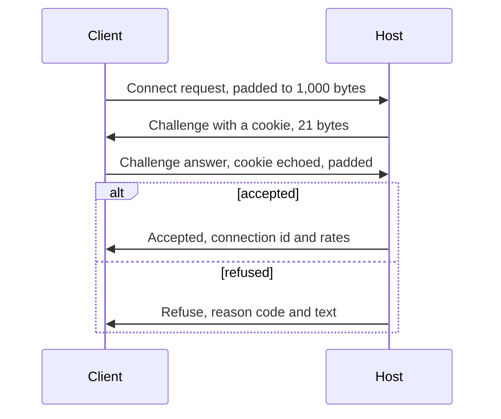

# Network wire protocol

> **T.O.R.E: Tasteful Opinionated Reverse Engineered.**
> The thing being reverse engineered is the *experience*, not the executable. We
> trace what a player does and what the game does back, down to the numbers they
> would notice. How the original code achieved it is history: useful evidence,
> never a blueprint. If a sentence below reads like an instruction to reproduce
> the original's internals, it is out of date.
> <!-- tore-header v2 -->

Design of 2026-09-30 for stage D of the [multiplayer plan](../multiplayer-plan.md#stages),
reviewed by John the same day. The transport, from [Overview](#overview) to
[Reliable messages](#reliable-messages), is built in `tore-net` (slice D2; [what
the build settled](#what-the-transport-settled)); the game's sections and
messages, from [Inputs](#inputs) on, are built in `tore-session`'s `wire`
module (slice D6; [what the build settled](#what-the-games-sections-settled)),
except the cockpit readout's coding, which follows slice D5b. This is T.O.R.E's own
protocol. Fighters Anthology's wire format is unknown
([retail spec](../spec/multiplayer.md)) and nothing here tries to match it.
Every choice below is an agent decision unless it is credited to John. How the
host and the client use these messages is in the
[architecture guide](../ARCHITECTURE.md#network-sessions); the rates, delays and
limits a player notices are in the [netcode numbers](../MULTIPLAYER.md#netcode-numbers).

## Contents

- [Overview](#overview)
- [Packets](#packets)
- [Connecting](#connecting)
- [Acknowledgements and round trip](#acknowledgements-and-round-trip)
- [Reliable messages](#reliable-messages)
- [What the transport settled](#what-the-transport-settled)
- [Inputs](#inputs)
- [Snapshots](#snapshots)
- [Events](#events)
- [Quantization](#quantization)
- [What the game's sections settled](#what-the-games-sections-settled)
- [Limits](#limits)
- [Versions](#versions)
- [Security](#security)

## Overview

- **UDP, one port.** A server listens on one UDP port, 26900 by default (a
  setting; not checked against the IANA registry). IPv4 and IPv6 both work
  when the address is given; finding each other across the internet is
  stage J.
- **Small packets.** Every datagram carries at most 1,200 bytes, under the
  smallest common path limits, so nothing is ever fragmented by the network.
- **Every packet stands alone.** A snapshot is coded against states the
  client has already acknowledged, never against a packet that might be lost,
  so a client decodes each packet it receives whatever happened to the others.
- **Bits, little end first.** Fields are packed with `tore-codec`: bits are
  written least significant first into bytes in order. Section bodies start on
  a byte boundary.
- **Four channels in one packet.** Unreliable state (snapshots and inputs),
  events repeated until acknowledged, reliable ordered messages, and the
  header's acknowledgements, which every packet carries.
- **Time is ticks.** Every time on the wire is a host tick (1/120 s) as an
  unsigned 32-bit number, which wraps after 414 days.

## Packets

Every packet starts with a byte-aligned header:

| Field | Size | Meaning |
| --- | --- | --- |
| Checksum | 32 bits | CRC-32 (IEEE) over the protocol id followed by every byte after this field, least significant byte first |
| Kind | 8 bits | One of the kinds below |

The protocol id is not sent. It is the 8 bytes `TORE-NET` followed by the
protocol version as 16 bits, so a packet from another program or another
version fails its checksum and is dropped silently. The two kinds a
different version must still read, Connect request and Refuse, use the
fixed id `TORE-HELLO` instead, which carries no version.

| Kind | Name | Direction | Checksum id |
| --- | --- | --- | --- |
| 1 | Connect request | client to host | `TORE-HELLO` |
| 2 | Challenge | host to client | versioned |
| 3 | Challenge answer | client to host | versioned |
| 4 | Accepted | host to client | versioned |
| 5 | Refuse | host to client | `TORE-HELLO` |
| 6 | Payload | both | versioned |
| 7 | Disconnect | both | versioned |

A **Payload** packet, the only kind once connected, continues:

| Field | Size | Meaning |
| --- | --- | --- |
| Connection id | 32 bits | The number the host gave in Accepted; a packet with another number is dropped |
| Sequence | 16 bits | This packet's number in its direction, wrapping |
| Ack | 16 bits | The newest sequence received from the other side |
| Ack bits | 32 bits | Bit i set: sequence `ack - 1 - i` was received |
| Ack delay | 16 bits | Time from receiving `ack` to sending this packet, in units of 16 microseconds (at most 65,534 units, about 1 s); 65,535 means nothing has been received yet, and the ack and ack bits mean nothing (agent decision, D2) |
| Sections | rest | Each: kind 8 bits, length 16 bits (bytes), body |

The payload header is 19 bytes with the checksum and kind. Section kinds:

| Section | Kind | Direction |
| --- | --- | --- |
| [Messages](#reliable-messages) | 1 | both |
| [Inputs](#inputs) | 2 | client to host |
| [Snapshot](#snapshots) | 3 | host to client |
| [Events](#events) | 4 | host to client |
| [Own state](#the-own-aircraft) | 5 | host to client |

An empty Payload is a keepalive. A section of an unknown kind, a second
Messages section, a length that runs past the packet, an acknowledgement of a
sequence never sent, or a body that fails its own checks drops the whole
packet, unacknowledged; such packets are counted, and 50 of them within 5 seconds from one
connection end it.

## Connecting

The handshake keeps the host from holding any state, or sending more bytes
than it received, before a client proves it can receive at its address.

| Packet | Fields |
| --- | --- |
| Connect request | protocol version (16), client nonce (64), game version (string), game commit (string), zero padding to 1,000 bytes. The version and the nonce come first and never move, so a host of any version can refuse with the nonce |
| Challenge | client nonce (64), cookie (64); 21 bytes |
| Challenge answer | client nonce (64), cookie (64), callsign (string, 1 to 15 printable ASCII characters), password (string, may be empty), game version and game commit again (the host kept nothing from the request), zero padding to 1,000 bytes |
| Accepted | client nonce (64), connection id (32, random, never 0), session id (64), ticks per second (8, always 120), ticks per snapshot (8, 4 by default), host tick now (32); 31 bytes |
| Refuse | client nonce (64), reason (8), text (string, up to 200 bytes) |
| Disconnect | connection id (32), reason (8); sent three times at once; 10 bytes |

A request or answer that is not exactly 1,000 bytes, or whose padding is not
zero, is dropped. Accepted and Refuse carry the client's nonce, and the client
takes neither without it, so a stranger who cannot see the traffic cannot
refuse or misdirect a join; the game version and commit are repeated in the
answer because the host's accept decision needs them and it keeps no state
between the two (agent decisions, D2, which also moved the nonce ahead of the
strings).

The **cookie** is a keyed hash of the client's address and port, its nonce
and the current 10-second time slot, with a key drawn at host start from the
standard library's randomly seeded hasher. The host accepts the current and
the previous slot. It keeps no record of a client until a Challenge answer
with a good cookie arrives. A repeated Challenge answer from the same address
and nonce gets the same Accepted again, never a second connection. A good
answer with a new nonce from an address that already has a connection replaces
it: the game restarted on the same port (agent decision, D2). The
connection id is drawn the same way as the cookie's key. A callsign already in
use gets a suffix (`Viper_2`), shortened first if the whole would pass 15
characters.

A client resends its current step every 250 ms and gives up after 10 seconds
("no answer from the server"). The host answers at most 20 connect requests
and answers a second from one IP address and 200 in all, counted per whole
second of its clock.

**Refusal reasons**, each with a plain-language text the client shows:

| Code | Reason |
| --- | --- |
| 1 | Different protocol version (the text names both) |
| 2 | Different game build (see [versions](#versions)) |
| 3 | Server full |
| 4 | Wrong password |
| 5 | The server is shutting down or restarting the mission |
| 6 | Kicked |

A client whose own retail stall-speed switch is on refuses to connect before
sending anything, and a server refuses to start with it, so that switch never
needs a code.

The content check happens after the mission loads, as a reliable message
(below), because only then can the client compare.

**Disconnect reasons** (the codes are an agent decision, D2): 1 the player
left, 2 timeout (5 seconds without a valid packet), 3 too many bad packets,
4 protocol error (a message ahead of its window, or fragments that do not fit
together), 5 content mismatch, 6 server stopping, 7 kicked.

## Acknowledgements and round trip

- Sequences are compared the wrapping way: `a` is newer than `b` when
  `a - b` taken modulo 65,536 is between 1 and 32,767.
- Every packet acknowledges the newest sequence received and the 32 before it.
  A sent packet is **delivered** when an acknowledgement names it and **lost**
  when 33 newer packets are acknowledged without it. A packet already received,
  or more than 32 behind the newest, is dropped unread: it could not be
  acknowledged.
- **Round trip.** When an acknowledgement names a new newest packet, the
  sample is `now - (time that packet was sent) - ack delay`. It is smoothed as
  TCP does (gain 1/8 for the mean, 1/4 for the mean deviation). Before the
  first sample it is taken as 250 ms; a client whose Challenge answer went out
  once takes the wait for Accepted as its first sample (agent decisions, D2).
  Under reordering the estimate runs a little low, since the newest packet,
  the only one whose delay comes back, is more often a fast one: readings of
  286 to 306 ms, most below 300, on a 300 ms path with arrivals spread by
  plus or minus 15 ms (20 seeds).
- **Loss** is lost over lost plus delivered, over the last 5 seconds.
- **Arrival spread** is measured on snapshot packets (host to client) and on
  input packets (client to host) from the tick each carries, in the manner of
  RFC 3550's interarrival jitter. The transport does not read ticks: the
  session gives it each packet's send time, from its tick, and arrival time.
- Each side sends at least 10 packets a second; with nothing else to say it
  sends an empty Payload.

## Reliable messages

For what must arrive once and in order: the mission, seating, the roster, the
debrief, leaving.

- Each message has a 16-bit id, counting up from 0 in each direction, a kind
  (8 bits) and a body of at most 256 bytes.
- The sender keeps unacknowledged messages in a window of 256. A message goes
  into a packet's Messages section when it has never been sent or was last sent
  more than `max(1.25 × round trip, 30 ms)` ago. The packet remembers which
  messages it carried; when the packet is delivered, they are acknowledged.
- The receiver hands messages over in id order, holds early ones within the
  window and drops duplicates. An id 256 or more ahead of the next one to hand
  over is a protocol error. An id behind it is a duplicate however far back,
  since a packet that waited on the way can carry an id the sender's window has
  since left far behind (32 packets carry at most 8,160 new ids, so no real
  duplicate is 32,768 back).
- **Large messages** (the mission, the seated state, the roster, the debrief)
  are split into fragments of up to 256 bytes, each its own message; the first
  carries the total length in its record header (at most 64 KB, which the
  window of 256 holds whole). Ordered delivery puts them back together.
- During flight the Messages section takes at most 256 bytes of a snapshot
  packet, and before seating it may fill the packet. The budget is the
  session's per connection; the first due message goes whenever it fits the
  packet, even past the budget, so a whole fragment always moves and
  snapshots keep flowing.

**Message kinds:**

| Kind | Direction | Body |
| --- | --- | --- |
| Mission | host to client | The `MissionSpec` in its text form, the content manifest (resource names and their FNV-1a 64 hashes), the host tick now, the contrail sortie number |
| Content refused | client to host | The resource names whose hash differs or which are missing; the host disconnects with reason "content mismatch" and the client shows the list |
| Ready | client to host | The plane wanted (its id), or any |
| Seat refused | host to client | Reason text (plane taken, destroyed, lost its pilot, not open to humans, no free plane); the client may ask again |
| Seated | host to client | Seat id, plane id, the tick of the state, the plane's exact state ([own aircraft](#the-own-aircraft)), its loadout (station weapon names, counts, mounts), the full roster, the standing and destroyed ground objects |
| Roster | host to client | Every plane: id, side, wing, member, aircraft key, pilot (AI, or a human's seat and callsign); sent on every change |
| Names | host to client | New entries of the connection's name table: weapon records, shapes and sound names used by snapshots and events |
| Notice | host to client | A line of text for the HUD, for example "Mission restarts in 30 seconds" |
| Leave | client to host | The player ends the mission |
| Debrief | host to client | The seat's debrief report as the single-player debrief shows it |
| Mission ended | host to client | Why (every human left, time limit, server stopping, ended by the server's operator) and seconds until the next mission, if any; the host disconnects the player once it and the debrief are acknowledged |

## What the transport settled

Details slice D2 (`crates/tore-net`) decided where the design left them open.
Each is an agent decision unless it says otherwise.

**The Messages section** (kind 1) is bit packed: a record count (8 bits, 1 to
255), then each record, then zero bits to the byte boundary.

| Field | Bits | Present |
| --- | --- | --- |
| Id | 16 | always |
| Part | 2 | always: 0 a whole message, 1 the first fragment, 2 a later fragment |
| Kind | 8 | whole message and first fragment |
| Total length less one | 16 | first fragment only; the total is 257 to 65,536 bytes |
| Body length | 9 | always: a whole message 0 to 256, a first fragment exactly 256, a later one 1 to 256 |
| Body | 8 a byte | always |

**Who decides what.** The host refuses a different protocol version (code 1)
and, past its connection limit (a setting, default 30), "server full" (code 3)
by itself. Every other decision goes to the session through one call with the
join's details (address, versions, build, callsign, password), which accepts
with the session id, rates and tick, or refuses with a code and text. Making
a callsign unique is the session's job. The session also checks its own
sections before anything in a packet is applied: a section it rejects drops
the whole packet unacknowledged and counts it as bad, so nothing the session
could not read is ever treated as delivered.

**Pace and limits.**

- A packet of due messages alone goes out at most 120 times a second; the
  session's own packets carry messages too. Without the pace a burst of
  messages sent every millisecond let packets be overtaken by more than 32
  newer ones and dropped as too old on a 300 ms path.
- A sender queues at most 8,192 messages, fragments counted one each (2 MB);
  past that, sending is refused and the session waits.
- One read of a socket takes at most 1,024 datagrams, so a flood cannot hold
  the host's loop.
- A Disconnect's three copies go out together.

**Events.** Every Payload a side sends is reported back as delivered or lost
by its sequence, which the snapshot baselines and the event queue need.
Every connection that ends, and every join that fails, reports exactly one
reason: no answer, refused with its code and text, disconnected with its
reason and whether the other side said so, or (on the host) replaced.

**Time and randomness.** Nothing in the transport reads a clock: the caller
passes the time in, which lets the simulator run faster than real time. A real
endpoint draws its nonce, connection ids and cookie key from the standard
library's randomly seeded hasher, each value from a fresh one; tests and the
simulator can seed them instead, which makes a whole session repeat exactly.

**The simulator** joins in-process endpoints by one-way links with a latency,
arrivals spread uniformly within plus or minus a width (reordering follows),
loss, duplication and optional burst loss (two states, good and bad), on a
virtual clock. It can record every datagram with its fate and arrival times.

## Inputs

The Inputs section carries the player's controls for recent ticks. The client
sends one input packet per rendered frame that stepped at least one tick, at
most 60 a second, and each repeats every tick the host has not acknowledged,
up to 24 ticks (200 ms). A tick's input is lost only when every packet that
carried it is lost.

| Field | Size | Meaning |
| --- | --- | --- |
| Newest tick | 32 | The last tick in this section |
| Tick count | 5 | How many ticks follow, 1 to 24, oldest first, ending at the newest |
| View offset | 8 | The host tick the player's screen showed when the newest tick was sampled, as ticks before the newest; used for [lag compensation](../ARCHITECTURE.md#hits-and-lag-compensation) |
| Interpolation delay | 6 | The client's interpolation delay in ticks, which bounds the rewind's cap |
| View subject | 1, then 2 and a varint | Whether the player's view follows another entity (target, wing, external or fly-by view), then its kind and id; the host sends that entity at the full rate. *Built (D6):* the id is a varint, since projectile numbers pass 65,535 in a long mission |
| Mismatch | 32 | The newest snapshot tick whose own-state hash differed from the client's own, or 0 |
| Per tick | | The first tick in full, each later one as a "same as the tick before" bit or its changed fields ([settled](#inputs-as-built)) |
| Commands | | The unacknowledged commands, below ([settled](#inputs-as-built)) |

A tick's continuous controls:

| Control | Coding |
| --- | --- |
| Pitch, roll, yaw | 16 bits each: the value in -1 to 1 times 32,767, rounded |
| Throttle rate | 8 bits: -1 to 1 times 127 |
| Throttle position | 1 bit present, then 16 bits: 0 to 1 times 65,535 |
| Trigger | 1 bit |
| Scope controls | 1 bit changed, then channel (2), range step (4), contact history (1) |

The client rounds its own controls to these steps before its prediction steps
them, so the host and the client step identical numbers. Single player never
rounds.

**Commands** are what a player does once: every `SeatCommand` (weapon
selection, designation, arming, chaff and flares, the trigger key, tower
requests, radio silence, wing orders) and every pilot command (eject, the gear,
flaps, brake, hook, bay, engine, burner, radar, jammer and autopilot switches,
throttle presses). Each has a 16-bit command number, the tick at which the
client applied it in its own prediction, and its coded form. They repeat in
every input packet until the host acknowledges them in a snapshot; the host
applies each exactly once, in number order, at its tick, or on the next tick
if that one is already stepped. A toggle therefore never toggles twice.

## Snapshots

One Snapshot section per snapshot packet, 30 a second by default. The host
shares the 1,200 bytes so that the entities always keep their place: after the
headers (55 bytes: the payload header, three section headers and a snapshot
header of at most 21), the cockpit readout takes up to 200 bytes, the events
up to 150 and the messages up to 256, and the entities get the rest, at least
545 bytes; whatever one section leaves unused goes to the entities, and the
events may use what the entities leave ([settled](#snapshots-as-built)). The
exact own state, when due, travels in a second packet.

### Header

| Field | Size | Meaning |
| --- | --- | --- |
| Tick | 32 | The host tick the snapshot shows (after that tick's step) |
| Input received | 32 | The newest input tick received from this player |
| Input margin | 8, signed | Over the inputs received since the last snapshot, the smallest number of ticks by which one arrived before the host needed it; negative when late |
| Inputs repeated | 8 | Ticks since the last snapshot for which the host had no input and repeated the last one |
| Commands applied | 16 | The highest command number applied, all before it applied too |
| Own state hash | 64 | FNV-1a 64 of the player's plane's exact state at this tick, as the exact coder writes it; absent before seating |

### The own aircraft

The player's plane's **exact state** is what the client's prediction needs to
match the host bit for bit: the flight state, the cockpit's turbulence state
and random stream, and the ownship terms the per-plane step reads (the
subsystem hit counts, the sensor and jammer failures, the stores' weight,
whether a release holds the bay open, hit points, the broken section and the
damage in each section; the full list is in the
[architecture](../ARCHITECTURE.md#one-step-for-a-humans-plane)), and the
turn-back and OVERSPEED message clocks.
Every field is coded, the private ones included (the stall scale that depends
on the weight's history, the hybrid model's random state, the systems, the
autopilot, the wreck and the escape), except the write-only trace, the flight
at the start of the tick and the imported tables, which the client already
has ([details](../ARCHITECTURE.md#the-exact-state-of-a-humans-plane)).

Every snapshot carries only its **hash** (in the header). The exact state goes
in an **Own state** section, in its own packet beside the snapshot packet, when:

- the host's tick did something to the plane the client cannot foresee: it
  repeated a missing input, applied a command at another tick than the
  client's, or the plane was hit, jolted by a blast, released a store or had
  its ownship terms change;
- the client's input reported a mismatch; or
- a second has passed since the last one, as a safety net.

Each 64-bit number is coded as the exclusive-or with the same field of a
baseline, with its leading zero bits counted, so an unchanged field costs one
bit and a slowly changing one a few bytes: about 200 to 350 bytes in all
(measured in D4: about 160 to 260 bytes against a state one snapshot back, and
under 500 with no baseline). The
baseline is an earlier exact state the client has acknowledged, named by how
many own states back it was (5 bits, 1 to 31); 0 means no baseline
([settled](#own-state-as-built)). The client decodes it bit for bit.

### Cockpit readout

The [cockpit readout](../ARCHITECTURE.md#the-flight-screen-draws-a-frame) of
the player's seat, in groups (stores and selection; seeker and tone; weapon
estimates; targets; radar and infrared contacts; visual contacts; map
contacts; RWR emitters and missile records; damage and faults;
countermeasures; airport and NAV; target window; music inputs and mission
result). Each group has a changed bit against the readout of the baseline
snapshot; only changed groups are sent, and lists within a group (contacts,
emitters) are coded entry by entry against the baseline's entry with the same
id. Contact positions are world positions at the quantization below.

### Entities

Everything the client draws that moves: aircraft (every plane except the
player's own, human-flown or not), missiles, bombs and rockets in flight,
debris pieces and ejected pilots. Gun rounds are not entities; they arrive as
burst [events](#events). Ground objects do not move; their destruction is an
event.

Each entity record:

| Field | Meaning |
| --- | --- |
| Kind | Aircraft, projectile, debris or pilot. *Built (D6):* records come kind by kind, each kind's count first, so a record carries no kind bits |
| Id | The plane id, projectile number, or the aircraft a debris piece or pilot came from; coded as the difference from the previous record's id of the same kind |
| Removed | 1 bit: the entity is gone; nothing follows |
| Baseline | Snapshots back to the acknowledged state this record is coded against (5 bits); 0 is a full record |
| Fields | Coded against the baseline, below |

**Baselines are per entity.** For every connection the host remembers, for
the last 32 packets it sent, the quantized state it sent for each entity. When
a packet is acknowledged those states become that entity's acknowledged
baseline. A record in a new packet codes against its entity's newest
acknowledged baseline if it is at most 31 snapshots old, else in full. The client
keeps every entity's received states for the last 64 snapshots, since a packet
32 behind the newest can still arrive with records 31 further back. The host
remembers the quantized values it sent, not the exact ones, so both sides hold
the same baseline and rounding never builds up.

**Prediction from the baseline.** Positions are predicted as the baseline's
position plus its velocity times the ticks between, in whole steps with
integer arithmetic only, and only the difference is sent, as a signed
variable-length number of quantization steps. Velocity, attitude and speed
send their difference from the baseline. Slow fields (the other ten animated
devices, engine flags and rates, damage, wreck phase, airborne and crashed)
are sent only when their group changed, behind one bit each.

| Kind | Fields |
| --- | --- |
| Aircraft | Aircraft key on first sight; position, velocity, attitude (yaw, pitch, bank); devices; engine (lit, afterburner, flame, thrust-vectoring rates); damage (hit points of the initial, section damage, structural section); airborne, crashed, wreck phase |
| Projectile | On first sight: owner, weapon and shape (name table), target, whether it is aimed at this player's plane; then position, velocity, direction. *Built (D6):* velocity replaces speed, so that the prediction needs no trigonometry and both ends agree to the step; the speed is its length |
| Debris | On first sight: owner, drawn model and damage variant; then position, velocity, attitude (*built (D6):* with a velocity, from the picture a tick before, for the prediction) |
| Pilot | On first sight: the aircraft it left; then position, velocity, heading, escape phase |

**Priority and relevance.** Each entity has a priority that grows every
snapshot by its relevance weight and resets when it is sent. An entity is due
when its priority reaches the snapshot rate: a near one every snapshot, a far
one twice a second. The host picks due records in priority order until the
entities' space is full, so what cannot fit waits and is sent first next time,
then writes the chosen records in id order, which the id coding needs. The
relevance bands are the [netcode numbers](../MULTIPLAYER.md#netcode-numbers)'
(John, 2026-09-30). A missile aimed at the player is always sent. An entity
that leaves is sent as Removed until that is acknowledged.

**The first snapshot** after Seated has no baselines, and the host queues
events that describe the mission as it stands: every crater and crash-site
fire, every destroyed ground object, and every effect still showing. Smoke and
contrails already in the sky before the player joined are not sent; they
appear as the client's own regeneration starts.

## Events

Things that happen once, for this player or for everyone. Each connection
numbers its events (16 bits). Every snapshot packet repeats, oldest first,
every event the client has not acknowledged, within the events' share of the
packet (150 bytes, and whatever the entities leave); an event's packet being
delivered acknowledges it. Each event carries its tick, as ticks before the
snapshot's tick.

| Event | For | Fields |
| --- | --- | --- |
| Message | the seat | A HUD line |
| Radio | the seat | Route (radio, airport, direct), speaker label, text, recording stems |
| Tower | the seat | A tower recording stem, or cut the tower off |
| Order voice | the seat | The seat's own order call stems |
| Order reply | the seat | What became of a wing order |
| Weapon cycled | the seat | The weapon page turns |
| Release | the seat | Weapon release sound and station |
| Launch | everyone | Shooter, projectile number, weapon: every missile, rocket and bomb launch, so the view rig and the F12 view see a missile that lives less than one snapshot |
| Feedback | the seat | A rumble event |
| Your aircraft exploded | the seat | Which wording ("exploded", "exploded on impact") |
| Wing ejection | everyone | Aircraft, HUD line, friendly |
| Effect | everyone | Kind, position, ticks it shows, explosion type |
| Mark | everyone | Crater or crash-site fire, position |
| Ground destroyed | everyone | Ground object id |
| Countermeasure | everyone | Aircraft, chaff or flare, the release geometry the replay viewer flies it from, number left |
| Gun burst | everyone | Shooter, gun station, first tick, last tick (0 while still firing). *Built (D7a):* sent when the burst starts, and again from its first tick with its length once the station has fired no round for its weapon's round interval plus 2 ticks |
| Sound | everyone | Emission kind, position, the aircraft it came from |

Recording stems, weapon and sound names are sent by their index in the
connection's name table (the Names message), which the host fills before the
first use. Radio text is sent as it is: the client never composes calls.

## Quantization

| Quantity | Step | As in replays |
| --- | --- | --- |
| Positions of aircraft, projectiles, debris, pilots, effects, marks, contacts | 1/32 ft | yes |
| Velocities | 1/64 ft/s | yes |
| Attitude of other aircraft, debris; pilot heading | 2^-16 of a turn (0.0055 degrees) | coarser (replays use 2^-20) |
| Projectile direction | 2^-16 of a turn per angle (heading from +z towards +x, then elevation) | coarser |
| Aircraft speed (a device) | 1/4 ft/s | coarser |
| Devices from 0 to 1 | 1/255 | yes |
| Elevator, aileron, rudder | 1/127 | yes |
| Thrust-vectoring rates | 1/4096 rad/s | yes |
| Stick inputs | 1/32,767 | finer (replays use 1/1024) |
| Throttle position | 1/65,535 | finer |
| The own aircraft's flight state | exact | exact |
| Ids, counts, flags, hit points, ticks | exact | yes |

*Built (D6), correcting the design:* a value that cannot be quantized is
clamped, not sent exactly. Not finite is zero, and a position or velocity
beyond 2^40 steps (34 million miles) is held at it; a device level outside its
range is held at its end. The quantized numbers are all both ends ever store,
so a clamped value is simply what the client draws.

## What the game's sections settled

Details slice D6 (`crates/tore-session`, module `wire`) decided where the
design above left them open. Each is an agent decision unless it says
otherwise. Varints are `tore-codec`'s (7 bits a group); a **bucketed** value
is a bucket index then the value in that bucket's width, with the last index
an escape to a varint; strings are a length byte and UTF-8.

### Inputs as built

| Field | Bits |
| --- | --- |
| Newest tick | 32 |
| Tick count | 5, 1 to 24 |
| View offset | 8 |
| Interpolation delay | 6, 0 to 63 |
| View subject | 1, then kind 2 and id varint |
| Mismatch | 32 |
| First tick | pitch, roll, yaw 16 signed each (-32,767 to 32,767); throttle rate 8 signed (-127 to 127); throttle 1, then 16; trigger 1; scope channel 2 (radar, infrared, visual), range step 4 (0 to 5, the scope's six ranges), history 1 |
| Each later tick | 1 bit "same as the tick before"; else 7 change bits (pitch, roll, yaw, throttle rate, throttle, trigger, scope), then each changed value: a stick as its difference from the tick before (bucketed, 4, 8 or 17 bits), the rest as in the first tick; a changed trigger flips and needs no value |
| Command count | 7, 0 to 64 |
| First command number | 16, when there are commands; the rest follow one by one |
| Each command | ticks before the newest (varint), a 5-bit code and its fields |

The command codes cover every `SeatCommand` (a combat command has its own
5-bit code, with a heat byte, a distance or a target id where it has one; a
wing order has a 4-bit code and its break, approach or formation) and every
pilot command (a switch is 4 bits). A reader refuses a change bit whose value
did not change, so every section has one encoding. `quantize_pilot` rounds a
pilot input exactly as the wire does, the throttle commands included (a
position to 1/65,535, a step to 1/32,767, each clamped to its range), and the
client steps what it returns. The host takes the frames and the commands with
their ticks; `InputFrame::seat_input` makes the `SeatInput` of a tick and
`InputsSection::view` the `SeatView` lag compensation reads.

*Settled by the host (D7a):* a client numbers its commands from 1, so a
snapshot header's "commands applied" of 0 means none yet; a command is sent
only once the client's game has reached its tick (a reader refuses a command
after the section's newest tick). Each earlier frame of a section takes the
newest frame's view, as many ticks earlier. The host's buffer rules are in
the [architecture](../ARCHITECTURE.md#the-host-session).

### Snapshots as built

The section is the header (161 bits), one bit for the cockpit readout (0
until its coding lands after slice D5b), then the four kinds in turn
(aircraft, projectiles, debris, pilots): each kind's count as a varint and
its records in id order.

| Record field | Bits |
| --- | --- |
| Id | The first record of a kind: its id; later ones: the id less the previous one less 1. Bucketed unsigned: 2 bits of index, then 0, 4 or 10 bits, or a varint |
| Removed | 1 |
| Baseline | 5: snapshots back, 1 to 31; 0 is a full record |
| Full body | The identity fields; position and velocity as six signed varints; the angles, 16 bits each (aircraft and debris 3, projectiles 2, pilots 1); an aircraft's speed as a signed varint; every slow field |
| Body against a baseline | 1 bit "moved"; if set, the position residuals after the prediction, the velocity, angle and speed differences, each bucketed (position and velocity 3, 6, 10, 14 or 20 bits; angles 3, 6, 9, 12 or 17; speed 3, 6, 10 or 16); then for each group of slow fields a changed bit, and in a changed group a bit per field and each new value |

The identity fields (full records only): an aircraft's type as 1 bit and its
place among the fourteen selectable aircraft (4 bits); a projectile's owner
(varint), weapon (12-bit name index), shape (1 and 12), target (1 and a
varint) and whether it is aimed at this player; a debris piece's owner, the
aircraft whose model draws it (1 and 4) and its damage variant (1 and 3); a
pilot's aircraft. An aircraft's slow groups are its devices (present, six
levels at 1/255, three control surfaces at 1/127, the throttle at 1/255; an
aircraft without devices sends only the present bit), its engine (lit,
afterburner, flame, three rates as signed varints), its damage (hit points,
initial hit points and six sections as signed varints, the structural
section in 3 bits) and its status (airborne, crashed, wreck phase in 2 bits);
a pilot's is its escape phase (3 bits).

- **Records parse without their baseline.** Every field against a baseline
  is a self-delimiting difference or a whole new value, so a client that
  lacks a record's baseline reads past it and uses the rest of the packet.
  The host codes only against states the client acknowledged, so this is a
  safety net; the lossy test never needs it.
- **Baselines by snapshot.** A record names its baseline by snapshots back,
  not by packets, since own state and message packets go between snapshots
  and the host cannot know their numbers before it sends them. The ticks
  between are the snapshots back times the ticks per snapshot, and the
  prediction divides the baseline's velocity steps by 240 per tick with
  integer arithmetic, rounding halves up, so both ends agree to the step. The
  host codes against an entity's newest acknowledged state when the gap is 1
  to 31 whole snapshots and its identity fields match, else in full.
- **Ids.** A debris piece's and an ejected pilot's id is the aircraft it came
  from: each aircraft breaks off at most one piece and ejects at most one
  pilot. The player's own pilot is not sent; its escape is part of its plane's
  exact state.
- **Removals.** The host sends Removed for every entity the client may know
  that is gone, in every snapshot until a packet carrying the removal is
  delivered; one that comes back is sent in full. On the client the newest of
  a state and a removal wins, whatever order packets arrive in.
- **Priority.** Priorities are whole numbers: a near entity adds the snapshot
  rate each snapshot, a far one 2, and an entity is due at the snapshot rate,
  so a far one is due twice a second at every rate (the table's weights, 1
  and 1/15 at 30 a second). An entity the connection has never had is due at
  once. Missiles aimed at the player go first, then removals, then due
  entities by priority; a record is sized with its id's whole value before it
  is chosen, so the written section is never larger. *Correction to the
  design*, which said a band waits only when the packet is full: a far entity
  is sent only when due, so it costs its bytes twice a second whatever room
  there is.
- **Shares.** The snapshot header takes at most 21 bytes, so the entities'
  least share is 545 bytes. The host keeps the messages' room at the
  caller's figure (256 bytes in flight, less when it knows fewer are
  waiting); the events take whatever the entities leave, and the oldest
  event may use the messages' room too, as a long message may, so it is
  never starved.

### Events as built

The section is the count (varint, 1 to 1,024), the first event's number (16
bits), then each event: its number after the first as the difference from the
one before less 1 (bucketed as the ids), its ticks before the snapshot
(varint), a 5-bit code in the table's order (Message 0 to Sound 16) and its
fields. Stem lists are a 6-bit count (at most 32) and 12-bit name indexes. A
rumble's turbulence is 1/255; a gun burst starts at the event's tick and
carries its length as a varint, 0 while still firing; a countermeasure
carries its release position, velocity and attitude, the device's number
(which chose its look) and the owner's devices of that kind left; a radio
call carries a bit for "important" (never silenced) beside its route, an
addition. The client drops repeats by number (it remembers 4,096) and holds
an event that names a table entry whose Names message has not arrived, with
the events after it, until it does.

### Own state as built

The section is the state's tick (32 bits), its number (16 bits, counting the
connection's own states), its baseline as own states back (5 bits, 0 for
none), then the exact state's own coding and zero padding. The host codes
against the newest acknowledged own state no more than 31 numbers back; the
client keeps its last 64.

### Messages as built

Kind bytes 1 to 11 in the table's order (Mission to Mission ended). The
spec text and the exact state are long byte strings (a varint length); the
exact state in Seated is coded with no baseline and the client decodes it with
its plane's aircraft model. A loadout is the fuel as a 64-bit float, the
loadout screen's cheat bit, and each station's weapon, count and quantity.
A roster plane is its id, side, wing (2 bits), place in the wing, aircraft
(4 bits) and pilot (the AI, or a seat and callsign). The Debrief mirrors the
game's debrief report field for field (the damage as a 64-bit float, the ten
kill rows and the eight shot tallies). Mission ended carries its reason in 2
bits (every human left 0, time limit 1, server stopping 2, ended by the
server's operator 3, which slice D7 added under protocol 1 before anything
shipped) and the seconds to the
next mission, if any.

## Limits

Decoders check every count and length against these before reading on.

| Limit | Value |
| --- | --- |
| Datagram | 1,200 bytes |
| Message body, fragment | 256 bytes |
| Reassembled message | 64 KB |
| Unacknowledged messages | 256 |
| Unacknowledged events | 1,024; beyond it the connection ends as too far behind |
| Aircraft per snapshot | 64 |
| Projectiles, debris pieces | 256 each |
| Ejected pilots | 64 |
| Name table | 4,096 entries |
| String | 255 bytes |
| Input ticks per packet | 24 |
| Commands per packet | 64 |
| Recording stems per radio call or order voice | 32 |
| Stations of a loadout | 64 |
| Planes of a roster | 256 |
| Manifest entries, names in a refusal | 8,192 |
| Destroyed ground objects at seating | 8,192 |
| Seats per host | 30 |

## Versions

- The **protocol version** is one number in `tore-session`
  (`wire::PROTOCOL_VERSION`, 1). Any change to the bytes raises it. A test
  (`wire_golden`) encodes a fixed set of sections and messages and compares
  them with a committed copy, `crates/tore-session/wire-golden.txt`; when
  they differ it fails and says to raise the version and refresh the copy
  (`TORE_UPDATE_WIRE_GOLDEN=1 cargo test --locked -p tore-session
  wire_golden`), the way the controls list test works. The copy records the
  version, and refreshing changed bytes under the same version is refused.
- The **game build** is the version string and the commit the build stamps.
  John's rule is that the build must match ([guide](../MULTIPLAYER.md#compatibility-handshake)).
  *Agent decision:* two tagged release builds match when their versions are
  equal; any other build must have the same commit, since compile-time tuning
  changes the simulation and every prediction would be corrected.
- The **content** is checked after the mission loads, from the manifest in
  the Mission message ([architecture](../ARCHITECTURE.md#a-mission-with-no-window)).

## Security

As the [guide](../MULTIPLAYER.md#transport) says, v1 traffic is not
encrypted: the password keeps strangers out of a server but anyone who can
watch the network can read it. What the protocol does guard against:

- **Spoofed connections and reflection.** The cookie makes a client prove it
  receives at its address before the host keeps anything, and a Challenge is
  21 bytes against a 1,000-byte request; no host reply to a handshake packet
  is larger than it.
- **Forged answers.** Accepted and Refuse carry the client's nonce, so only
  someone who sees the traffic can refuse or misdirect a join.
- **Blind injection.** Once connected, a packet must carry the connection's
  32-bit id and a valid checksum.
- **Malformed packets.** Every decoder is bounded and returns an error instead
  of panicking; a seeded fuzz test feeds each one random and mutated packets.
- **Floods.** Connect requests are rate-limited per address and in total, and
  a connection that sends too many bad packets is closed.
