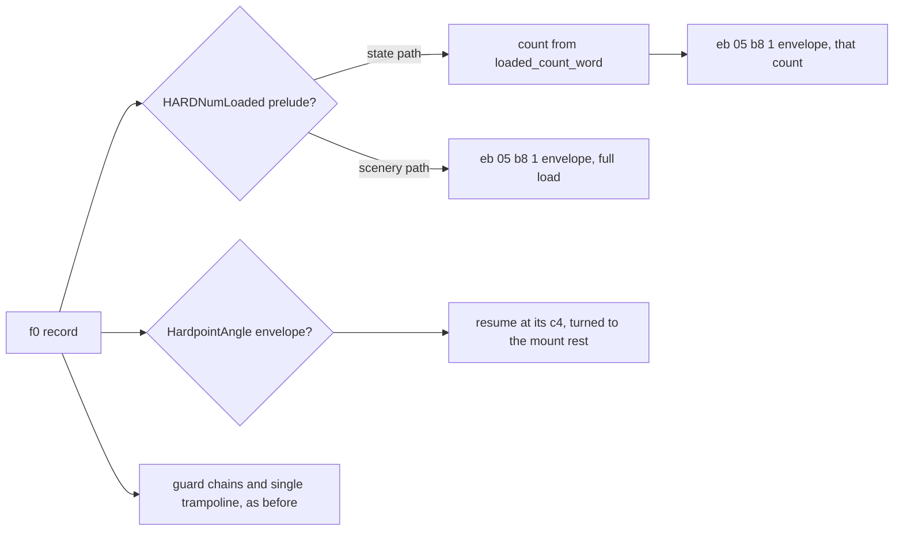

# Working with objects and SH shapes

> **T.O.R.E: Tasteful Opinionated Reverse Engineered.**
> The thing being reverse engineered is the *experience*, not the executable. We
> trace what a player does and what the game does back, down to the numbers they
> would notice. How the original code achieved it is history: useful evidence,
> never a blueprint. If a sentence below reads like an instruction to reproduce
> the original's internals, it is out of date.
> <!-- tore-header v2 -->

The [F/A-XX concept](../spec/fa-xx.md) is built on the F-22N since 2026-09-22
and omits F22N.SH fin faces 361d/3670/38e4/3903/3926 at runtime. The reviewed
base layout is still validated by the F-22N rig before use. Its split leaves
reuse the existing inboard flap faces 4477/4496/44f3/450e/466e/4691/46ee and
their texture coordinates; the imported source data is unchanged. Damaged-body
fin faces are F22N_A.SH 3366/3389 and F22N_C.SH 2ac0/2ae3/2c8b/2cae.
The concept inherits the F-22N's C/D damage selection; D contains no vertical fin.
The original-format exporter also removes the indexed decal faces 3644 and 3954
from the intact F22N.SH. They use texture-index slots 1 and 0 respectively, with
source z=9..25 on the fin planes. The gameplay projection omits indexed materials;
export validation retains their geometry with unresolved material labels so
that separate fin artwork cannot evade its removal checks. The F-22N's own hook
is the `_PLhook` word 5e9a branch, two coplanar faces 40a1/40c0 with root at
source y=-11..-7, z=-9 and deployed tip at z=-23. The superseded F-22A
addresses were fins 34f7/354a/37ff/381e/3841, decals 351e/386f, flaps
437f/439e/43fb/4416/4576/4599/45f6, F22_A 3365/3388 and F22_C
2abf/2ae2/2c8a/2cad; they were matched to the F-22N faces by identical geometry.

> **Research notes, research mode.** Recovered facts about the original
> game's data and code, kept as evidence. Requirements, gates and remaining
> work described here are research-mode scope; they are not acceptance gates
> for gameplay. Parity is measured by expression of feature, see
> [AGENTS.md](../../AGENTS.md). Player-visible behaviour is specified in
> [docs/spec/](../spec/).


Research checkpoint: 2026-09-15. This guide adds practical object/shape guidance
from Plurry's **The Explanation of FA Shape files, v2.01 (2026/09)** in the
user-supplied `.local/fa-shape-file-explination/` folder. It combines that
community research with checks of its F18C examples and our current readers.
It does not implement an object editor or expand supported aircraft.
[Review evidence and exact input identity](../baselines/shape-reference-review.md).

Read [aircraft](aircraft.md), [weapons](weapons.md), and [theater](theater.md)
for their respective runtime contracts. F18C is an example asset here;
the supported Hornet remains **F18.PT, F/A-18D**.

## 1. Choose the layer that owns the change

An object is more than its visible mesh. Keep these concerns separate when
investigating or eventually editing it:

| Intended change | Starting point | What the shape alone cannot establish |
| --- | --- | --- |
| Appearance, skin, moving visual parts | SH drawing program and referenced PICs | Flight response or equipment operation |
| Aircraft identity, equipment, hardpoints | PT and its referenced definitions | Native animation timing or muzzle rendering |
| Weapon behavior and sensor properties | JT / SEE / ECM and native consumers | Whole lifecycle parity from a decoded scalar |
| Damaged appearance or ground shadow | Explicit definition references and relevant SH variants | Damage thresholds, variant selection or collision geometry |
| Put a building, ship or aircraft in a mission | M/MM object records, type resolution and native placement consumers | Position, allegiance, objectives or spawning from an SH filename |
| Wing vapor attachment | SH CE record plus streamer consumers | Emission conditions and trail lifetime from coordinates alone |

The [Ukraine airport inventory](airport-placements.md) now identifies the first
runway/building dependency set and its placement limits.

The runtime importer follows base and variant layout placements through their OBJ_TYPE
prefix to explicit SH and projected PIC references. Static geometry uses the SH
CODE header exponent for rendering and contact. All main shapes placed by the 75 reviewed layouts project with the scenery
reader. It also preserves bounded line records, shown as one-pixel strokes, and
selects a fitted loaded pose for the reviewed CHAP/SA2/SA3/SCD load-count envelopes
and a rest pose for the KRIV/SOVR turret envelopes ([surface unit shapes](#surface-unit-shapes-envelopes-and-sprites-2026-10-10)).
No callback runs. Unreviewed shape opcodes still receive diagnostics while
placement identity remains available. [Scenery coverage and limits](../spec/terrain-detail.md).

The environment reader still handles environment/tmap fields independently.
The bounded mission reader now parses object blocks for static scene construction;
see [airport placements](airport-placements.md). The separate bounded STRIP reader can inspect one isolated
eight-field placement record ([contract](native-strip.md#bounded-isolated-placement-ne-011b));
that diagnostic remains separate from the runtime scene loader. The current
integration resolves type, visual dependencies, placement and mutable simulation
state separately. Asset presence alone does not establish complete shape or
behavior coverage; this is TORE's object model, not the original object manager.

### Main, damaged and shadow resources

The introductory guide describes common families: one main shape for simple
objects; a main/damaged pair for some ships and ground targets; and an aircraft
family with main, `_A` through `_D` damage shapes and `_S` shadow shape. It gives
RIG2/RIG2_A, TICON/TICON_A and shared TANK_A as ground/ship examples.
These are **reference naming patterns, not a universal resolver rule**.

The supplied textual F18C.PT has separate `shape` and `shadowShape` references.
Follow actual definition references and verified native selection rules. Do not
infer a damage progression from alphabetical suffixes, require six files for
every aircraft, or use a visual mesh as a validated collision/carrier surface.
The guide's suggestion that some buildings contain damage geometry internally
is explicitly a hypothesis. Carrier internals remain outside this review.

Keep archive provenance and title/version identity with each resource. Identical
filenames in different editions need not contain the same model. A visually
preferred model from another title is not a faithful replacement for FA data.

## 2. Understand the shape before flattening it

SH is an inert PL/PE module with a drawing program, data, and sometimes embedded
x86 re-entry blocks. It is not just a list of polygons. Read section tables;
the guide's 512/1024-byte header categories are observations, not a parser rule.
Never load or execute the imported module.

The guide uses **LOD** for distinct distance/detail models and **sub-LOD** for
component groups within one such model. A sub-LOD can be a door, flap, or fixed
piece of fuselage; it is not necessarily another distance threshold.

The supplied OBJ examples contain:

| Export | Named objects | Vertices | Faces |
| --- | ---: | ---: | ---: |
| F18C_LOD_0.obj | 17 | 452 | 326 |
| F18C_LOD_1.obj | 3 | 215 | 172 |
| F18C_LOD_2.obj | 1 | 97 | 60 |

These are counts of exported records, **not simultaneously visible retail
polygons**. The near export includes both raised/lowered flap groups and enabled
device geometry. It has no `vt` or `vn` records; it is useful for spatial study,
not a complete texture/normal/animation round trip. Seven near-detail groups
also have offset comments that must be understood before moving their vertices.
Distance thresholds and state-dependent visibility still need native validation.

### Fixed, switched and rotating parts

The guide distinguishes three useful cases:

- A fixed component contributes geometry at the body origin.
- A switched component appears/disappears or selects an alternate mesh. An
  extended flap mesh does not prove that retail smoothly rotates the closed one.
- A transformed component has local geometry and a connection point. Landing
  gear and its doors can each have separate pivots and native angle arithmetic.

For the supplied F18C, the left main gear's C4 record starts at file offset
15374. Its translation tuple in record order is `(-8, -6, -7)` and its relative
target is 16398. The target begins the gear vertex block after a separate
14-byte header. The guide labels C4 coordinates X/Z/Y; the current projector
maps its second and third words into the corresponding internal axes. Do not
apply that permutation indiscriminately to vertex, PT, normal and world data:
document the conversion for each record type.

Current `shape.rs` applies C4 translation and restores the calling transform
and texture on return. It does not interpret the full native rotation program.
The app's F18 and Rafale rigs supply fitted animation separately. A future port
must recover per-part axis, sign, scale and state inputs; the presence of
`_PLgearPos` alone does not establish the animation law.

The guide claims animated face centroids already include attachment offsets.
Treat that as a per-record research lead: verify the native consumer before
offsetting a centroid a second time. Positions translate; normal directions
rotate but do not translate.

## 3. Geometry, materials and shading

### Vertex buffers and face lengths

Opcode 82 has a vertex count and destination field, followed by signed 16-bit
coordinate triples. The guide calls the destination unknown. Our reader already
uses it as a byte offset into eight-byte vertex slots: slot = destination / 8.
It rejects misaligned destinations. Component blocks can populate shared slots;
do not restart face indices at zero for every component.

For FC faces, the second flag byte controls the stored widths:

| Mask in second flag byte | Clear | Set |
| --- | --- | --- |
| 0x04 | 8-bit vertex indices | 16-bit vertex indices |
| 0x02 | 16-bit signed face center components | 8-bit signed face center components |
| 0x01 | 16-bit UV components | 8-bit UV components |

These are index widths, not the width of the polygon vertex-count field. Our
reader consumes a byte count and bounds it to 3–64. The guide's 3–8 range is not
adopted as a universal limit. Normal/center and texture payload presence also
depend on the first flag byte; widths alone cannot determine the record length.

Changing an index from 255 to 256, or moving a UV beyond its byte range, can
therefore change a record's size. Recompute offsets and links, rather than
patching a larger value into the old field. The reference's material combinations
are useful examples, but not proof that arbitrary flag combinations are valid.

### Texture state and decals

E2 selects a named texture for following faces (14-byte bounded name payload in
our reader). E0 selects a runtime texture slot. The guide identifies slots
0/1 as left/right tail art, 2 as nose art, and 3/4 as left/right wing markings;
their names need not describe where every aircraft uses them.

An E2 after an E0 restores the main skin. Keep this state transition when
reordering geometry. Our projector clears its named texture at E0 and omits
textured faces with no resolved texture; it does not implement those five decal
slots. Do not fill an unresolved decal with a piece of the main skin.

Keep palette indices and original atlas dimensions. Texture cutout, painted
background fill, and partial-opacity shadows are different mechanisms. The
guide associates shadow groups with B8 enable/disable records plus an FC shadow
byte. Our static projector skips B8 and does not preserve that shadow byte as a
complete shadow material. Importing `_S.SH` is not shadow-rendering acceptance.

### Normals: an important export discrepancy

The face guide and normals workbook correct the older YAML export's split into
three 8-bit normals and three residuals. FC stores **three signed 16-bit normal
components**. The workbook gives 32765 as the unit scale, with axis-aligned
examples at ±32765. Our reader already retains signed 16-bit FC values; do not
replace them with the old YAML interpretation. Exact generation/rounding rules
are not established by this workbook alone.

F6 is a different record: vertex index, palette color, and three signed byte
normal components. The guide describes a 127 scale and warns that inconsistent
vertex colors can produce unwanted color interpolation. Our projector retains
the color but skips the three normal bytes. Current face lighting is not full
native Gouraud shading. Preserve both kinds of normals in future tooling rather
than treating them as interchangeable or discarding the original integers.

## 4. Internal connections and editing hazards

The examples make offset bookkeeping much clearer. Distinguish file offsets,
CODE offsets, and module RVAs. For the supplied sample only, CODE starts at
file 0x400 with RVA 0x1000, so `file = RVA - 0x1000 + 0x400` within that section.
Use the real section mapping for other modules.

Relative links are based at specified positions, often the end of the relevant
record. Verified sample examples are:

| Record | Calculation in file offsets | Target |
| --- | --- | ---: |
| F2 at 1038 | 1038 + 4 + 26974 | 28016 |
| C8 at 1115 | 1115 + 8 + 24102 | 25225 |
| C8 at 1123 | 1123 + 8 + 17370 | 18501 |
| C4 at 15374 | 15374 + 16 + 1008 | 16398 |

The guide calls some markers E1 in prose but prints **1E** in its examples.
Use the bytes. Do not use marker searching as a substitute for bounded parsing:
the gear example targets beyond an intervening header, and native return C3
bytes belong to a different grammar.

The reviewed FA Y141.SH also uses a signed greater-than-or-equal word guard
(`0x7d`) for flap geometry at CODE+0x386d and +0x3b28, comparing against zero.
The bounded reader supports this alongside equality and inequality. It selects
inert drawing records without executing imported instructions. Synthetic cases
cover negative, zero and positive words plus an out-of-bounds branch. This
format extension does not establish continuous Yak-141 flap animation.

Source review, 2026-10-05: Y141.SH from the catalog's
[FA_2.LIB build](fa-catalog.md), SHA-256
`9b2fb3601090c85ab6a81cf17d6478941f01688310cbd4baf526bd6a890a330b`.

The so-called “Z-buffer structures” chapter proposes visibility/order planes
and links between groups. It expressly leaves their complete operation unknown.
Its proposed regrouping of 12/38 and 6C export rows is a research lead, not a
proven correction to our interpreter. Our reader follows 12/38 scopes and skips
several plane records while GPU depth resolves overlap. Recover native branch
conditions/order before claiming software visibility parity.

For any future writer, changing geometry can require updating shared vertex
slots, face lengths, relative branch targets, native re-entry addresses,
relocations, section sizes, normals, centers and visibility planes. An OBJ
re-export alone cannot preserve that contract. A safe first writer would need
an unchanged-input byte round trip and explicit rejection of unhandled records.
No such general writer is implemented here. The external OpenFA compiler has
passed exact F22 and V22 round trips in the [F/A-XX packaging review](../baselines/fa-xx-packaging.md).
The [F/A-XX export adapter](../spec/fa-xx-export.md) now writes reviewed donor
modifications and validates decoded poses. Original-game loading remains unverified.

## 5. Attachment points are not interchangeable

The user reports misplaced vapor attachments and exterior ordnance in the
implementation (2026-09-15). Vapor attachment axes are now corrected as recorded
below; exterior-store placement remains open. Check source units, record-specific
axis order, model scale and body/component transforms for each supported aircraft. The sample discrepancy below does not
by itself identify the cause or justify copying F18C coordinates to another model.

**Wing vapor:** chapter 03-10 guesses at 16-bit coordinates and separator/sign
bytes. Our existing CE reader and native streamer research supersede that
guess: it reads signed 32-bit 24.8 fixed-point positions, a hinge pivot/scale,
and two attachment points with explicit side mirroring. The supplied SH's raw
points decode to `(-54, 1, -17)` and `(55, 0, -16)` before hinge/side processing.
Those differ from the chapter's printed `(-64, 1, -27)` and `(63, 1, -27)`.
The document example and sample must not be treated as the same revision.
See [weather research](weather.md) for the recovered emission subsystem.

**Gun origin:** chapter 03-11 points to the cannon's PT hardpoint, not SH
vertices. It then proposes changing coordinates to match a real aircraft. That
is an authored modification, not corrected retail data. Preserve source values
for classic fidelity and trace the launch consumer before claiming muzzle-origin
parity. Also note that this folder's F18C.PT is a textual BRF representation;
its presence does not mean arbitrary retail PT bytes can be edited as text.

## 6. Practical investigation workflow

1. Identify the requested object and title. Record definition/shape hashes and
   archive boundaries before comparing exports or borrowing another variant.
2. Extract through [the shared extraction tool](../EXTRACTION.md). Resolve
   explicit main/shadow/equipment/texture dependencies; record missing references.
3. Inspect the module as data. For the supplied example:

   ```sh
   mkdir -p .local/shape-doc-review
   python3 tools/inspect_shape_effects.py ".local/fa-shape-file-explination/03 - Sample Files/F18C.SH" > .local/shape-doc-review/effects.json
   ```

   This inventories imports and candidate re-entry sites, not a control-flow
   proof. The bundled Windows tools were not run during this review.
4. Compare binary bytes, annotated workbook, raw CSV, semantic YAML and OBJ.
   Keep an offset map and a list of disagreements. Validate record boundaries
   against bytes before accepting a tool's labels.
5. Describe the requested change at its owning layer: geometry, texture,
   visual state, equipment, or mission placement. Keep mutable damage/device
   state separate from the imported definition and rendering interpolation.
6. Before implementation acceptance, use synthetic malformed-input tests and
   known native views/states. Check neutral/deployed parts, multiple detail
   levels, damage/shadow selection and texture edges as applicable. Rendering
   work also needs creator/viewer smoke tests and aircraft camera checks.

This review schedules no new aircraft, ground-object renderer, editor, AI or
mission systems. Those remain subject to their existing roadmap gates.

### Supported-aircraft vapor correction, 2026-09-15

Native CE attachment vectors use **right/up/forward**, while mesh vertices use
right/forward/up. Applying this distinction to F18.SH and RAFALE.SH gives exact
vertex matches for all four attachments, with the existing one-third-foot scale.
Heading hinges rotate the right/forward plane, preserving up. This fixes vapor
placement; exterior-store placement remains a separate open investigation.
[Evidence](../baselines/wind-turbulence-vapor.md).

### Contact-offset reader, 2026-09-15

The bounded `shape::contact_offset` reader follows the F2 relative link used by
FA 0x42e0c0 and reads only its signed word +8. Absent F2 and malformed links
remain distinct. This does not decode full collision bounds or establish a
contact surface from mesh faces. [Source contract](native-land-contact.md#shape-relative-contact-offset-e007),
[validation](../baselines/native-land-geometry.md).

### STRIP contact boxes, 2026-09-15

`shape::contact_boxes` bounds the F2 subrecord list used by COLGetBox. STRIP
initialization uses ten midpoint positions and two orientation records; these
are separate from visible mesh vertices. `native_strip RUNWAY.SH` diagnoses the
required IDs and partial static texture references. Full world/collision and
drawing acceptance remain open. [Contract](native-strip.md),
[commands and validation](../baselines/native-strip.md).

`native_strip RUNWAY.SH STRIP.OT` also validates the bounded STRIP/166 definition
and matches its explicit shape filename. Unknown source tokens remain preserved;
extra shape slots, different selectors/classes and unsupported layouts fail.
This is metadata inspection, not object placement or full resource resolution.
[Definition-reader evidence](../baselines/native-strip-definition.md).

## Placed object scale (2026-10-10)

Implementation, slice SC1 of the surface objectives round. John's direction
(2026-10-10): "Ideally runways and buildings and aircraft are all the same
realistic scale." The rule lives in one function,
`tore_world::terrain::placed_shape_scale`, with its parts in
`terrain::PlacedSize`. Every placed object's drawn mesh, contact box,
collision box and hit box comes from it through `Placements::stance`, and so
does a runway's length (`strip_length_ft`).

**The rule.** Feet per shape unit of a placed object are the SH header scale
`2^(e-8)` times a factor:

| Placed object | Factor | Why |
| --- | --- | --- |
| Runways and strips: any definition naming `_STRIPProc` | 1 | A runway's length is a real map length. At a third, the 4,060 ft theater runways would be 1,350 ft and the 1,074 ft short strips 358 ft. |
| Bridges and roads: `MAP_TIED_TYPES` (BRDEND, BRDMID, BR1/2/3 END and MID, BRD1 to BRD4, ROAD, ROAD2, ROAD4, ROADC) | 1 | They span real terrain. A bridge's ends and middle overlap only at the shape scale (see below). |
| Everything else: buildings, theater objects, city blocks, surface units | 1/3 (`REAL_SIZE_FACTOR`) | Real size, the aircraft renderer's factor. |

Runways are told apart by their definition. Bridges and roads are not: their
OBJECT records are `_OBJProc` objects like any building, and no flag or class
word separates them (a bridge end has flags `$901`, a crane the `$20921` of a
bridge middle, a road the `$0` of a tree, all FA_2.LIB), so the twelve bridge
and four road types are listed by name in `MAP_TIED_TYPES`, the one list.

Lengths that a record gives in retail feet at the shape scale follow the same
factor, through `PlacedSize::feet`: an NT mount position
(`surface::mount_position_ft`, a Krivak's mount at z -225 lies 75 ft aft) and
a surface unit shape's F2 ground offset (`surface::ground_offset_ft`). No
code read either before this slice; the surface controller and presentation
slices use these helpers.

Provenance: `opinionated` (John, realistic scale, 2026-10-10), with the factor
`fitted`. It is not retail parity: retail draws every shape about three times
real size.

**Evidence that retail is 3x and the map is real.** The full investigation is
in the surface round's scale finding; its native results:

- Both camera-relative shape draw entries in FA.EXE (`0x4d057c`, `0x4d0cf7`)
  shift by the header exponent word alone, on fixed8 feet world coordinates,
  with no separate factor for aircraft. OpenFA reads shapes the same way.
- PT, NT and STRIP data in feet match the meshes only at `2^(e-8)`: AC-130 PT
  gun positions, KRIVAK.NT mounts (z -225, -310 and +300 inside a hull box of
  -492 to 720), RUNWAY.SH STRIP anchors at scale 4, and the F2 contact offset.
- Map positions are real feet: FRA.MM Paris to Brussels is 860,000 ft (262 km,
  real 264 km).
- At a third, shapes come out at their real size:

| Shape | e | Retail scale (ft) | Drawn here (ft) | Real |
| --- | --- | --- | --- | --- |
| F18 (F/A-18D, aircraft renderer) | 8 | 109 x 168 | 36 x 56 | 40 span, 56 long |
| NIMZ (Nimitz) | 10 | 3,276 long | 1,092 | 1,092 |
| KRIV (Krivak) | 10 | 1,216 long | 405 | 405 |
| T72 / ZSU23 | 8 | 90 / 63 | 30 / 21 | 31 / 21 |
| HANGR hangar | 10 | 472 x 900 x 196 | 157 x 300 x 65 | large hangar |
| BNK2 hardened shelter | 9 | 324 x 420 x 164 | 108 x 140 x 55 | about 80 x 120 x 30 |
| CTWR1 control tower | 11 | 192 x 192 x 544 | 64 x 64 x 181 | 100 to 200 tall |
| RUNWAY.SH (kept) | 10 | 6,000 long, pavement 368 wide | unchanged | 150 to 200 wide |

Heights include the part of a building's mesh below its origin.

**Bridges.** In ~FRA0.MM a BRDEND, a BRDMID and a BRDEND stand at z 800,293,
803,221 and 806,101. At the shape scale (e 11) the middle spans plus or minus
2,448 ft and each end overlaps it by 24 and 72 ft: one bridge over a river on
the terrain. At a third there would be gaps of about 1,950 ft.

**City blocks shrink.** CTYBKA to G (1,840 x 1,976 ft at the retail scale),
TWNBKA to F (3,600 to 4,500 ft) and CITY1 to 3 (9,000 ft) are buildings and
take the third. Checked against the city areas of the terrain texture
in overhead and oblique captures of Ukraine and Greece: the blocks stand on the city patch, not on any
particular texture feature, so a block shrinks in place and stays on its
patch. In Greece the texture's street grid is near real scale (blocks about
280 ft), and the shrunk buildings (about 100 to 400 ft) fit it where the
retail-scale ones (up to 1,100 ft) covered several streets. Two costs remain.
A whole cluster shrinks about its origin, so a CITY2 that covered 9,000 ft of
a city patch covers 3,000 ft and the patch around it is texture only; shrinking
each building about its own base would keep the footprint and is a possible
follow-up. And in Ukraine the city texture itself is drawn coarse (its houses
come out at about 150 to 200 ft), so real-size towers look small against it.
Spacing does not decide it: UKR blocks stand on a checkerboard of about 2,000 ft
cells, and CITY2 clusters about 9,500 to 12,000 ft apart.

**What a player notices.** Buildings and units are a third the size in every
axis, so their contact and hit boxes are too: bombs and guns need closer hits
than in retail, and gaps between buildings are wider. Buildings stand where
they were authored, so airports look sparser and a building that retail placed
against an apron edge (FRA Chateaudun's shelters, for example) now stands a
few hundred feet off it. The runway pavement keeps its retail width, about
twice real (pending John). Composite runway shapes such as RNWY1 carry their
own small structures, which stay at the shape scale with the runway.

**What does not change.** Runway geometry, STRIP anchors, the ILS, AI taxi,
landing and parking points, short-strip lengths, and ground-start slots all
come from map-tied runways and stay as they were (validated: `--validate-ils`
and ground-start, landing and parking probes give identical output before and
after). Positions of every placed object are unchanged.

## Surface unit shapes: envelopes and sprites (2026-10-10)

Research and implementation, slice S1 of the surface objectives round. Shapes
from the catalog's FA_2.LIB build; `shape_inspect FILE.SH [--scenery]` prints
the counts below. The reader still interprets only bounded data records and
the reviewed byte patterns named here; no imported code runs.

### What the bounded reader accepts

| Record | Bytes | Reader meaning |
| --- | --- | --- |
| `82` | count, slot, signed word triples | vertices into eight-byte slots |
| `7a` | three signed words, slot | one vertex into the same slots (also the weather grammar's vertex) |
| `fc` | face, see [geometry](#3-geometry-materials-and-shading) | polygon |
| `e2` / `e0` | 14-byte name / slot | named texture / runtime decal slot |
| `e4` | count 4, four `u, v` word pairs | texture corners for the next sprite |
| `ea` | centre slot, width, height | sprite facing the viewer (`Shape::billboards`) |
| `12`, `c4`, `38`, `1e`, `00` | relative links | call, transformed call, scope, scope end, return |
| `48` | relative link | jump, followed by the export and scenery paths only |
| `bc`, `ca`, `f6`, `42`, `40`, `44`, `ff ff` | | lines, fog, vertex colour, source name, skipped tables |
| `f0` | x86 envelope | only the reviewed forms below; otherwise the first trampoline is the resume |

Texture coordinates count PIC rows up from the bottom row: a face's `v` of 0
is the last row of the PIC. Reading them top-down puts the Krivak's deck on
the wrong strip of `_KRIV.PIC` and leaves holes; bottom-up covers every deck
face. Sprite corners follow the same rule, in the order bottom left, top
left, top right, bottom right. The game renderer's static path already flips
`v` this way.

### Reviewed f0 envelopes



- **Loaded count** (CHAP, SA2, SA3, SCD): `mov ecx,[objId]; mov edx,hardpoint;
  or ecx,ecx; jz +13`, a trampoline to `@HARDNumLoaded@8` that returns into
  `eb 05 b8 01 00 00 00`, then `cmp eax,N; jb +17` (draw rail N while at least N
  rounds remain) or `or eax,eax; jz +17` (draw while any remain). The drawing
  arm resumes at an SH call to the missile; the skipping arm lands on the next
  f0 record's own trampoline. The scenery path draws the full load, as it did
  for CHAP and SA2 before. The state path reads the count from the synthetic
  state key `shape::loaded_count_word(hardpoint)` (`0xffff0000` plus the
  index, far above any module address); absent means none loaded. SA3 draws
  one missile per round on hardpoint 0 (two rails), SCD one, CHAP three rails
  at counts 1 to 3, SA2 one per hardpoint 0 to 5.
- **Hardpoint angle** (KRIV, SOVR and their copies): `call $+5; pop ebx;
  add ebx,N; mov ecx,hardpoint`, a trampoline to `@HardpointAngle@4` that
  returns straight back, an optional `add ax,imm16`, `mov [ebx+6],ax`, and the
  trampoline that resumes SH. The write lands on the first rotation word of
  the c4 record the program resumes at (the reader checks this), so the
  turret under it turns. The reader used to take the first trampoline, which
  returns into x86, and failed on bytes it read as opcodes `15` (KRIV) and
  `ec` (SOVR). The added constant equals the hardpoint heading in the NT:
  32760 for the aft mounts of KRIVAK.NT (hardpoints 0, 1) and SOVR.NT
  (hardpoint 1), absent for SOVR's forward mount (heading 0). The static pose
  takes HardpointAngle as zero, the mount at rest, and turns the turret by
  that constant about the up axis. This rest reading is an inference from
  that match (fitted); live traverse belongs to the surface AI.
- **Rotating radar** (`a1 _currentTicks; shl ax,6; mov [ebx+6],ax`) needs no
  change: its single trampoline already resumes at the c4, drawn unturned.

### Results

| Shape | Scenery path | State path | Before |
| --- | --- | --- | --- |
| KRIV.SH (Krivak) | 62 faces | 62 faces | fails, "opcode 15" |
| KRIV_A.SH | 72 faces, 4 lines | 72 faces | 72 faces, unchanged |
| SOVR.SH (Sovremennyy) | 74 faces | 74 faces | fails, "opcode ec" |
| SOVR_A.SH | 84 faces | 84 faces | 84 faces, unchanged |
| SA3.SH (SA-3 Goa) | 128 faces, 64 lines | 28 / 78 / 128 faces at 0 / 1 / 2 loaded | scenery only, unchanged |
| SCD.SH (SCUD) | 114 faces | 94 / 114 faces at 0 / 1 loaded | scenery only, unchanged |
| CHAP.SH, SA2.SH | 49, 146 faces | 37 to 49, 62 to 146 by count | scenery only, unchanged |
| SOLDIER.SH | 1 sprite | 1 sprite | fails, no geometry |
| RUNNER.SH | 2 faces | 12 faces | unchanged |
| CATGUY.SH | 1 sprite | 1 sprite | fails (taught in S2, [below](#carriers-islands-and-deck-crew-2026-10-10)) |

Every retail shape in FA_1, FA_2, FA_4B, FA_4D and swpatch that projected
before keeps a byte-identical result on every path, including each state
word at -1 and 1: `crates/tore-formats/tests/shape_projection.rs` compares a
recorded digest per shape and skips without the install.

CATGUY.SH, the carrier deck crew, is a sprite whose texture corners are
written by `_CATGUYDraw@4` from a frame table each frame; its file corners
are zero. Slice S2 reads that envelope; see
[carriers, islands and deck crew](#carriers-islands-and-deck-crew-2026-10-10).

SOLDIER.SH is one 7 by 12 unit sprite centred 6 units up, cut from rows 150
to 199 of SOLDIER.PIC. `Billboard::face` turns it to a viewer; the static
scenery build does not draw sprites yet.

### Size of surface units

At the retail shape scale (source units times 2^(exponent - 8), taken as
feet) the Krivak is 1,216 ft long and the Ticonderoga 1,696 ft. At a third
they are 405 and 565 ft, their real lengths; the ZSU-23-4 (21 ft), M1 (32 ft)
and T-72 (30 ft) agree too. Since slice SC1 placed units are drawn at the
third: see [placed object scale](#placed-object-scale-2026-10-10).

### Preview sheets

`tore-app --surface-preview OUT_DIR` (first argument, no window) reads the
retail archives directly and writes a sheet per shape with its `_A` shape
from four sides, close views, a launcher sheet by loaded count, and every
texture with holes in magenta. Faces the shape-file guide calls opaque
(switch 12, or the `ee`/`fe` combinations) show their own colour through
index-255 texels; transparent faces are cut out there.

## Carriers, islands and deck crew (2026-10-10)

Research and implementation, slice S2 of the surface objectives round. Same
build and tools as the section above; FA.EXE is the 1.02F build the quick
template tables were read from.

### Low-memory envelope

Every carrier hull, `_A` hull and island opens with the same f0 record:
`cmp byte [_lowMemory],0; jz` over a trampoline and a short SH arm, then a
second trampoline. Both trampolines enter `do_start_interp` and resume on the
byte after themselves, so both are resume points, not native calls. The arm
is a `48` jump to a reduced model at the end of the shape (CATGUY's arm is
`00 00`: draw nothing). A machine with the memory the game asks for skips the
arm and resumes after the second trampoline, at the full model. The import
names come from each shape's `.idata`; only these 12 shapes and CATGUY test
`_lowMemory`.

The reader used to take the first trampoline. The scenery and export paths
then followed the `48` jump and drew the reduced model (NIMZ: 28 faces and 16
lines), and the state path, which does not follow `48` jumps, ran into the
second trampoline's bytes and ended with no geometry. The reader now
recognises the envelope (the `jz` length must land on the second trampoline,
both trampolines must resume on themselves and share one thunk) and takes the
full model on every path. Records after it are the detail selectors `c8`
(jump to level of detail), `a6` (jump to detail level) and `ac` (jump to
damage), skipped as before, so the nearest detail draws.

### Damaged islands

The hulls carry their damage in separate `_A` shapes. The islands carry it
inside: an `ac` record at the top of each island jumps to a damaged copy
textured with `_NIMZT_A`, `_KITTTD`, `_CLEMT_A` or `_WASPT_A`. The state and
export paths follow `ac` while the synthetic state key
`shape::DAMAGED_WORD` (`0xfffe0000`) is nonzero; absent or zero draws the
intact island, and the scenery path is always intact. The key is not listed
in `state_words`, so no recorded digest changed; every other shape with an
`ac` record behaves as before unless a caller sets the key, and only the four
islands were reviewed with it.

### Results

| Shape | Before: scenery / state | Now, every path | Damage key |
| --- | --- | --- | --- |
| NIMZ.SH (Eisenhower) | 28 faces, 16 lines (reduced) / fails | 98 faces | 98 |
| NIMZ_A.SH | 41 faces, 16 lines / fails | 98 faces | 98 |
| KITT.SH (Kitty Hawk) | 23 faces / fails | 232 faces | 232 |
| KITT_A.SH | 45 faces / fails | 233 faces | 233 |
| CLEM.SH (Clemenceau) | 18 faces / fails | 96 faces (10 lines on the export path) | 96 |
| CLEM_A.SH | 27 faces / fails | 98 faces (10 lines on the export path) | 98 |
| WASP.SH (Wasp) | 65 faces / fails | 139 faces | 139 |
| WASP_A.SH | 65 faces / fails | 140 faces | 140 |
| NIMZT.SH (island) | 14 faces / fails | 48 faces | 48, damaged |
| KITTT.SH | 28 faces / fails | 77 faces | 64, damaged |
| CLEMT.SH | 36 faces / fails | 66 faces | 66, damaged |
| WASPT.SH | 58 faces / fails | 85 faces | 83, damaged |
| CATGUY.SH (deck crew) | fails / fails | 1 sprite | 1 sprite |

Every face record of each full model is reached; the only records left
unread are the lower levels of detail (the low-memory jump lands on one of
them) and, for the islands, the damaged copy. The twelve carrier entries of the digest manifest
(`tests/data/shape-projection-digests.txt`) were refreshed on purpose; no
other entry changed. All 13 shapes pass `tools/check_shape_roundtrip.py`.

`XNIMZ.SH`, `XKITT.SH`, `XCLEM.SH` and `XWASP.SH` are not used in flight:
FA.EXE names them beside the reference room's `.INF` and picture strings.
They read cleanly and stay in the manifest unchanged.

### Parts spawned with a carrier

FA.EXE spawns each carrier's island and deck parts from a table: names at
`0x50cbd0` (Eisenhower), `0x50cc18` (Wasp), `0x50cc38` (Kitty Hawk) and
`0x50cc80` (Clemenceau), each followed by signed word triples (right, up,
forward, in world units) and headings in binary angle units. The spawning
loop (`0x4bdd34` for the Eisenhower) turns each offset by the carrier's
attitude and adds it to the carrier's position (`0x411d10`).

| Carrier | Catapult officer (CATGUY.NT) | Tractors (MULE_A, MULE_B, MULE_C) | Island |
| --- | --- | --- | --- |
| Eisenhower | -15, 0, 1011; heading 32760 | (292, 0, -408), (205, 0, -158), (-387, 0, -729) | `~NIMZT.OT` at 360, 0, -195 |
| Kitty Hawk | -15, 0, 1011; 32760 | (252, 0, -408), (205, 0, -158), (-347, 0, -729) | `~KITTT.OT` at 300, 0, -190 |
| Clemenceau | 70, 20, 1420; 32760 | (330, 0, -700), (466, 0, 700), (-410, 0, -729) | `~CLEMT.OT` at 380, 0, 230 |
| Wasp | none | MULE_A only, (80, 0, 320) | `~WASPT.OT` at 0, 0, 0 |

Tractor headings are -20384, 4004 and -3276 (Wasp: -25116); islands 0. The
loop is skipped in two game modes (word `0x520a50` equal to 3 or 12), not
traced further. The table is recorded as facts in `tore_formats::carrier`
(`CARRIERS`, `for_hull`), where the game reads it.

Every height is 0 (the Clemenceau's officer 20), yet the island shapes reach
down to their ground offset (F2 word +8, which FA 0x42e0c0 reads to stand an
object on the ground): NIMZT -236 and CLEMT -224 world units, KITTT and WASPT
0, the tractors 0, CATGUY -6 (its sprite is centred on its origin), and the
parked Rafale and Super Etendard -18 and -16. Something lifts the parts onto
the deck; the rule is not traced. The preview stands each part on the hull's
deck by its ground offset (fitted). That puts the deck crew's feet, the
tractors' wheels, the aircraft's wheels and every island's base on the deck,
and the hull numbers on the Eisenhower and Kitty Hawk islands above it.
Against it: the Eisenhower then stands 832 ft (277 ft at a third) above the
waterline, where its real mast top is about 207 ft; with the island's origin
on the deck instead it stands 596 ft (199 ft), and the lower third of the
island, with its hull number, hangs below the deck. This is an open question
for the slice that places carriers.

### Flight decks

The flat deck is the height shared by the largest area of level faces
(`tore_formats::carrier::flight_deck`, fitted). The
outline is the convex hull of those faces (right, forward), in source units;
times 4 for feet at the scenery scale, which is what the carriers' own
placement offsets and the template positions use.

| Hull | Deck height | Level deck area | Outline (right, forward), source units |
| --- | --- | --- | --- |
| NIMZ | 63 units: 252 ft scenery, 84 ft at a third | 159,865 sq units | (-136,123) (-128,-210) (-75,-307) (-27,-307) (54,-295) (127,-198) (127,214) (30,512) (-43,512) (-136,200) |
| KITT | 58: 232 ft, 77 ft | 128,172 | (-112,140) (-99,-239) (-76,-312) (-40,-394) (1,-386) (69,-372) (81,-325) (101,-242) (101,174) (48,409) (-33,409) |
| CLEM | 67: 268 ft, 89 ft | 182,008 | (-126,97) (-118,-323) (83,-323) (131,-94) (131,496) (-65,496) (-126,172) |
| WASP | 58: 232 ft, 77 ft | 65,950 | (-67,-288) (-58,-298) (-39,-317) (39,-317) (100,-259) (100,-207) (67,200) (58,295) (-58,295) (-67,286) |

The Wasp's level faces at 58 cover only about half its deck rectangle (more
level faces lie at 49 and 33 units, and some deck faces are not level), so
its outline is partial. Kitty Hawk also has smaller level areas at 50 and 22
units. The areas sum level faces and count overlaps twice. The Clemenceau
template `~QFFLT` parks its eight aircraft inside the CLEM outline.

The Kiev (KIEV.SH, not in the FA.EXE carrier table) has level faces only at
-22 units, below its origin, about 57,300 square units: no deck the rule
finds. The game takes a deck only above the hull's origin (the waterline), so
the four `~QBFLT` Yak-141s stand nowhere
([parked aircraft](../spec/surface-defenses.md#parked-aircraft)).
`parked_inspect FA_2.LIB FA_1.LIB --deck HULL.SH` lists a hull's levels.

### Parked aircraft gear

An aircraft shape draws its devices as branches its instance state words
switch on: afterburner flame, airbrake, landing gear, hook, flaps. With
every word 0 the gear is up. `tore_formats::parked_aircraft::gear` finds the
gear word from the shape alone: the word whose branch, switched on by
itself, adds the faces that reach lowest, at least as low as the rest of the
shape (a tie goes to the branch that adds more faces, then the lower word).
No word adds faces on the helicopters AH1 (COB.SH) and MI17 (HIP.SH): their
skids and wheels are always drawn. Every one of the 39 aircraft types the
Quick Mission templates park reads in the state path, gear up and down.
Across them the gear-down lowest point equals the shape's ground offset (F2
word +8, scenery feet) within two shape units; an ignored retail test
(`parked_aircraft::import_tests`) pins the table. `parked_inspect FA_2.LIB
FA_1.LIB [PT ...]` prints each type's words and what each adds.

| PT | Shape | Gear word | Gear faces | Wheels (units below origin) | Ground offset |
| --- | --- | --- | ---: | ---: | ---: |
| A37 | A37 | 6380 | 12 | 9 | -9 |
| AH1 | COB | none | 0 | 22 | -21 |
| C130 | C130 (exponent 9) | 3a30 | 6 | 21 | -40 |
| F16E | F16E | 8d8c | 25 | 21 | -21 |
| F4E | F4E | 5dfc | 6 | 21 | -21 |
| F5EE | F5EE | 639c | 6 | 18 | -18 |
| F5EV | F5EV | 614c | 6 | 18 | -18 |
| J7E | J7E | 4ce6 | 6 | 15 | -14 |
| KA50 | HOKUM | 7350 | 6 | 14 | -14 |
| M2000 | M20 | 589c | 6 | 12 | -13 |
| M2000E | M20E | 592c | 6 | 13 | -13 |
| M25 | MIG25 | 760c | 12 | 28 | -27 |
| M5 | MR5 | 67cc | 12 | 16 | -17 |
| MF1 | MF1 | 5adc | 6 | 17 | -17 |
| MI17 | HIP | none | 0 | 25 | -24 |
| MI24 | HIND | 7196 | 6 | 30 | -29 |
| MIG17F | M17 | 605c | 22 | 14 | -14 |
| MIG21 | MIG21 | 4a56 | 6 | 18 | -18 |
| MIG21F | M21F | 5d0c | 26 | 19 | -19 |
| MIG23 | MIG23 (exponent 9) | 6ae6 | 18 | 10 | -20 |
| MIG27 | MIG27 | 390c | 6 | 20 | -19 |
| MIG29 | MIG29 | 824c | 16 | 20 | -19 |
| MIG29M | MIG2M | 7f1c | 16 | 20 | -19 |
| MIG29V | MIG2V | 38b6 | 6 | 24 | -23 |
| MIG31 | MIG31 | 612c | 12 | 30 | -30 |
| MR3 | MR3 | 604c | 6 | 13 | -13 |
| MR3E | MR3E | 593c | 6 | 13 | -13 |
| Q5 | Q5 | 63fc | 6 | 15 | -14 |
| RAFALE | RAF | 5b62 | 20 | 18 | -18 |
| RAFALEF | RAFF | 6092 | 20 | 18 | -18 |
| SFR | SFR (exponent 9) | 5e50 | 6 | 10 | -20 |
| SPE | SPE | 68cc | 6 | 17 | -16 |
| SU24 | SU24 (exponent 9) | 765c | 24 | 13 | -24 |
| SU25 | SU25 | 8396 | 18 | 23 | -22 |
| SU27V | SU27V | 41dc | 8 | 23 | -22 |
| SU34 | SU34 | 67cc | 8 | 26 | -26 |
| SU35 | SU35 | 79cc | 18 | 22 | -22 |
| SU7 | SU7 | 629c | 10 | 19 | -19 |
| YAK141 | Y141 | 6270 | 4 | 21 | -21 |

Words are hexadecimal. Most jets number their words flame, brake, gear,
flaps from one base (gear at base + 0xc); the MiG-21, J-7E and MiG-29V
(no brake word) have gear at base + 6, the A-37 at its first word, and the
Yak-141's branch adds only its main gear (its nose gear is always drawn).
The Rafale M (RAFF) word 609e also reaches 18 units with four faces (likely
its hook); the Super Etendard's 68d8 reaches 16. The helicopters' and the
C-130's rotor and propeller discs are drawn as in flight: no state word
stops them.

### Extents at both scales

The hulls' source units, at the scenery scale (times 4, as feet) and at a
third of that (the aircraft convention):

| Hull | Length | Beam | Real length |
| --- | --- | --- | --- |
| NIMZ | 819 units: 3,276 ft, 1,092 ft | 263: 1,052 ft, 351 ft | 1,092 ft |
| KITT | 819: 3,276 ft, 1,092 ft | 213: 852 ft, 284 ft | 1,069 ft |
| CLEM | 819: 3,276 ft, 1,092 ft | 257: 1,028 ft, 343 ft | 869 ft |
| WASP | 633: 2,532 ft, 844 ft | 200: 800 ft, 267 ft | 844 ft |

At a third, the Eisenhower, Kitty Hawk and Wasp lengths match the real ships;
the Clemenceau is modelled at the Eisenhower's length. The scale is
unchanged here.

### Deck crew sprite

CATGUY.SH draws one sprite. Its f0 envelope calls `_CATGUYDraw@4` with the
object id, which returns the frame in the high word and the row in the low
word, then rewrites the next `ea` sprite's width and its four `e4` corners
from three eleven-entry tables in the shape: width 8 units (12 for frame 9),
columns `left + 1` to `left + width - 1` of the 640 by 480 PIC, rows
`row * 79 + 10` to `row * 79 + 68` counted down and stored counted up
(`479 - y`). The reader recognises the 217-byte envelope by a recorded
FNV-1a digest with its five address words zeroed (no bytes are recorded),
checks that both trampolines resume where expected and that the resume lands
on the `7a`, `e4`, `ea` sprite records, and applies the same tables. The
synthetic state key `shape::SPRITE_FRAME_WORD` (`0xfffd0000`) carries the
value the native call returns; absent, and always on the scenery path, it is
frame 0, row 0 (fitted: the frame choice is not traced). Frames past 10 or
rows past 5 are errors.

The sprite's centre is its origin, 8 by 12 units at scale 1, so it needs its
ground offset (-6) to stand on the deck. A `68` record before the texture
switches between `CATF.PIC` (front) and `CATB.PIC` (back), most likely by the
viewer's side; it is not decoded. The scenery path draws the front; the state
path draws the back, because it does not follow the `48` jump over the
second texture (the reader's existing rule for that path).

### Preview

`--surface-preview` adds sheets for the four hulls with their `_A` shapes,
the four islands with their damage branch, a sheet per carrier with its
island and deck parts placed from the table above (intact and damaged, four
sides, plus close views), and the `~QFFLT` fleet: the Clemenceau with its
parked aircraft, and the whole fleet from above and from a quarter with each
ship ringed. Escort placeholders take the first unit of the theater's default
enemy group list; the surface round's resolution picks among them. The
preview prints each deck's height and outline.

## Whitecap shape boundary

WAVE1.SH/WAVE2.SH contain embedded frame-selection code, outside the static SH
reader. [The ocean contract](ocean.md) records the recovered 16-frame effect.
The trial runtime effect was removed at the user's request; no imported code
was executed and the reader's animated-shape coverage is unchanged.

## Additional FA aircraft rigs

The [additional-aircraft spec](../spec/additional-aircraft.md) owns fitted
presentation behavior. The base FA shapes project without extending the SH
reader. CODE lengths and neutral face counts are F14 29462/313, A4 24506/237,
and F31 21974/225. Header word +6 is 10 for F14 and 8 for A4/F31.

| Shape | Burner word / added faces | Brake word / added faces | Gear word / added faces | Hook |
| --- | --- | --- | --- | --- |
| F14 | 0x82e0 / 8 | 0x82e6 / 4 | 0x82ec / 16 | 0x82f8 adds 2 degenerate triangles |
| A4 | none | 0x6f90 / 12 | 0x6f96 / 18 | 0x6fa2 swaps 2 faces |
| F31 | 0x65a0 / 4 | 0x65a6 / 4 | 0x65b2 / 22 | none |

F14 flap neutral subcalls are guarded by 0x82fe/0x8304; A4 by
0x6fa8/0x6fae; F31 by 0x65be/0x65c4. Keep their neutral branches and apply
fitted hinges. F31's 0x65ca selects a rudder alternative. The rigs validate
CODE length, state-word sets, face counts and texture names before using their
own address mappings. Gear/brake/burner groups come from bounded per-word
projection differences. Steering further selects each model's reviewed wheel/strut
skins, leaving separate support braces and doors fixed; the full group still
retracts. [Steering presentation](../spec/aircraft-animation.md#nosewheel-steering).
No old ATF offsets or SWPATCH shapes are substituted.
After that validation, the app applies the F-14-only
[exterior corrections](../spec/additional-aircraft.md#fitted-exterior-behavior).
The format reader still returns the source mesh unchanged. Outlet mirroring
retains the destination face identities for engine materials; seam patches use
adjacent loaded positions and UVs, with outward normals and separate identities.
The F-14 hook is an explicit visual substitution using the validated F-22N
branch and its texture-only material. The renderer atlas includes textures
referenced by intact poses as well as damage bodies, preserving each source
image height and row offset for UV mapping.

Inspect user-owned data with `cargo run --locked -p tore-formats --example
shape_inspect -- FILE.SH HEX_WORD=1`. Raw geometry output stays local.
[Source identities and evidence](../baselines/aircraft-fa-expansion.md).

The X-31 port's existing afterburner plume now follows live auxiliary pitch/yaw
rates with a fitted 15-degree maximum cue. The three source paddles also follow this demand about fitted hinges at their
forward edges, independently of afterburner visibility. See the [aircraft behavior spec](../spec/additional-aircraft.md)
for the control and animation contract.

FA F31.SH paddle faces are paired at 0x44b2/0x44da (upper),
0x4406/0x442e (left) and 0x4342/0x4381 (right). Each has two forward
vertices at source y=-41; these define the fitted hinge. Addresses refer to the
reviewed base FA shape, not an ATF variant. Face identity, texture coordinates
and neutral geometry are retained. The cold nozzle face 0x29f7 stays fixed.

A4.SH horizontal-tail faces 0x4345/0x4361/0x44b5/0x44d5 and
0x4967/0x4982/0x49dd/0x49f8 contain diagonals crossing the fitted elevator
strip. Clip all eight at y=-54 before rotating the aft portion. Selecting only
the rear polygon pairs leaves a stationary diagonal section in the elevator.

The optional user-supplied [engine material](../spec/engine-material.md) replaces reviewed burner
face materials at runtime. Its throttle glow is separate from the retail atlas
and does not change A-4E presentation or flame geometry.

## Seven-aircraft roster geometry

The base FA shapes were projected with `shape_inspect`, then each observed
state word was set independently to 1. Added face identities and geometry
bounds establish device endpoints, not original continuous schedules.
[Behavior and limitations](../spec/roster-aircraft.md),
[source build and validation](../baselines/aircraft-roster-expansion.md).

| Shape | CODE bytes | Neutral faces | Flame word / faces | Brake word / faces | Gear word / faces |
| --- | ---: | ---: | --- | --- | --- |
| MIG29 | 29290 | 328 | 8240 / 16 | 8246 / 4 | 824c / 16 |
| SU27 | 12838 | 146 | 41f0 / 16 | 41f6 / 2 | 41fc / 8 |
| MIG21 | 14952 | 159 | 4a50 / 8 | none | 4a56 / 6 |
| SU25 | 29626 | 334 | none | 8390 / 8 | 8396 / 18 |
| MIG23 | 23312 | 219 | 6ae0 / 6 | none | 6ae6 / 18 |
| SU35 | 27114 | 329 | 79c0 / 8 | 79c6 / 2 | 79cc / 18 |
| F22 | 20012 | 245 | 5df0 / 8 | 5e02 / 4 | 5e0e / 12 |
| F22N | 20146 | 248 | 5e70 / 8 | 5e82 / 4 | 5e8e / 12 |

Words are hexadecimal. The loader checks CODE length, complete observed word
set, neutral count, added face counts and texture identity before applying any
rig. F22 word 5dfc adds 14 main-bay belly details, handled independently of gear.
F22N (added 2026-09-22) has the same F-22 devices at its own words: bay 5e7c
adds 12 belly details and hook 5e9a adds the two native blade faces 40a1/40c0.
MiG23 header exponent is 9; the others are 8.
Flame forward roots are respectively -41, -60, -56, absent, -29, -59, -48 and
-48 source units. Gear upper bounds are 0, 0, -1, -9, -3, -1, -1 and -1. These own-shape
bounds establish source endpoints; the [animation spec](../spec/aircraft-animation.md)
defines fitted rigid travel. Local projection logs: `.local/*-shape.txt` and
`.local/<aircraft>-<word>.txt`. Unreviewed controls retain neutral geometry.

The subsequent [animation pass](../baselines/aircraft-animation.md) reviews
round nozzle faces at MIG29 468b/46a6/46d7/4706, SU27 2117/22fe,
MIG21 22e8, MIG23 34af/34d6 and SU35 2aee/366c/3690/3a9b/3af0.
Addresses are hexadecimal CODE offsets, not transferable between aircraft.
F22 outer glazing is 2136/2153/2170/219c/2220/2255/228a/22a4/22bc/
2462/247c/2494/2c36/2c6c. Its main-bay belly spans base faces
35d7/3601/362f/3cc0/3d03 and switched details under word 5dfc.
F22N outer glazing is 2215/2232/224f/227b/22ff/2334/2369/2383/239b/
2541/255b/2573/2c8d/2e57; ailerons 44b5/44d4/46b0/46cf; elevators
31eb/31fd/36d3/36e7/3ada/3cff; rudder faces 361d/3670/3903/3926. Its
main-bay belly spans 3755/36fd/3716/39ae plus 39dc, the remodelled right aft
belly panel chosen (fitted, 2026-09-22) as the counterpart of F22 3d03, with
switched details under word 5e7c.
All new hinge and material choices follow the linked fitted/opinionated contracts.

## Combat damage and smoke resource review

Local FA media review, 2026-09-17. `FA_1.LIB` SHA-256:
`657254c5bb3bcf3609b3e84ee6499bf80395a2daffc60c12363e534cf408245f`;
`FA_2.LIB`: `fb8b30216e739292489d4872cc440debec334e14f8b9a3d0e340092445246198`.
The bounded SH parser reads A/B/C/D variants for all twelve supported aircraft.
A/C are body variants; B/D contain separated pieces. Example: F18_A is 296 faces,
shortened from intact longitudinal bounds -66..102 to -63..44; F18_B is 206 faces
with narrow lateral bounds -14..14. F18_C is 270 faces with reduced left extent;
F18_D is a 33-face near-flat piece. Thus A/B and C/D are compatible with two
breakup pairs, not evidence of four increasing damage levels. That pairing and
threshold selection are not established native consumers.

All nonempty texture references resolve to the matching variant PIC except
F22_D, which has no texture reference. The current import closure already selects
these aircraft-prefixed resources. Local inventory, bounds and texture previews:
`.local/damage-smoke/`. No retail bytes or previews are committed.

Local geometry/texture inspection on 2026-09-20 also confirms Rafale A removes
the left wing area and C reduces vertical-fin height. F-22 A visibly damages
left-wing geometry. These observations identify suitable appearances, not the
original hit-selection rules. The 256x418 `_F18_A.PIC` contains a dark damage
patch in the top-origin rectangle x=141..193, y=180..236. Local wireframe and
texture comparisons are in `.local/damage-profile-review/`. Reusing that patch
on other aircraft is a fitted rendering choice described in the damage spec.

`SMOKE.PIC` is 256x43 with no private palette, containing dark, grey and pale puff
art in three cells. Visually inspected 43x43 crops begin at x=0, 47 and 94.
The sheet uses palette index 255 for its background despite the generic PIC mask
being fully opaque. The host explicitly keys that index transparent.
The existing bounded general SH reader rejects `SMOKE.SH`;
its runtime program is not executed or enabled by this work. The host uses the
original PIC with fitted billboard placement. PIC SHA-256:
`9058efbbfac301c0d72d096fcedd7ec18df9f0d3e44dcfdae03fc8a19d7e655e`;
SH: `d4fa9f4374679ab9fe3da7926af75456f38f557035cd75a4889775a5f3838b51`.
The local FA manual describes effects of damage but does not supply these smoke
or mesh thresholds. [Implementation rules](../spec/damage-smoke.md) keep tuning
separate from this resource evidence.

`GRDLRGA.PIC` was also decoded and visually inspected: 256x252, twelve
ground-explosion frames in three columns and four rows. `EXP.SH` gives its
exact layout and those of the other explosion, crater and fire sheets, and
names it for explosion type 37 ([explosion resources](explosions.md)). The host
also uses it, scaled down, for debris contact; that use is fitted.

Opaque imported world geometry participates in the shared
[surface lighting and shadow pass](../spec/surface-lighting.md). Smooth mode
submits complete animated meshes so camera-hidden faces can cast shadows;
stepped mode keeps the earlier face rejection and light maps. This does not
interpret or execute original shadow-shape commands.

## MiG-21 skin review

On 2026-09-30, the reviewed 1.02F `MIG21.SH` import showed why exact polygon
pairing did not suppress the underside from above: upper wing faces `2a2f`
and `2d38` are complete quads, while the lower sides are split across several
polygons, including `2a52`, `2a6d`, `2a8b`, `2df4`, `2e0f` and `2e2d`.
Their stored vertical normals oppose one another, but their vertex lists cannot
match as exact twins. The app therefore applies stored-normal visibility to
this identity in smooth mode too, following the existing
[panel contract](../spec/aircraft-animation.md#double-sided-panels). No mesh
bytes or exported geometry are committed.

## Pilot escape shapes

[EJECT.SH](ejection.md) uses a bounded chain of the reviewed word-state guards
and relative shape jumps. The reader skips its presentation-only effects flag
write and selects inert geometry without executing module code. The app packs
its four runtime textures into an indexed atlas and draws seat, free-fall,
inflating and open-parachute poses. Native shadow placement, camera-dependent
detail selection and animation timing remain unverified.

## NT surface-unit layout

Recovered 2026-10-10 from the 84 `*.NT` records in `FA_2.LIB` (sha256
`fb8b3021...6198`); the behaviour built on them is in
[surface objectives and air defenses](../spec/surface-defenses.md). An NT is the
"active object" counterpart of a static `*.OT`: the same text BRF container as a
PT ([PT and equipment](aircraft.md#pt-and-equipment)) with the PLANE block
removed.

| Block | Present in NT | Layout source |
| --- | --- | --- |
| OBJECT | yes | The `OBJECT` field list in `aircraft_schema.rs`, identical to a PT's |
| NPC | yes | The `NPC` field list: `flags`, `ctName`, `searchFrequencyT`, `unreadyAttackT`, `attackT`, `retargetT`, `zoneDist`, `numHards`, `hards` |
| Hardpoints (`hards`) | yes, `numHards` entries | The `HARDPOINT` field list: `flags`, `pos.x/y/z`, `slewH`, `slewP`, `slewLimitH`, `slewLimitP`, `defaultTypeName`, `maxWeight`, `maxItems`, `name` |
| PLANE (envelope, engines, structure) | no | PT only |

An OT is the OBJECT block alone (no NPC block, so no weapons, sensors or
movement). Today's `static_object::Definition` reads only the OBJECT prefix
(names, shape, hit points, class word, radar and infrared signature), which is
why base-layout NT placements already stand as scenery. A reader of the full NT
record needs the NPC block and the hardpoint list as well.

### OBJECT fields as they appear on NTs

| Field | NT values (retail) | Status |
| --- | --- | --- |
| `obj_class` | 0x2000 ship, 0x1000 SAM, 0x0800 AAA, 0x0400 tank, 0x0200 vehicle, 0x0100 structure, 0x40 other (the [debrief](debrief.md#outcome) class words) | decoded |
| `utilProc` | `_GVProc` (ground vehicles and ships), `_CARRIERProc` (5 carriers), `_OBJProc` (GCI radar, men, structures), own procs (CATGUY, EJECT) | decoded; only SARAN names an AI script (`HYDRO.BI`) |
| `shape`, `shadowShape` | main shape; the damaged `_A` shape is a separate resource named per ship (`KIEV_A.SH`, `T69_A.SH`, ...) | decoded |
| `hitPoints` | 5 (MANPADS, men) to 200 (main battle tanks); SA-2 site 650; ships 10 to 4,000 | decoded |
| `damage[0..4]` | 255 on every NT | meaning unresolved |
| `sigs[0..4]` | 100/100/100/100/0 for ground units; ships 150 to 300; Sea Shadow 100/100/50/10; small boats 100/100/25/25. `sigs[3]` is radar and `sigs[2]` infrared per the [radar spec](../spec/radar.md) | decoded |
| `maxVisDist` | 78 (men 59, SA-2 391, GCI 195) | unit not established; 78, 195 and 391 match 20,000, 50,000 and 100,000 ft at 256 ft per unit (inference) |
| `expType`, `craterSize` | 21 and 6 (ground), 35 and 0 (ships), 15 and 1 (men); see [explosions](explosions.md) | decoded |
| `_turnRate`, `_minSpeed`, `_cornerSpeed`, `_maxSpeed`, `_acc`, `_dacc` | main battle tank 2730, 50, 50, 50; MANPADS 0, 10, 10; fixed guns 0; ships 910 turn and 50 speed (hydrofoils, frigates, LCAC 100); acceleration fields use the scaled marker | units not established; speeds read as feet per second and turn rate at 182 per degree, see [the spec](../spec/surface-defenses.md#the-units-of-the-movement-and-range-words) |
| `flags` | 0x4000000 on SA2A, 0x2000000 on M1939, KS12, KS19, 0x801 on the Mule objects; carriers 0xc8331, 0x108331, 0x1c8131 | meaning unknown |

### NPC fields

| Field | Unit | Typical values (retail) |
| --- | --- | --- |
| `searchFrequencyT`, `unreadyAttackT`, `attackT` | quarter seconds, per the [AI timing](../spec/ai.md#b42-weapon-preparation-search-cadence-and-firing) | ground 20/60/40 (5, 15 and 10 s), ships 40/100/80, SAM-2/3/6 40/144/60 (10, 36 and 15 s), SA-15 20/20/20, SCUD 192/176/176 |
| `retargetT` | quarter seconds | 32767 (never) except KS-12 and KS-19 at 40 (10 s) |
| `zoneDist` | unknown | 0 except `A_M1939` at 195 |
| `numHards`, `hards` | count, pointer to the hardpoint list | |

### Hardpoint fields

| Field | Notes (retail) |
| --- | --- |
| `pos.x/y/z` | Mount position in source units |
| `slewLimitH`, `slewLimitP` | Turret arc half-angle relative to the hull: horizontal 0 for fixed mounts and vehicles, 10,920 to 27,300 for ship mounts; pitch 16,380 typical (8,190 tanks, 2,730 SA-2). 16,384 is 90 degrees if the angle unit is 65,536 per turn (inference); no slew rate is stored |
| `defaultTypeName` | The weapon `.JT` record, or a sensor `.SEE` record for a sensor mount (`GCIR.SEE` on the GCI radar, `REDCR.SEE` on BUTLER: radar signature 3, 360 degrees, 0 to 303,800 ft, altitude 1 ft and up) |
| `maxItems` | Load count; 32767 means unlimited (all guns); missiles are finite (SA-2 six rails of 1, SA-6 3, SA-15 8) |
| `flags` | Unknown (hardpoint-type flag 2 excludes a store from the usable list, per the [AI notes](ai.md)) |

### Counts and behaviour of the record set

| Records | Class | Count |
| --- | --- | ---: |
| NT | ship (`_GVProc`) | 27 |
| NT | ship, carriers (`_CARRIERProc`) | 5 |
| NT | SAM | 17 |
| NT | tank | 9 |
| NT | vehicle | 11 |
| NT | AAA | 8 |
| NT | other (TROOPS) and men (SOLDIER, RUNNER, PLTDWN) | 4 |
| NT | structure (GCI radar) | 1 |
| NT | other (CATGUY, EJECT) | 2 |
| OT | structure | 83 |
| OT | other (city, houses, crates, rocks, roads, flags) | 74 |
| OT | airports (`_STRIPProc`) | 13 |

There is no radar-to-launcher link anywhere in the data: every launcher carries
its own missile, and the missile's seeker zone is the search volume. The site
pieces (revetments `SA3SITE.OT`, `HAWKSITE.OT`; radar vehicles LTRACK, SFLUSH,
SRDR1, SRDR2; Tall King `KING.OT`; passive radars; microwave relays; MISTRK, the
"SAM-Carrying Truck") are separate, unrelated objects with no weapons. Only
`GCI.NT` (shape `KING.SH`) has a sensor hardpoint.

### Shape reader status for NTs

Survey before the reader work of 2026-10-10. Every shape in the table below
now projects on every path: see
[surface unit shapes](#surface-unit-shapes-envelopes-and-sprites-2026-10-10)
and [carriers, islands and deck crew](#carriers-islands-and-deck-crew-2026-10-10).

`shape_inspect` on all 115 NT main and `_A` shapes (with the state path rather
than the scenery path): all ground vehicles, all AAA, 13 of 17 SAMs, all
non-carrier ships except two, the Kiev and every `_A` except the carriers read
cleanly. These fail:

| Shape | Failure | Finding |
| --- | --- | --- |
| `SA3.SH`, `SCD.SH` | opcode `eb` | Both contain the same `eb 05 b8 01 00 00 00` HARDNumLoaded envelope that the scenery path already reviews for `CHAP.SH` and `SA2.SH` (SA3: four `83 f8 01/02 72 11` forms; SCD: two `0b c0 74 11` forms). The state path needs the same envelope with a loaded-count state |
| `KRIV.SH` | opcode `15` unsupported | Most common gap in practice (the Krivak is a group 2 `<destroyer>` pick) |
| `SOVR.SH` | opcode `ec` unsupported | |
| `SOLDIER.SH`, `CATGUY.SH` | fail | Men in `~QPGFAIR`, `~QCSCUD`, `~QPGSAM` |
| `NIMZ`, `KITT`, `CLEM`, `WASP` and their `_A` shapes | "No geometry" | Projection ends with no faces; likely a level-of-detail or state branch the reader does not take; the four carrier tower OTs (`~NIMZT`, `~KITTT`, `~CLEMT`, `~WASPT`) fail the same way |

`CHAP.SH` and `SA2.SH` fail the state path too and use a fitted static pose.
Among OTs, 163 of 170 projected at that survey; `CRATER.SH`, the four carrier
towers (now read) and the absent `TREE1`/`TREE2` did not
([retail terrain review](../baselines/retail-terrain-review.md#object-findings)).
Every ship has a `_A` damaged shape; no ground vehicle or SAM has one, and
`DEST.OT` ("Destroyed Vehicle", hp 0, `DEST.SH`) is the wreck object.
Damaged bunker variants `~BNK5`, `~BNK6`, `~BNK8` use `DBK*.SH`.
The reader stays a bounded data grammar; each new opcode or envelope is reviewed
and documented in this guide before it is accepted.
