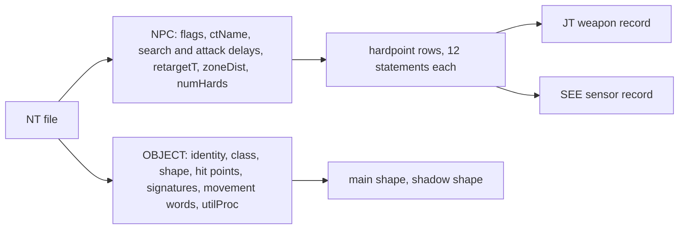

# NT surface units: SAMs, guns, ships, vehicles and men

> **T.O.R.E: Tasteful Opinionated Reverse Engineered.**
> The thing being reverse engineered is the *experience*, not the executable. We
> trace what a player does and what the game does back, down to the numbers they
> would notice. How the original code achieved it is history: useful evidence,
> never a blueprint. If a sentence below reads like an instruction to reproduce
> the original's internals, it is out of date.
> <!-- tore-header v2 -->

Research notes for the surface-AI round, implementation mode, 2026-10-10. The
retail archive holds 84 `*.NT` active-object records. This page is the byte
and field contract for the bounded reader `tore_formats::surface_unit`
(`crates/tore-formats/src/surface_unit.rs`). What a player sees and the numbers
the AI uses are in [the surface defenses spec](../spec/surface-defenses.md).
Template grammar is in [quick-templates.md](quick-templates.md). Inputs are the
same build as the other format pages (`FA_2.LIB` SHA-256
`fb8b30216e739292489d4872cc440debec334e14f8b9a3d0e340092445246198`).

## Layout

An NT is the OBJECT and NPC blocks of a PT with no PLANE block, then its
hardpoint rows. The field order is `aircraft_schema.rs` (`OBJECT`, `NPC`,
`HARDPOINT`), shared with the aircraft reader; only the statement count differs.



Rules the reader enforces (all 84 retail records satisfy them):

| Rule | Value |
| --- | --- |
| `structType` | 3 (a PT is 5) |
| `typeSize` | 186 plus 24 per hardpoint |
| Root statements | OBJECT then NPC exactly, no PLANE |
| Hardpoints | 0 to 64 rows, equal to `numHards`; zero rows still carry an empty `hards` block |
| Hardpoint store | a `.JT` weapon, a `.SEE` sensor, or none |
| Identity strings | three: short name, long name, `<NAME>.NT` |
| Size | the BRF reader's 1 MiB bound |

`utilProc` stays a symbol name. Nothing is executed.

## Census

| Class word | Meaning | Count | Notes |
| --- | --- | ---: | --- |
| `0x2000` | ship | 32 | 27 `_GVProc`, 5 `_CARRIERProc` |
| `0x1000` | SAM | 17 | SCUD is class SAM and carries four SA-9s |
| `0x0800` | AAA | 8 | includes the invisible A_M1939 barrage zone |
| `0x0400` | tank | 9 | M1, M1975, M2, M113, BMP2, BTR80, T72, T80, T90 |
| `0x0200` | vehicle | 11 | HUMVEE, TRUCK, TANKER, MISTRK, 3 MULEs, LTRACK, SFLUSH, SRDR1, SRDR2 |
| `0x0100` | structure | 1 | GCI radar, `_OBJProc` |
| `0x0040` | other | 6 | TROOPS, SOLDIER, RUNNER, PLTDWN, CATGUY, EJECT |

Hit points run from 1 (A_M1939) and 5 (men, MANPADS teams) through 100 for most
vehicles and SAMs, 650 for the SA-2 and 4,000 for the Iowa and the large
carriers. `damage[0..4]` is 255 on every NT and `dmgType` is 0 on every NT;
neither has a known consumer. `expType` is 21 for ground units, 35 for ships and
the GCI, 15 for men. `craterSize` is 6 for ground units, 0 for ships, 1 or 0 for
men. The debris positions (`dmgDebrisPos`, `dstDebrisPos`) are all zero on NTs.

## Hardpoints: arcs, rest direction, ammunition

| Field | Meaning |
| --- | --- |
| `name` | location byte, 0 on every NT |
| `flags` | 8 or 10; bit `0x2` is not understood |
| `pos.x/y/z` | mount position in hull source units (scale not established) |
| `slewH`, `slewP` | rest direction of the mount, hull relative, heading and pitch |
| `slewLimitH`, `slewLimitP` | half-arc either side of the rest direction |
| `defaultTypeName` | the JT or SEE record |
| `maxItems` | rounds on the mount; 32767 means unlimited |
| `maxWeight` | 0 on every NT |

Angles count 182 units per degree: SA-6 pitch limit 12740 is 70 degrees, a
Nimitz Phalanx arc 21840 is 120 degrees, a full 90 degrees reads 16380 (not
16384). `slewH` is not always 0: the Eisenhower, Clemenceau and Wasp stern mounts read
32760 (180 degrees), the Kitty Hawk's four mounts rest at -60, 135, -90 and 90
degrees, and the Kiev's SA-N-9 rests aft, so a mount's field of fire is its
rest direction plus or minus the limit. Ground launchers have `slewLimitH` 0 and a
pitch limit only (SA-2 2730 = 15 degrees, SA-3 and SA-6 70 degrees, SA-15 0).
Guns carry 32767; missile racks carry the finite load (SA-2 six rails of 1,
SA-6 3, SA-15 8, MANPADS 2). The 22 finite weapon mounts in the archive are
those six SA-2 rails and one rack on each of 16 other launchers.

## Sensor hardpoints

Two NTs name a `.SEE` store instead of a weapon: `GCI.NT` (`GCIR.SEE`) and
`BUTLER.NT` (`REDCR.SEE`, with two `AAA30.JT` guns). They set the NPC flag bit
`0x1`, the only NTs that do. The reader lists sensors among the mounts (the mount
index is the mount's identity for ammunition state) and repeats the first one in
`SurfaceUnit::sensor`.

## Destroyed looks

The records name no damaged shape. By the retail naming rule every ship has
one: the main shape's stem plus `_A.SH` (`nimz.SH` and `NIMZ_A.SH`, `knx.SH` and
`KNX_A.SH`). The import test confirms all 32 exist in `FA_2.LIB`. No ground
unit, SAM or man has a variant shape. The archive holds one wreck object,
`DEST.OT` ("Destroyed Vehicle", shape `dest.SH`); which units leave it is not
traced, and the reader exposes the name only as a candidate. `expType` selects
the explosion ([explosions](explosions.md)).

## Supply trucks

Three soft supply vehicles appear in the equipment lists and templates: TRUCK,
TANKER (fuel) and MISTRK ("SAM-Carrying Truck"). All three are unarmed class
`0x0200` units. The reader tells them apart as `TRUCK_TYPES`; the two that
resupply SAM rails and AAA magazines under the surface-AI plan (TRUCK and
MISTRK) are `SUPPLY_TRUCKS`. That split is a design choice, not retail data.

## NPC block

| Field | Notes |
| --- | --- |
| `searchFrequencyT`, `unreadyAttackT`, `attackT` | quarter seconds ([AI B42](ai.md)); 20/20/20 (SA-15) through 40/144/60 (SA-2, SA-3, SA-6) and 192/176/176 (SCUD) |
| `retargetT` | 32767 except KS-12 and KS-19 (40, 10 s) |
| `zoneDist` | 0 except the A_M1939 barrage zone (195) |
| `ctName` | an AI script name; only SARAN names one (`HYDRO.BI`) |
| `flags` | 1 on the two sensor NTs, otherwise 0 |

## Movement words

`_turnRate`, `_minSpeed`, `_cornerSpeed` and `_maxSpeed` are plain words;
`_acc` and `_dacc` carry the `^` marker. Values: ships turn 910 (5 degrees at
182 per degree), tanks 2730 (15 degrees), speeds 50 for most ships, tanks and
SAM vehicles, 100 for hydrofoils, frigates and LCAC, 10 for men and MANPADS
teams, 0 for fixed guns. Waypoint speeds in the same files are feet per second
(the aircraft cruise values 843, 506, 759, 675 and 421 are exactly 500, 300,
450, 400 and 250 knots), and the plan treats these words as feet per second
too. The unit of the movement words and of `maxVisDist` is not established.

## Not established

- The units of `maxVisDist`, `zoneDist`, `_maxSpeed`, `_turnRate`, `_acc`.
- The meaning of hardpoint `flags` bit `0x2` and of `damage[0..4]`.
- Which units leave `DEST.OT` and when.
- Whether retail activates the 321 SAM and AAA objects standing in the base
  layouts. Nothing in the data marks them inert.

## Reproduce

```sh
cargo run -p tore-formats --example surface_inspect -- gameassets/fighters-anthology/FA_2.LIB nt SA6
cargo run -p tore-formats --example surface_inspect -- gameassets/fighters-anthology/FA_2.LIB summary
cargo test -p tore-formats quick_template::import_tests -- --ignored
```

The ignored tests need the retail install (`TORE_GAME_DIR`, or the
`gameassets` link) and check that all 84 NTs parse, that every shape, store and
damaged look they name exists, and the counts above.
