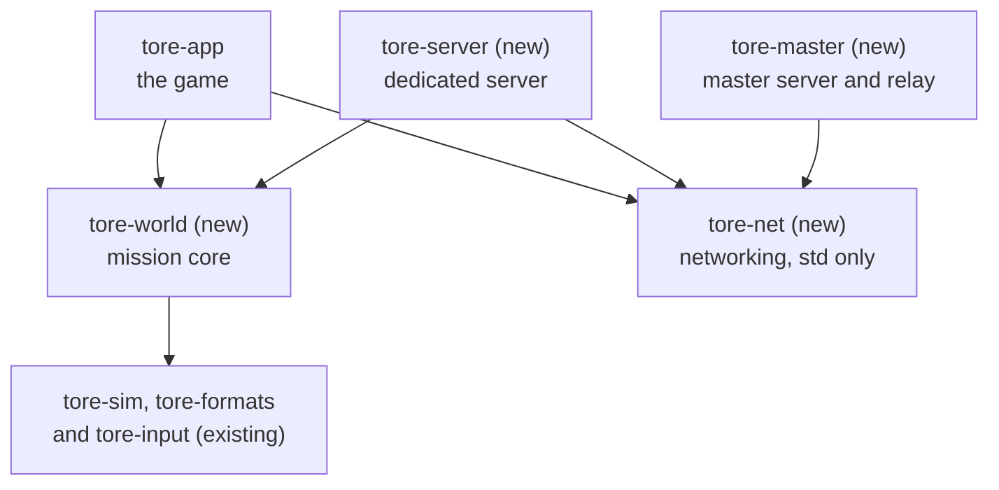
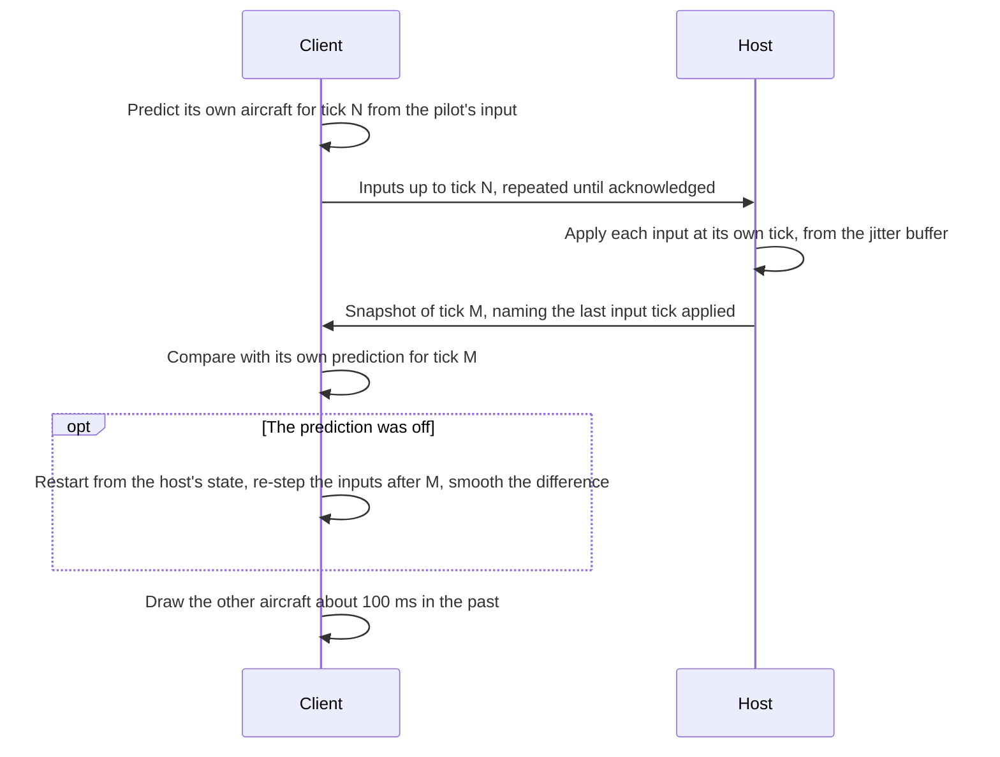
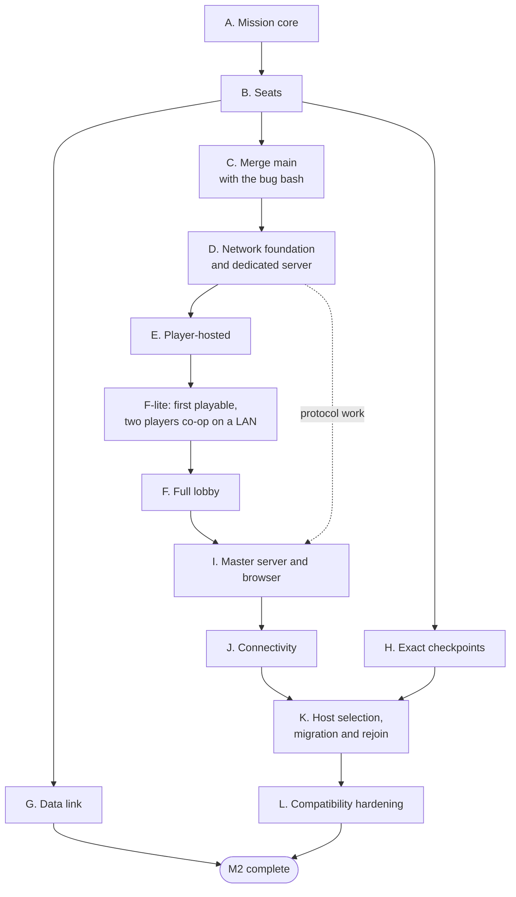

# Multiplayer plan

> **T.O.R.E: Tasteful Opinionated Reverse Engineered.**
> The thing being reverse engineered is the *experience*, not the executable. We
> trace what a player does and what the game does back, down to the numbers they
> would notice. How the original code achieved it is history: useful evidence,
> never a blueprint. If a sentence below reads like an instruction to reproduce
> the original's internals, it is out of date.
> <!-- tore-header v2 -->

Implementation mode, planning pass of 2026-09-28. Stages A, B and C are built:
the mission core is the `tore-world` crate, stepped by the app, and it holds
any number of human seats beside the AI, with handoff between them. Stage D and
the later stages are not built yet. The design of stages A and B (types, tick order, handoff rules) is in the
[architecture guide](ARCHITECTURE.md#mission-core-and-seats), written and
approved by John on 2026-09-28. Stage D's design (crates, host and client,
slices) is in the [architecture guide](ARCHITECTURE.md#network-sessions) with
its three follow-up specs, written and reviewed by John on 2026-09-30. Sequencing is in the [roadmap](ROADMAP.md#milestone-2-multiplayer). What players
experience is in the [multiplayer guide](MULTIPLAYER.md). What Fighters
Anthology did is in the [retail multiplayer spec](spec/multiplayer.md).

John wrote the feature spec on 2026-09-28 and answered the first planning
questions the same day; his decisions are listed in the
[guide](MULTIPLAYER.md#decisions). The stage breakdown, crate layout, numbers
and estimates below are **agent proposals**.

## Contents

- [Summary](#summary)
- [Where the code stands](#where-the-code-stands)
- [Corrections to the feature spec](#corrections-to-the-feature-spec)
- [Architecture](#architecture)
- [Host migration: exact checkpoints](#host-migration-exact-checkpoints)
- [Bandwidth budget](#bandwidth-budget)
- [Stages](#stages)
- [Follow-up specs](#follow-up-specs)
- [Testing](#testing)
- [Risks](#risks)
- [Decisions needed from John](#decisions-needed-from-john)

## Summary

The feature spec holds up. The main surprise is how much groundwork comes
first. The game was built for one human. Its simulation loop lives inside the
windowed app's redraw code, and the player's aircraft is a special case
throughout. Three foundation pieces are needed:

1. **One mission core.** Pull the simulation out of the app into a single
   type that owns the whole mission and steps it one tick at a time, with no
   window, GPU or audio. The dedicated server, the player-hosted game and single
   player all run it.
2. **Seats.** Make every aircraft the same kind of thing, flown either by AI or
   by a human "seat", so several humans can fly in one mission and an aircraft
   can pass between AI and a human mid-flight.
3. **Exact checkpoints.** John chose exact host migration, so the whole mission,
   down to each AI pilot's thinking and random numbers, must be saved and
   restored bit for bit. This is a new serializer covering every simulation
   type. It is needed only for migration, so it can be built alongside the
   networking stages.

Networking then follows the spec's own order. A first playable checkpoint, two
players flying co-op on a LAN, comes after stage F-lite.

Two parts of the spec change:

- Host migration cannot reuse the replay system. It needs the new checkpoints
  ([details](#host-migration-exact-checkpoints)).
- The compatibility check is simpler than the spec assumes, because T.O.R.E
  imports only Fighters Anthology ([details](#corrections-to-the-feature-spec)).

## Where the code stands

Surveyed on main at `0a1e14f` and corrected at `4ad5171` while designing
stages A and B. Line numbers are indicative and will drift. This is the code
before stage A; what stage A changed is in the
[architecture guide](ARCHITECTURE.md#where-the-code-stands).

**Simulation loop.**

- The live tick sequence is written inline in the app's `RedrawRequested`
  handler (`crates/tore-app/src/main.rs`, the `for _ in 0..steps` loop, about
  lines 3049 to 3669). One tick: queued commands, player flight, building
  contact, weather, turbulence, g-effects, combat, airport service, AI, render
  snapshot, then recorder, radio and audio, with HUD messages, audio calls and
  rumble cues interleaved between the simulation steps.
- The weather step also advances each camera's weather presentation, so the
  tick builds up to five cameras from the view, look and head-tracking state.
- No headless path runs that loop. `--ai-probe-ticks` repeats a reduced version
  by hand (player, combat, AI and radio, but no weather, turbulence, g-effects,
  building contact, airport service or crew voice). `--headless-flight` and
  `--replay-input` step the player's flight model alone, and several component
  probes step combat or flight on their own.
- There is no single world type. Mission state is spread over about twenty
  `App` fields: the player's `flight`, `combat`, `ai_wings`, the terrain `world`,
  `airport_service`, `turbulence`, the radio, and others. Five counters advance
  with the tick: the player's flight ticks, combat's tick (the clock most code
  reads), the AI mission's tick, the weather clock (256 units a second) and the
  input tape's count.
- Ticks come from render frames: frame time, capped at 0.25 s, times a time
  scale of 0.5 to 8. Pause comes from the menu, window focus loss, controller
  disconnect or a native fault. There is no simulation thread.

**One human.**

- The player's aircraft is `App.flight` plus player-only fields in the combat
  state (`crates/tore-sim/src/combat/live.rs`): one set of sensors, hit points,
  ammunition, selected weapon, chaff and flare counts, subsystem faults and RWR
  list. The player has the fixed id 0.
- AI aircraft are a different structure, `AiActor` (`crates/tore-sim/src/ai/mission.rs`),
  with their own flight state, sensors and stores, mirrored into a combat
  target row every tick.
- The AI controller refuses to drive a human-controlled aircraft
  (`crates/tore-sim/src/ai/controller.rs`, `Controller::new`). There is no way to
  hand an aircraft between AI and a human, and no way to remove an actor.
- Hit tests treat guns and missiles differently. A gun round can hit any
  aircraft except its owner, on either side, the player included. A missile
  aimed at the player can hit only the player; any other missile can hit any
  AI or ground target, its own launcher included, but never the player
  (`live.rs`, around line 3021).
- The radio's listener is the player. Wing orders reach only the player's wing.
  The debrief shows the player and one wingman.

**Flight control.** AI and the player both fly through the same `PilotInput`
and `step_surface`, which is a good foundation for handoff. Weapons are
different: the player's weapon commands are applied between ticks from window
events, and AI launches come out of the AI as launch events. Airborne AI
aircraft fly the legacy flight model and switch to the hybrid model when they
begin a landing; the player and ground-starting wingmen fly the hybrid model.

**State and determinism.**

- The player's flight state can be cloned and re-stepped, which client
  prediction needs.
- The AI mission types derive nothing and the AI bridge holds a file writer.
- There is no serialization anywhere, and no serde.
- The simulation is deterministic on one machine: seeded random numbers, no wall
  clock, no hash-map iteration. That is what makes exact checkpoints possible.
  It is not bit-identical across platforms, so lockstep networking is not an
  option; the spec's host-authoritative model is the right one.

**Replay.** Replays record what was drawn, 120 frames a second, with quantized
deltas. They cannot restart a simulation: AI state, missile guidance state,
weapon inventories, random number states, comms queues and most flight model
internals are not recorded. The delta coder is private and decodes strictly in
sequence, so one lost packet would break it until the next keyframe. Its
quantization steps (1/32 ft position, 1/64 ft/s velocity) and bit packing are
good models for the network coder. The replay viewer's clock, transport bar and
drone camera are plain data and can drive a live source; the viewer and
playback themselves are tied to a finished file.

**Radio.** Calls are built as lists of recordings with matching text
(`crates/tore-world/src/comms.rs`) and already go into replays. The recordings for
"bearing", "angels" and colour callsigns are imported but unused. There is no
comm rose and no frequencies.

**Wing picture.** There is no shared picture or data link. AI wingmen see
each other's chosen targets by reading each other's controllers directly. Wing
contact sharing and AI leader cooperation are deferred in the AI specs. No
per-aircraft era or data link flag exists.

**Lead succession.** None. When the player dies, the wingmen stop flying
formation and search on their own. When an AI leader dies, nobody is promoted.

**Quick Mission.** A mission is the creator's 35 retail field values, per-wing
objectives and the player's loadout. Two sides of three wings, up to five
aircraft each. The player is hard-wired as Friendly Wing 1's leader. Ground
starts exist for that wing only; there are no carrier starts.

## Corrections to the feature spec

| Spec says | Code says | Change |
| --- | --- | --- |
| Host migration uses the existing replay snapshot system | Replays hold drawing state, rounded, and cannot restart a simulation | New exact checkpoints; replay stays separate, as the spec's own decisions table already says |
| Every peer keeps the latest authoritative snapshot | Relevance filtering means clients hold distant aircraft at low rates | One or two standby hosts receive checkpoints |
| Installs differ: USNF only, ATF Gold, full FA | Only Fighters Anthology imports, from the 1.0 or 1.02F build | Handshake keeps per-content hashes; differences come from the FA build and later mods |
| AI flies through pilot inputs only, so handoff is clean | True for flying; weapons, sensors and stores are separate, and AI and player are different structures | Stage B unifies them |
| Data link is an aircraft component, like the era-gated FCS module | No era or FCS module exists; radar presets are per-record labels | A new per-aircraft capability table |
| The comm rose sends orders | No comm rose; orders are Alt-key commands | v1 keeps Alt-key orders and adds reply keys (John, 2026-09-28) |
| Wing and battle-net freqs follow the existing radio design | One shared channel; the player hears their own flight | Frequencies are new work in stage G |
| Max humans default 30 | Co-op seats humans only on blue: 15 slots | Documented in the guide |
| Respawn back at a base | Ground starts exist only for the player's wing | Airborne respawn near the base until multiplayer ground starts exist |

## Architecture

### Crates

All new code uses only the Rust standard library. No new dependencies are
proposed, in line with the project's small-dependency rule. Stage D's design
adds three library crates the table below did not have (`tore-codec`,
`tore-import`, `tore-session`); the [architecture guide](ARCHITECTURE.md#crates)
lists them and why.

| Crate | Kind | Holds | Depends on |
| --- | --- | --- | --- |
| `tore-world` (new) | library | The mission core: `World`, seats, per-tick inputs and outputs, mission setup from a Quick Mission, checkpoints, and the simulation glue that lives in `tore-app` today: combat composition, the AI bridge, terrain queries, airport service and radio call generation | tore-sim, tore-formats, tore-input |
| `tore-net` (new) | library | UDP transport, reliability and channels, connection handshake, the network simulator for tests, UPnP/NAT-PMP/PCP, master server protocol | tore-codec (std only) |
| `tore-codec`, `tore-import`, `tore-session` (new, stage D) | libraries | Bit coding and hashes; the data folder and import; the game's wire messages, host session and client session ([details](ARCHITECTURE.md#crates)) | std, tore-formats; tore-world and tore-net |
| `tore-server` (new) | binary | Dedicated server: config file, headless import, runs `World` with the network server ([guide](DEDICATED-SERVER.md)) | tore-session, tore-import |
| `tore-master` (new) | binary | Master server: listings, heartbeats, hole-punch introductions, relay, telemetry | tore-net |
| `tore-app` | existing | Rendering, audio, menus, lobby and browser screens, client prediction and interpolation, observer mode | adds tore-world, tore-session, tore-import |

Arrows point from a crate to what it depends on. The picture is simplified: the
existing simulation and data crates are one box, `tore-app` keeps its existing
dependencies, and the table above has the exact lists.

A separate server binary matters beyond tidiness. The game binary links the
audio library, and a Linux server without ALSA installed could not start it.

The app's terrain type is also called `World`; it is renamed `Terrain` in
stage A's first commit (`Theater` is taken by `tore-formats`). The crate and
type names are agent proposals.

### The core's shape

- `World::new(setup)` builds a mission from a Quick Mission setup.
- `World::step(&inputs) -> Output` runs one 120 Hz tick in the current order.
  `inputs` holds one `SeatInput` per human seat. `Output` holds events, radio
  calls, sounds and render data.
- A `SeatInput` is everything a human does in a tick: stick, throttle and
  commands (today's `PilotInput`), trigger, weapon and sensor commands, wing
  orders, replies and chat. Nothing reaches the simulation between ticks any
  more.
- Every aircraft has one record: flight state, stores, sensors, damage,
  countermeasures and a pilot, either `Ai(controller)` or `Human(seat)`. Handoff
  swaps the pilot and keeps everything else.
- `World::checkpoint()` and `World::restore(bytes)` save and load the complete
  mutable state ([below](#host-migration-exact-checkpoints)).

### How the core is driven

| Driver | Clock | Used by |
| --- | --- | --- |
| Render loop | Frame time, pause and time compression, as today | Single player |
| Real-time thread | Its own fixed 120 Hz clock, never paused | Player-hosted and dedicated |

The host's core runs on its own thread so that a stalled window does not freeze
every client. On Windows, dragging a window stops redraws. The host's own seat
is fed straight from local input, so the host plays with no network delay. The
render thread reads finished snapshots.

### Client

- **Prediction.** The client steps its own aircraft ahead with its own inputs
  and keeps a short history. When a snapshot says where the host had it at tick
  N, the client restarts from that state and re-steps its inputs since N. Small
  errors are smoothed out over a few frames instead of snapping.
- **Interpolation.** Other aircraft are drawn about 100 ms in the past, between
  two received snapshots. The delay adapts to jitter.
- **Cockpit state.** Radar contacts, locks, RWR, stores and damage for the
  client's aircraft come from the host. Commands such as target selection go to
  the host as inputs, and the result comes back within one round trip.
- **Gunfire.** Sent as burst events, not individual bullets. Each client draws
  tracers locally and the host decides hits.
- **Joining.** A joining client receives a full snapshot keyframe: everything it
  displays. Clients never need AI internals, so joining does not use
  checkpoints.

One networked tick, from the client's side. Snapshots arrive 30 times a second,
so a snapshot covers several ticks:

### Lag compensation

The host keeps a one-second history of every aircraft's position and attitude.
A gun round fired by a human is tested against targets as they were when the
shooter saw them. The rewind is capped at 250 ms, so a player on a very slow
link cannot hit targets that have long since moved. Missiles are not rewound.
Stage D's design corrects the rewind: measured from the tick the input applies
to, it is the whole round trip plus the interpolation delay, not half the round
trip, and the 250 ms cap applies to the part beyond the delay
([architecture](ARCHITECTURE.md#hits-and-lag-compensation)).

## Host migration: exact checkpoints

John chose exact migration on 2026-09-28. The new host continues from a complete
checkpoint of the mission, not a rebuilt approximation.

**What a checkpoint holds.** Every piece of mutable mission state in `World`:

- Each aircraft's full flight state, including the hybrid model's internals,
  systems, autopilot, wreck and ejection.
- Stores, ammunition, countermeasures, damage and subsystem faults.
- Sensors, selections, locks and RWR.
- Every AI pilot's controller: its decisions, the manoeuvre in progress, memory,
  threat picture, orders and random number state.
- Missiles with their full guidance and seeker state, and gun rounds in flight.
- Combat effects, smoke, debris and the kill ledger.
- Weather, turbulence and every other random number generator.
- Airport service, queued radio calls, objectives and the data link picture.
- Seats, reservations, King, lobby settings and rejoin tokens. Tokens belong to
  the session, not the host machine, so they survive a migration.

It leaves out only what is rebuilt identically or is local to one machine:
terrain, aircraft models and other data loaded from the import (named by content
hash, which the handshake has already checked), log files and render caches.

**How standbys stay current.** Proposal:

1. The host sends each standby a checkpoint every 10 seconds, a setting, in the
   background over the reliable channel.
2. Between checkpoints it sends every input it applied, tick by tick. Only human
   seats have inputs; AI decisions follow from the state.
3. On takeover, the standby restores the latest checkpoint and re-steps the
   logged inputs up to the last tick it received. Ten seconds is 1,200 ticks; at
   an estimated 1 to 2 ms per tick for a full 30-aircraft mission, that is 1 to 3
   seconds of catching up.
4. Clients re-send any inputs the old host never acknowledged. They already keep
   them for prediction.

If catching up proves too slow, a standby can instead simulate in the background
all along, trading CPU for speed. Checkpoint size, encoding time and tick cost
are measured in stage H before choosing.

**Exactness.** When the old and new host share an operating system and processor
type, the new host's state is bit-identical to what the old host would have
computed. Across platforms the restored state is exact, and the catch-up
re-simulation can differ in the last digits; clients correct that like any
prediction error.

**Keeping it complete.** Every future change to simulation state, including AI
work, must also update the checkpoint. Two guards make forgetting fail loudly:

- Each type's encoder destructures all of its fields, so adding a field without
  encoding it is a compile error.
- An equivalence test steps a mission to tick N, checkpoints it, restores it into
  a fresh `World`, steps both copies M more ticks and requires bit-identical
  state. It runs in CI over dogfights with missiles and gun rounds in flight, AI
  landings, ground starts, damaged aircraft and changing weather.

The same checkpoints could later give single player a quick save, or let the
replay viewer hand control back to the player from a recorded moment. Neither is
planned.

## Bandwidth budget

Agent estimates, to be replaced by measurements in stages D and H. The stage D
measurements are in the rows below. Slice D6 (2026-09-30) measured seat 0's
snapshot packets on a three-minute 15 against 15 Quick Mission in the Ukraine
theater, 10 nm apart, every aircraft within 20 nm and so at the full rate,
acknowledged 100 ms later (`crates/tore-session/tests/bandwidth.rs`). Slice D10
measured whole sessions, the player's packets and the host's together, with 2
to 30 bots on the same mission (`crates/tore-session/tests/host_players.rs`,
[the baseline](baselines/net-2026-09-30.md)).

| Item | Estimate | Basis |
| --- | --- | --- |
| One remote aircraft per snapshot | about 20 bytes; **measured about 9** | Replays measure 10 to 12 bytes per aircraft per tick; snapshots are 4 ticks apart and delta against an older acknowledged state. Measured: the Snapshot section's bytes over its records, missiles included, against states 100 to 130 ms old |
| Full 30-aircraft snapshot | about 750 bytes; **measured 177 to 879, mean 350** | Fits one 1,200-byte packet. Measured with 29 other aircraft, up to 31 missiles, 4 pilots and 2 debris pieces; the whole packet with its events 199 to 940 bytes, mean 386. Keeping 256 bytes for messages left a due entity waiting a snapshot in 5 percent of snapshots, all during missile-heavy moments; keeping none, never after the first second |
| The player's own aircraft and cockpit readout per snapshot | 8 bytes of own-state hash and up to 200 bytes of readout per snapshot; 200 to 350 bytes of exact own state when needed and at least once a second; **measured** own state 54 to 363 bytes, mean 80, once a second for a gently turning plane (363 with no baseline); the readout **measured** at 4 to 506 bytes a snapshot, mean 52, against its plain 1,895, within its 200-byte share but for the first second | Stage D's client checks its own aircraft against a hash and receives the exact state only when it cannot match, plus the cockpit's readouts (contacts, RWR, weapon estimates) that only the host can compute ([architecture](ARCHITECTURE.md#the-flight-screen-draws-a-frame)). The host upload rows below are from before the readout; stage D measures them |
| Client download | about 22 KB/s (175 kbit/s) before relevance filtering; **measured 13.2 KB/s (105 kbit/s)** with the readout, before the messages (11.7 KB/s without the readout); **measured (D10) with everything, 10.5 to 13.8 KB/s on average and up to 38 KB/s in a peak second** | 30 snapshots a second; the same at 5 percent loss |
| Client upload | 2 to 4 KB/s; **measured (D10) 2.5 to 2.6 KB/s** with 2 to 30 players on a perfect link, and 3.0 to 4.8 KB/s at round trips of 50 to 300 ms (the synthetic matrix), above the estimate at 300 ms | Inputs sent 60 times a second, each packet repeating every unacknowledged tick, so the upload grows with the round trip up to the 24-tick cap |
| Host upload, 4-player co-op | about 0.5 Mbit/s; **measured (D10) 0.17 Mbit/s with 2 players, 0.79 with 8** | 3 clients |
| Host upload, 15-player co-op | about 2.5 Mbit/s; **measured (D10) 1.49 Mbit/s** (peak second 4.2) | 14 clients; 15 against 15, every player 12.4 KB/s on average |
| Host upload, 30 players | about 5 Mbit/s unfiltered, roughly half with filtering; **measured (D10) 3.32 Mbit/s** (peak second 6.4) | 29 clients; every player 13.8 KB/s on average, 27.5 at the peak |
| Checkpoint | 150 to 600 KB before compression; **measured (H9) 60 KB at the start, 770 KB to 1.0 MB in the first-minute furball, about 500 KB after two and five minutes** | 5 to 20 KB of state per aircraft, AI included; measured 2 to 34 KB on the 15 against 15 mission with real data, all 30 aircraft AI. The furball's peak is flares and chaff (up to 314 KB), the AI's sensor pictures (about 11 KB per actor with 30 alive, and 173 KB kept by destroyed actors) and the rewind history (about 6 KB per aircraft alive); written in 1 to 8 ms, restored in 2 to 9 ms ([baseline](baselines/checkpoint-2026-10-05.md)) |
| Standby stream | 15 to 60 KB/s per standby, plus about 5 KB/s of inputs; **measured (H9) 6 to 100 KB/s of checkpoints**, over the budget in the furball | One checkpoint every 10 seconds. *Agent decision (H9):* no delta coding against the previous one: at the peak only 2 to 3 percent of it is unchanged after 10 seconds. Stage K paces the stream and chooses among the cheaper levers in the [baseline](baselines/checkpoint-2026-10-05.md#delta-coding-not-now-agent-decision). Catch-up of 10 seconds costs what those ticks cost: 0.3 to 0.9 s late in the mission, 1.3 to 6 s in the first 30 seconds on a loaded machine |
| Relay cost per relayed player | about 90 MB per hour | Snapshots and inputs forwarded |
| Relay capacity at 1 TB a month | about 11,000 relayed player-hours a month, or 15 relayed players online around the clock | Assumes only outbound transfer counts, Linode's usual rule; confirm on the account |

Many home connections cannot upload 5 Mbit/s, so large sessions will need a
well-connected host or a dedicated server. The underpowered-host warning is
there for this. The standby stream adds up to about 1 Mbit/s for two standbys
at the high end of the checkpoint estimate, which makes checkpoint size worth
measuring early.

## Stages

Sizes are relative: S, M, L, XL.

| Stage | Work | Acceptance | Size |
| --- | --- | --- | --- |
| A. Mission core | **Built 2026-09-28.** **A1:** gather the mission state into one `World` inside `tore-app` with one `step`, moving the live loop body over unchanged in order. The windowed loop and `--ai-probe-ticks` call it; `--headless-flight` stays the isolated flight-model probe. **A2:** split what mixes simulation with presentation, then move `World` and its simulation glue into `crates/tore-world`. Commit sequence in the [architecture guide](ARCHITECTURE.md#how-stage-a-lands). | A1: existing golden fingerprints, replay export goldens and flight tests are unchanged, and a new headless full-tick fingerprint pins the order from then on. The AI probe switching to the full tick (it gains weather, turbulence and airport service) is a separate commit with re-blessed probe output. A2: `cargo tree -p tore-world` shows no wgpu, winit or cpal. | L |
| B. Seats | **Built 2026-09-29.** One aircraft record for every aircraft with an AI or human pilot. The player-only combat state becomes per-aircraft. Tick-stamped `SeatInput`. A gun round can hit any aircraft except its shooter, and a missile or bomb any aircraft once armed (John, 2026-09-28), subject to friendly fire. AI to human handoff and back, keeping pose, fuel, stores and damage. Radio listener, orders and debrief per seat. Lead succession, to a human in the flight if there is one, otherwise the next AI member (John, 2026-09-28), with "You're the Wingleader now". A multiplayer mission option that puts every aircraft on the hybrid flight model (John, 2026-09-28). | Single-player goldens unchanged, or any one-tick timing shift documented. A headless test flies two humans in each of two wings through a fight. Handoff tests show no jump in position or speed and keep fuel and stores. Succession tests cover a human lead and an AI lead. AI air combat on the hybrid model is checked with AI probe runs against the legacy baseline. | XL |
| C. Merge main with the bug bash | **Built 2026-09-29.** The 66 multiplayer commits of stages A and B were rebuilt one by one on `main` after the overnight bug bash (81dee6b), in segments, each ending at a checkpoint, so history stays linear and every commit builds. The bug bash's player rules were carried per seat: every human-flown aircraft follows them, not only seat 0 (see [how stage C landed](ARCHITECTURE.md#how-stage-c-landed)). Multiplayer's lead succession replaced the bug bash's renumbering (John, 2026-09-29). | Every multiplayer commit rebuilt on main and building. Refactor checkpoints SAME against the new baseline, and the planned changes (art, result call, hit rule, succession, order call, AI credit, no credit for a loss with no shooter) re-measured, every difference explained. The bug bash's battery on the tip: same results as on main apart from those planned changes. | L |
| D. Network foundation and dedicated server | **Built 2026-09-30; John's three-machine LAN test passed on 2026-10-05** (his hands-on report, see the [guide's decisions](MULTIPLAYER.md); the lead's smoke test passed earlier). **Designed and reviewed 2026-09-30:** [design and slices](ARCHITECTURE.md#network-sessions), [wire protocol](formats/net-protocol.md), [netcode numbers](MULTIPLAYER.md#netcode-numbers), [dedicated server](DEDICATED-SERVER.md). `tore-net`: transport, handshake with build and protocol version, reliable and unreliable channels, statistics, network simulator. Snapshot coder with acknowledged-baseline deltas; every packet decodes on its own; full keyframes for joiners. Real-time server driver, input jitter buffer, snapshots at 30 Hz (setting). Client prediction, correction smoothing, interpolation, clock sync. Missile hits by the host; gun lag compensation. `tore-server` runs a Quick Mission from its config file; a development `--connect` flag joins it. Each client keeps a capture of what the network brought and a diagnostics log (John, 2026-09-30). | A dedicated server and two clients on a LAN complete a Quick Mission with AI. Under the simulator at 50, 150 and 300 ms round trip with 0, 2 and 5 percent loss, corrections to the own aircraft and smoothness of others stay within the [limits](MULTIPLAYER.md#netcode-numbers). Bandwidth measured against the budget above. Headless bot clients run in CI. | XL |
| E. Player-hosted | **Designed with F and reviewed by John on 2026-10-01:** [lobby and hosting](ARCHITECTURE.md#lobby-and-hosting). The core runs on a real-time thread inside the host's game; the host's seat is fed directly; the renderer reads snapshots. Single player keeps the render-loop driver. Networked flights become replays: a client's capture converts into a replay smoothed through its updates with hindsight, carrying the network diagnostics (John, 2026-09-30). | A host and one remote client complete a mission. Dragging, minimizing or stalling the host's window does not freeze the client. | M |
| F. Lobby through the Quick Mission creator | **Designed with E and reviewed by John on 2026-10-01:** [lobby and hosting](ARCHITECTURE.md#lobby-and-hosting); phase 1 is everything John's three-machine test needs (John, 2026-10-01: test "the whole shebang" together), phase 2 the rest. Multi menu (host, join by address, player setup). Callsigns and suffixes, King and Host roles, slot picking, every lobby control in the guide, including retail's revival and scoring settings. Lobby and flight chat with retail's keys and receivers. Reply and request keys for human wingmen, with the [controls list](CONTROLS.md) updated. Friend-or-foe cues. Airborne start, join in progress, kick and release, slot locks, PvP sides, friendly fire, respawn rules, basic observer view, no pause or time compression, locked realism, multiplayer debrief. Starts with research into retail multiplayer screen art. **F-lite** is the subset needed to play: join by address, pick a slot, start. | Players join by address, pick slots, fly and debrief together; a late joiner takes an AI aircraft in flight; a kicked player's aircraft returns to AI; a PvP session ends on its kill limit. | L |
| G. Flight data link and radio backing | Per-aircraft capability table for the twelve ported aircraft. Shared picture at 4 Hz, locks and assignments sent at once. Radar, target window, HUD and sort warning cues. AI reads and writes the picture instead of reading other controllers. Voice-only assignments for older aircraft with bearing and range from the receiver. Wing and battle-net frequencies. Replay events. Works in single player. | Single-player flights with AI wingmen show the cues and voice the assignments. A mixed flight gets what its least capable member can receive. | L |
| H. Exact checkpoints | **Built 2026-10-05** ([design and slices](ARCHITECTURE.md#exact-checkpoints), [format](formats/checkpoint.md), [measurements](baselines/checkpoint-2026-10-05.md)): the whole-world equivalence over twelve scenarios runs in the normal suite; the AI golden missions fly identically through 792 restores; a 30-aircraft mission with real data restored at nine moments flies on to the same state; a field added without coding fails to compile (shown by hand). The checkpoint is over the budget in the furball (1.0 MB), and delta coding against the previous checkpoint was measured not to help (agent decision). `World::checkpoint` and `World::restore` for all mutable state, as listed above. Encoders destructure every field. Size, encoding time and tick cost measured; delta coding against the previous checkpoint if the size needs it. | The equivalence test passes bit for bit on every CI platform over the listed scenarios. A field added without encoding fails to compile. Measured checkpoint size and catch-up time recorded against the budget. | XL |
| I. Master server and browser | `tore-master`: listings, 30-second heartbeats, versioned protocol, abuse limits, telemetry with an off switch. Server browser screen. Deployed to jroverton.com. | A session created on one machine appears in another's browser within one heartbeat and disappears within 90 seconds of its host vanishing. Limits hold under a scripted flood test. | M |
| J. Connectivity | UPnP, NAT-PMP and PCP port mapping; IPv6; hole punching through master introductions; relay; path shown to the player and reported. | Connections succeed on a home router, through double NAT, over a phone hotspot (CGNAT) through the relay, and directly over IPv6. | L |
| K. Host selection, migration and rejoin | Candidate scoring, underpowered warning, pinned host, standby hosts fed with checkpoints and inputs, takeover and catch-up, rejoin tokens, reservations. | In the network simulator, the host is cut off mid-dogfight and keeps running privately; the new host's state at the same tick is bit-identical when both run the same platform. With real processes, clients resume within 5 seconds of killing the host, missiles in flight continue, and the debrief keeps kills from before the migration. A dropped player rejoins into their reserved aircraft. | L |
| L. Compatibility hardening | Content manifest: FA build, per-aircraft, theater and weapon hashes, later mods. Plain-language refusals. The lobby offers only content every human has. | A 1.0 player and a 1.02F player see exactly the differences between their builds. A missing aircraft is explained, not a failed join. | S to M |

**Order and checkpoints.** Arrows are dependencies, and height on the page is
not timing: G and H depend only on B. A dotted arrow means work can start early,
not that the stage must finish first.

- Critical path: A, B, C, D, E, F-lite. That gives the **first playable**
  checkpoint: two players flying co-op on a LAN. Stop there for a flying review
  before investing in the internet stages.
- Then the rest of F, then I, J, K and L.
- G and H can each run alongside D to F once B has landed. H must land before K. Stage C (built) only brought main and the bug bash into the branch, so it is not a feature stage.
- I's protocol work can start any time after D.
- Before stage D the branch also takes the single-player
  [aircraft pass](ROADMAP.md#1i-aircraft-pass) (John, 2026-09-30).

**Exit.** The roadmap's exit stands: a multiplayer Quick Mission completed across
separate clients, with evidence recorded. The full-scope acceptance proposed
here is a co-op Quick Mission with at least four humans on at least two
operating systems, one of them relayed, surviving one host migration and one
rejoin, with a debrief listing everyone.

## Follow-up specs

The feature spec leaves implementation detail to follow-up specs per section.
Each one is written at the start of its stage:

| Stage | Spec | Home |
| --- | --- | --- |
| A, B | Mission core and seats: types, tick order, handoff rules | [Architecture](ARCHITECTURE.md#mission-core-and-seats), written 2026-09-28 |
| D | Wire protocol: packets, channels, handshake and snapshot encoding | [net-protocol.md](formats/net-protocol.md), written and reviewed 2026-09-30 |
| D | Netcode numbers: interpolation delay, correction thresholds and smoothing, lag compensation cap, relevance bands | [Multiplayer guide](MULTIPLAYER.md#netcode-numbers), written and reviewed 2026-09-30 |
| D | Dedicated server: config file, import, running and ports | [DEDICATED-SERVER.md](DEDICATED-SERVER.md), written and reviewed 2026-09-30 |
| D | Design: crates, host and client, the flight frame, slices | [Architecture](ARCHITECTURE.md#network-sessions), written and reviewed 2026-09-30 |
| F | Lobby screens and flows, including the retail art research | [Multiplayer guide](MULTIPLAYER.md) and [retail spec](spec/multiplayer.md) |
| G | Data link: capability table, cues, AI use, calls, frequencies | `docs/DATALINK.md` (new) |
| H | Checkpoint format, coverage rules and the equivalence scenarios | `docs/formats/checkpoint.md` (new) |
| I | Master server protocol and operations | `docs/formats/master-protocol.md` and `docs/MASTER-SERVER.md` (new) |
| K | Host scoring and the migration sequence | [Multiplayer guide](MULTIPLAYER.md) |

## Testing

- **Network simulator.** Part of `tore-net`: seeded latency, jitter, loss,
  duplication and reordering between in-process peers. Most netcode tests run
  on it, in CI, with no real network.
- **Multi-seat headless tests.** From stage B, several seats in one `World` with
  scripted inputs.
- **Checkpoint equivalence.** From stage H, in CI on every platform.
- **Headless bots.** Scripted clients for load tests: CPU and bandwidth at 15
  and 30 humans, which also settles the "revisit max humans" decision.
- **Goldens as the refactor guard.** Stages A and B are refactors of single
  player; the existing golden fingerprints and replay goldens must stay the
  same.
- **Cross-platform.** Clients on each operating system against hosts on each.
  Results differ in the last bit between platforms, so prediction corrections
  are measured, not assumed zero.
- **Manual.** LAN, internet through the browser, a phone hotspot for CGNAT, IPv6,
  a host killed mid-fight, a player rejoining.
- **Replays.** Every client's recording carries the network diagnostics, so a
  bad session can be studied afterwards.

## Risks

- **Conflict with AI work.** Stages A and B move and reshape the AI bridge
  (`ai_wings.rs` and friends, about 7,500 lines) and touch `tore-sim/src/ai`.
  Stage H adds encoders to every AI type. John confirmed on 2026-09-28 that no
  other work is going in, so the stages change the AI whenever it makes sense.
- **Single-player regressions.** The one-human assumption runs deep. Stage B
  is the largest and riskiest stage; the goldens are the guard.
- **Checkpoint upkeep.** Exact checkpoints must track every change to
  simulation state for as long as the game is developed. The compile-time and
  equivalence guards turn a forgotten field into a failed build or test, not a
  silent desync, but every future simulation change carries this cost.
- **AI on the hybrid model.** Airborne AI have been tuned on the legacy model.
  Ground-start wingmen already fight on the hybrid model after takeoff, but air
  starts on it are untested, and AI behaviour may differ.
- **Host upload.** Large sessions need more upload than many homes have, and
  standby streams add to it.
- **Platform quirks.** Windows reports an unreachable peer as a
  `ConnectionReset` error on the next UDP receive; the transport must ignore it.
  Unsigned builds trigger firewall prompts on Windows and macOS the first time a
  player hosts.
- **Security.** Unencrypted UDP means passwords and tokens can be seen on the
  network, and addresses can be spoofed. Acceptable for v1 with a trusted host,
  but tokens must still be unguessable. The standard library has no public
  source of operating-system randomness. *Agent proposal:* read `/dev/urandom`
  on Linux and macOS, and on Windows derive tokens from the standard library's
  randomly keyed hasher; otherwise add the small `getrandom` crate, which needs
  John's approval.
- **A public service.** The master server and relay are internet-facing and run
  on jroverton.com: abuse, uptime and transfer limits become an operations job.
- **Scale.** Thirty aircraft with AI and full flight models on one host has
  been measured only in AI fixtures. Load testing comes in stage D.

## Decisions needed from John

Answered on 2026-09-28: retail rules, migration fidelity, flight model and comm
rose ([decisions](MULTIPLAYER.md#decisions)). The review of the stage A and B
design answered the refactor window and the single-player changes the same day.
Still open:

- **Randomness.** Whether to add `getrandom` for rejoin tokens. Not needed until
  stage K.

For stage D, asked and answered on 2026-09-30 (the answers are in the guide's
[decisions](MULTIPLAYER.md#decisions)):

- **Menus on a client** (D8): nothing pauses; the controls go neutral while
  the pause or Esc menu is up.
- **Relevance bands** (D6): 30 updates a second for what is near or tracked,
  twice a second for the rest, smoothed so it never jitters.
- **Recordings of networked flights** (D8): a capture and a diagnostics log in
  stage D; captures convert to smoothed replays in stage E (built: [network
  flights](REPLAYS.md#network-flights)).
- **The LAN acceptance** (D11): agents smoke-test on the development machine,
  then John tests on three machines, macOS, Linux and Windows (done on
  2026-10-05: it works).
- The design's agent proposals were approved as written.

For stages E and F, asked and answered on 2026-10-01 (the answers are in the
guide's [decisions](MULTIPLAYER.md#decisions)): the look of Direct Connection,
a re-import, phase 1's scope, each player's own loadout before Ready, the chat
keys and window, and the return to the lobby after a mission.

The guide's [open questions](MULTIPLAYER.md#open-questions) can be settled at
the start of the stage that needs them.
