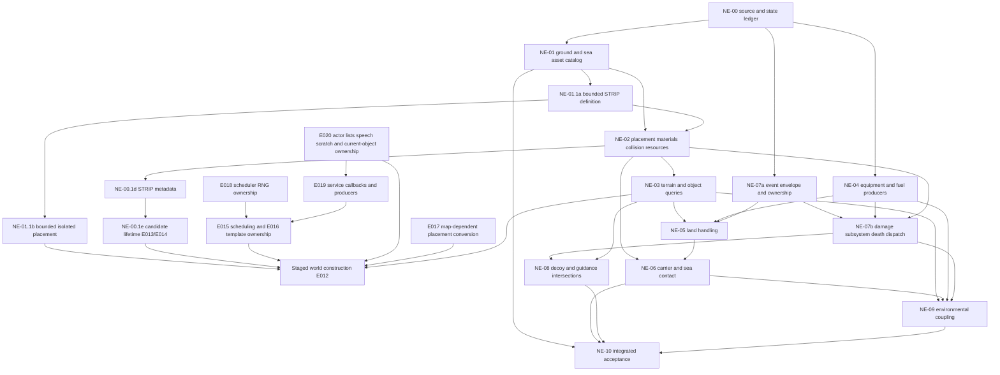

# Native environment and systems implementation plan

**Living plan v11 — 2026-09-15. Owner: John; implementer/reviewer assigned per work package.**
**Status: implementing source/query foundation; live land contact remains gated.**
John explicitly scheduled this pass after the airborne native flight connection.
This is the governing dependency and delivery plan for that continuation. It can
split into linked child plans as dependency trees become known; stable IDs below
must survive those splits. No AI work is included or scheduled.

## 1. Starting point and evidence

Source baseline: reviewed Fighters Anthology media/build identities recorded in
[native flight research](formats/native-flight.md), [theater formats](formats/theater.md)
and [weapons research](formats/weapons.md). Do not apply addresses or asset rules
from another executable edition without a new identity review.

| Area | Current state | Evidence / unresolved boundary |
| --- | --- | --- |
| Native flight | `ed50aba` connects the joined service for F18.PT and RAFALE.PT using `--native-flight-tables DIR`; legacy remains default, hybrid remains separate | [Airborne live baseline](baselines/native-live-flight.md): 28 cases/33,600 replayed updates, spin recovery, loops, GPU checks; no unrestricted native flight claim |
| Contact | Diagnostic query masks, candidate selection, classification, retained height and settling exist; live native flight pauses at unsupported contact | [Joined diagnostic](baselines/native-flight-diagnostic.md), [movement/contact checkpoint](baselines/native-movement-control.md); terrain/object/carrier producers and callbacks remain open |
| World assets | Shared theater profiles and bounded terrain/weather readers; object placement/type resolution is incomplete | [Theater](formats/theater.md), [shapes](formats/objects-and-shapes.md), [coverage](formats/coverage.md); a visible mesh or terrain height is not a validated contact surface |
| Extraction | Shared app/CLI resolver, bounded EALIB/DCL extraction and provenance reports; archive boundaries preserved | [Extraction](EXTRACTION.md); each report describes its invocation, not a cumulative world catalog; full ground/sea dependency discovery remains to do |
| Equipment/fuel | Native live bridge uses existing host actuator/visual travel, 0.5 device-fraction threshold, engine switch and fuel-burn laws | [Flight model](FLIGHT-MODEL.md), [live baseline](baselines/native-live-flight.md); these are fitted bridges, not recovered native timing |
| Damage/systems | Manual systems path has partial native amount/selection/ECM/equipment translations and explicit unknown effects | [Systems baseline](baselines/weapons-systems.md); native live mode excludes combat, complete subsystem effects/death/global RNG remain open |
| Stores/guidance/decoys | Partial manual weapons and creator loadout support; decoy inventory is distinct from deployment and seeker response | [Weapons](formats/weapons.md), [manual acceptance](baselines/manual-weapons.md), [ordnance](ordnance-plan.md); guidance, tanks, decoys and custom-load replay have remaining gates |
| Events | Native departure/contact/high-G outputs retained; complete callbacks are not executed | [Native contracts](formats/native-flight.md); sound, damage, death and lifecycle effects need owned dispatch |
| Environment | Ordinary flight has weather/wind/turbulence components; native live mode forces the native environmental-turbulence bypass | [Weather plan](weather-plan.md), [wind/turbulence](baselines/wind-turbulence-vapor.md); do not apply both turbulence paths |
| Acceptance | Last flight change passed 336 Rust tests, 24 Python tests, Clippy/build/asset checks and Linux Vulkan cockpit/camera/mirror checks | [Live evidence](baselines/native-live-flight.md); these are historical results, not validation of this unimplemented pass. Windows/macOS, manual handling and retail comparisons remain unvalidated |

Supported identities remain **F18.PT = F/A-18D** and **RAFALE.PT = Rafale C**.
Rafale C currently has no hook control. Deck contact, carrier eligibility,
arresting and catapult use must be evaluated separately for each identity. Do
not substitute Rafale M or enable RAFALEE/RAFALEF/F18C to make a test pass.

## 2. Goals, exclusions and completion boundary

### Goals

- Replace the unsupported-contact stop with reviewed terrain/object/deck producers
  and landing/takeoff/ground behavior, one accepted branch at a time.
- Complete a reproducible discovery, extraction and catalog pass for **ground and
  sea/ocean asset families across available FA archives and theater roots**.
  Resolve visual, material, placement, collision and lifecycle dependencies separately.
- Connect native equipment, fuel, damage, event and environmental consumers in
  verified order; remove each fitted bridge only when its replacement is accepted.
- Recover decoy/guidance and subsystem/death/RNG intersections needed for coherent
  player/world behavior, without claiming the whole weapon catalog is implemented.
- Preserve fixed 120 Hz execution, independent movement/body attitude, clean
  free-flight defaults, legacy/hybrid compatibility and cross-platform capability.

### Exclusions

No AI work, autonomous behavior, new flyable aircraft, campaign implementation,
new general menu screens, invented naval flight capability, replacement terrain,
generic wave/rigid-body physics, guessed avionics readings or speculative effects.
Original modules remain inert; never execute imported code. Native source recovery
is the implementation specification. Reference naming patterns, screenshots and
real-world aircraft knowledge alone do not establish native gameplay behavior.

A full asset discovery/import pass means every discovered in-scope root and edge
is accounted for, including failures. It does **not** mean every catalog entry is
runtime-enabled or every retail asset is shipped. All media, generated previews,
raw inventories and source-derived traces stay in ignored `.local/` or application
data. Commit synthetic fixtures and documentation, never retail bytes.

**Exit:** all applicable work-package gates below have evidence, remaining
unsupported branches are explicit, and no fitted/unknown boundary is mislabeled
native. Retail unavailability does not block source-backed implementation, but
retail acceptance remains unavailable. A platform not run cannot be marked passed.
Do not silently change the default adapter or remove compatibility modes.

## 3. Status model and durable records

Apply [behavior provenance](behavior-provenance.md) per component:
**native / fitted / user-directed opinionated / unknown**. Track these completion
columns independently: **source established / translated-tested / runtime connected /
retail compared**. Asset rows additionally track **discovered / extracted / decoded /
visually inspected / collision accepted**. A successful extraction does not imply any later column.

Work status is `planned`, `researching`, `implementing`, `validating`, `blocked`,
`complete`, or `not applicable with evidence`. Record the owner, last update,
blocking edge, next action and evidence URL/path. `Complete` requires the package's
stated gate; partial source evidence cannot complete the package.

### Work register

Packages below retain their own gates. Codex owns the active children; reviewed
static evidence and tests do not constitute independent retail review. Existing
baselines above remain inputs, not acceptance of the new contact producer.

| ID | Package | Depends on | Owner / status | Current next action / exit evidence |
| --- | --- | --- | --- | --- |
| NE-00 | Source, state and dependency ledger | Current baselines | Codex / researching | NE-00.1a/b/c/d/e/f/g/h complete; finish instance/state producers |
| NE-01 | Ground and sea/ocean discovery/import | NE-00 identity rules | Codex / researching | NE-01.1 selected UKR/STRIP lead extracted; full census and closure remain open |
| NE-02 | Coordinates, placement, materials and collision resources | NE-01 selected closures, NE-00 | Unassigned / planned | Resolve one land and one sea family end to end; expand catalog coverage |
| NE-03 | Native terrain/object contact producers | NE-00, NE-02 selected land subset | Codex / researching | NE-03.1 waits on world closure and transactional query state |
| NE-04 | Native equipment and fuel lifecycle | NE-00 | Unassigned / planned | Trace actuator, engine/fuel and refresh producers; replace fitted bridges individually |
| NE-05 | Runway landing, takeoff and ground handling | NE-03, relevant NE-04, NE-07 event core | Unassigned / planned | Both-aircraft land handling matrix and restart/replay evidence |
| NE-06 | Sea/carrier contact and deck handling | NE-02 sea subset, NE-03/04/05, NE-07 event core | Unassigned / planned | Carrier type/eligibility and deck query contract before applicable launch/recovery |
| NE-07 | Event ownership, damage, subsystem and death contracts | NE-00; resources from NE-01/02 and lifecycle interfaces from NE-04 | Unassigned / planned | Event envelope/order first, then source-backed dispatch/effects with RNG audit |
| NE-08 | Decoy/guidance intersections | NE-02 contact/material classification, NE-04, NE-07 | Unassigned / planned | Explicit dispenser-to-seeker chain and supported guidance branch matrix |
| NE-09 | Environmental turbulence/weather interaction | NE-03, NE-06 deck interface, NE-04/07 | Unassigned / planned | Reviewed surface/state/time inputs; one authoritative turbulence coupling |
| NE-10 | Combined replay, compatibility, performance and platforms | Accepted branches of NE-01–09 | Unassigned / planned | Versioned replay and integrated acceptance; retain explicit unavailable cells |

### Active children — updated 2026-09-15

| ID | Owner / status | Source established | Translated/tested | Runtime connected | Retail compared | Gate / next action |
| --- | --- | --- | --- | --- | --- | --- |
| NE-00.1a | Codex / complete | Query/cache ordering, preference and expiry predicates | Two pure helpers and boundary tests | No | Unavailable | Narrow precursor gate: reproducible source slices and tested predicate arithmetic; [evidence](baselines/native-land-foundation.md) |
| NE-00.1b | Codex / complete | Vertical cell planes/normals and shape offset link | Pure geometry, table/offset readers and synthetic tests | No | Unavailable | [Geometry evidence](baselines/native-land-geometry.md); angles followed in NE-00.1c; world assembly remains open |
| NE-00.1c | Codex / complete | Candidate angles and requested-heading slope projection | Typed helpers, synthetic/source-boundary tests and imported-table replay | No | Unavailable | [Angle evidence](baselines/native-land-angles.md); proceed to world closure |
| NE-00.1d | Codex / complete | STRIP add callback, box list, initial placement/query order | Bounded box reader, midpoint tests and original-resource diagnostic | No | Unavailable | Narrow metadata precursor; [evidence](baselines/native-strip.md); full initialization/cleanup and visual closure remain open |
| NE-00.1e | Codex / complete | STRIP setup branch, ordinary final store, failed-add allocation release, ordered candidate removal | Candidate-list operations and capacity/order tests; inert template extracted | No | Unavailable | Narrow lifecycle precursor; [evidence](baselines/native-strip-lifecycle.md); scheduling, full defaults/loader and placement remain open |
| NE-00.1f | Codex / complete | Remaining selected field conversions, post-create alias/store and scheduling insertion | Nationality conversion tested, including map-prefix and byte boundaries | No | Unavailable | Narrow placement precursor; [evidence](baselines/native-strip-placement.md); bounded loader and service effects/RNG still open |
| NE-00.1g | Codex / complete | Service dispatch/tail, priority predicate and shared RNG state | Kind-0 post-callback delay selector and no-draw/word-boundary tests | No | Unavailable | Narrow service-ledger precursor; [evidence](baselines/native-strip-service.md); callback bodies and world producers remain open |
| NE-00.1h | Codex / complete | Airport lookup/reset, three template predicates, comment selection/exit and actor-list operations | Static extraction/ledger only | No | Unavailable | [Ownership evidence](baselines/native-strip-ownership.md); complete service bodies/producer closure remains open |
| NE-00.1 | Codex / researching | Partial; see NE-00.1a/b/c/d/e/f/g/h | Partial | No | Unavailable | Finish instance initialization; extend transaction ledger |
| NE-01.1a | Codex / complete | STRIP/166 header and explicit shape slot from E003/E004 | Bounded metadata reader, unknown-token retention and malformed-input tests | No | Unavailable | [Definition evidence](baselines/native-strip-definition.md); no full importer/world closure |
| NE-01.1b | Codex / complete | Selected eight-field conversions and post-create exclusion predicates | Bounded isolated placement reader and malformed/width/name tests | No | Unavailable | [Record evidence](baselines/native-strip-record.md); full mission/world closure remains open |
| NE-01.1 | Codex / researching | UKR.MM → STRIP.OT → RUNWAY.SH / _STRIPProc explicit edges | Five resources extracted across two filtered runs; bounded STRIP metadata reader | No | Unavailable | Complete callback/shape/placement closure, archive census and bounded schemas |
| NE-03.1 | Codex / researching | Dual ground-query/cache mutation established | Existing diagnostic only; no new producer | No | Unavailable | Land geometry and staged cache/RNG producer, source-order/rollback tests, then both-aircraft connection |

The parent first slice is not complete. NE-00.1a/b/c/d/e/f/g/h are dependency-ready diagnostic
precursors, not an accepted runway or live contact branch.

### Discovered dependency edges

All rows use the reviewed FA EXE/SMS pair in [the contract](formats/native-land-contact.md)
and the FA_2 archive/resource hashes in [evidence](baselines/native-land-foundation.md).
Geometry/table checks: [NE-00.1b](baselines/native-land-geometry.md).
Owner is Codex; update 2026-09-15. Required edges remain in the denominator.

| Edge | Parent → child / relation | Predicate / field / units | Status / blocked consumer / next action |
| --- | --- | --- | --- |
| E001 | NE-00.1 → NE-03.1 / query order | GetGround 0x47af20 calls touching then height/slope; fixed8 feet / PA | Source established; implement two calls inside ground producer |
| E002 | NE-00.1 → NE-03.1 and NE-10 / mutates state, consumes RNG | 0x42b800 expired-cache branch, +0x27/2b/2d/2f/33; conditional bound-4 draw | Expiry helper tested; stage cache/RNG and test late failure before live connection |
| E003 | NE-01.1 → NE-02 land subset / places | UKR.MM → STRIP.OT; textual pos/angle/flags | Position/angle and final store sourced; selected setup branch recovered; isolated placement reader tested; full loader/default consumers/scheduling and world assembly remain open |
| E004 | STRIP.OT → RUNWAY.SH / visual reference | Explicit shape pointer, FA_2.LIB | Partial projector finds _RUNWAY.PIC (extracted); full drawing/LOD/palette closure and visual inspection remain open |
| E005 | STRIP.OT → _STRIPProc / callback | Explicit utilProc symbol, VA 0x4be640 | Selector/add and airport list reset/removal sourced; candidate operations tested; failed-add release is not complete rollback; event/speech effects open |
| E006 | NE-03.1 → collision terrain / supplies contact | 0x42bdc0 → 0x42bfc0 → 0x42c1a0; 0x42dda0 fallback | Vertical cell arithmetic translated/tested; general traversal unconnected; E008 arithmetic accepted, world assembly remains open |
| E007 | NE-03.1 → resolved type offset / supplies contact | 0x42e0c0 returned record signed word +8, shifted 8 | Source/offset reader established: shape F2 relative record; instance/type resolution remains E003/E005 |
| E008 | E006 → candidate angles / supplies slope | 0x42de60 → 0x411a40 → 0x4c6c30 / sqrt / atan | Source/translation established in NE-00.1c; world dispatcher/cache integration remains open |
| E009 | E006 → square-root seed table / supplies normal | 0x4d65c4, 1024 dwords at 0x51d624 | Extracted with hash; bounded reader and arithmetic tested; no embedded retail data |
| E010 | E005 → F2 box list / initializes airport points and orientations | COLGetBox 0x42e100; STRIPAddProc needs IDs 0x25–2c, 11,17,12,18 | Reader/midpoints tested; all 12 present; transforms/default template/runtime registration remain open |
| E011 | E004 → _RUNWAY.PIC / named face texture | Partial static projection, FA_2.LIB | Extracted with hash; complete drawing reachability and palette/visual acceptance remain open |
| E012 | E003 → E001/E002 / samples before registration | 0x4a7530 initial ground query before 0x4a77f9 callback 0 | Source established; staged world construction must preserve order and rollback failure |
| E013 | E005 → collision candidate lifetime / mutates ordered lists | 0x42e540 register, 0x42e5c0 remove; 900/450 capacities | Translated/tested diagnostic state; stage with world and queries; no automatic type-flag reconciliation |
| E014 | E003/E005 → failed creation / partial cleanup | 0x4a7806 stores then 0x491490 releases last allocation | Source established; no candidate/name cleanup in bounded path; host atomic construction required |
| E015 | E003 → scheduling / registers service | Instance flags & 2, 0x4a7847 → 0x4626b0 | Selected placement requires it; dispatch/priority/tail sourced in NE-00.1g; callback bodies and global producers remain open, without autonomous behavior work |
| E016 | E005 → airport template / supplies defaults | VA 0x50ccc8, 0x134-byte record | Inert template preserved; record lookup/reset and three predicate consumers sourced in NE-00.1h; remaining defaults/callback/attachment ownership unsupported |
| E017 | E003 → map name / converts nationality | 0x4826c7 → 0x483d50; map prefix and byte remap | Diagnostic conversion tested; selected text 137 becomes 138; isolated raw-byte parsing tested; map/world assembly remains open |
| E018 | E015 → shared scheduler RNG / conditional draws | 0x4630b0..0x4631a9, stopped bound-20 / moving bound-8 | Tail predicates sourced and kind-0 selector tested; shared seed/shuffle state established; callback draws/global interleaving remain open |
| E019 | E015 → service callback/body closure | 0x462fbc..0x463036 calls 0x436b30, 0x4631f0 and request 7; STRIP resolves APCommentProc | Dispatch and comment selection/exit sourced; speech reset is observable even on early exit; middle bodies/global producers remain unknown |
| E020 | E019/E016 → NE-07a and staged world / mutable callback state | Actor IDs 0x5713a8/count 0x570ef0; airport +0x127 onward, speech buffers and current-object switches | List operations and early reset/select/exit sourced; instance/clock/speech/selector producers remain open; stage these effects with world/RNG |

Selected catalog status: UKR.MM/T2, STRIP.OT, RUNWAY.SH and _RUNWAY.PIC are discovered/extracted;
existing T2, bounded STRIP metadata and F2 box decoding are available; full OT
semantics, world placement and native drawing closure remain unaccepted. Isolated selected placement inputs are decoded by NE-01.1b. No visual or collision acceptance and no runtime eligibility yet.
No missing-resource absence is asserted from these two filtered extraction passes.
[STRIP callback/metadata contract](formats/native-strip.md) records E003/E005/E010–E012;
its source discovery does not close full world initialization.

NE-07's event envelope is an early interface dependency, not a requirement to
finish all damage before testing a runway. Each package can split into numbered
children (`NE-03.1`, etc.) with distinct prerequisites and gates; identify that
split rather than introducing a circular “finish everything first” dependency.

### Dependency graph

NE-09 may establish land-only behavior before the deck producer exists, retaining
an explicit deck restriction. NE-10 tests and evidence collection run throughout;
its final closure waits for accepted packages. Full catalog discovery can continue
while a completely resolved representative subset proceeds to integration.

### Dependency and asset record templates

For each relationship record:
`edge ID; parent ID; child ID; relation; conditional predicate; source build/archive/hash;
field/caller/offset; unit/frame conversion; required/optional; status; evidence;
blocked consumers; owner; next investigation`. Relations include references,
spawns, places, transforms, selects material, supplies collision, supplies contact,
triggers event, mutates state and consumes RNG. Preserve shared children and cycles;
use visited sets/depth/count limits when resolving. Never flatten away why a resource is required.

For each catalog item record:
`asset ID; family/theater/title; original name; archive and duplicate entry identity;
base/patch candidate; source/decoded hashes and sizes; format/schema; explicit references;
root-to-item chain; placement/units; visual variants/LOD; palette/texture/fog/cutout;
collision/contact role; runtime eligibility; missing/unsupported reason;
preview/contact evidence; last reviewed commit`. Store the full catalog locally;
commit its schema/method, aggregate coverage and synthetic examples.

Missing rows must distinguish **not found in available media**, **not extracted**,
**decode unsupported**, **unresolved native/dynamic reference**, **conflicting version**,
and **confirmed optional/unused**. Do not collapse them to “missing” or silently
substitute another title's asset. Preserve full root-to-failure chains and searched
providers. Revisit affected edges when new media or a dynamic naming rule is found.

## 4. Phased work packages

### NE-00 — Contract and ownership foundation

- [ ] Pin executable, symbol-file and media identities; distinguish FA builds and
  prior reference research. Extend repeatable static extraction only for reviewed ranges.
- [ ] Trace contact entry points (`GetGround`, `MovePlane`, collision and landing
  surface queries) from caller setup through caches, filters, callbacks and writes.
  Existing helper addresses are leads in [native flight](formats/native-flight.md), not a complete producer contract.
- [ ] Build a typed state ledger: configuration versus mutable instance state;
  exact widths/units, initialization/reset, tick ownership, read/write order,
  cache invalidation, and player/type/difficulty predicates.
- [ ] Build event and RNG call ledgers, including no-op/rejected/failed branches;
  distinguish flight RNG, current systems xorshift and unresolved native sharing.
- [ ] Define query failure versus legitimate no-contact semantics and the point
  after which side effects commit. Preserve current rollback until proven replacement.

**Deliverables:** source/caller ledger in `docs/formats/`, NE dependency register,
synthetic expected query scenarios and a minimal event interface proposal.
**Gate:** every input needed for the first land query has a reviewed producer or
an explicitly excluded branch. Unknowns have owners and next research actions.

### NE-01 — Full ground and sea/ocean discovery and import

- [ ] Inventory available FA base/patch archives and all supported theater roots;
  record edition boundaries, duplicate records and unresolved precedence. Inventory
  unsupported containers too; do not imply ESA/ISO/coded-literal support exists.
- [ ] Search both references and native dynamic selection paths, not filename globs
  alone. Examine T2, MM/M/MT placement/type relationships; candidate OT/PT/JT/GAS,
  SH/PL/PE, PIC/PAL/LAY, sound/effect and other referenced formats. Confirm each
  actual schema; a suffix is only a discovery lead.
- [ ] Ground families: terrain tiles/fallback materials, runways/airfields, roads,
  bridges, structures, vehicles, static equipment, vegetation where present,
  damaged/shadow/LOD/effect variants and collision/contact definitions.
- [ ] Sea/ocean families: water/shore/coast/islands, ocean/horizon resources,
  ship/carrier/deck structures, ports/piers/rigs, sea-floor or underwater resources
  only if found, wake/splash/foam/damage/shadow variants only where source-backed.
  Record absence rather than inventing any family.
- [ ] Add bounded reviewed readers and shared CLI/app dependency resolution as
  needed; preserve safe paths, size/count/recursion limits, archive provenance,
  conflict checks, repeat-run reuse and explicit cache refresh/version rules.
- [ ] Extract and catalog the complete discovered in-scope closures; keep invocation
  reports separate from the cumulative catalog. Resolve transitive and conditional
  dependencies, including native external symbols and unknown drawing opcodes.
- [ ] Produce original-asset previews/contact sheets locally, missing-resource
  reports and per-family/theater coverage. Keep visual and collision acceptance separate.

**Deliverables:** repeatable full census and selected runtime profiles, catalog and
edge schema, bounded format fixtures, importer tests, coverage/missing-family report.
**Gate:** every discovered root and edge has a status and provenance; mandatory
closure failures block that runtime family. Known missing assets do not disappear
from the denominator. No fabricated totals or blanket “all ground/sea supported.”

### NE-02 — Placement, scale, materials and collision representation

- [ ] Recover nested object placement/type resolution in M/MM and any actual MT
  dependency, instance identity, parent attachments and spawn/reset rules.
- [ ] Establish per-record axes, handedness, angular units, fixed-point scale,
  origins, elevation datum, bounds and world/deck/local transforms. Verify T2's
  reviewed layout; do not reuse the stale reference reader or a single SH-axis permutation.
- [ ] Separate render mesh, collision bounds/primitives and contact planes; recover
  classification, query masks, filtering, overlap/tie precedence and broad-phase inputs.
- [ ] Preserve source palette, textures, UV/cutout/fog/light flags, normals, LOD,
  damaged/shadow selection and animation inputs. Resolve unknown opcodes before
  claiming the family rendered correctly. Do not infer collision from appearance.
- [ ] Integrate land and sea placements into viewer, flight and camera paths with
  consistent identity and transforms; avoid double attachment/scale/wind application.
- [ ] Compare imported bounds/orientation/materials with source-derived expectations;
  inspect representative and exceptional families, each theater's differences,
  day/night/horizon, near/far, and damage variants. Record missing visual evidence.

**Deliverables:** coordinate/material/contact contracts, shared resource-to-instance
mapping, synthetic transforms and imported visual/collision overlays in local evidence.
**Gate:** one resolved land surface and one resolved sea/ship family have independent
visual and collision validation; catalog-wide unsupported cases remain explicit.

### NE-03 — Terrain and object contact producers

- [ ] Recover terrain interpolation/tessellation, class/water interpretation,
  elevation/normal/slope queries, borders, masks and cache invalidation.
- [ ] Connect initial cached ground, post-movement ground and later touching query
  at their source positions/times. Preserve one-foot tolerance, retained-height
  behavior and classification/settle ordering only where their producers agree.
- [ ] Recover terrain/object overlap, candidate order, preferred landing surfaces,
  no-surface result, object disappearance and moving-surface ownership contracts.
- [ ] Test flat/sloped surfaces, seams/edges, bridges/overhangs, water transitions,
  high-speed crossing, reverse motion and malformed/missing query data. Native
  sweep/discrete behavior must be researched, not replaced by guessed collision physics.
- [ ] Replace only the accepted land branch of the live contact stop; keep unknown
  classes/decks unavailable. Return typed contact state/events, not direct audio or rendering calls.

**Deliverables:** native-backed terrain/object query producer, deterministic fixtures,
per-query trace and one end-to-end contact baseline for both aircraft.
**Gate:** producer → classification → settling → state commit passes boundary tests;
no arbitrary triangle becomes a validated runway. Rollback and event commit ordering hold.

### NE-04 — Equipment, engine and fuel lifecycles

- [ ] Inventory every currently adapted rule: throttle slew, control-surface visual
  filtering, gear/flap/brake/hook travel, 0.5 activation threshold, exhaust response,
  engine/afterburner switch/threshold, fuel-rate calculation and source-field refresh cadence.
- [ ] Trace native commands, state transitions, deployment limits, rates, timers,
  locks/damage inhibition and aerodynamic versus visual consumers independently.
- [ ] Recover fuel units, per-engine versus total consumption, throttle/afterburner
  scaling, exhaustion/shutdown/restart, internal/external priority, transfer/leak,
  tank empty/body mass, jettison and damage interactions where native support exists.
- [ ] Unify accepted loadout, fuel, ammunition/store bodies and release mass without
  double counting. Validate overweight and capacity boundaries before state replacement.
- [ ] Replace each bridge behind its own acceptance row; retain named fitted behavior
  in compatibility modes. Keep actual device state, commanded state and artwork deflection distinct.

**Deliverables:** producer/consumer and timing ledger, aircraft-owned configuration
extensions, caller-owned lifecycle state and replacement evidence for each bridge.
**Gate:** timing, reversal/interruption, empty/full/transfer/jettison and restart tests
pass for both aircraft; unknown subsystem/device behavior stays unavailable.

### NE-05 — Landing, takeoff and ground handling

- [ ] Use verified runway/type/placement roots, explicit wind and slope/contact
  inputs, and native aircraft eligibility; no arbitrary theater start point is a runway.
- [ ] Exercise approach/touchdown, bounce or settling if source-backed, rollout,
  steering, braking, stops, reverse/low-speed cases, runway edge/off-runway contact,
  takeoff roll, rotation, liftoff and rejected takeoff.
- [ ] Trace wheel/gear and ground latch transitions, bank/pitch/rate correction,
  contact damage/callbacks and release back to airborne state. Preserve source
  display versus movement ordering and temporary auxiliary-rate subtraction.
- [ ] Cover gear up/transition/failure, flap/brake states, loading, wind, excessive
  sink/side/forward speed and pitch/bank limits, pause/restart and valid start setup.

**Deliverables:** land handling scenario suite and explicit supported-start path for
F/A-18D and Rafale C, plus instrument/animation/event traces and Linux captures.
**Gate:** both-aircraft land matrix passes with no adapted force secretly replacing
an unknown branch; fatal/nonfatal outcomes agree with the accepted event/damage contract.

### NE-06 — Sea, carrier and deck handling

- [ ] Identify exact carrier/ship definitions and their deck, hull, island, collision,
  attachment and material dependencies. Do not choose a carrier from appearance alone.
- [ ] Recover water-versus-deck query precedence, local/world transforms, deck height
  and motion/velocity contributions, grounded attachment, deck edge and hull collision.
  Static or explicitly scripted motion fixtures may test transforms; no autonomous systems.
- [ ] Establish eligibility independently: ordinary deck collision/contact, supported
  starts, wheel handling, hook/arresting, wire geometry/release, catapult attach/launch
  and any launch prerequisites. Investigate these as questions, not assumed FA capabilities.
- [ ] For F/A-18D, implement only reviewed applicable launch/recovery branches.
  For Rafale C, validate shared water/deck contact and documented rejection of
  unsupported operations; do not invent a hook or assert naval compatibility.
- [ ] Cover deck-relative wind, stopped/moving surface, taxi/edge departure, failed
  arrest or bolter where supported, water impact, ship removal/death and attachment reset.

**Deliverables:** carrier dependency closure and eligibility matrix, typed deck
producer/attachment state, supported handling tests and sea/deck visual baseline.
**Gate:** no hull/deck/sea ambiguity, double motion or attachment leak; unsupported
per-aircraft operations are explicitly rejected with evidence rather than aliased.

### NE-07 — Event dispatch, damage, subsystem effects and death

- [ ] Define immutable event records and a single ordered commit/dispatch boundary:
  source trigger, actor/object ID, tick, payload units, repeat/edge semantics and owner.
  Decide callback ordering from native evidence before dispatching side effects.
- [ ] Connect accepted contact, departure and high-G events to their verified
  consumers. Identify original sound/effect resources, gain/retrigger/stop behavior;
  absence of a mapping remains a gap. Haptic choices remain separately authored.
- [ ] Trace subsystem selection eligibility, repeat limits, difficulty and caller
  percentages, forced damage, station failures and every side effect that changes
  engine, fuel, controls, hydraulics, sensors, electrical/device or decoy state.
- [ ] Keep unknown effect indices observable with their source identity. A selected
  damage entry is not evidence that its downstream effect is implemented.
- [ ] Resolve native player protection, zero-HP policy, delayed fire/destruction,
  catastrophic branches, ejection if present, damaged variants/debris, contact on
  dead objects, effect lifetime and cleanup. Do not promote the adapter's immediate
  death policy or xorshift stream to native acceptance.
- [ ] Account for every RNG draw, including suppressed events/repeated hits;
  separate authoritative effects from audio/haptic/view randomness. Replay must
  neither duplicate dispatch nor suppress required authoritative state changes.

**Deliverables:** NE-07a event envelope/order and transactional dispatcher; NE-07b
subsystem-effect/death mapping, original dependency closure and RNG ledger.
**Gate:** deterministic fault injection covers simultaneous contact/damage/fuel-out,
repeat hits, failure rollback, once-only death and cleanup; unverified effects stay excluded.

### NE-08 — Decoys and guidance intersections

- [ ] Map dispenser command → eligibility/inventory → spawn position/velocity →
  geometry/signature → lifetime → seeker evaluation → diversion/reacquisition → cleanup.
  Inventory counts alone do not establish a working chaff/flare lifecycle.
- [ ] Recover power/fault/rate limits, emissions and initial motion, wind/surface
  effects, native visual/audio resources and actual RNG/time consumers.
- [ ] Build a per-supported-store guidance matrix: target classes, launch versus
  tracking gates, active/semi-active distinctions, illumination, activation timing,
  lead/PN or other reviewed law, lost track/reacquisition and fuze/impact outcomes.
- [ ] Audit terrain/object/water/deck masking, signature/ECM/decoy terms, aspect,
  sun/weather inputs and dead/removed targets only where source consumers exist.
  Visible fog does not automatically imply a sensor attenuation rule.
- [ ] Use explicit manual/static/scripted fixtures and existing supported stores;
  list other catalog branches without silently enabling or substituting them.

**Deliverables:** dependency and guidance-support matrix, complete accepted decoy
chain, source-based seeker cases and isolated live/manual integration evidence.
**Gate:** inventory/launch/lifetime/mass effects are consistent; failed or removed
contacts cannot leave stale locks; identical seeds/events reproduce accepted outcomes.

### NE-09 — Environmental turbulence and weather interaction

- [ ] Trace `_FMTurbulence` and all setup/reset/call sites against the actual joined
  tick; connect accepted surface/daylight/speed/altitude/device/deck inputs.
- [ ] Replace the source disable-bit restriction only after enabled-branch state,
  cadence, RNG draws, offset/rate units and force-versus-movement ordering are known.
- [ ] Recover nearby-object/wake input geometry with explicit supplied instances;
  retain per-aircraft coefficients/state, no camera-owned or duplicate sampling.
- [ ] Keep steady wind/advection, control disturbance, environmental turbulence,
  maneuver sound and presentation shake independently traceable. Apply motion once.
- [ ] Verify source weather/time/preferences, land/water/deck gates, camera-local
  sampling, pause/restart, and any demonstrated sensor/material interaction.
  Broader sky/cloud/vapor work stays in the weather plan unless a dependency is recorded here.

**Deliverables:** full enabled environmental branch, native producer inputs,
no-double-application tests, both-aircraft loop/contact/weather evidence.
**Gate:** enabling/disabling presentation, changing camera count/order or muting
feedback cannot alter authoritative RNG/flight state; only source-authorized gates do.

### NE-10 — Replay, compatibility, performance and final acceptance

- [ ] Version recorded configuration/media identities, accepted start/loadout,
  source tables, schema, adapter selection, clocks/remainders, RNG streams, instance
  IDs, contact caches/deck attachment, equipment/fuel/damage, events, guidance/decoy state.
- [ ] Record external inputs and ordering sufficiently to reconstruct producer
  output; reject incompatible media/configuration instead of silently restoring PT defaults.
- [ ] Test same-input replay, checkpoint restore, restart/aircraft/theater switch,
  pause/focus loss, interrupted commands, failure rollback and different render cadence.
  Distinguish same-host determinism from cross-platform numerical equivalence.
- [ ] Run legacy, hybrid and restricted/new native cases for each identity, plus
  existing importer validation, manual systems and creator/loadout regressions.
  Do not remove old paths, change defaults or enable unsupported missions as a side effect.
- [ ] Measure import/startup cost, memory/catalog growth, query counts, fixed-tick
  cost, candidate scaling, event/decoy/effect lifetime bounds and frame intervals.
  Keep rendering interpolation outside state and readbacks asynchronous in live panels.
  Declare workload sizes and per-host budgets before changes; measure tick headroom
  against the 8.33 ms fixed-step interval and investigate repeatable regressions.
  Exercise repeated spawn/death/decoy cycles until retained state reaches a bounded plateau.
- [ ] Complete Linux CPU/GPU/manual handling and Windows/macOS build/test/runtime
  checks, with renderer/audio/input availability recorded separately.

**Deliverables:** versioned replay contract, comparative compatibility results,
performance/correctness baselines and explicit platform/retail gap register.
**Gate:** no unbounded resource growth, duplicate forces/events or rendering-dependent
state; all applicable matrix cells below have evidence or an explicit unresolved status.

## 5. File and module touchpoints

Paths below exist today; proposed new modules must be named as proposed until added.
Keep bounded parsing in `tore-formats`, shared simulation in `tore-sim`, rendering
and input routing in the app. Do not move world behavior into UI code.

| Area | Existing touchpoints | Intended responsibility |
| --- | --- | --- |
| Extraction/catalog | [Python entry](../tools/extract_assets.py), [inventory](../tools/explore_assets.py), [extractor](../crates/tore-extract/src/main.rs), [app assets](../crates/tore-app/src/assets.rs) | Shared resolution, safe extraction, cache and provenance; extend catalog/profile facilities after schema review |
| Formats/world geometry | [theater reader](../crates/tore-formats/src/theater.rs), [module reader](../crates/tore-formats/src/module.rs), [shape reader](../crates/tore-formats/src/shape.rs), [aircraft](../crates/tore-formats/src/aircraft.rs), [weapons](../crates/tore-formats/src/weapons.rs) | Bounded placement/type/material/contact references; new object schema modules only when reviewed |
| Native research | [static flight pass](../tools/extract_native_flight.py), [query helpers](../crates/tore-formats/src/flight_model/queries.rs), [ground helpers](../crates/tore-formats/src/flight_model/ground.rs), [joined service](../crates/tore-formats/src/flight_model/diagnostic.rs) | Recover producer/callback contracts without executing modules |
| Simulation/ownership | [native runtime](../crates/tore-sim/src/native.rs), [flight state](../crates/tore-sim/src/flight.rs), [configuration](../crates/tore-sim/src/models/config.rs), [models](../crates/tore-sim/src/models/mod.rs), [telemetry](../crates/tore-sim/src/telemetry.rs) | Typed source configuration and caller-owned contact/equipment/fuel state; proposed shared world/contact services |
| Systems/events | [systems helpers](../crates/tore-sim/src/combat/systems.rs), [live systems](../crates/tore-sim/src/combat/live.rs), [loadout](../crates/tore-sim/src/combat/loadout.rs), [app combat](../crates/tore-app/src/combat.rs), [combat tape](../crates/tore-app/src/combat_tape.rs) | Decoy/guidance/damage lifecycle, source event dispatch, recording and accepted launch state |
| Environment/rendering | [sim environment](../crates/tore-sim/src/environment.rs), [turbulence](../crates/tore-sim/src/turbulence.rs), [terrain app](../crates/tore-app/src/terrain.rs), [weather app](../crates/tore-app/src/weather.rs), [main](../crates/tore-app/src/main.rs) | Native world producers versus camera-local draw/sampling, lifecycle hookup and restrictions |
| Presentation/input | [flight UI](../crates/tore-app/src/flight_ui.rs), [animation](../crates/tore-app/src/aircraft_animation.rs), [Rafale animation](../crates/tore-app/src/rafale_animation.rs), [input crate](../crates/tore-input/src/lib.rs), [performance](../crates/tore-app/src/performance.rs) | Actual-state display, matching release/pause, separate aircraft rigs, bounded measurements |
| Validation | [native live probe](../crates/tore-sim/examples/native_live.rs), [adapter probe](../crates/tore-sim/examples/response_probe.rs), [diagnostic probe](../crates/tore-formats/examples/native_flight.rs) | Extend accepted scenarios without weakening existing assertions |

## 6. Test and evidence matrix

Each row needs a result for **F/A-18D and Rafale C**, with `not applicable` backed
by source eligibility. Land/sea asset tests additionally record family, theater,
archive/build and selected variants. Start all new-pass results as **not run**.

| ID | Tests / scenarios | Required evidence and acceptance |
| --- | --- | --- |
| T01 | Archive/schema bounds, duplicate versions, dynamic/shared/cyclic/missing references, malformed paths and size limits | Synthetic tests plus full local discovery report; all failures classified; selected app/CLI closure agrees |
| T02 | Coordinates/scales, parent transforms, normals, LOD/damage/material variants, world/deck/local round trips | Numeric fixtures and inspected original-asset previews/overlays; no assumed render-to-collision equivalence |
| T03 | Query order/masks/cache, seams/slopes/overlaps, no surface, high-speed and invalid query | Source-derived expected values; per-query trace; deterministic atomic failure |
| T04 | Land landing/takeoff/rollout/steering/braking and failed gear/wind/loading limits | Both-aircraft headless state/event assertions, imported runway identity, Linux visual/manual checks |
| T05 | Water/hull/deck precedence, moving attachment, edge exit, eligible launch/recovery and ineligible operations | Carrier dependency/eligibility matrix, native transforms and event traces; Rafale unsupported operations rejected |
| T06 | Device reversal/timing/faults, engine/afterburner, empty/full fuel, transfer/leak/release mass and refresh | Boundary tests, conservation/accounting checks and explicit replaced-versus-adapted timing rows |
| T07 | Simultaneous contact/damage/fuel-out, repeat suppression, subsystem side effects, delayed/forced death and RNG | Draw/event-order assertions, once-only cleanup, failed-update rollback, no guessed downstream effects |
| T08 | Decoy deploy/failure/exhaustion/lifetime, illumination/activation/track loss/reacquisition, dead targets, terrain/sea intersections | Per-store source matrix and deterministic manual fixtures; catalog visibility does not enable unknown execution |
| T09 | Calm/cardinal/crosswind, turbulence off/on, land/water/deck/day/night, all relevant weather families, full loops | No double motion, source gate boundaries, identical authoritative state under camera/audio/haptic changes |
| T10 | Restart/checkpoint/replay, pause/focus/input release, aircraft/theater changes, version mismatch | Same-host state/RNG/events equal; cross-platform tolerance/bit-identity claims stated explicitly |
| T11 | Legacy/hybrid/native; clean free flight and supported creator/loadout/manual systems paths | Existing and new assertions pass; restrictions and defaults preserved; `--validate-flight` remains separately identified |
| T12 | Catalog/import memory, large candidate sets, repeated death/decoy cleanup, flight frame/tick timing | Bounded scaling and leak checks; matched workload before/after; report CPU wall time separately from GPU/display rate |
| T13 | Linux build/tests, Vulkan flight/mirror/panel and creator/viewer, wide/tall after composition changes; physical controls/audio when affected | Commands, host/GPU/driver, counts/captures and observed handling; no audibility claim from silent tests |
| T14 | Windows and macOS build/tests, importer/path behavior, native runtime/GPU/input/audio | Separate per-platform evidence; cross-compilation is not runtime acceptance; unavailable hardware remains open |
| T15 | Retail source/recording/reference comparison when obtainable | Matched aircraft/loadout/environment/input; distinguish static contract, host replay, visual reference and actual retail trajectory evidence |

Use [development checks](DEVELOPMENT.md) with `--locked` for code changes and
[performance methodology](baselines/flight-performance.md) for repeatable bounded
runs. Future evidence belongs in `docs/baselines/`; future source specifications
belong in `docs/formats/`. Link actual artifacts/methods only when produced.
Repository regressions and the first selected discovery are recorded in the
[new baseline](baselines/native-land-foundation.md). T01–15 remain open for the
end-to-end producer; diagnostic helpers and repeated cell geometry do not close those matrix rows.

## 7. Research questions and risks

| ID | Question / risk | Resolution path / consequence |
| --- | --- | --- |
| Q01 | Which native terrain, object and cached query produces each ground word/flag? | NE-00/03 caller trace; blocks replacing contact stop for that branch |
| Q02 | Which definition/placement resources select valid runways and decks; what are overlap/tie rules? | NE-01/02/03; missing producer blocks runtime surface eligibility |
| Q03 | Are carrier launch/arrest operations present and enabled for each exact PT? | NE-06 eligibility research; absence means unsupported, not a variant substitution |
| Q04 | Which sea resources are geometry/material/effect versus collision or height inputs? | NE-01/02; do not add buoyancy/waves or use ocean artwork as a physical surface |
| Q05 | Which dynamic roots/patch precedence or unsupported format hides mandatory dependencies? | Full catalog edge tracing; isolate blocked families while other resolved families progress |
| Q06 | What initializes/refreshes loaded fields and owns per-device/fuel timing? | NE-04 state ledger; retain named fitted bridge until replacement is accepted |
| Q07 | Which subsystem IDs actually mutate controls/fuel/power; what is native death timing? | NE-07 caller/effect mapping; immediate adapter death is not the oracle |
| Q08 | Which streams and draw ordering are shared across flight, weather, damage and guidance? | NE-00/07/10; do not merge streams or claim native replay from seeded repeatability alone |
| Q09 | How do decoys, guidance, terrain masks, signatures, ECM and weather actually meet? | NE-08/09 consumer trace; prohibit inferred sensor effects from visible fog/water |
| Q10 | Can source callbacks fail after committing effects, and how do host transactions preserve ordering? | Event ledger and rollback tests; avoid replay duplicate sound/damage or disappearing authoritative events |
| Q11 | Does catalog/world growth cause expensive per-tick parsing, allocations, readback or candidate scans? | NE-02/10 typed construction and scaling benchmarks; measure before choosing acceleration structures |
| Q12 | Which precision/overflow/clock differences are gameplay-significant across platforms? | Retain explicit native integer contracts; test boundary cases and document host clock adaptation, per roadmap parity scope |
| Q13 | Retail runs/recordings and Windows/macOS hosts are unavailable or incomplete | Record evidence gaps; proceed with source contracts, never fabricate comparison or platform success |

No material question blocks creating this plan. The first implementation has
research prerequisites, not a request to guess missing native behavior. Escalate
only a real source-choice conflict, unsupported required media or scope decision;
record its blocked edges and continue independent, already scoped documentation/research.

## 8. Decision log

| ID / date | Decision / status | Basis and implications |
| --- | --- | --- |
| D01 / 2026-09-15 | Accepted: plan the next native environment/systems pass now | Initial planning request; documentation-only restriction superseded by D09 |
| D02 / 2026-09-15 | Accepted: no AI work or scope | John's explicit constraint; all dynamic test actors are explicit fixtures |
| D03 / 2026-09-15 | Accepted: retain exact F18.PT and RAFALE.PT identities | Existing aircraft acceptance; Rafale carrier eligibility must be established separately |
| D04 / 2026-09-15 | Accepted: missing retail comparison does not block source-backed progress | Existing user clarification and provenance policy; retail-comparison column stays unavailable |
| D05 / 2026-09-15 | Retained: legacy default, hybrid and native research remain distinct | No default switch requested; source/host bridge provenance and branch restrictions remain explicit |
| D06 / 2026-09-15 | Proposed implementation sequence: NE-00 plus selected land discovery → NE-03 query producer | Smallest verifiable contact slice; full land/sea discovery continues before claiming catalog completion |
| D07 / pending | Exact representative runway, carrier and sea asset families | Select only after build-scoped census and eligibility review; no filenames or naval capability guessed here |
| D08 / pending | Native event/RNG ownership and recording schema | Resolve NE-00/07 contracts before combining flight, weather and systems streams; E002 adds query cache/RNG ownership |
| D09 / 2026-09-15 | Accepted: implement autonomously and commit tested slices locally | John explicitly authorized NE-00.1/01.1/03.1 onward; no AI or push; Jeeves milestone/checkpoint reporting required |
| D10 / 2026-09-15 | Implementation choice: split NE-00.1a predicate/cache research precursor | Newly verified cache mutation prevents treating the existing read-only diagnostic query interface as a native producer; retain live stop until E001/E002/E006/E007 are accepted |
| D11 / 2026-09-15 | Implementation choice: NE-00.1b isolated vertical geometry and shape-offset reader | Preserve source integer/table rounding; E008 arithmetic subsequently closed by NE-00.1c. No live query activation from the imported-cell diagnostic |
| D12 / 2026-09-15 | Implementation choice: NE-00.1d box metadata and STRIP source precursor | E012 reveals initial ground sampling before registration; stage construction/query ownership together. Speech/event callbacks stay unsupported; no autonomous behavior work |
| D13 / 2026-09-15 | Implementation choice: NE-00.1e candidate lifetime/source precursor | Native failed-add allocation release does not demonstrate full rollback; host staging must own candidates, names and query state together. No live activation from list tests |
| D14 / 2026-09-15 | Implementation choice: NE-00.1f placement conversion precursor | Raw nationality differs from loaded byte; selected construction also has post-create alias/store and scheduling state. Keep full loader/service/RNG ownership explicit |
| D15 / 2026-09-15 | Accepted: push existing tested commits, then continue implementation | John explicitly authorized push; origin/main advanced through 4447e90. Continue coherent local slices; no AI or carrier gate change |
| D16 / 2026-09-15 | Implementation choice: NE-01.1a bounded definition metadata | Reuse reviewed OBJECT grammar, reject extra shape slots and preserve unknown tokens. Metadata success does not establish full resource/runtime closure |
| D17 / 2026-09-15 | Implementation choice: NE-00.1g service ledger and kind-0 delay selector | Make shared RNG and request-7 dependency explicit; diagnostic samples do not authorize skipping callbacks or native lookup ordering |
| D18 / 2026-09-15 | Implementation choice: NE-01.1b isolated selected placement | Strict host grammar rejects unknown fields; source conversion does not initialize a world or bypass the initial ground query. Selected optional post-create effects excluded by reviewed reset/kind predicates |
| D19 / 2026-09-15 | Implementation choice: NE-00.1h bounded ownership source ledger | Comment suppression still clears speech buffers; native airport records and actor lists must have staged lifetime/state. No no-op callback or empty-list assumption from no-AI scope |

Future decisions include date, requester/reviewer, evidence, accepted/proposed/
superseded state, affected IDs, rejected alternatives if relevant and migration
impact. User-directed deviations need the exact user request; ordinary agent
implementation choices must not be attributed to John.

## 9. Updating and closing this living plan

1. Before a slice, read its linked guides and source contracts. Select one stable
   package/child ID, owner, prerequisites and explicit completion gate.
2. Add discovered nodes/edges immediately. Preserve unresolved and superseded
   relationships with reasons; update the graph and blocked consumers together.
3. Keep source facts in format docs, sequence/interfaces here, measured results in
   baselines. Link child documents instead of duplicating growing specifications.
4. When code/import behavior changes, update current coverage, source/translation/
   runtime/retail columns, relevant guide, format coverage and progress in the same
   change. Do not append success beneath contradictory current-status paragraphs.
5. Record commands, build/asset identities, platform, input conditions, test counts,
   artifact locations and limitations for each gate. Do not reuse an earlier pass's
   successful test count as proof of new work.
6. When a gate is blocked, name the failed dependency and next evidence/action;
   when not applicable, cite the actual eligibility contract. Never delete a gap
   just to make a parent checklist complete.
7. On completion, summarize native consumers connected, fitted bridges remaining,
   unknown branches, catalog coverage, platform/retail limitations and the next
   package. Reconcile roadmap/progress and downstream flight/weather/aircraft plans.

### Revision record

| Revision | Change | Validation state |
| --- | --- | --- |
| v11 / 2026-09-15 | NE-00.1h airport/comment ownership and E020/D19 | [Source validation](baselines/native-strip-ownership.md); no callback activation |
| v10 / 2026-09-15 | NE-01.1b isolated placement, selected post-create exclusions and D18 | [Record validation](baselines/native-strip-record.md); parent world/query gates remain open |
| v9 / 2026-09-15 | NE-00.1g service dispatch/delay, E019 and D17 | [Service validation](baselines/native-strip-service.md); full service/world closure remains gated |
| v8 / 2026-09-15 | NE-01.1a bounded STRIP definition; D15 push authorization and D16 metadata scope | [Definition validation](baselines/native-strip-definition.md); full closure and live contact remain gated |
| v7 / 2026-09-15 | NE-00.1f placement conversion; E017/E018 and D14 | [Placement validation](baselines/native-strip-placement.md); staged world/query dependencies remain open |
| v6 / 2026-09-15 | NE-00.1e lifecycle precursor; E013–E016 and D13 | [Lifecycle validation](baselines/native-strip-lifecycle.md); loader/default consumers/scheduling and E004 remain open |
| v5 / 2026-09-15 | NE-00.1d STRIP metadata/source precursor; E010–E012 and D12 | [STRIP validation](baselines/native-strip.md); full initialization, drawing and live queries remain open |
| v4 / 2026-09-15 | NE-00.1c closes E008 arithmetic; next action advances to STRIP world closure | [Angle validation](baselines/native-land-angles.md); live queries remain open |
| v3 / 2026-09-15 | NE-00.1b geometry/offset precursor, E008/E009, D11 | [Geometry validation](baselines/native-land-geometry.md); first live slice remains open |
| v2 / 2026-09-15 | Start authorized implementation; NE-00.1a diagnostic precursor, selected UKR/STRIP discovery, E001–E007 and D09–D10 | [Current checks](baselines/native-land-foundation.md); full first slice still researching |
| v1 / 2026-09-15 | Initial comprehensive plan after `ed50aba`; NE-00–10, dependency/catalog templates, matrix and decisions | Scope/dependency/link review and repository checks passed; implementation work packages remain planned |

Historical v1 planning validation: local file/heading links in the changed Markdown set were
checked; Markdown table widths/fences and `git diff --check` were reviewed.
Formatting, warnings-denied Clippy, 336 existing Rust tests, locked build,
24 Python tests and repo/app/extractor asset guards pass. No fresh GPU or
Windows/macOS acceptance is claimed for this documentation-only change.
Local planning-check logs: `.local/native-environment-plan/`.

## 10. Recommended first implementation slice

**NE-00.1 + NE-01.1 + NE-03.1: one verified land-contact producer, without carrier
activation.** Trace the initial and post-movement ground/touching caller chain,
identify one original land/runway definition and its complete dependency closure,
establish height/class/slope/mask/cached-state semantics, and translate the minimal
producer with synthetic edge/rollback tests. Then connect only that reviewed branch
for both aircraft, retaining explicit rejection elsewhere and collecting a contact
trace. Keep landing damage side effects behind the accepted NE-07a event boundary.

Its deliverable is a tested producer contract and narrow live contact connection,
not takeoff/landing acceptance from a flat height sample. This resolves the current
hard runtime boundary and supplies the foundation for NE-05 and later deck work.

**Current next action:** build on the tested definition and isolated placement
readers to finish E003/E005 type-load/world assembly, E016 template consumers
and ownership, and E019/E020 service bodies, actor/attachment and speech producers with E015/E018 shared
scheduling/RNG state. Selected optional post-create effects are now excluded by
reviewed reset/controller/kind predicates; alias and final store still belong
inside atomic construction. E014 requires host rollback, not an assumption of
native complete cleanup. Independently finish E004 drawing/LOD/palette closure.
E010 metadata and E006/E007/E008 arithmetic are tested; E012 requires initial
ground sampling before registration. Implement E001/E002 staged queries only
after required ownership closure, then enable the reviewed branch for both
aircraft. No external blocker or user decision is currently required; carrier
remains behind NE-06 prerequisites.
