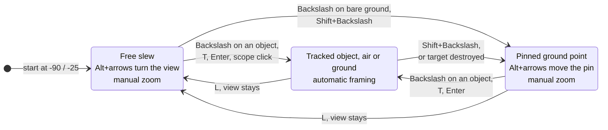

# AC-130 directed guns and linked firing

> **T.O.R.E: Tasteful Opinionated Reverse Engineered.**
> The thing being reverse engineered is the *experience*, not the executable. We
> trace what a player does and what the game does back, down to the numbers they
> would notice. How the original code achieved it is history: useful evidence,
> never a blueprint. If a sentence below reads like an instruction to reproduce
> the original's internals, it is out of date.
> <!-- tore-header v2 -->

Implementation contract, 2026-10-05, extended on 2026-10-09 with the gunsight.
John requested player-selected targets, tracking gun mounts and selectable
linked combinations, then asked for the target camera to become a gunsight with
a pipper, a pinnable ground point, always-on targeting and guns that fire
without a solution. This contract contains source-derived installation and
fitted control/aiming laws. It grants no orbit control or AI pilot changes.

For a player: the AC-130's TARGET CAM page is a gunsight. The camera always
looks somewhere, the three guns follow that point as far as their arcs allow, a
pipper shows where rounds will land, and the trigger always works. The
[target window spec](target-window.md#ac-130-gunsight) covers the page. Retail
has no AC-130 gunsight, sensor slew or ground pin, so none of it claims retail
parity.

- [Selection and controls](#selection-and-controls): the gun group.
- [Tracking and fitted limits](#tracking-and-fitted-limits): arcs, slew, barrels.
- [The gunsight](#the-gunsight): modes, keys, pod track, sensor dome, pipper, aim box.
- [Feedback and shared state](#feedback-and-shared-state): readiness and the network.

## Selection and controls

The AC-130 owns three gun slots in the order C_25, C_40, C_105. These correspond
to the reviewed [source stations](../formats/aircraft-variety.md), with each
station's own weapon, ammunition and burst record. Source count is preserved.
Initial firing membership is the first installed gun alone. Ordinary bracket
weapon selection keeps single-gun operation until the player links more than
one member. Once linked, selecting another gun preserves that group. Selecting
NAV or a non-gun station suspends group fire.

Ctrl+7 selects the next installed gun candidate and arms gun mode. Ctrl+8 adds
or removes that candidate from the group. Removing its last member leaves an
empty group and blocks fire rather than choosing another gun. On a standard
gamepad, hold View (Select) and press the D-pad up to choose the next candidate
or down to toggle it. They sat on View plus the right stick until the gunsight
took the stick for slewing (John, 2026-10-09). Group actions are meaningful only
on AC-130; on the AC-130 the D-pad's range-reset and damage-test uses are off.
Existing combat buttons and left-stick cyclic remain available. These keys and
gestures are agent decisions dated 2026-10-05, moved on 2026-10-09.

The ordinary Fire action releases every enabled gun that has ammunition, is not
failed or lost, and whose own airframe is not in the line of fire. It needs no
ballistic solution: with no target held, a pinned point, a point out of arc or
beyond maximum range, terrain in the way, or the barrels still slewing, the
rounds leave along the actual barrels wherever they point. Those states are
advisory labels on the status line, not blocks. Only SAFE (NAV or an
unarmed selection), LAUNCHER LOST, STATION FAILED, EMPTY, the projectile limit,
an empty group and NO LINE OF FIRE (the gun's own airframe) stop a gun. Eligible
guns begin on the same fixed tick of a new trigger press; thereafter each retains
its own source cadence, ammunition and physical-round scheduling. A blocked or
empty gun does not prevent another member from firing. Trigger release clears
pending rounds for all guns. Group changes also release pending rounds. Restart
recreates initial membership and neutral mount angles.

## Tracking and fitted limits

The guns train on the gunsight's aim point (below) every tick, in every sight
mode, with or without a target. A tracked object is aimed at with its true
position and velocity through the shared gun ballistics solver, including the
weapon's own speed, drop and available life; a pinned or free-slew ground point
is aimed at the same way with no velocity. When the solver finds no solution
(the point is beyond the rounds' reach) the guns still point along the plain
line to the aim point and report MAX RANGE. Firing does not need READY.
The launch direction follows the actual slewed mount. Projectile dispersion
retains the existing fitted 0.25-degree cone. Gun firing range is 0 through 13,000 feet for all three installed records,
using each weapon's source range rather than its longer projectile life.

The source headings establish left-facing neutral orientation at -90 degrees,
with neutral elevation 0. Source arc scalars are converted using the established
65520-angle-unit circle. Their meaning as half-widths rather than total widths
is an explicit fitted interpretation, because the original arc consumer has
not been established. Shipped limits are:

| Gun | Heading range | Elevation range |
| --- | --- | --- |
| C_25 | -150 to -30 degrees | -60 to +60 degrees |
| C_40 | -135 to -45 degrees | -45 to +45 degrees |
| C_105 | -115 to -65 degrees | -45 to +45 degrees |

Both heading and elevation slew at a fitted 30 degrees/second, independently,
at 120 Hz. A gun within a fitted 1-degree error of both desired angles reports ready;
otherwise it reads SLEWING, and it fires either way.
A demand beyond an arc is clamped for visible movement and marked CANNOT BEAR;
the gun fires along the arc limit. Every accepted direction points outward on
the left side; right-facing directions are rejected. Terrain between muzzle and
aim point reads TERRAIN MASK and does not block fire: the rounds meet the
terrain. There is no hidden path through the aircraft to keep
a group synchronized.

Projectile origins and animated barrels share fitted pivots and tips selected
from the original barrel mesh. Source X/right, Y/forward, Z/up units convert to
host feet at 2/3 scale, with host mount order right/up/forward. Raw PT offsets
are not used for this feature because the existing conversion does not align
with the visible barrels.

| Gun | Fitted source pivot | Source tip used to set barrel length |
| --- | --- | --- |
| C_25 | (-9.5, 29, -12) | (-16.5, 28, -14) |
| C_40 | (-11, -7, -11) | (-18, -7, -14) |
| C_105 | (-9, -25, -11.5) | (-21.5, -25, -14.5) |

The actual muzzle is the pivot plus barrel length along actual aim. The barrel
mesh follows the shortest rotation from its source tip-pivot vector to that
same direction. A conservative fitted left-skin plane at local right=-8 feet
blocks a release if its posed muzzle remains inward of that plane. Forward ray
checks also reject the conservative fitted source boxes: left wing
X=-99..-11, Y=-25..1, Z=5..7; inner nacelle X=-33..-18, Y=-25..19,
Z=-6..11; outer nacelle X=-59..-44 with the same Y/Z limits. The wing geometry
lies at source Z=6; the two-unit box thickness is fitted. These checks avoid
upward firing through the wing or nacelles. They can reject a shot that narrowly
clears the detailed original surface, because the boxes are conservative.
This also
blocks some combined extreme heading/elevation demands of C_25 despite their
individual arc limits. Feedback is NO LINE OF FIRE. Geometry hinges and
clearance are agent choices from the reviewed mesh, not original motion
consumers.

## The gunsight

Opinionated (John, 2026-10-09) unless marked. The AC-130's camera line of sight
is fixed-tick sim state, so single player, the multiplayer host and a restored
checkpoint all hold the same sight. It has three modes:

| Mode | Line of sight | Aim point |
| --- | --- | --- |
| Free slew | Body-relative heading and elevation the pilot slews | Where the line meets the ground; with no ground (sky), a point along it at the longest installed gun range (13,000 feet) |
| Pinned | Toward a fixed world ground point; slewing moves the point | The pin |
| Tracked | Toward an object, air or ground, at any range | The object, with lead |

How the sight moves between the modes:

In free slew with nothing held, L travels back to the default -90 / -25 at slew
speed. Backslash, T or Enter on another object while tracking switches to that
object. Whatever the mode, the guns train on the aim point inside their own arcs.

- **Default view**: free slew at heading -90 degrees (abeam left) and elevation
  -25 degrees in the aircraft's own frame, zoom step 3. It is inside every
  gun's arc and clear of the airframe at any bank. Mission start, restart and
  respawn begin there; the guns start neutral and reach it in under a second.
- **Slew**: the seat sends a normalized deflection (-127 to 127, x right, y up)
  and its zoom step (1 to 6) with every tick's input; the host integrates the
  look at 120 Hz. Full deflection turns 0.75 of the camera's vertical field of
  view a second across the screen (the heading rate is divided by the cosine of
  elevation, floored at a quarter): 22.5 degrees a second at step 1 down to
  0.7 at step 6. Heading wraps through a full turn; elevation is held inside
  the camera's gimbal (below) and stops at 89 degrees down (fitted: avoids the
  straight-down singularity). The zoom ladder is 30 degrees tall at step 1
  and halves each step (fitted, agent choice). Slewing while tracking does
  nothing and raises a one-off "L to drop" notice.
- **Backslash** (designate): the object nearest the line of sight within the
  pipper circle's angular radius (9/114 of the vertical field, 0.6 degrees at
  step 3), then the nearest, then the lowest id, is tracked; friendlies,
  destroyed and terrain-masked objects are skipped (agent choice). With no such
  object the ground under the crosshair is pinned. While tracking, Backslash
  keeps the track.
- **Shift+Backslash** (pin): the ground under the crosshair is pinned, also from
  a track (under a ground target, behind an air target). With no ground on the
  line of sight nothing changes and a one-off "no ground point" notice is
  raised.
- **L** (or `;`) drops a target or pin and slews freely from the current view.
  With nothing held, L travels back to the default view at 22.5 degrees a
  second, the fastest sight slew, whatever the zoom; it never snaps (John,
  2026-10-09; the rate is an agent choice). A slew on the way takes over.
- **Pod track**: on the AC-130, T, Shift+T, Enter and a scope click also start
  a sight track, and the radar selection follows the sight (it is set when the
  radar holds the object and cleared otherwise), so the HUD, the scope and the
  guns never disagree. A track ends only on L, a new designation, or the
  object's destruction or removal; the sight then pins the ground under its
  line of sight, so the pilot sees the hit.
- **Always-on Easy targeting**: the AC-130 has Easy targeting's effects
  whatever the session cheat says, including in multiplayer with cheats off,
  because the sight is the aircraft's sensor. Its target camera and HUD square
  follow the sight's track, ground objects included. Other aircraft are
  unchanged.
- **Sensor dome D and the gimbal** (opinionated, John, 2026-10-09). The camera
  looks from the round sensor turret under the left side of the fuselage, just
  forward of the wing root, not from the aircraft's centre. In the model it
  sits in the left belly fairing at source (-13.5, 11, -15.5), 9.0 feet left,
  10.3 feet below and 7.3 feet ahead of the aircraft's origin (fitted from the
  mesh and John's reference photo; `gunship::eye` and `gunship::eye_position`).
  Every sight ray starts there: the camera, the ground under the crosshair
  (Backslash, Shift+Backslash, free slew), the pick's terrain-mask test and the
  auto-pin after a kill. The guns still fire from their own pivots at the
  point those rays find.
  The camera's gimbal is the hemisphere below the aircraft: elevation from the
  aircraft's horizontal plane (0 degrees) down through straight down (held at
  89 degrees), heading free across the whole turn. Slewing up stops at the
  horizon and raises GIMBAL LIMIT (`Notice::GimbalLimit`) every tick the
  pilot pushes against it. A tracked object or a pin above the hemisphere (a
  banked aircraft's far side, high ground) leaves the camera stopped at the
  limit, still looking as near as it can, with GIMBAL LIMIT raised; the aim
  point stays on the true object or pin, so the guns train on it within their
  own arcs. The page shows
  the limit as an eye icon and the words GIMBAL LIMIT. John has not chosen the
  icon yet: the default is the text `<o>`, and a hand-drawn 9 x 5 pixel eyeball
  is behind a one-line switch ([target window spec](target-window.md#ac-130-gunsight)). A pin above the hemisphere can be slewed down but not further up.
  The default view is inside the hemisphere. The boundary is a plain 0
  degrees: ray casts from the dome through the model (AC130.SH, all faces)
  show nothing blocking the horizon over the left half or ahead and astern,
  and only the belly across the right side, 3 to 7 degrees below the horizon
  from azimuth 15 to 165 degrees right of the nose (the real turret ball hangs
  below the skin, so this depends on how far it is placed). The wing (source
  Z 6) and nacelles (Z -6 and up) lie 20 and 9 units above the horizon plane
  and never block below it.
- The line of sight meets the ground by marching in steps of half the height
  above the ground (16 to 1,000 feet) out to 40 nmi, then halving the last
  step twenty times (fitted). Terrain within 25 feet of a point does not mask
  it, so a ground point is not masked by the ground it lies on (fitted).

### Keys

All opinionated (John, 2026-10-09, accepted from the plan's recommendations).
Every key works on the AC-130 only; elsewhere Backslash and Shift+' / Shift+;
report "not implemented yet" (retail's IR/laser designate and bomb camera zoom)
and the rest do nothing.

| Action | Keyboard | Gamepad |
| --- | --- | --- |
| Designate under the crosshair (object, else ground) | Backslash | View + A, tapped |
| Pin the ground under the crosshair | Shift+Backslash | View + A, held half a second |
| Drop the target or pin; again, back to the default view | L or ; | View + B |
| Slew the sight | Alt + arrows (or Alt + keypad 4, 6, 8, 2) | View + right stick |
| Zoom in / out | Shift+' / Shift+; | none |
| Next gun candidate / link or unlink it | Ctrl+7 / Ctrl+8 | View + D-pad up / down |
| Live-fire range reset (developer fixture) | Ctrl+Shift+Backslash | none |

Backslash kept its retail meaning, "designate the object nearest the centre".
The live-fire range reset used to sit on it and now follows the placement rule
"kept its letter and gained Ctrl+Shift". A held slew key starts at a quarter of
full deflection for a quarter second so a short press nudges, then runs at full
rate; a stick is proportional. [Input guide](../INPUT.md#ac-130-gunsight-controls).

### The pipper

The pipper is where rounds from a gun at its actual train land. Each tick the
sim marches the same trajectory the round will fly (launch speed, drop, service
cadence, round life) from the posed muzzle along the actual barrel, for the
candidate gun and every linked gun (`gunship_impact::impact`).

- **Ground, pin or free point**: where the trajectory meets the terrain.
- **Air target**: where the round is when it reaches the target's range, minus
  the target's velocity times the flight time, so correctly led guns put the
  pipper on the target.
- **Spent**: rounds that expire (30 seconds at most) before reaching anything
  report no impact; the page shows MAX RANGE.

Against rounds fired through the combat step the pipper's centre line misses by
under 0.1 foot; real rounds scatter inside the fitted 0.25-degree cone (about
20 feet at 4,500 feet), which the pipper does not show. Rounds hitting objects
or the aircraft are not modelled. The march limits are agent choices. The page
draws each pipper as the fighter HUD's LCOS ring and dot; the candidate's ring
carries a range arc scaled to the gun's 13,000 foot maximum, the other linked
guns a small diamond. How the page draws the states is in the
[target window spec](target-window.md#ac-130-gunsight).

### The aim box on every view

Opinionated (John, 2026-10-09: a box on any view at any time, marking the
target or point of aim, in the style of Easy targeting). It is presentation
only and reads the readout the same way in single player and online.

- **The box** marks the aim point: a square on a tracked object (with the
  friendly X on a friendly), a square with a centre dot on a pin, corner
  brackets on a free-slew point. It is always drawn on the AC-130.
- **The diamond** marks where the guns will actually hit, only when that
  differs from the box: the candidate gun (else the lowest linked gun with a
  pipper) reads SLEWING, CANNOT BEAR, MAX RANGE or MIN RANGE, and the diamond
  is more than one box width from the box.
- **Where**: inside the HUD's square region the HUD draws it; elsewhere in the
  cockpit and in every external, chase and padlock view a floating square
  (while the HUD toggle is on, Shift+U hides it with the rest); the Front View
  and Other View pages draw a 7 pixel square. A box off the screen becomes an
  edge arrow, in the HUD's shape and drawn twice as large on full-screen views,
  sliding in along its ray to stay clear of the instrument windows. Floating
  marks paint only where the canvas is clear, so an instrument window can hide
  one (as it hides Easy targeting's square today). The target camera page is
  the gunsight itself and draws neither. A mission replay has no HUD and shows
  nothing.
- The HUD square covers about 18 degrees either side of the nose and the guns'
  arcs start 30 degrees off it, so a box inside the HUD always comes with the
  diamond.

## Feedback and shared state

The input page exposes the two group actions with AC-130 applicability. A group
label shows each included cannon and the current candidate. Weapon readiness
reports NO TARGET, CANNOT BEAR, SLEWING, MAX RANGE, MIN RANGE, NO LINE OF FIRE
(the gun's own airframe), TERRAIN MASK (terrain between muzzle and aim point),
EMPTY or GROUP EMPTY as applicable. The selected candidate's reason, blocking or
advisory, remains visible even when another group member is ready; every
member fires independently unless it is itself blocked.
The status line shows the advisory states only to tell the pilot a shot is not
solved; none of them holds the trigger.

**Readiness split.** NO LINE OF FIRE is the gun's own airframe (the fitted
boxes above) and blocks. TERRAIN MASK, terrain between muzzle and aim point,
is advisory. The status order puts the airframe check first, so it shows even
when the aim is also out of arc or range; a gun slewing through the blocked
region reads NO LINE OF FIRE for those ticks and fires on the clear ticks
either side. `Readiness::gun_may_fire` is the one place the rule lives.

**Multiplayer** (protocol 21, [wire](../formats/net-protocol.md#the-gunsight)).
The host owns the whole sight, so a seat sends only its slew deflection, zoom
step and the two sight commands, and the host's combat step does everything
else; a standby replays it bit for bit. The owner's readout carries the sight,
look, aim point, pippers and per-gun status. The client turns its own copy of
the camera from its own inputs for a smooth view and corrects to the host's
look (snapping past a tenth of the field of view); the pipper, gun marks and
status are the host's, a round trip late, like the barrels. Other players see
the barrels follow the sight through the entity's gun devices (protocol 18).
The always-on targeting applies even when the King turns cheats off.

Host, clients and replay receive actual heading/elevation and membership. The
six angle values use slot order C_25, C_40, C_105 and interleaved heading/elevation;
heading is divided by pi, elevation by pi/2 for bounded presentation transport.
Membership is a separate three-bit mask. Tracking state is fixed-tick owned;
local animation does not choose the target or decide whether a gun can fire.

## Acceptance and known limits

Use synthetic gun records and targets to check each single cannon, mixed groups,
first-tick linked releases and distinct subsequent cadence, tracking slew/limits,
target changes/loss, trigger release, empty/failed stations, empty groups and
restart. Check command tapes and replicated actual mount angles/membership.
For the gunsight: the default view inside every arc and clear of the airframe,
exact repeatable slew integration, the pin, drop and return rules, the pick,
the pipper against fired rounds, fire with no solution in every advisory state,
a checkpoint restored mid-slew, a client that slews and pins while a second
client's barrels follow, and the headless battery scenarios `ac130-pin-orbit`,
`ac130-fire-no-target` and `ac130-track-out-of-arc`
([baseline](../baselines/ac130-gunsight.md)).
The unavailable retail comparison does not establish retail parity. Original
mount slew, the arc interpretation, gun geometry hinges and muzzle-to-art scale
remain approximate. The next research step is the reviewed bounded hardpoint
arc consumer and explicit source muzzle/shape correspondence.
