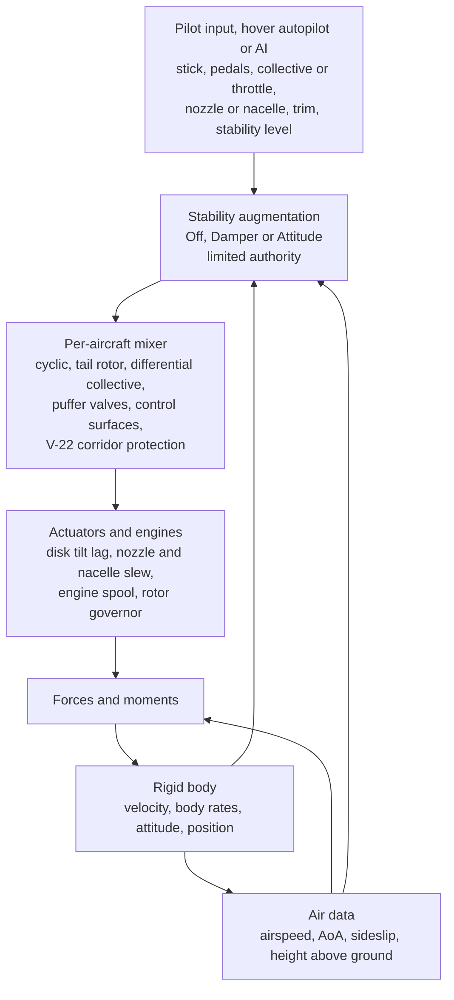
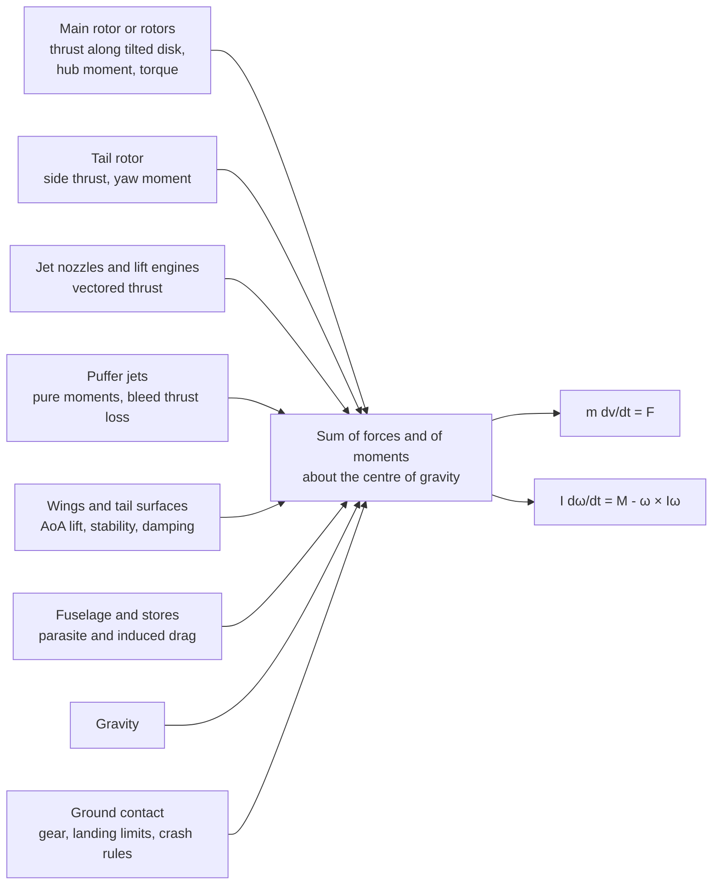
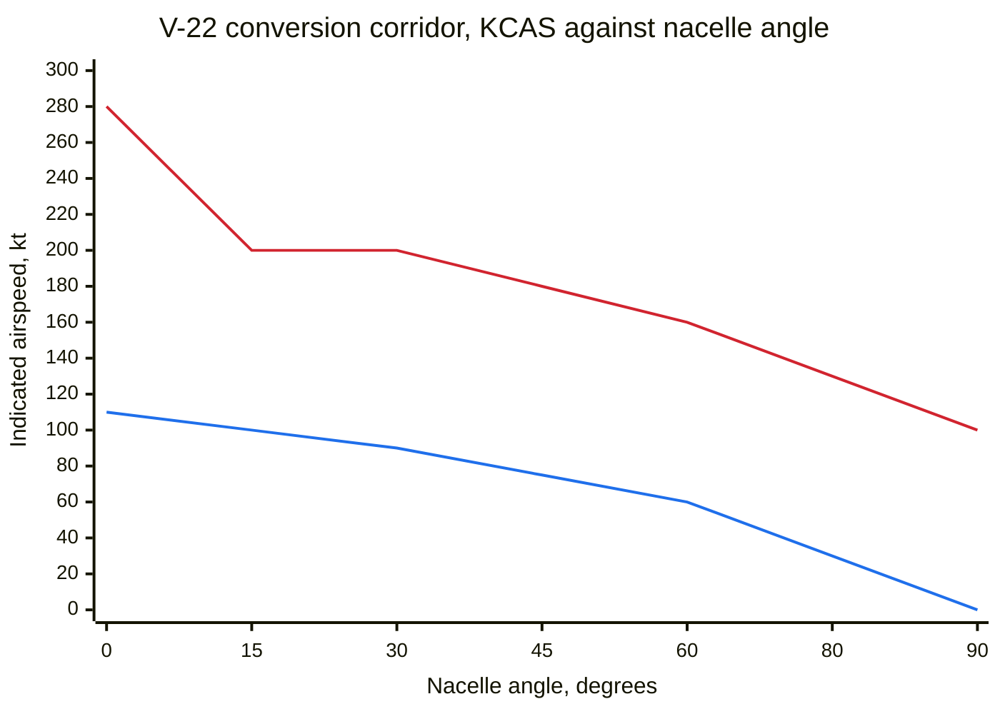
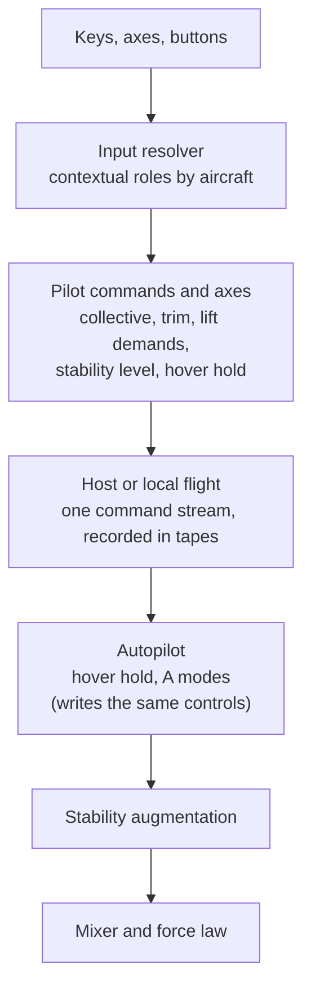

# Powered-lift flight: helicopters, the V-22 and the VTOL jets

> **T.O.R.E: Tasteful Opinionated Reverse Engineered.**
> The thing being reverse engineered is the *experience*, not the executable. We
> trace what a player does and what the game does back, down to the numbers they
> would notice. How the original code achieved it is history: useful evidence,
> never a blueprint. If a sentence below reads like an instruction to reproduce
> the original's internals, it is out of date.
> <!-- tore-header v2 -->

What a player flies and feels in the six powered-lift aircraft: the AV-8 and
Yak-141 (vectoring jets), the V-22 (tiltrotor) and the AH-64, Mi-24 and CH-47
(helicopters). Implementation mode, written after the VTOL and helicopter
overhaul (slices P1 to P10, October 2026). Measured results are in the
[overhaul baseline](../baselines/vtol-overhaul.md); the summary this replaced is
in [variety flight](variety-flight.md#powered-lift-and-controls).

## What the retail game gives us

Retail never let players fly rotorcraft (Fly All: "You can only fly fixed wing
aircraft, not helicopters, blimps, or drones"), so every helicopter and V-22
behaviour here is **opinionated**: requested by John on 2026-10-05 and shaped by
his decisions of 2026-10-08. The STOVL jets were player aircraft with documented
controls and procedures (manual pp. 62, 70-71, 81-83, 153): nozzle keys, a
vertical takeoff, a short takeoff, a hover display and the warning that "when
the aircraft are loaded to combat weight you will never be able to fully
hover". Those are **spec-derived** where the PT records and the manual say so.
Everything else is **fitted** or **opinionated**, labelled in the tables below.

## At a glance

| | AV-8 | Yak-141 | V-22 | AH-64 | Mi-24 | CH-47 |
| --- | --- | --- | --- | --- | --- | --- |
| Lift | Vectored nozzles, 0 to 100 degrees | Same, plus two lift engines | Two proprotors on nacelles, 0 to 97.5 degrees | One main rotor and a tail rotor | One main rotor and a tail rotor, stub wings | Two counter-rotating rotors in tandem |
| Pitch / roll / yaw in a hover | Puffer jets | Puffer jets | Differential collective, cyclic, differential cyclic | Cyclic and tail rotor | Cyclic and tail rotor | Differential collective, lateral cyclic, differential lateral cyclic |
| Wing | Angle-of-attack wing, matched to the conventional model | Same | 110 kt stall wing | None | Stub wings (a quarter of the lift at speed) | None |
| Throttle keys drive | Engine | Engine | Collective (thrust control lever) | Collective | Collective | Collective |
| Hover hold | No | No | Yes (nacelles 75 degrees or more) | Yes | Yes | Yes |
| Torque | n/a | n/a | Cancels | Yaws the nose (AH-64 right, Mi-24 left) | Same | Cancels |

One physics model serves every stability level and every start. The player's
accessibility dial is the stability level (Damper by default) and the
**Easy flight physics** cheat; there is no separate "arcade" law. All of it runs
at the fixed 120 Hz, is deterministic, and is coded in the exact flight state,
so snapshots, checkpoints, prediction and seat handoff continue it bit for bit.

## John's decisions (2026-10-08)

| # | Question | Decision | Where it lives |
| --- | --- | --- | --- |
| 1 | One physics, one dial? | One physics model; the stability level is the accessibility setting. An "easy physics" option under Cheats removes the hazards. Expect tuning | [Stability levels](#stability-levels), [Easy flight physics](#easy-flight-physics) |
| 2 | Hover hold | Only for helicopters and the V-22, an autopilot mode on a free chord, announced, cancelled by any stick, pedal or collective input | [Hover hold](#hover-hold-and-the-a-modes) |
| 3 | Default stability level | Damper | [Stability levels](#stability-levels) |
| 4 | Throttle on helicopters | The throttle controls drive the collective on helicopters and the V-22, engines governed; the dedicated collective bindings stay | [Controls](#controls) |
| 5 | Nozzle keys | Retail keys: Z / X in 10-degree steps and Shift+Z / Shift+X presets on the AV-8 and Yak-141; End / Page Down stay the rudder there | [Controls](#controls) |
| 6 | Rotorcraft numbers | Approved; verify every public figure against reliable sources and cite them; mark what cannot be verified as fitted | [Data sources](#data-sources-and-fitted-values) |
| 7 | AI adapter | The AI flies these aircraft through their inputs on the same physics as the player (second project, not part of this spec) | [variety flight](variety-flight.md#ai-wingmen) |
| 8 | Starts | Airborne starts in trimmed forward flight, not a hover; ground starts consistent with the fixed-wing ones | [Starts](#starts) |
| 9 | V-22 corridor protection | Always on, at every stability level | [V-22](#the-v-22-tiltrotor) |
| 10 | Retail crash warnings | Model the physics behind them; no scripted crash | [Jets](#the-vectoring-jets-av-8-and-yak-141), [ground](#ground-interaction) |
| 11 | HUD | A proper HUD: nozzle degrees, hover display, nacelle angle, rotor speed and torque | [HUD](#hud-and-cues) |
| 12 | Delivery | Player flight first, then the AI | [roadmap](../ROADMAP.md) |

Everything below that is not on this list is an agent decision, labelled as such
in the data tables.

## The physics model

**A six-degree-of-freedom rigid body with lumped-parameter rotors.** The body
rates are state. Moments come from rotors, puffer jets, nozzles and wings;
inertia (a diagonal tensor from per-aircraft radii of gyration, scaled by the
current mass) sets how fast anything responds. There are no attitude limits and
no hidden velocity damping: a helicopter flies forward because its rotor disk
tilts and goes as fast as its power allows; a Harrier's flight path follows its
nose once the wing flies.

Rotors use momentum theory for the inflow, a linear blade-element thrust law, a
rotor-speed state and a first-order disk tilt (flapping lag, blowback and rate
damping). Wings use a fitted angle-of-attack lift curve. There is no blade
element integration around the azimuth and no individual blade flapping. Every
effect a player notices falls out of this: translational lift, ground effect,
power-limited climb and top speed, autorotation, the vortex ring state, torque
and retreating blade stall.

**Integration.** Forces and moments come from the start-of-tick state. The body
rates advance with rate-proportional damping treated implicitly, so the stiff
rotor and stability terms stay stable at 120 Hz with no sub-stepping. The
attitude turns by the mean of the world rotation rate at the start and at a
predicted end of the tick (two rotations a tick, no iteration), which keeps
angular momentum to 1e-12 and a free tumble's energy to a few parts in a million
a minute. Velocity and position follow. There is no random stream (the vortex
ring buffet is a fixed sinusoid of the tick count), no wall clock and no
tolerance-terminated loop.

**What is shared with the conventional hybrid solver.** The envelope queries
(stall speed, G rows, weight-scaled stall), the airframe drag terms, the
systems (hydraulics, engines, fuel, damage), ground contact and the landing
rules, wind advection, turbulence, missile blast, the overspeed check and the
autopilot's modes. Fixed-wing aircraft are untouched: every golden fingerprint
and conventional test is bit-identical to before the overhaul.

### Helicopters: AH-64 and Mi-24

One main rotor and a tail rotor. The AH-64 turns counter-clockwise seen from
above (torque yaws the nose right), the Mi-24 clockwise (left); both are the
conventions of their makers.

- **Thrust** is `rho A (Nr ΩR)² (σ a / 2) [θ0 (1/3 + μ²/2) - λ/2]` with the
  inflow ratio `λ = (Vc + vi) / (Nr ΩR)`. Thrust falls as inflow rises, which
  gives heave damping (a collective step makes a climb rate, with a time
  constant of about 4.5 s, not a runaway) and translational lift.
- **Induced velocity** is state with a 0.1 s lag, aimed at the momentum-theory
  value. In the **vortex ring state** (descent between 0 and twice the hover
  induced velocity `vh` below about `vh` of forward speed) the target rises on a
  fitted curve shaped after Castles and Gray (NACA TN-2474): settling with power
  emerges, cyclic authority drops by up to 30 percent and thrust carries a small
  buffet. Forward speed clears it.
- **Ground effect** multiplies the inflow target by
  `clamp(1 - (R / (k z))², 0.5, 1)` with the hub height `z`, fading out as the
  forward speed passes 1.5 `vh`. The constant `k` is 2.7 (the textbook 4 is too
  strong for the 85 to 92 percent hover power target at half a rotor diameter).
- **Power and rotor speed.** The rotor needs `T (Vc + κ vi) + P0 Nr³ (1 + 4.65
  μ²)` plus the tail rotor's share; the rotor speed obeys
  `dNr/dt = (P_engine - P_required) / (J Ω0² Nr)` with a fitted rotor energy time
  constant (1.8 s AH-64, 2.0 s Mi-24). The engines are **governed** toward 100
  percent with an engine lag, limited by rated power, altitude lapse, damage and
  engine count. With no engine, lowering the collective lets the descent feed the
  rotor (**autorotation**: rotor speed settles near 100 percent at 1,500 to
  2,500 ft/min), and a flare turns speed into rotor speed and thrust. Below 80
  percent rotor speed LOW ROTOR sounds; below 70 percent the blades stall and
  thrust collapses with `Nr²`, with no recovery. Above 110 percent ROTOR
  OVERSPEED sounds.
- **Disk tilt (cyclic).** The commanded tilt is the stick times the cyclic range;
  the actual tilt follows with a flapping lag and adds blowback (an aft tilt
  proportional to advance ratio: speed stability) and a rate-damping lag from
  the Lock number.
- **Retreating blade stall** starts at the never-exceed speed at the reference
  blade loading, and earlier when loaded or in thin air. It adds a nose-up
  moment, a roll toward the retreating side, up to 10 percent thrust loss and a
  vibration cue: pushing past Vne pitches the nose up and rolls the aircraft.
- **Tail rotor** thrust balances the hover torque at the reference weight with
  the pedals centred, so a collective change swings the nose unless the pedals
  or the stability level follow. At speed the fin carries part of the anti-torque
  load and gives weathercock stability. Its heave damping gives the nose its
  yaw damping. Rear-section damage reduces its authority through the ordinary
  regional damage rules, so a badly damaged tail can spin the aircraft under
  power.
- **Mi-24 stub wings** carry about a quarter of the weight at 170 kt on the
  angle-of-attack lift curve. The AH-64's are ignored.
- **Fuselage** drag is an anisotropic flat plate fitted so level flight at
  maximum power reaches the published top speed, increased by external stores
  and damage.

### Tandem helicopter: CH-47

Two counter-rotating 60 ft rotors 38.9 ft apart on one cross-shafted drive and
one governor. Torque cancels, so there is no tail rotor and nothing for the
pedals to balance. **Pitch** is differential collective (aft stick adds blade
pitch to the front rotor and takes it from the rear), **roll** is lateral cyclic
on both disks, **yaw** is differential lateral cyclic (pedals tilt the disks
apart). The rear rotor sits in the front rotor's wake: its inflow gains 0.3 of the
front rotor's induced velocity, fading out by 40 kt, which costs about 10 percent
more hover power. The pitch inertia is several times the AH-64's, so pitch is
deliberate. The stability law schedules a longitudinal trim with airspeed at the
Damper and Attitude levels (none below 40 kt, full at 140 kt) that tilts both
disks forward up to 2.5 degrees; it is absent at Off.

### The V-22 tiltrotor

Two 38 ft 1 in proprotors 46.5 ft apart on nacelles that turn from 0 (airplane,
on the downstops) to **97.5 degrees** at **8 degrees per second**; a full
conversion takes about 12 s. The helicopter preset is 87 degrees. Each rotor is
the helicopter rotor model with the nacelle axis as its shaft; the same
equations act as a propeller in airplane mode, where the flight computers add the
blade pitch the airspeed along the shaft needs. Both rotors sit on one
interconnected drive at 100 percent rotor speed (397 rpm), falling to **84
percent** on the downstops and back for reconversion at 6 percent per second.

- **Mixer.** The control mix is the real aircraft's fly-by-wire mixer and is
  always present, not an assist. At the helicopter end lateral stick is
  differential collective (2 degrees at full stick), longitudinal stick is
  cyclic on both rotors (8 degrees) and the pedals are differential
  longitudinal cyclic (4 degrees). At the airplane end the wing's flaperons,
  elevator and rudders fly the pilot's command. In between the rotor terms scale
  with the sine of the nacelle angle and the surfaces with dynamic pressure.
- **Thrust control lever.** The throttle controls drive the collective. Below 75
  degrees of nacelle and down to 30 it becomes a power lever (full lever, full
  power at any airspeed), and the flight computers add the pitch the airspeed
  through the disks needs.
- **Wing.** The angle-of-attack wing, with the published 110 kt 1 G stall speed
  at the reference weight (weight-scaled), 45 degrees per second of wingborne
  roll and a 10 percent rotor-thrust download in a hover that fades with the
  nacelle angle and airspeed.
- **Conversion corridor and protection.** The indicated-airspeed limits against
  nacelle angle are in the table. Protection is **always on**, at every
  stability level and with the Easy flight physics cheat on. It acts on the
  nacelle demand, never on the airframe: past the upper edge the nacelles go
  forward at the full rate to 5 KCAS inside it, whatever the pilot commands; aft
  motion stops at the upper edge and above 200 KCAS; forward motion stops at the
  lower edge; both slow to a quarter of the rate within 5 degrees of an edge. The
  nacelles are never raised for the pilot, and the pilot's demand is kept, so
  they move on toward it when the aircraft is back inside. The HUD shows the
  corridor and `CONV` while protection moves or holds the nacelles.

  | Nacelle, degrees | Minimum KCAS | Maximum KCAS | Basis |
  | --- | --- | --- | --- |
  | 85 to 97.5 | none (rearward flight allowed) | 100 | Hover band published; maximum fitted |
  | 80 | 30 | 130 | Mid-point 80 published |
  | 60 | 60 | 160 | Mid-point 110 published |
  | 45 | 75 | 180 | Interpolated |
  | 30 | 90 | 200 | Mid-point 130 published; 200 aft-motion lock published |
  | 15 | 100 | 200 | Interpolated; aft-motion lock |
  | 0 | 110 | 280 | Stall speed and never-exceed speed published |

The lower line is the minimum indicated airspeed and the upper line the maximum:
the aircraft must stay between them at each nacelle angle. The angle steps are
evenly spaced here, not to scale, and the 85 to 97.5 degree hover band has no
minimum (the line ends at 0 kt at 90 degrees).

- **Warnings.** The stall warning shows only below 35 degrees of nacelle, below
  the corridor's lower edge (110 KCAS on the downstops); GEAR SPEED with the
  gear down above 140 KCAS; retreating blade stall only in edgewise flight
  (nacelles at 60 degrees and up). Overspeed is 280 KCAS or the corridor maximum
  with the nacelles up.
- **Torques cancel**; there is no tail rotor.

### The vectoring jets: AV-8 and Yak-141

- **Nozzles.** Angle 0 (aft) to **100 degrees** (10 degrees forward of vertical,
  the manual's braking stop; the PT's `vtLimitDown` is -100), slewed at the PT's
  `vtSpeed` of 100 degrees per second (unit inferred). The main thrust vector is
  `T eta(θ) (cos θ forward + sin θ up)` through the centre of gravity, where
  `eta` falls from 1 aft to the aircraft's vertical efficiency at 90 degrees
  (AV-8 0.75, Yak-141 0.92: fitted so an unloaded AV-8 takes off vertically and
  one at combat weight cannot hover, manual p. 153, and a clean Yak-141 just
  hovers). The engine spools: 0.8 s up and 0.6 s down near hover power, slower
  from idle.
- **Puffer jets** (nose, tail and wing-tip valves) give pure moments. Their
  authority is the bleed fraction: none until the nozzles pass 10 degrees, full
  from 20 degrees on, scaled by the engine's thrust; full stick on an
  axis gives the PT `puffRot` onset (roll 60, pitch and yaw 20 degrees per second
  squared) up to its maximum rate (roll 50, pitch and yaw 20 degrees per second).
  Bleed costs up to 8 percent of main thrust in proportion to valve demand. The
  puffers add no damping of their own: the stability level supplies it.
- **Intake momentum drag** acts at the intakes ahead of the centre of gravity
  (`mdot V` along the relative wind). With sideslip at 30 to 120 kt it yaws the
  nose further from the airflow while a jet-induced dihedral rolls the aircraft:
  the real Harrier's low-speed roll-off, and the physical reason for the manual's
  warning about sideways stick and rudder near stall speed.
- **Lift engines (Yak-141).** Two lift engines (18,000 lbf together) run
  automatically when the main nozzle passes 30 degrees with the main engine
  running, spool in 2 s, push straight up the body, burn twice the main engine's
  fuel per pound and stop above 200 kt or below 20 degrees. The afterburner is
  blocked above 20 percent of nozzle travel. Neither jet has vector yaw (the
  manual's table lists none): low-speed yaw comes from the tail puffer through
  the pedals.
- **Suck-down** within one wingspan of the ground costs up to 6 percent of
  thrust at wheel height (a fully fuelled Yak-141 cannot lift off vertically from
  the ground; half fuelled it can).
- **The wing.** There is no mode switch: the angle-of-attack wing, the nozzle
  thrust vector and the puffers all act all the time, each with its own physical
  authority (dynamic pressure, nozzle angle, bleed). The wing's lift capacity
  follows the PT envelope rows (1 G at the 1 G stall speed, each row's G at its
  slow edge), so stall speed, corner speed and sustained turn match the
  conventional model on the same PT. Below the stall speed the G command blends
  into a stick-commands-angle-of-attack law (neutral holds 4 degrees). A pitch
  moment short-period law, a roll law that reaches the PT `_brv` roll rate and
  sideslip, weathercock and side-force terms complete it. A jet that dives with
  its nose 60 degrees down descends about 550 ft/s, as a jet should.

### Wings and tail surfaces

The angle-of-attack wing is shared by the jets, the V-22 and (small) the Mi-24's
stub wings. Lift is `qbar S C(α)`, with `C(α)` linear from the zero-lift angle to
the stall angle, falling over the next 15 degrees to 70 percent. Flaps add the
conventional flap lift factor. Helicopter tail surfaces use the same pitch and
yaw stability terms with no stick command, which gives speed stability and makes
the nose follow the flight path at speed.

### Ground interaction

- Contact, gear and the landing limits are the conventional rules. Rotors still
  produce thrust on the ground; the aircraft lifts off when the summed force
  exceeds the weight.
- **Dynamic rollover.** On the ground, bank beyond 15 degrees with rotor thrust
  tilted further is a crash on the helicopters and jets ("Rolled over on the
  ground"). A physical consequence, with a fitted threshold; the Easy flight
  physics cheat turns it off.
- **V-22 rotor strike.** Nacelles below 60 degrees with weight on the wheels
  below 10 kt of ground speed is a rotor strike (a crash), whatever the cheat or
  the stability level. A rolling takeoff with the nacelles at 45 degrees is not.
- Rotor ground clearance for ground effect uses the hub height above the contact
  plane.

### Wind and turbulence

Wind is advection only. A helicopter hovering in a wind sees airspeed and must
tilt into it to hold its ground position; translational lift and weathercocking
appear in a headwind. Turbulence adds to the body rates and velocity as it does
for every aircraft, and low-inertia rotorcraft feel it more.

### Left out on purpose

Blade element integration around the azimuth, individual blade flapping and
lead-lag, rotor gyroscopic coupling into the airframe, loss of tail rotor
effectiveness, transmission over-torque damage, the Harrier's water injection
and hot-day performance, and compressibility on the advancing blade.

## Stability levels

All levels are limited-authority feedback on top of the pilot's inputs, never a
replacement. The pilot always has full control travel, so full stick wins and no
level imposes an attitude limit. The level is a pilot setting that changes the
simulation, so it is state (coded in snapshots) and reaches the host as a pilot
command.

| Level | What it does | What it never does |
| --- | --- | --- |
| **Off** | Nothing. Natural rotor and aero damping only. Puffers undamped. Single-rotor torque uncompensated. "SAS failed" | |
| **Damper** (default, John) | Rate damping on roll, pitch and yaw (authority 20 percent of travel on rotors); collective-to-pedal feed-forward against torque (outside the clamp, as a mixer term); turn coordination across 35 to 45 kt; the CH-47's airspeed trim schedule; for the jets a roll and yaw rate loop of 20 percent of travel and puffer damping that settles full stick at the PT rate. Release the stick: rotation stops, the attitude stays where you left it | Return to level, hold heading, hold height, hold position, damp velocity |
| **Attitude** | Damper plus attitude retention: one full travel of feedback per 30 degrees of pitch (45 of bank) error from the trim attitude (authority 35 percent), heading hold below 40 kt with the pedals centred. Release the stick: the aircraft returns to the trimmed attitude | Hold height, hold position, damp velocity. Holding full stick still rotates past the retention angles |

The AH-64, Mi-24, CH-47 and Harrier all have rate-damping stability systems and
the V-22 is fly-by-wire, so Damper is the historically ordinary configuration.
Damage that fails the hydraulics drops the level to Off. The V-22 corridor
protection is part of its mixer, not a level, so it is on at Off too. The level
is set with **Ctrl+Shift+A** (announced as `Stability: Damper`) or Pref
→ Stability level, which is saved and applied to every flight, restart and seat.

### Trim

Trim is a per-axis offset `[pitch, roll, pedal]` added to the stick, in state.
On the helicopters and the V-22 the Ctrl+arrow keys move the cyclic trim (a tap
2 percent, then 10 percent of travel a second while held, in 20 Hz steps); at
the Attitude level they move the reference attitude instead (5 degrees a second).
**Trim set** (a bindable button, no keyboard default) makes the current stick
plus trim the new trim and ignores the stick until it returns within 5 percent of
centre: force trim on a spring-centred stick. **0** recentres the trim on the
helicopters. Because rotor blowback ties cyclic position to speed, **trim is
speed control**: a few taps of Ctrl+Up and the aircraft accelerates and settles
at a speed hands-off (about 90 kt for the AH-64 with 10 percent forward trim at
Attitude, or at Damper or Off with the Easy cheat).

## Controls

The keys are in [INPUT.md](../INPUT.md#vtol-tiltrotor-and-helicopter-controls) and
the flying guide in [FLIGHT-CONTROLS.md](../FLIGHT-CONTROLS.md#vtol-tiltrotors-and-helicopters);
[CONTROLS.md](../CONTROLS.md) lists every default. In short:

| Control | Helicopters | V-22 | AV-8 and Yak-141 |
| --- | --- | --- | --- |
| Stick | Cyclic (disk tilt) | Cyclic at the helicopter end, surfaces at the airplane end | Elevator and ailerons, plus puffers while the nozzles are down |
| Pedals and rudder keys | Tail rotor (CH-47: differential lateral cyclic); End / Page Down and Z / X | Differential cyclic, then rudders; same keys | Rudder plus tail puffer; End / Page Down only |
| Keys 1 to 8, throttle axis | **Collective**; engines governed | **Thrust control lever** | Engine thrust |
| Nozzle or nacelle | Not used | Ctrl+Page Up / Ctrl+Page Down held, or the `conversion` axis; limited by corridor protection | Z / X: 10 degrees up / down a press. Shift+Z: 0, or from 100 to 90. Shift+X: 90, again 100. Ctrl+Up / Ctrl+Down held to slew |
| Ctrl+arrows | Cyclic trim | Cyclic trim | Ctrl+Up / Ctrl+Down nozzles |
| 0 | Trim to centre | Nacelles forward (airplane mode) | Nozzles to 0 |
| Ctrl+Alt+A | Hover hold | Hover hold | Refused with a message |
| Ctrl+Shift+A | Stability level | Stability level | Stability level |

The Z / X pair is a contextual role: on the two jets it is the nozzle pair and
never moves the rudder; everywhere else it is the second rudder pair. A player's
own binding on a contextual key turns the stock meaning off. Manual procedures
work as written: Shift+X, full power and lift off; Z three times at 500 ft;
Shift+Z past 80 to 90 kt; for a short takeoff X four times (40 degrees) at 80 to
90 kt.

Keyboard-only flying of an AH-64 from a pad: the ground start has the rotor at
speed and the collective down. Press **4** for 75 percent collective, **8** in 5
percent steps until it lifts off; at 50 ft tap **Ctrl+Up** five times and it
accelerates, ballooning slightly through 20 kt (translational lift) so tap **7**
once; hands off it settles near 80 to 100 kt; **Left / Right** bank to turn, the
pedals follow above 40 kt; to stop, **Ctrl+Down** taps or hold **Down** to flare
and **7** to lower the collective; **Ctrl+Alt+A** below 40 kt holds the hover
while you look around.

## Hover hold and the A modes

Opinionated (John, decision 2). **Ctrl+Alt+A** engages hover hold on the
helicopters and the V-22 (nacelles at 75 degrees or more), airborne, below 40 kt
ground speed. It brakes the drift, takes that ground point once the speed is
under 1 kt and holds the point, the heading and the height above the ground at
engagement (at least 10 ft). It flies only through the cyclic, pedals and
collective on the same physics, never moves the aircraft directly, and any stick
or pedal input past 0.15, any collective input, ground contact, a crash, engine
failure or loss of hydraulics cancels it on that tick with `Hover hold off`.
Ctrl+arrows nudge the held point 10 ft a tap. The complete rules, refusal
messages and numbers are in the [autopilot spec](autopilot.md#hover-hold-helicopters-and-the-v-22).

The **A and Ctrl+A** modes fly the powered-lift aircraft through their own
controls: the jets need flying speed, and the helicopters and the V-22 need 40 kt
(height on the collective, speed on the cyclic; Ctrl+Up / Ctrl+Down change the
held speed 2 kt a tap), see
[the A modes](autopilot.md#the-a-modes-on-the-powered-lift-aircraft).

## Starts

- **Airborne starts** (single player, AI actor and multiplayer seat alike, and
  revivals) begin in **trimmed forward flight** at the fixed-wing rule's speed:
  65 percent of the level top speed at the start altitude, between 130 percent of
  the 1 G stall speed and 95 percent of top speed, which is about 100 kt for the
  AH-64 and the V-22 wingborne at about 180 KCAS with the nacelles on the
  downstops. The AV-8 and Yak-141 start wingborne. One trim routine per type
  solves collective, cyclic, pedals (or throttle, pitch and pitch trim for the
  jets and the V-22), body rates zero and the rotor at its reference, after the
  final mass and altitude are set. Where no trim exists it hovers, then falls
  back to full power. Hands off, height holds within 10 ft and speed within 2 kt
  for 10 s at Damper and Off.
- **Ground starts** follow the fixed-wing ones (stationary, engine idling, gear
  and flaps down, brakes on, autopilot off). Helicopters and the V-22 have the
  rotor turning at its governed speed with the collective down; the V-22's
  nacelles are at 87 degrees. The jets have nozzles at 0, flaps down, engines at
  idle. There is no cold start.

## HUD and cues

The cluster is drawn on top of the borrowed HUD art in the HUD font and colour
([layout and positions](hud-layout.md#powered-lift-cluster)):

| Element | Shown on | What it shows |
| --- | --- | --- |
| Nozzle angle, lift engines | AV-8, Yak-141 | `NOZ 60` with a gauge from 0 to 100 and a demand caret; `LIFT` while the lift engines run |
| Hover display | Jets below their stall speed; helicopters and the V-22 below 40 kt | The manual's vertical velocity bars with a zero-sink mark and a horizontal velocity circle whose radius is 10 kt |
| Rotor speed, torque, collective | Helicopters, V-22 | `NR 100`, `TQ 72`, `COL 81` (collective in the throttle readout's place); NR and TQ flash outside their bands |
| Nacelle and corridor | V-22 | `NAC 75` with a tape from 0 to 97.5, a demand caret, a bracket for the corridor at the current KCAS, and `CONV` while protection acts |
| Radar height | All six | `R 450` below 1,000 ft above ground |
| Stability level | All six | `SAS OFF`, `SAS ATT`, or `SAS EZ DMP` / `SAS EZ ATT` while the Easy cheat supplies damping or retention; hidden at Damper |
| Autopilot | Helicopters, V-22 | `AUTO` above `HOVER` while hover hold is engaged |

Warnings through the existing message and tone channels: `LOW ROTOR`, `ROTOR
OVERSPEED`, `GEAR SPEED` (V-22) and the stall warning. The vortex ring state and
retreating blade stall give a camera shake and a change of rotor sound rather
than a message, as the real aircraft give none. The rotor sound follows rotor
speed; rotors turn at the simulated speed and the disks tilt with the simulated
disk tilt ([rotor presentation](rotor-presentation.md)); nacelles and nozzles draw
at their true angles.

## Easy flight physics

A cheat (**Easy flight physics?** in the flight menu's Cheat submenu; John,
decision 1; numbers fitted, tuning expected). It changes the simulation, so in a
multiplayer session only the server sets it. It removes the hazards on the six
powered-lift aircraft: main rotor torque, vortex ring state, retreating blade
stall (the vibration cue stays), rotor stall (rotor speed cannot fall below 85
percent in flight), the jets' low-speed roll-off and undamped puffers at Off, and
dynamic rollover. It also gives the helicopters, and the V-22 in proportion to its
helicopter mode, a weak attitude retention at Damper and Off. It keeps weight,
power, inertia, translational lift, ground effect, the loaded jet's hover limit,
engine failure, the V-22 corridor protection and rotor strike. The full table,
measured effects and session rules are in [cheats](cheats.md#behaviour-of-each-cheat).

## Network, replay and determinism

- **State.** Everything above is in the exact flight state (`LiftState`): body
  rates, rotor speed and reference, induced velocity and disk tilt per rotor,
  engine output per group, lift-engine spool, trim, stability level, attitude
  reference, warning counters, the corridor's held demand and the rotor phase
  (`rotor_turns`, presentation only). The Easy cheat is part of `Cheats`; hover
  hold's targets and integrators are part of the autopilot. A forgotten field
  fails to compile.
- **Wire.** Protocol 19: the exact state coding, command 27 with a sub-code for
  stability level, trim and the nozzle keys, and the hover-hold switch.
  Remote aircraft carry rotor speed and disk tilt in a slow group of the entity
  record. See [net protocol](../formats/net-protocol.md).
- **Replay.** Recordings hold aircraft state, so they play back unchanged. Rotor
  speed and disk tilt are recorded in their own chunk sections (no version bump:
  older files read as zero, older readers skip them), so replayed rotors turn at
  the recorded speed and the replayed disks tilt like live ones
  ([replay format](../REPLAYS.md)).
- **Tapes.** `tore-pilot 3` adds the trim, lift-command and hover-hold words.
  Version 2 tapes of the six aircraft will not reproduce under the new physics;
  fixed-wing tapes are unaffected.
- **Seat handoff.** A human taking a rotorcraft inherits its exact state; only
  the stability level changes, to the human's preference.

## Data sources and fitted values

Source tags: **PT** decoded from the aircraft's own record; **Pub** a public
real-world figure verified on 2026-10-08; **Derived** computed from published
figures by a stated rule; **Man** the retail manual; **Fit** tuned to an
acceptance number or to a published figure that could not be verified. The values
live in `crates/tore-sim/src/models/variety/lift.rs`.

### Mass, power and rotors

| | AV-8 | Yak-141 | V-22 | AH-64 | Mi-24 | CH-47 |
| --- | --- | --- | --- | --- | --- | --- |
| Empty / internal fuel / max takeoff, lb (PT) | 13,968 / 7,759 / 31,000 | 25,685 / 9,700 / 42,990 | 18,298 / 2,000 / 23,810 | 18,298 / 2,000 / 23,810 | 18,078 / 3,307 / 28,660 | 18,078 / 3,307 / 28,660 |
| PT thrust, lbf | 33,800 | 19,840 dry, 34,170 burner | 26,280 | 26,280 | 35,691 | 135,795 (implausible, set aside) |
| Thrust or power used | PT thrust, vertical efficiency 0.75 (Fit) | PT thrust, efficiency 0.92 (Fit), lift engines 18,000 lbf | 5,122 hp: 2 x 6,150 shp (Pub) x 0.92 x 23,810 / 52,600 (Fit) | Hover-thrust rule from the PT: 3,668 hp (Derived) | 3,315 hp: 2 x 2,225 shp (Pub) x 0.745 (Fit to the 4,915 ft hover ceiling) | 3,001 hp: 2 x 4,733 shp (Pub) x 0.82 (Fit) x (28,660 / 54,000)^1.5 |
| Rotor radius, ft | | | 19.04, two (Pub) | 24.0 (Pub) | 28.4 (Pub) | 30.0, two (Pub) |
| Rotor speed, rpm | | | 397, 84 percent on the downstops (Pub) | 289 (Derived from 727 ft/s) | 240 (Pub) | 225 (Fit) |
| Solidity | | | 0.105 (Pub) | 0.0928 (Pub) | 0.078 (Fit) | 0.062 (Fit) |
| Rotor energy time constant, s (Fit) | | | 1.6 | 1.8 | 2.0 | 2.5 |
| Never-exceed speed, kt | envelope top speed | envelope top speed | 280 KCAS in airplane mode, less at the corridor's maximum with the nacelles up (Pub) | 197 (Pub) | 190 (Fit) | 190 (Fit) |
| Nozzle or nacelle range | 0 to 100 degrees (PT, Man) | 0 to 100 (PT) | 0 to 97.5 (Pub) | | | |
| Nozzle or nacelle rate | 100 deg/s (PT, unit inferred) | 100 deg/s (PT) | 8 deg/s (Pub) | | | |
| Rotor direction | | | counter-rotating pair | counter-clockwise (Pub) | clockwise (Pub) | counter-rotating pair (Pub) |
| Radii of gyration x / y / z, ft (Derived from UH-60A and F-16 published inertias, then Fit) | 4.5 / 8.5 / 9.5 | 4.5 / 11 / 12 | 9 / 10 / 12.5 | 3.2 / 8.5 / 8.3 | 3.5 / 10 / 10 | 5.5 / 13.8 / 13.5 |
| Hover full-stick rates at Damper, roll / pitch / yaw, deg/s | 50 / 20 / 20 (PT `puffRot`) | 50 / 20 / 20 (PT) | 45 / 30 / 30 (Fit) | 90 / 45 / 90 (PT roll and yaw, pitch Fit) | 90 / 40 / 80 (PT, Fit) | 45 / 25 / 45 (Fit; PT says 90) |

### Fitted rotor constants

| Constant | AH-64 | Mi-24 | CH-47 | V-22 |
| --- | --- | --- | --- | --- |
| Collective range, degrees | 1 to 15 | 1 to 16 | 1 to 14 | 0 to 12 (plus scheduled pitch) |
| Cyclic range, longitudinal / lateral, degrees | 12 / 22 | 9 / 20 | 8 / 9 | 8 / 8 |
| Blowback | 0.05 | 0.05 | 0.12 | 0.1 |
| Lock number | 2.4 | 3.5 | 4 | 4 |
| Hub height above the centre of gravity, ft | 6.5 | 7.5 | 8 | 8 (mast) |
| Forward flat-plate drag area, ft² | 65 | 34 | 38 | 22.5 |
| Tail rotor arm, ft | 30 | 34 | none | none |
| Ground effect constant `k` | 2.7 | 2.7 | 2.7 | 2.7 |
| Vortex ring rise | 1.3 | 1.3 | 2 | 1.3 |

Public figures that could not be verified are fitted: the CH-47's rotor speed and
solidity, the Mi-24's solidity, the tail rotor arms, three of the aircraft's
inertias, the Harrier's real nozzle rate, the V-22's wing download and the
vortex ring curve's coefficients (the commonly quoted quartic could not be traced;
the curve is shaped after Castles and Gray). The ground effect form is the
image-source model of Cheeseman and Bennett (ARC R&M 3021); its coefficient is
fitted. The PT records of the V-22 and AH-64 carry identical flight fields and the
CH-47's thrust is 4.7 times its maximum weight, so the overhaul sets the power
from published engines where the PT is implausible (above) and records each
choice. The sources, with the verification table, are in the
[overhaul baseline](../baselines/vtol-overhaul.md#sources).

### What the numbers produce

The per-aircraft probe tables (hover margin, ceilings, top speed, climb,
autorotation, hover rates at Off and Damper, conversion, transition and hover
hold accuracy) are in the [overhaul baseline](../baselines/vtol-overhaul.md).
The acceptance cases the tests assert are named there too: H1 to H14 for the
helicopters, J1 to J13 for the jets, T1 to T6 for the V-22, A1 to A4 for hover
hold, E1 to E3 for the Easy cheat, and S1 and S2 for the starts.

## Unknown evidence

Retail never flew rotorcraft, and no retail hover power, rotor torque or nozzle
rate for the jets beyond the PT's two fields is known. These are filled by the
fits above and do not claim original gameplay parity. Open items: the AltGr
reports Ctrl+Alt on some European Windows layouts, so AltGr+A would also engage
hover hold (the fallback chord is Ctrl+Shift+H if players report it); the Easy
physics numbers await John's tuning; the AH-64's power is the PT's own, which
leaves it stronger than the real aircraft at the real aircraft's weights.
