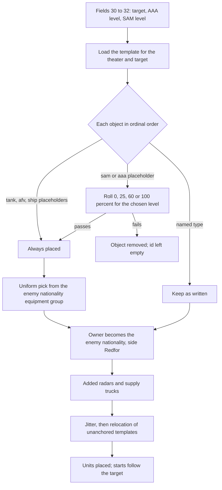
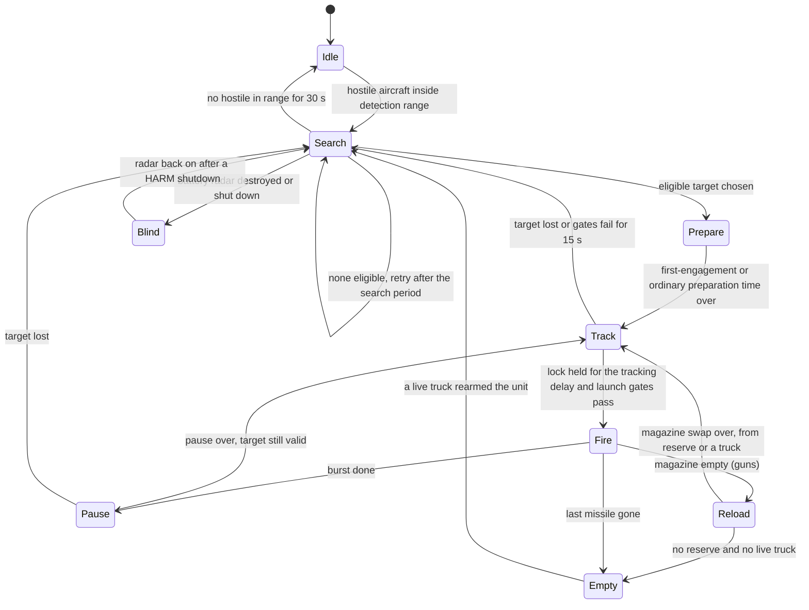
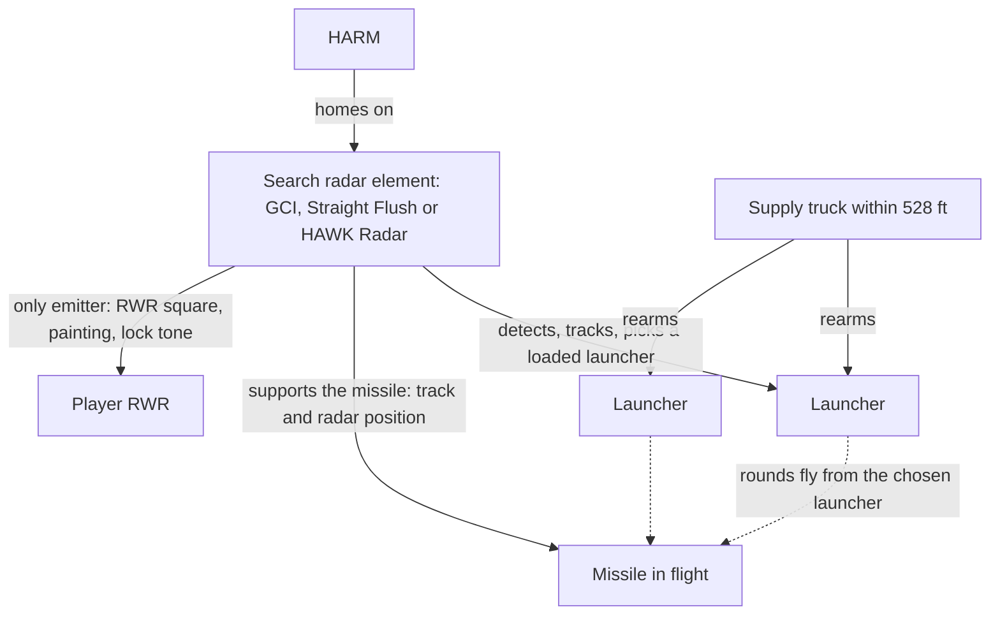
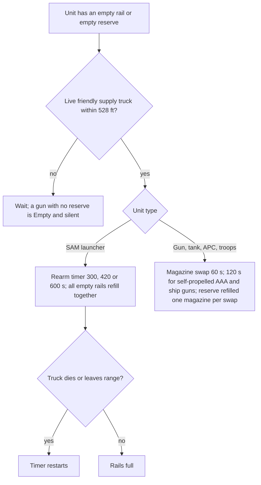

# Surface objectives and air defenses

> **T.O.R.E: Tasteful Opinionated Reverse Engineered.**
> The thing being reverse engineered is the *experience*, not the executable. We
> trace what a player does and what the game does back, down to the numbers they
> would notice. How the original code achieved it is history: useful evidence,
> never a blueprint. If a sentence below reads like an instruction to reproduce
> the original's internals, it is out of date.
> <!-- tore-header v2 -->

Specification, 2026-10-10, for the surface-AI round (John's request of the same
day, with his answers). It was written ahead of the code so each
implementation slice has numbers to test against, and is being implemented
slice by slice: the unit records, resolution and sides, the AAA tuning table,
the surface weapons' flight, and the engagement controllers, batteries and
radars are in ([implementation so far](#implementation-so-far)); the
acceptance pass at the end of the round (slice A1) updates it with what
shipped. Retail data comes from the survey of `FA_2.LIB` and `FA.EXE`
described under [Provenance](#provenance-and-how-to-read-this).

For a player: the Quick Mission Creator's line "Friendly ground target is [30]
defended by AAA [31] and SAMs [32]" becomes live in all 16 theaters. Picking a
target loads the retail template mission for it, rolls which of its SAM and AAA
slots are manned (none, light, moderate, heavy: 0, 25, 60 and 100 percent),
picks each unit's type from the enemy nationality's retail equipment list,
nudges units so no two flights look the same, and places it all in the world.
Targets that are not tied to a fixed theater feature (an airfield, a bridge, a
town) move as a whole group to a new valid site each flight, and the Blue and
Red starts follow the target. SAM launchers, AAA guns, flak batteries, armed
ships and armed vehicles search, lock and fire using their own retail records:
launch zones, altitude floors, burst sizes, reload times and reaction delays.
SA-2, SA-3, SA-6 and HAWK fight as batteries around a search radar: the radar is
what the RWR sees and what a HARM kills, and a dead radar blinds the battery.
Supply trucks in the defended groups refill SAM rails and AAA magazines within
0.1 mile. AAA fires real shells with a tuned rate of fire, magazine and reload
per gun type; flak shells burst in the air with a flash of light and no tracer.
Radars show on the RWR, sound lock tones, can be killed by HARMs and can be
decoyed by chaff, flares and jammers. Parked aircraft in the templates are
simulated aircraft on the ground (engines off, aircraft damage, they burn when
killed), not scenery. The 321 air-defense units already standing in 12 theater
layouts wake up too, on both sides. Destroying the target is a mission
objective; the debrief counts SAM and AAA fire. Everything runs on the host in
multiplayer; in PvP the Redfor players defend the target.

- [Provenance and how to read this](#provenance-and-how-to-read-this)
- [Data model](#data-model): unit records, templates and rolls, ownership, ids,
  jitter, relocation, starts, the units of the movement words, mission settings.
- [Surface AI](#surface-ai): engagement, SAM missiles, AAA and flak, ships,
  movement, experience, RWR emitters, countermeasures.
- [SAM batteries](#sam-batteries), [Resupply](#resupply) and
  [AAA tuning](#aaa-tuning).
- [Parked aircraft](#parked-aircraft) and [Destroyed looks and
  drawing](#destroyed-looks-and-drawing).
- [Objectives, scoring and debrief](#objectives-scoring-and-debrief) and
  [Multiplayer](#multiplayer).
- [Per-theater notes](#per-theater-notes), [Unknowns](#unknowns),
  [Decisions pending](#decisions-pending) and the
  [provenance summary](#provenance-summary).

Templates, rolls, equipment lists and the 16 theater target menus are recorded
as format facts in [the Quick Mission tables](../formats/quick-mission.md#ground-target-templates-and-defenses).
The NT unit record layout is in
[objects and shapes](../formats/objects-and-shapes.md#nt-surface-unit-layout).
Related specs: [AI](ai.md) (the B42 weapon service this reuses), [missiles](missiles.md),
[RWR](rwr.md), [debrief](debrief.md), [Quick Mission menu](quick-mission-menu.md).

## Provenance and how to read this

Every number carries a basis, in a table column or in the sentence.

| Label | Meaning |
| --- | --- |
| retail | Read from the player's own `FA_2.LIB` records, the template missions or `FA.EXE` tables. No retail bytes are committed; these are recorded facts and runtime reads. |
| spec-derived | Taken from an existing TORE spec, such as the B42 weapon-service timing in [AI](ai.md). |
| fitted | Chosen by an agent because retail has no value, or because the host needs one. Each is recorded with its rule and is acceptable as shipped behaviour. |
| defined | A design rule, AGENTS.md's *opinionated*. Either John's binding decision of 2026-10-10 ("defined (John)") or an agent's design choice ("defined (agent)"). |
| unknown | Insufficient evidence. Listed in [Unknowns](#unknowns) with the next research step. |
| default, pending John | An open decision. The text states the recommended default that will be built unless John changes it; the list is in [Decisions pending](#decisions-pending). |

Build identity of the retail data (the same build as the other format docs):

| Input | SHA-256 |
| --- | --- |
| `FA.EXE` | `e31560c2a6d6adb4aa1493f0308f6ae5640f67a4e886dbdf5887489e6e99244c` |
| `FA_2.LIB` (every NT, OT, JT, SEE, `.M` and `.MM`) | `fb8b30216e739292489d4872cc440debec334e14f8b9a3d0e340092445246198` |
| Loose `quick.M` (a retail-generated Quick Mission) | `665011a76eab98e10a13f957046af183520027a9e0383b8a91057cd9b49c1d46` |

Distances are feet unless a unit is written. "nm" is a nautical mile, 6,076
ft. Times in seconds. Retail times stored in "quarter seconds" are converted.

Authorization: John's request is the explicit permission that
[the roadmap](../ROADMAP.md) and AGENTS.md require for surface AI and
autonomous surface firing. AI strike (aircraft attacking ground targets on
purpose) and the wider ground weapon systems are the **next** round, a combined
ground-weapons pass; AI wings stay air-to-air here (defined, John).

## Data model

### Surface unit records

Retail has 84 active objects (`*.NT`) and 170 static objects (`*.OT`). An NT is
the OBJECT block, the NPC block and a list of hardpoints (a PT minus its PLANE
block); the byte layout is in [the NT layout](../formats/objects-and-shapes.md#nt-surface-unit-layout).
Every armed NT names its weapons on hardpoints with load counts and turret arcs,
and every weapon is an ordinary `.JT` record of the same layout as the air
weapons TORE already models.

| Count | Class (word at OBJECT +0x0d) | Binding | Notes |
| ---: | --- | --- | --- |
| 27 | Ship (0x2000) | `_GVProc` | |
| 5 | Ship, carriers | `_CARRIERProc` | Static targets with their own guns this round |
| 17 | SAM (0x1000) | `_GVProc` | The SCUD launcher is a SAM and carries four SA-9 |
| 9 | Tank (0x0400) | `_GVProc` | |
| 11 | Vehicle (0x0200) | `_GVProc` | Trucks, radars, SAM trucks |
| 8 | AAA (0x0800) | `_GVProc` | Includes the invisible barrage zone `A_M1939` |
| 1 | Other (TROOPS) | `_GVProc` | Small arms |
| 3 | Other (SOLDIER, RUNNER, PLTDWN) | `_OBJProc` | Men, no weapons |
| 1 | Structure (GCI radar) | `_OBJProc` | The only radar with a sensor hardpoint |
| 2 | Other (CATGUY, EJECT) | own procs | Not placed in surface scenes |

Source: retail data. Common values: ground units have 5 (MANPADS, men) to 200
(main battle tanks) hit points, the SA-2 site 650; ships 10 (riverboat) to
4,000 (Iowa, Kitty Hawk, Eisenhower). Explosion type is 21 for ground units, 35
for ships, 15 for men; `damage[0..4]` is 255 on every NT (meaning unknown).

A placed NT with any weapon or sensor mount is an **active unit**. An unarmed NT
(trucks, cargo ships, oilers, men without weapons) is a **passive unit**:
targetable, movable, never fires.

**SAM launchers** (retail; times are the NPC fields in seconds, search / first
engagement preparation / later preparation):

| NT | Name | HP | Weapon x load | Search / unready / ready s | Notes |
| --- | --- | ---: | --- | --- | --- |
| SA2A | SA-2A Guideline | 650 | SA2A x1 on each of 6 rails | 10 / 36 / 15 | One object draws a six-rail site; fixed |
| SA3 | SA-3 Goa | 100 | SA3 x2 | 10 / 36 / 15 | |
| SA6 | SA-6 Gainful | 100 | SA6 x3 | 10 / 36 / 15 | |
| SA15 | SA-15 Gauntlet | 100 | SA15 x8 | 5 / 5 / 5 | Fastest reaction in the data |
| SA9 | SA-9 Gaskin | 100 | SA9 x4 | 5 / 15 / 10 | |
| SA13 | SA-13 Gopher | 100 | SA13 x4 | 5 / 15 / 10 | |
| 2S6 | 2S6 Tunguska | 100 | 2S6 gun (unlimited) and SA19 x4 | 5 / 15 / 5 | Gun and missile |
| CHAP | M48 Chaparral | 100 | SA13 x4 | 5 / 15 / 10 | |
| HAWK | MIM-23 HAWK | 100 | SA19 x4 | 5 / 15 / 10 | Uses the SA-19 record, not MIM23 |
| ROLAND | Roland SAM | 100 | SA19 x4 | 5 / 15 / 10 | |
| ASA5 | Crotale SAM | 100 | R440 x2 | 5 / 15 / 10 | |
| FIM92, MIS, SA7, SA14, SA16 | Stinger, Mistral, SA-7, SA-14, SA-16 teams | 5 | one record x2 | 5 / 15 / 10 | Infantry teams; SA-16 shares the SA-14 shape |
| SCUD | SCUD launcher | 100 | SA9 x4 | 48 / 44 / 44 | Class SAM in retail |

**Ships** carry guns, missiles or nothing. The armed ones (retail):

| NT | Name | HP | Weapons |
| --- | --- | ---: | --- |
| NIMZ, KITT | Eisenhower, Kitty Hawk | 4,000 | Phalanx x2, Sea Sparrow x2 |
| CLEM | Clemenceau | 2,500 | Phalanx x2, Sea Sparrow x2 |
| WASP | Wasp | 2,500 | Phalanx x2 |
| KIEV | Kiev | 2,000 | SA-N-3, SA-N-9, AAA30 x2 |
| IOWA | Iowa | 4,000 | Phalanx x2, Sea Sparrow x2 |
| KIROV | Kirov | 2,000 | AAA30 x2, SA-N-11 x2 |
| SOVR | Sovremennyy | 700 | AAA30 x2, SA-N-7 x2 |
| KRIVAK | Krivak | 500 | AAA30BAD x2, SA-N-4 |
| TYPE69, KNOX, JIANC, JIANE | Frigates | 800 to 1,500 | AAA30BAD x2, SA-N-4 |
| TICON | Ticonderoga | 1,000 | Phalanx x2, ASROC x2 |
| BUTLER | John C. Butler (Red Crown picket) | 500 | AAA30 x2 and the REDCR.SEE radar |
| CYCL | Cyclone patrol craft | 250 | AAA30BAD x2, SA-N-4 |
| SARAN | Sarancha hydrofoil | 180 | SA-N-4, AAA30, SS-N-9 |
| PMORN | Pomornik hovercraft | 150 | AAA30BAD x2 |

Unarmed ships: submarines (OSCAR, surfaced), cargo ships, oilers, LCAC and
SL100 hovercraft, Sea Shadow, barges and small craft, the oil rig. Every ship
has a damaged `_A` shape; no ground vehicle or SAM has one.

Ground vehicles: M1 (M256 120 mm), T-72, T-80 and T-90 (2A46 125 mm), BMP-2
and BTR-80 (30 mm and 14.5 mm), M113 and M2 (machine gun and 25 mm), soft
vehicles and support vehicles without weapons, TROOPS (small arms 0 to 4,000 ft
range, below 2,000 ft). The full gun records are under
[Gun records](#gun-records-retail).

### Templates and defended slots

Retail builds a ground target from one of 129 **template missions**
(`~Q<theater><target>.M`; 124 are reachable from the menus, five are
unreferenced), plain object lists at fixed theater coordinates. "Defended" is
not a separate data set: most templates carry exactly 10 `<sam>` and 10 `<aaa>`
placeholder objects (79 of the 95 templates that have SAMs have exactly 10).
The template list and per-theater target menus are in
[the Quick Mission tables](../formats/quick-mission.md#ground-target-templates-and-defenses).

**The rolls** (retail data, `FA.EXE` tables at 0x4f3148 for SAM and 0x4f31b8 for
AAA):

| Setting (field 31 AAA, field 32 SAM) | Retail label | Chance a slot is manned |
| --- | --- | ---: |
| 0 | not | 0 percent |
| 1 | lightly | 25 percent |
| 2 | moderately | 60 percent |
| 3 | heavily | 100 percent |

The retail sentence reads "defended by AAA [not/lightly/moderately/heavily]"
and the same four words for SAMs. A failed roll removes the object (retail
writes `type <nothing>`). The choice of unit for a surviving placeholder is a uniform pick from the list
for the **enemy nationality's equipment group** (retail data; five groups,
numbered 0 to 4). The lists per placeholder and the nationality to group table
are recorded in
[the Quick Mission tables](../formats/quick-mission.md#placeholder-unit-lists-and-equipment-groups).
In short: group 0 is the Western list (Stinger, Roland, Chaparral SAMs; M163 and
M113 AAA; M1 and M2 tanks), group 1 the French list (Mistral and Crotale; M113
and ZSU-23; T-80 and T-90), group 2 the Russian and Chinese list (SA-6, SA-7,
SA-9, SA-13, SA-14, SA-15 and 2S6; ZSU-23 and ZSU-57; T-72, T-80, T-90), group 3
the Arab list (M113, Chaparral, SA-6, SA-9, SA-14, Crotale; ZSU-23, ZSU-57,
ZIF-31) and group 4 a mixed list (M113, Chaparral, Crotale, SA-7, SA-13; ZSU-23,
ZIF-31, M113).

The M113 is an armored personnel carrier with a machine gun. It is a legal
`<sam>` pick in groups 3 and 4 and a legal `<aaa>` pick in groups 0, 1, 3 and 4.
Retail's list is preserved: a "SAM site" can be an M113. The `<vehicle>`,
`<small>` and `<hovercraft>` placeholders appear in no shipped template.

With each theater's default enemy: Egypt and the Falklands use group 3, France
group 1, Greece group 4 and the other 12 theaters group 2. Changing the enemy
nationality changes the defenses and ships, never the template. The enemy
nationality is therefore part of the resolution input.

Further rules, all retail data unless noted:

1. **Night rule.** Condition Night with an F-117 or B-2 in any friendly wing
   turns every `<aaa>` into a ZSU-23 with skill 0. No F-117 or B-2 is flyable
   yet, so the rule is dormant; it keys on those aircraft names and wakes when
   they are imported.
2. `<tank>`, `<afv>`, `<vehicle>`, `<small>`, `<hovercraft>`, `<destroyer>`,
   `<cruiser>`, `<carrier>` and `<cargo>` are always placed.
3. A placeholder carrying the destroy-target flag (0x80) that fails its roll is
   not a target. `~QUCITY` flags eleven `<AAA>` and twelve `<SAM>` slots as
   targets; with defenses at none it has 16 tank targets only.
4. Selecting ground target none clears both defense fields (retail).
5. A target is any template object flagged 0x80 that exists after resolution.

### Ownership and sides

- Template `nationality` and `nationality2` are rewritten to the enemy
  nationality with the side bit 0x80 (Redfor). **`nationality3` passes through
  unchanged** (retail): `~QIRRETR` keeps 40 American objects and `~QSPFRU` 21
  Pakistani objects on the friendly side.
- Theater layouts spell the owner three ways: `nationality2` (BAL, EGY, FRA,
  KURILE, TVIET, VLA), the legacy `nationality` (UKR) and `nationality3` (CUB,
  LFA, GRE, IRA, SPA, APA, PGU, NSK, WTA). TORE reads `nationality3` so the nine
  layouts that use it get owners; they need them now that their defenses go
  active. `nationality3` indexes the creator list directly (CUB 161 is the enemy
  Cuban, 33 with the side bit; WTA 39 is friendly Taiwanese).
- Bit 0x80 set is Redfor (the enemy side), clear is Blue. Surface units take
  that side. Objects with no nationality field stay neutral scenery.
- TVIET's `nationality2 142` decodes to Islamic Egyptian without the remap the
  legacy field gets; only the side bit matters and it is right. BUTLER in the
  TVIET layout is nationality 0, so the Red Crown picket is friendly.
- **Base-layout air defenses go active** (defined, John): the 321 SAM and AAA
  units in the 12 theater layouts that have them (all but Egypt, France, Ukraine
  and Vladivostok), on both sides, regardless of the "defended" setting. Retail
  evidence points the same way (the units carry weapons and the active `_GVProc`
  binding) but whether retail Quick Missions activate them is not traced.
- **In PvP the Redfor players defend the target** (defined, John). Template
  units are Redfor: they engage Blue aircraft only. Base-layout units take their
  layout side, so a Redfor player raiding a friendly airfield meets its SAMs.

### Identifiers

Every placed object has a fixed id so destruction, rejoin and replays agree on
every machine.

| Range | Owner | Rule |
| --- | --- | --- |
| `0x4000_0000` plus ordinal | Theater layout objects, base-layout air defenses included | Unchanged from today |
| `0x5000_0000` plus ordinal | Template objects, parked aircraft included | The template ordinal, taken before the roll, so a removed `<sam>` leaves a gap and every machine numbers the rest the same |
| `0x5800_0000` plus n | Added supply trucks | n in the order of the unit each serves (ascending unit id) |
| `0x5C00_0000` plus n | Added battery radars | n in battery order (ascending lowest launcher id); an adopted radar keeps its own id |
| `0x0200_0000` upward | Surface projectiles (SAMs, shells) | Own counter; AI aircraft shots start at `0x0100_0000` and would need 16.7 million shots to reach it |
| `0xE000_0000`, `0xF000_0000` | Client cosmetic rounds | Unchanged |

All defined (agent): ids are an implementation contract.

### Jitter

John's decision: template positions vary, they are not fixed (defined, John).
The rules below are defined (agent) with fitted numbers.

**Seed.** The creator rolls a 32-bit `surface_seed` when the player presses Fly,
and the multiplayer lobby when the flight starts. A restart reuses it, so a
restarted mission has the same defenses and positions (retail restarts re-fly
the same written `quick.M`). A dedicated server's mission file may name a seed;
without one the host draws it and the mission text sent to clients carries it.
Each object's results come from its own stream (seed, template, ordinal,
purpose), so they do not depend on the order objects are processed or on how
many others survive.

| Objects | Position jitter | Heading jitter | Why |
| --- | --- | --- | --- |
| Structures (bunkers, factories, bridges, roads, tents, crates, flags, hooches) and airstrip pieces | none | none | They anchor the site to roads, rivers, coasts and runways |
| Parked aircraft | none | none | They sit on aprons and in shelters |
| SAM and AAA, named or placeholder | disc of 1,500 ft | plus or minus 45 degrees | Defense rings change from flight to flight |
| Barrage zone `A_M1939` | disc of 2,000 ft | none | Invisible; changes where the barrage stands |
| Tanks, AFVs, vehicles, troops without a route | disc of 600 ft | plus or minus 30 degrees | Small, so a column parked on a road stays near it |
| Units with a route (`~QUCOL`) | none | none | Routes follow roads |
| Ships | one common shift for the fleet (disc of 6,000 ft in an anchored template) plus a formation rotation of plus or minus 20 degrees about its centroid; then each ship a disc of 300 ft | formation rotation plus 10 degrees | Fleets move, formations keep their shape |

**Validity** uses integer data only, so every platform decides the same:

- Land units need a land cell and ships a water cell, from the terrain grid's
  integer class byte, checked at the unit's centre and at the four corners of
  its footprint.
- Land units refuse a cell whose four corner elevations span more than one
  elevation unit (256 ft).
- Footprint clearance from every fixed template object and theater layout
  object, plus 300 ft from every runway's box.
- Up to 8 candidates per object from the same stream; if none passes, the
  original retail position is used (the relocated one in a relocated
  template). An NT structure (the GCI radar site) stays put like a building.
- Footprints are boxes from each type's shape vertex bounds at the placed
  scale (the one scale seam, so they follow any rescale); a placed unit is
  tested as the circle around its box, so its heading does not matter. Positions round to whole feet and headings
  to the retail angle unit; heights then come from the terrain as for any
  placement.

**Network guard.** Every machine resolves the same spec text against the same
retail data (the lobby already requires an identical `FA_2.LIB`). The host adds
a 64-bit digest of the resolved scene (group transform, every unit's id, type,
position, heading and owner, battery membership, supply trucks, parked aircraft
and both sides' start points) to the seat and rejoin messages. A client whose
digest differs reports it, logs both lists and refuses the seat, so a divergence
is loud, not silent.

### Relocation

Jitter varies a site; relocation varies where the site is (defined, John:
"objective locations can and should vary"). Both use the same seed and
integer-only rules.

**Anchored templates stay at their retail spot** and only jitter. A template is
anchored when any rule below holds, computed from its contents at load (a rule,
not a hand list); the result on the real data is pinned by an ignored import
test.

| Rule | Templates on the retail data |
| --- | --- |
| Its centroid is within 1 nm of a theater runway, or it contains its own strip piece | 16 airfield templates `~QAPFAIR`, `~QBAIR`, `~QCFAIR`, `~QELAIR`, `~QESAIR`, `~QFLAIR`, `~QFSAIR`, `~QIRFAIR`, `~QKPLNGR`, `~QLFFAIR`, `~QNSFAIR`, `~QPGFAIR`, `~QSPFAIR`, `~QVLAIR`, `~QVSAIR`, `~QWTFAIR`; plus five that bring their own strip piece: `~QBFAIR`, `~QGRSAIR`, `~QFFACT`, `~QTBUNK`, `~QUSTRIP` |
| It contains a bridge or road piece | `~QBBRD`, `~QTBRDG`, `~QTTRUCK`, `~QUBRI` |
| A target lies within 2,000 ft of a theater layout object (built into a town, harbor or base) | `~QAPHELO`, `~QTBARG`, `~QPGSRUN`, `~QTSTRG`, `~QUCITY` |
| It has routes | `~QUCOL` |

That is 31 anchored templates by the plan's survey. Measured by the rule on the
retail data (slice L1) it is 34: runways are theater layout objects too, so
`~QPGSRUN` (a target 1,000 ft from a dirt strip) anchors by the town rule; a
dirt strip (`DTSTRP`, a `_STRIPProc` runway) counts as a runway, so `~QCCMHQ`
(its centroid 0.6 nm from one) anchors; and every routed template anchors
(`~QTCARGO`, `~QUFACT` besides `~QUCOL`). The other 74 offered non-empty
templates relocate; the 16 "nothing" templates have no objects. The
`surface-relocate-sweep` battery scenario pins the list. The per-theater split is
in [Per-theater notes](#per-theater-notes).

**Group transform.** A relocatable template moves as a rigid group: a rotation
about its targets' centroid by a whole number of degrees (0 to 359) and a
translation, computed with an integer cosine and sine table (whole degrees,
scaled by 2^30 so a step is under a thousandth of a foot over 40 nm) and
64-bit integer arithmetic, rounded half away from zero to whole feet.
Per-object jitter is applied in the template's own frame before the transform,
so spacing rules hold after the move.

**Candidate sites** (fitted; the first of up to 32 candidates that passes wins,
the retail spot is the fallback). Radius ranges are default, pending John.

| Rule | Value |
| --- | --- |
| Distance from the retail spot | 3 to 30 nm, radius drawn as the square root of a uniform value so area is uniform (default, pending John) |
| Map edge | every object at least two cells (16,384 ft) inside |
| Terrain class | land units and structures on land; ships on water, with the 8 neighbouring cells also water when the retail spot had that (open sea stays open sea; a harbor keeps a coast) |
| Slope | land objects only on cells whose four corner elevations span at most one unit (256 ft) |
| Clearance | 2,000 ft from every theater layout object; 3 nm from every theater runway |
| Side | the front axis runs from the centroid of the theater's Blue-side layout placements to the centroid of its Red-side ones; the candidate's depth along it must be within 15 nm of the retail spot's depth and on the same side of the midpoint (default, pending John) |
| Completeness | every target and structure must pass; a defense, vehicle or truck that fails gets 8 local tries within 2,000 ft; if any still fails the candidate is rejected, so the retail rolls and counts never change because of relocation |

### Start placement

With a ground target the airborne scene is placed from the target instead of the
theater centre (defined, John, 2026-10-10: request item 7). All of it comes
from the seed and is inside the digest.

- **Red (defenders, AI or human).** The Redfor flight starts within 5 nm of the
  targets' centroid, defending it: a seeded spot in that disc that is on the
  map (one grid cell inside its edge); the centroid itself if none of 8 tries
  is. The enemy group is placed there, turned to face Blue.
- **Blue (attackers).** Blue starts the mission's enemy distance (the
  creator's separation: 50, 75, 100, 150 nm and the rest of the list) from
  Red's start, on the bearing toward the Blue side of the front axis, plus or
  minus 30 degrees (seeded; default, pending John), heading at the target, at
  the chosen altitude. If the point does not fit the map the bearing is
  searched one degree at a time, as the enemy-placement rule does
  ([Keeping the enemy on the map](quick-mission-menu.md#keeping-the-enemy-on-the-map));
  if no bearing fits at the full distance, the farthest that does, a mile at
  a time. Friendly wings 2 and 3 keep their offsets from the player.
- **Ground starts.** An explicit runway choice is kept. With none picked, the
  default runway becomes the Blue-side airfield nearest the target that is at
  least 15 nm from it; a Redfor human ground start in PvP uses the Red-side
  airfield nearest the target under the same rule (default, pending John). An
  airfield's side is its owner's; an unowned one takes its side of the front.
  The airfield must hold the wing (no short strip or vertical pad); with none,
  the earlier rule stands (the first friendly airport's runway that holds the
  wing). Red still starts by the target.
- The target point is the targets' placed centroid. A theater with no front
  (no owned placements on one side) starts Blue toward the middle of the map
  (fitted).
- No ground target: unchanged.

### The units of the movement and range words

**Waypoint speed `w_speed` is feet per second** (retail data, strong inference;
accepted by John, "sure"). Evidence, from the 388 non-template missions and the
templates:

| Observed `w_speed` | In ft/s read as knots | Read as |
| ---: | --- | --- |
| 843 | 499.5 knots | 500 knots |
| 506 | 299.8 knots | 300 knots |
| 759 | 449.7 knots | 450 knots |
| 675 | 399.9 knots | 400 knots |
| 421 | 249.4 knots | 250 knots |

Aircraft `w_speed` values cluster at exactly these five numbers, which are 500,
300, 450, 400 and 250 knots in feet per second (1 knot is 1.6878 ft/s, values
truncated). Read as knots they would be supersonic at sea level, and none of
them is a round number. Surface routes then run at 50 ft/s (29.6 knots, 34
mph), 33 (19.5 knots), 16 (9.5 knots), 100 ft/s for hydrofoils (59 knots) and 10
ft/s for men. The same unit is assumed for the object's `_maxSpeed` (ships 50,
hydrofoils and frigates 100, tanks 50, men 10). As a plausibility check only,
not as evidence: 50 ft/s is a destroyer's cruising speed, 100 ft/s a
hydrofoil's, and 50 ft/s a tank's road speed. A counter-reading exists: the
Ticonderoga routes at 33 also look plausible as 33 knots. The aircraft values
decide it because the mission format is shared. The next research step is the
retail waypoint consumer (`GVDoCurrentWaypoint` 0x473de0), listed under
[Unknowns](#unknowns).

Other words:

- **Turn rate** `_turnRate` is in the angle unit of 182 per degree (16,384 is 90
  degrees): ships 910 is 5 degrees, tanks 2,730 is 15 degrees, applied per
  second (fitted).
- `_acc` and `_dacc`: unknown; fitted 5 ft/s squared for ground vehicles, 1 ft/s
  squared for ships.
- `maxVisDist` and `zoneDist`: the values 78, 195 and 391 match 20,000, 50,000
  and 100,000 ft at 256 ft per unit (inference). Used this round only for the
  barrage zone's activation radius (195, about 50,000 ft, fitted).
- Hardpoint slew limits: 16,384 is 90 degrees (inference).

### Mission settings carried

The mission specification (and its text form, which is part of the mission
hash and travels to every multiplayer client) gains fields, each written only
when set so existing specifications, hashes and golden fingerprints are
unchanged. All defined (agent).

| Field | Text line | Notes |
| --- | --- | --- |
| Ground target | `ground-target QUCOL` | The template stem, not a menu index, so a server file reads clearly |
| AAA and SAM levels | `defenses aaa heavy sam moderate` | `none / light / moderate / heavy`; written only with a target |
| Surface seed | `surface-seed 1234567` | See [Jitter](#jitter) |
| Enemy nationality | `enemy-nationality 10` | Field 20; default per theater; drives the equipment group |

The creator's fields 30 to 32 fill them. The multiplayer lobby's read-only
creator shows them.

## Surface AI

Surface units reuse the AI weapon service that already drives AI aircraft (the
[B42 phases and quarter-second clock](ai.md#b42-weapon-preparation-search-cadence-and-firing)):
retail's `_GVProc` shares `_NPCWeaponsProc` with aircraft, so ground units
search, lock and fire through the same procedure. The wider surface events and
the ranking terms for surface actors are untraced (see [Unknowns](#unknowns)).

### Engagement

One controller runs per weapon mount group (all mounts carrying the same record
on a unit share one; a 2S6 has a gun controller and a missile controller). A
SAM battery has one controller on its radar ([SAM batteries](#sam-batteries)).

| Step | Rule | Basis |
| --- | --- | --- |
| Detection range | The weapon's seeker `zone0` range and altitude band (SA-2 150,000 ft with an altitude floor of 3,000 ft; SA-6 80,000 ft, floor 500 ft); a sensor's range for GCI and BUTLER (303,800 ft, 50 nm). A battery detects from its radar's position with the battery missile's `zone0`; a GCI element also gives its 50 nm sensor for search, never for launch | retail; battery use defined (John) |
| Search period | Quarter seconds in the NPC block: 5 s for small SAMs, ZSU-23 and vehicles, 10 s for big SAMs, guns and ships, 48 s for the SCUD | retail, B42 |
| Eligibility | Hostile side, airborne, class matches the object's `react` attack mask (templates use `$c000`: fighters and bombers), inside detection range and band, terrain line of sight clear, inside `searchDist` when non-zero (unit unknown: 25 is read as 25 x 256 ft) | retail; the `searchDist` reading fitted |
| Choice | Nearest eligible; keep the current target while valid; KS-12 and KS-19 re-evaluate every 10 s (`retargetT` 40) | fitted (the retail ranking terms for surface actors are untraced) |
| Preparation | `unreadyAttackT` for a unit's first engagement (SA-2, SA-3 and SA-6 36 s; SA-15 5 s), `attackT` afterwards (5 to 20 s) | retail times; which engagement counts as first is fitted (B42 says the producer of the unready flag is unknown) |
| Lock to fire | `trackT`: guns 1 s, missiles 5 s, Sea Sparrow and SS-N-9 3 s | retail, B42 |
| Launch gates | `zone1` range, altitude floor and ceiling, heading and pitch half-angles; mount arcs `slewLimitH/P` relative to the hull; terrain line of sight from the mount | retail |
| Salvo | `gameRoundsInBurst` missiles `gameBurstT` apart: SA-15, SA-19 and SA-N-9 fire 2 rounds 2 s apart; others 1 | retail |
| Missile spacing | `reloadT` between salvos: SA-2 and SA-3 20 s, SA-6 15 s | retail; quarter-second unit assumed |
| Missile stock | Hardpoint load (SA-2 six rails of 1, SA-6 three, SA-15 eight); refilled only by a supply truck, see [Resupply](#resupply) | retail; resupply defined (John) |
| Gun cadence | See [AAA tuning](#aaa-tuning): rate, burst, magazine, reserve and the 60 or 120 s magazine swap | defined (John), values fitted |
| Lost target | Back to Search; supported missiles in flight keep their memory rule | spec-derived ([missiles](missiles.md)) |

**Range and altitude gates a player can use.** Radar SAMs have an altitude
floor: SA-2 launches only above 5,000 ft (seeker floor 3,000 ft), SA-3 above
5,000 ft (seeker 2,000 ft), SA-6 above 2,000 ft (seeker 500 ft). Flak will not
fire below 4,000 ft. A site that cannot see you over a ridge does not fire.

### SAM missiles

Retail data, launch and seeker numbers per record. Times in the motor columns
are quarter seconds; reload is the raw `reloadT` in quarter seconds.

| Record | Seeker | Launch range ft | Launch altitude ft | Seeker range ft (altitude floor) | Salvo: rounds / gap / reload | Damage | Used by |
| --- | --- | --- | --- | --- | --- | ---: | --- |
| SA2A | 3 radar, support 0x200 | 7,500 to 95,000 | 5,000 to 50,000 | 150,000 (3,000) | 1 / 0 / 80 | 300 | SA2A |
| SA3 | 3, 0x200 | 7,500 to 54,000 | 5,000 to 36,000 | 100,000 (2,000) | 1 / 0 / 80 | 200 | SA3 |
| SA6 | 3, 0x200 | 9,000 to 75,000 | 2,000 to 30,000 | 80,000 (500) | 1 / 0 / 60 | 75 | SA6 |
| SA15 | 3, 0x200 | 1,000 to 36,000 | 100 to 18,000 | 80,000 | 2 / 8 / 40 | 100 | SA15 |
| SA19 | 3, flag 0x100, no 0x200 | 500 to 24,000 | to 9,500 | 60,000 | 2 / 8 / 20 | 50 | 2S6, HAWK, ROLAND |
| R440 | 3, 0x200 | 7,500 to 54,000 | 5,000 to 36,000 | 100,000 (2,000) | 1 / 0 / 80 | 200 | ASA5 |
| MIS | 3, 0x200 | 7,500 to 48,000 | 5,000 to 36,000 | 64,000 (2,000) | 1 / 0 / 80 | 200 | MIS |
| FIM92 | 2 infrared | 7,500 to 54,000 | 5,000 to 36,000 | 100,000 (2,000) | 1 / 0 / 80 | 100 | FIM92 |
| SA7 | 2 | 500 to 9,000 | to 6,000 | 15,000 | 1 / 0 / 40 | 25 | SA7 |
| SA9 | 2 | 2,500 to 18,000 | to 15,000 | 20,000 | 1 / 0 / 60 | 35 | SA9, SCUD |
| SA13 | 2 | 1,500 to 15,000 | 100 to 10,000 | 25,000 | 1 / 0 / 60 | 25 | SA13, CHAP |
| SA14 | 2 | 500 to 15,000 | to 15,000 | 20,000 | 1 / 0 / 40 | 25 | SA14 |
| SA16 | 2 | 500 to 8,000 | to 5,000 | 15,000 | 1 / 0 / 40 | 25 | SA16 |
| SAN3 | 3, 0x200 | 5,000 to 100,000 | 1,000 to 75,000 | 100,000 | 1 / 0 / 60 | 200 | KIEV |
| SAN4 | 3, 0x200 | 4,000 to 35,000 | 500 to 15,000 | 100,000 | 1 / 0 / 60 | 200 | 7 ships |
| SAN7 | 3, 0x200 | 1,500 to 60,000 | 500 to 45,000 | 100,000 (to 50,000) | 1 / 0 / 40 | 80 | SOVR |
| SAN9 | 3, 0x200 | 1,000 to 36,000 | 100 to 18,000 | 80,000 | 2 / 8 / 40 | 100 | KIEV |
| SAN11 | 3, no 0x200 | 1,500 to 24,000 | 100 to 24,000 | 100,000 (to 50,000) | 1 / 0 / 32 | 80 | KIROV |
| SEA_SPAR | 3, 0x200 | 3,000 to 120,000 | unlimited | 120,000 | 1 / 0 / 32 | 170 | 4 carriers, IOWA |
| ASROC | 3, 0x200 | 500 to 75,000 | 1,000 to 30,000 | 100,000 (500) | 1 / 0 / 40 | 150 | TICON |
| SSN9 | 3, flags 0x22365 | 3,000 to 120,000 | unlimited | 250,000 | 1 / 0 / 32 | 170 | SARAN (anti-ship) |

Retail quirks preserved: the Stinger and Mistral records copy the SA-3 envelope
(launch 1.23 to 8.89 nm, 5,000 to 36,000 ft); HAWK and Roland use the SA-19
record; the SCUD launcher is class SAM with four SA-9; Knox carries SA-N-4. All
surface missiles start from rest (`initialSpeed` 0, final speed 1,026 ft/s),
`trackT` 20 (Sea Sparrow and SS-N-9 12), proximity fuze 100 ft and collateral
damage 750 ft at 35 percent (SA-2 1,200 ft).

TORE rules (defined and fitted):

- Each SAM record gets a guidance profile: radar records with the support flag
  0x200 are **supported radar**, the infrared records are **infrared**, as the
  [missile inventory](missiles.md#first-pass-inventory-matrix) proposes. Their
  target role is aircraft.
- **Support.** A self-contained launcher (SA-15, Roland, 2S6, Crotale, ship
  systems) supports its own missiles while its controller holds lock and its
  radar is on. For a battery launcher the missile belongs to the launcher (kill
  credit and the debrief's SAM tally follow its owner) but the support, the
  radar position and the track come from the battery radar, which must be alive,
  on and in line of sight of the target. Losing any of those ends support; the
  missile falls back to its memory rule.
- **Launch** is from the mount position (the NT's `pos`, scaled with the unit
  to real size, `surface::mount_position_ft`) at speed 0, boosting from the record's
  ignition time with the same motor model as air launches. Launch pitch is the
  line to the lead point clamped between 10 degrees and the mount's pitch limit
  (SA-2 15 degrees). Fitted.
- **SA-19 and SA-N-11** are treated as supported radar, because HAWK, Roland and
  the 2S6 carry SA-19 and would otherwise be unarmed; ASROC stays held
  (Ticonderoga keeps its Phalanx). Default, pending John. The Tunguska and
  Kashtan carry their own radars; only the battery systems need component
  radars (answered for John's question).
- **SS-N-9** never fires: there are no surface targets this round.
- **Collateral damage** is new and shared with flak: every aircraft inside the
  collateral radius takes the record's damage times the collateral percent,
  once per burst. The aircraft a missile strikes takes its direct hit only.
  Friendly fire off spares the shooter's side, as for a direct hit. A burst
  is a missile striking an aircraft or the ground, or a flak shell bursting.
  Fitted. It applies to surface weapons only this round: the aircraft
  weapons' records carry collateral radii too (750 ft at 35 percent on most
  missiles, 100 percent on bombs) but keep today's behaviour, no collateral
  damage, until John decides (default, pending John).
- **What a surface round can hit.** Aircraft and the terrain only: surface
  units do not fight each other this round, so a round or missile passes
  through ground objects and ships, and a launcher is never hit by its own
  missile leaving the rail. Defined (agent).

### AAA and flak

All gun rounds are physical projectiles (defined, John), flown by the existing
gun-round model with the tuned muzzle velocity and hit-tested like aircraft
rounds. Flak is physical too; it has no tracer.

How a surface gun round differs from an aircraft's (defined, agent):

- It does its record's damage, split over the physical rounds of a game round
  as the [AAA tuning](#aaa-tuning) table says. The aircraft guns' one-third
  rule and their critical hits (a round through the cockpit kills the pilot)
  do not apply: the table already matches retail damage per second, and a
  critical kill on top would make AAA deadlier than retail.
- A jammer does not defeat individual gun rounds; it works on missile seekers.
  A gun's skill-based aim error is its accuracy rule.
- A controller may end a gun's rounds a little past the target's range instead
  of letting them fly their whole life (a Shilka at 3,400 rounds a minute
  otherwise keeps about 280 rounds in the air), so the sky stays within the
  projectile limit.
- Surface fire never fills the last 1,000 of the 5,000 projectile slots, which
  stay free for the aircraft's own weapons (fitted).

#### Gun records (retail)

Burst = rounds in the time shown, then the pause. Muzzle speeds in ft/s. Fire
zone range and altitude in feet. Damage and fuze as in the record.

| Record | Aim | Fire zone range | Fire zone altitude | Burst, then pause | Startup shots | Muzzle | Life (s) | Fuze ft | Damage | Used by |
| --- | --- | --- | --- | --- | ---: | ---: | ---: | ---: | ---: | --- |
| ZSU23 | radar | 50 to 7,500 | to 7,500 | 4 in 0.25 s, 1.0 s | 0 | 3,666 | 5 | 100 | 20 | ZSU23 |
| 2S6 | radar | 50 to 15,000 | to 9,000 | 4 in 0.25 s, 1.0 s | 0 | 3,666 | 5 | 100 | 20 | 2S6 |
| PHALANX | radar | 50 to 20,000 | to 15,000 | 6 in 0.25 s, 1.0 s | 0 | 3,666 | 10 | 50 | 40 | carriers, IOWA, TICON, M163 |
| AAA30 | radar | 50 to 15,000 | to 7,500 | 4 in 0.25 s, 1.0 s | 0 | 3,666 | 5 | 50 | 30 | KIROV, SOVR, KIEV, BUTLER, SARAN |
| AAA30BAD | visual | 50 to 10,000 | 100 to 7,500 | 4 in 0.25 s, 1.0 s | 0 | 3,666 | 5 | 50 | 30 | frigates, patrol craft |
| ZSU57 | visual | 50 to 12,000 | 1,000 to 12,000 | 4 in 0.5 s, 3.0 s | 0 | 3,666 | 5 | 100 | 20 | ZSU57, ZIF31 |
| M1939 | visual | 0 to 10,000 | to 6,000 | 4 in 0.5 s, 3.0 s | 0 | 3,960 | 5 | 100 | 30 | M1939 |
| A_M1939 | visual | 0 to 10,000 | to 6,000 | 4 in 0.5 s, 3.0 s | 0 | 3,960 | 5 | 100 | 30 | barrage zone, random fire 33 percent |
| KS12 | radar flak | 0 to 40,000 | **4,000 to 15,000** | 1 in 0.5 s, 4.0 s | 8 | 3,520 | 10 | **250** | 50 | KS12; collateral 750 ft at 35 percent |
| KS19 | radar flak | 0 to 50,000 | **4,000 to 25,000** | 1 in 0.5 s, 4.0 s | 8 | 4,400 | 15 | **250** | 80 | KS19; collateral 750 ft at 35 percent |
| M1, T72 | visual | 50 to 5,000 | to 3,000 | 1, 4.0 s | 0 | 5,866 | 5 | 100 | 200 x5 | main battle tanks |
| BMP2, BTR80 | visual | 50 to 3,000 | to 3,000 | 2 in 0.5 s, 3.0 s | 0 | 3,666 | 5 | 100 | 5 | IFVs |
| M113, M2 | visual | 50 to 3,000 | to 3,000 | 2 in 0.5 s, 3.0 s | 0 | 3,666 | 5 | 100 | 10 | APCs |
| SMLARMS | visual | 0 to 4,000 | to 2,000 | 4 in 0.25 s, 1.0 s | 0 | 3,666 | 5 | 50 | 10 | TROOPS |

The radar guns carry projectile flag 0x4000, which the [AI lead
calculation](ai.md#b44-steering-execution-and-pursuit-lead) ties to the lead; the
visual guns do not. That matches the manual: "modern AAA uses radar to calculate
lead ... older AAA ... must eyeball you" (pp. 157 to 158). The KS-12 and KS-19
are the flak: a large fuze radius, collateral damage, 8 startup shots and an
altitude floor of 4,000 ft, which is the manual's "minimum range is 4000 ft".
The KS-19's 25,000 ft ceiling and the SA-2's 50,000 ft ceiling are the manual's
maximum AAA and SA-2 ranges (p. 193). Life is converted from the record's
quarter seconds.

#### Aim

| Gun kind | Aim | Lead | Basis |
| --- | --- | --- | --- |
| Radar guns (flag 0x4000: ZSU-23, 2S6, Phalanx, AAA30, KS-12, KS-19) | Observed target, refreshed every tick while tracking | Time of flight and drop from the existing gunsight solution, plus aim error by skill | retail (the flag); error fitted |
| Visual guns (ZSU-57, M1939, AAA30BAD, tank and APC guns, small arms) | Observation refreshed every 0.5 s | Lead from that stale velocity, larger aim error by skill | manual pp. 157 to 158; numbers fitted |

Aim error by skill is a random angular offset per burst plus the existing
per-round dispersion: radar guns 0.6, 0.4, 0.3 and 0.2 degrees; visual guns 1.5,
1.0, 0.7 and 0.5 degrees for novice, average, veteran and ace. Fitted. A jammer
on the target widens a radar-directed gun's aim error two times; visual guns
are unaffected (defined, John, 2026-10-10: "fine for now").

#### Flak

KS-12 and KS-19 (fuze 250 ft, collateral 750 ft at 35 percent):

- Fire zone floor 4,000 ft and ceilings 15,000 and 25,000 ft (retail).
- Time fuze: each shell is set at launch to the director's predicted time of
  flight to the lead point and bursts then, or earlier if it passes within the
  250 ft fuze radius of a hostile aircraft. Fitted (the time fuze is not in the
  data; the proximity radius is).
- A burst deals collateral damage, plays the record's own explosion (type 27,
  the original's air flak row: size 130, 2 s, air explosion sounds; retail)
  and shows the FLAKA, FLAKB or FLAKC sprite with a dark puff that lingers
  about 4 s and a point light
  ([Destroyed looks and drawing](#destroyed-looks-and-drawing)). It has no
  tracer, and a shell is not drawn in flight.
- Only a hostile aircraft in flight sets off the proximity fuze; a shell
  passes friendly aircraft and aircraft on the ground.
- Startup shots 8: the first engagement opens with an eight-shell barrage
  (retail).
- A shell reaching its life without bursting bursts there.

#### Barrage zone

The `A_M1939` object (North Vietnam only) is an invisible barrage: 1 hit point,
no shape, `randomFirePercent` 33 (retail). The rule is untraced, so (fitted,
settled by John): it is active while a hostile aircraft is within about 50,000
ft (the activation radius, from `zoneDist` 195); then each burst slot fires with
33 percent chance at a random point inside the fire zone (0 to 10,000 ft range,
up to 6,000 ft) biased toward the nearest hostile's track, using the record's
offset-fire fields where non-zero. It is a legal bomb target (an AAA kill if
destroyed) but is never drawn or designated.

### Ship weapons

Ships use the same controllers per mount, with arcs `slewLimitH` (60 to 150
degrees each side) and `slewLimitP` relative to the hull heading, and mount
positions from the hardpoints (retail). Carriers (Eisenhower, Kitty Hawk,
Clemenceau, Wasp, Kiev) fight with their Phalanx and Sea Sparrow, or SA-N-3,
SA-N-9 and AAA30 for the Kiev, and are otherwise static targets. Ships are
never resupplied; their SAM rails are finite as in retail and their guns have an
unlimited reserve. The one template with sailing ships is `~QTCARGO`, see
[Movement](#movement).

### Movement

Five Quick Mission templates carry routes (retail: every other object has `speed
0` and no waypoints). The reader exposes the route of each; the closing waypoint
(flag 2) sits at 0 0 0, so a route's path is the unit's start plus its legs.

| Template | Who moves | Route |
| --- | --- | --- |
| `~QUCOL` | Nine tanks | Three legs at 50 ft/s, 58,600 to 62,600 ft each (9.6 to 10.3 nm), the tanks 400 ft apart in a column that merges on the first point |
| `~QTCARGO` | Three CARGO2 target ships | One leg at 16 ft/s (9.5 knots) to a common point, 87,100 to 101,800 ft |
| `~QUFACT`, `~QUBUNK` | One truck each | Legs at 50 ft/s, 6,100 ft and 72,200 ft |
| `~QFACT` (not offered) | One truck | A copy of `~QUFACT`'s |

A routed template is never relocated or jittered (its units follow roads and sea
lanes), so the routes are in the same frame as the units. A tank column takes
about 20 minutes to drive its route; the cargo ships take 90 to 100 minutes.

The follower (fitted: the retail waypoint consumer is untraced):

- **Steering.** Turn toward the next leg's point at the record's `_turnRate`
  (182 units per degree per second: 15 degrees a second for tanks, 5 for
  ships, 45 for trucks). A unit turns in place if it must.
- **Speed.** Accelerate and brake at 5 ft/s squared on land and 1 ft/s squared
  at sea (the record's `_acc` units are unknown) toward the leg's `w_speed`,
  never above the record's `_maxSpeed`. A turn sharper than 45 degrees slows
  the unit to a quarter of the leg speed until it points along the leg again.
- **Legs.** A leg counts as reached inside two turning-circle radii of its point
  (at least 25 ft), so a point the unit cannot turn onto never makes it circle;
  the corner is rounded, not cut square. The last point is approached at the
  braking speed and reached exactly (within 4 ft the unit stands on it).
- **Terrain.** A land unit stands on the terrain height every tick and tilts to
  the local slope (pitch and bank from the height field 30 ft either side). A
  ship keeps the water level it started at and stays level: its route is
  authored on water, and the terrain grid's 8,192 ft cells are too coarse to say
  where a harbour or a river ends (the Vietnam cargo route crosses cells
  classed as land).
- **Stops.** A unit stands on the end of its route for good. A destroyed unit
  stops at once, where it died, and stays.
- **No collision.** Units neither avoid each other nor block aircraft: the
  tanks of `~QUCOL` merge on the first point, and the three cargo ships end on
  one point. Planes fly through a routed unit (agent decision: the scene's
  contact box at its start would otherwise stay solid where it no longer
  stands).
- **Fire.** Guns fire while moving (fitted; retail behaviour unknown). The unit
  fires from where it is: its combat target (aim point, velocity, orientation),
  its hit box and its mounts follow the pose every tick.

The state of a moving unit is a position, heading, speed, leg and halt reason in
whole units (1/65536 ft, 2^32 binary angles), so a checkpoint resumes the march
exactly and the path is a function of the mission and the tick alone.

### Experience

Template objects carry `skill` 0 to 3 (retail: 3,752 objects at 1, 136 at 2, 143
at 3, 3 at 0). Base-layout units default to 1 (fitted, as the generator writes
`themGroundSkill 1`). The record's `chances[0..3]` and hit modifiers stay unused
because the retail hit-chance routine is untraced. The existing
[AI spec](ai.md#b30-surface-behavior) warns against applying aircraft
experience tables without a demonstrated consumer; this table is a separate,
fitted surface table (defined by John's acceptance, values fitted):

| Effect | Novice (0) | Average (1) | Veteran (2) | Ace (3) |
| --- | ---: | ---: | ---: | ---: |
| Search and preparation delays | x1.5 | x1.0 | x0.85 | x0.7 |
| Gun aim error | see [Aim](#aim) | | | |
| Missile launch range used | 80 percent of max | 90 | 100 | 100 |
| HARM shutdown chance | 0 percent | 25 | 60 | 90 |

The night and stealth rule sets ZSU-23 skill 0 (retail).

### RWR emitters and radar state

**Who emits** (defined, John accepted the rule):

- A battery's radar element, never its launchers.
- Any other unit with a radar weapon (seeker signature 3, or a gun with flag
  0x4000) or a sensor (GCI, BUTLER), while its radar is on. Retail plus fitted.
- Named radar objects with no weapon: LTRACK, SFLUSH, SRDR1, SRDR2 (vehicles)
  and KING (Tall King OT) are always-on emitters while alive, when they are not
  part of a battery. Defined (agent): they are radars by name and the RWR and
  HARM need them; the data gives them no sensor. PRDR1 and PRDR2 ("Passive
  Radar") and MICRO and MICROM (microwave relays) never emit. A radar adopted
  into a battery follows the battery's on and off rule below instead.
- Infrared SAMs (SA-7, SA-9, SA-13, SA-14, SA-16, FIM-92, Chaparral), visual
  guns, tanks and men never emit.

**Radar on and off** (fitted). On while a hostile aircraft is inside the unit's
detection range, off 30 s after the last one leaves. **HARM**: when an
emitter-homing missile (AGM-88, AGM-45) is launched at an emitter and is within
10 nm, the emitter rolls its skill's shutdown chance once; on success the radar
goes off for 30 s (supported missiles it guides lose support; a battery goes
Blind for that time). Manual p. 120: "A threat's only defense ... is to turn off
the radar."

**What the player sees and hears:**

- The [RWR](rwr.md) shows surface emitters as the Ground square. TORE's passive
  reception drops anything not airborne today; this round accepts surface
  targets (the readout already codes the Ground symbol, so no wire change).
- Painting (bright) while the unit is in Track or Fire on this aircraft; firing
  (flash) while one of its supported missiles is in flight at this aircraft
  (the existing 2-degree rule).
- Lock tones, ranks 3 and 4: the surface controller feeds the same per-actor
  lock list the AI aircraft feed (target is the player, phase Track or Fire,
  weapon signature 2 or 3). The RWR spec's "Ground units: no lock warning" row
  becomes spec-derived, since retail shares the weapons procedure
  ([RWR formats](../formats/rwr.md#lock-producer-stage)). Ranks 1 and 2 already
  work for any incoming projectile.
- HARM targets: a surface target with its radar on is a compatible emitter for
  the existing AGM-88 profile.

### Implementation so far

Slice W3 (2026-10-10) built the engagement controller, the batteries and the
radars to the rules above. Where the rules leave a choice, it chose as follows
(defined, agent, unless marked):

| Rule | As built | Basis |
| --- | --- | --- |
| Controllers | One per gun mount (a ship's fore and aft guns turn and fire on their own, each with its magazine) and one per missile record on a unit (its rails share it); a battery has one on its radar | defined (John, 2026-10-10): the arcs of a ship's mounts differ |
| First search | At once when a hostile enters detection range; the search period is the retry when none is eligible | fitted |
| First engagement | The unready preparation time is the controller's first Prepare; every later one takes the ordinary time | fitted (unknown producer) |
| Lost target, failing gates | A target no longer eligible returns to Search at once; launch gates that fail hold the lock up to 15 s, then Search (which may choose the same target again) | B42 window, fitted recovery |
| Lock between salvos | The lock holds through the pause between bursts and salvos: the RWR lock tone and the painting state continue | defined (John, 2026-10-10) |
| Gun bursts | A burst's rounds leave evenly over its burst time; the first engagement's opening barrage (`startupShots`) spaces its rounds by the burst's round spacing, at least a quarter second apart (KS-19: 8 shells in 2 s) | fitted |
| Where rounds leave from | The mount: the unit's pose this tick (a moving unit fires from where it is, with its velocity) plus the hardpoint offset at real size (a third of the record's) turned by the unit's attitude, at least 5 ft above the terrain; radars and sights look from 10 ft above the unit's reference point. Nothing depends on the shape's extents | fitted |
| RWR reception of a ground radar | The terrain test ends at least 10 ft above the ground under the radar (its antenna), so a unit whose contact volume sits low on a slope still shows its square | fitted |
| Mount arcs | A half-arc of 0 is unrestricted on that axis (every land vehicle reads 0 for heading); otherwise the bearing (guns: and elevation) must lie inside the half-arc of the mount's rest direction, relative to the hull. A missile's launch pitch is the line to the target clamped between 10 degrees and the rail's arc | inference, fitted |
| Altitude bands | Zone altitudes are the target's height above the unit, as the AI's envelopes take them | spec-derived (B45) |
| Gun reach and range | A gun's launch range is its fire zone capped by its shells' reach; a round ends 15 percent (at least 500 ft) past the target; a flak shell's time fuze is its time of flight to the lead point | fitted |
| Lead | A radar gun observes its target every tick; a visual gun every 0.5 s and leads from that stale track; both through the shared gunsight time-of-flight solution | spec-derived, fitted refresh |
| Detection | Range, the weapon's `zone0` altitude band, the react class mask (0 attacks any class), `searchDist` read as 256 ft units, and a terrain line of sight sampled every 500 ft | retail plus fitted |
| Radar guns | A gun is radar-directed when its record carries flag 0x4000 and a radar seeker; the barrage zone's record carries the flag without the seeker and is not | inference |
| Battery blind | A battery is Blind while its radar is destroyed or shut down by a HARM; a radar that is merely off (no hostile near) leaves it Idle | defined (agent) |
| Battery launcher | Each salvo leaves from the nearest launcher with a loaded rail, line of sight and the target in its launch zone; the missile is the launcher's, its support the radar's | defined (John) |
| Optical backup | Detection and support from the first live launcher, inside half the launch range and 10 nm, preparation doubled, no emitter and no lock tone | defined (agent), default pending John |
| Barrage zone | A target volume 60 ft square and 20 ft tall on the ground (bombs can kill it); it wakes when a hostile is within 195 x 256 ft and fires each burst with its 33 percent chance at the nearest hostile's lead point clamped into its fire zone, scattered by the record's offset-fire angles (20 degrees) | fitted |
| Resupply hook | A unit's stock (rails, magazine, spare magazines) and a "truck in reach" flag are open to the resupply slice; with the flag set an empty gun swaps a magazine from the truck | defined (John's rule, slice SR1 builds it) |

`--surface-trace` flies a scripted pass past one unit and prints the
controller's phases, shots and bursts, radar and HARM events and the RWR
(see [development](../DEVELOPMENT.md#surface-unit-inspection)).

### Countermeasures

No new countermeasure code is needed beyond wiring:

| Defense | Mechanism | Basis |
| --- | --- | --- |
| Chaff against radar SAMs, flares against infrared SAMs | Decoy rolls by seeker class and the record's chaff and flare chance, unchanged | spec-derived ([countermeasures](countermeasures.md)) |
| Jammers | The seeker's deception chance against the aircraft's jammer, unchanged | spec-derived |
| Terrain masking | Launch needs line of sight; support ends when it breaks | retail (terrain blocking is shared with aircraft) |
| Flying low | Seeker altitude floors (SA-2 3,000 ft, SA-3 2,000 ft, SA-6 500 ft) and launch zone floors gate detection and launch | retail |
| Notching, out-turning | Existing seeker and missile turn-rate fields | spec-derived |
| HARM | See above | defined |
| AI aircraft | Already react to any projectile aimed at them and release decoys | spec-derived |

Manual guidance matches: radar SAMs have trouble at low altitude, fly above
15,000 ft against AAA, ground radars cannot see through hills, and air defenses
need time to turn and engage (pp. 157 to 158, 192 to 193).

## SAM batteries

Retail treats every launcher as self-contained: there is no radar-to-launcher
link in the data. By John's decision the SAMs that need a separate radar in
real life fight as batteries: one search radar element and its launchers
(defined, John).

| System | Launcher | Real-world radar | Battery here | Most launchers per battery | Radar element |
| --- | --- | --- | --- | ---: | --- |
| SA-2 Guideline | SA2A (one object draws a six-rail site) | Fan Song with Spoon Rest | yes | 1 site | GCI.NT, the Tall King radar and the only radar object with a sensor (50 nm). Retail's North Vietnam layout already stands 9 GCI radars among its 13 SA-2 sites |
| SA-3 Goa | SA3 | Low Blow with Flat Face | yes | 4 | GCI.NT |
| SA-6 Gainful | SA6 | 1S91 Straight Flush | yes | 4 | SFLUSH.NT ("Straight Flush Radar", 50 hp, SA6SFR shape) |
| MIM-23 HAWK | HAWK | PAR acquisition and HPIR illuminator | yes | 6 | No LIB object. A defined element "HAWK Radar": a TORE record with the Straight Flush record's numbers (50 hp, vehicle class 0x0200, signatures) and a LIB radar shape: SRDR2 ("Stealth Radar 2"), John's pick from the render sheet of the LIB's radar shapes (defined, John, 2026-10-10) |
| Crotale | ASA5 | acquisition unit, each firing unit has its own tracking radar | no, self-contained | | |
| Roland, SA-15, 2S6 | | on the vehicle | no | | |
| SA-9, SA-13, Chaparral, MANPADS, SCUD | | infrared or optical | no | | |
| Ship SAMs | | the ship | no | | |

The "most launchers" caps (1, 4, 4, 6) and the clustering distances below are
default, pending John.

**Forming batteries** (deterministic, same on every machine):

1. After the rolls, launchers of one battery system on one side are clustered by
   single linkage within 1 nm (6,076 ft), in the template's own frame for
   template units and in the world for base-layout units. Templates and base
   layouts never share a battery.
2. A cluster larger than the system's cap is split into as few batteries as
   the cap allows. Seeds: the lowest-id launcher, then each time the launcher
   farthest from every seed (lower id on a tie); the other launchers, in
   ascending id order, join the nearest seed's battery still under the cap
   (defined, agent: a reading of the plan's rule that keeps batteries
   together on the ground).
3. **Adoption.** An existing radar of the system's element type (GCI for SA-2
   and SA-3, SFLUSH for SA-6) on the same side within 3.5 nm of the battery's
   centroid, not already adopted, becomes its radar (nearest first, lower id on a
   tie), keeping its id, flags and place. A template battery adopts only a
   template radar and a base-layout battery only a layout radar. North
   Vietnam's base GCIs and template radars such as `~QCLST`'s two GCI targets
   are adopted this way when they stand within reach (see the per-theater
   notes for North Vietnam).
4. **New element.** Otherwise a radar is added: 600 to 1,000 ft from the
   launcher centroid (1,000 to 1,500 ft from an SA2A site's centre, outside the
   six-rail ring), with the jitter validity rules and clear of its launchers,
   moving with its template's group transform; if no candidate stands, the
   first drawn. Added radars are never targets. Base layouts draw their
   radars from seed 0, so a base layout looks the same in every flight. A
   battery whose radar element the import cannot place (its record or shape
   missing) is not formed and its launchers stay self-contained, so a mission
   always builds.
5. Each template battery also gets one MISTRK supply truck ([Resupply](#resupply)).

Base layouts gain batteries too: Cuba (5 SA-2, 2 SA-6), North Vietnam (13 SA-2
with 9 GCI to adopt), Baltics (4 HAWK), Panama (2 HAWK, 3 SA-6) and the SA-6
sites in Iraq, Pakistan, the Persian Gulf, South Korea and Taiwan.

**Fighting as a battery.** One controller on the radar: it detects from the
radar's position with the battery missile's `zone0`, uses the battery's best
skill, and for each salvo picks the launcher that has a loaded rail, line of
sight to the target and the target inside its launch zone, nearest first. The
missile flies from that launcher; support comes from the radar.

**Emitter identity.** The radar element is the only emitter: its RWR square, its
painting and firing states, its lock tone. Launchers never emit, so a launch
shows as the radar's firing state plus the incoming missile. HARMs home on the
radar; a launcher cannot be a HARM target. The radar's shutdown roll blinds the
battery while it is off.

**Radar killed.** The battery goes Blind: no new launches, and missiles in
flight lose support and fall to their memory rule. Recommended degraded mode
(defined, agent; default, pending John): SA-2 and SA-3 keep their real optical
backup (the Fan Song's optical sight, the SA-3's TV tracker). In Clear, Cloudy,
Dawn or Sunset conditions (not Night or Foggy) a blind SA-2 or SA-3 battery may
still launch at a target inside half its launch range and within 10 nm, with
preparation times doubled, guided from the launcher with no emitter: no RWR
square and no lock tone, only the incoming-missile warning. SA-6 and HAWK have no
backup and stay blind. The alternative is fully blind for all four.

**Networking and debrief.** Membership is derived on every machine from the same
inputs and is in the digest; no wire field. Launchers keep class 0x1000 (SAM
row). Radar elements keep their LIB class: GCI is a Structure (0x0100), Straight
Flush and the HAWK element are Vehicles (0x0200); missiles are owned by launchers
so the enemy SAM tally is unchanged (default, pending John; the alternative
counts battery radars in the SAM row).

## Resupply

John's decision: supply trucks in the defended groups resupply every unit,
SAM rails and AAA magazines, within 0.1 mile (defined, John).

- **Who counts as a supply truck.** MISTRK ("SAM-Carrying Truck") and TRUCK.
  TANKER (fuel), radar vehicles and Mules do not. Existing template and
  base-layout trucks count too (the North Vietnam layout has 14 SAM trucks; 8
  templates name MISTRK).
- **Added trucks.** Each manned `<sam>` slot gets one MISTRK and each manned
  `<aaa>` slot one TRUCK, and each template battery gets one MISTRK in addition,
  added after the slot's roll from their own random stream so the retail rolls
  and picks are untouched. One per slot because retail slots are spread out
  (median nearest-slot distance 3,280 ft, and only 13 percent of slots have
  another slot within 0.2 mile, measured over 1,770 slots), so a truck at 528 ft
  serves essentially one slot. A battery's own truck serves its first launcher
  that has no slot truck (a named launcher), else its first launcher. Placed
  200 to 400 ft from the unit it serves (after that unit's jitter), with the
  same validity rules and clear of it; the first drawn spot when none stands;
  ownership is the slot's. Ids `0x5800_0000` up, in the order of the units
  served (a slot's truck before its battery's).
  Trucks are passive units, targetable, Vehicle class (0x0200), and move with the
  defended group's relocation. Never targets. Number and placement: fitted
  (default, pending John).
- **Base layouts get no added trucks** (including no truck for their batteries);
  their units are resupplied only by trucks already standing in them (default,
  pending John).
- **Reach.** A live supply truck of the same side within 528 ft (horizontal) of
  a unit resupplies it. One truck serves every unit in range at once. Trucks
  carry unlimited stock (fitted; default, pending John).
- **SAM rails** (John, 2026-10-10: SAMs take about 5 to 10 minutes to rearm from
  trucks). While a launcher has an empty rail and a truck is in range, a rearm
  timer runs; when it completes, **all** the launcher's empty rails are refilled
  together. The timer is fitted within John's range:

  | Launchers | Rearm timer | Basis |
  | --- | ---: | --- |
  | SA-2, SA-3, HAWK (large missiles, transloader) | 600 s | fitted |
  | Other vehicle launchers: SA-6, Roland, SA-15, SA-9, SA-13, Crotale, Chaparral, 2S6 missiles, SCUD | 420 s | fitted |
  | MANPADS teams: FIM-92, Mistral, SA-7, SA-14, SA-16 | 300 s | fitted |

  The timer restarts if the truck dies or leaves range. It is not the record's
  `reloadT`, which is the salvo spacing (SA-2 20 s) and already paces firing.
- **Gun magazines** ([AAA tuning](#aaa-tuning)). A gun swaps magazines in 60 s
  (towed guns, small vehicles and troops) or 120 s (self-propelled AAA and ship
  guns), from its own reserve (fitted: two magazines for land guns, unlimited for
  ships). A truck in range refills the reserve one magazine per swap period; with
  an empty reserve and a truck in range, the swap draws from the truck at the same
  time. Without either the gun falls silent (Empty) until a truck arrives in
  range. The 60 and 120 s figures are John's (2026-10-10).
- Tanks, APCs and troops are resupplied the same way (defined, John: all units).
- A destroyed truck stops at once; a rearm in progress is cancelled.
- Ships are never resupplied (no trucks at sea).
- State (rails, magazines, reserves, rearm timers) is part of the mission
  checkpoint.

## AAA tuning

AAA gets a fitted rate of fire, magazine size, reload time and reserve per gun
type, starting from the retail record where it has a value and fitting
real-world figures where it does not, each marked, in one tuning table
(defined, John). The table lives in the simulation crate as a constant and
overrides the record's burst fields when a unit's mount weapons load: aircraft
records never pass through it. Retail stock is unlimited (`maxItems` 32767); here
a gun holds its magazine plus a reserve (two magazines on land, unlimited on
ships), refilled by trucks ([Resupply](#resupply)). Magazine swap times are
John's: 60 s for towed guns, small vehicles and troops, 120 s for self-propelled
AAA and ship guns. Damage per drawn round is scaled on high-rate guns so damage
per second of sustained fire matches the retail record; flak, 57 mm, 37 mm and
tank guns keep the retail damage per round (defined, John). M163 fires the
Phalanx record but is an M168 Vulcan, so it has its own row; the Butler keeps the
retail 30 mm row, with no Bofors row (defined, John).

The table below is generated from the table in code by a documentation test, as
the controls tables are; do not edit it by hand. The columns are: gun type,
record and units, TORE rate in rounds per minute, burst rounds, pause, opening
shots, magazine, magazine reload, reload class, reserve, muzzle velocity and
tracer, each marked retail or fitted. Tags: `R` retail record value, `F` fitted,
`O` opinionated (John, 2026-10-10). Regenerate with
`TORE_UPDATE_SURFACE_GUNS_DOC=1 cargo test -p tore-sim surface_guns_doc`.

<!-- surface-guns-table:start -->
| Gun | Record (units) | Retail burst / pause s / opening / muzzle ft/s | Rate rpm | Burst rounds (s) | Pause s | Opening | Magazine | Magazine reload s | Reload class | Reserve magazines | Muzzle ft/s | Tracer | Damage per round | Damage per second vs retail |
| --- | --- | --- | ---: | ---: | ---: | ---: | ---: | ---: | --- | ---: | ---: | --- | --- | ---: |
| ZSU-23-4 Shilka, 4 x 23 mm 2A7 | ZSU23 | 4 in 0.25 s / 1.0 s / 0 / 3,666 | 3,400 F | 99 F (1.75 s) | 1.0 R | 0 R | 2,000 F | 120 O | self-propelled AAA | 2 F | 3,180 F | every 3rd | 1/11 of retail F | 1.02 |
| 2S6 Tunguska, 2 x 30 mm 2A38M | 2S6 | 4 in 0.25 s / 1.0 s / 0 / 3,666 | 5,000 F | 105 F (1.25 s) | 1.0 R | 0 R | 1,904 F | 120 O | self-propelled AAA | 2 F | 3,150 F | every 3rd | 1/15 of retail F | 0.97 |
| M163 VADS, 20 mm M168 Vulcan | PHALANX (M163) | 6 in 0.25 s / 1.0 s / 0 / 3,666 | 3,000 F | 50 F (1.0 s) | 1.0 R | 0 R | 1,100 F | 120 O | self-propelled AAA | 2 F | 3,380 F | every 3rd | 1/5 of retail F | 1.04 |
| ZSU-57-2, twin 57 mm S-68 | ZSU57 (ZSU57, ZIF31) | 4 in 0.5 s / 3.0 s / 0 / 3,666 | 240 F | 5 F (1.25 s) | 3.0 R | 0 R | 300 F | 120 O | self-propelled AAA | 2 F | 3,280 F | every 3rd | retail R | 1.03 |
| Phalanx CIWS, 20 mm M61A1 | PHALANX (NIMZ, KITT, CLEM, WASP, IOWA, TICON) | 6 in 0.25 s / 1.0 s / 0 / 3,666 | 4,500 F | 150 F (2.0 s) | 1.0 R | 0 R | 1,550 F | 120 O | ship | unlimited F | 3,600 F | every 3rd | 1/10 of retail F | 1.04 |
| AK-630 class, 30 mm six-barrel | AAA30 (KIROV, SOVR, KIEV, SARAN, BUTLER) | 4 in 0.25 s / 1.0 s / 0 / 3,666 | 4,000 F | 150 F (2.25 s) | 1.0 R | 0 R | 2,000 F | 120 O | ship | unlimited F | 2,950 F | every 3rd | 1/15 of retail F | 0.96 |
| AK-230 class, twin 30 mm | AAA30BAD (TYPE69, KNOX, JIANC, JIANE, KRIVAK, CYCL, PMORN) | 4 in 0.25 s / 1.0 s / 0 / 3,666 | 2,000 F | 42 F (1.25 s) | 1.0 R | 0 R | 1,000 F | 120 O | ship | unlimited F | 3,440 F | every 3rd | 1/6 of retail F | 0.97 |
| 61-K 37 mm M1939 | M1939 | 4 in 0.5 s / 3.0 s / 0 / 3,960 | 160 F | 6 F (2.25 s) | 3.0 R | 0 R | 200 F | 60 O | towed | 2 F | 2,890 F | every 3rd | retail R | 1.00 |
| 61-K 37 mm M1939, barrage zone | A_M1939 | 4 in 0.5 s / 3.0 s / 0 / 3,960 | 160 F | 6 F (2.25 s) | 3.0 R | 0 R | 200 F | 60 O | towed | 2 F | 2,890 F | every 3rd | retail R | 1.00 |
| 52-K 85 mm (KS-12) flak | KS12 | 1 in 0.5 s / 4.0 s / 8 / 3,520 | 14 F | 1 R (single shot) | 4.0 R | 8 R | 60 F | 60 O | towed | 2 F | 2,620 F | none | retail R | 1.06 |
| KS-19 100 mm flak | KS19 | 1 in 0.5 s / 4.0 s / 8 / 4,400 | 14 F | 1 R (single shot) | 4.0 R | 8 R | 60 F | 60 O | towed | 2 F | 2,950 F | none | retail R | 1.06 |
| M256 120 mm tank gun | M1 | 1 in 0.25 s / 4.0 s / 0 / 5,866 | 6 F | 1 R (single shot) | 9.75 F | 0 R | 34 F | 60 O | vehicle | 2 F | 5,866 R | none | retail R | 0.43 |
| 2A46 125 mm tank gun | T72 (T72, T80, T90) | 1 in 0.25 s / 4.0 s / 0 / 5,866 | 8 F | 1 R (single shot) | 7.25 F | 0 R | 22 F | 60 O | vehicle | 2 F | 5,866 R | none | retail R | 0.57 |
| 2A42 30 mm | BMP2 | 2 in 0.5 s / 3.0 s / 0 / 3,666 | 300 F | 20 F (4.0 s) | 3.0 R | 0 R | 500 F | 60 O | vehicle | 2 F | 3,150 F | every 3rd | 1/5 of retail F | 1.00 |
| KPVT 14.5 mm | BTR80 | 2 in 0.5 s / 3.0 s / 0 / 3,666 | 600 F | 10 F (1.0 s) | 3.0 R | 0 R | 500 F | 60 O | vehicle | 2 F | 3,280 F | every 3rd | 1/5 of retail F | 0.88 |
| M2HB .50 cal | M113 | 2 in 0.5 s / 3.0 s / 0 / 3,666 | 500 F | 21 F (2.5 s) | 3.0 R | 0 R | 2,000 F | 60 O | vehicle | 2 F | 2,910 F | every 3rd | 1/7 of retail F | 0.95 |
| M242 25 mm | M2 | 2 in 0.5 s / 3.0 s / 0 / 3,666 | 200 F | 20 F (6.0 s) | 3.0 R | 0 R | 300 F | 60 O | vehicle | 2 F | 3,600 F | every 3rd | 1/4 of retail F | 0.97 |
| Squad small arms | SMLARMS (TROOPS) | 4 in 0.25 s / 1.0 s / 0 / 3,666 | 600 F | 5 F (0.5 s) | 1.0 R | 0 R | 1,000 F | 60 O | troops | 2 F | 3,000 F | none | retail R | 1.04 |
<!-- surface-guns-table:end -->

## Parked aircraft

Twenty-four templates hold parked aircraft (4 to 9 each), and three of them make
aircraft the targets: `~QLFFAIR` (5 Super Etendards), `~QKPLNGR` (4 Yak-141) and
`~QWTFAIR` (5 J-7 and 4 Q-5). They become **simulated aircraft on the ground**
(defined, John: real aircraft entities, not static scenery):

- Each has the aircraft damage model: localized damage sections, hit points from
  its PT's OBJECT block, the aircraft volume contact test, engines off, zero
  wreck power, and its PT class word (0x8000 fighter or 0x4000 bomber) so a kill
  lands in the Fighter or Bomber debrief row. It is on the ground, so radar
  cannot see it. When destroyed it explodes as type 30 like every aircraft and
  leaves the crash crater, fire and smoke of the ground-crash path for 15
  minutes.
- For weapon eligibility it takes the **surface** role, so Mavericks and other
  surface weapons can lock it; its damage and look stay an aircraft's.
- **Not roster planes.** No plane id, no AI actor, no lineage. Retail writes
  template aircraft as `$4017` (not targets) unless flagged 0x80, and roster
  planes would join "every enemy aircraft is a target". They never scramble or
  take off. The templates' `startTime` is not used for them.
- **Imported types** (MIG21, SU35, SU25, MIG29, MIG23, YAK141, MI24, C130, RAFALE
  and F4E, by exact PT name) use their full configuration, so debris fragments
  come off the real attachment points.
- **Unimported types** (28 in the templates: SPE, J7E, Q5, A37, MI17, SU34, SU24,
  MIG29M, MIG31, KA50, SFR, MIG17F, MIG21F, F16E, F5EE, M2000E, MR3E, M2000, MF1,
  MR3, AH1, SU7, M25, M5, MIG27, F5EV, MIG29V, SU27V) use a ground-only path that
  reads the PT's OBJECT block (names, shape, shadow, class, hit points, debris
  positions, explosion and crater) and nothing from the flight model. There is
  no identity whitelist and no aliasing to an imported type: `MIG21F` is not
  `MIG21`, `RAFALEF` is not `RAFALE` (AGENTS.md). Debris fragments come from the
  OBJECT debris positions (fitted). Any type whose shape does not read goes to
  the shape-reader work; no stand-ins (defined, John).
- Drawn with the PT's main shape, gear down. Placed at the template position on
  the ground, jittered not at all.
- **Deck aircraft are left out** (default, pending John). The fleet templates'
  aircraft are not parked on the deck: `~QBFLT`'s four Yak-141s sit 700 to 1,023
  ft from the Kiev's centre with `startTime 3600`, and `~QFFLT`'s eight sit 426
  to 1,962 ft from the Clemenceau's centre with `startTime 5400`, while both
  decks are about 900 ft long. They are scheduled launches. Parking aircraft on a
  deck later needs the carrier's deck surface.
- **Network.** Built from the spec on every client like other static units;
  destruction travels as the ground-destroyed event plus the usual effect and
  mark events; a surface record is sent while damaged so damage smoke shows.

## Destroyed looks and drawing

### Size

Surface units, like buildings, are drawn at real size: a third of the retail
shape scale (John, 2026-10-10, realistic scale; the factor is fitted). A Krivak
is 405 ft long, a ZSU-23-4 21 ft. Their contact and hit boxes follow, so they
are a third the size retail's were in every axis. Mount positions and the
shape's F2 ground offset, which the records give in retail feet, take the same
factor. Runways, bridges and roads keep the retail scale. The rule and its
evidence: [placed object scale](../formats/objects-and-shapes.md#placed-object-scale-2026-10-10).

### Shapes the reader cannot draw yet

No stand-ins (defined, John): the shape reader learns the missing shapes.

| Shape | Units | Today |
| --- | --- | --- |
| SA3.SH, SCD.SH | SA-3 (`~QSPSAM`, `~QPGSAM`, 9 targets each), SCUD (`~QCSCUD`, `~QIRSCUD`) | Fail on opcode `eb` (the loaded-count envelope the reader already reviews for CHAP and SA2) |
| KRIV.SH | Krivak (named in `~QBFLT`; `<destroyer>` in group 2 picks it) | Opcode `15` unsupported |
| SOVR.SH | Sovremennyy | Opcode `ec` unsupported |
| SOLDIER.SH (also RUNNER, CATGUY) | Soldiers in `~QPGFAIR`, `~QCSCUD`, `~QPGSAM` | Fail |
| NIMZ, KITT, CLEM, WASP, their `_A` shapes and tower OTs | Carriers | "No geometry" |

All other NT shapes read. See [the shape guide](../formats/objects-and-shapes.md#nt-surface-unit-layout).

### Destroyed looks

John accepted the recommended looks.

| Object | Look | Basis |
| --- | --- | --- |
| Ships | Swap to the `_A` shape (every ship has one), keep it in place, burning with fire and smoke for 15 minutes | retail shapes |
| Ground vehicles, SAM launchers, AAA guns | Replace with the DEST.SH wreck ("Destroyed Vehicle", hp 0) at the unit's pose, fire and smoke for 15 minutes | retail wreck object; the swap rule is untraced (fitted) |
| Bunkers with damaged variants (~BNK5, ~BNK6, ~BNK8) | Swap to the damaged OT's shape | retail |
| Other buildings | Removed, plus a crater and fire | current behaviour |
| Parked aircraft | The aircraft ground-crash look: type 30 explosion, crash crater, fire and smoke for 15 minutes, debris fragments | existing aircraft path |
| Men, barrage zones | Removed | |

The explosion uses the unit's own type (21 ground, 35 ship, 15 men) and crater
size on land, rather than one fitted value for all ground objects.

### Flak bursts, tracers and light

- **Flak burst.** The FLAKA sheet for 85 mm, FLAKB for 100 mm, FLAKC for any
  later calibre (fitted), the record's explosion sound, a dark puff that
  lingers about 4 s, and a point light added to the flare light list with the
  flare law (four times brighter at night). Light 160 for 85 mm and 200 for 100
  mm, life 10 ticks (fitted). Flak has no tracer.
- **AAA tracers.** The existing tracer flag (every third round) and drawing. A
  muzzle flash for AAA is optional.
- **Moving units** (the column) are drawn as dynamic objects, the way aircraft
  are, and shown on the minimap and flight map as surface contacts. Stationary
  units draw as scenery with ids.
- SAM launchers do not slew or elevate visibly this round (no articulation data
  beyond the loaded-count envelope); loaded rails empty as missiles leave and
  fill again when trucks rearm them.
- Battery radars and trucks are ordinary NT shapes (SA6SFR, KING, MISTRK, TRUCK
  all read today); the HAWK element uses the LIB shape John picks (default,
  pending John).

## Objectives, scoring and debrief

Retail (see [debrief](debrief.md#outcome-and-objectives) and the
[format](../formats/debrief.md)): targets are objects flagged 0x80, destroyed
when not alive; friendly objectives are flagged 0x20, protected when alive. The
Quick Mission writer flags enemy aircraft `$97` in single player and `$17`
otherwise. Template objects keep their own 0x80 flags.

### Targets

- A template object with flag 0x80 that exists after resolution is a ground
  target. In single player the destroy list is the existing air requirement
  (the assigned group, or every enemy aircraft) plus the ground targets: **one
  combined Destroy objective line**, as retail counts them together ("Destroyed 0
  of 3 targets"; defined, John). Parked aircraft flagged 0x80 are ground targets
  like any other; unflagged parked aircraft are not (retail `$4017`). Added
  radar elements and supply trucks are never targets.
- **Friendly fire.** Retail counts a kill of a same-side object not flagged as a
  target as friendly fire. Destroying a friendly ground unit that is not a target
  (a base-layout SAM, radar or supply truck included) therefore **fails the
  mission** (defined, John).
- **PvP.** Redfor players get a **protect** objective over the targets and Blue
  players get destroy; a Redfor flight's success also needs the targets alive at
  the end (defined, John). Co-op games with no Redfor humans behave as single
  player. Multiplayer objectives follow the [respawn lineage
  rules](debrief.md#objectives-in-a-game-with-respawns) unchanged; surface ids,
  parked aircraft included, have no lineage.
- The in-flight "Obj: Destroy" or "Obj: Survive" line in the target window
  applies to designated surface targets.

### Debrief

- **Kills.** Surface classes land in the existing rows by class word (Ship, SAM,
  AAA, Tank, Vehicle, Structure, Other).
- **Enemy fire** (retail rule). A gun round from an aircraft is Gun, otherwise
  AAA; anything else from an aircraft is AAM, otherwise SAM. So hostile surface
  units feed the SAM and AAA tallies: a SCUD's SA-9 counts as SAM and a tank's
  shell as AAA, as in retail.
- **Batteries.** Launchers count in the SAM row, radar elements in Structure
  (GCI) or Vehicle (Straight Flush, HAWK element), supply trucks in Vehicle,
  parked aircraft in Fighter or Bomber by PT class.
- **Multiplayer.** No scoring change: retail multiplayer scores no ground kills.
  Ground kills show in debriefs, not scores.

## Multiplayer

- **Authority.** The host (or dedicated server) runs all surface AI, movement,
  firing and damage. Every client builds the same surface world from the mission
  text and checks the digest ([Jitter](#jitter)): placement, relocation,
  batteries, trucks, parked aircraft and both sides' starts all come from the
  seed, so none of it crosses the wire. Static units never send state.
- **Entity kind.** A fifth network entity kind, "surface" (defined, John), for
  moving units, damaged units and launchers whose rails changed: position,
  heading, damage level in eighths, radar on, destroyed, loaded rails. Limit 128
  per snapshot, relevance-banded like aircraft.
- **Events.** Ground-destroyed (every surface death), launch and projectile
  entities (SAMs, with a surface owner), a burst event for AAA with tracers (the
  client remakes the rounds from the unit's mount), an effect for flak bursts
  (host-decided position; flak shells are never remade on clients, they are
  invisible in flight), and the usual marks for wreck fires and craters.
- **Late join and rejoin.** The destroyed list covers base and template units;
  moving units arrive in the next snapshot; radar state arrives in the seat's
  readout; the digest rides in the seat and rejoin messages. The surface state
  (hit points, damage sections, controller phases and clocks, battery Blind
  state, magazines, reserves, rails, rearm timers, radar state and timers, route
  progress) is part of the mission checkpoint, so host migration carries it.
- **Sides.** Friendly fire off spares same-side aircraft from surface rounds too.
- The protocol rises to 22 for these messages; the wire layout is specified in
  [the protocol document](../formats/net-protocol.md) when slice N1 lands.

## Per-theater notes

Columns: default enemy (field 20) and equipment group; targets in menu order
after "nothing", with `<sam>` / `<aaa>` slot counts where they are not 10 / 10;
special cases; base-layout SAM and AAA, enemy / friendly, all active. The full
target and template lists are in
[the Quick Mission tables](../formats/quick-mission.md#ground-target-templates-and-defenses).

| Theater | Enemy, group | Targets | Special cases | Base air defenses |
| --- | --- | --- | --- | --- |
| Baltics (BAL) | Russian, 2 | fleet (Kiev target; 2 Sovremennyy, 4 Krivak, Kirov, 8 Sarancha; 0 / 0); airstrip; bridge; border checkpoint; armored column (parked); forward airfield; supply base; super-hardened C&C bunker | Fleet needs the Krivak and Sovremennyy shapes; the fleet's 4 Yak-141 are scheduled launches and are left out; airstrip and forward airfield hold 13 parked aircraft | 10 / 20 (HAWK, M163, ZSU-23, Roland, 2S6 and others) |
| Cuba (CUB) | Cuban, 2 | airstrip; SCUD launchers (6 SCUD targets); submarines (4 Oscar); radar installations (2 GCI among targets: emitters); cargo ships (4 cargo, 2 destroyer; 0 / 0); command HQ | SCUD shape and soldiers; GCI targets emit | 19 / 4, including 5 SA-2 |
| Egypt (EGY) | Islamic Egyptian, 3 | small fleet (3 cargo, 2 destroyer, 2 cruiser: Jianghu, Knox; 0 / 0); small airstrip; large airstrip; command HQ; radar installation; armored column (5 M1, parked); canal defense | Group 3 lists | none |
| Falklands (LFA) | Argentinean, 3 | cargo ships (10 / 10 at sea); patrol boats (4 Cyclone); forward SAM sites (6 Crotale targets that shoot back); Super Etendards on an airstrip (5 parked SPE targets); supply depot; command HQ (BNK9) | At sea the SAM and AAA picks cannot land on water: land units move only onto land, so those slots fall back to their retail spot (to check at acceptance) | 5 / 2 |
| France (FRA) | French, 1 | fleet (Clemenceau target; 5 destroyer: Type 69; 0 / 0); small airfield; large airfield; supply convoy; radar installation; command HQ; aircraft factory (7 parked Rafales) | Clemenceau shape; group 1: MIS and Crotale SAMs, M113 and ZSU-23 AAA; the 5 SPE and 3 Rafale "on deck" are scheduled launches and are left out | none |
| Greece (GRE) | Turkish, 4 | small airfield; patrol boats (0 / 0); radar stations (4 Stealth Radar 1 targets: emitters); cargo ships (0 / 0); invasion force (7 tank targets, 15 tank and 20 AFV placeholders) | Group 4 lists | 10 / 14 |
| Iraq (IRA) | Iraqi, 2 | radar stations (Tall King targets: emitters); airfield; power station; command bunkers; armored staging area; SCUD launchers (4 SCUD); chemical weapons plant; troops withdrawing from Kuwait (8 tank targets) | `~QIRRETR` keeps 40 American `nationality3` objects on the friendly side | 13 / 10 |
| Kuril Islands (KURILE) | Russian, 2 | small fleet (carrier pick Kiev); large fleet; hydrofoils (6 Pomornik or Sarancha); submarines in a harbor (6 / 5); planes at an airstrip (4 parked Yak-141, 10 / 8); missile silo; tank platoon (8 T-80) | The "nothing" quickpos (12501, 10000, 37432) is near the map corner: start placement and relocation clamp into the map | 2 / 0 (2 ZSU-57) |
| North Vietnam (TVIET) | North Vietnamese, 2 | barge flotilla (4 / 5); cargo ships (5 / 0, plus 5 KS-12 and 4 KS-19); bridge (6 / 4); bunker complex (7 / 8); comm center (6 / 9, GCI target); storage units (6 / 6); truck convoy (6 / 4); AAA emplacement (5 / 0; KS-12, KS-19, M1939 are the targets); SAM sites (0 / 4; 4 SA-2 targets; 6 barrage zones) | Flak everywhere; barrage zones; the heaviest base layout | 98 / 0: 44 M1939, 17 barrage zones, 15 KS-12, 13 SA-2, 9 KS-19, plus 9 GCI (emit), 14 SAM trucks, 10 cargo ships (enemy) and BUTLER (friendly Red Crown picket with 2 AAA30) |
| Pakistan (SPA) | Indian, 2 | airstrip; SAM sites (9 SA-3 targets); armored staging area (12 tank targets); forward radar units (5 Long Track targets: emitters); supply column; command HQ (4 GCI) | SA-3 shape; `~QSPFRU` keeps 21 Pakistani `nationality3` objects friendly | 8 / 14 |
| Panama (APA) | Panamanian, 2 | airport; warship blockade (2 destroyer targets plus 3); patrol craft (5 Sarancha); helicopter base (parked Mi-24, Mi-17); SAM sites (4 SA-2 targets); command HQ | | 12 / 9 |
| Persian Gulf (PGU) | Iranian, 2 | patrol boats (4 Sarancha); airport; SAM sites (9 SA-3, soldiers, GCI); small airfield; radar stations (Tall King); warships (2 destroyer targets, 9 Sarancha, 5 cargo) | SA-3 shape and soldiers | 13 / 9 |
| South Korea (NSK) | North Korean, 2 | airport; troops massing (8 tank targets); forward observation area (Long Track: emitters); border checkpoint; armored column (parked); supply cache | | 14 / 16 |
| Taiwan (WTA) | Chinese, 2 | aircraft on an airstrip (5 J-7, 4 Q-5 parked targets); patrol boats (6 Sarancha, 0 / 0); hydrofoils (5 LCAC targets, 0 / 0); pair of warships (0 / 0); cargo ships (0 / 0); offloaded vehicles | Mostly naval, undefended except by the ships' own guns | 5 / 14 |
| Ukraine (UKR) | Russian, 2 | small fleet (carrier pick Kiev); large fleet; tanks hiding in a city (16 tank targets plus 11 `<AAA>` and 12 `<SAM>` targets, 12 / 11); factory (4 / 3); airstrip; armored column (moving; 3 of 9 tanks are targets); nuclear reactor (15 / 11); bridge (3 / 7) | The only moving template; defenses as targets in `~QUCITY` | none |
| Vladivostok (VLA) | Chinese, 2 | small fleet; small airfield; large airfield; command HQ; armored column (parked); radar installation (Straight Flush: emitters); supply column | | none |

Unreferenced templates (`~QFACT`, `~QUBUNK`, `~QURADAR`, `~QMANOTH`, `~QOSNOTH`)
are not offered; retail menus do not reach them.

Relocation, batteries and parked aircraft by theater (the anchored and
relocatable lists follow the rule in [Relocation](#relocation), measured on the
extracted data; battery systems are those the default enemy's equipment group or
the template's named units can produce: groups 2 and 3 `<sam>` lists include
SA-6; groups 0, 1 and 4 produce no battery system; HAWK appears only in base
layouts). Stems drop the `~Q` prefix.

| Theater | Anchored (jitter only) | Relocated as a group | Battery systems in templates | Base-layout batteries | Parked aircraft templates |
| --- | --- | --- | --- | --- | --- |
| BAL | `BAIR`, `BBRD`, `BFAIR` | `BACOL`, `BFLT`, `BSHAR`, `BSPPY`, `BXING` | SA-6 | HAWK (4 launchers, 2 batteries) | `BAIR`, `BFAIR` |
| CUB | `CFAIR`, `CCMHQ` | `CCARG`, `CLST`, `CSCUD`, `CSUB` | SA-6 | SA-2 (5), SA-6 (2) | `CFAIR`, `CCMHQ` |
| EGY | `ELAIR`, `ESAIR` | `EARMOR`, `ECDEF`, `ECMHQ`, `ERDRI`, `ESFLT` | SA-6 (group 3) | none | `ELAIR`, `ESAIR` |
| LFA | `LFFAIR` | `LFCARG`, `LFCMHQ`, `LFPATR`, `LFSAM`, `LFSTOR` | SA-6 (group 3) | none (Crotale is self-contained) | `LFFAIR` (targets) |
| FRA | `FLAIR`, `FSAIR`, `FFACT` | `FCMHQ`, `FFLT`, `FRDRI`, `FSUP` | none (group 1) | none | `FLAIR`, `FSAIR`, `FFACT` |
| GRE | `GRSAIR` | `GRCARG`, `GRPATR`, `GRRDR`, `GRSTOR` | none (group 4) | none | `GRSAIR` |
| IRA | `IRFAIR` | `IRARM`, `IRCCC`, `IRCWP`, `IRPOW`, `IRRDR`, `IRRETR`, `IRSCUD` | SA-6 | SA-6 (4) | `IRFAIR` |
| KURILE | `KPLNGR` | `KARMOR`, `KLFLT`, `KSCFT`, `KSFLT`, `KSILO`, `KSUB` | SA-6 | none | `KPLNGR` (targets) |
| TVIET | `TBARG`, `TBRDG`, `TBUNK`, `TCARGO`, `TSTRG`, `TTRUCK` | `TAAA`, `TCOMM`, `TSAM` | SA-2 (`TSAM`), SA-6 | SA-2 (13 batteries; 6 of the 9 GCI adopted at 3.5 nm, 7 radars added; the 3 GCI 8 to 13 nm off stay standalone, always on) | none |
| SPA | `SPFAIR` | `SPASA`, `SPCMHQ`, `SPFRU`, `SPSAM`, `SPSUP` | SA-3 (`SPSAM`, 9 launchers), SA-6 | SA-6 (2) | `SPFAIR` |
| APA | `APFAIR`, `APHELO` | `APBLK`, `APCMHQ`, `APPATR`, `APSAM` | SA-2 (`APSAM`), SA-6 | HAWK (2), SA-6 (3) | `APFAIR`, `APHELO` |
| PGU | `PGFAIR`, `PGSRUN` | `PGPATR`, `PGRDR`, `PGSAM`, `PGWSHP` | SA-3 (`PGSAM`, 9 launchers, GCI to adopt), SA-6 | SA-6 (3) | `PGFAIR`, `PGSRUN`, `PGSAM` |
| NSK | `NSFAIR` | `NSARM`, `NSBORD`, `NSCOL`, `NSFOA`, `NSSUP` | SA-6 | SA-6 (4) | `NSFAIR` |
| WTA | `WTFAIR` | `WTCARG`, `WTHYDO`, `WTLAND`, `WTPATR`, `WTWARS` | SA-6 | SA-6 (2) | `WTFAIR` (targets) |
| UKR | `UBRI`, `UCITY`, `UCOL`, `UFACT`, `USTRIP` | `ULFLT`, `UNUKE`, `USFLT` | SA-6 | none | `USTRIP` |
| VLA | `VLAIR`, `VSAIR` | `VARMOR`, `VCMHQ`, `VRDRI`, `VSFLT`, `VSUP` | SA-6 | none | `VLAIR`, `VSAIR` |

Base-layout battery counts are launchers by type; how many batteries they make
depends on the 1 nm clustering (measured: Cuba 5 SA-2 and 2 SA-6 batteries,
the Baltics 2 HAWK, Panama 3 SA-6 and 1 HAWK, Iraq 4, Pakistan 2, the Persian
Gulf 3, South Korea 4 and Taiwan 2 SA-6). In the North Vietnam layout one GCI
stands 1.9 nm from an SA-2 site, five more 2.2 to 3.2 nm off and three 8.0,
12.5 and 13.4 nm off. At the 3.5 nm adoption default (default, pending John;
the lead raised it from 2 nm on 2026-10-10 because retail pairs these GCIs
with SA-2 sites) six are adopted and seven batteries get an added radar; the
three far GCIs stay standalone radars, always on.

Some relocatable templates never find a site in 20 seeds and stay at their
retail spot: the mixed land and sea ones (`CSUB`, `LFPATR`, `APPATR`,
`PGPATR`, `PGWSHP`; a rigid move does not keep a coastline), the Kuril
Islands' (`KSCFT`, `KSUB`, `KSILO`, `KARMOR`; small islands), and the SAM
networks spread over 15 nm or more of uneven ground (`TAAA`, `TSAM`, `APSAM`,
`APBLK`, `GRSTOR`). Over all 74 relocatable templates 78 percent of seeded
placements relocate. The single-player regression cases fly Ukraine
and France and the golden tests use Ukraine; neither layout has base air
defenses, so activating them should leave those unchanged.

## Unknowns

What the retail data does not settle, recorded with the next research step
(AGENTS.md: never fill a missing fact with something plausible without saying
so). Each row has a fitted stand-in above.

| Unknown | What is known | Stand-in | Next research step |
| --- | --- | --- | --- |
| Units of `_maxSpeed`, `_turnRate`, `_acc`, `_dacc` | `w_speed` is feet per second with strong evidence ([units](#the-units-of-the-movement-and-range-words)); the object words are assumed to share it | feet per second; turn rate 182 per degree; acceleration fitted | Trace the waypoint consumer `GVDoCurrentWaypoint` (0x473de0) and the `_acc` readers |
| `maxVisDist`, `zoneDist`, `searchDist` units | 78, 195 and 391 match 20,000, 50,000 and 100,000 ft at 256 ft per unit; `searchDist` is 0, 1 or 25 | 256 ft per unit; 25 read as 6,400 ft | Trace the consumers of `NPC +zoneDist` and the mission `searchDist` |
| Which engagement uses `unreadyAttackT` | B42 says the producer of the unready flag is unknown | first engagement of a unit | Trace the unready flag's producer |
| Hit chance and experience | The record's `chances[0..3]`, `taaHitChange`, `gHitChange`, `speedHitChange`, `bigPlaneChange` exist; `_PROJHitChance` (0x4c3380) is untraced; manual: skill sets "how accurately a tank or AAA site aims" | Physical shells with a fitted aim error by skill | Trace `_PROJHitChance` and the surface skill consumer |
| Surface target ranking and `retargetT` | B41 says surface actors have extra ranking terms and "special zone behavior" | Nearest eligible; flak re-evaluates every 10 s | Trace the B41 surface terms |
| `reloadT` unit | Quarter seconds assumed (B42 "reload" field) | quarter seconds | Confirm in the weapon-service consumer |
| Radar on and off | No field turns a SAM radar on or off; manual p. 120 says shutting it off is the only defense against HARM | On while a hostile is in range; HARM shutdown roll by skill | Trace `_PROJRadarIsOn` and helper 0x4c31f0 |
| RWR emitter identities | Radar vehicles, KING and PRDR have no weapon or sensor in the data | Named-radar rule above | Trace the RWR emitter filter |
| Base-layout defenses in retail Quick Missions | The units carry weapons and the active binding; nothing marks them inert | Active on both sides (John) | Trace whether the mission loader gates them |
| Destroyed-look swap for ground units | Ships have `_A`; DEST.OT exists; no replacement rule found | Swap to DEST.SH | Trace the death handler of `_GVProc` |
| Template `startTime` | 159 objects carry it (values 60 to 5,400, seconds assumed): 98 aircraft, 40 NTs, 21 tank or AFV placeholders | Ignored; template aircraft never scramble | Trace the mission loader's late-spawn path |
| `quickpos` consumption | Templates with only `quickpos` ("nothing") set an accumulator; every `pos` adds to it | Not used; starts come from the target | Trace the accumulator's consumer |
| Barrage zone rule | `A_M1939` has `zoneDist` 195, random fire 33 percent, no shape | Rule above | Trace `zoneDist` |
| Salvo doctrine | Burst counts only; manual history says SA-2s fire in pairs | Use the burst fields as given | None planned |
| Slew rates | Only slew limits are in the data | Instant within arcs | None planned |
| Formation geometry for surface groups | Routes carry `w_wng 1 0 2048 0` (the aircraft wing format) | Each unit follows its own route | Trace the wing format's surface use |
| Route flag bit 0x04 | Routed objects have it set (inference) | Not used | Trace the mission flag reader |
| `damage[0..4]` = 255 on every NT | Mapping unresolved | Hit points only | Trace the damage-class table |
| SA-19, SA-N-11 and ASROC roles | No support flag, or an unclear role | SA-19 and SA-N-11 supported radar, ASROC held | Trace the seeker role |
| Flak time fuze | Not in the data; the 250 ft proximity radius is | Time fuze at predicted flight time | None planned |
| Hardpoint `flags`, NPC `flags` | NT flags seen: 0x4000000 (SA2A), 0x2000000 (M1939, KS-12, KS-19), 0x801 (Mule), carrier values 0xc8331, 0x108331, 0x1c8131 | Not used | Trace the flag consumers |

## Decisions pending

Open decisions with the default that will be built unless John changes it. All
carry the label "default, pending John" where they appear above.

| Decision | Default | Why |
| --- | --- | --- |
| Relocation and start numbers | Unanchored templates move 3 to 30 nm from their retail spot, keep within 15 nm of their retail depth along the front and may rotate freely; Blue starts plus or minus 30 degrees off the line from Red toward its own side (the distances are John's: Red within 5 nm of the target, Blue the enemy distance setting from Red) | Far enough that a template is not where you remember it, near enough to stay on the side of the map retail's designers put it |
| HAWK radar element's shape | Settled: SRDR2 (John, 2026-10-10), from the sheet of the LIB's radar shapes (SRDR1, SRDR2, LTRACK, SFLUSH, KING) | The LIB has no HAWK radar; this reuses retail art |
| Optical backup for SA-2 and SA-3 | Yes: a blind battery may launch in daylight inside half range with no RWR warning before launch; SA-6 and HAWK stay blind | Both real systems had optical tracking; keeps a killed radar from making the site harmless at short range |
| SA-19 and SA-N-11 as supported radar; ASROC held | As in [SAM missiles](#sam-missiles) | HAWK, Roland and the 2S6 carry SA-19 and would otherwise be unarmed |
| Supply truck numbers and stock | One truck per manned SAM or AAA slot plus one per template battery, unlimited stock, no added trucks in base layouts, two spare magazines per land gun. (The SAM rearm times of 300, 420 and 600 s are John's range, fitted within it.) | Retail slots stand about 3,300 ft apart, so a 528 ft radius covers one slot per truck |
| Ground-start runway with a target | With no runway picked, the nearest friendly airfield at least 15 nm from the target, for Blue and a Redfor human | A ground start across the map from a relocated target would mean a long flight |
| Fleet-template aircraft | Leave out the Yak-141s in `~QBFLT` and the Rafale M and Super Etendards in `~QFFLT` | Scheduled launches 60 and 90 minutes in, up to 1,962 ft from carriers about 900 ft long |
| Battery size and clustering | Up to 1 SA-2 site, 4 SA-3, 4 SA-6 and 6 HAWK launchers, clustered within 1 nm; existing radars adopted within 3.5 nm (the lead's change from 2 nm, 2026-10-10, so North Vietnam's GCIs pair with their SA-2 sites); Crotale self-contained; base layouts get added radars where none can be adopted | Matches real battery sizes and retail's spacing |
| Radar kills in the debrief | Keep the radars' retail class: GCI is a Structure, Straight Flush and the HAWK radar Vehicles | That is how retail's kill table sorts those objects |
| Runway pavement width | Keep the retail width, about twice a real runway's (368 ft pavement band on RUNWAY.SH); runways are not shrunk with buildings | The STRIP anchors are uniform feet, so a narrower runway would need an uneven stretch |
| Building and unit hit boxes | Real size, a third of retail's in every axis, with the drawn size | Matches John's realistic scale; retail's targets were three times larger and easier to hit |
| Collateral damage from aircraft weapons | Surface weapons only; aircraft missiles, rockets and bombs keep doing none | Their records carry collateral radii, but turning them on changes every air-to-air fight and is outside this round |

## Provenance summary

| Component | Label |
| --- | --- |
| Unit records, weapon records, template contents, rolls, equipment lists, night rule, `nationality3` pass-through, flak floors and fuze radius, burst, salvo, reload, startup shots, search and preparation times, tracking delay, target flags | retail |
| B42 phases, missile guidance classes, decoy rules, RWR states | spec-derived |
| Having a gun rate, magazine and reload (values fitted); the 60 and 120 s gun swaps; the 300 to 600 s SAM rearm range; base-layout defenses active; Redfor defends in PvP; jitter; relocation and starts; batteries; supply trucks; simulated parked aircraft; one combined objective; friendly-fire failure; a fifth network entity kind | defined (John, 2026-10-10) |
| Relocation site rules and counts, battery caps and radar placement, truck counts and placement, the per-system SAM rearm timers within John's range, gun reserve, jitter numbers, emitter rule, radar on and off, HARM shutdown, experience effects, target choice, time fuze, collateral law, barrage rule, movement rates, launch pitch, flak and gun-light looks | fitted or defined (agent) |
| Unready flag producer, hit-chance rule, surface ranking terms, `zoneDist` and `maxVisDist` units, movement word units other than `w_speed`, whether retail Quick Missions activate base defenses | unknown, see [Unknowns](#unknowns) |
