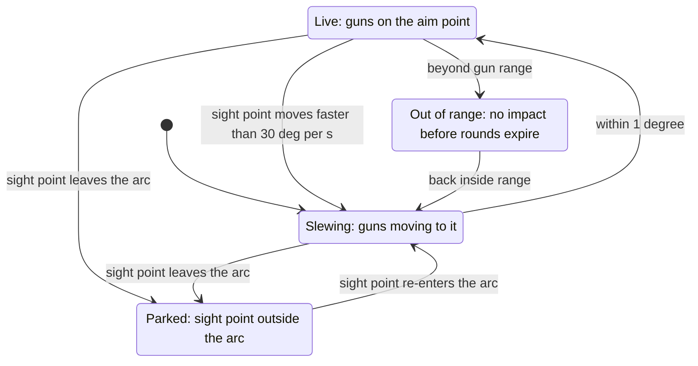

# Target camera window

> **T.O.R.E: Tasteful Opinionated Reverse Engineered.**
> The thing being reverse engineered is the *experience*, not the executable. We
> trace what a player does and what the game does back, down to the numbers they
> would notice. How the original code achieved it is history: useful evidence,
> never a blueprint. If a sentence below reads like an instruction to reproduce
> the original's internals, it is out of date.
> <!-- tore-header v2 -->

Implementation mode, 2026-09-21. View 4 presents the selected target using the
original instrument pieces and font, with a grayscale scene behind dark text.

## Evidence and behavior

The local 1999 EA/Jane's Fighters Anthology manual, printed page 101 (PDF page
105), specifies type/callsign, activity, clock bearing with Hi/Lo, damage,
tactical goal and pilot skill. PDF SHA-256:
`1a082378a8e8cd163ed6b398efcc1df80b67c2f104f6b90ac0733c88d58e26c3`.
The page was rendered and inspected from `.local/missile-update/manual.pdf`.
John's two supplied screenshots corroborate layout, the mission-objective label,
and NM/KTS fields. Their executable build identity is unknown. They do not
establish timing or hidden behavior. John requested a three-second alternation
on 2026-09-21, an opinionated timing choice.

- Type appears at the top; the camera shows the selected object's live geometry.
- John requested on 2026-09-21 that the target fill the view along the player's
  sight line, with the camera between player and target and no farther than
  one nautical mile from the target. The camera moves along the complete
  player-to-target line, including elevation, and faces the target. Automatic
  magnification fits the target regardless of range or aspect.
- John requested on 2026-09-21 a background about 10% darker. After grayscale
  conversion, scenery (sky, terrain and clouds) uses 90% of its former brightness.
  Aircraft and static objects retain their brightness, as do text and the frame.
- John requested on 2026-09-21 a 24-frame-per-second target-camera refresh.
  Requests follow a wall-clock 24 Hz phase, independent of the simulation clock
  and other camera panels. A slow host skips missed frames rather than queuing
  bursts. GPU readbacks remain asynchronous, so delivered rate depends on the host.
- A black damage bar means undamaged; fully white means destroyed.
- Bearing uses 12 at the nose, 3 right, 6 aft, 9 left, relative to player heading.
- John requested on 2026-09-21 that HI/LO use elevation relative to the level
  horizontal plane through the player, independent of aircraft pitch and bank.
  HI means strictly above +10 degrees; LO means strictly below -10 degrees.
  Exactly +/-10 degrees and all angles between them show neither. This requested
  threshold is opinionated; the manual does not give the original number.
- Bottom right alternates slant distance in NM and ground speed in KTS every
  360 simulation ticks at 120 Hz, starting with distance. Pausing freezes it.
- The objective row shows only `Obj: Survive` or `Obj: Destroy`, relative to the
  player's assignment. Survive identifies an escorted friendly or a friendly
  marked must-survive in mission requirements. Destroy identifies an enemy
  explicitly required by the player's destroy assignment. Other contacts have
  no objective label. Allegiance alone does not establish a requirement.
  In a multiplayer game "friendly" is the viewer's own side, and an aircraft a
  respawn or a revival added carries the objective of the aircraft it
  continues ([debrief, objectives in a game with
  respawns](debrief.md#objectives-in-a-game-with-respawns); agent decision of
  the lobby pass's follow-up F1).
- Activity, tactical goal and skill keep their existing independent meanings.
- Goal A means attack, E evade, N neutral, T takeoff, C crash, L land.
  Underline A/E only when directed at the player. Skill has 0..3 dots.
  T covers waiting on the runway, taxiing and the takeoff itself. L covers
  holding at marshal, the landing and the landed aircraft. Keeping L after the
  aircraft stops is an agent decision (2026-09-23): rollout and parking end the
  same landing sequence, and the manual lists no separate code for it.

## Fitted presentation and unresolved evidence

Agent choices: round clock bearing to the nearest hour and speed to whole
knots; range has one decimal.
Damage is one minus current/initial hit points, clamped to 0..1, filling upward.
The camera uses the player's position and interpolated target position to
establish the viewing line. It sits one nautical mile (6,076 feet using the
existing simulation convention) behind the target along that line. Agent choice:
when player-to-target range is at or below one nautical mile, it stays at the
player position rather than moving behind the player. Coincident positions
remain finite and use that same position. Displayed range, bearing and Hi/Lo
still measure from the player, never from this presentation camera.
Agent-chosen framing keeps image roll level and fits aircraft mesh vertices into
90% of image width and 52% of image height, reserving the top/bottom text rows.
The single objective row is at y=110 in the 162 by 160 window and uses the
original instrument font.
One dimension fills that area without cropping the other. Framing converts render-origin-relative mesh vertices back to world coordinates
before projection. Zoom follows projected
geometry each camera refresh, so range, target size, and aspect cannot leave a
small target surrounded by empty space. Ground objects use their oriented bounds.
This framing rule expresses John's requested behavior; the exact margins and
bounds fit are fitted implementation choices. Empty/degenerate geometry keeps
unit zoom; points inside the one-foot near plane cannot supply a usable fit.
To address surface flicker during magnification, the target camera's near clip
is half the nearest fitted subject depth, with a one-foot minimum. This fitted
choice retains every fitted subject vertex. The shared
[reversed-depth mapping](../ARCHITECTURE.md#flight-presentation-and-measurement)
also preserves distant surface separation with the default one-foot near plane.
Foreground scenery closer than that plane can be clipped in this camera only.
Ordinary views keep their existing one-foot near clip. True coplanar geometry
and source-model defects are not repaired by this precision change.
Text is shortened to its pixel budget so it cannot overlap the goal/damage strip.

Existing aircraft activity and skill are read only. Pursuing/attacking maps to
A; defending/evading/breaking maps to E; destroyed maps to C. Other current
activities map to N. SEARCHING, ACQUIRING and REJOINING are explicit neutral
goal mappings from the [AI awareness service](ai-awareness.md); searching and
rejoining never imply an active weapon target. An attack goal's player underline
uses the existing selected target identity. The evaded threat's identity is not exposed, so E is not
underlined. Ground objects and fixtures have unknown activity/skill/goal.
There is no invented firing prediction: activity describes current state, not
whether a launch will occur. Return-to-base is not labeled L before landing.

Unknown: original Hi/Lo threshold, exact camera pose, speed definition, bar
fill direction, complete activity wording, campaign objective loading, and
player-specific evade provenance. Next research should inspect mission objective
records and activity display contracts. No AI decisions or flight adapters change.

## AC-130 gunsight

Opinionated, requested by John on 2026-10-09 (the gunsight project; retail has
no AC-130 gunsight and no sensor camera, so none of this claims retail
parity). On the AC-130 the TARGET CAM page is the gunsight. Every other
aircraft keeps the page above unchanged. The sight itself (modes, slew, pin,
the guns' train, the pipper's ballistics) is specified in
[AC-130 linked guns](ac130-linked-guns.md#the-gunsight); this section covers what
the page and its camera show. In short: the picture always looks somewhere
(a target, a pinned point or a free line of sight the pilot slews); a circled
cross, the pipper, shows where the linked guns' rounds will land; a gun list
and a small arcs box show which guns are linked and where each is trained. The
box and diamond that mark the same point on every other view are specified in
[the aim box](ac130-linked-guns.md#the-aim-box-on-every-view).

### The camera

- **Eye point.** The camera looks from sensor dome D, the round turret on the
  left of the belly just forward of the wing root, not from the aircraft's
  centre. Its own gimbal is the hemisphere below the aircraft: its elevation
  stops at the horizon (the sim clamps the sight's look; the page reads the
  limit from the look too).
- **Direction and zoom.** The camera looks along the sight's body-relative
  look angles (heading, elevation), so it follows the aircraft's bank and
  turn, roll 0. Free and pinned sights use the client's zoom, six steps whose
  vertical fields are 30, 15, 7.5, 3.75, 1.875 and 0.94 degrees (fitted,
  agent choice; `Camera.zoom` 2.15 up to 69). A tracked object keeps the
  automatic framing of the section above (camera on the eye-to-target line, at
  most one nautical mile behind the object, fitted to the object), whatever
  the zoom step.
- **Between ticks.** The look the sim reports is carried smoothly between its
  120 Hz ticks (interpolated by the frame's tick fraction, the short way round
  the heading), so a slew and the return to the default view travel at the
  sim's rate and never snap. The return travels at the sight's return speed
  (22.5 degrees a second); the page names it RETURN.
- The 3D picture still refreshes at 24 Hz; the symbology below is drawn every
  frame from the presented look, over the last picture.

### The page (138 x 114 screen pixels)

All gunsight marks are ink `[20,20,20]` with a one pixel white halo.

| Element | Where | Notes |
| --- | --- | --- |
| Crosshair | Four 3 pixel ticks, 2 to 4 pixels out from (69,57) | Camera centre, always drawn |
| Pipper | Circle of radius 9, ticks 6 to 13 pixels out, 1 pixel centre dot | The candidate gun's predicted impact; the first linked gun when none is a candidate |
| Other linked guns | 3 x 3 dot at each impact | Shows whether the group converges |
| Pinned mark | 7 x 7 square on the pin | Free slew draws none |
| Tracked mark | 11 x 11 square on the target | |
| Gun list | 25, 40, 105 at x=3, rows y=3, 14, 25 | See below |
| Name row | y=3, centred in x 22 to 122 | Target name; PINNED; SLEW; RETURN |
| Activity row | y=16 | Target activity; ZOOM n when free or pinned; notices NO GROUND POINT and L TO DROP for two seconds |
| Link rows | From y=28 | Unchanged rows, narrowed |
| Status row | y=72, centred, with a white halo | The pipper gun's readiness label |
| Objective row | y=82 | Moved up from y=90 |
| Arcs box | x 45 to 90, y 92 to 111 | Between the clock and the range |
| Clock, range | y=103 | Range is to the sight point; a tracked target keeps its NM and KTS alternation |
| Damage bar | x 133 to 137 | Tracked target only |

**Pipper states.** The sim evaluates each linked gun's pipper every tick from
where the sight point sits relative to that gun's arc and range:

The page draws them: live and solid when the guns are on the aim point. Dashed
ring with its centre dot when the status is CANNOT BEAR: the guns stop at the
arc edge, so the pipper sits where the clamped guns put their rounds. A dashed
ring with no centre dot for MAX RANGE or rounds that spend before reaching
anything. A pipper that falls off the page, or behind the camera, is parked on
the page edge in its direction with its ticks clear of the edge.

**Gun list.** The labels follow the data (25, 40, 105). Linked: a box. Linked
and READY: the box has a heavy right edge. Linked and slewing: a dashed box.
Candidate (Ctrl+7): inverse (white on ink). CANNOT BEAR, MAX RANGE or MIN
RANGE: a diagonal strike. Empty, or not fitted: a grey label struck flat.

**Status row.** READY, SLEWING, CANNOT BEAR, MAX RANGE, MIN RANGE, TERRAIN
MASK, NO LINE OF FIRE, EMPTY (the labels of `Readiness`). Only NO LINE OF FIRE
and the empty and failed states block the trigger
(`Readiness::gun_may_fire`); the rest are advisory. When the camera reaches
the bottom hemisphere's top limit the row reads GIMBAL LIMIT after an eye icon
(John, 2026-10-09: hand-drawn, not an emoji). He has not picked between two
options, so both exist and the one-line `EYE_ICON` switch in
`instruments/gunsight.rs` chooses. **Option 1 (the current default)**: the text
`<o>`, an almond and a pupil in the page's font, no asset. **Option 2**: a
hand-drawn 9 x 5 pixel eyeball bitmap (an almond outline with a round pupil).
`--target-cam-preview gimbal-text` and `gimbal-bitmap` render each.

**Arcs box.** The box spans the widest arc (C_25): heading -30 (forward) at the
left edge to -150 (aft) at the right, elevation +60 at the top to -60 at the
bottom. Inside it: a dotted line at the camera's own horizon limit (solid, with
a filled sight mark, when the camera is against it); grey corner brackets for
the candidate gun's own arc; ticks at abeam; each linked gun's actual train as
a 2 x 2 dot, the candidate's as a ring; the camera's direction as a hollow 5 x 5
square. When the camera looks outside the candidate gun's arc the outline goes
dashed, and when it looks outside the box an arrowhead sits just outside the
nearest edge, pointing the way (forward is left, aft right).

### Preview

`--panel-snapshot OUT.ppm --target-cam-preview MODE` draws the page from a
synthetic readout on a synthetic scene with the CPU raster, no GPU and no
retail scene (the imported instrument font is needed: `--aircraft ac130` and
`TORE_DATA_DIR`). Modes: free, pinned, tracked, outside, range, mask, nolos,
empty, returning, gimbal (gimbal-text and gimbal-bitmap force an eye icon),
zoom1 to zoom6.
